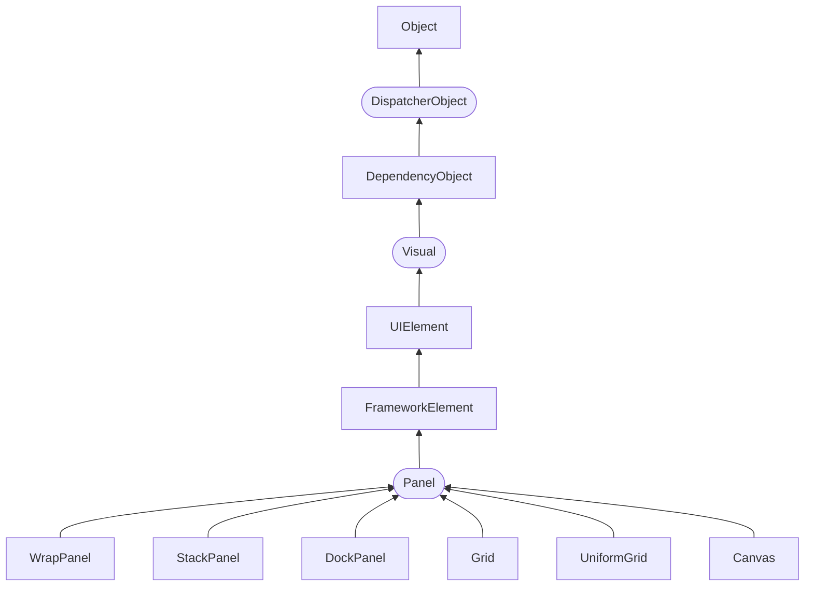

## Layout / Компоновка

- [Layout / Компоновка](#layout--компоновка)
  - [Введение в компоновку](#введение-в-компоновку)
  - [Иерархия классов](#иерархия-классов)
  - [Принципы компоновки](#принципы-компоновки)
  - [Процесс компоновки](#процесс-компоновки)
  - [Диспетчеры компоновки](#диспетчеры-компоновки)
    - [`System.Windows.Controls`](#systemwindowscontrols)
    - [`System.Windows.Controls.Primitives`](#systemwindowscontrolsprimitives)
  - [Основные диспетчеры](#основные-диспетчеры)
    - [StackPanel](#stackpanel)
    - [WrapPanel](#wrappanel)
    - [DockPanel](#dockpanel)
    - [Присоединяемые свойства XAML (attached properties)](#присоединяемые-свойства-xaml-attached-properties)
      - [Определение присоединенного свойства](#определение-присоединенного-свойства)
      - [Использование в XAML](#использование-в-xaml)
      - [Пример](#пример)
    - [VirtualizingPanel](#virtualizingpanel)
      - [VirtualizingStackPanel](#virtualizingstackpanel)
      - [DataGridCellsPanel](#datagridcellspanel)
    - [Grid](#grid)
      - [Установка размеров](#установка-размеров)
        - [Автоматические размеры](#автоматические-размеры)
        - [Абсолютные размеры](#абсолютные-размеры)
        - [Пропорциональные размеры](#пропорциональные-размеры)
      - [Программное добавление элементов и IAddChild](#программное-добавление-элементов-и-iaddchild)
      - [GridSplitter](#gridsplitter)
    - [Canvas](#canvas)
  - [Базовые примитивы](#базовые-примитивы)
    - [UniformGrid](#uniformgrid)
    - [TabPanel](#tabpanel)
    - [ToolBarOverflowPanel](#toolbaroverflowpanel)
    - [ToolBarPanel](#toolbarpanel)
  - [Основные свойства компоновки элементов](#основные-свойства-компоновки-элементов)
    - [Ширина и высота](#ширина-и-высота)
    - [Выравнивание](#выравнивание)
      - [`HorizontalAlignment`](#horizontalalignment)
      - [`VerticalAlignment`](#verticalalignment)
    - [Отступы / `Margin`](#отступы--margin)
    - [`Panel.ZIndex`](#panelzindex)

### Введение в компоновку
Чтобы перейти уже непосредственно к созданию красивых интерфейсов и их компонентов, сначала необходимо познакомиться с компоновкой. <dfn title="компоновка">Компоновка</dfn> (layout) представляет собой процесс размещения элементов внутри контейнера. Возможно, вы обращали внимание, что одни программы и веб-сайты на разных экранах с разным разрешением выглядят по-разному: где-то лучше, где-то хуже. В большинстве своем такие программы используют жестко закодированные в коде размеры элементов управления. WPF уходит от такого подхода в пользу так называемого "резинового дизайна", где весь процесс позиционирования элементов осуществляется с помощью компоновки.

Благодаря компоновке мы можем удобным нам образом настроить элементы интерфейса, позиционировать их определенным образом. Например, элементы компоновки в WPF позволяют при ресайзе — сжатии или растяжении — масштабировать элементы, что очень удобно, а визуально не создает всяких шероховатостей типа незаполненных пустот на форме.

В WPF компоновка осуществляется при помощи специальных контейнеров. Фреймворк предоставляет нам следующие контейнеры: **`Grid`**, **`UniformGrid`**, **`StackPanel`**, **`WrapPanel`**, **`DockPanel`** и **`Canvas`**.

Различные контейнеры могут содержать внутри себя другие контейнеры. Кроме данных контейнеров существует еще ряд элементов, такие как `TabPanel`, которые могут включать другие элементы и даже контейнеры компоновки, однако на саму компоновку не столь влияют в отличие от выше перечисленных. Кроме того, если нам не хватает стандартных контейнеров, мы можем определить свои с нужной нам функциональностью.

Контейнеры компоновки позволяют эффективно распределить доступное пространство между элементами, найти для него наиболее предпочтительные размеры.

### Иерархия классов
Все выше перечисленные контейнеры компоновки наследуются от абстрактного класса `Panel`, а само дерево наследования можно представить следующим образом:



где:


Ниже показан базовый обзор некоторых ключевых ветвей иерархии классов. Важно отметить, что основные пространства имен WPF начинаются в `System.Windows` (например, `System.Windows`, `System.Windows.Controls` и `System.Windows.Media`). Единственным исключением являются пространства имен, начинающиеся с `System.Windows.Forms`, которые относятся к инструментам Windows Forms.

- `System.Threading.DispatcherObject`

    Приложения WPF используют знакомую однопоточную модель (single-thread affinity — STA), а это означает, что весь пользовательский интерфейс принадлежит единственному потоку. Взаимодействовать с элементами пользовательского интерфейса из других потоков небезопасно. Чтобы содействовать работе этой модели, каждое WPF-приложение управляется диспетчером, координирующим сообщения (появляющиеся в результате клавиатурного ввода, перемещений курсора мыши и таких процессов платформы, как компоновка). Будучи унаследованным от `DispatcherObject`, каждый элемент пользовательского интерфейса может удостовериться, выполняется ли код в правильном потоке, и обратиться к диспетчеру, чтобы направить код в поток пользовательского интерфейса.

    Этот тип включает одно свойство, представляющее интерес — `Dispatcher`, которое возвращает ассоциированный объект `System.Windows.Threading.Dispatcher`. Класс `Dispatcher` — это точка входа в очередь событий приложения WPF, предоставляющая базовые конструкции для работы с параллелизмом и многопоточностью. По большому счету, это низкоуровневый класс, который в большинстве приложений WPF может быть проигнорирован.

- `System.Windows.DependencyObject`

    В WPF центральный путь взаимодействия с экранными элементами пролегает через свойства. На ранней стадии цикла проектирования архитекторы WPF решили создать более мощную модель свойств, которая положена в основу таких средств, как уведомления об изменениях, наследуемые значения по умолчанию и более экономичное хранилище свойств. Конечным результатом стало средство свойств зависимости (dependency property). За счет наследования от `DependencyObject`, классы WPF получают поддержку свойств зависимости.

    Базовый класс `DependencyObject` предоставляет два ключевых метода для всех производных типов: `GetValue()` и `SetValue()`. С помощью этих членов можно устанавливать само свойство. Другие части инфраструктуры позволяют "регистрировать" тех, кто может использовать свойства зависимости или присоединяемые свойства.

    Хотя свойства зависимости — это ключевой аспект разработки WPF, большую часть времени их детали скрыты от глаз.

- `System.Windows.Media.Visual`

    Каждый элемент, появляющийся в WPF, в основе своей является `Visual`. Класс `Visual` можно воспринимать как единственный объект рисования, инкапсулирующий в себе инструкции рисования, дополнительные подробности рисования (наподобие отсечения, прозрачности и настроек трансформации) и базовую функциональность (вроде проверки попадания). Класс `Visual` также обеспечивает связь между управляемыми библиотеками WPF и сборкой `milcore.dll`, которая визуализирует отображение. Любой класс, унаследованный от `Visual`, обладает способностью отображаться в окне. Если вы предпочитаете создавать свой пользовательский интерфейс с применением легковесного API-интерфейса, не обладающего высокоуровневыми средствами WPF, то можете программировать непосредственно с использованием объектов `Visual`.

    Применение типа `Visual` (и его потомков вроде `DrawingVisual`) обеспечивает наиболее легковесный способ визуализации графических данных, но также подразумевает участие большого объема управляемого кода для обеспечения работы всех необходимых служб.

- `System.Windows.UIElement`

    Класс `UIElement` добавляет поддержку таких сущностей WPF, как компоновка (layout), ввод (input), фокус (focus) и события (events) — все, что команда разработчиков WPF называет аббревиатурой LIFE. Например, именно здесь определен двухшаговый процесс измерения и организации компоновки. Здесь же щелчки кнопками мыши и нажатия клавиш трансформируются в более удобные события, такие как `MouseEnter`. Как и со свойствами, WPF реализует расширенную систему передачи событий, именуемую маршрутизируемыми событиями (routed events).

- `System.Windows.FrameworkElement`

    Класс `FrameworkElement` — конечный пункт в центральном дереве наследования WPF. Он реализует некоторые члены, которые просто определены в `UIElement`. Например, `UIElement` устанавливает фундамент для системы компоновки WPF, но `FrameworkElement` включает ключевые свойства (вроде `HorizontalAlignment` и `Margin`), которые поддерживают его. `UIElement` также добавляет поддержку привязки данных, анимации и стилей — все они являются центральными средствами.

- `System.Windows.Shapes.Shape`

    От этого класса наследуются базовые фигуры, такие как `Rectangle`, `Polygon`, `Ellipse`, `Line` и `Path`. Эти фигуры могут использоваться наряду с более традиционными графическими элементами Windows вроде кнопок и текстовых полей.

- `System.Windows.Controls.Control`

    Элемент управления (control) — это элемент, который может взаимодействовать с пользователем. К нему очевидным образом относятся такие классы, как `TextBox`, `Button` и `ListBox`. Класс `Control` добавляет дополнительные свойства для установки шрифта, а также цветов переднего плана и фона. Но наиболее интересная деталь, которую он предоставляет — это поддержка шаблонов, которая позволяет заменять стандартный внешний вид элемента управления собственным рисованием.

    `Control`, так же, определяет свойства для установки размеров элемента управления, прозрачности, порядка обхода по нажатию клавиши `<Tab>`, дисплейного курсора, цвета фона и т.д.

- `System.Windows.Controls.ContentControl`

    Это базовый класс для всех элементов управления, которые имеют отдельный фрагмент содержимого. Сюда относится все — от скромной метки `Label` до окна `Window`. Наиболее впечатляющая часть этой модели заключается в том, что единственный фрагмент содержимого может быть чем угодно — от обычной строки до панели компоновки, содержащей комбинацию других фигур и элементов управления.

    Например, когда речь идет о типичном элементе управления "кнопка", то обычно предполагается, что его содержимым будет базовый строковый литерал (ОК, Cancel, Abort и т.п.). В случае использования XAML для описания элемента управления WPF, и значение, которое необходимо присвоить свойству Content, может быть выражено в виде простой строки, можете установить свойство Content внутри открывающего определения элемента.

    Содержимое может быть любым. Например, предположим, что нужна "кнопка", которая содержит в себе нечто более интересное, чем простая строка, возможно, специальную графику или текст. На других платформах построения пользовательских интерфейсов, таких как Windows Forms, пришлось бы строить специальный элемент управления, что потребовало бы написания значительного объема кода и сопровождения нового класса. С моделью содержимого WPF это не требуется.

    Когда в свойстве `Content` должно быть установлено значение, которое не может быть выражено простым массивом символов, его нельзя присвоить с использованием атрибута в открывающем определении элемента управления. Вместо этого понадобится определить данные содержимого неявно, внутри контекста элемента.

- `System.Windows.Controls.ItemsControl`

    Это базовый класс для всех элементов управления, которые отображают коллекцию каких-то единиц информации, вроде `ListBox` и `TreeView`. Списочный элемент управления замечательно гибок; например, используя встроенные средства класса `ItemsControl`, можно трансформировать обычный `ListBox` в список переключателей, список флажков, упорядоченный набор картинок или комбинацию совершенно разных элементов по своему выбору. Фактически в WPF все меню, панели инструментов и линейки состояния на самом деле являются специализированными списками и классами.

- `System.Windows.Controls.Panel`

    Это базовый класс для всех контейнеров компоновки — элементов, которые содержат в себе один или более дочерних элементов и упорядочивают их в соответствии с определенными правилами компоновки. Эти контейнеры образуют фундамент системы компоновки WPF, и их использование — ключ к упорядочиванию содержимого наиболее привлекательным и гибким способом.

### Принципы компоновки

В WPF при компоновке и расположении элементов внутри окна нам надо придерживаться следующих принципов:

- Нежелательно указывать явные размеры элементов (за исключением минимальных и максимальных размеров). Размеры должны определяться контейнерами.

- Нежелательно указывать явные позицию и координаты элементов внутри окна. Позиционирование элементов всецело должно быть прерогативой контейнеров. И контейнер сам должен определять, как элемент будет располагаться. Если нам надо создать сложную систему компоновки, то мы можем вкладывать один контейнер в другой, чтобы добиться максимально удобного расположения элементов управления.

### Процесс компоновки
Процесс компоновки проходит два этапа: измерение (measure) и расстановка (arrange). На этапе измерения контейнер производит измерение предпочтительного для дочерних элементов места. Однако не всегда контейнер имеет достаточно места, чтобы расставить все элементы по их предпочтительным размером, поэтому их размеры приходится усекать. Затем происходит этап непосредственной расстановки дочерних элементов внутри контейнера.

Теперь рассмотрим контейнеры компоновки подробнее.

### Диспетчеры компоновки
Окно WPF-приложения обычно представлено корневым элементом `Window`. Дочерним элементом корневого элемента является диспетчер компоновки, который в свою очередь содержит любое количество элементов (в том числе, вложенных диспетчеров компоновки), определяющих пользовательский интерфейс. Диспетчер компоновки является объектом класса, унаследованного от абстрактного класса `System.Windows.Controls.Panel`.

Производные классы `Panel` из пространств имен `System.Windows.Controls` и `System.Windows.Controls.Primitives` различаются по назначению и функциональности. Основные различия:
- **Назначение**: `System.Windows.Controls` содержит классы для организации макета, в то время как `System.Windows.Controls.Primitives` содержит базовые компоненты для построения средств управления.

- **Функциональность**: Производные классы `Panel` в `System.Windows.Controls` обеспечивают различные макеты, тогда как классы в `System.Windows.Controls.Primitives` обеспечивают базовые компоненты для создания сложных средств управления.

#### `System.Windows.Controls`
Этот пространство имен содержит производные классы `Panel`, которые используются для создания пользовательского интерфейса приложений. 

Основные панели (диспетчеры компоновки, контейнерные элементы управления) WPF:

| Элемент | Описание
-- | --
**`Canvas`** | Позволяет размещать дочерние элементы с помощью координат. Элементы остаются в точности там, где были размещены во время проектирования
**`DockPanel`** | Прижимает дочерние элементы к краям панели. Привязывает содержимое к определенной стороне панели — `Тор` (верхняя), `Bottom` (нижняя), `Left` (левая) или `Right` (правая)
**`Grid`** | Располагает содержимое внутри серии ячеек, расположенных в табличной сетке (использует таблицу для расположения элементов)
**`StackPanel`** | Выводит содержимое по вертикали или горизонтали, в зависимости от значения свойства `Orientation`
**`WrapPanel`** | Располагает элементы в ряд, а затем переносит их на следующую строку, если не хватает места. Позиционирует содержимое слева направо, перенося на следующую строку по достижении границы панели. Последовательность размещения происходит сначала сверху вниз или сначала слева направо, в зависимости от значения свойства `Orientation`
**`VirtualizingStackPanel`** | Определяет базовую структуру для панелей виртуализации. Оптимизирует отображение большого количества элементов.

Эти классы предназначены для организации макета в приложениях WPF.

#### `System.Windows.Controls.Primitives`
Это пространство имен содержит базовые компоненты, используемые для создания средств управления. Оно включает компоненты, такие как `Thumb`, `RepeatButton`, и другие базовые элементы, которые могут быть частью более сложных средств управления, но не являются производными классами `Panel` напрямую.

Панели из базовых примитивов WPF:

| Элемент | Описание
-- | --
**`UniformGrid`** | Базовый компонент, который обеспечивает простой и универсальный способ упорядочивания содержимого в сетке, где все ячейки имеют одинаковый размер
**`TabPanel`** | Используется для организации макета вкладок в элементе управления `TabControl`. Он обеспечивает базовую функциональность для расположения заголовков вкладок и переключения между ними.
**`ToolBarPanel`** | Используется для организации элементов внутри элемента управления `ToolBar`. Он наследуется от `StackPanel` и обеспечивает базовую функциональность для расположения кнопок и других элементов управления в панели инструментов.
**`ToolBarOverflowPanel`** | Используется для обработки ситуации, когда элементы в панели инструментов (`ToolBar`) не помещаются в доступное пространство. В этом случае избыточные элементы автоматически перемещаются в выпадающее меню, которое отображается на панели инструментов в виде стрелки.

В отличие от `System.Windows.Controls`, классы в `System.Windows.Controls.Primitives` не предназначены для создания макетов, а скорее для построения базовых компонентов интерфейса.

### Основные диспетчеры

#### StackPanel

Панель `StackPanel` располагает содержащиеся в нем элементы управления либо в вертикальном столбце (по умолчанию), либо в горизонтальной строке (если в атрибут `Orientation` записано значение “Vertical”). Если в панель `StackPanel` добавлено больше элементов управления, чем может быть отображено по ширине/высоте `StackPanel`, лишние элементы обрезаются и не отображаются.

Определение:
```cs
public class StackPanel : System.Windows.Controls.Panel, System.Windows.Controls.Primitives.IScrollInfo
```

Описание: https://learn.microsoft.com/en-us/dotnet/api/system.windows.controls.stackpanel?view=windowsdesktop-9.0

При выводе элементов сверху вниз элементы по умолчанию растягиваются по горизонтали. Это поведение можно изменить с помощью свойств `HorizontalAlignment` и `VerticalAlignment`.

Рассмотрим панель `StackPanel` со следующим содержимым:
```xml
<StackPanel HorizontalAlignment="Center">
  <Label Content="Регистрация пользователя" />
  <Label Content="ФИО" />
  <TextBox Width="200" />
  <Label Content="Email" />
  <TextBox Width="200" />
  <Button Content="Зарегистрироваться" />
</StackPanel>
```

Это более простой элемент компоновки. Он располагает все элементы в ряд либо по горизонтали, либо по вертикали в зависимости от ориентации. Например,
```xml
<Window x:Class="LayoutApp.MainWindow"
        xmlns="http://schemas.microsoft.com/winfx/2006/xaml/presentation"
        xmlns:x="http://schemas.microsoft.com/winfx/2006/xaml"
        xmlns:d="http://schemas.microsoft.com/expression/blend/2008"
        xmlns:mc="http://schemas.openxmlformats.org/markup-compatibility/2006"
        xmlns:local="clr-namespace:LayoutApp"
        mc:Ignorable="d"
        Title="StackPanel" Height="300" Width="300">
    <Grid>
        <StackPanel>
            <Button Background="Blue" Content="1" />
            <Button Background="White" Content="2" />
            <Button Background="Red" Content="3" />
        </StackPanel>
    </Grid>
</Window>
```

В данном случае для свойства `Orientation` по умолчанию используется значение `Vertical`, то есть `StackPanel` создает вертикальный ряд, в который помещает все вложенные элементы сверху вниз. Мы также можем задать горизонтальный стек. Для этого нам надо указать свойство `Orientation="Horizontal"`:
```xml
<Window x:Class="LayoutApp.MainWindow"
        xmlns="http://schemas.microsoft.com/winfx/2006/xaml/presentation"
        xmlns:x="http://schemas.microsoft.com/winfx/2006/xaml"
        xmlns:d="http://schemas.microsoft.com/expression/blend/2008"
        xmlns:mc="http://schemas.openxmlformats.org/markup-compatibility/2006"
        xmlns:local="clr-namespace:LayoutApp"
        mc:Ignorable="d"
        Title="StackPanel" Height="300" Width="300">
    <StackPanel Orientation="Horizontal">
        <Button Background="Blue" MinWidth="30" Content="1" />
        <Button Background="White" MinWidth="30" Content="2" />
        <Button Background="Red" MinWidth="30" Content="3" />
    </StackPanel>
</Window>
```

При горизонтальной ориентации все вложенные элементы располагаются слева направо. Если мы хотим, чтобы наполнение стека начиналось справа налево, то нам надо задать свойство `FlowDirection`: `<StackPanel Orientation="Horizontal" FlowDirection="RightToLeft">`. По умолчанию это свойство имеет значение `LeftToRight` — то есть слева направо.

`StackPanel` реализует интерфейс `IScrollInfo` для поддержки логической прокрутки. Это означает, что вместо традиционной прокрутки на определенное количество пикселей, `StackPanel` прокручивается до следующего элемента в логическом дереве. Это поведение полезно, когда необходимо прокручивать содержимое в логических единицах, а не в физических пикселях.

Когда `StackPanel` используется внутри `ScrollViewer` с установленным свойством `CanContentScroll` равным `true`, он позволяет выполнять прокрутку до следующего элемента, а не на определенное количество пикселей. Это обеспечивает более удобный и интуитивный способ прокрутки содержимого, особенно когда элементы имеют разные размеры или когда необходимо прокручивать до конкретных элементов, а не на определенное расстояние.

Таким образом, реализация `IScrollInfo` в `StackPanel` позволяет разработчикам создавать пользовательские панели с особым поведением прокрутки, что может быть полезно в различных сценариях, таких как создание интерфейсов с особыми требованиями к прокрутке.

#### WrapPanel

Панель `WrapPanel` выводит дочерние элементы последовательно слева направо (либо сверху вниз, если для атрибута `Orientation` установлено значение “Vertical”) и при достижении границы окна переходит на новую строку (столбец). При изменении размеров окна панель перераспределяет компоненты таким образом, чтобы они находились в окне.

Определение:
```cs
public class WrapPanel : System.Windows.Controls.Panel
```

Описание: https://learn.microsoft.com/en-us/dotnet/api/system.windows.controls.wrappanel?view=windowsdesktop-9.0

Рассмотрим панель `WrapPanel` со следующим содержимым:
```xml
<WrapPanel>
  <Label Content="Регистрация пользователя" />
  <Label Content="ФИО" />
  <TextBox Width="200" />
  <Label Content="Email" />
  <TextBox Width="200" />
  <Button Content="Зарегистрироваться" />
</WrapPanel>
```

Эта панель, подобно `StackPanel`, располагает все элементы в одной строке или колонке в зависимости от того, какое значение имеет свойство `Orientation` — `Horizontal` или `Vertical`. Главное отличие от `StackPanel` — если элементы не помещаются в строке или столбце, создаются новые столбец или строка для не поместившихся элементов.
```xml
<Window x:Class="LayoutApp.MainWindow"
        xmlns="http://schemas.microsoft.com/winfx/2006/xaml/presentation"
        xmlns:x="http://schemas.microsoft.com/winfx/2006/xaml"
        xmlns:d="http://schemas.microsoft.com/expression/blend/2008"
        xmlns:mc="http://schemas.openxmlformats.org/markup-compatibility/2006"
        xmlns:local="clr-namespace:LayoutApp"
        mc:Ignorable="d"
        Title="WrapPanel" Height="250" Width="300">
    <WrapPanel>
        <Button Background="AliceBlue" Content="Кнопка 1" />
        <Button Background="Blue" Content="Кнопка 2" />
        <Button Background="Aquamarine" Content="Кнопка 3" Height="30"/>
        <Button Background="DarkGreen" Content="Кнопка 4" Height="20"/>
        <Button Background="LightGreen" Content="Кнопка 5"/>
        <Button Background="RosyBrown" Content="Кнопка 6" Width="80" />
        <Button Background="GhostWhite" Content="Кнопка 7" />
    </WrapPanel>
</Window>
```

В горизонтальном стеке те элементы, у которых явным образом не установлена высота, будут автоматически принимать высоту самого большого элемента из стека.

Вертикальный `WrapPanel` делается аналогично:
```xml
<WrapPanel Orientation="Vertical">
    <Button Background="AliceBlue" Content="Кнопка 1" Height="50" />
    <Button Background="Blue" Content="Кнопка 2" />
    <Button Background="Aquamarine" Content="Кнопка 3" Width="60"/>
    <Button Background="DarkGreen" Content="Кнопка 4" Width="80"/>
    <Button Background="LightGreen" Content="Кнопка 5"/>
    <Button Background="RosyBrown" Content="Кнопка 6" Height="80" />
    <Button Background="GhostWhite" Content="Кнопка 7" />
    <Button Background="Bisque" Content="Кнопка 8" />
</WrapPanel>
```

В вертикальном стеке элементы, у которых явным образом не указана ширина, автоматически принимают ширину самого широкого элемента.

Мы также можем установить для всех вложенных элементов какую-нибудь определенную ширину (с помощью свойства `ItemWidth`) или высоту (свойство `ItemHeight`):
```xml
<WrapPanel ItemHeight="30" ItemWidth="80" Orientation="Horizontal">
    <Button Background="AliceBlue" Content="1" />
    <Button Background="Blue" Content="2" />
    <Button Background="Aquamarine" Content="3"/>
    <Button Background="DarkGreen" Content="4"/>
    <Button Background="LightGreen" Content="5"/>
    <Button Background="AliceBlue" Content="6"  />
    <Button Background="Blue" Content="7" />
</WrapPanel>
```

#### DockPanel

Панель `DockPanel` пристыковывает дочерние элементы к различным сторонам панели: `Top`, `Bottom`, `Left`, `Right`. Атрибут `LastChildFill` по умолчанию имеет значение `True`, что означает, что последний дочерний элемент управления будет занимать всё оставшееся пространство панели.

Определение:
```cs
public class DockPanel : System.Windows.Controls.Panel
```

Описание: https://learn.microsoft.com/en-us/dotnet/api/system.windows.controls.dockpanel?view=windowsdesktop-9.0

Рассмотрим панель `DockPanel` со следующим содержимым:
```xml
<DockPanel LastChildFill="False">
  <Label DockPanel.Dock="Top" Content="Регистрация пользователя" />
  <Label DockPanel.Dock="Left" Content="ФИО" />
  <TextBox DockPanel.Dock="Left" Width="200" />
  <Label DockPanel.Dock="Right" Content="Email" />
  <TextBox DockPanel.Dock="Right" Width="200" />
  <Button DockPanel.Dock="Bottom" Content="Зарегистрироваться" />
</DockPanel>
```

Этот контейнер прижимает свое содержимое к определенной стороне внешнего контейнера. Для этого у вложенных элементов надо установить сторону, к которой они будут прижиматься с помощью свойства `DockPanel.Dock`. Например,
```xml
<Window x:Class="LayoutApp.MainWindow"
        xmlns="http://schemas.microsoft.com/winfx/2006/xaml/presentation"
        xmlns:x="http://schemas.microsoft.com/winfx/2006/xaml"
        xmlns:d="http://schemas.microsoft.com/expression/blend/2008"
        xmlns:mc="http://schemas.openxmlformats.org/markup-compatibility/2006"
        xmlns:local="clr-namespace:LayoutApp"
        mc:Ignorable="d"
        Title="DockPanel" Height="250" Width="300">
    <DockPanel LastChildFill="True">
        <Button DockPanel.Dock="Top" Background="AliceBlue" Content="Верхняя кнопка" />
        <Button DockPanel.Dock="Bottom" Background="BlanchedAlmond" Content="Нижняя кнопка" />
        <Button DockPanel.Dock="Left" Background="Aquamarine" Content="Левая кнопка" />
        <Button DockPanel.Dock="Right" Background="DarkGreen" Content="Правая кнопка" />
        <Button Background="LightGreen" Content="Центр" />
    </DockPanel>
</Window>
```

В итоге получаем массив кнопок, каждая из которых прижимается к определенной стороне элемента `DockPanel`. Причем у последней кнопки мы можем не устанавливать свойство `DockPanel.Dock`. Она уже заполняет все оставшееся пространство. Такой эффект получается благодаря установке у `DockPanel` свойства `LastChildFill="True"`, которое означает, что последний элемент заполняет все оставшееся место. Если у этого свойства поменять `True` на `False`, то кнопка прижмется к левой стороне, заполнив только о место, которое ей необходимо.

Также обратите внимание на порядок прикрепления к кнопкам свойства `DockPanel.Dock`. Например, если мы изменим порядок на:
```xml
<DockPanel LastChildFill="True">
    <Button DockPanel.Dock="Top" Background="AliceBlue" Content="Верхняя кнопка" />
    <Button DockPanel.Dock="Left" Background="Aquamarine" Content="Левая кнопка" />
    <Button DockPanel.Dock="Right" Background="DarkGreen" Content="Правая кнопка" />
    <Button DockPanel.Dock="Bottom" Background="BlanchedAlmond" Content="Нижняя кнопка" />
    <Button Background="LightGreen" Content="Центр" />
</DockPanel>
```

В этом случае нижняя кнопка уже будет заполнять меньшее место.

Мы также можем прижать к одной стороне сразу несколько элементов. В этом случае они просто будут располагаться по порядку:
```xml
<DockPanel LastChildFill="True">
    <Button DockPanel.Dock="Top" Background="AliceBlue" Content="Верхняя кнопка 1" />
    <Button DockPanel.Dock="Top" Background="AliceBlue" Content="Верхняя кнопка 2" />
    <Button DockPanel.Dock="Bottom" Background="BlanchedAlmond" Content="Нижняя кнопка" />
    <Button DockPanel.Dock="Left" Background="Aquamarine" Content="Левая кнопка1" />
    <Button DockPanel.Dock="Left" Background="Aquamarine" Content="Левая кнопка2" />
    <Button DockPanel.Dock="Right" Background="DarkGreen" Content="Правая кнопка" />
    <Button Background="LightGreen" Content="Центр" />
</DockPanel>
```

Контейнер `DockPanel` особенно удобно использовать для создания стандартных интерфейсов, где верхнюю и левую часть могут занимать какие-либо меню, нижнюю — строка состояния, правую — какая-то дополнительная информация, а в центре будет находиться основное содержание.

У внутренних элементов отсутствует собственный атрибут `Dock`, поэтому для определения положения элементов на панели используется синтаксис **присоединяемых свойств**.

#### Присоединяемые свойства XAML (attached properties)
В XAML поддерживается специальный синтаксис, используемый для определения значения присоединяемого свойства. Присоединяемые свойства позволяют дочернему элементу устанавливать значение какого-то свойства, которое в действительности определено в родительском элементе. Общий шаблон:

```xml
<РодительскийЭлемент>
  <ДочернийЭлемент РодительскийЭлемент.СвойствоРодительскогоЭлемента = "Значение">
</РодительскийЭлемент>
```

С помощью присоединяемых свойств можно определить значения лишь ограниченного набора свойств родительских элементов, которые определены специальным образом в классе родительского элемента.

Присоединяемые свойства в XAML, используемые в WPF, позволяют задавать дополнительные свойства для элементов, которые не определяют эти свойства непосредственно. Они объявляются в классе родительского элемента с использованием статического метода `DependencyProperty.RegisterAttached()`.

##### Определение присоединенного свойства
Чтобы объявить присоединенное свойство, необходимо выполнить следующие шаги:

1. Создание поля **`DependencyProperty`**: Это поле будет хранить информацию о присоединенном свойстве. Например:
   ```cs
   public static readonly DependencyProperty MyProperty =
    DependencyProperty.RegisterAttached(
        "My",
        typeof(string),
        typeof(MyClass), // класс, который определяет это свойство
        new PropertyMetadata(default(string)));
   ```
2. Создание методов доступа: Для работы с присоединенным свойством необходимо определить статические методы `Get` и `Set`, которые будут использоваться для получения и установки значений этого свойства:
   ```cs
   public static void SetMy(DependencyObject element, string value)
   {
       element.SetValue(MyProperty, value);
   }

   public static string GetMy(DependencyObject element)
   {
       return (string)element.GetValue(MyProperty);
   }
   ```

##### Использование в XAML
В XAML присоединенные свойства задаются с использованием синтаксиса `<attached property provider type>.<property name>`. Например, если у вас есть класс `MyClass`, который определяет присоединенное свойство `My`, его можно использовать следующим образом:
```xml
<SomeParentElement local:MyClass.My="SomeValue" />
```

Здесь `local` — это пространство имен, в котором определен класс `MyClass`.

##### Пример
Для наглядности рассмотрим пример использования присоединенного свойства для управления расположением дочерних элементов внутри контейнера:
```cs
public static readonly DependencyProperty DockProperty =
    DependencyProperty.RegisterAttached(
        "Dock",
        typeof(Dock),
        typeof(DockPanel),
        new PropertyMetadata(Dock.Top));

public static void SetDock(UIElement element, Dock value)
{
    element.SetValue(DockProperty, value);
}

public static Dock GetDock(UIElement element)
{
    return (Dock)element.GetValue(DockProperty);
}
```

В этом примере `DockPanel` использует присоединенное свойство `Dock`, чтобы определить, как дочерние элементы должны быть расположены внутри него.

Присоединенные свойства являются мощным инструментом для расширения функциональности элементов управления без необходимости их изменения или создания новых классов.

</details>

#### VirtualizingPanel

`VirtualizingPanel` — это абстрактный класс в WPF, который предоставляет базовую структуру для панелей, которые виртуализируют свою коллекцию дочерних данных. <dfn title="виртуализация">Виртуализация</dfn> означает создание визуальных контейнеров только для тех элементов, которые видны на экране, а также для нескольких элементов сверху и снизу от видимой области. Это позволяет значительно уменьшить потребление памяти и повысить производительность при работе с большими наборами данных.

Определение:
```cs
public abstract class VirtualizingPanel : System.Windows.Controls.Panel
```

Описание: https://learn.microsoft.com/en-us/dotnet/api/system.windows.controls.virtualizingpanel?view=windowsdesktop-9.0

Основные функции `VirtualizingPanel`:

1. **Оптимизация памяти**: Создание визуальных контейнеров только для видимых элементов снижает потребление памяти, что особенно важно при работе с большими коллекциями данных.

2. **Повышение производительности**: Виртуализация уменьшает накладные расходы на создание и уничтожение объектов, что делает прокрутку и отображение данных более плавным и быстрым.

3. **Базовая структура для производных классов**: `VirtualizingPanel` служит базой для производных классов, таких как `VirtualizingStackPanel`, которые реализуют виртуализацию для конкретных типов макетов.

Таким образом, `VirtualizingPanel` обеспечивает основу для создания эффективных и производительных панелей, которые могут обрабатывать большие объемы данных в приложениях WPF.

##### VirtualizingStackPanel

Определение:
```cs
public class VirtualizingStackPanel : System.Windows.Controls.VirtualizingPanel, System.Windows.Controls.Primitives.IScrollInfo
```

Описание: https://learn.microsoft.com/en-us/dotnet/api/system.windows.controls.dockpanel?view=windowsdesktop-9.0

`VirtualizingStackPanel` — это класс в WPF, который служит для оптимизации отображения больших коллекций данных в элементах управления типа `ItemsControl`, таких как `ListBox` или `ListView`. Основная цель `VirtualizingStackPanel` — уменьшить потребление памяти и повысить производительность при работе с большими наборами данных.

Основные функции:
1. **Виртуализация**: `VirtualizingStackPanel` создает визуальные контейнеры только для тех элементов, которые видны на экране, а также для нескольких элементов сверху и снизу от видимой области. Это позволяет значительно снизить количество создаваемых объектов и, следовательно, уменьшить потребление памяти34.

2. **Кэширование**: `VirtualizingStackPanel` поддерживает кэширование элементов, что позволяет хранить в памяти не только видимые элементы, но и несколько элементов сверху и снизу. Это обеспечивает плавную прокрутку, поскольку новые элементы создаются из кэша, а не создаваясь заново при прокрутке3.

3. **Режимы виртуализации**: `VirtualizingStackPanel` поддерживает два режима виртуализации: `Standard` и `Recycling`. Режим `Recycling` позволяет повторно использовать существующие визуальные контейнеры для новых элементов, что еще больше оптимизирует производительность.

4. **Использование в `ItemsControl`**: `VirtualizingStackPanel` часто используется как панель для элементов управления типа `ItemsControl`, чтобы обеспечить эффективное отображение и прокрутку больших наборов данных.

Пример использования `VirtualizingStackPanel` можно увидеть в контексте элемента управления `ListBox`. Виртуализация полезна при работе с большими наборами данных, поскольку она оптимизирует производительность, создавая визуальные контейнеры только для видимых элементов.

В этом примере мы создаем `ListBox`, который использует `VirtualizingStackPanel` для виртуализации элементов. Это особенно полезно, когда у вас большая коллекция данных.

```xml
<Window xmlns="http://schemas.microsoft.com/winfx/2006/xaml/presentation"
        xmlns:x="http://schemas.microsoft.com/winfx/2006/xaml"
        Title="VirtualizingStackPanel Sample" Height="300" Width="300">
    <Window.Resources>
        <x:Array x:Key="data" Type="sys:String">
            <sys:String>Элемент 1</sys:String>
            <sys:String>Элемент 2</sys:String>
            <!-- Добавьте много элементов сюда -->
            <sys:String>Элемент 100</sys:String>
        </x:Array>
    </Window.Resources>

    <StackPanel>
        <ListBox Height="250" ItemsSource="{StaticResource data}"
                 VirtualizingStackPanel.IsVirtualizing="True"
                 VirtualizingStackPanel.VirtualizationMode="Recycling" />
    </StackPanel>
</Window>
```

В этом примере:

- `VirtualizingStackPanel.IsVirtualizing="True"`: Включает виртуализацию, что означает, что будут созданы визуальные контейнеры только для видимых элементов.

- `VirtualizingStackPanel.VirtualizationMode="Recycling"`: Устанавливает режим виртуализации на "Recycling", который позволяет повторно использовать существующие визуальные контейнеры для новых элементов, что еще больше оптимизирует производительность.

Таким образом, `VirtualizingStackPanel` помогает улучшить производительность при работе с большими наборами данных в элементах управления типа `ListBox`.

В целом, `VirtualizingStackPanel` является важным инструментом для оптимизации производительности приложений WPF, работающих с большими объемами данных.

##### DataGridCellsPanel

`DataGridCellsPanel` — это класс в WPF, который используется для организации ячеек и заголовков столбцов внутри элемента управления `DataGrid`. Он отвечает за расположение этих элементов в сетке данных, обеспечивая правильное отображение таблицы с данными.

Определение:
```cs
public class DataGridCellsPanel : System.Windows.Controls.VirtualizingPanel
```

Описание: https://learn.microsoft.com/en-us/dotnet/api/system.windows.controls.datagridcellspanel?view=windowsdesktop-9.0

Основные функции `DataGridCellsPanel`:

1. **Расположение ячеек**: `DataGridCellsPanel` управляет расположением ячеек в сетке, гарантируя, что они правильно выравниваются и отображаются в соответствии с настройками столбцов и строк.

2. **Расположение заголовков столбцов**: Он также обеспечивает правильное расположение заголовков столбцов, которые обычно отображаются в верхней части `DataGrid`.

3. **Совместимость с `DataGrid`**: `DataGridCellsPanel` тесно связан с элементом управления `DataGrid`, обеспечивая базовую функциональность для отображения данных в табличном виде.

В отличие от других панелей, таких как `Grid` или `UniformGrid`, которые могут быть использованы для различных целей макета, `DataGridCellsPanel` специально предназначен для работы внутри `DataGrid`, что делает его важным компонентом для создания таблиц с данными в приложениях WPF.

`DataGridCellsPanel` используется внутри элемента управления `DataGrid` для организации ячеек и заголовков столбцов. Он не используется напрямую в коде или XAML для создания пользовательского интерфейса, а скорее является внутренним компонентом, который используется `DataGrid` для правильного расположения ячеек.

Однако вы можете увидеть его использование в контексте `DataGrid`, где он автоматически создается для размещения ячеек и заголовков столбцов. Вот пример использования `DataGrid`, где `DataGridCellsPanel` используется неявно:
```xml
<Window xmlns="http://schemas.microsoft.com/winfx/2006/xaml/presentation"
        xmlns:x="http://schemas.microsoft.com/winfx/2006/xaml"
        Title="DataGrid Sample" Height="300" Width="300">
    <Grid>
        <DataGrid x:Name="dataGrid" AutoGenerateColumns="True">
            <DataGrid.Columns>
                <DataGridTextColumn Header="ID" Binding="{Binding Path=ID}" />
                <DataGridTextColumn Header="Имя" Binding="{Binding Path=Name}" />
                <DataGridTextColumn Header="Возраст" Binding="{Binding Path=Age}" />
            </DataGrid.Columns>
        </DataGrid>
    </Grid>
</Window>
```

В этом примере `DataGridCellsPanel` используется неявно для расположения ячеек и заголовков столбцов внутри `DataGrid`.

Таким образом, хотя `DataGridCellsPanel` не используется напрямую, его функциональность обеспечивает правильное расположение ячеек и заголовков внутри `DataGrid`.

#### Grid

Это наиболее мощный и часто используемый контейнер, напоминающий обычную таблицу. Он содержит столбцы и строки, количество которых задает разработчик. Для определения строк используется свойство **`RowDefinitions`**, а для определения столбцов — свойство **`ColumnDefinitions`**.

Определение:
```cs
public class Grid : System.Windows.Controls.Panel, System.Windows.Markup.IAddChild
```

Описание: https://learn.microsoft.com/en-us/dotnet/api/system.windows.controls.grid?view=windowsdesktop-9.0

Пример:
```xml
<Grid.RowDefinitions>
    <RowDefinition></RowDefinition>
    <RowDefinition></RowDefinition>
    <RowDefinition></RowDefinition>
</Grid.RowDefinitions>
<Grid.ColumnDefinitions>
    <ColumnDefinition></ColumnDefinition>
    <ColumnDefinition></ColumnDefinition>
    <ColumnDefinition></ColumnDefinition>
</Grid.ColumnDefinitions>
```

Каждая строка задается с помощью вложенного элемента `RowDefinition`, который имеет открывающий и закрывающий тег. При этом задавать дополнительную информацию необязательно. То есть в данном случае у нас определено в гриде 3 строки.

Каждая столбец задается с помощью вложенного элемента `ColumnDefinition`. Таким образом, здесь мы определили 3 столбца. То есть в итоге у нас получится таблица 3х3.

Чтобы задать позицию элемента управления с привязкой к определенной ячейке `Grid`, в разметке элемента нужно прописать значения свойств `Grid.Column` и `Grid.Row`, тем самым указывая, в каком столбце и строке будет находиться элемент. Кроме того, если мы хотим растянуть элемент управления на несколько строк или столбцов, то можно указать свойства `Grid.ColumnSpan` и `Grid.RowSpan`, как в следующем примере:
```xml
<Window x:Class="LayoutApp.MainWindow"
        xmlns="http://schemas.microsoft.com/winfx/2006/xaml/presentation"
        xmlns:x="http://schemas.microsoft.com/winfx/2006/xaml"
        xmlns:d="http://schemas.microsoft.com/expression/blend/2008"
        xmlns:mc="http://schemas.openxmlformats.org/markup-compatibility/2006"
        xmlns:local="clr-namespace:LayoutApp"
        mc:Ignorable="d"
        Title="Grid" Height="250" Width="350">
    <Grid ShowGridLines="True">
        <Grid.RowDefinitions>
            <RowDefinition></RowDefinition>
            <RowDefinition></RowDefinition>
            <RowDefinition></RowDefinition>
        </Grid.RowDefinitions>
        <Grid.ColumnDefinitions>
            <ColumnDefinition></ColumnDefinition>
            <ColumnDefinition></ColumnDefinition>
            <ColumnDefinition></ColumnDefinition>
        </Grid.ColumnDefinitions>
        <Button Grid.Column="0" Grid.Row="0" Content="Строка 0 Столбец 0"  />
        <Button Grid.Column="0" Grid.Row="1" Content="Объединение трех столбцов" Grid.ColumnSpan="3"  />
        <Button Grid.Column="2" Grid.Row="2" Content="Строка 2 Столбец 2"  />
    </Grid>
</Window>
```

Атрибут `ShowGridLines="True"` у элемента `Grid` задает видимость сетки, по умолчанию оно равно `False`.

Подобно HTML-таблице, панель `Grid` может состоять из набора ячеек, каждая из которых имеет свое содержимое. При определении панели `Grid` выполняются следующие шаги:
1. Определение и конфигурирование каждого столбца.
2. Определение и конфигурирование каждой строки.
3. Назначение содержимого каждой ячейке сетки с использованием синтаксиса присоединяемых свойств.

Если не определить никаких строк и столбцов, то по умолчанию панель `Grid` будет состоять из одной ячейки, занимающей всю поверхность окна. Кроме того, если не указать ячейку для дочернего элемента, то он разместится в столбце 0 и строке 0.

Определение столбцов и строк выполняются за счет использования элементов `<Grid.ColumnDefinitions>` и `<Grid.RowDefinitions>`, которые содержат коллекции элементов `<ColumnDefinition>` и `<RowDefinition>`, соответственно.

Каждый дочерний элемент прикрепляется к ячейке сетки, используя присоединяемые свойства `Grid.Row` и `Grid.Column`. Левая верхняя ячейка определяется с помощью `Grid.Column="0"` и `Grid.Row="0"`.

Рассмотрим панель `Grid` со следующим содержимым:
```xml
<Grid>
  <Grid.RowDefinitions>
    <RowDefinition/>
    <RowDefinition/>
    <RowDefinition/>
    <RowDefinition/>
  </Grid.RowDefinitions>
  <Grid.ColumnDefinitions>
    <ColumnDefinition/>
    <ColumnDefinition/>
  </Grid.ColumnDefinitions>
  <Label Grid.Row="0" Grid.Column="0" Content="Регистрация пользователя" />
  <Label Grid.Row="1" Grid.Column="0" Content="ФИО" />
  <TextBox Grid.Row="1" Grid.Column="1" Width="200" />
  <Label Grid.Row="2" Grid.Column="0" Content="Email" />
  <TextBox Grid.Row="2" Grid.Column="1" Width="200" />
  <Button Grid.Row="3" Grid.Column="0" Content="Зарегистрироваться" />
</Grid>
```

Объединение ячеек осуществляется с помощью присоединяемых свойств `Grid.ColumnSpan` и `Grid.RowSpan` аналогично объединению ячеек в HTML-таблицах.

Рассмотрим панель `Grid` со следующим содержимым:
```xml
<Grid>
  <Grid.RowDefinitions>
    <RowDefinition/>
    <RowDefinition/>
    <RowDefinition/>
    <RowDefinition/>
  </Grid.RowDefinitions>
  <Grid.ColumnDefinitions>
    <ColumnDefinition/>
    <ColumnDefinition/>
  </Grid.ColumnDefinitions>
  <Label Grid.Row="0" Grid.Column="0" Grid.ColumnSpan="2" HorizontalAlignment="Center"
  Content="Регистрация пользователя" />
  <Label Grid.Row="1" Grid.Column="0" Content="ФИО" />
  <TextBox Grid.Row="1" Grid.Column="1" Width="200" />
  <Label Grid.Row="2" Grid.Column="0" Content="Email" />
  <TextBox Grid.Row="2" Grid.Column="1" Width="200" />
  <Button Grid.Row="3" Grid.Column="0" Grid.ColumnSpan="2" HorizontalAlignment="Center"
  Content="Зарегистрироваться" />
</Grid>
```

При определении ряда можно задать его высоту с помощью атрибута `Height`, а при определении столбца можно задать его ширину с помощью атрибута `Width`. Значение этих атрибутов может быть следующим:
- `"Auto"` — высота строчки (или ширина колонки) определяется её содержимым;
- `"`*`Число`*`"` — высота строчки (или ширина колонки) равна указанному числу точек;
- `"*"` —  высота строчки (или ширина колонки) занимает всё свободное пространство. Если строчек (колонок) с таким значением атрибута несколько, то свободное пространство перераспределяется между ними.

##### Установка размеров
Но если в предыдущем случае у нас строки и столбцы были равны друг другу, то теперь попробуем их настроить столбцы по ширине, а строки — по высоте. Есть несколько вариантов настройки размеров.

###### Автоматические размеры
Здесь столбец или строка занимает то место, которое им нужно.
```xml
<ColumnDefinition Width="Auto" />
<RowDefinition Height="Auto" />
```

###### Абсолютные размеры
В данном случае высота и ширина указываются в единицах, независимых от устройства:
```xml
<ColumnDefinition Width="150" />
<RowDefinition Height="150" />
```

Также абсолютные размеры можно задать в пикселях, дюймах, сантиметрах или точках:

<table>
<tbody>
    <tr><td>пиксели</td><td>px</td></tr>
    <tr><td>дюймы</td><td>in</td></tr>
    <tr><td>сантиметры</td><td>cm</td></tr>
    <tr><td>точки</td><td>pt</td></tr>
</tbody>
</table>

Например,
```xml
<ColumnDefinition Width="1 in" />
<RowDefinition Height="10 px" />
```

###### Пропорциональные размеры
Например, ниже задаются два столбца, второй из которых имеет ширину в четверть от ширины первого:
```xml
<ColumnDefinition Width="*" />
<ColumnDefinition Width="0.25*" />
```

Если строка или столбец имеет высоту, равную `*`, то данная строка или столбце будет занимать все оставшееся место. Если у нас есть несколько сток или столбцов, высота которых равна `*`, то все доступное место делится поровну между всеми такими сроками и столбцами. Использование коэффициентов (`0.25*`) позволяет уменьшить или увеличить выделенное место на данный коэффициент. При этом все коэффициенты складываются (коэффициент `*` аналогичен `1*`) и затем все пространство делится на сумму коэффициентов.

Например, если у нас три столбца:
```xml
<ColumnDefinition Width="*" />
<ColumnDefinition Width="0.5*" />
<ColumnDefinition Width="1.5*" />
```

В этом случае сумма коэффициентов равна 1* + 0.5* + 1.5* = 3*. Если у нас грид имеет ширину 300 единиц, то коэфициент 1* будет соответствовать пространству 300 / 3 = 100 единиц. Поэтому первый столбец будет иметь ширину в 100 единиц, второй — 100*0.5=50 единиц, а третий — 100 * 1.5 = 150 единиц.

Можно комбинировать все типы размеров. В этом случае от ширины/высоты грида отнимается ширина/высота столбцов/строк с абсолютными или автоматическими размерами, и затем оставшееся место распределяется между столбцами/строками с пропорциональными размерами.

##### Программное добавление элементов и IAddChild
`Grid` реализует интерфейс `IAddChild` для поддержки добавления дочерних элементов через XAML или код. Этот интерфейс предоставляет два метода: `AddChild` и `AddText`, которые позволяют добавлять дочерние объекты или текстовое содержимое к элементу.

Однако в современном WPF использование `IAddChild` считается устаревшим для большинства сценариев. Вместо этого рекомендуется использовать стандартные методы добавления дочерних элементов, такие как `Children.Add` для коллекций элементов.

Реализация `IAddChild` в `Grid` в основном сохранена для совместимости и поддержки определенных сценариев, таких как использование `FrameworkElementFactory`, который может обрабатывать создание дочерних объектов. Для большинства пользователей это означает, что они могут продолжать использовать `Grid` без прямого обращения к `IAddChild`, а вместо этого использовать более традиционные методы добавления элементов в коллекцию `Children`.

Например, добавление элемента в `Grid` обычно делается так:
```cs
Grid myGrid = new Grid();
TextBlock txt = new TextBlock { Text = "Пример текста" };
Grid.SetRow(txt, 0);
Grid.SetColumn(txt, 0);
myGrid.Children.Add(txt);
```

Таким образом, хотя `Grid` реализует `IAddChild`, это больше для поддержки внутренней инфраструктуры и совместимости, чем для прямого использования в пользовательском коде.

##### GridSplitter
Элемент **`GridSplitter`** помогает создавать интерфейсы наподобие элемента `SplitContainer` в WinForms, только более функциональные. Он представляет собой некоторый разделитель между столбцами или строками, путем сдвига которого можно регулировать ширину столбцов и высоту строк. В качестве примера можно привести стандартный интерфейс проводника в Windows, где разделительная полоса отделяет древовидный список папок от панели со списком файлов. Например,
```xml
<Grid>
    <Grid.ColumnDefinitions>
        <ColumnDefinition Width="*" />
        <ColumnDefinition Width="Auto" />
        <ColumnDefinition Width="*" />
    </Grid.ColumnDefinitions>
    <Button Grid.Column="0" Content="Левая кнопка" />
    <GridSplitter Grid.Column="1" ShowsPreview="False" Width="3"
        HorizontalAlignment="Center" VerticalAlignment="Stretch" />
    <Button Grid.Column="2" Content="Правая кнопка" />
</Grid>
```

Двигая центральную линию, разделяющую правую и левую части, мы можем устанавливать их ширину.

Итак, чтобы использовать элемент `GridSplitter`, нам надо поместить его в ячейку в `Grid`. По сути это обычный элемент, такой же, как кнопка. Как выше, у нас три ячейки (так как три столбца и одна строка), и `GridSplitter` помещен во вторую ячейку. Обычно строка или столбец, в которые помещают элемент, имеет для свойств `Height` или `Width` значение `Auto`.

Если у нас несколько строк, и мы хотим, чтобы разделитель распространялся на несколько строк, то мы можем задать свойство `Grid.RowSpan`:
```xml
<Grid.ColumnDefinitions>
    <ColumnDefinition Width="*" />
    <ColumnDefinition Width="Auto" />
    <ColumnDefinition Width="*" />
</Grid.ColumnDefinitions>
<Grid.RowDefinitions>
    <RowDefinition></RowDefinition>
    <RowDefinition></RowDefinition>
</Grid.RowDefinitions>
<GridSplitter Grid.Column="1" Grid.RowSpan="2" ShowsPreview="False" Width="3"
    HorizontalAlignment="Center" VerticalAlignment="Stretch" />
```

В случае, если мы задаем горизонтальный разделитель, то тогда соответственно надо использовать свойство `Grid.ColumnSpan`.

Затем нам надо настроить свойства. Во-первых, надо настроить ширину (`Width`) для вертикальных сплитеров и высоту (`Height`) для горизонтальных. Если не задать соответствующее свойство, то сплитер мы не увидим, так как он изначально очень мал.

Затем нам надо задать выравнивание. Если мы хотим, что сплитер заполнял всю высоту доступной области (то есть если у нас вертикальный сплитер), то нам надо установить для свойства **`VerticalAlignment`** значение `Stretch`.

Если же у нас горизонтальный сплитер, то надо установить свойство **`HorizontalAlignment`** в `Stretch`.

Также в примере выше используется свойство **`ShowsPreview`**. Если оно равно `False`, то изменение границ кнопок будет происходить сразу же при перемещении сплитера. Если же оно равно `True`, тогда изменение границ будет происходить только после того, как перемещение сплитера завершится, и при перемещении сплиттера мы увидим его проекцию.

В отличие от элемента `SplitContainer` в WinForms, в WPF можно установить различное количество динамически регулируемых частей окна. Немного усовершенствуем предыдущий пример:
```xml
<Grid>
    <Grid.ColumnDefinitions>
        <ColumnDefinition Width="*" />
        <ColumnDefinition Width="Auto" />
        <ColumnDefinition Width="*" />
    </Grid.ColumnDefinitions>
    <Grid.RowDefinitions>
        <RowDefinition Height="*"></RowDefinition>
        <RowDefinition Height="Auto"></RowDefinition>
        <RowDefinition Height="*"></RowDefinition>
    </Grid.RowDefinitions>
    <GridSplitter Grid.Column="1"  Grid.Row="0" ShowsPreview="False" Width="3"
        HorizontalAlignment="Center" VerticalAlignment="Stretch" />
    <GridSplitter Grid.Row="1" Grid.ColumnSpan="3" Height="3"
        HorizontalAlignment="Stretch" VerticalAlignment="Center" />
    <Canvas Grid.Column="0" Grid.Row="0">
        <TextBlock>Левая панель</TextBlock>
    </Canvas>
    <Canvas Grid.Column="2" Grid.Row="0" Background="LightGreen">
        <TextBlock>Правая панель</TextBlock>
    </Canvas>
    <Canvas Grid.ColumnSpan="3" Grid.Row="2" Background="#dfffff">
        <TextBlock Canvas.Left="60">Нижняя панель</TextBlock>
    </Canvas>
</Grid>
```

Здесь у нас сразу два сплитера: один между двумя верхними и нижней панелями, а второй — между правой и левой панелями.

#### Canvas
Контейнер `Canvas` является наиболее простым контейнером. Для размещения на нем необходимо указать для элементов точные координаты относительно сторон `Canvas`. Для установки координат элементов используются свойства `Canvas.Left`, `Canvas.Right`, `Canvas.Bottom`, `Canvas.Top`. Например, свойство `Canvas.Left` указывает, на сколько единиц от левой стороны контейнера будет находиться элемент, а свойство `Canvas.Top` — на сколько единиц ниже верхней границы контейнера находится элемент.

Определение:
```cs
public class Canvas : System.Windows.Controls.Panel
```

Описание: https://learn.microsoft.com/en-us/dotnet/api/system.windows.controls.canvas?view=windowsdesktop-9.0

При этом в качестве единиц используются не пиксели, а независимые от устройства единицы, которые помогают эффективно управлять масштабированием элементов. Каждая такая единица равна 1 /96 дюйма, и при стандартной установке в 96 dpi эта независимая от устройства единица будет равна физическому пикселю, так как 1/96 дюйма * 96 dpi (96 точек на дюйм) = 1. В тоже время при работе на других мониторах или при других установленных размеры, установленные в приложении, будут эффективно масштабироваться. Например, при разрешении в 120 dpi одна условная единица будет равна 1,25 пикселя, так как 1/96 дюйма * 120 dpi= 1,25 пикселя.

Если элемент не использует свойства `Canvas.Top` и другие, то по умолчанию свойства `Canvas.Left` и `Canvas.Top` будут равны нулю, то есть он будет находиться в верхнем левом углу.

Также надо учитывать, что нельзя одновременно задавать `Canvas.Left` и `Canvas.Right` или `Canvas.Bottom` и `Canvas.Top`. Если подобное произойдет, то последнее заданное свойство не будет учитываться. Например:
```xml
<Window x:Class="Layout.MainWindow"
        xmlns="http://schemas.microsoft.com/winfx/2006/xaml/presentation"
        xmlns:x="http://schemas.microsoft.com/winfx/2006/xaml"
        Title="MainWindow" Height="300" Width="300">
    <Grid>
        <Canvas Background="Lavender">
            <Button Background="AliceBlue" Content="Top 20 Left 40" Canvas.Top="20" Canvas.Left="40" />
            <Button Background="LightSkyBlue" Content="Top 20 Right 20" Canvas.Top="20" Canvas.Right="20"/>
            <Button Background="Aquamarine" Content="Bottom 30 Left 20" Canvas.Bottom="30" Canvas.Left="20"/>
            <Button Background="LightCyan" Content="Bottom 20 Right 40" Canvas.Bottom="20" Canvas.Right="40"/>
        </Canvas>
    </Grid>
</Window>
```

Панель `Canvas` поддерживает абсолютное позиционирование содержимого пользовательского интерфейса. Если пользователь изменяет размер окна, делая его меньше, чем компоновка, обслуживаемая панелью `Canvas`, ее внутреннее содержимое становится невидимым до тех пор, пока контейнер вновь не увеличится до размера, равного или больше начального размера области `Canvas`.

Панель `Canvas` обладает следующим недостатком: элементы внутри `Canvas` не изменяются динамически при применении стилей или шаблонов.

Рассмотрим панель Canvas со следующим содержимым:
```xml
<Canvas>
  <Label Canvas.Left="10" Canvas.Top="10" Content="Регистрация пользователя" />
  <Label Canvas.Left="10" Canvas.Top="40" Content="ФИО" />
  <TextBox Canvas.Left="70" Canvas.Top="40" Width="200" />
  <Label Canvas.Left="10" Canvas.Top="70" Content="Email" />
  <TextBox Canvas.Left="70" Canvas.Top="70" Width="200" />
  <Button Canvas.Left="50" Canvas.Top="100" Content="Зарегистрироваться" />
</Canvas>
```

У элементов управления `Label`, `TextBox`, `Button` отсутствуют атрибуты `Left` и `Top`, поэтому для определения положения элементов на панели используется синтаксис присоединяемых свойств.

Для дочернего элемента необходимо указать привязку по вертикали (`Canvas.Top` или `Canvas.Bottom`) и привязку по горизонтали (`Canvas.Left` или `Canvas.Right`). Также можно (не обязательно) задать ширину и высоту элемента с помощью атрибутов `Width` и `Height`.

Таким образом, положение дочернего элемента управления можно задать относительно любого угла окна. Например, в следующем примере положение кнопки задано относительно нижнего правого угла окна:
```xml
<Canvas>
  ...
  <Button Canvas.Right="10" Canvas.Bottom="10" Content="Зарегистрироваться" />
</Canvas>
```

Порядок объявления дочерних элементов управления определяет порядок их вывода на экран. В приведенном выше примере кнопка выводится перед текстовыми полями, т.к. она была объявлена в файле XAML последней.

### Базовые примитивы

#### UniformGrid
Аналогичен контейнеру `Grid` контейнер `UniformGrid`, только в этом случае все столбцы и строки одинакового размера и используется упрощенный синтаксис для их определения. Помещает элементы в невидимую таблицу, устанавливая одинаковый размер для всех ячеек.

Определение:
```cs
public class UniformGrid : System.Windows.Controls.Panel
```

Описание: https://learn.microsoft.com/en-us/dotnet/api/system.windows.controls.primitives.uniformgrid?view=windowsdesktop-9.0

Пример:
```xml
<UniformGrid Rows="2" Columns="2">
    <Button Content="Left Top" />
    <Button Content="Right Top" />
    <Button Content="Left Bottom" />
    <Button Content="Right Bottom" />
</UniformGrid>
```

Ключевые особенности:

- Элементы добавляются в ячейки в том порядке, в каком они указаны

- Порядок наполнения стека может быть изменен с помощью свойства `FlowDirection`

- Каждая ячейка в сетке по умолчанию будет иметь одинаковый размер.

- Если свойства `Rows` и `Columns` не задавать явно, рассчитывает количество колонок и строк сам (функция `UniformGrid` создаст квадратный макет на основе общего количества видимых элементов).

- Если указан фиксированный размер `Rows` и `Columns`, то часть элементов, не соответствующая размеру определенных ячеек (лишние), будет обрезана.

- Является упрощенной версией диспетчера `Grid`, наследуя его свойства.

`UniformGrid` относится к пространству имен `System.Windows.Controls.Primitives`, потому что это базовый компонент, который обеспечивает простой и универсальный способ упорядочивания содержимого в сетке, где все ячейки имеют одинаковый размер. Хотя `UniformGrid` является производным от `Panel`, его включение в `System.Windows.Controls.Primitives` обусловлено его ролью базового компонента, который может быть использован для построения более сложных элементов управления или макетов.

В отличие от других панелей в `System.Windows.Controls`, которые предназначены для более сложных и специализированных макетов, `UniformGrid` предоставляет базовую функциональность, которая может быть полезна при создании различных пользовательских элементов управления или макетов. Это делает его частью базовых примитивов, которые могут быть расширены или использованы в различных контекстах, что и определяет его принадлежность к `System.Windows.Controls.Primitives`.

#### TabPanel

`TabPanel` — это класс из пространства имен `System.Windows.Controls.Primitives`, который используется для организации макета вкладок в элементе управления `TabControl`. Он обеспечивает базовую функциональность для расположения заголовков вкладок и переключения между ними.

Определение:
```cs
public class TabPanel : System.Windows.Controls.Panel
```

Описание: https://learn.microsoft.com/en-us/dotnet/api/system.windows.controls.primitives.tabpanel?view=windowsdesktop-9.0

Основная задача `TabPanel` — управлять расположением заголовков вкладок в верхней части `TabControl`, что позволяет пользователям переключаться между вкладками. Это достигается за счет того, что `TabPanel` наследуется от `Panel` и переопределяет методы макета для правильного расположения заголовков.

`TabPanel` не используется напрямую в коде или XAML для создания пользовательского интерфейса, а скорее является внутренним компонентом, который используется `TabControl` для организации своих вкладок. Таким образом, `TabPanel` является важной частью реализации `TabControl`, но не является самостоятельным элементом, который можно использовать отдельно.

В отличие от других панелей, таких как `Grid`, `StackPanel` или `UniformGrid`, которые используются для создания различных макетов в приложениях WPF, `TabPanel` специально предназначен для работы с вкладками и не используется для общих целей макета.

Использование `TabPanel` можно увидеть в контексте настройки шаблона для `TabControl`. Например, вы можете определить шаблон для `TabControl`, где `TabPanel` используется для расположения заголовков вкладок.

Пример использования TabPanel в ControlTemplate:
```xml
<Window xmlns="http://schemas.microsoft.com/winfx/2006/xaml/presentation"
        xmlns:x="http://schemas.microsoft.com/winfx/2006/xaml"
        Title="TabControl Template Sample" Height="300" Width="300">
    <Window.Resources>
        <Style TargetType="TabControl">
            <Setter Property="Template">
                <Setter.Value>
                    <ControlTemplate TargetType="TabControl">
                        <Grid>
                            <Grid.RowDefinitions>
                                <RowDefinition Height="Auto" />
                                <RowDefinition Height="*" />
                            </Grid.RowDefinitions>
                            <TabPanel Grid.Row="0" Margin="2">
                                <TabPanel.ItemContainerStyle>
                                    <Style TargetType="TabItem">
                                        <Setter Property="Template">
                                            <Setter.Value>
                                                <ControlTemplate TargetType="TabItem">
                                                    <Border Margin="2" Background="LightGray">
                                                        <ContentPresenter ContentSource="Header" />
                                                    </Border>
                                                </ControlTemplate>
                                            </Setter.Value>
                                        </Setter>
                                    </Style>
                                </TabPanel.ItemContainerStyle>
                            </TabPanel>
                            <ContentPresenter Grid.Row="1" Margin="2" />
                        </Grid>
                    </ControlTemplate>
                </Setter.Value>
            </Setter>
        </Style>
    </Window.Resources>

    <TabControl>
        <TabItem Header="Вкладка 1">Содержимое вкладки 1</TabItem>
        <TabItem Header="Вкладка 2">Содержимое вкладки 2</TabItem>
    </TabControl>
</Window>
```

В этом примере `TabPanel` используется внутри шаблона для `TabControl`, чтобы расположить заголовки вкладок. Однако это более продвинутый способ настройки внешнего вида и поведения `TabControl`, а не прямое использование `TabPanel` в коде или XAML для создания пользовательского интерфейса.

#### ToolBarOverflowPanel

`ToolBarOverflowPanel` — это класс в WPF, который используется для обработки ситуации, когда элементы в панели инструментов (`ToolBar`) не помещаются в доступное пространство. В этом случае избыточные элементы автоматически перемещаются в выпадающее меню, которое отображается на панели инструментов в виде стрелки.

Определение:
```cs
public class ToolBarOverflowPanel : System.Windows.Controls.Panel
```

Описание: https://learn.microsoft.com/en-us/dotnet/api/system.windows.controls.primitives.toolbaroverflowpanel?view=windowsdesktop-9.0

Основные функции `ToolBarOverflowPanel`:

1. **Обработка переполнения**: Когда на панели инструментов не хватает места для всех элементов, `ToolBarOverflowPanel` берет на себя управление избыточными элементами и отображает их в выпадающем меню.

2. **Выпадающее меню**: Пользователь может кликнуть на стрелку в конце панели инструментов, чтобы открыть выпадающее меню и получить доступ к элементам, которые не поместились на панели.

3. **Интеграция с `ToolBar`**: `ToolBarOverflowPanel` тесно связан с элементом управления `ToolBar`, обеспечивая автоматическую обработку переполнения и возможность доступа к скрытым элементам через меню.

Таким образом, `ToolBarOverflowPanel` является важным компонентом для создания удобных и функциональных панелей инструментов в приложениях WPF, позволяя эффективно управлять большим количеством элементов на ограниченном пространстве.

Пример использования ToolBarOverflowPanel
```xml
<Window xmlns="http://schemas.microsoft.com/winfx/2006/xaml/presentation"
        xmlns:x="http://schemas.microsoft.com/winfx/2006/xaml"
        Title="ToolBarOverflowPanel Sample" Height="300" Width="300">
    <Window.Resources>
        <Style TargetType="ToolBar">
            <Setter Property="Template">
                <Setter.Value>
                    <ControlTemplate TargetType="ToolBar">
                        <Border Background="LightGray">
                            <DockPanel>
                                <ToolBarPanel DockPanel.Dock="Left" IsItemsHost="True" />
                                <ToolBarOverflowPanel DockPanel.Dock="Right" />
                            </DockPanel>
                        </Border>
                    </ControlTemplate>
                </Setter.Value>
            </Setter>
        </Style>
    </Window.Resources>

    <ToolBar>
        <Button Content="Кнопка 1" />
        <Button Content="Кнопка 2" />
        <Button Content="Кнопка 3" />
        <!-- Добавьте много кнопок сюда -->
        <Button Content="Кнопка 10" />
    </ToolBar>
</Window>
```

В этом примере `ToolBarOverflowPanel` используется внутри шаблона для `ToolBar`, чтобы обрабатывать элементы, которые не поместились на панели инструментов. Однако в реальных приложениях это происходит автоматически без необходимости прямого указания `ToolBarOverflowPanel` в XAML.

#### ToolBarPanel

`ToolBarPanel` — это класс из пространства имен `System.Windows.Controls.Primitives`, который используется для организации элементов внутри элемента управления `ToolBar`. Он наследуется от `StackPanel` и обеспечивает базовую функциональность для расположения кнопок и других элементов управления в панели инструментов.

Определение:
```cs
public class ToolBarPanel : System.Windows.Controls.StackPanel
```

Описание: https://learn.microsoft.com/en-us/dotnet/api/system.windows.controls.primitives.toolbarpanel?view=windowsdesktop-9.0

Основные функции `ToolBarPanel`:

1. **Расположение элементов**: `ToolBarPanel` располагает элементы в горизонтальном ряду, что является стандартным для панелей инструментов. Это позволяет создавать традиционный вид панели инструментов, где кнопки и другие элементы управления расположены в одной строке.

2. **Взаимодействие с `ToolBarOverflowPanel`**: В случае, когда элементы не помещаются в пределах панели инструментов, ToolBarPanel работает в связке с ToolBarOverflowPanel, чтобы переместить избыточные элементы в выпадающее меню переполнения. Это обеспечивает автоматическую обработку переполнения и позволяет пользователям доступ к скрытым элементам через меню.

3. **Интеграция с `ToolBarTray`**: `ToolBarPanel` часто используется внутри контейнера `ToolBarTray`, который позволяет управлять несколькими панелями инструментов и обеспечивает функцию перетаскивания панелей.

В целом, `ToolBarPanel` является важным компонентом для создания и организации панелей инструментов в приложениях WPF, обеспечивая удобный и функциональный интерфейс для пользователей.

Он не используется напрямую в коде или XAML для создания пользовательского интерфейса, а скорее является внутренним компонентом, который используется `ToolBar` для правильного расположения элементов на панели инструментов.

Однако вы можете увидеть его использование в контексте настройки шаблона для ``ToolBar``. Например, вы можете определить шаблон для `ToolBar`, где ToolBarPanel используется для расположения элементов на панели инструментов.

Пример использования `ToolBarPanel` в `ControlTemplate`:
```xml
<Window xmlns="http://schemas.microsoft.com/winfx/2006/xaml/presentation"
        xmlns:x="http://schemas.microsoft.com/winfx/2006/xaml"
        Title="ToolBar Template Sample" Height="300" Width="300">
    <Window.Resources>
        <Style TargetType="ToolBar">
            <Setter Property="Template">
                <Setter.Value>
                    <ControlTemplate TargetType="ToolBar">
                        <Border Background="LightGray">
                            <ToolBarPanel Orientation="Horizontal" IsItemsHost="True" />
                        </Border>
                    </ControlTemplate>
                </Setter.Value>
            </Setter>
        </Style>
    </Window.Resources>

    <ToolBar>
        <Button Command="Cut" Content="Вырезать" />
        <Button Command="Copy" Content="Копировать" />
        <Button Command="Paste" Content="Вставить" />
    </ToolBar>
</Window>
```
В этом примере `ToolBarPanel` используется внутри шаблона для `ToolBar`, чтобы расположить элементы на панели инструментов. Свойство `IsItemsHost="True"` указывает, что этот `ToolBarPanel` будет содержать элементы, добавленные в `ToolBar`.

Таким образом, хотя `ToolBarPanel` не используется напрямую в коде или XAML для создания пользовательского интерфейса, его функциональность обеспечивает правильное расположение элементов внутри `ToolBar`.

### Основные свойства компоновки элементов
Элементы WPF обладают набором свойств, которые помогают позиционировать данные элементы. Рассмотрим некоторые из этих свойств.

#### Ширина и высота
У элемента можно установить ширину с помощью свойства `Width` и высоту с помощью свойства `Height`. Эти свойства принимают значение типа `double`. Хотя общая рекомендация состоит в том, что желательно избегать жестко закодированных в коде ширины и высоты.

Также мы можем задать возможный диапазон ширины и высоты с помощью свойств `MinWidth`/`MaxWidth` и `MinHeight`/`MaxHeight`. И при растяжении или сжатии контейнеров элементы с данными заданными свойствами не будут выходить за пределы установленных значений.

Возможно, возникает вопрос, а в каких единицах измерения устанавливаются ширина и высота? Да и в общем какие единицы измерения используются? В WPF можно использовать несколько единиц измерения: сантиметры (`cm`), точки (`pt`), дюймы (`in`) и пиксели (`px`). Например, зададим размеры в других единицах: `<Button Content="Кнопка" Width="5cm" Height="0.4in" />`.

Если единица измерения не задана явно, а просто стоит число, то используются по умолчанию пиксели. Но эти пиксели не равны обычным пикселям, а являются своего рода "логическими пикселями", независимыми от конкретного устройства. Каждый такой пиксель представляет 1/96 дюйма вне зависимости от разрешения экрана.

#### Выравнивание
С помощью специальных свойств мы можем выровнять элемент относительно определенной стороны контейнера по горизонтали или вертикали.

##### `HorizontalAlignment`
Свойство **`HorizontalAlignment`** выравнивает элемент по горизонтали относительно правой или левой стороны контейнера и соответственно может принимать значения `Left`, `Right`, `Center` (положение по центру), `Stretch` (растяжение по всей ширине). Например:
```xml
<Grid>
    <Button Content="Left" Width="60" Height="30" HorizontalAlignment="Left" />
    <Button Content="Center" Width="60" Height="30" HorizontalAlignment="Center" />
    <Button Content="Right" Width="60" Height="30" HorizontalAlignment="Right" />
    <Button Content="Stretch" Height="30" HorizontalAlignment="Stretch" Margin="10 -80 10 0" />
</Grid>
```

##### `VerticalAlignment`
Также мы можем задать для элемента выравнивание по вертикали с помощью свойства **`VerticalAlignment`**, которое принимает следующие значения: `Top` (положение в верху контейнера), `Bottom` (положение внизу), `Center` (положение по центру), `Stretch` (растяжение по всей высоте). Например:
```xml
<Grid>
    <Button Content="Bottom" Width="60" Height="30" VerticalAlignment="Bottom" />
    <Button Content="Center" Width="60" Height="30" VerticalAlignment="Center" />
    <Button Content="Top" Width="60" Height="30" VerticalAlignment="Top" />
    <Button Content="Stretch" Width="60" VerticalAlignment="Stretch" Margin="150 10 0 10" />
</Grid>
```

#### Отступы / `Margin`
Свойство **`Margin`** устанавливает отступы вокруг элемента. Синтаксис: Margin="левый_отступ верхний_отступ правый_отступ нижний_отступ". Например, установим отступы у одной кнопки слева и сверху, а у другой кнопки справа и снизу:
```xml
<Grid>
    <Button Content="15 10 0 0" Width="60" Height="30" Margin ="15 10 0 0"
                        HorizontalAlignment="Left" VerticalAlignment="Top"/>
    <Button Content="0 0 20 10" Width="60" Height="30" Margin ="0 0 20 10"
                    HorizontalAlignment="Right" VerticalAlignment="Bottom"/>
</Grid>
```

Если мы зададим свойство таким образом: `Margin="20"`, то сразу установим отступ для всех четырех сторон.

#### `Panel.ZIndex`
При создании интерфейса возможна ситуация, когда одни элементы будут полностью или частично перекрывать другие. По умолчанию те элементы, которые определены позже, перекрывают те элементы, которые определены ранее. Однако мы можем изменить подобное действие с помощью свойства **`Panel.ZIndex`**.

По умолчанию для всех создаваемых элементов `Panel.ZIndex="0"`. Однако назначив данному свойству более высокое значение, мы можем передвинуть его на передний план. Элементы с большим значением этого свойства будут перекрывать те элементы, у которых меньшее значение этого свойства:
```xml
<Grid>
    <Button Width="60" Height="30" Panel.ZIndex="2" Margin="10 10 0 0">Один</Button>
    <Button Width="60" Height="30" Panel.ZIndex="1" Margin="45 45 0 0">Два</Button>
    <Button Width="60" Height="30" Panel.ZIndex="0" Margin="75 75 0 0">Три</Button>
</Grid>
```
