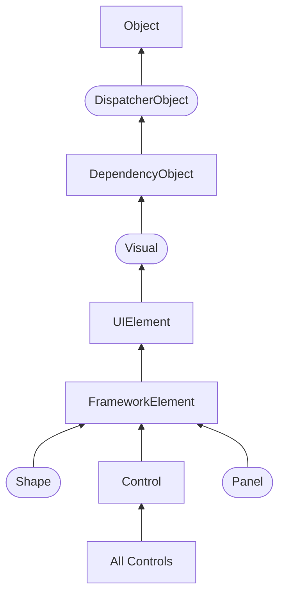
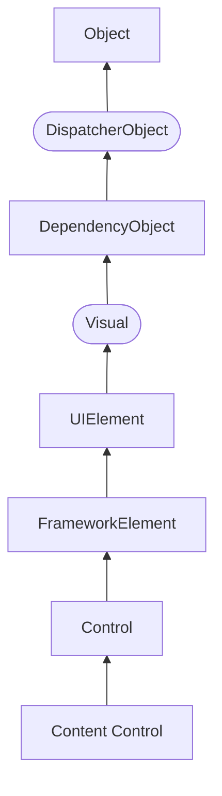
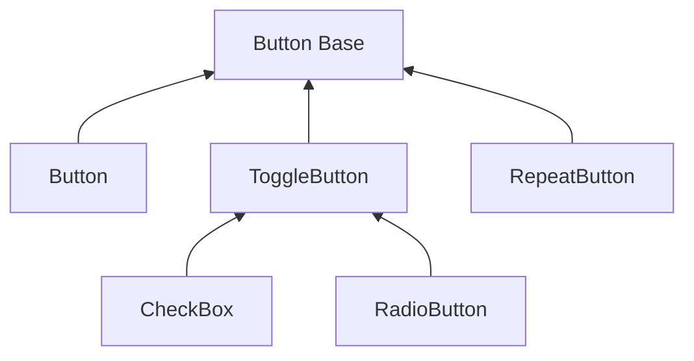

## Controls / Элементы управления

- [Controls / Элементы управления](#controls--элементы-управления)
  - [Обзор элементов управления и их свойств](#обзор-элементов-управления-и-их-свойств)
  - [Иерархия классов элементов управления](#иерархия-классов-элементов-управления)
  - [Основные свойства элементов управления](#основные-свойства-элементов-управления)
    - [Name](#name)
    - [FieldModifier](#fieldmodifier)
    - [Visibility](#visibility)
    - [Свойства настройки шрифтов](#свойства-настройки-шрифтов)
    - [Cursor](#cursor)
    - [FlowDirection](#flowdirection)
    - [Цвета фона и шрифта](#цвета-фона-и-шрифта)
  - [Обработчики событий](#обработчики-событий)
    - [Наиболее часто используемые события](#наиболее-часто-используемые-события)
    - [Подключение обработчиков](#подключение-обработчиков)
      - [Декларативный подход](#декларативный-подход)
      - [Императивный подход](#императивный-подход)
  - [Элементы управления содержимым / ContentControl](#элементы-управления-содержимым--contentcontrol)
    - [Позиционирование контента](#позиционирование-контента)
      - [Content Alignment](#content-alignment)
      - [Padding](#padding)
    - [ButtonBase / Кнопки](#buttonbase--кнопки)
      - [Button / Обыкновенная кнопка](#button--обыкновенная-кнопка)
        - [Форматирование содержимого](#форматирование-содержимого)
        - [Сложное содержимое](#сложное-содержимое)
        - [Внутренние отступы](#внутренние-отступы)
        - [Другие свойства](#другие-свойства)
      - [RepeatButton / Кнопка повтора](#repeatbutton--кнопка-повтора)
      - [ToggleButton / Элементарный переключатель](#togglebutton--элементарный-переключатель)
      - [CheckBox / Независимый переключатель](#checkbox--независимый-переключатель)
        - [Пользовательское содержимое](#пользовательское-содержимое)
        - [Свойство IsThreeState](#свойство-isthreestate)
      - [RadioButton / Зависимый переключатель](#radiobutton--зависимый-переключатель)
        - [Поддержка групп](#поддержка-групп)
        - [Пользовательское содержимое](#пользовательское-содержимое-1)
    - [HeaderedContentControl / Заголовочное содержимое](#headeredcontentcontrol--заголовочное-содержимое)
      - [GroupBox](#groupbox)
      - [Expander](#expander)
      - [TabItem](#tabitem)
    - [ListBoxItem / Списочные элементы](#listboxitem--списочные-элементы)
      - [ListViewItem](#listviewitem)
      - [ComboBoxItem](#comboboxitem)
    - [Label / Метка](#label--метка)
      - [Label и клавиши доступа (мнемоники)](#label-и-клавиши-доступа-мнемоники)
      - [Использование элементов в качестве содержимого](#использование-элементов-в-качестве-содержимого)
      - [Label и TextBlock](#label-и-textblock)
    - [ToolTip / Всплывающая подсказка](#tooltip--всплывающая-подсказка)
      - [Свойства ToolTip](#свойства-tooltip)
      - [Свойства ToolTipService](#свойства-tooltipservice)
      - [Программное создание всплывающей подсказки](#программное-создание-всплывающей-подсказки)
    - [ScrollViewer / Область прокрутки](#scrollviewer--область-прокрутки)
    - [Window / Окно](#window--окно)
      - [Важнейшие свойства окна](#важнейшие-свойства-окна)
    - [Frame / Фрейм](#frame--фрейм)
    - [UserControl / Пользовательский элемент управления](#usercontrol--пользовательский-элемент-управления)
      - [UserControl vs. CustomControl](#usercontrol-vs-customcontrol)
  - [TextBoxBase / Текстовые элементы](#textboxbase--текстовые-элементы)
    - [TextBox / Неформатированный текст](#textbox--неформатированный-текст)
      - [Однострочный ввод](#однострочный-ввод)
      - [Многострочный ввод](#многострочный-ввод)
      - [Работа с выделением](#работа-с-выделением)
      - [Модифицирование выделения](#модифицирование-выделения)
      - [Проверка орфографии](#проверка-орфографии)
      - [Преимущества и недостатки](#преимущества-и-недостатки)
    - [RichTextBox / Форматированный текст](#richtextbox--форматированный-текст)
      - [Модель потоковых документов / FlowDocument](#модель-потоковых-документов--flowdocument)
      - [Работа с текстом и выделением](#работа-с-текстом-и-выделением)
      - [Использования элемента Run](#использования-элемента-run)
      - [Загрузка и сохранение содержимого](#загрузка-и-сохранение-содержимого)
      - [Преимущества и недостатки](#преимущества-и-недостатки-1)
  - [RangeBase / Элементы диапазонов значений](#rangebase--элементы-диапазонов-значений)
    - [Slider / Ползунок](#slider--ползунок)
    - [ProgressBar / Индикатор выполнения](#progressbar--индикатор-выполнения)
    - [ScrollBar / Линейка прокрутки](#scrollbar--линейка-прокрутки)
  - [Thumb / Бегунок](#thumb--бегунок)
    - [GridSplitter / Разделитель панелей](#gridsplitter--разделитель-панелей)
  - [PasswordBox / Пароль](#passwordbox--пароль)
    - [Связывание](#связывание)
    - [Примечания по безопасности](#примечания-по-безопасности)
  - [Calendar / Календарь](#calendar--календарь)
  - [DatePicker / Выбор дат](#datepicker--выбор-дат)
  - [Separator / Разделитель](#separator--разделитель)
  - [ItemsControl / Элементы управления коллекциями](#itemscontrol--элементы-управления-коллекциями)
    - [Основные свойства](#основные-свойства)
    - [Управление списком](#управление-списком)
    - [Отображение сложных данных](#отображение-сложных-данных)
    - [ItemsSource](#itemssource)
    - [Преимущества и недостатки](#преимущества-и-недостатки-2)
    - [Selector / Селектор](#selector--селектор)
      - [Выбор элементов](#выбор-элементов)
      - [ListBox](#listbox)
        - [ListView](#listview)
        - [Выделение элементов](#выделение-элементов)
      - [TabControl / Создание вкладок](#tabcontrol--создание-вкладок)
        - [Программное добавление вкладок](#программное-добавление-вкладок)
        - [Сравнение с другими элементами](#сравнение-с-другими-элементами)
      - [ComboBox / Выпадающий список](#combobox--выпадающий-список)
        - [Событие SelectionChanged и обработка выбора объекта](#событие-selectionchanged-и-обработка-выбора-объекта)
        - [Свойства и события](#свойства-и-события)
        - [Сравнение с другими элементами](#сравнение-с-другими-элементами-1)
      - [MutliSelector / Множественное выделение](#mutliselector--множественное-выделение)
        - [DataGrid / Таблица данных](#datagrid--таблица-данных)
        - [Некоторые полезные свойства DataGrid](#некоторые-полезные-свойства-datagrid)
        - [Фильтрация и сортировка](#фильтрация-и-сортировка)
    - [HeaderedItemsControl / Заголовочные списки](#headereditemscontrol--заголовочные-списки)
      - [MenuItem / Элемент меню](#menuitem--элемент-меню)
      - [TreeViewItem / Элемент дерева](#treeviewitem--элемент-дерева)
      - [ToolBar / Панель инструментов](#toolbar--панель-инструментов)
    - [MenuBase / Меню](#menubase--меню)
      - [Menu / Стандартное меню](#menu--стандартное-меню)
      - [ContextMenu / Контекстное меню](#contextmenu--контекстное-меню)
    - [TreeView / Древовидный список](#treeview--древовидный-список)
    - [StatusBar / Строка состояния](#statusbar--строка-состояния)

### Обзор элементов управления и их свойств
Чтобы как-то взаимодействовать с пользователем, получать от пользователя ввод с клавиатуры или мыши и использовать введенные данные в программе, нам нужны элементы управления. WPF предлагает нам богатый стандартный набор элементов управления

Все элементы управления могут быть условно разделены на несколько подгрупп:

- **Элементы управления содержимым**, например кнопки (`Button`), метки (`Label`).

- **Специальные контейнеры**, которые содержат другие элементы, но в отличие от элементов `Grid` или `Canvas` не являются контейнерами компоновки — `ScrollViewer`,`GroupBox`.

- **Декораторы**, чье предназначение создание определенного фона вокруг вложенных элементов, например, `Border` или `Viewbox`.

- **Элементы управления списками**, например, `ListBox`, `ComboBox`.

- **Текстовые элементы управления**, например, `TextBox`, `RichTextBox`.

- **Элементы, основанные на диапазонах значений**, например, `ProgressBar`, `Slider`.

- **Элементы для работ с датами**, например, `DatePicker` и `Calendar`.

- **Остальные элементы управления**, которые не вошли в предыдущие подгруппы, например, `Image`.

Все элементы управления наследуются от общего класса **`System.Window.Controls.Control`** и имеют ряд общих свойств. А общую иерархию элементов управления можно представить следующим образом:



где:


Вкратце рассмотрим, что представляют все эти типы в иерархии.

### Иерархия классов элементов управления

- `System.Threading.DispatcherObject`

    *[STA]: Single-Thread Affinity
    В основе WPF лежит модель STA (Single-Thread Affinity), согласно которой за пользовательский интерфейс отвечает один поток. И чтобы пользовательский интерфейс мог взаимодействовать с другими потоками, WPF использует концепцию <dfn title="диспетчер">диспетчера</dfn> — специального объекта, управляющего обменом сообщениями, через которые взаимодействуют потоки. Наследование типов от класса `DispatcherObject` позволяет получить доступ к подобному объекту-диспетчеру и и другим функциям по управлению параллелизмом.

- `System.Windows.DependencyObject`

    Наследование от этого класса позволяет взаимодействовать с элементами в приложении через их специальную модель свойств, которые называются *свойствами зависимостей* (dependency properties). Эта модель упрощает применение ряда особенностей WPF, например, привязки данных. Так, система свойств зависимостей отслеживает зависимости между значениями свойств, автоматически проверяет их и изменяет при изменении зависимости.

- `System.Windows.Media.Visual`

    Класс `Visual` содержит инструкции, которые отвечают за отрисовку, визуализацию объекта.

- `System.Windows.UIElement`

    Класс `UIElement` добавляет возможности по компоновке элемента, обработку событий и получение ввода.

- `System.Windows.FrameworkElement`

    Класс `FrameworkElement` добавляет поддержку привязки данных, анимации, стилей. Также добавляет ряд свойств, связанных с компоновкой (выравнивание, отступы) и ряд других.

- `System.Windows.Controls.Control`

    Класс `Control` представляет элемент управления, с которым взаимодействует пользователь. Этот класс добавляет ряд дополнительных свойств для поддержки элементами шрифтов, цветов фона, шрифта, а также добавляет поддержку шаблонов — специального механизма в WPF, который позволяет изменять стандартное представление элемента, кастомизировать его.

    И далее от класса `Control` наследуются непосредственно конкретные элементы управления или их базовые классы, которые получают весь функционал, добавляемый к типам в этой иерархии классов.

Рассмотрим некоторые из основных свойств, которые наследуются элементами управления.

### Основные свойства элементов управления

#### Name
Данное свойство определяет имя элемента управления, через которое впоследствии можно будет обращаться к данному элементу, как в коде, так и в *xaml* разметке. Например, в xaml-коде у нас определена следующая кнопка:
```xml
<Button x:Name="button1" Width="60" Height="30" Content="Текст" Click="button1_Click" />
```

Здесь у нас задан атрибут `Click` с названием метода обработчика `button1_Click`, который будет определен в файле кода C# и будет вызываться по нажатию кнопки. Тогда в связанном файле кода C# мы можем обратиться к этой кнопке:
```cs
private void button1_Click(object sender, RoutedEventArgs e)
{
    button1.Content = "Привет!";
}
```

Поскольку свойство `Name` имеет значение `button1`, то через это значение мы можем обратиться к кнопке в коде.

#### FieldModifier
Свойство `FieldModifier` задает модификатор доступа к объекту:
```xml
<StackPanel>
    <Button x:FieldModifier="private" x:Name="button1" Content="Hello World" />
    <Button x:FieldModifier="internal" x:Name="button2" Content="Hello WPF" />
</StackPanel>
```

В качестве значения используются стандартные модификатора доступа языка C#: `private`, `protected`, `internal`, `protected internal` и `public`. В данном случае объявление кнопок с модификаторами будет равноценно следующему их определению в коде:
```cs
private Button button1;
internal Button button2;
```

Если для элемента не определен атрибут `x:FieldModifier`, то по умолчанию он равен "protected internal".

#### Visibility
Это свойство устанавливает параметры видимости элемента и может принимать одно из трех значений:

- **`Visible`** — элемент виден и участвует в компоновке.

- **`Collapsed`** — элемент не виден и не участвует в компоновке.

- **`Hidden`** — элемент не виден, но при этом участвует в компоновке.

Различия между `Collapsed` и `Hidden` можно продемонстрировать на примере:
```xml
<Grid>
    <Grid.ColumnDefinitions>
        <ColumnDefinition Width="*" />
        <ColumnDefinition Width="*" />
    </Grid.ColumnDefinitions>
    <StackPanel Grid.Column="0" Background="Lavender">
        <Button Visibility="Collapsed" Content="Панель Collapsed" />
        <Button Height="20" Content="Visible Button" />
    </StackPanel>
    <StackPanel Grid.Column="1" Background="LightGreen">
        <Button Visibility="Hidden" Content="Панель Hidden" />
        <Button Height="20" Content="Visible Button" />
    </StackPanel>
</Grid>
```

#### Свойства настройки шрифтов
- **`FontFamily`** — определяет семейство шрифта (например, Arial, Verdana и т.д.)

- **`FontSize`** — определяет высоту шрифта

- **`FontStyle`** — определяет наклон шрифта, принимает одно из трех значений — **`Normal`**, **`Italic`**, **`Oblique`**.

- **`FontWeight`** — определяет толщину шрифта и принимает ряд значений, как **`Black`**, **`Bold`** и др.

- **`FontStretch`** — определяет, как будет растягивать или сжимать текст, например, значение **`Condensed`** сжимает текст, а **`Expanded`** — растягивает.

Например:
```xml
<Button Content="Hello World!" FontFamily="Verdana" FontSize="13" FontStretch="Expanded" />
```

#### Cursor
Это свойство позволяет нам получить или установить курсор для элемента управления в одно из значений, например, **`Hand`**, **`Arrow`**, **`Wait`** и др. Например, установка курсора в коде c#: `button1.Cursor=Cursors.Hand;`

#### FlowDirection
Данное свойство задает направление текста. Если оно равно `RightToLeft`, то текст начинается с правого края, если — `LeftToRight`, то с левого.

```xml
<StackPanel>
    <TextBlock FlowDirection="RightToLeft">RightToLeft</TextBlock>
    <TextBlock FlowDirection="LeftToRight">LeftToRight</TextBlock>
</StackPanel>
```

#### Цвета фона и шрифта
Свойства **`Background`** и **`Foreground`** задают соответственно цвет фона и текста элемента управления.

Простейший способ задания цвета в коде xaml: `Background="#ffffff"`. В качестве значения свойство `Background` (`Foreground`) может принимать запись в виде шестнадцатеричного значения в формате `#rrggbb`, где `rr` — красная составляющая, `gg` — зеленая составляющая, а `bb` — синяя. Также можно задать цвет в формате `#aarrggbb`.

Либо можно использовать названия цветов напрямую:
```xml
<Button Width="60" Height="30" Background="LightGray" Foreground="DarkRed" Content="Цвет" />
```

Однако при компиляции будет создаваться объект `SolidColorBrush`, который и будет задавать цвет элемента. То есть определение кнопки выше фактически будет равноценно следующему:
```xml
<Button Width="60" Height="30" Content="Цвет">
    <Button.Background>
        <SolidColorBrush Color="LightGray" />
    </Button.Background>
    <Button.Foreground>
        <SolidColorBrush Color="DarkRed" />
    </Button.Foreground>
</Button>
```

`SolidColorBrush` представляет собой кисть, покрывающую элемент одним цветом. Позже мы подробнее поговорим о цветах. А пока надо знать, что эти записи эквивалентны, кроме того, вторая форма определения цвета позволяет задать другие кисти — например, градиент.

Это надо также учитывать при установке или получении цвета элемента в коде c#:
```xml
button1.Background = new SolidColorBrush(Colors.Red);
button1.Foreground = new SolidColorBrush(Color.FromRgb(0,255, 0));
```

Класс `Colors` предлагает ряд встроенный цветовых констант, которыми мы можем воспользоваться. А если мы захотим конкретизировать настройки цвета с помощью значений RGB, то можно использовать метод **`Color.FromRgb`**.

### Обработчики событий

#### Наиболее часто используемые события

| Событие | Описание
-- | --
`Click` | Происходит при нажатии на элемент управления
`MouseMove` | Происходит, когда указатель мыши совершает движение по этому элементу
`MouseEnter` | Происходит, когда указатель мыши входит в границы данного элемента
`MouseLeave` | Происходит, когда указатель мыши покидает границы данного элемента
`MouseDown` | Происходит при нажатии кнопки мыши, если указатель мыши находится на элементе
`MouseUp` | Происходит, когда кнопка мыши отпускается на элементе
`MouseWheel` | Происходит при прокрутке пользователем колесика мыши, если указатель мыши находится на элементе
`KeyDown` | Происходит при нажатии клавиши, если элемент имеет фокус
`KeyUp` | Происходит при отжатии клавиши, если элемент имеет фокус

#### Подключение обработчиков

##### Декларативный подход
Для добавления обработчика для какого-либо события объекта необходимо в открывающем теге элемента написать имя события и через знак «=» имя функции-обработчика, либо выбрать команду «Новый обработчик события»:

При выборе команды «Новый обработчик события» в CS-файле, относящемся к  XAML-файлу, будет добавлена соответствующая функция:
```cs
private void MenuItem_Click(object sender, RoutedEventArgs e)
{

}
```

В обработчике можно обратиться по имени к любому объекту, для которого в  XAML-файле было определено имя с помощью атрибута `Name` или `x:Name`:
```xml
<MenuItem Name="mi_open" Header="_Открыть" Click="MenuItem_Click" />
```
```cs
private void MenuItem_Click(object sender, RoutedEventArgs e)
{
  mi_open.Background = Brushes.LightGreen;
}
```

С помощью объекта `sender`, переданного в качестве параметра, можно получить доступ к элементу управления, для которого возникло обрабатываемое событие, даже в случае, если для него не задано имя:
```cs
private void CheckBox_Click(object sender, RoutedEventArgs e)
{
  ((FrameworkElement)sender).Visibility = System.Windows.Visibility.Hidden;
}
private void CheckBox_Click(object sender, RoutedEventArgs e)
{
  MessageBox.Show(((CheckBox)sender).IsChecked.ToString());
}
```

В первом примере объект `sender` был приведен к базовому классу `FrameworkElement` для доступа к базовым свойствам, присущим всем элементам управления. Во втором случае объект `sender` был приведен к классу `CheckBox` для доступа к специфическим свойствам данного элемента управления.

Если для нескольких элементов управления определен один обработчик какого-либо события, то для определения выбранного элемента управления в коде обработчика можно использовать свойство `Tag`, доступное для всех элементов управления:
```cs
private void MenuItem_Click(object sender, RoutedEventArgs e)
{
if (((FrameworkElement)sender).Tag.ToString() == "open") MessageBox.Show("Выбрана команда 'Открыть'");
else
if (((FrameworkElement)sender).Tag.ToString() == "save") MessageBox.Show("Выбрана   команда 'Сохранить'");
}
```

##### Императивный подход
Иногда может возникнуть необходимость организовать подписку на событие напрямую из отделенного кода. Для добавления обработчика в список обработчиков события используется синтаксис C# `+=` (эквивалентен вызову аксессора `add` для события):
```cs
using System;
using System.Windows;
using System.Windows.Input;


namespace WpfTutorialSamples.XAML
{
	public partial class EventsSample : Window
	{
		public EventsSample()
		{
			InitializeComponent();
			pnlMainGrid.MouseUp += new MouseButtonEventHandler(pnlMainGrid_MouseUp);
		}

		private void pnlMainGrid_MouseUp(object sender, MouseButtonEventArgs e)
		{
			MessageBox.Show("You clicked me at " + e.GetPosition(this).ToString());
		}

	}
}
```

Опять же для этого необходимо знать, какой именно делегат использовать, и вновь Visual Studio может помочь нам с этим. Как только вы наберёте:
```cs
pnlMainGrid.MouseDown +=
```

Visual Studio подскажет наиболее подходящий.

Далее нужно просто дважды нажать клавишу <kbd>Tab</kbd>, чтобы принять сгенерированный Visual Studio подходящий обработчик событий. При подобной организации подписки необходимость осуществлять её в XAML отпадает (хотя по-прежнему возможна).

В современном C# часто используется более краткий синтаксис, не требующий указания делегата:
```cs
pnlMainGrid.MouseUp += pnlMainGrid_MouseUp;
```

### Элементы управления содержимым / ContentControl
<dfn title="элемент управления содержимым">Элементы управления содержимым</dfn> (content controls) представляют такие элементы управления, которые содержат в себе другой элемент. Все элементы управления содержимым наследуются от класса **`ContentControl`**, который в свою очередь наследуется от класса `System.Window.Controls.Control`.



где:


Определение:
```cs
[System.Windows.Localizability(System.Windows.LocalizationCategory.None, Readability=System.Windows.Readability.Unreadable)]
[System.Windows.Markup.ContentProperty("Content")]
public class ContentControl : System.Windows.Controls.Control, System.Windows.Markup.IAddChild
```

Описание: https://learn.microsoft.com/en-us/dotnet/api/system.windows.controls.contentcontrol?view=windowsdesktop-9.0

К элементам управления содержимым относятся такие элементы как `Button`, `Label`, `ToggleButton`, `ToolTip`, `RadioButton`, `CheckBox`, `GroupBox`, `TabItem`, `Expander`, `ScrollViewer`. Также элементом управления содержимым является и главный элемент окна — `Window`.

Отличительной чертой всех этих элементов является наличие свойства **`Content`**, которое и устанавливает вложенный элемент. В этом элементы управления содержимым схожи с контейнерами компоновки. Только контейнеры могут иметь множество вложенных элементов, а элементы управления содержимым только один.

Свойство `Content` может представлять любой объект, который может относиться к одному из двух типов:

- Объект класса, не наследующего от `UIElement`. Для такого объекта вызывается метод `ToString()`, который возвращает строковое преставление объекта. Затем эта строка устанавливается в качестве содержимого.

- Объект класса, наследующего от `UIElement`. Для такого объекта вызывается метод `UIElement.OnRender()`, который выполняет отрисовку внутри элемента управления содержимым.

Рассмотрим на примере кнопки, которая является элементом управления содержимым:
```xml
<Button Content="Hello World!" />
```

В качестве содержимого устанавливается обычная строка. Этот же пример мы можем в XAML прописать иначе:
```xml
<Button>
    <Button.Content>
        Hello World!
    </Button.Content>
</Button>
```

Либо мы можем использовать сокращенное неявное определения свойства `Content`:
```xml
<Button>
    Hello World!
</Button>
```

Возьмем другой пример. Определим кнопку с именем `button1`:
```xml
<Window x:Class="ControlsApp.MainWindow"
        xmlns="http://schemas.microsoft.com/winfx/2006/xaml/presentation"
        xmlns:x="http://schemas.microsoft.com/winfx/2006/xaml"
        xmlns:d="http://schemas.microsoft.com/expression/blend/2008"
        xmlns:mc="http://schemas.openxmlformats.org/markup-compatibility/2006"
        xmlns:local="clr-namespace:ControlsApp"
        mc:Ignorable="d"
        Title="Элементы управления" Height="250" Width="300">
    <StackPanel>
        <Button x:Name="button1" />
    </StackPanel>
</Window>
```

А в файле коде `MainWindow.xaml.cs` присвоим ее свойству `Content` какой-либо объект:
```cs
using System;
using System.Windows;

namespace ControlsApp
{
    public partial class MainWindow : Window
    {
        public MainWindow()
        {
            InitializeComponent();
            double d = 5.6;
            button1.Content = d;
        }
    }
}
```

В итоге число конвертируется в строку и устанавливается в качесте содержимого.

Иначе все будет работать, если мы в качестве содержимого используем объект, унаследованный от `UIElement`:
```xml
<Button x:Name="button1">
    <Button Content="Hello" />
</Button>
```

Для создания той же кнопки через код C# мы бы могли прописать следующее выражение:
```cs
button1.Content = new Button { Content = "Hello" };
```

В отличие от контейнеров компоновки для элементов управления содержимым мы можем задать только один вложенный элемент. Если же нам надо вложить в элемент управления содержимым несколько элементов, то мы можем использовать те же контейнеры компоновки:
```xml
<Button x:Name="button1">
    <StackPanel>
        <TextBlock Text="Набор кнопок" />
        <Button Background="Red" Height="20" Content="Red" />
        <Button Background="Yellow" Height="20" Content="Yellow" />
        <Button Background="Green" Height="20" Content="Green" />
    </StackPanel>
</Button>
```

То же самое мы могли бы прописать через код C#:
```cs
StackPanel stackPanel = new StackPanel();
stackPanel.Children.Add(new TextBlock { Text = "Набор кнопок" });
stackPanel.Children.Add(new Button { Content = "Red", Height = 20, Background = new SolidColorBrush(Colors.Red) });
stackPanel.Children.Add(new Button { Content = "Yellow", Height = 20, Background = new SolidColorBrush(Colors.Yellow) });
stackPanel.Children.Add(new Button { Content = "Green", Height = 20, Background = new SolidColorBrush(Colors.Green) });
button1.Content = stackPanel;
```

#### Позиционирование контента

##### Content Alignment
Выравнивание содержимого внутри элемента задается свойствами **`HorizontalContentAlignment`** (выравнивание по горизонтали) и **`VerticalContentAlignment`** (выравнивание по вертикали), аналогичными свойствам `VerticalAlignment`/`HorizontalAlignment`. Свойство `HorizontalContentAlignment` принимает значения `Left`, `Right`, `Center` (положение по центру), `Stretch` (растяжение по всей ширине). Например:
```xml
<StackPanel>
    <Button Margin="5" HorizontalContentAlignment="Left" Content="Left" Height="90" Width="500" />
    <Button Margin="5" HorizontalContentAlignment="Right" Content="Right" Height="90" Width="500" />
    <Button Margin="5" HorizontalContentAlignment="Center" Content="Center" Height="90" Width="500" />
</StackPanel>
```

`VerticalContentAlignment` принимает значения `Top` (положение в верху), `Bottom` (положение внизу), `Center` (положение по центру), `Stretch` (растяжение по всей высоте).

##### Padding
С помощью свойства `Padding` мы можем установить отступ содержимого элемента:
```xml
<StackPanel>
    <Button x:Name="button1" Padding="50 30 0 40" HorizontalContentAlignment="Left">
        Hello World
    </Button>
    <Button x:Name="button2" Padding="60 20 0 30" HorizontalContentAlignment="Center">
        Hello World
    </Button>
</StackPanel>
```

Свойство `Padding` задается в формате `Padding="отступ_слева отступ_сверху отступ_справа отступ_снизу"`.

Если со всех четырех сторон предполагается один и тот же отступ, то, как и в случае с `Margin`, мы можем задать одно число:
```xml
<Button x:Name="button2" Padding="20"  Content="Hello World" />
```

Важно понимать, от какой точки задается отступ. В случае с первой кнопкой в ней контент выравнивается по левому краю, поэтому отступ слева будет предполагать отступ от левого края элемента `Button`. А вторая кнопка располагается по центру. Поэтому для нее отступ слева предполагает отступ от той точки, в которой содержимое бы находилось при центрировании без применения `Padding`.

Комбинация значений свойств `HorizontalContentAlignment`/`VerticalContentAlignment` и `Padding` позволяет оптимальным образом задать расположение содержимого.

#### ButtonBase / Кнопки

В WPF кнопки представлены целым рядом классов, которые наследуются от базового класса `ButtonBase`:



Класс `ButtonBase` в WPF является базовым классом для всех элементов управления кнопками. Он наследуется от `ContentControl`, что позволяет ему содержать один объект любого типа, например, строку, изображение или панель.

Определение:
```cs
[System.Windows.Localizability(System.Windows.LocalizationCategory.Button)]
public abstract class ButtonBase : System.Windows.Controls.ContentControl, System.Windows.Input.ICommandSource
```

Описание: https://learn.microsoft.com/en-us/dotnet/api/system.windows.controls.primitives.buttonbase?view=windowsdesktop-9.0

Ключевые особенности класса `ButtonBase` включают:

1. **Событие `Click`**: Определяет событие `Click`, которое позволяет обрабатывать пользовательский ввод, например, щелчок мышью или нажатие клавиши <kbd>Enter</kbd>, когда кнопка находится в фокусе.

2. **Поддержка команд**: Реализует интерфейс `ICommandSource`, что позволяет кнопкам быть подключенными к высокоуровневым задачам приложений через команды (копирование, вырезание, вставка и т.п.).

3. **Свойство `ClickMode`**: Определяет, когда кнопка генерирует событие `Click` в ответ на действия мыши. Значения могут быть `ClickMode.Release` (по умолчанию), `ClickMode.Press`, или `ClickMode.Hover`.

4. **Свойства `IsPressed` и `IsInputMethodEnabled`**: Свойство `IsPressed` указывает, нажата ли кнопка, а `IsInputMethodEnabled` всегда установлено в `false` для кнопок.

5. **Наследники**: Классы `Button`, `ToggleButton`, `RepeatButton`, `CheckBox`, и `RadioButton` наследуются от `ButtonBase`, каждый из которых имеет свои особенности и применения.

Эти особенности делают `ButtonBase` фундаментальным классом для создания различных типов кнопок в приложениях WPF.

##### Button / Обыкновенная кнопка
Ни один GUI-фреймворк не обходится без кнопок, и, конечно же, такой элемент управления есть и в WPF. Как и другие элементы фреймворка, он обладает большой гибкостью в настройке и позволяет выполнить почти любую поставленную задачу.

Элемент `Button` представляет обычную кнопку:
```xml
<Button x:Name="button1" Width="60" Height="30" Background="LightGray" />
```

Как и многие другие элементы управления WPF, кнопку можно отобразить, просто добавив тег `Button`. Текст (или другой элемент), размещенный между тегами, будет интерпретирован как содержимое `Button`:
```xml
<Button>Hello, world!</Button>
```

Хотя в таком виде кнопка совершенно бесполезна, но при наведении на неё уже можно заметить неплохой встроенный эффект.

От класса `ButtonBase` кнопка наследует ряд событий, например, `Click`, которые позволяют обрабатывать пользовательский ввод. Чтобы связать кнопку с обработчиком события нажатия, нам надо определить в самой кнопке атрибут `Click`. А значением этого атрибута будет название обработчика в коде C#. А затем в самом коде C# определить этот обработчик.

```xml
<Button x:Name="button1" Content="Отправить запрос" Click="Button_Click" />
```

И обработчик в коде C#:
```cs
private void Button_Click(object sender, RoutedEventArgs e)
{
    MessageBox.Show("Кнопка нажата");
}
```

Либо можно не задавать обработчик через атрибут, а стандартным образом для C# прописать в коде: `button1.Click+=Button_Click;`

###### Форматирование содержимого
Интересно, что обычный текст, помещенный между тегами или указанный значением свойства `Content`, внутренне конвертируется в элемент `TextBlock`, что дает возможность аналогичным образом контролировать его визуальное отображение. Для этого `Button` предоставляет такие свойства, как **`Foreground`**, **`Background`**, **`FontWeight`** и т.п. В общем, текст внутри элемента `Button` отформатировать проще простого:

```xml
<Button Background="Beige" Foreground="Blue" FontWeight="Bold">Formatted Button</Button>
```

Конечно, при установке этих свойств непосредственно на `Button` форматирование будет ограничено применением ко всему содержимому элемента, однако, если этого недостаточно, то можно использовать более сложные варианты форматирования уже самого содержимого.

###### Сложное содержимое
Одна из замечательных особенностей WPF — это возможность заменить простой текст внутри элемента управления другими элементами WPF, а это значит, что совсем необязательно ограничивать содержимое кнопок лишь единообразно оформленным текстом — например, можно добавить несколько текстовых элементов, имеющих разное форматирование. Необходимо лишь учитывать то обстоятельство, что `Button` поддерживает только один непосредственно вложенный элемент, но в качестве такого элемента всегда можно использовать `Panel`, который способен разместить столько элементов управления, сколько будет необходимо. Данный подход можно использовать при создании кнопок, одновременно совмещающих разные виды форматирования:
```xml
<Button>
    <StackPanel Orientation="Horizontal">
    <TextBlock>Formatted </TextBlock>
    <TextBlock Foreground="Blue" FontWeight="Bold" Margin="2,0">Button</TextBlock>
    <TextBlock Foreground="Gray" FontStyle="Italic">[Various]</TextBlock>
    </StackPanel>
</Button>
```

Конечно, совсем не обязательно ограничивается лишь текстом — внутрь кнопок можно помещать что угодно, создавая таким образом, например, кнопки с картинками.

Во многих фреймворках, предназначенных для создания пользовательского интерфейса, можно обнаружить стандартную кнопку и затем один или несколько ее вариантов с дополнительными возможностями. Один из наиболее часто используемых **`ImageButton`** (кнопка с изображением), название которой говорит само за себя — обычно она позволяет расположить картинку перед надписью на кнопке. Однако в WPF нет никакой необходимости в отдельном элементе управления для решения этой задачи — как уже было показано, внутри `Button` можно размещать другие элементы, так что туда без проблем можно добавить элемент `Image`, как в следующем примере:
```xml
<Button Padding="5">
    <StackPanel Orientation="Horizontal">
    <Image Source="/WpfTutorialSamples;component/Images/help.png" />
    <TextBlock Margin="5,0">Help</TextBlock>
    </StackPanel>
</Button>
```

В общем, сделать кнопку с картинкой в WPF проще простого, при этом, конечно, можно как угодно управлять расположением внутренних элементов, например, разместив кнопку не перед, а за текстом.

###### Внутренние отступы
Нетрудно заметить, что в WPF кнопки по умолчанию не имеют внутреннего отступа. Как следствие, текст располагается вплотную к краям, что выглядит несколько странно, так как большинство привычных нам кнопок (на веб-страницах, в других приложениях и т.п.) всё-таки имеют какой-то отступ от границ. Но повода для беспокойства нет, ведь у кнопки есть свойство **`Padding`**:
```xml
<Button Padding="5,2">Hello, World!</Button>
```

Это создаст отступ в 5 пикселей слева и справа и в 2 — сверху и снизу. Но постоянно добавлять отступы ко всем кнопкам в определенный момент может надоесть, так что вот небольшой совет: эти отступы можно настроить глобально для всего приложения либо только на определенном окне, используя `Style`. Ниже показано применение стиля для окна с помощью свойства `Window.Resources`:
```xml
<Window.Resources>
    <Style TargetType="{x:Type Button}">
    <Setter Property="Padding" Value="5,2"/>
    </Style>
</Window.Resources>
```

Теперь этот отступ будет применен ко всем кнопкам, но, конечно, его можно переопределить указав другое свойство `Padding` на нужной кнопке.

###### Другие свойства
Кнопка имеет такие свойства как **`IsDefault`** и **`IsCancel`**, которые принимают значения `true` и `false`.

Если свойство `IsDefault` установлено в `true`, то при нажатии клавиши <kbd>Enter</kbd> будет вызываться обработчик нажатия этой кнопки.

Аналогично если свойство `IsCancel` будет установлено в `true`, то при нажатии на клавишу <kbd>Esc</kbd> будет вызываться обработчик нажатия этой кнопки.

Например, определим код *xaml*:
```xml
<Window x:Class="ControlsApp.MainWindow"
        xmlns="http://schemas.microsoft.com/winfx/2006/xaml/presentation"
        xmlns:x="http://schemas.microsoft.com/winfx/2006/xaml"
        xmlns:d="http://schemas.microsoft.com/expression/blend/2008"
        xmlns:mc="http://schemas.openxmlformats.org/markup-compatibility/2006"
        xmlns:local="clr-namespace:ControlsApp"
        mc:Ignorable="d"
        Title="Элементы управления" Height="250" Width="300">
    <StackPanel>
        <Button x:Name="acceptButton" Content="ОК" IsDefault="True" Click="acceptButton_Click" />
        <Button x:Name="escButton" Content="Выход" IsCancel="True" Click="escButton_Click" />
    </StackPanel>
</Window>
```

А в коде `MainWindow.xaml.cs` определим следующий код C#:
```cs
using System.Windows;

namespace ControlsApp
{
    public partial class MainWindow : Window
    {
        public MainWindow()
        {
            InitializeComponent();
        }

        private void acceptButton_Click(object sender, RoutedEventArgs e)
        {
            MessageBox.Show("Действие выполнено");
        }

        private void escButton_Click(object sender, RoutedEventArgs e)
        {
            this.Close(); // закрытие окна
        }
    }
}
```

Теперь при нажатии на клавишу <kbd>Enter</kbd> будет отображаться сообщение, а при нажатии на <kbd>Esc</kbd> будет происходить выход из приложения и закрытие окна.

Отличительные особенности:
- Событие **`Click`** – нажатие на кнопку. В атрибуте `Click` указывается название функции-обработчика этого события.
- Свойство **`IsCancel`**.  Возможные значения: `True`, `False`. Если записано  `True`, то кнопка будет срабатывать при нажатии на кнопку <kbd>Esc</kbd> в данном окне, т.е. когда пользователь хочет закрыть окно без выполнения каких-либо действий.
- Свойство **`IsDefault`**. Возможные значения: `True`, `False`. Если записано  `True`, то кнопка будет срабатывать при нажатии на кнопку <kbd>Enter</kbd> в данном окне, но только если не выделена какая-либо другая кнопка. В отличие от приложения  Windows Forms, в WPF-приложении при открытии окна не происходит автоматического выделения какого-либо элемента. Чтобы выделить первый элемент в окне, необходимо нажать кнопку <kbd>Tab</kbd>. Кнопка со свойством `IsDefault="True"` подсвечивается в окне, как будто она получила фокус. Но на самом деле кнопка не получает фокус, т.к. нажатие на клавишу «Пробел» не приводит к нажатию кнопки, а нажатие клавиши  <kbd>Tab</kbd> приводит к выделению первого элемента на странице, а не элемента, следующего за кнопкой.
- Свойство **`IsDefaulted`** указывает, является ли кнопка в настоящий момент активной кнопкой по умолчанию, учитывая текущий фокус и обработку клавиши <kbd>Enter</kbd>. Это свойство доступно только для чтения и указывает, будет ли кнопка активирована при нажатии клавиши <kbd>Enter</kbd>.

##### RepeatButton / Кнопка повтора
Отличительная особенность элемента `RepeatButton` — непрерывная генерация события `Click`, пока нажата кнопка. Интервал генерации события корректируется свойствами **`Delay`** и **`Interval`**.

Сам по себе элемент `RepeatButton` редко используется, однако он может служить основой для создания ползунка в элементах `ScrollBar` и `ScrollViewer`, в которых нажатие на ползунок инициирует постоянную прокрутку.

##### ToggleButton / Элементарный переключатель
Представляет элементарный переключатель. Может находиться в трех состояниях — `true`, `false` и "нулевом" (неотмеченном) состоянии, а его значение представляет значение типа `bool?` в языке C#. Состояние можно установить или получить с помощью свойства **`IsChecked`**. Также добавляет три события — `Checked` (переход в отмеченное состояние), **`Unchecked`** (снятие отметки) и **`Indeterminate`** (если значение равно `null`). Чтобы отрабатывать все три события, надо установить свойство **`IsThreeState="True"`**.

```xml
<ToggleButton Click="ToggleButton_Click">Закрыть соединение</ToggleButton>
```

```cs
private void ToggleButton_Click(object sender, RoutedEventArgs e)
{
  MessageBox.Show("Состояние кнопки: " + (sender as System.Windows.Controls.Primitives.ToggleButton).IsChecked)
}
```

Отличительные особенности:
- Событие **`Click`** – нажатие или отжатие кнопки. В атрибуте `Click` указывается название функции-обработчика этого события.
- Событие **`Checked`** – нажатие кнопки. В атрибуте `Checked` указывается название функции-обработчика этого события.
- Событие **`Unchecked`** – отжатие кнопки. В атрибуте `Unchecked` указывается название функции-обработчика этого события.
- Свойство **`IsChecked`** – состояние кнопки. `True` – кнопка нажата, `False` – кнопка отжата.

`ToggleButton`, как правило, сам по себе тоже редко используется, однако при этом он служит основой для создания других более функциональных элементов, таких как `checkbox` и `radiobutton`.

##### CheckBox / Независимый переключатель
Элемент `CheckBox` представляет собой обычный флажок, позволяющий пользователю управлять параметром с двумя состояниями (включено/выключено), обычно ассоциированным с переменной логического типа в отделенном коде.

```xml
<CheckBox x:Name="CheckBox_CloseAfterComplete">Закрыть окно по завершении</CheckBox>
```

```cs
...
if (CheckBox_CloseAfterComplete.IsChecked == true)
    MessageBox.Show("IsChecked == true");
...
```

Класс `CheckBox` является наследником от класса `ToggleButton` и наследует его свойства и события.

```xml
<Window x:Class="WpfTutorialSamples.Basic_controls.CheckBoxSample"
        xmlns="http://schemas.microsoft.com/winfx/2006/xaml/presentation"
        xmlns:x="http://schemas.microsoft.com/winfx/2006/xaml"
        Title="CheckBoxSample" Height="140" Width="250">
    <StackPanel Margin="10">
		<Label FontWeight="Bold">Application Options</Label>
		<CheckBox>Enable feature ABC</CheckBox>
		<CheckBox IsChecked="True">Enable feature XYZ</CheckBox>
		<CheckBox>Enable feature WWW</CheckBox>
	</StackPanel>
</Window>
```

`CheckBox` очень легко использовать. На втором флажке установлено свойство `IsChecked`, определяющее текущий элемент отмеченным по умолчанию, и кроме одного этого свойства, для функционирования элемента никакие другие не нужны. Свойство `IsChecked` также можно использовать из отделенного кода для проверки, является ли тот или иной `CheckBox` выбранным.

Для обращения к элементу управления из кода программы необходимо в XAML-коде задать для него имя в атрибуте `Name` с префиксом `x`, как это показано в примере выше. Префикс 'x:' означает пространство имен XAML, а не пространство имен WPF.

###### Пользовательское содержимое
Наследуя от класса `ContentControl`, элемент управления `CheckBox` может содержать и отображать пользовательское содержимое. Если между тегами `CheckBox` просто указать текст, как в примере выше, то WPF автоматически отобразит его внутри элемента `TextBlock`, и сделано это лишь для упрощения процесса. На самом же деле внутри можно использовать любой элемент, что демонстрирует следующий пример:
```xml
<Window x:Class="WpfTutorialSamples.Basic_controls.CheckBoxSample"
        xmlns="http://schemas.microsoft.com/winfx/2006/xaml/presentation"
        xmlns:x="http://schemas.microsoft.com/winfx/2006/xaml"
        Title="CheckBoxSample" Height="140" Width="250">
    <StackPanel Margin="10">
		<Label FontWeight="Bold">Application Options</Label>
		<CheckBox>
			<TextBlock>
				Enable feature <Run Foreground="Green" FontWeight="Bold">ABC</Run>
			</TextBlock>
		</CheckBox>
		<CheckBox IsChecked="True">
			<WrapPanel>
				<TextBlock>
					Enable feature <Run FontWeight="Bold">XYZ</Run>
				</TextBlock>
				<Image Source="/WpfTutorialSamples;component/Images/question.png" Width="16" Height="16" Margin="5,0" />
			</WrapPanel>
		</CheckBox>
		<CheckBox>
			<TextBlock>
				Enable feature <Run Foreground="Blue" TextDecorations="Underline" FontWeight="Bold">WWW</Run>
			</TextBlock>
		</CheckBox>
	</StackPanel>
</Window>
```

Как видно из примера выше, внутри можно указывать любое содержимое. Все три флажка используют разное оформление, а в средний вообще добавлен элемент `Image`. Определяя вместо обычного текста элемент управления в качестве содержимого, мы получаем возможность лучше контролировать внешний вид элемента, а самое замечательное во всем этом то, что `CheckBox` будет работать (включаться и выключаться) вне зависимости от того, какая именно часть содержимого будет активирована.

###### Свойство IsThreeState
Как уже упоминалось, `CheckBox`, как правило, соответствует логическому значению, что подразумевает наличие лишь двух состояний: `true` или `false` (включено или выключено). Однако поскольку логический тип данных в принципе может быть nullable, фактически допуская наличия третьего варианта (`true`, `false` или `null`), то логично допустить наличие третьего состояния и у элемента `CheckBox`. И, действительно, данный элемент является производным от класса `ToggleButton` и поэтому может принимать также три состояния: `Checked`, `Unchecked` и `Indeterminate`. Если установить свойство `IsThreeState` в `true`, то элемент `CheckBox` становится способным принимать третье состояние, называемое "неопределенным".

Чтобы получить или установить какое-либо состояние, надо использовать свойство `IsChecked`, которое также унаследовано от `ToggleButton`:
```xml
<StackPanel x:Name="stackPanel">
    <CheckBox x:Name="checkBox1" IsThreeState="True" IsChecked="False" Height="20" Content="Неотмечено" />
    <CheckBox x:Name="checkBox2" IsThreeState="True" IsChecked="True" Height="20" Content="Отмечено" />
    <CheckBox x:Name="checkBox3" IsThreeState="True" IsChecked="{x:Null}" Height="20" Content="Неопределено"/>
</StackPanel>
```

Установка свойства `IsChecked="{x:Null}"` задает неопределенное состояние для элемента `checkbox`. Остальные два состояния задаются с помощью `True` и `False`. В данном примере также привязан к двум флажкам обработчик события `Checked`. Это событие возникает при установке `checkbox` в отмеченное состояние.

А атрибут `IsThreeState="True"` указывает, что флажок может находиться в трех состояниях.

Ключевыми событиями флажка являются события **`Checked`** (генерируется при установке флажка в отмеченное состояние), **`Unchecked`** (генерируется при снятии отметки с флажка) и **`Indeterminate`** (флажок переведен в неопределенное состояние). Например, определим флажок:
```xml
<CheckBox x:Name="checkBox" IsChecked="False" Height="20" Content="Флажок"
    IsThreeState="True"
    Unchecked="checkBox_Unchecked"
    Indeterminate="checkBox_Indeterminate"
    Checked="checkBox_Checked" />
```

А в файле кода C# пропишем для него обработчики:
```cs
private void checkBox_Checked(object sender, RoutedEventArgs e)
{
    MessageBox.Show(checkBox.Content.ToString() + " отмечен");
}

private void checkBox_Unchecked(object sender, RoutedEventArgs e)
{
    MessageBox.Show(checkBox.Content.ToString() + " не отмечен");
}

private void checkBox_Indeterminate(object sender, RoutedEventArgs e)
{
    MessageBox.Show(checkBox.Content.ToString() + " в неопределенном состоянии");
}
```

Программное добавление флажка:
```cs
using System.Windows;
using System.Windows.Controls;

namespace ControlsApp
{
    public partial class MainWindow : Window
    {
        public MainWindow()
        {
            InitializeComponent();
            // создаем флажок
            CheckBox checkBox2 = new CheckBox { Content = "Новый флажок", MinHeight = 20, IsChecked=true };
            // установка обработчика
            checkBox2.Checked += checkBox_Checked;
            // добавление в StackPanel
            stackPanel.Children.Add(checkBox2);
        }

        private void checkBox_Checked(object sender, RoutedEventArgs e)
        {
            CheckBox chBox = (CheckBox)sender;
            MessageBox.Show(chBox.Content.ToString() + " отмечен");
        }
    }
}
```

Распространенным сценарием использования трех состояний является `CheckBox` по типу "Выбрать все", контролирующий набор подчиненных флажков и отображающий их групповое состояние. Следующий пример демонстрирует, как создать список опций, которые могут быть разом включены или выключены посредством общего трехпозиционного флажка сверху:
```xml
<Window x:Class="WpfTutorialSamples.Basic_controls.CheckBoxThreeStateSample"
        xmlns="http://schemas.microsoft.com/winfx/2006/xaml/presentation"
        xmlns:x="http://schemas.microsoft.com/winfx/2006/xaml"
        Title="CheckBoxThreeStateSample" Height="170" Width="300">
	<StackPanel Margin="10">
		<Label FontWeight="Bold">Application Options</Label>
		<StackPanel Margin="10,5">
			<CheckBox IsThreeState="True" Name="cbAllFeatures" Checked="cbAllFeatures_CheckedChanged" Unchecked="cbAllFeatures_CheckedChanged">Enable all</CheckBox>
			<StackPanel Margin="20,5">
				<CheckBox Name="cbFeatureAbc" Checked="cbFeature_CheckedChanged" Unchecked="cbFeature_CheckedChanged">Enable feature ABC</CheckBox>
				<CheckBox Name="cbFeatureXyz" IsChecked="True" Checked="cbFeature_CheckedChanged" Unchecked="cbFeature_CheckedChanged">Enable feature XYZ</CheckBox>
				<CheckBox Name="cbFeatureWww" Checked="cbFeature_CheckedChanged" Unchecked="cbFeature_CheckedChanged">Enable feature WWW</CheckBox>
			</StackPanel>
		</StackPanel>
	</StackPanel>
</Window>
```

```cs
using System;
using System.Windows;

namespace WpfTutorialSamples.Basic_controls
{
	public partial class CheckBoxThreeStateSample : Window
	{
		public CheckBoxThreeStateSample()
		{
			InitializeComponent();
		}


		private void cbAllFeatures_CheckedChanged(object sender, RoutedEventArgs e)
		{
			bool newVal = (cbAllFeatures.IsChecked == true);
			cbFeatureAbc.IsChecked = newVal;
			cbFeatureXyz.IsChecked = newVal;
			cbFeatureWww.IsChecked = newVal;
		}

		private void cbFeature_CheckedChanged(object sender, RoutedEventArgs e)
		{
			cbAllFeatures.IsChecked = null;
			if((cbFeatureAbc.IsChecked == true) && (cbFeatureXyz.IsChecked == true) && (cbFeatureWww.IsChecked == true))
				cbAllFeatures.IsChecked = true;
			if((cbFeatureAbc.IsChecked == false) && (cbFeatureXyz.IsChecked == false) && (cbFeatureWww.IsChecked == false))
				cbAllFeatures.IsChecked = false;
		}

	}
}
```

Этот механизм является двусторонним: при включении/выключении трехпозиционного переключателя все дочерние флажки, каждый из которых представляет определенный функционал приложения, будут синхронно включены/выключены. Работает это и в обратную сторону, поскольку включение/выключение дочерних флажков влияет на состояние трехпозиционного переключателя: если они все оказываются в одинаковом состоянии, то и переключатель "Выбрать все" автоматически принимает соответствующее этому значение — в противном случае его значение останется равным `null`, переводя `CheckBox` в неопределенное состояние.

Все описанные варианты поведения достигаются с помощью подписки на события `Checked` и `Unchecked` элементов `CheckBox`. В реальном приложении обычно используют привязку данных, целью же данного примера было проиллюстрировать основы использования свойства `IsThreeState` для создания эффекта по типу "Переключить все".

##### RadioButton / Зависимый переключатель
Данный элемент управления также является производным от `ToggleButton` и представляет собой переключатель. `RadioButton` позволяет предоставить пользователю набор возможных вариантов, из которых выбрать можно только один. Аналогичного результата можно добиться при помощи более копактного элемента управления `ComboBox`, однако набор радиокнопок, как правило, даёт пользователю более наглядный обзор доступных вариантов.

```xml
<Window x:Class="WpfTutorialSamples.Basic_controls.RadioButtonSample"
        xmlns="http://schemas.microsoft.com/winfx/2006/xaml/presentation"
        xmlns:x="http://schemas.microsoft.com/winfx/2006/xaml"
        Title="RadioButtonSample" Height="150" Width="250">
	<StackPanel Margin="10">
		<Label FontWeight="Bold">Are you ready?</Label>
		<RadioButton>Yes</RadioButton>
		<RadioButton>No</RadioButton>
		<RadioButton IsChecked="True">Maybe</RadioButton>
	</StackPanel>
</Window>
```

Здесь всего лишь добавлены `Label` с вопросом и три радиокнопки с вариантами ответов. На последнем элементе `RadioButton` установлено свойство `IsChecked`, определяющее выбор по умолчанию, который пользователь может изменить, просто щелкнув на любую другую радиокнопку. Это **же свойство используется в отделенном коде для проверки того, выбран ли данный элемент `RadioButton`.**

Таким образом, класс `RadioButton` является наследником от класса `ToggleButton` и наследует его свойства и события.

Отличительные особенности:
- Свойство **`GroupName`** – название группы зависимых переключателей. В одном окне может быть несколько групп зависимых переключателей с разными названиями групп.

Главная особенность элемента `RadioButton` — поддержка групп.

###### Поддержка групп
Если попробовать запустить пример выше, то можно увидеть, что одновременно может быть выбран только один `RadioButton`. Но что делать в том случае, если необходимо использовать несколько групп радиокнопок, причем каждую со своим, не зависимым от остальных, выбором? Здесь на помощь приходит свойство `GroupName`, позволяющее объединять несколько радиокнопок. Вот пример:
```xml
<Window x:Class="WpfTutorialSamples.Basic_controls.RadioButtonSample"
        xmlns="http://schemas.microsoft.com/winfx/2006/xaml/presentation"
        xmlns:x="http://schemas.microsoft.com/winfx/2006/xaml"
        Title="RadioButtonSample" Height="230" Width="250">
	<StackPanel Margin="10">
		<Label FontWeight="Bold">Are you ready?</Label>
		<RadioButton GroupName="ready">Yes</RadioButton>
		<RadioButton GroupName="ready">No</RadioButton>
		<RadioButton GroupName="ready" IsChecked="True">Maybe</RadioButton>

		<Label FontWeight="Bold">Male or female?</Label>
		<RadioButton GroupName="sex">Male</RadioButton>
		<RadioButton GroupName="sex">Female</RadioButton>
		<RadioButton GroupName="sex" IsChecked="True">Not sure</RadioButton>
	</StackPanel>
</Window>
```

Определение свойства `GroupName` для каждой из радиокнопок сделало возможным независимый выбор для обеих групп. Без этого из шести представленных радиокнопок можно было бы выбрать только одну.

Таким образом, несколько элементов `RadioButton` можно объединить в группы, и в один момент времени мы можем выбрать из этой группы только один переключатель. Например,
```xml
<StackPanel x:Name="stackPanel">
    <RadioButton GroupName="Languages" Content="C#" IsChecked="True" />
    <RadioButton GroupName="Languages" Content="VB.NET" />
    <RadioButton GroupName="Languages" Content="C++" />
    <RadioButton GroupName="Technologies" Content="WPF" IsChecked="True" />
    <RadioButton GroupName="Technologies" Content="WinForms" />
    <RadioButton GroupName="Technologies" Content="ASP.NET" />
</StackPanel>
```

Чтобы включить элемент в определенную группу, используется свойство `GroupName`. В данном случае у нас две группы — `Languages` и `Technologies`. Мы можем отметить не более одного элемента `RadioButton` в пределах одной группы, зафиксировав тем самым выбор из нескольких возможностей.

Чтобы проследить за выбором того или иного элемента, мы также можем определить у элементов событие `Checked` и его обрабатывать в коде:
```xml
<RadioButton GroupName="Languages" Content="VB.NET" Checked="RadioButton_Checked" />
```

Обработчик в файле кода:
```cs
private void RadioButton_Checked(object sender, RoutedEventArgs e)
{
    RadioButton pressed = (RadioButton)sender;
    MessageBox.Show(pressed.Content.ToString());
}
```

Программное добавление элемента `RadioButton`:
```cs
using System.Windows;
using System.Windows.Controls;

namespace ControlsApp
{
    public partial class MainWindow : Window
    {
        public MainWindow()
        {
            InitializeComponent();

            RadioButton rb = new RadioButton { IsChecked = true, GroupName = "Languages", Content = "JavaScript" };
            rb.Checked += RadioButton_Checked;
            stackPanel.Children.Add(rb);
        }

        private void RadioButton_Checked(object sender, RoutedEventArgs e)
        {
            RadioButton pressed = (RadioButton)sender;
            MessageBox.Show(pressed.Content.ToString());
        }
    }
}
```

Пример элемента управления `RadioButton` (зависимый переключатель):
```xml
<RadioButton GroupName="Boot" x:Name="RadioButton_Boot1">Загрузиться с жесткого диска</RadioButton>
<RadioButton GroupName="Boot" x:Name="RadioButton_Boot2">Загрузиться с DVD-привода</RadioButton>
<RadioButton GroupName="Boot" x:Name="RadioButton_Boot3">Установить операционную систему</RadioButton>
```

```cs
...
if (RadioButton_Boot1.IsChecked == true)
    MessageBox.Show(RadioButton_Boot1.Content.ToString());
else
if (RadioButton_Boot2.IsChecked == true)
    MessageBox.Show(RadioButton_Boot2.Content.ToString());
else
if (RadioButton_Boot3.IsChecked == true)
    MessageBox.Show(RadioButton_Boot3.Content.ToString());
...
```

###### Пользовательское содержимое
Наследуя от класса `ContentControl`, элемент управления `RadioButton` может содержать и отображать пользовательское содержимое. Если между тегами `RadioButton` просто указать текст, как в примере выше, то WPF автоматически отобразит его внутри элемента `TextBlock`, и сделано это лишь для упрощения процесса. На самом же деле внутри можно использовать любой элемент, что демонстрирует следующий пример:
```xml
<Window x:Class="WpfTutorialSamples.Basic_controls.RadioButtonCustomContentSample"
        xmlns="http://schemas.microsoft.com/winfx/2006/xaml/presentation"
        xmlns:x="http://schemas.microsoft.com/winfx/2006/xaml"
        Title="RadioButtonCustomContentSample" Height="150" Width="250">
	<StackPanel Margin="10">
		<Label FontWeight="Bold">Are you ready?</Label>
		<RadioButton>
			<WrapPanel>
				<Image Source="/WpfTutorialSamples;component/Images/accept.png" Width="16" Height="16" Margin="0,0,5,0" />
				<TextBlock Text="Yes" Foreground="Green" />
			</WrapPanel>
		</RadioButton>
		<RadioButton Margin="0,5">
			<WrapPanel>
				<Image Source="/WpfTutorialSamples;component/Images/cancel.png" Width="16" Height="16" Margin="0,0,5,0" />
				<TextBlock Text="No" Foreground="Red" />
			</WrapPanel>
		</RadioButton>
		<RadioButton IsChecked="True">
			<WrapPanel>
				<Image Source="/WpfTutorialSamples;component/Images/question.png" Width="16" Height="16" Margin="0,0,5,0" />
				<TextBlock Text="Maybe" Foreground="Gray" />
			</WrapPanel>
		</RadioButton>
	</StackPanel>
</Window>
```

Данный пример, хоть и тяжеловат с точки зрения разметки, но концептуально довольно прост. В каждом `RadioButton` определен контейнер `WrapPanel` с изображением и текстовым фрагментом внутри. Использование текста внутри `TextBlock` дает возможность лучше контролировать и как угодно форматировать текст. В обсуждаемом примере цвет текста изменен, чтобы лучше соответстовать выбору. Элемент `Image` позволяет для каждого варианта показать соответстующее изображение.

Стоит отметить, что для активации/декктивации можно ткнуть в любое место радиокнопки, даже на текст или картинку, поскольку они определены в качестве содержимого `RadioButton`. Если бы они были размещены в отдельной панели рядом с элементом `RadioButton`, то для осуществления выбора пользователю приходилось бы нажимать на сам кружок радиокнопки, что не столь практично.

#### HeaderedContentControl / Заголовочное содержимое
Особая группа элементов управления образована от класса **`HeaderedContentControl`**, который является подклассом `ContentControl`. Эта группа отличается тем, что позволяет задать заголовок содержимому. В эту группу элементов входят `GroupBox` и `Expander`.

`HeaderedContentControl` — это базовый класс в WPF, который наследует от `ContentControl`. Предоставляет базовую реализацию для всех элементов управления, имеющих отдельное содержимое и заголовок. Он позволяет создавать элементы управления, которые имеют как содержимое (`Content`), так и заголовок (`Header`). Это делает его удобным для создания пользовательских элементов управления с заголовками.

Определение:
```cs
[System.Windows.Localizability(System.Windows.LocalizationCategory.Text)]
public class HeaderedContentControl : System.Windows.Controls.ContentControl
```

Описание: https://learn.microsoft.com/ru-ru/dotnet/api/system.windows.controls.headeredcontentcontrol?view=windowsdesktop-8.0

Ключевые свойства
- **`Header`**: Определяет заголовок элемента управления. Может быть любым объектом, включая текст, изображения или другие элементы управления.

- **`HeaderTemplate`**: Позволяет применить шаблон к заголовку.

- **`HeaderTemplateSelector`**: Используется для выбора шаблона заголовка на основе определенных условий.

- **`HeaderStringFormat`**: Определяет формат строки для заголовка, если он является строкой.

Пример использования:
```xml
<HeaderedContentControl Header="Заголовок" Content="Это содержимое" />
```

В этом примере создается элемент `HeaderedContentControl` с простым текстовым заголовком и содержимым.


Несколько элементов управления WPF наследуют от `HeaderedContentControl`, включая:

- `GroupBox`: Используется для группировки элементов с заголовком.

- `TabItem`: Представляет отдельную вкладку в `TabControl`.

- `Expander`: Позволяет скрыть или показать содержимое по нажатию на заголовок.

Пример с `GroupBox`:
```xml
<GroupBox Header="Группа элементов">
    <StackPanel>
        <CheckBox>Один</CheckBox>
        <CheckBox>Два</CheckBox>
        <CheckBox>Три</CheckBox>
    </StackPanel>
</GroupBox>
```

В этом примере `GroupBox` используется для группировки элементов с заголовком.

Пример с `TabItem`:
```xml
<TabControl>
    <TabItem Header="Вкладка 1">
        <TextBlock>Содержимое вкладки 1</TextBlock>
    </TabItem>
    <TabItem Header="Вкладка 2">
        <TextBlock>Содержимое вкладки 2</TextBlock>
    </TabItem>
</TabControl>
```

В этом примере `TabItem` используется для создания вкладок с заголовками в `TabControl`.

Пример с `Expander`:
```xml
<Expander Header="Раскрыть">
    <TextBlock>Это скрытое содержимое</TextBlock>
</Expander>
```

В этом примере `Expander` используется для скрытия и показа содержимого по нажатию на заголовок.

`HeaderedContentControl` обеспечивает гибкую основу для создания пользовательских элементов управления с заголовками, что делает его полезным для различных сценариев в WPF.

##### GroupBox
Элемент `GroupBox` организует наборы элементов управления в отдельные группы. При этом мы можем определить у группы заголовок:
```xml
<GroupBox Header="Выбрать блюдо" Padding="5">
    <StackPanel>
        <RadioButton IsChecked="True" Margin="3">Салат Оливье</RadioButton>
        <RadioButton Margin="3">Котлеты по-киевски</RadioButton>
        <RadioButton Margin="3">Селедка под шубой</RadioButton>
        <Button Width="80" Margin="3">Заказать</Button>
    </StackPanel>
</GroupBox>
```

GroupBox включает группу различных элементов, однако, как и всякий элемент управления содержимым, он принимает внутри себя только один контейнер, поэтому сначала мы вкладываем в `GroupBox` общий контейнер, а в него уже все остальные элементы.

Однако заголовок `GroupBox` необязательно представляет простой текст. Мы можем пойти дальше и изменить предыдущий пример, засунув кнопку заказа прямо в заголовок:
```xml
<GroupBox Padding="5">
    <GroupBox.Header>
        <Button Background="Lavender">Выбрать блюдо</Button>
    </GroupBox.Header>
    <StackPanel>
        <RadioButton IsChecked="True" Margin="3">Салат Оливье</RadioButton>
        <RadioButton Margin="3">Котлеты по-киевски</RadioButton>
        <RadioButton Margin="3">Селедка под шубой</RadioButton>
    </StackPanel>
</GroupBox>
```

Осталось добавить обработчик нажатия кнопки `Click` для обработки заказа и можно заказывать блюда.

##### Expander
Представляет скрытое содержимое, раскрывающееся по нажатию мышкой на указатель в виде стрелки. Причем содержимое опять же может быть самым разным: кнопки, текст, картинки и т.д.

С помощью свойства **`IsExpanded`** можно задать раскрытие узла при старте приложения. По умолчанию узел скрыт. Пример использования:
```xml
<StackPanel>
    <Expander Header="Некрасов">
        <TextBlock>Однажды в студеную зимнюю пору...</TextBlock>
    </Expander>
    <Expander Header="Пушкин">
        <TextBlock>Онегин был, по мнению многих, ученый малый, но ...</TextBlock>
    </Expander>
    <Expander Header="Опрос">
        <StackPanel>
            <TextBlock>Отметьте, что вам больше нравится</TextBlock>
            <CheckBox>WinForms</CheckBox>
            <CheckBox>WPF</CheckBox>
            <CheckBox>ASP.NET</CheckBox>
        </StackPanel>
    </Expander>
</StackPanel>
```

Опять же мы можем изменить заголовок, вложив в него, например, кнопку или изображение:
```xml
<Expander>
    <Expander.Header>
        <Button Background="Lavender">Опрос</Button>
    </Expander.Header>
    <StackPanel>
        <TextBlock>Выберите технологию</TextBlock>
        <CheckBox>WinForms</CheckBox>
        <CheckBox>WPF</CheckBox>
        <CheckBox>ASP.NET</CheckBox>
    </StackPanel>
</Expander>
```

Если мы хотим обработать открытие экспандера, то нам надо обработать событие `Expanded` (а при обработке закрытия — событие `Collapsed`). Данные события вызываются до самого действия, поэтому мы можем перед открытием, например, динамически устанавливать содержание экспандера:
```xml
<Expander Expanded="Expander_Expanded" Collapsed="Expander_Collapsed">
```

А обработка событий в файле C# могла бы выглядеть так:
```cs
private void Expander_Expanded(object sender, RoutedEventArgs e)
{
    ((Expander)sender).Content = new Button() { Width = 80, Height = 30, Content = "Привет" };
}

private void Expander_Collapsed(object sender, RoutedEventArgs e)
{
    MessageBox.Show("Экспандер свернут");
}
```

В итоге при раскрытии элемента вместо начального содержимого там будет определенная в коде кнопка.

Программное создание `Expander`'a:
```cs
StackPanel expanderPanel = new StackPanel();
expanderPanel.Children.Add(new CheckBox { Content = "WinForms" });
expanderPanel.Children.Add(new CheckBox { Content = "WPF" });
expanderPanel.Children.Add(new CheckBox { Content = "ASP.NET" });

Expander expander = new Expander();
expander.Header = "Выберите технологию";
expander.Content = expanderPanel;
```

##### TabItem
Представляет отдельную вкладку внутри элемента `TabControl`:
```xml
<TabControl>
    <TabItem Header="Вкладка 1">Первая вкладка</TabItem>
    <TabItem Header="Вкладка 2">Вторая вкладка</TabItem>
</TabControl>
```

Элемент `TabItem` является элементом управления содержимым, поэтому в него можно вложить другие элементы:
```xml
<TabControl x:Name="products">
    <TabItem x:Name="smartphonesTab">
        <TabItem.Header>
            <StackPanel Orientation="Horizontal">
                <Ellipse Height="10" Width="10" Fill="Black" />
                <TextBlock Margin="3">Смартфоны</TextBlock>
            </StackPanel>
        </TabItem.Header>
        <TabItem.Content>
            <StackPanel>
                <RadioButton IsChecked="True">iPhone S6</RadioButton>
                <RadioButton>LG G 4</RadioButton>
                <RadioButton>Lumia 550</RadioButton>
            </StackPanel>
        </TabItem.Content>
    </TabItem>
    <TabItem x:Name="tabletsTab">
        <TabItem.Header>
            <StackPanel Orientation="Horizontal">
                <Rectangle Height="10" Width="10" Fill="Black" />
                <TextBlock Margin="3">Планшеты</TextBlock>
            </StackPanel>
        </TabItem.Header>
    </TabItem>
</TabControl>
```

Класс `TabItem` наследуется от класса `HeaderedContentControl`, поэтому кроме свойства `Content`, определяющее содержимое вкладки, имеет также свойство **`Header`**, которое определяет заголовок. И в этот заголовок мы можем вложить различное содержимое.

#### ListBoxItem / Списочные элементы

`ListBoxItem` — это элемент управления в WPF, который представляет собой отдельный элемент внутри `ListBox`. Он является производным от `ContentControl`, что означает, что он может содержать один объект любого типа, включая текст, изображения или другие элементы управления.

Определение:
```cs
public class ListBoxItem : System.Windows.Controls.ContentControl
```

Описание: https://learn.microsoft.com/en-us/dotnet/api/system.windows.controls.listboxitem?view=windowsdesktop-9.0

Ключевые особенности `ListBoxItem`
- **Содержимое**: Может содержать любой объект, включая строки, изображения или сложные композиции элементов.

- **Свойства**: Поддерживает различные свойства для настройки внешнего вида, такие как `Background`, `Foreground`, `FontFamily`, и `FontSize`.

- **Стилизация**: Может быть стилизован с помощью шаблонов или стилей для изменения внешнего вида.

Пример использования:
```xml
<ListBox SelectedIndex="1">
  <ListBoxItem Content="Red" />
  <ListBoxItem Content="Green" />
  <ListBoxItem Content="Blue" />
</ListBox>
```

В качестве содержимого элементов списка можно задавать не только текст, но и другие элементы.

```xml
<ListBox>
    <ListBoxItem>Элемент 1</ListBoxItem>
    <ListBoxItem>Элемент 2</ListBoxItem>
    <ListBoxItem>
        <StackPanel Orientation="Horizontal">
            <Image Source="image.jpg" Width="20" />
            <TextBlock>Элемент 3</TextBlock>
        </StackPanel>
    </ListBoxItem>
</ListBox>
```

В этом примере показано, как создать элементы `ListBoxItem` с простым текстом и более сложным содержимым.

Программное создание `ListBoxItem`:
```cs
ListBoxItem item = new ListBoxItem();
item.Content = "Новый элемент";
listBox1.Items.Add(item);
```

Этот код создает новый `ListBoxItem` программно и добавляет его в `ListBox`.

Чтобы получить доступ к конкретному `ListBoxItem`, можно использовать `ItemContainerGenerator`:
```cs
ListBoxItem lbi = (ListBoxItem)listBox1.ItemContainerGenerator.ContainerFromIndex(0);
```

Этот код возвращает элемент `ListBoxItem` по его индексу в списке4.

`ListBoxItem` обеспечивает гибкий способ создания и настройки элементов внутри `ListBox`, что делает его полезным для различных сценариев в WPF.

`ListBoxItem`, `ListViewItem`, и `ComboBoxItem` — это элементы управления в WPF, которые используются для представления отдельных элементов внутри соответствующих контейнеров (`ListBox`, `ListView`, и `ComboBox`). Каждый из них имеет свои особенности и используется в разных контекстах.

Все элементы (`ListBoxItem`, `ListViewItem`, и `ComboBoxItem`) являются производными от `ContentControl`, что позволяет им содержать один объект любого типа. Однако, они используются в разных контекстах и имеют свои особенности в зависимости от родительского элемента управления (`ListBox`, `ListView`, или `ComboBox`).

##### ListViewItem
`ListViewItem` — это элемент управления в WPF, который представляет собой отдельный элемент внутри `ListView`. Он наследует от `ContentControl`, что позволяет ему содержать любой объект, включая текст, изображения или сложные композиции элементов. `ListViewItem` используется внутри `ListView`, который позволяет отображать данные в виде таблицы или сетки.

Пример использования:
```xml
<ListView>
    <ListView.View>
        <GridView>
            <GridViewColumn Header="Имя" Width="100" />
            <GridViewColumn Header="Возраст" Width="50" />
        </GridView>
    </ListView.View>
    <ListViewItem>
        <GridViewRowPresenter>
            <GridViewRowPresenter.Columns>
                <GridViewColumnHeader Content="Иван" />
                <GridViewColumnHeader Content="25" />
            </GridViewColumnPresenter.Columns>
        </GridViewRowPresenter>
    </ListViewItem>
</ListView>
```

Ключевые особенности:
- **Содержимое**: Может содержать любой объект, включая строки, изображения или другие элементы управления.

- **Привязка** данных: Часто используется с привязкой данных для отображения информации из объектов.

- **Шаблоны**: Может использовать шаблоны (DataTemplate) для настройки внешнего вида содержимого.

Пример использования:
```xml
<ListView>
    <ListViewItem>
        <StackPanel Orientation="Horizontal">
            <Image Source="image.jpg" />
            <TextBlock>Элемент 1</TextBlock>
        </StackPanel>
    </ListViewItem>
    <ListViewItem>Элемент 2</ListViewItem>
</ListView>
```

В этом примере показано, как создать элементы ListViewItem с простым текстом и более сложным содержимым.

`ListViewItem` часто используется с привязкой данных для отображения информации из объектов. Для этого можно использовать свойство `View` в `ListView` для определения структуры данных:
```xml
<ListView>
    <ListView.View>
        <GridView>
            <GridViewColumn Header="Имя" DisplayMemberBinding="{Binding Name}" />
            <GridViewColumn Header="Возраст" DisplayMemberBinding="{Binding Age}" />
        </GridView>
    </ListView.View>
    <!-- Элементы ListViewItem генерируются автоматически при привязке данных -->
</ListView>
```

В этом случае `ListViewItem` генерируется автоматически для каждого объекта в привязанных данных.

Свойства:
- `IsSelected`: Указывает, выбран ли элемент.

- `Content`: Определяет содержимое элемента.

`ListViewItem` обеспечивает гибкий способ отображения данных в `ListView`, позволяя использовать различные шаблоны и привязки для настройки внешнего вида и поведения.

##### ComboBoxItem
`ComboBoxItem` — это элемент управления в WPF, который представляет собой отдельный элемент внутри `ComboBox`. Он наследует от `ContentControl`, что позволяет ему содержать любой объект, включая текст, изображения или сложные композиции элементов.

Пример использования:
```xml
<ComboBox>
    <ComboBoxItem>Элемент 1</ComboBoxItem>
    <ComboBoxItem>
        <StackPanel Orientation="Horizontal">
            <Image Source="image.jpg" />
            <TextBlock>Элемент 2</TextBlock>
        </StackPanel>
    </ComboBoxItem>
</ComboBox>
```


`ComboBoxItem` используется внутри `ComboBox` для представления отдельных элементов выпадающего списка. Он также является элементом управления содержимым и может содержать различные типы данных.

Ключевые особенности:
- **Содержимое**: Может содержать любой объект, включая строки, изображения или другие элементы управления.

- **Привязка данных**: Часто используется с привязкой данных для отображения информации из объектов.

- **Шаблоны**: Может использовать шаблоны (DataTemplate) для настройки внешнего вида содержимого.

Пример использования:
```xml
<ComboBox>
    <ComboBoxItem>Элемент 1</ComboBoxItem>
    <ComboBoxItem>
        <StackPanel Orientation="Horizontal">
            <Image Source="image.jpg" />
            <TextBlock>Элемент 2</TextBlock>
        </StackPanel>
    </ComboBoxItem>
</ComboBox>
```

В этом примере показано, как создать элементы `ComboBoxItem` с простым текстом и более сложным содержимым.

`ComboBoxItem` часто используется с привязкой данных для отображения информации из объектов. Для этого можно использовать свойство `ItemsSource` в `ComboBox` для привязки к коллекции объектов:
```cs
public partial class MainWindow : Window
{
    public MainWindow()
    {
        InitializeComponent();

        // Пример привязки данных
        peopleComboBox.ItemsSource = new Person[]
        {
            new Person { Name = "Tom", Company = "Microsoft" },
            new Person { Name = "Bob", Company = "Google" },
            new Person { Name = "Sam", Company = "JetBrains" }
        };
    }
}

public class Person
{
    public string Name { get; set; } = "";
    public string Company { get; set; } = "";
    public override string ToString() => $"{Name} ({Company})";
}
```

В этом случае `ComboBoxItem` генерируется автоматически для каждого объекта в привязанных данных.

Свойства:
- `IsEnabled`: Управляет доступностью элемента.

- `IsHighlighted`: Получает значение, указывающее является ли данный заголовок выделенным

- `IsSelected`: Указывает, выбран ли элемент.

- `Content`: Определяет содержимое элемента.

`ComboBoxItem` обеспечивает гибкий способ отображения данных в `ComboBox`, позволяя использовать различные шаблоны и привязки для настройки внешнего вида и поведения.

#### Label / Метка
Элемент управления `Label` в WPF — это текстовая подпись для элемента управления, которая обеспечивает функциональную и визуальную поддержку ключей доступа (мнемоник). Он наследует от `ContentControl`, что позволяет ему содержать любой объект, включая текст, изображения или другие элементы управления (в отличие от такого элемента, как `TextBlock`, который вместо этого ипользует свойство `Text` и может содержать только текст).

Определение:
```cs
public class Label : System.Windows.Controls.ContentControl
```

Описание: https://learn.microsoft.com/en-us/dotnet/api/system.windows.controls.label?view=windowsdesktop-9.0

В простейшем случае содержимое элемента может представлять собой обыкновенную строку:
```xml
<Window x:Class="WpfTutorialSamples.Basic_controls.LabelControlSample"
        xmlns="http://schemas.microsoft.com/winfx/2006/xaml/presentation"
        xmlns:x="http://schemas.microsoft.com/winfx/2006/xaml"
        Title="LabelControlSample" Height="100" Width="200">
    <Grid>
		<Label Content="This is a Label control." />
	</Grid>
</Window>
```

Ещё одна особенность, которая сразу бросается в глаза, заключается в том, что `Label` по умолчанию имеет небольшие внутренние отступы, позволяющие отобразить текст на несколько пикселей ниже и правее левого верхнего угла. Этим он также отличается от `TextBlock`, в котором такие отступы необходимо устанавливать явно.

Стоит также отметить, что в таких примерах, как выше, где содержимым является простая строка, для её отображения `Label` самостоятельно под капотом создаёт `TextBlock`, в котором и демонстрирует указанный фрагмент текста.

Ключевые особенности:
- **Содержимое**: Может содержать любой объект, включая строки, изображения или сложные композиции элементов.

- **Клавиши доступа**: Поддерживает клавиши доступа, которые позволяют быстро переместить фокус на связанный элемент управления при нажатии определенной клавиши.

- **Связывание с элементом управления**: Свойство `Target` позволяет связать `Label` с элементом управления, который получит фокус при нажатии клавиши доступа.

##### Label и клавиши доступа (мнемоники)
В Windows, впрочем как и в других операционных системах, распространен механизм, при котором пользователь получает доступ к элементам управления в диалоговом режиме путем нажатия клавиши символа, соответствующего желаемому элементу, после нажатия и удержания клавиши <kbd>Alt</kbd>. К примеру, `TextBlock` не поддерживает данный функционал в отличие от `Label`, который является отличным выбором для реализации аналогичного механизма в WPF.

Базовый пример использования:
```xml
<TextBox Name="tb" Width="50"/>
<Label Target="{Binding ElementName=tb}">_File</Label>
```

В этом примере `Label` связан с `TextBox` и имеет клавишу доступа (_). При нажатии клавиши <kbd>Alt</kbd> + <kbd><i>клавиша доступа</i></kbd> (F в данном случае), фокус будет перенесен на `TextBox`.

Свойства:
- `Content`: Определяет содержимое элемента.

- `Target`: Указывает элемент управления, который получит фокус при нажатии клавиши доступа.

Таким образом, главной особенностью меток является поддержка мнемонических команд-клавиш быстрого доступа (access keys), которые передают фокус связанному элементу. Например,
```xml
<Label Target="{Binding ElementName=TextBox1}">_привет</Label>
<TextBox Name="TextBox1" Margin="0 30 0 0" Height="30" Width="100"></TextBox>
```

Теперь, нажав на клавишу "п", мы переведем фокус на связанное текстовое поле. При вызове приложения подчеркивание не отображается, чтобы отображать подчеркивание, надо нажать на клавишу <kbd>Alt</kbd>. Тогда чтобы перевести фокус на связанное текстовое поле необходимо будет нажать сочетание <kbd>Alt</kbd> + "<kbd>п</kbd>". Если не предполагается использование клавиш быстрого доступа, то для вывода обычной текста вместо меток лучше использовать элемент `TextBlock`.

Полный пример:
```xml
<Window x:Class="WpfTutorialSamples.Basic_controls.LabelControlSample"
        xmlns="http://schemas.microsoft.com/winfx/2006/xaml/presentation"
        xmlns:x="http://schemas.microsoft.com/winfx/2006/xaml"
        Title="LabelControlSample" Height="180" Width="250">
	<StackPanel Margin="10">
		<Label Content="_Name:" Target="{Binding ElementName=txtName}" />
		<TextBox Name="txtName" />
		<Label Content="_Mail:" Target="{Binding ElementName=txtMail}" />
		<TextBox Name="txtMail" />
	</StackPanel>
</Window>
```

Ниже представлен вид приложения при нажатой клавише <kbd>Alt</kbd>. Если после этого нажимать <kbd>N</kbd> и <kbd>M</kbd> при удержании <kbd>Alt</kbd>, то фокус будет последовательно перемещаться в соответствующие поля.

Таким образом, клавиша доступа определяется подчеркиванием (`_`) перед нужным символом, причем не обязательно первым — им может быть любой символ содержимого метки. Общепринятой практикой является использование первого символа, не занятого в качестве клавиши доступа к какому-нибудь другому элементу управления.

Для подключения `Label` к определенному элементу используется атрибут **`Target`** с помощью стандартного механизма связывания WPF через свойство **`ElementName`**. Это связывание осуществляется на основании имени элемента, при изменении которого необходимо не забывать модифицировать и само связывание.

##### Использование элементов в качестве содержимого
Как было уже упомянуто, элемент `Label` может содержать в себе другие элементы, сохраняя при этом свои преимущества. Давайте рассмотрим пример, в котором внутри `Label` будут одновременно размещены изображение и некоторый текст, при этом для каждой метки по-прежнему будут доступны клавиши доступа:
```xml
<Window x:Class="WpfTutorialSamples.Basic_controls.LabelControlAdvancedSample"
        xmlns="http://schemas.microsoft.com/winfx/2006/xaml/presentation"
        xmlns:x="http://schemas.microsoft.com/winfx/2006/xaml"
        Title="LabelControlAdvancedSample" Height="180" Width="250">
	<StackPanel Margin="10">
		<Label Target="{Binding ElementName=txtName}">
			<StackPanel Orientation="Horizontal">
				<Image Source="http://cdn1.iconfinder.com/data/icons/fatcow/16/bullet_green.png" />
				<AccessText Text="_Name:" />
			</StackPanel>
		</Label>
		<TextBox Name="txtName" />
		<Label Target="{Binding ElementName=txtMail}">
			<StackPanel Orientation="Horizontal">
				<Image Source="http://cdn1.iconfinder.com/data/icons/fatcow/16/bullet_blue.png" />
				<AccessText Text="_Mail:" />
			</StackPanel>
		</Label>
		<TextBox Name="txtMail" />
	</StackPanel>
</Window>
```

По сути это просто расширенный вариант предыдущего примера — вместо строки текста наш `Label` теперь содержит в себе изображение и текстовый фрагмент (находящийся внутри элемента `AccessText`, благодаря которому мы по-прежнему можем использовать клавиши доступа для метки). Оба этих элемента помещены внутрь горизонально ориентированного контейнера `StackPanel`, поскольку `Label`, будучи наследником `ContentControl`, может содержать лишь один дочерний элемент.

*Стоит отметить, что использование удаленных изображений здесь преследует исключительно демонстрационные цели и НЕ является хорошей практикой при построении реальных приложений.*

##### Label и TextBlock
Существует несколько важных отличий между элементами `Label` и `TextBlock`. Самым существенным является то, что `TextBlock` позволяет отображать только текстовые строки, тогда как `Label` помимо этого даёт возможность:

- определять рамки;
- отображать другие элементы, например изображения;
- использовать шаблонное содержимое при помощи свойства `ContentTemplate`;
- **использовать клавиши доступа для передачи фокуса связанным элементам управления**.

Последний пункт, как правило, является главной причиной выбора `Label`. С другой стороны, если где не требуется поддержка клавиш доступа, для простого отображения текста, как правило, следует отдавать предпочтение `TextBlock`, который не имеет отступов по умолчанию, более легковесен и в большинстве случаев будет менее ресурсоемким.

Преимущества перед `TextBlock`
- **Поддержка клавиш доступа**: `Label` поддерживает клавиши доступа, что делает его более удобным для создания интерфейсов, где требуется быстрый доступ к элементам управления с помощью клавиатуры.

- **Связывание с элементом управления**: Может быть связан с элементом управления для передачи фокуса.

#### ToolTip / Всплывающая подсказка
ToolTip в WPF — это элемент управления, который отображает всплывающую подсказку при наведении мыши на связанный с ним элемент. Он позволяет предоставить пользователям дополнительную информацию об элементах интерфейса.

Определение:
```cs
[System.Windows.Localizability(System.Windows.LocalizationCategory.ToolTip)]
public class ToolTip : System.Windows.Controls.ContentControl
```

Описание: https://learn.microsoft.com/en-us/dotnet/api/system.windows.controls.tooltip?view=windowsdesktop-9.0

Ключевые особенности:
- **Содержимое**: Может содержать любой объект, включая текст, изображения или сложные композиции элементов.

- **Свойства**: Поддерживает различные свойства для настройки внешнего вида и поведения, такие как `Background`, `Foreground`, `HasDropShadow`, и `Placement`.

- **Гибкость**: Позволяет создавать сложные всплывающие подсказки с несколькими элементами и шаблонами.

Пример использования:
```xml
<Button ToolTip="Нажмите для действия">Кнопка</Button>
```

В этом простом примере при наведении мыши на кнопку появляется всплывающая подсказка с текстом.

Для определения всплывающей подсказки у элементов уже есть свойство `ToolTip`, которому можно задать текст, отображаемый при наведении:
```xml
<Button Content="Tooltip" ToolTip="Всплывающая подсказка для кнопки" Height="30" Width="80" />
```

Также мы можем более точно настроить всплывающую подсказку с помощью свойства `Button.ToolTip`:
```xml
<Button Content="Tooltip" Height="30" Width="80">
    <Button.ToolTip>
        <ToolTip>
            Всплывающая подсказка для кнопки
        </ToolTip>
    </Button.ToolTip>
</Button>
```

Всплывающие подсказки можно применять не только кнопкам, но и ко всем другим элементам управления, например, к текстовому блоку:
```xml
<StackPanel>
    <TextBlock Text="TextTooltip 1" ToolTip="Hello Tooltip" />
    <TextBlock Text="TextTooltip 2">
        <TextBlock.ToolTip>
            <ToolTip>
                Hello WPF
            </ToolTip>
        </TextBlock.ToolTip>
    </TextBlock>
</StackPanel>
```

Оба определения всплывающей подсказки будут аналогичны.

Пример со сложным содержимым:
```xml
<Button>
    <Button.ToolTip>
        <ToolTip>
            <StackPanel>
                <TextBlock Text="Подсказка" />
                <Image Source="image.jpg" />
            </StackPanel>
        </ToolTip>
    </Button.ToolTip>
    Кнопка
</Button>
```

Поскольку `ToolTip` является элементом управления содержимого, то в него можно встроить другие элементы для создания более богатой функциональности. Например:
```xml
<StackPanel>
    <TextBlock Text="Просмотр фотографий" Margin="0 0 0 10" />
    <RadioButton GroupName="Photos" Content="Мои кошки" Height="20">
        <RadioButton.ToolTip>
            <ToolTip Width="200" Height="150">
                <StackPanel>
                    <TextBlock Text="Мои кошки" />
                    <Image Source="cats.jpg" />
                </StackPanel>
            </ToolTip>
        </RadioButton.ToolTip>
    </RadioButton>
    <RadioButton GroupName="Photos" Content="Остальные фото" Height="20" ToolTip="Остальное" />
</StackPanel>
```

Здесь у нас два переключателя, и на одном из них определен расширенный элемент `ToolTip`: а именно в него вложен элемент `Image`, выводящий изображение, и элемент `TextBlock`. Таким образом, можно создавать всплывающие подсказки с различным наполнением.

Изображение для элемента `Image` в данном случае было добавлено в проект.

##### Свойства ToolTip
Некоторые полезные свойства элемента `Tooltip`:

- **`HasDropShadow`**: определяет, будет ли всплывающая подсказка отбрасывать тень.

- **`Placement`**: определяет, как будет позиционироваться всплывающая подсказка на окне приложения. По умолчанию ее верхний левый угол позиционируется на указатель мыши.

- **`HorizontalOffset`**/**`VerticalOffset`**: определяет смещение относительно начального местоположения.

- **`PlacementTarget`**: определяет позицию всплывающей подсказки относительно другого элемента управления.

- **`IsOpen`**: определяет видимость подсказки

- **`StaysOpen`**: определяет режим отображения подсказки ()

Применим свойства:
```xml
<StackPanel>
    <RadioButton GroupName="Phones" Content="iPhone 6S">
        <RadioButton.ToolTip>
            <ToolTip Background="#60AA4030" Foreground="White" HasDropShadow="False"
                Placement="Relative" HorizontalOffset="15" VerticalOffset="10">
                <StackPanel>
                    <TextBlock>Цена:</TextBlock>
                    <TextBlock>Связной: 54990 рублей</TextBlock>
                    <TextBlock>Ситилинк: 539990 рублей</TextBlock>
                </StackPanel>
            </ToolTip>
        </RadioButton.ToolTip>
    </RadioButton>
    <RadioButton GroupName="Phones" ToolTipService.Placement="Mouse"
        ToolTip="Цена: 29990 рублей" Content="Nexus 5X" />
    <RadioButton GroupName="Phones" ToolTip="Цена: 39990 рублей" Content="Lumia 950" />
</StackPanel>
```


Здесь у нас три переключателя. У первого мы задаем свойства через элемент `ToolTip`. Для второго переключателя мы также можем задать свойства, несмотря на то, что здесь мы всплывающую подсказку задаем просто `ToolTip="Цена: 29990 рублей" Content="Nexus 5X"`. В этом случае мы можем использовать прикрепленные свойства класса **`ToolTipService`**.

##### Свойства ToolTipService
Для управления поведением всплывающих подсказок можно использовать свойства класса `ToolTipService`:

- `InitialShowDelay`: задает задержку перед отображением всплывающей подсказки.

- `ShowDuration`: устанавливает время отображения всплывающей подсказки.

- `BetweenShowDelay`: устанавливает время, в течение которого пользователь сможет перейти к другому элементу с подсказкой, и для этого элемента не будет работать свойство `InitialShowDelay` (если оно указано).

- `ToolTip`: устанавливает содержимое всплывающей подсказки.

- `HasDropShadow`: определяет, будет ли подсказка отбрасывать тень.

- `ShowOnDisabled`: устанавливает поведение всплывающей подсказки для недоступного элемента (со значением `IsEnabled="True"`). Если это свойство равно `true`, то подсказка отображается для недоступных элементов. По умолчанию равно `false`.

- `Placement` / `HorizontalOffset` / `VerticalOffset` / `PlacementTarget`: те же свойства, что и у элемента `ToolTip`, которые устанавливают положение всплывающей подсказки

```xml
<Button ToolTip="Подсказка" ToolTipService.ShowDuration="5000" ToolTipService.HasDropShadow="True">Кнопка</Button>
```

Этот код устанавливает время отображения подсказки в 5 секунд и включает отображение тени.

##### Программное создание всплывающей подсказки
Допустим, в коде XAML у нас определена следующая кнопка:
```xml
<Button x:Name="button1" Content="Hello" />
```

Тогда в файле кода C# мы могли бы определить всплывающую подсказку для кнопки так:
```cs
ToolTip toolTip = new ToolTip();
StackPanel toolTipPanel = new StackPanel();
toolTipPanel.Children.Add(new TextBlock { Text = "Заголовок", FontSize=16 });
toolTipPanel.Children.Add(new TextBlock { Text = "Текст" });
toolTip.Content = toolTipPanel;
button1.ToolTip = toolTip;
```

#### ScrollViewer / Область прокрутки
[6713e2c05040133e8429e528](https://metanit.com/sharp/wpf/5.20.php)

Элемент управления `ScrollViewer` в WPF — это составной элемент, который обеспечивает прокрутку содержимого в приложениях. Он инкапсулирует горизонтальные и вертикальные полосы прокрутки (`ScrollBar`) и контейнер для содержимого, что позволяет отображать большие объемы информации в ограниченной области.

Определение:
```cs
[System.Windows.Localizability(System.Windows.LocalizationCategory.Ignore)]
[System.Windows.TemplatePart(Name="PART_ScrollContentPresenter", Type=typeof(System.Windows.Controls.ScrollContentPresenter))]
[System.Windows.TemplatePart(Name="PART_HorizontalScrollBar", Type=typeof(System.Windows.Controls.Primitives.ScrollBar))]
[System.Windows.TemplatePart(Name="PART_VerticalScrollBar", Type=typeof(System.Windows.Controls.Primitives.ScrollBar))]
public class ScrollViewer : System.Windows.Controls.ContentControl
```

Описание: https://learn.microsoft.com/en-us/dotnet/api/system.windows.controls.scrollviewer?view=windowsdesktop-9.0

Ключевые особенности:
- **Содержимое**: Может содержать только один дочерний элемент, обычно это контейнер компоновки (`Panel`), который может включать несколько элементов.

- **Прокрутка**: Поддерживает как вертикальную, так и горизонтальную прокрутку.

- **Свойства**: Имеет свойства для управления видимостью полос прокрутки (`HorizontalScrollBarVisibility` и `VerticalScrollBarVisibility`), которые могут быть установлены в `Auto`, `Visible`, `Hidden`, или `Disabled`.

- **Программная прокрутка**: Предоставляет методы для программной прокрутки, такие как `LineUp()`, `LineDown()`, `ScrollToEnd()`, и `ScrollToHome()`.

Пример использования:
```xml
<ScrollViewer HorizontalScrollBarVisibility="Auto" VerticalScrollBarVisibility="Auto">
    <StackPanel>
        <TextBlock TextWrapping="Wrap" Margin="0,0,0,20">Прокрутка включена при необходимости.</TextBlock>
        <Rectangle Fill="Red" Width="500" Height="500"></Rectangle>
    </StackPanel>
</ScrollViewer>
```

В этом примере `ScrollViewer` содержит `StackPanel` с текстом и большим прямоугольником. Полосы прокрутки появляются автоматически, если содержимое превышает размер окна.

Свойства прокрутки:
- **`CanContentScroll`**: Если установлено в `true`, прокрутка осуществляется к началу следующего элемента, а не на несколько пикселей.

- **`ScrollChanged`**: Событие, которое возникает при изменении состояния прокрутки.

Как и все элементы управления WPF, `ScrollViewer` можно стилизовать с помощью шаблонов и стилей для изменения внешнего вида.

Таким образом, элемент `ScrollViewer` обеспечивает прокрутку содержимого. Может вмещать в себя только один элемент, поэтому все элементы, помещаемые внутрь `ScrollViewer` необходимо облачить в еще один контейнер. Например:
```xml
<Window x:Class="ControlsApp.MainWindow"
        xmlns="http://schemas.microsoft.com/winfx/2006/xaml/presentation"
        xmlns:x="http://schemas.microsoft.com/winfx/2006/xaml"
        xmlns:d="http://schemas.microsoft.com/expression/blend/2008"
        xmlns:mc="http://schemas.openxmlformats.org/markup-compatibility/2006"
        xmlns:local="clr-namespace:ControlsApp"
        mc:Ignorable="d"
        Title="ScrolViewer" Height="250" Width="300">
    <Grid>
        <ScrollViewer>
            <StackPanel>
                <Button MinHeight="60" Background="Red"/>
                <Button MinHeight="60" Background="Orange"/>
                <Button MinHeight="60" Background="Yellow"/>
                <Button MinHeight="60" Background="Green"/>
                <Button MinHeight="60" Background="Blue"/>
            </StackPanel>
        </ScrollViewer>
    </Grid>
</Window>
```

`ScrollViewer` поддерживает как вертикальную, так и горизонтальную прокрутку. Ее можно установить с помощью свойств **`HorizontalScrollBarVisibility`** и **`VerticalScrollBarVisibility`**. Эти свойства принимают одно из следующих значений:

- **`Auto`**: наличие полос прокрутки устанавливается автоматически

- **`Visible`**: полосы прокрутки отображаются в окне приложения

- **`Hidden`**: полосы прокрутки не видно, но прокрутка возможна с помощью клавиш клавиатуры

- **`Disabled`**: полосы прокрутки не используются, а сама прокрутка даже с помощью клавиатуры невозможна

Среди свойств нужно отметить еще **`CanContentScroll`**. Если оно установлено в `True`, то прокрутка осуществляется не на несколько пикселей, а к началу следующего элемента.

Кроме того, прокрутку можно организовать программным способом — с помощью следующих методов элемента `ScrollViewer`:

- **`LineUp()`**, **`LineDown()`**, **`LineRight()`**, **`LineLeft()`**: прокрутка соответственно вверх, вниз, вправо, влево.

- **`ScrollToEnd()`**, **`ScrollToHome()`**: прокрутка в конец окна и в начало.

- **`ScrollToRightEnd()`**, **`ScrollToLeftEnd()`**: прокрутка в правый и левый конец окна.

В качестве примера обернем несколько элементов `RadioButton` в элемент `ScrollViewer`:
```xml
<Window x:Class="ControlsApp.MainWindow"
        xmlns="http://schemas.microsoft.com/winfx/2006/xaml/presentation"
        xmlns:x="http://schemas.microsoft.com/winfx/2006/xaml"
        xmlns:d="http://schemas.microsoft.com/expression/blend/2008"
        xmlns:mc="http://schemas.openxmlformats.org/markup-compatibility/2006"
        xmlns:local="clr-namespace:ControlsApp"
        mc:Ignorable="d"
        Title="ScrolViewer" Height="220" Width="300">
    <StackPanel>
        <ScrollViewer Name="scroll" CanContentScroll="True" Height="150">
            <GroupBox Header="Смартфон 2015" Padding="5">
                <StackPanel>
                    <RadioButton GroupName="Phones" Margin="4">iPhone 6S</RadioButton>
                    <RadioButton GroupName="Phones" Margin="4">iPhone 6S Plus</RadioButton>
                    <RadioButton GroupName="Phones" Margin="4">Lumia 550</RadioButton>
                    <RadioButton GroupName="Phones" Margin="4">Lumia 950</RadioButton>
                    <RadioButton GroupName="Phones" Margin="4">Nexus 5X</RadioButton>
                    <RadioButton GroupName="Phones" Margin="4">Nexus 6P</RadioButton>
                    <RadioButton GroupName="Phones" Margin="4">Galaxy S6 Edge</RadioButton>
                </StackPanel>
            </GroupBox>
        </ScrollViewer>
        <Grid>
            <Grid.ColumnDefinitions>
                <ColumnDefinition Width="*" />
                <ColumnDefinition Width="*" />
            </Grid.ColumnDefinitions>
            <Button Content="Up" Grid.Column="0" Margin="4" Click="Up_Click" />
            <Button Content="Down" Grid.Column="1" Margin="4" Click="Down_Click" />
        </Grid>
    </StackPanel>
</Window>
```

А в файле кода C# пропишем обработчики кнопок, которые будут выполнять программно прокрутку:
```cs
using System.Windows;

namespace ControlsApp
{
    public partial class MainWindow : Window
    {
        public MainWindow()
        {
            InitializeComponent();
        }

        private void Up_Click(object sender, RoutedEventArgs e)
        {
            scroll.LineUp();
        }

        private void Down_Click(object sender, RoutedEventArgs e)
        {
            scroll.LineDown();
        }
    }
}
```


#### Window / Окно
Класс `Window` в WPF — это фундаментальный элемент, который представляет собой отдельное окно приложения. Он наследует от `ContentControl`, что означает, что может содержать только один дочерний элемент, обычно контейнер компоновки (`Panel`) для организации содержимого окна.

Определение:
```cs
[System.Windows.Localizability(System.Windows.LocalizationCategory.Ignore)]
public class Window : System.Windows.Controls.ContentControl
```

Описание: https://learn.microsoft.com/en-us/dotnet/api/system.windows.window?view=windowsdesktop-9.0

Ключевые особенности:
- **Содержимое**: Может содержать любой объект, включая текст, изображения или сложные композиции элементов, но обычно это один контейнер компоновки (`Grid`, `StackPanel`).

- **Свойства**: Имеет свойства для настройки внешнего вида и поведения окна, такие как `Title`, `Icon`, `WindowStyle`, `Topmost`, и `WindowStartupLocation`.

- **Жизненный цикл**: Предоставляет события для управления жизненным циклом окна, включая `Loaded`, `Activated`, `Deactivated`, `Closing`, и `Closed`

Пример использования:
```xml
<Window x:Class="WpfApplication1.MainWindow"
        xmlns="http://schemas.microsoft.com/winfx/2006/xaml/presentation"
        xmlns:x="http://schemas.microsoft.com/winfx/2006/xaml"
        Title="Main Window" Height="300" Width="300">
    <Grid>
        <!-- Содержимое окна -->
    </Grid>
</Window>
```

В этом примере создается окно с заголовком и содержимым, организованным с помощью `Grid`.

Программное создание окна:
```cs
public partial class MainWindow : Window
{
    public MainWindow()
    {
        InitializeComponent();
        this.Title = "Main Window";
        this.Width = 300;
        this.Height = 300;
    }
}
```

Этот код создает окно программно и устанавливает его свойства.

Класс `Window` является определяет базовый вид окна, предоставляя такие свойства, как рамка (standard border), строка заголовка (title bar) и кнопки управления окном (maximize, minimize and close buttons). Окно в WPF представляет собой сочетание файлов XAML (.xaml) (где корневым элементом является `<Window>`) и файла отделенного кода (CodeBehind) (.cs). При создании нового WPF-приложения Visual Studio (Express) автоматически генерирует окно по умолчанию, выглядящее примерно так:
```xml
<Window x:Class="WpfApplication1.Window1"
    xmlns="http://schemas.microsoft.com/winfx/2006/xaml/presentation"
    xmlns:x="http://schemas.microsoft.com/winfx/2006/xaml"
    Title="Window1" Height="300" Width="300">
    <Grid>

    </Grid>
</Window>
```

Атрибут *`x:class`* сообщает файлу XAML о том, какой класс необходимо использовать — в данном случае это `Window1`, также автоматически создаваемый Visual Studio. Его можно обнаружить в дереве проекта VS как вложенный узел файла XAML. По умолчанию он выгядит примерно так:
```cs
using System;
using System.Windows;
using System.Windows.Controls;
//…more using statements

namespace WpfApplication1
{
    /// <summary>
    /// Interaction logic for Window1.xaml
    /// </summary>
    public partial class Window1 : Window
    {
        public Window1()
        {
            InitializeComponent();
        }
    }
}
```

Как видно, класс `Window1` определен как частичный (`partial`), поскольку во время выполнения (runtime) он объединяется с файлом XAML для создания полноценного окна. За это как раз ответственен вызов `InitializeComponent()`, который необходим для запуска и успешной работы полнофункционального окна.

Если вернуться к файлу XAML, то можно обратить внимание на несколько интересных атрибутов элемента `Window`, таких как `Title`, который определяет заголовок окна (title bar), а также начальные ширина и высота. Так же, здесь находится несколько определений пространств имен.

Также можно обратить внимание на то, что Visual Studio создаёт элемент `Grid` внутри `Window`. `Grid` является одним из контейнеров WPF, и хотя на его месте может быть любая панель или элемент управления, `Window` может содержать только один элемент в качестве прямого потомка, поэтому использование в этом качестве любого наследника класса `Panel`, который допускает вложение множества элементов, обычно является хорошим выбором.

##### Важнейшие свойства окна
Класс `Window` имеет несколько атрибутов, которые можно устанавливать для управления внешним видом и поведением окна приложения. Ниже представлен короткий список наиболее интересных:

- **`Icon`** — позволяет определить иконку окна, которая обычно расположена в левом верхнем углу, слева от заголовка.

- **`ResizeMode`** — управляет тем, может ли конечный пользователь изменять размер окна. Значение по умолчанию — `CanResize`, что позволяет пользователю изменять размер окна либо с помощью кнопок "свернуть"/"развернуть", либо перетягиванием за углы курсором мыши. `CanMinimize` позволяет пользователю свернуть окно, но запрещает разворачивать его на весь экран или изменять его размер. `NoResize` — самое строгое правило, которое убирает кнопки "свернуть"/"развернуть" и не позволяет менять размер окна.

- **`ShowInTaskbar`** — по умолчанию имеет значение `true`, но если переназначить его на `false`, то окно не будет представлено в панели задач `Windows`. Это свойство очень полезно, так как позволяет убрать с панели задач второстепенные окна или приложения, которые должны быть свернуты в трей.

- **`SizeToContent`** — определяет, будет ли окно автоматически менять свой размер, приспосабливаясь под содержимое. Значение по умолчанию — `Manual`, что означает, что окно не будет автоматически подстраивать свой размер. Другими опциями являются: `Width`, `Height` и `WidthAndHeight`, которые позволяют настроить автоподстройку размера окна по ширине, высоте, либо по двум параметрам сразу.

- **`Topmost`** — по умолчанию `false`, но при переключении на `true` окно будет оставаться на переднем плане (поверх остальных окон), если его не минимизировать, что в определенных ситуациях может быть полезным.

- **`WindowStartupLocation`** — управляет начальным положением окна. Значение по умолчанию `Manual`, означает, что окно при инициализации будет расположено в соответствии со свойствами окна `Top` и `Left`. Другими опциями являются `CenterOwner`, которая будет располагать окно в центре родительского окна и `CenterScreen`, располагающая окно в центре экрана.

- **`WindowState`** — регулирует начальное состояние окна. Оно может принимать значения `Normal`, `Maximized` или `Minimized`. По умолчанию `Normal`, которое используется в случае, если вы не хотите, чтобы при запуске окно было свернуто или развернулось на весь экран.

Следует иметь в виду, что помимо вышеописанных у `Window` имеется множество других атрибутов.

#### Frame / Фрейм
Класс `Frame` в WPF — это элемент управления, который позволяет отображать содержимое, такое как страницы (`Page`), внутри окна или другого элемента управления. Он обеспечивает функциональность навигации между страницами, что делает его удобным для создания приложений с несколькими страницами.

Определение:
```cs
[System.Windows.Localizability(System.Windows.LocalizationCategory.Ignore)]
[System.Windows.Markup.ContentProperty]
[System.Windows.TemplatePart(Name="PART_FrameCP", Type=typeof(System.Windows.Controls.ContentPresenter))]
public class Frame : System.Windows.Controls.ContentControl, System.Windows.Markup.IAddChild, System.Windows.Markup.IUriContext
```

Описание: https://learn.microsoft.com/en-us/dotnet/api/system.windows.controls.frame?view=windowsdesktop-9.0

Ключевые особенности:
- **Содержимое**: Может содержать любой элемент, но особенно полезен для отображения страниц (`Page`).

- **Навигация**: Поддерживает навигацию между страницами с помощью свойств `Source`, `Navigate`, и методов `GoBack`, `GoForward`.

- **Журнал навигации**: Хранит записи о предыдущих страницах, что позволяет перемещаться назад и вперед.

Пример использования:
```xml
<Window>
    <Grid>
        <Frame Name="mainFrame" />
    </Grid>
</Window>
```

```cs
public partial class MainWindow : Window
{
    public MainWindow()
    {
        InitializeComponent();
        mainFrame.Navigate(new Uri("Pages/HomePage.xaml", UriKind.Relative));
    }
}
```

В этом примере `Frame` используется для отображения страницы *HomePage.xaml*.

Свойства и методы:
- **`Source`**: Устанавливает URI страницы для отображения.

- **`Navigate`**: Переходит к указанной странице.

- **`GoBack`**: Переходит к предыдущей странице.

- **`GoForward`**: Переходит к следующей странице в журнале навигации.

- **`BackStack`**: Возвращает коллекцию записей о предыдущих страницах.

Преимущества:
- **Упрощает навигацию**: Позволяет легко перемещаться между страницами.

- **Поддерживает журнал навигации**: Хранит историю переходов для навигации назад и вперед.

Таким образом, `Frame` — это мощный инструмент для создания приложений с несколькими страницами, что делает его удобным для разработки сложных интерфейсов в WPF.

#### UserControl / Пользовательский элемент управления
`UserControl` в WPF — это класс, который позволяет создавать пользовательские элементы управления путем объединения существующих элементов в один контейнер. Он наследует от `ContentControl`, что позволяет ему содержать один дочерний элемент, но обычно используется для группировки нескольких элементов в XAML-коде.

Определение:
```cs
public class UserControl : System.Windows.Controls.ContentControl
```

Описание: https://learn.microsoft.com/en-us/dotnet/api/system.windows.controls.usercontrol?view=windowsdesktop-9.0

Ключевые особенности:
- **Композиция**: `UserControl` позволяет создавать сложные элементы управления, объединяя существующие элементы в один контейнер.

- **Разметка и код**: Как и окно WPF, `UserControl` состоит из файла XAML для разметки и файла кода (обычно с расширением .xaml.cs) для логики.

- **Шаблон**: Имеет собственный шаблон, который включает элемент `Border` и `ContentPresenter`, что позволяет настраивать внешний вид.

- **Свойства**: Может иметь свои собственные свойства, такие как `DependencyProperty`, для привязки данных и настройки поведения.

Пример использования:
```xml
<UserControl x:Class="MyApp.MyControl"
             xmlns="http://schemas.microsoft.com/winfx/2006/xaml/presentation"
             xmlns:x="http://schemas.microsoft.com/winfx/2006/xaml">
    <Grid>
        <TextBlock Text="Это мой пользовательский элемент" />
    </Grid>
</UserControl>
```

В этом примере создается простой `UserControl` с текстом внутри сетки.

Чтобы использовать созданный `UserControl` в окне, необходимо добавить ссылку на пространство имен и использовать его как любой другой элемент:
```xml
<Window xmlns="http://schemas.microsoft.com/winfx/2006/xaml/presentation"
        xmlns:x="http://schemas.microsoft.com/winfx/2006/xaml"
        xmlns:uc="clr-namespace:MyApp">
    <uc:MyControl />
</Window>
```

Преимущества и ограничения:
- **Преимущества**: Легко создавать и использовать, аналогично созданию окон WPF.

- **Ограничения**: Не поддерживает изменение внешнего вида с помощью шаблонов (`ControlTemplate`), если не создать собственный шаблон для `UserControl`.

`UserControl` — это удобный способ создания повторно используемых элементов управления в WPF, но для более гибкой настройки внешнего вида рекомендуется использовать `CustomControl`.

Различия с `CustomControl`:
- **`UserControl`**: Используется для композиции существующих элементов управления. Не предназначен для изменения внешнего вида через стили.

- **`CustomControl`**: Предназначен для создания элементов управления с изменяемым внешним видом через стили и шаблоны. Обычно используется для более сложных и гибких элементов управления.

##### UserControl vs. CustomControl
https://www.vitaliy.org/post/62

WPF имеет 2 подхода к созданию собственных контролов: `CustomControl` и `UserControl`.

**`UserControl`** — композиция существующих элементов:

- Представляет собой композицию существующих контролов в группу для облегчения повторного использования.
- Содержит XAML и C#-код.
- Не может менять внешний вид с помощью стилей и шаблонов.
- Наследуется от `UserControl`.

**`CustomControl`** — расширение существующих контролов:

- Расширяет функционал существующих контролов.
- Содержит файл кода и стиль по умолчанию, определенный в файле *Themes/Generic.xaml*.
- Может быть стилизован произвольным образом.
- Рекомендованый подход для построения библиотеки компонентов.

### TextBoxBase / Текстовые элементы
`TextBoxBase` в WPF — это абстрактный базовый класс, который предоставляет функциональные возможности для редактирования текстовых элементов управления, включая `TextBox` и `RichTextBox`. Этот класс наследуется от `System.Windows.Controls.Control` и содержит общие свойства и методы, которые могут быть использованы в производных классах для работы с текстом.

Определение:
```cs
[System.Windows.Localizability(System.Windows.LocalizationCategory.Text)]
[System.Windows.TemplatePart(Name="PART_ContentHost", Type=typeof(System.Windows.FrameworkElement))]
public abstract class TextBoxBase : System.Windows.Controls.Control
```

Описание: https://learn.microsoft.com/en-us/dotnet/api/system.windows.controls.primitives.textboxbase?view=windowsdesktop-9.0

Основные особенности
- **Абстрактный класс**: Это означает, что напрямую экземпляр `TextBoxBase` создать нельзя, но его можно использовать как базовый класс для создания других текстовых элементов управления.

- **Общие свойства и методы**: `TextBoxBase` предоставляет базовые свойства и методы, которые могут быть использованы в производных классах, таких как `TextBox` и `RichTextBox`, для работы с текстом.

    - **`AcceptsReturn`**: определяет обработку нажатия клавиши возврата (<kbd>Enter &#9166;</kbd>)
    - **`AcceptsTab`**: определяет обработку нажатия клавиши табуляции (<kbd>Tab ↹</kbd>)
    - **`IsReadOnly`**: определяет возможность редактирования текста

- **Шаблон элемента управления**: `TextBoxBase` определяет шаблон элемента управления, который может быть расширен в производных классах.

Производные классы, такие как `TextBox` и `RichTextBox`, наследуют функциональность от `TextBoxBase` и добавляют свои собственные возможности:

- **`TextBox`**: Используется для ввода и отображения неформатированного текста. Может быть настроен для поддержки нескольких строк и переноса текста.

- **`RichTextBox`**: Позволяет работать с форматированным текстом и добавляет поддержку различных шрифтов, цветов и других форматирований.

Когда использовать `TextBox`:
- **Формы ввода**: Идеален для простых форм ввода текста, где форматирование не требуется.

- **Многострочный ввод**: Может быть использован для приема нескольких строк текста.

Когда использовать `RichTextBox`:
- **Форматированный текст**: Лучше использовать `RichTextBox`, если требуется форматирование текста, добавление изображений или других элементов

#### TextBox / Неформатированный текст
`TextBox` в WPF — это элемент управления, который позволяет пользователям вводить и редактировать текст. Он является базовым элементом для ввода текста и может быть использован как для однострочного (режим диалога), так и для многострочного (режим редактора) ввода.

Определение:
```cs
[System.Windows.Localizability(System.Windows.LocalizationCategory.Text)]
[System.Windows.Markup.ContentProperty("Text")]
public class TextBox : System.Windows.Controls.Primitives.TextBoxBase, System.Windows.Markup.IAddChild
```

Описание: https://learn.microsoft.com/en-us/dotnet/api/system.windows.controls.textbox?view=windowsdesktop-9.0

Основные особенности `TextBox`
- **Однострочный и многострочный ввод**: По умолчанию TextBox является однострочным, но его можно превратить в многострочный, установив свойства `TextWrapping="Wrap"` и `AcceptsReturn="True"`.

- **Перенос текста**: Свойство `TextWrapping` позволяет переносить текст на новую строку при достижении края элемента управления. Оно может иметь значения `Wrap` или `WrapWithOverflow`.

- **Ограничение длины текста**: Свойство `MaxLength` позволяет ограничить количество символов, которые можно ввести в текстовое поле.

- **Выделение текста**: `TextBox` поддерживает выделение текста, что позволяет пользователям копировать или удалять текст.

Пример использования `TextBox`:
```xml
<TextBox
    Name="myTextBox"
    TextWrapping="Wrap"
    AcceptsReturn="True"
    VerticalScrollBarVisibility="Visible"
    Width="500"
    Height="200" />
```

Основные свойства `TextBox`:
- **`Text`**: Определяет текст, отображаемый в элементе управления. Это свойство зависимостей, что позволяет использовать привязку данных.

- **`MaxLength`**: Устанавливает максимальное количество символов, которое можно ввести в текстовое поле.

- **`TextWrapping`**: Определяет, как текст будет переноситься на новую строку при достижении края элемента. Может иметь значения `NoWrap`, `Wrap`, или `WrapWithOverflow`. При использовании `Wrap` текст переносится на новую строку по границам слов. Если слово не вмещается в текущую строку, оно может быть разорвано и перенесено на следующую строку, даже если это происходит в середине слова. При использовании `WrapWithOverflow` текст также переносится на новую строку по границам слов. Однако, если слово не вмещается в текущую строку, оно не разрывается, а вместо этого может выходить за границы элемента.

- **`AcceptsReturn`**: Если установлено в `true`, позволяет пользователю создавать новые строки, нажимая клавишу <kbd>Enter</kbd>.

- **`TextAlignment`**: Устанавливает выравнивание текста внутри элемента (например, по левому краю, по правому краю или по центру).

- **`VerticalScrollBarVisibility`** и **`HorizontalScrollBarVisibility`**: Определяют видимость вертикальной и горизонтальной полос прокрутки.

- **`SpellCheck.IsEnabled`**: Включает или выключает проверку орфографии в текстовом поле.

- **`CharacterCasing`**: Позволяет автоматически преобразовывать вводимый текст в верхний или нижний регистр.

`TextBox` также поддерживает различные события, такие как `TextChanged`, которое можно использовать для обработки изменений текста в элементе. Например:
```cs
private void myTextBox_TextChanged(object sender, TextChangedEventArgs e)
{
    TextBox tb = (TextBox)sender;
    // Обработка изменений текста
}
```

Этот код позволяет отслеживать изменения текста в `TextBox` и выполнять необходимые действия в ответ на эти изменения.

Если `TextBlock` просто выводит статический текст, то этот элемент представляет поле для ввода текстовой информации.

Он также, как и `TextBlock`, имеет свойства `TextWrapping`, `TextAlignment` и `TextDecorations`.

С помощью свойства `MaxLength` можно задать предельное количество вводимых символов.
```xml
<TextBox MaxLength="250" TextChanged="TextBox_TextChanged">Начальный текст</TextBox>
```

В коде C# мы можем обработать событие изменения текста:
```cs
private void TextBox_TextChanged(object sender, TextChangedEventArgs e)
{
    TextBox textBox = (TextBox)sender;
    MessageBox.Show(textBox.Text);
}
```

##### Однострочный ввод
`TextBox` является настолько ходовым элементом, что часто даже можно не задавать каких-то особых свойств для того, чтобы получить полноценное редактируемое текстовое поле. Ниже приведён базовый пример:
```xml
<Window x:Class="WpfTutorialSamples.Basic_controls.TextBoxSample"
        xmlns="http://schemas.microsoft.com/winfx/2006/xaml/presentation"
        xmlns:x="http://schemas.microsoft.com/winfx/2006/xaml"
        Title="TextBoxSample" Height="80" Width="250">
    <StackPanel Margin="10">
		<TextBox />
	</StackPanel>
</Window>
```

Собственно, это всё, что нужно для создания текстового поля. Как правило, текстовое поле предназначено для приема пользовательского ввода, но при этом оно может быть предварительно заполнено через разметку с помощью свойства `Text`:
```xml
<TextBox Text="Hello, world!" />
```

Если понажимать правую кнопку мыши, находясь внутри элемента `TextBox`, то можно увидеть меню с опциями, позволяющими использовать `TextBox` с буфером обмена Windows. Горячие клавиши отмена и повтора (<kbd>Ctrl</kbd>+<kbd>Z</kbd> и <kbd>Ctrl</kbd>+<kbd>Y</kbd>) также должны работать уже по умолчанию, и всё это доступно сразу, без дополнительных .

##### Многострочный ввод
По умолчанию, если вводимый текст превышает установленные границы поля, то текстовое поле растет, чтобы вместить весь текст. Но визуально это не очень хорошо выглядит. Также ничего не происходит при нажатии на клавишу <kbd>Enter</kbd>, а если добавить текста больше, чем его может визуально поместиться в одну строку, элемент просто прокрутит текст на текущую позицию ввода. Однако исправить эту ситуацию не так уж сложно, превратив `TextBox` в многострочный редактор: как и в случае с `TextBlock`, мы можем перенести непомещающийся текст на новую строку, установив свойство `TextWrapping="Wrap"`:
```xml
<Window x:Class="WpfTutorialSamples.Basic_controls.TextBoxSample"
        xmlns="http://schemas.microsoft.com/winfx/2006/xaml/presentation"
        xmlns:x="http://schemas.microsoft.com/winfx/2006/xaml"
        Title="TextBoxSample" Height="160" Width="280">
    <Grid Margin="10">
		<TextBox AcceptsReturn="True" TextWrapping="Wrap" />
	</Grid>
</Window>
```

Здесь добавлены два дополнительных свойства: чтобы переводить по нажатию на клавишу <kbd>Enter</kbd> курсор на следующую строку, нам надо установить свойство `AcceptsReturn="True"`, при этом свойство `TextWrapping` реализует автоматический перенос по достижении конца строки.

Также мы можем добавить полю возможность создавать табуляцию с помощью клавиши <kbd>Tab</kbd>, установив свойство `AcceptsTab="True"`.

Для отображения полос прокрутки `TextBox` поддерживает свойства **`VerticalScrollBarVisibility`** и **`НоrizontalScrollBarVisibility`**:
```xml
<TextBox AcceptsReturn="True" Height="100" VerticalScrollBarVisibility="Auto"
         HorizontalScrollBarVisibility="Auto">Начальный текст</TextBox>
```

Возможно, при создании приложения нам потребуется сделать текстовое поле недоступным для ввода (на время в зависимости от условий или вообще), тогда для этого нам надо установить свойство `IsReadOnly="True"`.

Свойства `MaxLines` и `MinLines` определяют предельное допустимое количество видимых строк текста.

##### Работа с выделением
Как и любой другой элемент Windows с поддержкой редактирования, `TextBox` позволяет выделять текст: например для удаления целого слова или копирования текстового фрагмента в буфер обмена. `TextBox` в WPF имеет ряд свойств для работы с выделенным текстом, которые можно как считывать, так и модифицировать. В следующем примере мы проанализируем следующие свойства:
```xml
<Window x:Class="WpfTutorialSamples.Basic_controls.TextBoxSelectionSample"
        xmlns="http://schemas.microsoft.com/winfx/2006/xaml/presentation"
        xmlns:x="http://schemas.microsoft.com/winfx/2006/xaml"
        Title="TextBoxSelectionSample" Height="150" Width="300">
	<DockPanel Margin="10">
		<TextBox SelectionChanged="TextBox_SelectionChanged" DockPanel.Dock="Top" />
		<TextBox Name="txtStatus" AcceptsReturn="True" TextWrapping="Wrap" IsReadOnly="True" />

	</DockPanel>
</Window>
```

Пример состоит из двух элементов `TextBox`: один для редактирования, а второй для отображения текущего состояния выделения. Для последнего мы установили свойство `IsReadOnly` в `true` во избежание редактирования текста, предназначенного для отображения статусов. Мы подписываемся на событие `SelectionChanged` первого поля, которое обрабатываем в отделенном коде (CodeBehind):
```cs
using System;
using System.Text;
using System.Windows;
using System.Windows.Controls;

namespace WpfTutorialSamples.Basic_controls
{
	public partial class TextBoxSelectionSample : Window
	{
		public TextBoxSelectionSample()
		{
			InitializeComponent();
		}

		private void TextBox_SelectionChanged(object sender, RoutedEventArgs e)
		{
			TextBox textBox = sender as TextBox;
			txtStatus.Text = "Selection starts at character #" + textBox.SelectionStart + Environment.NewLine;
			txtStatus.Text += "Selection is " + textBox.SelectionLength + " character(s) long" + Environment.NewLine;
			txtStatus.Text += "Selected text: '" + textBox.SelectedText + "'";
		}
	}
}
```

Для достижения результата здесь использованы три интересных свойства:

- **`SelectionStart`**, предоставляющее текущее положение курсора либо в случае выделения обознающее начальную позицию выделения.

- **`SelectionLength`**, предоставляющее длину текущего выделения, если таковое имеет место. В противном случае возвращается 0.

- **`SelectedText`**, предоставляющее фрагмент выделенной строки, если выделение имеется. В противном случае возвращается пустая строка.

##### Модифицирование выделения
Итак, для выделения текста есть свойства `SelectionStart`, `SelectionLength` и `SelectionText`. Все эти свойства доступны как для чтения, так и для записи, а значит их вполне можно модифицировать. К примеру, для выделения произвольного фрагмента текста можно установить свойства `SelectionStart` и `SelectionLength`, а для вставки и выделения строки — использовать `SelectedText`. Главное здесь помнить, что для реализации подобных механизмов `TextBlock` должен получить фокус, другим словами, чтобы это заработало, необходимо не забыть вызвать метод `Focus()`.

Например, выделим программно текст по нажатию кнопки:
```xml
<StackPanel>
    <TextBox x:Name="textBox1" Height="100" SelectionBrush="Blue" />
    <Button Content="Выделить текст" Height="30" Width="100" Click="Button_Click" Margin="10" />
</StackPanel>
```

Обработчик нажатия кнопки:
```cs
private void Button_Click(object sender, RoutedEventArgs e)
{
    textBox1.SelectionStart = 5;
    textBox1.SelectionLength = 10;
    textBox1.Focus();
    // данное выражение эквивалентно
    //textBox1.Select(5, 10);
}
```

##### Проверка орфографии
Дополнительным преимуществом `TextBox` является то, что он обладает встроенной поддержкой орфографии. Чтобы ее задействовать, надо установить значение присоединяемого свойства `IsEnabled` класса `SpellCheck` в `True`. Кроме того, по умолчанию проверка орфографии распространяется только на английский язык, поэтому, если приложение ориентирован на другой язык, нам надо его явным образом указать через свойство `Language`:
```xml
<DockPanel>
    <TextBox SpellCheck.IsEnabled="True" Language="ru-ru">Привет, как дила?</TextBox>
</DockPanel>
```

Этот механизм работает аналогично проверке орфографии в Microsoft Word, где ошибки написания подчеркиваются, а по нажатию правой кнопкой мыши предлагаются варианты исправления:
```xml
<Window x:Class="WpfTutorialSamples.Basic_controls.TextBoxSample"
        xmlns="http://schemas.microsoft.com/winfx/2006/xaml/presentation"
        xmlns:x="http://schemas.microsoft.com/winfx/2006/xaml"
        Title="TextBoxSample" Height="160" Width="280">
    <Grid Margin="10">
		<TextBox AcceptsReturn="True" TextWrapping="Wrap" SpellCheck.IsEnabled="True" Language="en-US" />
	</Grid>
</Window>
```

##### Преимущества и недостатки

Преимущества:
- **Эффективное использование ресурсов**: `TextBox` требует меньше системных ресурсов по сравнению с `RichTextBox`, что делает его идеальным для редактирования простого текста.

- **Простота использования**: Легко использовать для создания простых форм ввода текста.

- **Привязка данных**: Поддерживает привязку данных, что упрощает связывание текста с данными модели.

- **Многострочный ввод**: Может быть настроен для приема нескольких строк текста с помощью свойств `TextWrapping` и `AcceptsReturn`.

Недостатки:
- **Отсутствие форматирования**: Не поддерживает форматирование текста, что ограничивает его использование для простых текстовых полей.

- **Нет поддержки изображений и таблиц**: Не может отображать изображения или другие сложные элементы, такие как таблицы.

- **Менее гибкий, чем `RichTextBox`**: Не предлагает столько же возможностей для создания сложных документов, как `RichTextBox`.

#### RichTextBox / Форматированный текст
`RichTextBox` в WPF — это элемент управления, который позволяет отображать и редактировать форматированный текст, включая изображения, таблицы и другие элементы. Он использует модель потоковых документов (`FlowDocument`) для хранения и редактирования содержимого, что отличает его от традиционных текстовых полей, таких как `TextBox`.

Определение:
```cs
[System.Windows.Localizability(System.Windows.LocalizationCategory.Inherit)]
[System.Windows.Markup.ContentProperty("Document")]
public class RichTextBox : System.Windows.Controls.Primitives.TextBoxBase, System.Windows.Markup.IAddChild
```

Описание: https://learn.microsoft.com/en-us/dotnet/api/system.windows.controls.richtextbox?view=windowsdesktop-9.0

Основные свойства `RichTextBox`
- **`Document`**: Это свойство получает или задает объект `FlowDocument`, представляющий содержимое `RichTextBox`. Это ключевое свойство, которое позволяет работать с форматированным текстом и другими элементами внутри документа.

- **`Effect`**: Позволяет применять эффекты растрового изображения к элементу управления.

- **`ExtentHeight`** и **`ExtentWidth`**: Возвращают размер видимой области содержимого по вертикали и горизонтали соответственно.

- **`Foreground`**: Определяет цвет текста в элементе управления.

- **`Background`**: Позволяет задать фон для всего документа.

- **`FontFamily`**, **`FontSize`**, **`FontStretch`**, **`FontStyle`**, и **`FontWeight`**: Эти свойства конфигурируют шрифт, используемый для отображения текста.

Основные особенности `RichTextBox`
- **Форматированный текст**: `RichTextBox` поддерживает форматирование текста, включая шрифты, цвета, выравнивание и другие атрибуты.

- **`FlowDocument`**: Содержимое `RichTextBox` хранится в виде объекта `FlowDocument`, который может включать абзацы, изображения, таблицы и другие элементы.

- **Редактирование**: Позволяет пользователям редактировать содержимое, включая добавление и удаление текста, изображений и других элементов.

- **Команды форматирования**: Поддерживает команды форматирования, такие как `ToggleBold` (жирный текст), `ToggleItalic` (курсивный текст) и `ToggleUnderline` (подчеркнутый текст).

Пример использования `RichTextBox`
```xml
<RichTextBox Name="richTB">
    <FlowDocument>
        <Paragraph>
            <Run FontWeight="Bold">Жирный текст</Run>
            <Run FontStyle="Italic">Курсивный текст</Run>
            <Run TextDecorations="Underline">Подчеркнутый текст</Run>
        </Paragraph>
    </FlowDocument>
</RichTextBox>
```

Этот пример демонстрирует, как создать `RichTextBox` с форматированным текстом, используя объект `FlowDocument`.

##### Модель потоковых документов / FlowDocument
Модель потоковых документов (`FlowDocument`) в WPF — это способ представления и форматирования текста и других элементов, таких как изображения и таблицы, в приложениях. Она предназначена для создания документов, которые могут адаптироваться к разным размерам и разрешениям экрана, что делает их удобными для просмотра на различных устройствах.

Основные особенности `FlowDocument`:
- **Гибкость**: `FlowDocument` позволяет содержимому адаптироваться к размеру окна или элемента, в котором он отображается, что делает его идеальным для просмотра на экране.

- **Элементы содержимого**: `FlowDocument` может включать различные элементы, такие как параграфы (`Paragraph`), списки (`List`), таблицы (`Table`) и контейнеры для пользовательских элементов (`BlockUIContainer`).

- **Форматирование текста**: Поддерживает форматирование текста, включая шрифты, цвета и выравнивание.

- **Контейнеры**: Для отображения `FlowDocument` используются специальные контейнеры: `FlowDocumentScrollViewer`, `FlowDocumentPageViewer` и `FlowDocumentReader`. Каждый контейнер имеет свои особенности, такие как полосы прокрутки или разбивка на страницы

Пример создания простого `FlowDocument` с параграфом:
```xml
<FlowDocumentScrollViewer>
    <FlowDocument>
        <Paragraph TextAlignment="Left" FontSize="15">
            Привет, мир!
        </Paragraph>
    </FlowDocument>
</FlowDocumentScrollViewer>
```

Этот пример демонстрирует, как создать документ с одним параграфом текста и отобразить его с помощью `FlowDocumentScrollViewer`.

`FlowDocument` также можно создавать программно в коде C#:
```cs
FlowDocument document = new FlowDocument();
Paragraph paragraph = new Paragraph(new Run("Привет, мир!"));
document.Blocks.Add(paragraph);
```

Преимущества:

- Гибкость и адаптивность к разным размерам экрана.

- Поддержка форматированного текста и сложных документов.

- Возможность добавления изображений и других элементов.

Недостатки:

- Может быть более сложным в использовании по сравнению с простыми текстовыми элементами.

- Требует использования специальных контейнеров для отображения.

##### Работа с текстом и выделением
`RichTextBox` позволяет форматировать отдельные фрагменты текста, что делает его более гибким, чем обычные текстовые поля. Однако из-за сложности модели потоковых документов работа с текстом и выделением может быть более сложной, чем в `TextBox`.

##### Использования элемента Run
Элемент `Run` в WPF — это строковый элемент, предназначенный для хранения и отображения текста внутри документов, таких как `FlowDocument`. Он позволяет форматировать текст, применяя различные стили, шрифты и цвета.

Основные особенности элемента `Run`:
- **Текстовое содержимое**: `Run` содержит неформатированный или форматированный текст, который может быть изменен с помощью свойств, таких как `FontSize`, `FontWeight`, `FontStyle`, и `Foreground`.

- **Форматирование**: Хотя `Run` может форматировать текст, для более сложного форматирования часто используется элемент `Span`, который позволяет объединять несколько строковых элементов и применять к ним единый стиль.

- **Привязка данных**: Начиная с .NET Framework 4, свойство `Text` элемента `Run` является свойством зависимостей, что позволяет использовать привязку данных для динамического обновления текста.

- **Использование в документах**: `Run` обычно используется внутри блочных элементов, таких как `Paragraph`, для отображения текста в документах.

Пример использования элемента `Run`:
```xml
<FlowDocument>
    <Paragraph>
        <Run Text="Привет, мир!" FontSize="18" FontWeight="Bold" />
    </Paragraph>
</FlowDocument>
```

Этот пример демонстрирует, как создать параграф с форматированным текстом, используя элемент `Run`.

Программное создание элемента `Run`:
```cs
Run run = new Run("Привет, мир!");
run.FontSize = 18;
run.FontWeight = FontWeights.Bold;
```

Этот код создает элемент Run с форматированным текстом и добавляет его в документ программно.

Преимущества:

- Позволяет форматировать текст внутри документов.

- Поддерживает привязку данных для динамического обновления текста.

Недостатки:

- Может быть менее удобен для сложного форматирования по сравнению с элементом `Span`.

- Привязка данных не поддерживается в `RichTextBox` из-за операций редактирования

##### Загрузка и сохранение содержимого
Для загрузки и сохранения содержимого `RichTextBox` можно использовать классы `XamlReader` и `XamlWriter` для файлов XAML, а для других форматов (например, RTF) — класс `TextRange` для преобразования в `FlowDocument`.

##### Преимущества и недостатки
Преимущества:

- Поддержка форматированного текста и сложных документов.

- Возможность добавления изображений и других элементов.

- Поддержка команд форматирования.

Недостатки:

- Может работать медленнее, чем обычные текстовые поля.

- Более сложная модель программирования из-за использования потоковых документов.

Таким образом, для вывода текстового содержимого, насыщенного форматированием, графикой, хорошо подходит `RichTextBox`. Можно даже сказать, что он выводит не просто текст, а документы с более сложным форматированием, чем обычный `TextBox`. На его основе можно даже создать простой текстовый редактор.

### RangeBase / Элементы диапазонов значений
`RangeBase` в WPF — это абстрактный базовый класс, который представляет элементы управления, значения которых лежат в определённом диапазоне. Он наследуется от `System.Windows.Controls.Control` и определяет свойства и события, которые могут быть использованы в производных классах для работы с диапазонами значений.

Определение:
```cs
public abstract class RangeBase : System.Windows.Controls.Control
```

Описание: https://learn.microsoft.com/en-us/dotnet/api/system.windows.controls.primitives.rangebase?view=windowsdesktop-9.0

Основные особенности `RangeBase`
- **Диапазон значений**: Класс `RangeBase` определяет свойства `Minimum`, `Maximum`, `SmallChange`, и `LargeChange`, которые позволяют задать диапазон и шаг изменения значения элемента.

- **Текущее значение**: Свойство `Value` представляет текущее значение элемента, которое должно находиться между `Minimum` и `Maximum`.

- **События**: `RangeBase` генерирует событие `ValueChanged`, которое возникает при изменении значения элемента.

- **Производные классы**: Классы `ScrollBar`, `ProgressBar`, и `Slider` являются производными от `RangeBase` и используют его свойства для реализации своих функций.

Преимущества:

- Предоставляет базовые свойства для работы с диапазонами значений.

- Позволяет создавать элементы управления с гибкими настройками диапазонов.

Недостатки:

- Требует создания производных классов для конкретных реализаций.

`RangeBase` можно использовать программно для создания элементов управления с диапазонами значений. Так, `ProgressBar` и `Slider` представляют элементы, основанные на диапазонах значений. То есть они хранят и отображают числовые данные на определенном диапазоне.

Все они являются наследниками класса **`RangeBase`**, поэтому наследуют такие его свойства, как:

- **`Value`** указывает на текущее значение элемента (представлено типом `Double`)

- **`Maximum`**/**`Minimum`** указывает на максимальное/минимальное значение элемента

- **`SmallChange`** используется для точных изменений, обычно при ручном вводе или клавиатурном управлении.

- **`LargeChange`** используется для быстрого перемещения по диапазону значений, обычно при клике на треке или полосе прокрутки.

#### Slider / Ползунок
Элемент `Slider` в WPF — это элемент управления, который позволяет пользователям выбирать значение из определенного диапазона, перетаскивая бегунок (Thumb) по полосе (Track). `Slider` является наследником класса `RangeBase`, что означает, что он наследует свойства для работы с диапазонами значений.

Определение:
```cs
[System.Windows.Localizability(System.Windows.LocalizationCategory.Ignore)]
[System.Windows.TemplatePart(Name="PART_SelectionRange", Type=typeof(System.Windows.FrameworkElement))]
[System.Windows.TemplatePart(Name="PART_Track", Type=typeof(System.Windows.Controls.Primitives.Track))]
public class Slider : System.Windows.Controls.Primitives.RangeBase
```

Описание: https://learn.microsoft.com/en-us/dotnet/api/system.windows.controls.slider?view=windowsdesktop-9.0

Элемент `Slider` представляет собою обычный ползунок с минимальным значением  `Minimum`, максимальным значением `Maximum` и текущим значением `Value`:
```xml
<Slider Height="25" Width="100" Minimum="1" Maximum="100" Value="20" />
```

Он добавляет следующие свойства:

- **`Orientation`**: указывает ориентацию ползунка — горизонтальную (`Horizontal`) или вертикальную (`Vertical`)

- **`Delay`**: указывает время в миллисекундах, по истечении которого ползунок переместится на одну единицу (*малое изменение*) после щелчка на `RepeatButton`. Другими словами, это задержка перед началом перемещения ползунка при удержании кнопки мыши.

- **`Interval`**: указывает время в миллисекундах, по истечении которого ползунок продолжит перемещаться, если кнопка мыши остается нажатой. Это означает, что после первоначальной задержки (`Delay`), ползунок будет продолжать двигаться с заданной скоростью, пока кнопка мыши не будет отпущена.

- **`TickPlacement`**: задает визуализацию шкалы ползунка. По умолчанию имеет значение `None` (отсутствие шкалы). Значение `BottomRight` создают шкалу в нижней части ползунка, `TopLeft` — в верхней, `Both` — по обоим сторонам.

- **`TickFrequency`**: указывает частоту появления отметок на шкале ползунка.

- **`Ticks`**: позволяет определять и получать конкретные позиции отметок на шкале.

- **`IsSelectionRangeEnabled`**: задает затенение участка ползунка. Если оно установлено в `True`, то начальная и конечная отметка затенения задаются с помощью свойств **`SelectionStart`** и **`SelectionEnd`**.

Простейший слайдер:
```xml
<Slider Value="0" Minimum="0" Maximum="100" SelectionStart="0" Height="30"
        IsSelectionRangeEnabled="True" ValueChanged="Slider_ValueChanged" />
```

Этот пример демонстрирует, как создать ползунок с диапазоном от 0 до 100 и обработать событие изменения значения.

В файле кода мы можем прописать обработчик `Slider_ValueChanged`, который будет срабатывать при возникновении события `ValueChanged` — изменении значения слайдера. В данном случае обработчик этого события будет изменять выделение слайдера:
```cs
private void Slider_ValueChanged(object sender, RoutedPropertyChangedEventArgs<double> e)
{
    ((Slider)sender).SelectionEnd=e.NewValue;
}
```

Пример программного создания элемента `Slider`:
```cs
Slider slider = new Slider();
slider.Orientation = Orientation.Horizontal;
slider.Minimum = 0;
slider.Maximum = 100;
slider.Value = 50;
slider.TickPlacement = TickPlacement.BottomRight;
slider.TickFrequency = 10;
slider.ValueChanged += Slider_ValueChanged;
```

Этот код создает горизонтальный ползунок с диапазоном от 0 до 100, шкалой внизу, отметками каждые 10 единиц и обработчиком события изменения значения.

Преимущества:

- Позволяет пользователям выбирать значения из диапазона в интерактивном режиме.

- Поддерживает привязку данных и события для обработки изменений значения.

Недостатки:

- Может быть менее удобен для точного выбора значений по сравнению с другими элементами управления.

- Требует настройки свойств для корректного отображения и поведения.

#### ProgressBar / Индикатор выполнения
`ProgressBar` в WPF — это элемент управления, который отображает ход выполнения длительной задачи. Он не является интерактивным, то есть пользователь не может изменить его состояние напрямую, а обновление значения прогресса производится программно.

Определение:
```cs
[System.Windows.TemplatePart(Name="PART_Track", Type=typeof(System.Windows.FrameworkElement))]
[System.Windows.TemplatePart(Name="PART_Indicator", Type=typeof(System.Windows.FrameworkElement))]
[System.Windows.TemplatePart(Name="PART_GlowRect", Type=typeof(System.Windows.FrameworkElement))]
public class ProgressBar : System.Windows.Controls.Primitives.RangeBase
```

Описание: https://learn.microsoft.com/en-us/dotnet/api/system.windows.controls.progressbar?view=windowsdesktop-9.0

`ProgressBar` представляет индикатор, отображающий выполнение определенного процесса. Также имеет свойство **`Orientation`**, которое устанавливает вертикальное или горизонтальное расположение индикатора. Для связи с реальными процессами вся логика изменения индикатора, его свойства `Value` должна отрабатываться в коде.

Пример использования `ProgressBar` для отображения прогресса выполнения задачи:
```xml
<ProgressBar Minimum="0" Maximum="100" Value="50" Height="25"
             Orientation="Horizontal" />
```

Этот пример демонстрирует, как создать горизонтальный `ProgressBar` с прогрессом, равным 50%.

Основные свойства и особенности `ProgressBar`:
- **`Minimum`** и **`Maximum`**: Определяют диапазон значений прогресса. По умолчанию диапазон от 0 до 100.

- **`Value`**: Указывает текущее значение прогресса. Обычно обновляется программно во время выполнения задачи.

- **`IsIndeterminate`**: Устанавливает неопределённое состояние индикатора. Если установлено в `true`, `ProgressBar` отображает анимированный прогресс, не связанный с конкретным значением. Используется, когда неизвестно, сколько времени потребуется для выполнения задачи.

- **`Orientation`**: Позволяет выбрать горизонтальную или вертикальную ориентацию `ProgressBar`.

`ProgressBar` можно использовать программно для обновления прогресса во время выполнения задачи:
```cs
ProgressBar progressBar = new ProgressBar();
progressBar.Minimum = 0;
progressBar.Maximum = 100;
progressBar.Value = 50;

// Обновление прогресса в цикле
for (int i = 0; i <= 100; i++)
{
    progressBar.Value = i;
    // Дополнительные действия...
    // Для обновления интерфейса необходимо использовать Dispatcher
    Dispatcher.Invoke(() => progressBar.Value = i);
    Thread.Sleep(100); // Имитация задержки
}
```

Этот код создает `ProgressBar` и обновляет его значение в цикле, имитируя выполнение задачи.

Для отображения неопределенного прогресса можно использовать свойство `IsIndeterminate`:
```xml
<ProgressBar IsIndeterminate="True" />
```

Этот код создает `ProgressBar` с анимированным прогрессом, не связанным с конкретным значением.

Преимущества:

- Позволяет визуализировать ход выполнения задачи.

- Может быть использован для отображения неопределенного прогресса с помощью свойства `IsIndeterminate`.

Недостатки:

- Не является интерактивным элементом, требует программного обновления значения прогресса.

- Может быть менее удобен для сложных интерфейсов, требующих одновременного отображения нескольких прогрессов.

#### ScrollBar / Линейка прокрутки
`ScrollBar` в WPF — это элемент управления, который позволяет пользователям прокручивать содержимое, перемещая бегунок/ползунок (Thumb) по полосе прокрутки (Track). `ScrollBar` обычно используется внутри элемента `ScrollViewer`, который предоставляет более удобный способ прокрутки содержимого.

Определение:
```cs
[System.Windows.Localizability(System.Windows.LocalizationCategory.NeverLocalize)]
[System.Windows.TemplatePart(Name="PART_Track", Type=typeof(System.Windows.Controls.Primitives.Track))]
public class ScrollBar : System.Windows.Controls.Primitives.RangeBase
```

Описание: https://learn.microsoft.com/en-us/dotnet/api/system.windows.controls.primitives.scrollbar?view=windowsdesktop-9.0

Основные особенности `ScrollBar`
- **Полоса прокрутки**: `ScrollBar` состоит из трёх основных частей: `Track` (полоса прокрутки), `Thumb` (бегунок/ползунок), и две `RepeatButton` (кнопки для прокрутки вверх и вниз или влево и вправо).

- **Направление**: Свойство `Orientation` определяет, будет ли `ScrollBar` отображаться вертикально или горизонтально.

- **Диапазон значений**: Свойства `Minimum`, `Maximum`, и `Value` определяют диапазон и текущее положение ползунка. По умолчанию диапазон значений — от 0 до 1.

- **Шаг изменения**: Свойства `SmallChange` и `LargeChange` определяют величину изменения значения при нажатии на кнопки прокрутки или перемещении ползунка.

`ScrollBar` обычно используется внутри `ScrollViewer`, но его можно использовать и самостоятельно для создания пользовательских интерфейсов:
```xml
<ScrollBar 
    Orientation="Vertical" 
    Minimum="0" 
    Maximum="100" 
    SmallChange="1" 
    LargeChange="10" />
```

Этот пример демонстрирует вертикальный `ScrollBar` с диапазоном от 0 до 100.

`ScrollBar` можно использовать программно для создания пользовательских интерфейсов:
```cs
ScrollBar scrollBar = new ScrollBar();
scrollBar.Orientation = Orientation.Vertical;
scrollBar.Minimum = 0;
scrollBar.Maximum = 100;
scrollBar.SmallChange = 1;
scrollBar.LargeChange = 10;
```

Этот код создает вертикальный `ScrollBar` с диапазоном от 0 до 100.

Свойства:

- **`Track`**: возвращает ссылку на соответствующий экземпляр класса `Track`, который можно настроить для изменения внешнего вида и поведения полосы прокрутки.
- **`ViewportSize`** — это свойство, которое определяет размер видимой области содержимого, которое прокручивается с помощью `ScrollBar`. Оно используется для расчета размера `Thumb`. `ViewportSize` задает количество содержимого, которое видимо в данный момент. Например, если `ScrollBar` используется для прокрутки текста, `ViewportSize` может представлять количество видимых строк.

Свойство `ViewportSize` связано с размером `Thumb`: чем больше `ViewportSize`, тем больше `Thumb` относительно полосы прокрутки. Это означает, что если большая часть содержимого видима, `Thumb` будет занимать большую часть полосы прокрутки.

Пример установки `ViewportSize` для `ScrollBar`:
```xml
<ScrollBar Name="myScrollBar" Orientation="Horizontal" ViewportSize="10" />
```

Свойства `Track` и `ViewportSize` связаны через размер `Thumb`. Размер `Thumb` рассчитывается на основе `ViewportSize` и общего размера содержимого. Это позволяет `Thumb` отражать пропорцию видимого содержимого от общего содержимого.

Например, если `ViewportSize` равно 10, а общий размер содержимого равен 100, `Thumb` будет занимать 10% от общей длины `Track`. Это означает, что видимая область содержит 10% от общего содержимого.

Преимущества:

- Позволяет пользователям прокручивать содержимое вручную.

- Может быть настроен для различных диапазонов и шагов изменения.

Недостатки:

- Требует ручной настройки для использования вне `ScrollViewer`.

- Может быть менее удобен для использования в сравнении с `ScrollViewer`, который инкапсулирует функциональность `ScrollBar`.

### Thumb / Бегунок
`Thumb` в WPF — это элемент управления, который позволяет пользователям взаимодействовать с элементами интерфейса, перетаскивая их. Он часто используется внутри других элементов управления, таких как `Slider` и `ScrollBar`, где служит ползунком для изменения значения.

Определение:
```cs
[System.Windows.Localizability(System.Windows.LocalizationCategory.NeverLocalize)]
public class Thumb : System.Windows.Controls.Control
```

Описание: https://learn.microsoft.com/en-us/dotnet/api/system.windows.controls.primitives.thumb?view=windowsdesktop-9.0

Основные особенности `Thumb`:
- **Перетаскивание**: `Thumb` генерирует события `DragStarted`, `DragDelta`, и `DragCompleted`, которые позволяют отслеживать начало, продолжение и окончание операции перетаскивания.

- **Нет фокуса клавиатуры**: `Thumb` не может получать фокус клавиатуры, но может захватывать мышь.

- **Шаблоны**: `Thumb` можно стилизовать с помощью шаблонов (`ControlTemplate`), чтобы изменить его внешний вид.

- **Состояния**: `Thumb` имеет несколько визуальных состояний, таких как нормальное, наведение курсора, нажатие и отключение.

`Thumb` обычно используется внутри других элементов управления, таких как `Slider` и `ScrollBar`. Однако его можно использовать и самостоятельно для создания пользовательских интерфейсов:
```xml
<Thumb DragStarted="Thumb_DragStarted" DragDelta="Thumb_DragDelta" DragCompleted="Thumb_DragCompleted">
    <Thumb.Template>
        <ControlTemplate TargetType="Thumb">
            <Ellipse Width="20" Height="20" Fill="Red" />
        </ControlTemplate>
    </Thumb.Template>
</Thumb>
```

И в коде:
```cs
private void Thumb_DragStarted(object sender, DragStartedEventArgs e)
{
    // Обработка начала перетаскивания
}

private void Thumb_DragDelta(object sender, DragDeltaEventArgs e)
{
    // Обработка изменения положения Thumb
}

private void Thumb_DragCompleted(object sender, DragCompletedEventArgs e)
{
    // Обработка окончания перетаскивания
}
```

Этот пример демонстрирует, как использовать `Thumb` для создания пользовательского интерфейса с поддержкой перетаскивания.

Преимущества:

- Позволяет пользователям взаимодействовать с элементами интерфейса, перетаскивая их.

- Может быть стилизован для изменения внешнего вида.

Недостатки:

- Не может получать фокус клавиатуры.

- Требует ручной обработки событий для изменения положения `Thumb`.

`Thumb` является важным компонентом для создания интерактивных элементов управления в WPF, таких как ползунки и полосы прокрутки.

#### GridSplitter / Разделитель панелей
`GridSplitter` в WPF — это элемент управления, который позволяет пользователям изменять размеры строк и столбцов внутри элемента `Grid`.  Он используется для создания интерфейсов с динамически регулируемыми панелями, подобно проводнику Windows.

Определение:
```cs
[System.Windows.StyleTypedProperty(Property="PreviewStyle", StyleTargetType=typeof(System.Windows.Controls.Control))]
public class GridSplitter : System.Windows.Controls.Primitives.Thumb
```

Описание: https://learn.microsoft.com/en-us/dotnet/api/system.windows.controls.gridsplitter?view=windowsdesktop-9.0

Элемент **`GridSplitter`** помогает создавать интерфейсы наподобие элемента `SplitContainer` в WinForms, только более функциональные. Он представляет собой некоторый разделитель между столбцами или строками, путем сдвига которого можно регулировать ширину столбцов и высоту строк. В качестве примера можно привести стандартный интерфейс проводника в Windows, где разделительная полоса отделяет древовидный список папок от панели со списком файлов. Например,
```xml
<Grid>
    <Grid.ColumnDefinitions>
        <ColumnDefinition Width="*" />
        <ColumnDefinition Width="Auto" />
        <ColumnDefinition Width="*" />
    </Grid.ColumnDefinitions>
    <Button Grid.Column="0" Content="Левая кнопка" />
    <GridSplitter Grid.Column="1" ShowsPreview="False" Width="3"
        HorizontalAlignment="Center" VerticalAlignment="Stretch" />
    <Button Grid.Column="2" Content="Правая кнопка" />
</Grid>
```

Двигая центральную линию, разделяющую правую и левую части, мы можем устанавливать их ширину.

Пример использования `GridSplitter` для вертикального разделения:
```xml
<Grid>
    <Grid.ColumnDefinitions>
        <ColumnDefinition Width="*" />
        <ColumnDefinition Width="5" />
        <ColumnDefinition Width="*" />
    </Grid.ColumnDefinitions>

    <TextBlock FontSize="55" HorizontalAlignment="Center" VerticalAlignment="Center" TextWrapping="Wrap">Левая панель</TextBlock>

    <GridSplitter Grid.Column="1" Width="5" HorizontalAlignment="Stretch" />


    <TextBlock Grid.Column="2" FontSize="55" HorizontalAlignment="Center" VerticalAlignment="Center" TextWrapping="Wrap">Правая панель</TextBlock>
</Grid>
```

Этот пример демонстрирует, как создать две панели с вертикальным разделителем между ними.

Основные особенности `GridSplitter`:
- **Разделение строк и столбцов**: `GridSplitter` может быть использован как для вертикального, так и для горизонтального разделения, позволяя пользователям изменять размеры строк и столбцов.

- **Позиционирование**: `GridSplitter` должен быть помещен в ячейку `Grid`, и его можно настроить для изменения размера смежных строк или столбцов.

- **Свойства `ResizeDirection` и `ResizeBehavior`**: Свойство `ResizeDirection` определяет, будут ли изменены размеры строк (Rows) или столбцов (Columns). Свойство `ResizeBehavior` позволяет указать, как будет изменен размер соседних ячеек.

- **Ширина и высота**: Для вертикального разделения `GridSplitter` обычно имеет фиксированную ширину, а для горизонтального — фиксированную высоту.

- **`DragIncrement`**: Позволяет задать шаг изменения размера при перетаскивании `GridSplitter` мышкой.

- **`KeyboardIncrement`**: Позволяет задать шаг изменения размера при управлении разделителем стрелками клавиатуры.

- **`ShowsPreview`**: Если установлено в `true`, то изменение границ будет происходить только после того, как перемещение сплитера завершится, и при перемещении сплиттера будет видна его проекция.

- **`PreviewStyle`** позволяет настроить внешний вид индикатора предварительного просмотра, отображаемого при перетаскивании `GridSplitter` с помощью шаблонов стилей

Итак, чтобы использовать элемент `GridSplitter`, нам надо поместить его в ячейку в `Grid`. По сути это обычный элемент, такой же, как кнопка. Как выше, у нас три ячейки (так как три столбца и одна строка), и `GridSplitter` помещен во вторую ячейку. Обычно строка или столбец, в которые помещают элемент, имеет для свойств `Height` или `Width` значение `Auto`.

Пример использования `GridSplitter` для вертикального разделения:
```xml
<Grid>
    <Grid.ColumnDefinitions>
        <ColumnDefinition Width="*" />
        <ColumnDefinition Width="5" />
        <ColumnDefinition Width="*" />
    </Grid.ColumnDefinitions>

    <TextBlock FontSize="55" HorizontalAlignment="Center" VerticalAlignment="Center" TextWrapping="Wrap">Левая панель</TextBlock>

    <GridSplitter Grid.Column="1" Width="5" HorizontalAlignment="Stretch" />

    <TextBlock Grid.Column="2" FontSize="55" HorizontalAlignment="Center" VerticalAlignment="Center" TextWrapping="Wrap">Правая панель</TextBlock>
</Grid>
```

Этот пример демонстрирует, как создать две панели с вертикальным разделителем между ними.

Если у нас несколько строк, и мы хотим, чтобы разделитель распространялся на несколько строк, то мы можем задать свойство `Grid.RowSpan`:
```xml
<Grid.ColumnDefinitions>
    <ColumnDefinition Width="*" />
    <ColumnDefinition Width="Auto" />
    <ColumnDefinition Width="*" />
</Grid.ColumnDefinitions>
<Grid.RowDefinitions>
    <RowDefinition></RowDefinition>
    <RowDefinition></RowDefinition>
</Grid.RowDefinitions>
<GridSplitter Grid.Column="1" Grid.RowSpan="2" ShowsPreview="False" Width="3"
    HorizontalAlignment="Center" VerticalAlignment="Stretch" />
```

В случае, если мы задаем горизонтальный разделитель, то тогда соответственно надо использовать свойство `Grid.ColumnSpan`.

Затем нам надо настроить свойства. Во-первых, надо настроить ширину (`Width`) для вертикальных сплитеров и высоту (`Height`) для горизонтальных. Если не задать соответствующее свойство, то сплитер мы не увидим, так как он изначально очень мал.

Затем нам надо задать выравнивание. Если мы хотим, что сплитер заполнял всю высоту доступной области (то есть если у нас вертикальный сплитер), то нам надо установить для свойства **`VerticalAlignment`** значение `Stretch`.

Если же у нас горизонтальный сплитер, то надо установить свойство **`HorizontalAlignment`** в `Stretch`.

Также в примере выше используется свойство **`ShowsPreview`**. Если оно равно `False`, то изменение границ кнопок будет происходить сразу же при перемещении сплитера. Если же оно равно `True`, тогда изменение границ будет происходить только после того, как перемещение сплитера завершится, и при перемещении сплиттера мы увидим его проекцию.

В отличие от элемента `SplitContainer` в WinForms, в WPF можно установить различное количество динамически регулируемых частей окна. Немного усовершенствуем предыдущий пример:
```xml
<Grid>
    <Grid.ColumnDefinitions>
        <ColumnDefinition Width="*" />
        <ColumnDefinition Width="Auto" />
        <ColumnDefinition Width="*" />
    </Grid.ColumnDefinitions>
    <Grid.RowDefinitions>
        <RowDefinition Height="*"></RowDefinition>
        <RowDefinition Height="Auto"></RowDefinition>
        <RowDefinition Height="*"></RowDefinition>
    </Grid.RowDefinitions>
    <GridSplitter Grid.Column="1"  Grid.Row="0" ShowsPreview="False" Width="3"
        HorizontalAlignment="Center" VerticalAlignment="Stretch" />
    <GridSplitter Grid.Row="1" Grid.ColumnSpan="3" Height="3"
        HorizontalAlignment="Stretch" VerticalAlignment="Center" />
    <Canvas Grid.Column="0" Grid.Row="0">
        <TextBlock>Левая панель</TextBlock>
    </Canvas>
    <Canvas Grid.Column="2" Grid.Row="0" Background="LightGreen">
        <TextBlock>Правая панель</TextBlock>
    </Canvas>
    <Canvas Grid.ColumnSpan="3" Grid.Row="2" Background="#dfffff">
        <TextBlock Canvas.Left="60">Нижняя панель</TextBlock>
    </Canvas>
</Grid>
```

Здесь у нас сразу два сплитера: один между двумя верхними и нижней панелями, а второй — между правой и левой панелями.

`GridSplitter` можно создавать и настраивать программно в коде C#:
```cs
Grid grid = new Grid();
grid.ColumnDefinitions.Add(new ColumnDefinition { Width = new GridLength(1, GridUnitType.Star) });
grid.ColumnDefinitions.Add(new ColumnDefinition { Width = new GridLength(5) });
grid.ColumnDefinitions.Add(new ColumnDefinition { Width = new GridLength(1, GridUnitType.Star) });

TextBlock leftPanel = new TextBlock { Text = "Левая панель", FontSize = 55 };
Grid.SetColumn(leftPanel, 0);
grid.Children.Add(leftPanel);

GridSplitter splitter = new GridSplitter { Width = 5, HorizontalAlignment = HorizontalAlignment.Stretch };
Grid.SetColumn(splitter, 1);
grid.Children.Add(splitter);

TextBlock rightPanel = new TextBlock { Text = "Правая панель", FontSize = 55 };
Grid.SetColumn(rightPanel, 2);
grid.Children.Add(rightPanel);
```

Этот код создает `Grid` с двумя панелями и вертикальным разделителем между ними.

Преимущества:

- Позволяет пользователям динамически изменять размеры строк и столбцов.

- Может быть использован как для вертикального, так и для горизонтального разделения.

Недостатки:

- Требует ручной настройки свойств `Grid` и `GridSplitter` для корректного функционирования.

- Может быть менее удобен для сложных интерфейсов с несколькими разделителями.

### PasswordBox / Пароль
`PasswordBox` в WPF — это элемент управления, предназначенный для ввода паролей. Он обеспечивает безопасность, скрывая вводимые символы, и позволяет пользователям вводить конфиденциальную информацию, такую как пароли, без риска ее утечки.

Определение:
```cs
[System.Windows.TemplatePart(Name="PART_ContentHost", Type=typeof(System.Windows.FrameworkElement))]
public sealed class PasswordBox : System.Windows.Controls.Control
```

Описание: https://learn.microsoft.com/en-us/dotnet/api/system.windows.controls.passwordbox?view=windowsdesktop-9.0

Элемент предназначен для ввода парольной информации. Он очень похож по внешнему виду и функционалу на обычный `TextBox`:
```xml
<Window x:Class="WpfTutorialSamples.Basic_controls.PasswordBoxSample"
        xmlns="http://schemas.microsoft.com/winfx/2006/xaml/presentation"
        xmlns:x="http://schemas.microsoft.com/winfx/2006/xaml"
        Title="PasswordBoxSample" Height="160" Width="300">
    <StackPanel Margin="10">
        <Label>Text:</Label>
        <TextBox />
        <Label>Password:</Label>
        <PasswordBox />
    </StackPanel>
</Window>
```

Как видно, по сути это тоже текстовое поле, только для ввода символов используется маска. Свойство **`PasswordChar`** устанавливает символ маски, отображаемый при вводе пароля:
```xml
<PasswordBox PasswordChar="X" />
```

Если это свойство не задано, то по умолчанию для маски символа используется черная точка. В данном случае вместо точек будет использован символ `X`. При необходимости можно контролировать длину пароля (количество вводимых символов) с помощью свойства **`MaxLength`**:
```xml
<PasswordBox MaxLength="6" />
```

Пример ниже показывает использование обоих вышеназванных свойств:
```xml
<Window x:Class="WpfTutorialSamples.Basic_controls.PasswordBoxSample"
        xmlns="http://schemas.microsoft.com/winfx/2006/xaml/presentation"
        xmlns:x="http://schemas.microsoft.com/winfx/2006/xaml"
        Title="PasswordBoxSample" Height="160" Width="300">
    <StackPanel Margin="10">
        <Label>Text:</Label>
        <TextBox />
        <Label>Password:</Label>
        <PasswordBox MaxLength="6" PasswordChar="X" />
    </StackPanel>
</Window>
```

Обратите внимание на то, что теперь маска использует символы `X` и максимальное количество вводимых символов ограничено числом 6.

Свойство **`Password`** устанавливает парольную строку, отображаемую по умолчанию при загрузке окна приложения.

```xml
<StackPanel>
    <PasswordBox PasswordChar="*" MinHeight="30" />
    <PasswordBox MinHeight="30" />
</StackPanel>
```

Основные особенности:
- **Скрытие символов**: При вводе текста в `PasswordBox` символы отображаются в виде маски (по умолчанию — точки), что предотвращает их просмотр другими людьми. Это поведение можно изменить с помощью свойства **`PasswordChar`**, чтобы использовать другой символ для маскировки, например, `X` или `*`.

- **Свойство `Password`**: Это свойство позволяет получить или установить пароль в виде обычной строки. Однако его использование может быть небезопасным, так как пароль будет храниться в виде строки в памяти. Вместо этого рекомендуется использовать свойство **`SecurePassword`**, которое возвращает пароль в виде объекта **`SecureString`**, обеспечивая более высокий уровень безопасности.

- **Событие `PasswordChanged`**: Этот элемент управления поддерживает событие **`PasswordChanged`**, которое вызывается каждый раз, когда изменяется введенный пароль. Это позволяет разработчикам реагировать на изменения пароля в реальном времени.

- **Максимальная длина**: Свойство **`MaxLength`** позволяет ограничить количество вводимых символов, что может быть полезно для обеспечения соответствия требованиям к паролям.

Пример создания простого `PasswordBox` в XAML:
```xml
<StackPanel Margin="10">
    <Label>Password:</Label>
    <PasswordBox Name="myPasswordBox" MaxLength="12" PasswordChar="*" />
</StackPanel>
```

В этом примере создается элемент управления `PasswordBox`, который позволяет вводить пароль длиной до 12 символов и отображает введенные символы как звездочки.

В целом, `PasswordBox` является важным элементом управления для ввода паролей в WPF-приложениях, обеспечивая безопасность и удобство использования.

#### Связывание
При необходимости получить значение пароля из `PasswordBox` можно обратиться к свойству **`Password`** из отделенного кода. Однако следует иметь в виду, что по соображениям безопасности данное свойство не реализовано как свойство зависимости, что означает невозможность реализации к нему привязки.

Хотя `PasswordBox` не поддерживает привязку данных напрямую к свойству `Password`, существуют обходные пути для работы с ним в рамках паттерна MVVM. Например, можно использовать события для передачи значения пароля в модель представления или применять специальные методы для извлечения значения безопасным образом.

Более подробно об обходных путях написано здесь: http://blog.functionalfun.net/2008/06/wpf-passwordbox-and-data-binding.html.

#### Примечания по безопасности
Использование свойства `Password` не рекомендуется для хранения паролей, так как они могут быть доступны в памяти приложения. Вместо этого следует использовать `SecurePassword`, чтобы минимизировать риски безопасности.

**`SecurePassword`** в `PasswordBox` — это свойство, которое возвращает введенный пароль в виде объекта `SecureString`, что обеспечивает более высокий уровень безопасности по сравнению с использованием свойства `Password`, которое возвращает пароль как обычную строку.

Пример использования `SecurePassword` для безопасного получения пароля:
```cs
PasswordBox pwdBox = new PasswordBox();

// Получение пароля в виде SecureString
SecureString securePassword = pwdBox.SecurePassword;

// Преобразование SecureString в обычную строку (не рекомендуется из-за безопасности)
// string password = new NetworkCredential(string.Empty, securePassword).Password;

// Рекомендуется использовать SecureString напрямую для аутентификации
// Например, для использования в методе аутентификации, который принимает SecureString
void Authenticate(SecureString password)
{
    // Код аутентификации
}

// Вызов метода аутентификации с SecurePassword
Authenticate(pwdBox.SecurePassword);
```

Преимущества использования `SecurePassword`:
- **Безопасность**: `SecurePassword` хранит пароль в памяти в зашифрованном виде и автоматически очищает память после использования, что снижает риск утечки пароля.

- **Совместимость с безопасными API**: Многие методы аутентификации и криптографии в .NET поддерживают `SecureString`, что позволяет использовать его напрямую без необходимости преобразования в обычную строку.

Важные замечания:
- **Избегайте преобразования в строку**: Преобразование `SecureString` в обычную строку снижает безопасность, так как строка остается в памяти до сборки мусора. Поэтому рекомендуется использовать `SecureString` напрямую в методах аутентификации или других безопасных операциях.

При проектировании приложений с использованием `PasswordBox` важно учитывать архитектуру и подход к обработке паролей, чтобы обеспечить максимальную безопасность данных пользователей.

### Calendar / Календарь
Элементы для работы с данными представлены следующими классами: **`Calendar`** и **`DatePicker`**. `Calendar` представляет собой элемент в виде календаря, тогда как `DatePicker` — текстовое поле для ввода даты с выпадающим календарем после ввода.

Они имеют некоторые общие свойства:

| Свойство | Описание
-- | --
**`BlackoutDates`** | Принимает в качестве значения объект **`CalendarDateRange`**, задающий с помощью свойств **`Start`** и **`End`** диапазон дат, которые будут зачеркнуты в календаре.
**`DisplayDateStart`** и<br>**`DisplayDateEnd`** | Задают соответственно начальную и конечную дату диапазона, который будет отображаться в календаре.
**`IsTodayHighlighted`** | Отмечает, будет ли выделена текущая дата
**`SelectedDate(SelectedDates)`** | Задает выделенную дату (диапазон выделенных дат)
**`FirstDayOfWeek`** | Задает первый день недели

`Calendar` в WPF — это элемент управления, который позволяет пользователям выбирать даты с помощью визуального отображения календаря. Он может быть использован как самостоятельно, так и в составе другого элемента управления, например, `DatePicker`.

Определение:
```cs
[System.Windows.TemplatePart(Name="PART_CalendarItem", Type=typeof(System.Windows.Controls.Primitives.CalendarItem))]
[System.Windows.TemplatePart(Name="PART_Root", Type=typeof(System.Windows.Controls.Panel))]
public class Calendar : System.Windows.Controls.Control
```

Описание: https://learn.microsoft.com/en-us/dotnet/api/system.windows.controls.calendar?view=windowsdesktop-9.0

Также `Calendar` имеет еще два важных свойства: `DisplayMode` (формат отображения дат) и `SelectionMode` (способ выделения).

`DisplayMode` может принимать одно из следующих значений:

- **`Month`** (по умолчанию) отображает все дни текущего месяца

- **`Decade`** отображает все года текущего десятилетия

- **`Year`** отображает все месяцы текущего года

`SelectionMode` может принимать одно из следующих значений:

- **`SingleDate`** (по умолчанию) выделяет только одну дату

- **`None`** запрещает выделение

- **`SingleRange`** по нажатию на <kbd>Ctrl</kbd> выделяет несколько последовательно идущих дат

- **`MultipleRange`** по нажатию на <kbd>Ctrl</kbd> выделяет несколько не последовательно идущих диапазонов дат

Например:
```xml
<Calendar x:Name="calendar1" FirstDayOfWeek="Monday"
        SelectedDatesChanged="calendar_SelectedDatesChanged">
    <Calendar.BlackoutDates>
        <CalendarDateRange Start="10/5/2013" End="10/8/2013"></CalendarDateRange>
    </Calendar.BlackoutDates>
</Calendar>
```

Обратите внимание, что при задании даты мы сначала пишем месяц, а потом число.

Чтобы использовать в программе выбор даты пользователем, мы можем обработать событие `SelectedDatesChanged` в коде c#:
```cs
private void calendar_SelectedDatesChanged(object sender, SelectionChangedEventArgs e)
{
    DateTime? selectedDate = calendar1.SelectedDate;

    MessageBox.Show(selectedDate.Value.Date.ToShortDateString());
}
```

Основные особенности:
- **Отображение календаря**: `Calendar` отображает календарь, похожий на тот, который используется в операционной системе Windows, показывая один месяц с возможностью перехода к соседним месяцам или выбора конкретного месяца из года.

- **Выбор дат**: Пользователи могут выбирать даты в календаре. Свойство `SelectionMode` позволяет настроить режим выбора: `SingleDate` (одна дата), `None` (выбор запрещен), `SingleRange` (один диапазон дат), или `MultipleRange` (несколько диапазонов дат).

- **Отображение дат**: Свойство `DisplayMode` определяет, как будет отображаться календарь: `Month` (месяц), `Year` (год), или `Decade` (десятилетие).

- **Задачи календаря**: `Calendar` позволяет указывать даты, которые нельзя выбрать (`BlackoutDates`), и отображать диапазон дат (`DisplayDateStart` и `DisplayDateEnd`)

Пример создания простого `Calendar` с возможностью выбора нескольких дат:
```xml
<Calendar Name="myCalendar" SelectionMode="MultipleRange" />
```

И обработка события изменения выбранных дат:
```cs
private void myCalendar_SelectedDatesChanged(object sender, SelectionChangedEventArgs e)
{
    foreach (DateTime date in myCalendar.SelectedDates)
    {
        MessageBox.Show(date.ToShortDateString());
    }
}
```

Преимущества использования:
- **Гибкость**: `Calendar` позволяет настроить режим отображения и выбора дат, что делает его универсальным для различных приложений.

- **Простота использования**: Пользователи могут легко выбирать даты с помощью визуального интерфейса.

- **Возможность интеграции**: Может быть использован как часть `DatePicker` или как самостоятельный элемент

### DatePicker / Выбор дат
`DatePicker` в WPF — это элемент управления, который позволяет пользователям выбирать даты с помощью текстового поля и встроенного календаря. Он обеспечивает удобный способ ввода дат в приложениях, особенно в формах или интерфейсах, где требуется ввод даты вместе с другими данными.

Определение:
```cs
[System.Windows.TemplatePart(Name="PART_Popup", Type=typeof(System.Windows.Controls.Primitives.Popup))]
[System.Windows.TemplatePart(Name="PART_Root", Type=typeof(System.Windows.Controls.Grid))]
[System.Windows.TemplatePart(Name="PART_TextBox", Type=typeof(System.Windows.Controls.Primitives.DatePickerTextBox))]
[System.Windows.TemplatePart(Name="PART_Button", Type=typeof(System.Windows.Controls.Button))]
public class DatePicker : System.Windows.Controls.Control
```

Описание: https://learn.microsoft.com/en-us/dotnet/api/system.windows.controls.datepicker?view=windowsdesktop-9.0

Кроме выше названных свойств, общих с элементом `Calendar`, элемент `DatePicker` определяет еще ряд свойств, среди которых **`IsDropDownOpen`** (показывает, будет ли связанный с элементом всплывающий календарь оставаться открытым после выбора даты) и **`SelectedDateFormat`** (формат даты, принимает значение `Short` — формат в виде дд.мм.гггг или мм.дд.гггг и значение `Long` — с полными названиями месяцев):
```xml
<DatePicker Name="datePicker1" IsDropDownOpen="True" SelectedDateFormat="Short" />
```

И при нажатии на элемент отобразится тот же календарь для дальнейшего выбора даты.

Основные особенности:
- **Текстовое поле и календарь**: `DatePicker` отображается как текстовое поле, в которое можно ввести дату вручную. Справа от поля находится кнопка, которая при нажатии открывает календарь для выбора даты.

- **Форматы даты**: Свойство `SelectedDateFormat` позволяет выбрать формат отображения даты, например, короткий (дд.мм.гггг) или длинный (с полными названиями месяцев).

- **Свойства календаря**: `DatePicker` наследует многие свойства от `Calendar`, такие как `BlackoutDates` (запрещенные даты), `DisplayDateStart` и `DisplayDateEnd` (диапазон отображаемых дат), и `IsTodayHighlighted` (выделение текущей даты).

- **События**: `DatePicker` поддерживает событие `DateValidationError`, которое возникает при попытке ввести недопустимую дату, и `SelectedDateChanged`, которое вызывается при изменении выбранной даты.

Пример создания простого `DatePicker`:
```xml
<DatePicker Name="myDatePicker" />
```

И установка даты по умолчанию в коде:
```cs
myDatePicker.SelectedDate = DateTime.Now;
```

Преимущества использования:
- **Удобство использования**: `DatePicker` позволяет пользователям вводить даты как вручную, так и с помощью календаря, что делает его гибким и удобным для различных сценариев использования.

- **Встроенные функции календаря**: Наследует многие функции от `Calendar`, что упрощает управление датами и их отображением.

- **Интеграция с другими элементами**: Может быть легко интегрирован в формы и другие интерфейсы, что делает его подходящим для использования в приложениях, где требуется ввод даты вместе с другими данными.

В целом, `DatePicker` является важным элементом управления в WPF для работы с датами, обеспечивая удобный и гибкий способ ввода и выбора дат в приложениях.

### Separator / Разделитель
`Separator` в WPF — это элемент управления, который используется для разделения элементов в других элементах управления, таких как `ContextMenu`, `Menu`, `StatusBar` и `ToolBar`. Он отображается как горизонтальная или вертикальная линия и служит для визуального разделения элементов.

Определение:
```cs
[System.Windows.Localizability(System.Windows.LocalizationCategory.None, Readability=System.Windows.Readability.Unreadable)]
public class Separator : System.Windows.Controls.Control
```

Описание: https://learn.microsoft.com/en-us/dotnet/api/system.windows.controls.separator?view=windowsdesktop-9.0

Основные особенности:
- **Отображение линии**: `Separator` рисует линию между элементами, что улучшает читаемость и визуальное разделение содержимого.

- **Использование в элементах управления**: Часто используется в `Menu`, `ToolBar`, `StatusBar` и `ContextMenu` для разделения групп элементов.

- **Нереактивность**: `Separator` не реагирует на ввод с клавиатуры или мыши и не может быть выбран или включен.

- **Стили**: Стили для `Separator` могут быть заданы с помощью словарей ресурсов и ключей, таких как `MenuItem.SeparatorStyleKey` для меню.

Пример использования `Separator` в `ToolBar`:
```xml
<ToolBar>
    <Button>
        <Image Source="toolbargraphics\new.bmp" />
    </Button>
    <Button>
        <Image Source="toolbargraphics\open.bmp" />
    </Button>
    <Separator />
    <Button>
        <Image Source="toolbargraphics\save.bmp" />
    </Button>
</ToolBar>
```

`Separator` в меню используется для визуального разделения пунктов меню. Вот пример:
```xml
<Menu>
    <MenuItem Header="Файл">
        <MenuItem Header="Новый проект" />
        <MenuItem Header="Открыть проект" />
        <Separator />
        <MenuItem Header="Выход" />
    </MenuItem>
    <MenuItem Header="Правка" />
    <MenuItem Header="Вид" />
</Menu>
```

В этом примере `Separator` разделяет пункты "Открыть проект" и "Выход" в меню "Файл".

Преимущества использования:
- **Улучшение читаемости**: `Separator` помогает визуально разделить элементы, что делает интерфейс более понятным и удобным для пользователя.

- **Стандартное поведение**: Используется в соответствии со стандартными практиками проектирования интерфейсов Windows, что делает его знакомым для пользователей.

В целом, `Separator` является простым, но полезным элементом для улучшения визуальной организации и читаемости интерфейсов в приложениях WPF.

Хотя `Separator` обычно используется в меню, его можно использовать и в других элементах управления, таких как `ListBox`, для разделения элементов. Однако это менее распространено, поскольку `ListBox` не поддерживает встроенные разделители. Для добавления разделителей в `ListBox` можно использовать `Separator` в шаблоне элементов:
```xml
<ListBox>
    <ListBoxItem>Элемент 1</ListBoxItem>
    <Separator Style="{StaticResource {x:Static MenuItem.SeparatorStyleKey}}" />
    <ListBoxItem>Элемент 2</ListBoxItem>
</ListBox>
```

Однако этот подход не является стандартным для `ListBox`, поскольку `Separator` не является встроенным элементом для этого контрола. Вместо этого можно использовать другие элементы или стили для визуального разделения элементов.

Если вам нужно разделить элементы в `ListBox`, вы можете использовать другие методы, такие как добавление пустых элементов с определенным стилем или использование `Border` для создания разделителей:
```xml
<ListBox>
    <ListBoxItem>Элемент 1</ListBoxItem>
    <Border Height="1" Background="Gray" Margin="0 5" />
    <ListBoxItem>Элемент 2</ListBoxItem>
</ListBox>
```

Этот подход позволяет создавать разделители без использования `Separator`.

### ItemsControl / Элементы управления коллекциями
`ItemsControl` в WPF — это базовый элемент управления, который позволяет отображать коллекции данных. Он является родительским классом для многих других элементов управления списками, таких как `ListBox`, `ListView`, и `ComboBox`. `ItemsControl` предоставляет гибкие возможности для форматирования и привязки данных.

Определение:
```cs
[System.Windows.Localizability(System.Windows.LocalizationCategory.None, Readability=System.Windows.Readability.Unreadable)]
[System.Windows.Markup.ContentProperty("Items")]
[System.Windows.StyleTypedProperty(Property="ItemContainerStyle", StyleTargetType=typeof(System.Windows.FrameworkElement))]
public class ItemsControl : System.Windows.Controls.Control, System.Windows.Controls.Primitives.IContainItemStorage, System.Windows.Markup.IAddChild
```

Описание: https://learn.microsoft.com/en-us/dotnet/api/system.windows.controls.itemscontrol?view=windowsdesktop-9.0

Эти элементы представлены в WPF довольно широко. Все они являются производными от класса **`ItemsControl`**, который в свою очередь является наследником класса `Control`. Все они содержат коллекцию элементов. Элементы могут быть напрямую добавлены в коллекцию, возможна также привязка некоторого массива данных к коллекции.

Основные особенности `ItemsControl`:
- **Привязка данных**: `ItemsControl` поддерживает привязку данных через свойства `ItemsSource` и `Items`. Это позволяет связать элемент управления с коллекцией данных и автоматически отображать ее содержимое.

- **Шаблоны**: `ItemsControl` позволяет использовать шаблоны (ItemTemplate) для настройки внешнего вида каждого элемента в списке.

- **Панели компоновки**: Свойство `ItemsPanelTemplate` позволяет указать панель компоновки для элементов, например, `StackPanel`, `WrapPanel`, или `Canvas`.

- **Гибкость**: `ItemsControl` может содержать элементы разных типов, включая строки, объекты `UIElement`, и другие элементы управления.

Пример использования `ItemsControl` с привязкой данных и шаблоном:
```xml
<ItemsControl ItemsSource="{Binding MyData}">
    <ItemsControl.ItemTemplate>
        <DataTemplate>
            <TextBlock Text="{Binding}" />
        </DataTemplate>
    </ItemsControl.ItemTemplate>
    <ItemsControl.ItemsPanel>
        <ItemsPanelTemplate>
            <WrapPanel />
        </ItemsPanelTemplate>
    </ItemsControl.ItemsPanel>
</ItemsControl>
```

Этот пример демонстрирует, как создать `ItemsControl`, который отображает коллекцию строк с помощью шаблона и использует `WrapPanel` для компоновки элементов.

`ItemsControl` можно использовать программно для создания динамических списков:
```cs
ItemsControl itemsControl = new ItemsControl();
itemsControl.ItemsSource = new ObservableCollection<string> { "Item1", "Item2", "Item3" };
```

Этот код создает `ItemsControl` с динамическим списком строк.

Возьмем простейший элемент-список — **`ListBox`** и определим в файле ***MainWindow.xaml*** следующий интерфейс:
```xml
<Window x:Class="MetanitApp.MainWindow"
        xmlns="http://schemas.microsoft.com/winfx/2006/xaml/presentation"
        xmlns:x="http://schemas.microsoft.com/winfx/2006/xaml"
        xmlns:d="http://schemas.microsoft.com/expression/blend/2008"
        xmlns:mc="http://schemas.openxmlformats.org/markup-compatibility/2006"
        xmlns:sys="clr-namespace:System;assembly=mscorlib"
        xmlns:local="clr-namespace:MetanitApp"
        mc:Ignorable="d"
        Name="MainWindow" Height="200" Width="300">
    <ListBox x:Name="usersList">
        <sys:String>Tom</sys:String>
        <sys:String>Bob</sys:String>
        <sys:String>Sam</sys:String>
        <sys:String>Alice</sys:String>
    </ListBox>
</Window>
```

Все элементы, размещенные внутри спискового элемента `ListBox`, представляют элементы списка.

#### Основные свойства
`ItemsControl` предоставляет несколько ключевых свойств для управления и настройки содержимого:
1. **`Items`**

    **Описание**: Это свойство возвращает коллекцию, используемую для создания содержимого `ItemsControl`. По умолчанию это пустая коллекция.

    **Использование**: Вы можете добавлять элементы напрямую в коллекцию `Items`, но если свойство `ItemsSource` задано, коллекция становится доступной только для чтения и фиксированного размера.

2. **`ItemsSource`**

    **Описание**: Это свойство позволяет привязать коллекцию данных к `ItemsControl`. Любой объект, реализующий `IEnumerable`, может быть использован в качестве источника данных.

    **Использование**: Когда `ItemsSource` задан, элементы управления автоматически создаются для каждого элемента в коллекции. Если `ItemsSource` присвоить `null`, коллекция удаляется и восстанавливается пустая коллекция `Items`.

3. **`ItemTemplate`**

    **Описание**: Это свойство определяет шаблон для каждого элемента в коллекции. Используется для настройки визуального представления элементов.

    **Использование**: В шаблоне можно использовать привязки данных для отображения свойств элементов коллекции.

4. **`ItemsPanel`**

    **Описание**: Это свойство позволяет указать панель компоновки, которая будет использоваться для размещения элементов. По умолчанию используется `StackPanel`.

    **Использование**: Вы можете заменить `StackPanel` на другие панели, такие как `Canvas`, `Grid` или `WrapPanel`, для изменения расположения элементов.

5. **`ItemContainerStyle`**

    **Описание**: Это свойство позволяет задать стиль для контейнера каждого элемента.

    **Использование**: Используется для настройки внешнего вида контейнеров элементов, например, для изменения цвета фона или шрифта.

6. **`AlternationCount`**

    **Описание**: Это свойство определяет количество элементов, которые будут отображаться с одинаковым индексом чередования. Чередование используется для того, чтобы визуально различать соседние элементы в списке.

    **Использование**: Если `AlternationCount` равно 2, то каждый второй элемент будет иметь одинаковый стиль чередования.

7. **`GroupStyle`**

    **Описание**: Это свойство позволяет задать стиль для группировки элементов. Используется, когда элементы сгруппированы по определенным критериям.

    **Использование**: В `GroupStyle` можно указать шаблон для заголовка группы и саму группу. Это полезно для визуального разделения группированных данных.

8. **`GroupStyleSelector`**

    **Описание**: Это свойство позволяет выбрать стиль для группировки элементов динамически на основе условий. Используется, когда необходимо применять разные стили для разных групп.

    **Использование**: `GroupStyleSelector` — это класс, который наследуется от `StyleSelector`, и он позволяет выбрать стиль для каждой группы на основе логики, определенной в классе.

9. **`HasItems`**

    **Описание**: Это свойство указывает, содержит ли `ItemsControl` хотя бы один элемент.

    **Использование**: Это полезно для проверки наличия элементов перед выполнением операций над коллекцией.

10. **`IsGrouping`**

    **Описание**: Это свойство указывает, используется ли группировка для элементов в `ItemsControl`.

    **Использование**: Если `IsGrouping` равно `true`, это означает, что элементы сгруппированы, и можно использовать свойства, связанные с группировкой, такие как `GroupStyle`.

11. **`DisplayMemberPath`**

    **Описание**: Используется для указания свойства объекта, которое будет отображаться в списке. Это свойство позволяет быстро и просто определить, какое свойство объекта данных должно быть показано в элементе управления списком, без необходимости создания сложного шаблона (`ItemTemplate`). `DisplayMemberPath` может быть любым допустимым путем к свойству объекта данных. Это свойство является частью привязки данных и позволяет легко настроить отображение данных в списке.

    **Использование**: Используйте `DisplayMemberPath`, когда вам нужно отобразить только одно свойство объекта данных. Это свойство можно рассматривать как быстрый шаблон, который автоматически генерирует текстовое представление элементов. Если вам нужно отобразить несколько свойств или создать более сложное представление, лучше использовать `ItemTemplate`. `DisplayMemberPath` и `ItemTemplate` не могут использоваться одновременно, так как они конфликтуют друг с другом.

12. **`ItemTemplateSelector`**

    **Описание**: Используется для динамического выбора шаблона для каждого элемента в списке. Это позволяет применять разные шаблоны к разным элементам на основе определенных условий. `ItemTemplateSelector` работает в сочетании с привязкой данных, позволяя создавать сложные и динамические интерфейсы.

    **Использование**: Используйте `ItemTemplateSelector`, когда вам нужно применять разные шаблоны к разным элементам в зависимости от их свойств. Это свойство позволяет динамически выбирать шаблон для каждого элемента, что делает его гибким инструментом для настройки визуального представления данных. Если `ItemTemplate` задан, `ItemTemplateSelector` будет игнорирован. Вы можете использовать либо один из этих подходов, но не оба одновременно.

Эти свойства позволяют гибко настраивать и управлять содержимым `ItemsControl`, что делает его универсальным инструментом для отображения коллекций данных в WPF.

Ниже представлены примеры использования описанных выше свойств:

Использование компоновщика `WrapPanel`:
```xml
<ItemsControl>
    <ItemsControl.ItemsPanel>
        <ItemsPanelTemplate>
            <WrapPanel />
        </ItemsPanelTemplate>
    </ItemsControl.ItemsPanel>
    <ItemsControl.ItemTemplate>
        <DataTemplate>
            <Button Content="{Binding}" Margin="5" />
        </DataTemplate>
    </ItemsControl.ItemTemplate>
    <system:String>Item #1</system:String>
    <system:String>Item #2</system:String>
    <system:String>Item #3</system:String>
    <system:String>Item #4</system:String>
    <system:String>Item #5</system:String>
</ItemsControl>
```

Использование компоновщика `UniformGrid`:
```xml
<ItemsControl>
    <ItemsControl.ItemsPanel>
        <ItemsPanelTemplate>
            <UniformGrid Columns="3" />
        </ItemsPanelTemplate>
    </ItemsControl.ItemsPanel>
    <ItemsControl.ItemTemplate>
        <DataTemplate>
            <Button Content="{Binding}" Margin="5" />
        </DataTemplate>
    </ItemsControl.ItemTemplate>
    <system:String>Item #1</system:String>
    <system:String>Item #2</system:String>
    <system:String>Item #3</system:String>
    <system:String>Item #4</system:String>
    <system:String>Item #5</system:String>
</ItemsControl>
```

Чтобы использовать `Canvas`, вам нужно задать координаты для каждого элемента, так как `Canvas` требует явного указания позиции элементов:
```xml
<ItemsControl>
    <ItemsControl.ItemsPanel>
        <ItemsPanelTemplate>
            <Canvas />
        </ItemsPanelTemplate>
    </ItemsControl.ItemsPanel>
    <ItemsControl.ItemContainerStyle>
        <Style TargetType="ContentPresenter">
            <Setter Property="Canvas.Left" Value="{Binding Left}" />
            <Setter Property="Canvas.Top" Value="{Binding Top}" />
        </Style>
    </ItemsControl.ItemContainerStyle>
    <ItemsControl.ItemTemplate>
        <DataTemplate>
            <Button Content="{Binding Name}" />
        </DataTemplate>
    </ItemsControl.ItemTemplate>
    <!-- В качестве ItemsSource нужно использовать коллекцию объектов с свойствами Left, Top и Name -->
</ItemsControl>
```

В этом примере предполагается, что у каждого элемента данных есть свойства `Left`, `Top` и `Name`, которые используются для позиционирования и отображения элементов на `Canvas`.

Пример использования `ItemContainerStyle`:
```xml
<ItemsControl ItemsSource="{Binding MyCollection}">
    <ItemsControl.ItemContainerStyle>
        <Style TargetType="ContentPresenter">
            <Setter Property="Background" Value="LightGray" />
            <Setter Property="Foreground" Value="Black" />
            <Setter Property="Margin" Value="5" />
            <Style.Triggers>
                <Trigger Property="IsMouseOver" Value="True">
                    <Setter Property="Background" Value="Gray" />
                </Trigger>
            </Style.Triggers>
        </Style>
    </ItemsControl.ItemContainerStyle>
    <ItemsControl.ItemTemplate>
        <DataTemplate>
            <TextBlock Text="{Binding Name}" />
        </DataTemplate>
    </ItemsControl.ItemTemplate>
</ItemsControl>
```

В этом примере стиль применяется к элементам-контейнерам (ContentPresenter), изменяя их фон и цвет текста. Также добавлен триггер, который меняет фон при наведении мыши.

Важные моменты:
- **Целевой тип стиля**: В примере выше стиль применяется к `ContentPresenter`, но в зависимости от конкретного элемента управления (например, `ListBox`, `ComboBox`) целевой тип может быть другим (например, `ListBoxItem`, `ComboBoxItem`).

- **Привязка данных**: Если вы используете привязку данных, убедитесь, что ваши данные имеют необходимые свойства для работы с выбранным шаблоном.

- **Шаблон элемента**: Используйте `ItemTemplate` для настройки визуального представления каждого элемента данных.

Если вы используете `ItemsPanel` с другой панелью (например, `Canvas`, `Grid`), вы можете привязать свойства позиционирования в `ItemContainerStyle`. Например, для `Canvas`:
```xml
<ItemsControl.ItemContainerStyle>
    <Style TargetType="ContentPresenter">
        <Setter Property="Canvas.Left" Value="{Binding Left}" />
        <Setter Property="Canvas.Top" Value="{Binding Top}" />
    </Style>
</ItemsControl.ItemContainerStyle>
```

В этом случае ваши данные должны иметь свойства `Left` и `Top` для позиционирования элементов на `Canvas`.

Пример использования `AlternationCount`:
```xml
<ItemsControl AlternationCount="2" ItemsSource="{Binding MyCollection}">
    <ItemsControl.ItemContainerStyle>
        <Style TargetType="ContentPresenter">
            <Style.Triggers>
                <Trigger Property="ItemsControl.AlternationIndex" Value="0">
                    <Setter Property="Background" Value="LightBlue" />
                </Trigger>
                <Trigger Property="ItemsControl.AlternationIndex" Value="1">
                    <Setter Property="Background" Value="LightGray" />
                </Trigger>
            </Style.Triggers>
        </Style>
    </ItemsControl.ItemContainerStyle>
    <ItemsControl.ItemTemplate>
        <DataTemplate>
            <TextBlock Text="{Binding Name}" />
        </DataTemplate>
    </ItemsControl.ItemTemplate>
</ItemsControl>
```

В этом примере:

- `AlternationCount` установлен в 2, что означает, что каждый второй элемент будет иметь другой стиль.

- В `ItemContainerStyle` используются триггеры для установки фона элементов в зависимости от значения `AlternationIndex`. Элементы с `AlternationIndex` равным 0 будут иметь синий фон, а с `AlternationIndex` равным 1 — серый.

Если вы хотите чередовать стили в более длинной последовательности, вы можете установить `AlternationCount` в большее значение. Например, если `AlternationCount` равен 3, вы можете создать три чередующихся стиля:
```xml
<ItemsControl AlternationCount="3" ItemsSource="{Binding MyCollection}">
    <ItemsControl.ItemContainerStyle>
        <Style TargetType="ContentPresenter">
            <Style.Triggers>
                <Trigger Property="ItemsControl.AlternationIndex" Value="0">
                    <Setter Property="Background" Value="LightBlue" />
                </Trigger>
                <Trigger Property="ItemsControl.AlternationIndex" Value="1">
                    <Setter Property="Background" Value="LightGray" />
                </Trigger>
                <Trigger Property="ItemsControl.AlternationIndex" Value="2">
                    <Setter Property="Background" Value="PaleGreen" />
                </Trigger>
            </Style.Triggers>
        </Style>
    </ItemsControl.ItemContainerStyle>
    <ItemsControl.ItemTemplate>
        <DataTemplate>
            <TextBlock Text="{Binding Name}" />
        </DataTemplate>
    </ItemsControl.ItemTemplate>
</ItemsControl>
```
В этом случае элементы будут чередоваться между тремя стилями: синим, серым и зеленым.

`GroupStyle` — это коллекция объектов `GroupStyle`, которые определяют внешний вид каждой группы. Вот пример использования `GroupStyle`:
```xml
<ItemsControl>
    <ItemsControl.GroupStyle>
        <GroupStyle>
            <GroupStyle.HeaderTemplate>
                <DataTemplate>
                    <TextBlock FontWeight="Bold" FontSize="15" Text="{Binding Name}" />
                </DataTemplate>
            </GroupStyle.HeaderTemplate>
            <GroupStyle.Panel>
                <ItemsPanelTemplate>
                    <StackPanel Orientation="Vertical" />
                </ItemsPanelTemplate>
            </GroupStyle.Panel>
        </GroupStyle>
    </ItemsControl.GroupStyle>
    <ItemsControl.ItemTemplate>
        <DataTemplate>
            <TextBlock Text="{Binding ItemName}" />
        </DataTemplate>
    </ItemsControl.ItemTemplate>
</ItemsControl>
```

В этом примере каждая группа будет иметь заголовок, отображаемый как жирный текст, а элементы внутри группы будут расположены вертикально.

`GroupStyleSelector` позволяет выбрать стиль для каждой группы динамически. Для этого нужно создать класс, наследующий от `StyleSelector`, и переопределить метод `SelectStyle`.

```cs
public class GroupStyleSelector : StyleSelector
{
    public override Style SelectStyle(object item, DependencyObject container)
    {
        var group = item as CollectionViewGroup;
        if (group.Name == "Work")
        {
            return (Style)Application.Current.Resources["WorkGroupStyle"];
        }
        else if (group.Name == "Home")
        {
            return (Style)Application.Current.Resources["HomeGroupStyle"];
        }
        return null;
    }
}
```

Затем в XAML вы можете использовать этот селектор:
```xml
<ItemsControl>
    <ItemsControl.GroupStyleSelector>
        <local:GroupStyleSelector />
    </ItemsControl.GroupStyleSelector>
    <!-- Другие настройки -->
</ItemsControl>
```

В этом случае стиль для каждой группы будет выбран на основе имени группы.

Чтобы использовать группировку, вам также нужно добавить группировку в коллекцию данных. Это можно сделать с помощью `CollectionView` и добавления группировки через `PropertyGroupDescription`.

```cs
CollectionView myView = (CollectionView)CollectionViewSource.GetDefaultView(myItemsControl.ItemsSource);
myView.GroupDescriptions.Add(new PropertyGroupDescription("GroupProperty"));
```

В этом примере `GroupProperty` — это свойство в ваших данных, по которому будут сгруппированы элементы.

Важные моменты:
- **Группировка данных**: Для группировки данных необходимо использовать `CollectionView` и добавить группировку с помощью `PropertyGroupDescription`.

- **Шаблон заголовка**: Используйте `GroupStyle.HeaderTemplate` для настройки внешнего вида заголовка каждой группы.

- **Панель групп**: Используйте `GroupStyle.Panel` для настройки макета элементов внутри каждой группы.

#### Управление списком
Коллекция объектов внутри элемента-списка доступна в виде свойства **`Items`**. Для управления элементами из этой коллекции мы можем использовать следующие методы:

- **`Add(object item)`**: добавление элемента
- **`Clear()`**: полная очистка коллекции
- **`Insert(int index, object item)`**: вставка элемента по определенному индексу в коллекции
- **`Remove(object item)`**: удаление элемента
- **`RemoveAt(int index)`**: удаление элемента по индексу

А свойство **`Count`** позволяет узнать, сколько элементов в коллекции.

Например, оставим предыдущий интерфейс и в файле связанного кода ***MainWindow.xaml.cs*** добавим и удалим программно несколько элементов:
```cs
using System.Windows;
namespace MetanitApp
{
    public partial class MainWindow : Window
    {
        public MainWindow()
        {
            InitializeComponent();
            usersList.Items.Remove("Sam");      // удаляем элемент "Sam"
            usersList.Items.RemoveAt(1);        // удаляем второй элемент
            usersList.Items.Add("Kate");        // Добавляем элемент "Kate"
            usersList.Items.Insert(0, "Mike"); // Вставляем элемент "Mike" на первое место в списке
        }
    }
}
```

В данном случае добавляем и удаляем ряд элементов с помощью различных методов и в итоге получим список.

При вызове методов, которые используют индексы, как выше методы `RemoveAt(index)` и `Insert(index, object)`, следует учитывать, что передаваемые индексы должны быть действительны. Естественно мы не можем удалить, к примеру, второй объект, если списке только один объект или вообще нет объектов. В этом случае мы можем проверять длину списка:
```cs
if(usersList.Items.Count > 1)    // если в списке больше 1 элемента
 {
    usersList.Items.Insert(1, "Mike"); // Вставляем элемент "Mike" на второе место
    usersList.Items.RemoveAt(2);    // удаляем третий элемент
}
```

#### Отображение сложных данных
Списковые элементы могут отображать не только простые строки или числа, но и сложные данные. Например, создадим в коде новый класс `Person`:
```cs
public class Person
{
    public string Name { get; set; } = "";
    public int Age { get; set; }

    public override string ToString()
    {
        return $"Name: {Name}  Age: {Age}";
    }
}
```

Теперь создадим в *xaml* набор объектов этого класса `Person` и выведем в их в списке:
```xml
<Window x:Class="MetanitApp.MainWindow"
        xmlns="http://schemas.microsoft.com/winfx/2006/xaml/presentation"
        xmlns:x="http://schemas.microsoft.com/winfx/2006/xaml"
        xmlns:d="http://schemas.microsoft.com/expression/blend/2008"
        xmlns:mc="http://schemas.openxmlformats.org/markup-compatibility/2006"
        xmlns:sys="clr-namespace:System;assembly=mscorlib"
        xmlns:local="clr-namespace:ItemsControl"
        mc:Ignorable="d"
        Title="MainWindow" Height="200" Width="300">
    <ItemsControl x:Name="usersList">
        <local:Person Name="Tom" Age="38" />
        <local:Person Name="Bob" Age="42" />
        <local:Person Name="Sam" Age="25" />
        <local:Person Name="Alice" Age="34" />
    </ItemsControl>
</Window>
```

Поскольку мы используем класс, определенный в текущем проекте, то соответственно у нас обязательно должно быть подключено пространство имен проекте. В нашем случае проект (и пространство имен) называется "ItemsControl". Соответственно у нас это пространство имен проецируется на префикс **`local`**:
```cs
xmlns:local="clr-namespace:ItemsControl"
```

В принципе по умолчанию WPF уже его подключает. После этого через префикс "local" можно обращаться к классу Person: "local:Person".

Кроме того, чтобы не возникало проблем с разметкой XAML, желательно сделать перестроение проекта. И в итоге `ItemsControl` выведет все объекты:

По умолчанию списковые элементы выводят то, что возвращает метод `ToString()` объекта. Именно для этой демонстрации и реализован данный метод в классе `Person` выше. Но также с помощью свойства `DisplayMemberPath` можно установить свойство объекта, значение которого будет отображаться в списке. Например, отобразим только имя:
```xml
<Window x:Class="MetanitApp.MainWindow"
        xmlns="http://schemas.microsoft.com/winfx/2006/xaml/presentation"
        xmlns:x="http://schemas.microsoft.com/winfx/2006/xaml"
        xmlns:d="http://schemas.microsoft.com/expression/blend/2008"
        xmlns:mc="http://schemas.openxmlformats.org/markup-compatibility/2006"
        xmlns:local="clr-namespace:MetanitApp"
        mc:Ignorable="d"
        Title="MainWindow" Height="200" Width="300">
    <ItemsControl x:Name="usersList" DisplayMemberPath="Name">
        <local:Person Name="Tom" Age="38" />
        <local:Person Name="Bob" Age="42" />
        <local:Person Name="Sam" Age="25" />
        <local:Person Name="Alice" Age="34" />
    </ItemsControl>
</Window>
```

В этом случае в коде C# таким же образом можно добавлять и удалять данные:
```cs
var firstPerson = usersList.Items[0];   // получаем первый объект
usersList.Items.Remove(firstPerson);    // удаляем его
usersList.Items.Add(new Person { Name = "Kate", Age = 23 }); // добавляем новый объект
```

#### ItemsSource
Нам необязательно вручную заполнять значения элемента управления списком, так как мы можем установить свойство **`ItemsSource`**, задав в качестве параметра коллекцию, из которой будет формироваться элемент управления списком. Например, в коде xaml-разметки определим пустой список:
```xml
<Window x:Class="MetanitApp.MainWindow"
        xmlns="http://schemas.microsoft.com/winfx/2006/xaml/presentation"
        xmlns:x="http://schemas.microsoft.com/winfx/2006/xaml"
        xmlns:d="http://schemas.microsoft.com/expression/blend/2008"
        xmlns:mc="http://schemas.openxmlformats.org/markup-compatibility/2006"
        mc:Ignorable="d"
        Title="MainWindow" Height="200" Width="300">

    <ItemsControl x:Name="usersList" />

</Window>
```

А в файле отделенного кода выполним наполнение списка:
```cs
using System.Windows;
using System.Collections.Generic;

namespace MetanitApp;

public partial class MainWindow : Window
{
    public MainWindow()
    {
        InitializeComponent();
        usersList.ItemsSource = new List<Person>()
        {
            new Person{Name="Tom", Age=38},
            new Person {Name="Bob", Age=42},
            new Person{Name="Sam", Age=25}
        };
        // устанавливаем отображаемое свойство
        usersList.DisplayMemberPath = "Name";
    }
}
```

Но стоит учитывать, что если мы наполняем элемент управления списком через свойство **`ItemsSource`**, то мы не сможем использовать выше рассмотренные методы `Add`/`Remove`/`RemoveAt`/`Insert`/`Clear` для добавления/удаления элементов списка. В этом случае для управления элементами необходимо обращаться непосредственно к самому источнику данных. Например, определим в коде xaml кнопку для добавления одного объекта:
```xml
<Window x:Class="MetanitApp.MainWindow"
        xmlns="http://schemas.microsoft.com/winfx/2006/xaml/presentation"
        xmlns:x="http://schemas.microsoft.com/winfx/2006/xaml"
        xmlns:d="http://schemas.microsoft.com/expression/blend/2008"
        xmlns:mc="http://schemas.openxmlformats.org/markup-compatibility/2006"
        mc:Ignorable="d"
        Title="MainWindow" Height="200" Width="300">
    <StackPanel>
        <ListBox x:Name="usersList" DisplayMemberPath="Name" />
        <Button Content="Add" Click="Button_Click" Margin="5" Width="80" HorizontalAlignment="Left" />
    </StackPanel>
</Window>
```

По нажатию на кнопку будет вызываться метод `Button_Click`. И в файле связанного кода C# определим данный метод и наполним `ListBox` данными:
```cs
using System.Windows;
using System.Collections.Generic;

namespace MetanitApp;

public partial class MainWindow : Window
{
    List<Person> people = new List<Person>()
        {
            new Person{Name="Tom", Age=38},
            new Person {Name="Bob", Age=42},
            new Person{Name="Sam", Age=25}
        };
    public MainWindow()
    {
        InitializeComponent();
        usersList.ItemsSource = people;
    }
    private void Button_Click(object sender, RoutedEventArgs e)
    {
        people.Add(new Person { Name = "Mike", Age = 29 });
        usersList.Items.Refresh();
    }
}
```

Здесь в качестве источника данных выступает список `people`, и из этого списка `ListBox` будет брать данные.

В обработчике нажатия кнопки добавляем в список `people` один объект `Person` для теста. Обратите внимание, что добавляем именно в стандартный список `List<Person>`, а не в `ListBox`. `ListBox` в данном случае просто отображает данные. Но чтобы `ListBox` обновил свое визуальное представление, после изменения списка `people` обновляем данные в `ListBox`:
```cs
usersList.Items.Refresh();
```

Стоит отметить, что если в качестве источника данных выступает `ObservableCollection`, то нам не надо вызывать обновление данных списка, так как коллекция `ObservableCollection` сама извещает систему об изменениях.

#### Преимущества и недостатки
Преимущества:

- Гибкость в форматировании и привязке данных.

- Может содержать элементы разных типов.

- Поддерживает различные панели компоновки.

Недостатки:

- Может потребовать ручной настройки шаблонов и панелей для корректного отображения.

#### Selector / Селектор
`Selector` в WPF — это базовый класс для элементов управления, которые позволяют пользователю выбрать один или несколько элементов из коллекции. Он наследуется от `ItemsControl` и добавляет свойства и события для управления выбором элементов.

Определение:
```cs
[System.Windows.Localizability(System.Windows.LocalizationCategory.None, Readability=System.Windows.Readability.Unreadable)]
public abstract class Selector : System.Windows.Controls.ItemsControl
```

Описание: https://learn.microsoft.com/en-us/dotnet/api/system.windows.controls.primitives.selector?view=windowsdesktop-9.0

Свойства и события `Selector`
- **`SelectedItem`**: Возвращает выбранный элемент.

- **`SelectedIndex`**: Возвращает индекс выбранного элемента.

- **`SelectedValue`**: Возвращает значение выбранного элемента, указанное свойством `SelectedValuePath`.

- **`SelectedValuePath`**: Указывает путь к свойству объекта данных, которое будет возвращено как `SelectedValue`.

- **`IsSelected`**: Присоединенное свойство, которое можно использовать для установки выбора элемента, если контейнер элементов не создается явно.

- **`SelectionChanged`**: Событие, возникающее при изменении выбора.

- **`Selected`**: Событие, возникающее при выборе элемента.

- **`Unselected`**: Событие, возникающее при снятии выбора с элемента.

Некоторые элементы управления в WPF наследуются от `Selector`, такие как:

- **`ListBox`**: Позволяет выбрать один или несколько элементов.

- **`ComboBox`**: Комбинированный список, позволяющий выбрать один элемент.

- **`TabControl`**: Позволяет выбрать одну вкладку.

Пример использования `Selector`:
```xml
<ListBox ItemsSource="{Binding MyCollection}" SelectedItem="{Binding SelectedItem}" />
```

В этом примере `ListBox` — это элемент управления, наследующий от `Selector`, и он позволяет выбрать один элемент из коллекции.

Важные моменты:
- **Выбор элементов**: `Selector` поддерживает выбор только одного элемента по умолчанию. Для множественного выбора необходимо использовать `SelectionMode` в элементах управления, таких как `ListBox`.

- **Привязка данных**: Свойства `SelectedItem`, `SelectedIndex`, `SelectedValue` можно привязывать к объектам данных для автоматического обновления выбора.

##### Выбор элементов
Все наследники класса `Selector` поддерживают выделение входящих элементов. Выделенный элемент(ы) можно получить с помощью свойств **`SelectedItem`**(`SelectedItems`), а получить индекс выделенного элемента — с помощью свойства **`SelectedIndex`**. Свойство **`SelectedValue`** позволяет получить значение выделенного элемента.

При выделении элемента в списке генерируется событие **`SelectionChanged`**, которое мы можем обработать. Например, возьмем предыдущий список:
```xml
<Window x:Class="MetanitApp.MainWindow"
        xmlns="http://schemas.microsoft.com/winfx/2006/xaml/presentation"
        xmlns:x="http://schemas.microsoft.com/winfx/2006/xaml"
        xmlns:d="http://schemas.microsoft.com/expression/blend/2008"
        xmlns:mc="http://schemas.openxmlformats.org/markup-compatibility/2006"
        xmlns:local="clr-namespace:MetanitApp"
        mc:Ignorable="d"
        Title="MainWindow" Height="200" Width="300">
    <ListBox x:Name="usersList" DisplayMemberPath="Name" SelectionChanged="usersList_SelectionChanged">
        <local:Person Name="Tom" Age="38" />
        <local:Person Name="Bob" Age="42" />
        <local:Person Name="Sam" Age="25" />
        <local:Person Name="Alice" Age="34" />
    </ListBox>
</Window>
```

А в файле кода определим обработчик для этого события:
```cs
using System.Windows;
using System.Windows.Controls;

namespace MetanitApp;

public partial class MainWindow : Window
{
    public MainWindow()
    {
        InitializeComponent();
    }
    private void usersList_SelectionChanged(object sender, SelectionChangedEventArgs e)
    {
        if (usersList.SelectedItem is Person person)
        {
            MessageBox.Show(person.Name);
        }
    }
}
```

Важно учитывать, что так как в разметке *xaml* в списке определены элементы `Person`, то в коде мы можем привести объект `usersList.SelectedItem` к типу `Person`.

Предположим, у нас есть класс `Person` с свойствами `Name` и `Age`, и мы хотим отобразить список людей в `ComboBox`, где выбранное значение будет именем человека.

```cs
public class Person
{
    public string Name { get; set; }
    public int Age { get; set; }
}
```

```xml
<ComboBox x:Name="peopleComboBox"
          ItemsSource="{Binding People}"
          SelectedValuePath="Name"
          DisplayMemberPath="Name" />
```

В этом примере:

- **`ItemsSource`**: Связан с коллекцией объектов `Person`.

- **`SelectedValuePath`**: Указывает, что свойство `Name` должно быть использовано как выбранное значение.

- **`DisplayMemberPath`**: Указывает, что свойство `Name` должно быть отображено в списке.

Как это работает:
- **`SelectedItem`**: Возвращает выбранный объект целиком (в данном случае объект `Person`).

- **`SelectedValue`**: Возвращает значение свойства, указанного в `SelectedValuePath` (в данном случае имя человека).

- **`SelectedValuePath`**: Определяет путь к свойству объекта данных, которое будет возвращено как `SelectedValue`.

Пример кода:
```cs
public partial class MainWindow : Window
{
    public ObservableCollection<Person> People { get; set; }

    public MainWindow()
    {
        InitializeComponent();
        People = new ObservableCollection<Person>
        {
            new Person { Name = "John", Age = 30 },
            new Person { Name = "Alice", Age = 25 },
            new Person { Name = "Bob", Age = 40 }
        };
        DataContext = this;
    }

    private void peopleComboBox_SelectionChanged(object sender, SelectionChangedEventArgs e)
    {
        if (peopleComboBox.SelectedValue is string selectedName)
        {
            MessageBox.Show($"Выбрано имя: {selectedName}");
        }
    }
}
```

В этом примере при изменении выбора в `ComboBox` отображается выбранное имя.

Итак, после заполнения любого элемента управления `Selector` есть три способа определен выбранного в них элемента. Во-первых, если необходимо найти числовой индекс выбранного элемента, необходимо использовать свойство `SelectedIndex` (отсчет начинается с `0`; `-`1 означает отсутствие выбора). Во-вторых, если требуется получить объект, выбранный внутри списка, то используется свойство `SelectedItem`. В-третьих, `SelectedValue` позволяет получить значение выбранного объекта.

##### ListBox
`ListBox` в WPF — это элемент управления, который позволяет отображать список элементов и предоставляет пользователю возможность выбрать один или несколько элементов. Он наследуется от `ItemsControl` и добавляет функциональность для управления выбором элементов.

Основные свойства и события `ListBox`:
- **`SelectionMode`**: Определяет режим выбора элементов. Может принимать значения `Single`, `Multiple` или `Extended`.

    - `Single`: Пользователь может выбрать только один элемент.

    - `Multiple`: Пользователь может выбрать несколько элементов без использования клавиш <kbd>Shift</kbd> или <kbd>Ctrl</kbd>.

    - `Extended`: Пользователь может выбрать несколько последовательных элементов, удерживая <kbd>Shift</kbd>, или не последовательных элементов, удерживая <kbd>Ctrl</kbd>.

- **`SelectedItem`**: Возвращает выбранный элемент.

- **`SelectedItems`**: Возвращает коллекцию выбранных элементов (доступна только в режиме `Multiple` или `Extended`).

- **`SelectedIndex`**: Возвращает индекс выбранного элемента.

- **`SelectionChanged`**: Событие, возникающее при изменении выбора.

Пример использования `ListBox`:
```xml
<ListBox Name="myListBox" SelectionMode="Multiple">
    <ListBoxItem>Элемент 1</ListBoxItem>
    <ListBoxItem>Элемент 2</ListBoxItem>
    <ListBoxItem>Элемент 3</ListBoxItem>
</ListBox>
```

Элемент `ListBox` представляет собою обычный список, элементы которого определены с помощью элементов `ListBoxItem`:
```xml
<ListBox SelectedIndex="1">
  <ListBoxItem Content="Red" />
  <ListBoxItem Content="Green" />
  <ListBoxItem Content="Blue" />
</ListBox>
```

`ListBox` содержит коллекцию элементов `ListBoxItem`, которые являются типичными элементами управления содержимым. В качестве содержимого элементов списка можно задавать не только текст, но и любоые другие элементы, например:
```xml
<ListBox Name="phonesList">
    <TextBlock FontWeight="Bold" TextDecorations="Underline" Text="Новинки 2015 года" />
    <ListBoxItem Background="LightGray">LG Nexus 5X</ListBoxItem>
    <ListBoxItem>Huawei Nexus 6P</ListBoxItem>
    <ListBoxItem Background="LightGray">iPhone 6S</ListBoxItem>
    <ListBoxItem>iPhone 6S Plus</ListBoxItem>
    <ListBoxItem Background="LightGray">Аsus Zenphone 2</ListBoxItem>
    <ListBoxItem>Microsoft Lumia 950</ListBoxItem>
</ListBox>
```

Все эти элементы будут находиться в коллекции `phonesList.Items` и, таким образом, по счетчику можно к ним обращаться, например, `phonesList.Items[0]` — первый элемент `ListBox`, который в данном случае представляет `TextBlock`. Также мы можем установить элемент: `phonesList.Items[2]="LG G 4";`

Компонент `ListBoxItem` представляет элемент управления содержимым, поэтому также мы можем задавать через его свойство `Content` более сложные композиции элементов, например:
```xml
<ListBox Name="Photos" Background="Lavender">
    <ListBoxItem Margin="3">
        <StackPanel Orientation="Horizontal">
            <Image Source="cats.jpg" Width="60" />
            <TextBlock>cats.jpg</TextBlock>
        </StackPanel>
    </ListBoxItem>
    <StackPanel Orientation="Horizontal">
        <Image Source="windowcat.jpg" Width="60" />
        <TextBlock>windowcat.jpg</TextBlock>
    </StackPanel>
    <StackPanel Orientation="Horizontal">
        <Image Source="234.jpg" Width="60" />
        <TextBlock>234.jpg</TextBlock>
    </StackPanel>
</ListBox>
```

Мы можем использовать элементы как внутри элемента `ListBoxItem`, так и непосредственно вставляя их в список. Однако на следующем примере видно, что использование `ListBoxItem` имеет небольшое преимущество, так как мы можем задать некоторые дополнительные свойства, например, отступы.

`ListBox` часто используется с привязкой данных. Вы можете связать свойство `ItemsSource` с коллекцией объектов для отображения данных.

```xml
<ListBox ItemsSource="{Binding MyCollection}" />
```

Вы можете использовать `ItemTemplate` для настройки внешнего вида каждого элемента в списке.

```xml
<ListBox ItemsSource="{Binding MyCollection}">
    <ListBox.ItemTemplate>
        <DataTemplate>
            <TextBlock Text="{Binding Name}" />
        </DataTemplate>
    </ListBox.ItemTemplate>
</ListBox>
```

Важные моменты
- **Элементы управления**: `ListBox` может содержать любые элементы управления, что делает его гибким инструментом для создания сложных интерфейсов.

- **Производительность**: Отображение большого количества элементов может привести к проблемам с производительностью. Для оптимизации можно использовать виртуализацию или другие методы.

Пример обработки выбора:
```cs
public partial class MainWindow : Window
{
    public ObservableCollection<Person> People { get; set; }

    public MainWindow()
    {
        InitializeComponent();
        People = new ObservableCollection<Person>
        {
            new Person { Name = "John", Age = 30 },
            new Person { Name = "Alice", Age = 25 },
            new Person { Name = "Bob", Age = 40 }
        };
        DataContext = this;
    }

    private void myListBox_SelectionChanged(object sender, SelectionChangedEventArgs e)
    {
        if (myListBox.SelectedItem is Person selectedPerson)
        {
            MessageBox.Show($"Выбран человек: {selectedPerson.Name}");
        }
    }
}
```

В этом примере при изменении выбора в `ListBox` отображается выбранный человек.

###### ListView
`ListView` в WPF — это элемент управления, который позволяет отображать набор элементов данных в различных представлениях. Он наследуется от `ListBox` и добавляет свойство `View`, которое позволяет создавать сложные представления данных, такие как таблицы с несколькими столбцами.

Основные свойства и представления `ListView`:
- **`View`**: Это свойство определяет режим представления данных в `ListView`. В WPF доступен режим `GridView`, который позволяет отображать данные в виде таблицы с настраиваемыми столбцами.

- **`GridView`**: Это представление позволяет создавать таблицы с несколькими столбцами. Каждый столбец определяется с помощью `GridViewColumn`, где можно указать заголовок (`Header`) и привязку к свойству данных (`DisplayMemberBinding`).

Этот элемент управления отображает информацию на множестве строк и столбцов. Он унаследован от класса `ListBox`, поэтому может вести себя простой список:
```xml
<ListView>
    <TextBlock>LG Nexus 5X</TextBlock>
    <TextBlock>Huawei Nexus 6P</TextBlock>
    <TextBlock>iPhone 6S</TextBlock>
    <TextBlock>iPhone 6S Plus</TextBlock>
    <TextBlock>Аsus Zenphone 2</TextBlock>
    <TextBlock>Microsoft Lumia 950</TextBlock>
</ListView>
```

Но чтобы создать более сложные по структуре данные используется свойство **`View`**. Это свойство принимает в качестве значения объект `GridView`, который управляет отображением данных. `GridView` определяет коллекцию определений столбцов — **`GridViewColumn`**, которое с помощью свойства `Header` определяет название столбца, а с помощью свойства `DisplayMemberBinding` можно определить привязку столбца к определенному свойству добавляемого в `ListView` объекта.

```xml
<GridViewColumn DisplayMemberBinding="{Binding Path=Company}">Компания</GridViewColumn>
```

Допустим у нас в проекте определен класс `Phone`:
```cs
public class Phone
{
    public string Title { get; set; }
    public string Company { get; set; }
    public int Price { get; set; }
}
```

Создадим в xaml-коде коллекцию объектов `Phone` (в принципе это можно было бы сделать и в файле кода) и объявим привязку столбцов `ListView` к свойствам объектов `Phone`:
```xml
<Window x:Class="ControlsApp.MainWindow"
        xmlns="http://schemas.microsoft.com/winfx/2006/xaml/presentation"
        xmlns:x="http://schemas.microsoft.com/winfx/2006/xaml"
        xmlns:d="http://schemas.microsoft.com/expression/blend/2008"
        xmlns:mc="http://schemas.openxmlformats.org/markup-compatibility/2006"
        xmlns:local="clr-namespace:ControlsApp"
        xmlns:col="clr-namespace:System.Collections;assembly=mscorlib"
        mc:Ignorable="d"
        Title="ListView" Height="220" Width="300">
    <Grid Background="Lavender">
        <ListView Name="phonesList" ItemsSource="{DynamicResource ResourceKey=phones}" >
            <ListView.View>
                <GridView>
                    <GridViewColumn DisplayMemberBinding="{Binding Path=Title}">Модель</GridViewColumn>
                    <GridViewColumn DisplayMemberBinding="{Binding Path=Company}" Width="100">Компания</GridViewColumn>
                    <GridViewColumn DisplayMemberBinding="{Binding Path=Price}">Цена</GridViewColumn>
                </GridView>
            </ListView.View>
            <ListView.Resources>
                <col:ArrayList x:Key="phones">
                    <local:Phone Title="iPhone 6S" Company="Apple" Price="54990" />
                    <local:Phone Title="Lumia 950" Company="Microsoft" Price="39990" />
                    <local:Phone Title="Nexus 5X" Company="Google" Price="29990" />
                    <local:Phone Title = "Galaxy Edge" Company = "Samsung" Price = "45670" />
                </col:ArrayList>
            </ListView.Resources>
        </ListView>
    </Grid>
</Window>
```

Таким образом, `GridView` — это представление для элемента управления `ListView` в WPF, которое позволяет отображать данные в виде таблицы с несколькими столбцами. Каждый столбец определяется с помощью `GridViewColumn`, где можно указать заголовок (`Header`) и привязку к свойству данных (`DisplayMemberBinding`).

В WPF по умолчанию доступно только представление `GridView`. Однако вы можете создавать свои собственные представления, наследуя от `ViewBase`, что позволяет расширить возможности `ListView`.

Чтобы создать свое собственное представление, вам нужно создать класс, наследующий от `ViewBase`, и переопределить необходимые методы для отображения данных. Это позволяет создавать любые пользовательские представления, которые могут быть использованы с `ListView`.

Важные моменты:
- **Гибкость**: `ListView` позволяет переключаться между разными представлениями данных, что делает его гибким инструментом для отображения информации в приложениях.

- **Сравнение с `WinForms`**: В отличие от `ListView` в WinForms, который использует Windows API для отображения стандартного элемента управления, `ListView` в WPF является независимым элементом управления и не полагается на Windows API.

- **Создание пользовательских представлений**: Вы можете создавать свои собственные представления, наследуя от `ViewBase`, что позволяет расширить возможности `ListView` за пределы стандартного `GridView`.

Пример кода:
```cs
public class Phone
{
    public string Title { get; set; }
    public string Company { get; set; }
    public int Price { get; set; }
}

public partial class MainWindow : Window
{
    public ObservableCollection<Phone> Phones { get; set; }

    public MainWindow()
    {
        InitializeComponent();
        Phones = new ObservableCollection<Phone>
        {
            new Phone { Title = "iPhone 6S", Company = "Apple", Price = 54990 },
            new Phone { Title = "Lumia 950", Company = "Microsoft", Price = 39990 },
        };
        DataContext = this;
    }
}
```

XAML:
```xml
<ListView ItemsSource="{Binding Phones}">
    <ListView.View>
        <GridView>
            <GridViewColumn Header="Модель" DisplayMemberBinding="{Binding Path=Title}" />
            <GridViewColumn Header="Компания" DisplayMemberBinding="{Binding Path=Company}" Width="100" />
            <GridViewColumn Header="Цена" DisplayMemberBinding="{Binding Path=Price}" />
        </GridView>
    </ListView.View>
</ListView>
```

В этом примере `ListView` отображает коллекцию объектов Phone в виде таблицы.

###### Выделение элементов
`ListBox` поддерживает множественный выбор. Для этого нужно установить свойство `SelectionMode="Multiple"` или `SelectionMode="Extended"`. В последнем случае, чтобы выделить несколько элементов, необходимо держать нажатой клавишу <kbd>Ctrl</kbd> или <kbd>Shift</kbd>. По умолчанию `SelectionMode="Single"`, то есть допускается только единственное выделение.

##### TabControl / Создание вкладок
Для создания вкладок в WPF, как и в WinForms, предназначен элемент `TabControl`, а отдельная вкладка представлена элементом `TabItem`:
```xml
<TabControl>
    <TabItem Header="Вкладка 1">Первая вкладка</TabItem>
    <TabItem Header="Вкладка 2">Вторая вкладка</TabItem>
</TabControl>
```

`TabControl` в WPF — это элемент управления, который позволяет разбить интерфейс на несколько вкладок, каждая из которых содержит отдельное содержимое. Это удобный способ организовать большое количество информации в приложении, делая его более навигируемым и компактным.

Основные компоненты `TabControl`:
- **`TabControl`**: Сам элемент управления, который содержит вкладки.

- **`TabItem`**: Представляет отдельную вкладку. Каждая вкладка имеет свойство Header, которое определяет заголовок вкладки, и свойство Content, которое содержит содержимое вкладки.

Пример использования `TabControl`:
```xml
<TabControl>
    <TabItem Header="Вкладка 1">
        <TextBlock>Содержимое первой вкладки</TextBlock>
    </TabItem>
    <TabItem Header="Вкладка 2">
        <TextBlock>Содержимое второй вкладки</TextBlock>
    </TabItem>
</TabControl>
```

Свойства и события `TabControl`:
- **`SelectedItem`**: Возвращает выбранную вкладку.

- **`SelectedIndex`**: Возвращает индекс выбранной вкладки.

- **`SelectionChanged`**: Событие, возникающее при изменении выбора вкладки.

- **`Items`**: Коллекция вкладок (`TabItem`).

Элемент `TabItem` является элементом управления содержимым, поэтому в него можно вложить другие элементы:
```xml
<TabControl x:Name="products">
    <TabItem x:Name="smartphonesTab">
        <TabItem.Header>
            <StackPanel Orientation="Horizontal">
                <Ellipse Height="10" Width="10" Fill="Black" />
                <TextBlock Margin="3">Смартфоны</TextBlock>
            </StackPanel>
        </TabItem.Header>
        <TabItem.Content>
            <StackPanel>
                <RadioButton IsChecked="True">iPhone S6</RadioButton>
                <RadioButton>LG G 4</RadioButton>
                <RadioButton>Lumia 550</RadioButton>
            </StackPanel>
        </TabItem.Content>
    </TabItem>
    <TabItem x:Name="tabletsTab">
        <TabItem.Header>
            <StackPanel Orientation="Horizontal">
                <Rectangle Height="10" Width="10" Fill="Black" />
                <TextBlock Margin="3">Планшеты</TextBlock>
            </StackPanel>
        </TabItem.Header>
    </TabItem>
</TabControl>
```

Класс `TabItem` наследуется от класса `HeaderedContentControl`, поэтому кроме свойства `Content`, определяющее содержимое вкладки, имеет также свойство **`Header`**, которое определяет заголовок. И в этот заголовок мы можем вложить различное содержимое, как в примере выше.

И также, как и в случае с `ListBoxItem` и `ComboBoxItem`, мы можем вложить в `TabControl` и другие элементы, которые неявно образуют отдельные вкладки:
```xml
<TabControl>
    <TextBlock>Первая вкладка</TextBlock>
    <TextBlock>Вторая вкладка</TextBlock>
    <TextBlock>Третья вкладка</TextBlock>
</TabControl>
```

Важные моменты:
- **Гибкость**: `TabControl` позволяет создавать сложные интерфейсы с несколькими вкладками, что делает его удобным для организации большого количества информации.

- **Содержимое вкладок**: Каждая вкладка может содержать любые элементы управления, что позволяет создавать сложные и настраиваемые интерфейсы.

- **Привязка данных**: Вы можете использовать привязку данных для автоматического заполнения вкладок данными из модели данных.

Вы можете добавлять вкладки в `TabControl` программно:
```cs
TabItem item = new TabItem();
item.Header = "Новая вкладка";
item.Content = new TextBlock { Text = "Содержимое новой вкладки" };
myTabControl.Items.Add(item);
```

###### Программное добавление вкладок
Допустим, у нас на форме есть `TabControl`:
```xml
<TabControl x:Name="products">
</TabControl>
```

Через код C# добавим в него вкладку:
```cs
// формируем содержимое вкладки в виде списка
ListBox notesList = new ListBox();
notesList.Items.Add("Macbook Pro");
notesList.Items.Add("HP Pavilion 5478");
notesList.Items.Add("Acer LK-08");
// добавление вкладки
products.Items.Add(new TabItem
{
    Header = new TextBlock { Text = "Ноутбуки" }, // установка заголовка вкладки
    Content = notesList // установка содержимого вкладки
});
```

###### Сравнение с другими элементами
- `TabControl` vs `ListBox`: `TabControl` используется для создания навигационных систем с вкладками, в то время как `ListBox` — для отображения списков элементов для выбора.

- `TabControl` vs `GridView`: `GridView` — это представление для `ListView`, которое позволяет отображать данные в виде таблицы, в то время как `TabControl` — это отдельный элемент управления для создания вкладок.

##### ComboBox / Выпадающий список
`ComboBox` в WPF — это элемент управления, который позволяет пользователю выбрать один элемент из выпадающего списка. Он наследуется от `ItemsControl`, что означает, что может содержать коллекцию объектов любого типа.

Элемент `ComboBox` представляет собою выпадающий список, элементы которого определены с помощью элементов `ComboBoxItem`:
```xml
<ComboBox SelectedIndex="1">
  <ComboBoxItem Content="Red" />
  <ComboBoxItem Content="Green" />
  <ComboBoxItem Content="Blue" />
</ComboBox>
```

В качестве содержимого элементов выпадающего списка можно задавать не только текст, но и другие элементы, например эллипс или прямоугольник.

Например, определим элемент `ComboBox` в *xaml*:
```xml
<Window x:Class="MetanitApp.MainWindow"
        xmlns="http://schemas.microsoft.com/winfx/2006/xaml/presentation"
        xmlns:x="http://schemas.microsoft.com/winfx/2006/xaml"
        xmlns:d="http://schemas.microsoft.com/expression/blend/2008"
        xmlns:mc="http://schemas.openxmlformats.org/markup-compatibility/2006"
        xmlns:sys="clr-namespace:System;assembly=mscorlib"
        mc:Ignorable="d"
        Title="METANIT.COM" Height="200" Width="300">
    <StackPanel>
        <ComboBox>
            <sys:String>Tom</sys:String>
            <sys:String>Bob</sys:String>
            <sys:String>Sam</sys:String>
            <sys:String>Alice</sys:String>
        </ComboBox>
    </StackPanel>
</Window>
```

Здесь в качестве элементов выпадающего списка используются строки. И после запуска программы мы сможем выбрать один из четырех элементов.

В реальности в качестве элементов могут выступать любые объекты, например, элементы `TextBlock`:
```xml
<ComboBox>
    <TextBlock>Tom</TextBlock>
    <TextBlock>Bob</TextBlock>
    <TextBlock>Sam</TextBlock>
    <TextBlock>Alice</TextBlock>
</ComboBox>
```

Результат будет тот же самый, что и в предыдущем случае.

Однако также в WPF предоставляет для `ComboBox` специальный тип — **`ComboBoxItem`**. `ComboBoxItem` представляет элемент управления содержимым, в который через свойство `Content` мы можем поместить другие элементы. Например:
```xml
<Window x:Class="MetanitApp.MainWindow"
        xmlns="http://schemas.microsoft.com/winfx/2006/xaml/presentation"
        xmlns:x="http://schemas.microsoft.com/winfx/2006/xaml"
        xmlns:d="http://schemas.microsoft.com/expression/blend/2008"
        xmlns:mc="http://schemas.openxmlformats.org/markup-compatibility/2006"
        mc:Ignorable="d"
        Title="METANIT.COM" Height="200" Width="300">
    <StackPanel>
        <ComboBox>
            <ComboBoxItem>
                <StackPanel>
                    <TextBlock FontSize="16">Tom</TextBlock>
                    <TextBlock>Microsoft</TextBlock>
                </StackPanel>
            </ComboBoxItem>
            <ComboBoxItem>
                <StackPanel>
                    <TextBlock FontSize="16">Bob</TextBlock>
                    <TextBlock>Google</TextBlock>
                </StackPanel>
            </ComboBoxItem>
            <ComboBoxItem>
                <StackPanel>
                    <TextBlock FontSize="16">Sam</TextBlock>
                    <TextBlock>JetBrains</TextBlock>
                </StackPanel>
            </ComboBoxItem>
        </ComboBox>
    </StackPanel>
</Window>
```

Стоит отметить, что в примеры выше для демонстрации применяется повторяющаяся разметка. В реальном же приложении для создании подобных разметок, применяются шаблон данных и механизм привязки, которые рассматриваются далее.

Например, вы можете связать свойство `ItemsSource` с коллекцией объектов для отображения данных.
```xml
<ComboBox ItemsSource="{Binding MyCollection}">
    <ComboBox.ItemTemplate>
        <DataTemplate>
            <TextBlock Text="{Binding Name}" />
        </DataTemplate>
    </ComboBox.ItemTemplate>
</ComboBox>
```

Как и другие элементы управления списками, `ComboBox` можно отображать объекты пользовательских классов. Например, определим пустой `ComboBox`:
```xml
<Window x:Class="MetanitApp.MainWindow"
        xmlns="http://schemas.microsoft.com/winfx/2006/xaml/presentation"
        xmlns:x="http://schemas.microsoft.com/winfx/2006/xaml"
        xmlns:d="http://schemas.microsoft.com/expression/blend/2008"
        xmlns:mc="http://schemas.openxmlformats.org/markup-compatibility/2006"
        mc:Ignorable="d"
        Title="METANIT.COM" Height="200" Width="300">
    <StackPanel>
        <ComboBox x:Name="peopleComboBox" />
    </StackPanel>
</Window>
```

В файле связанного кода C# определим класс `Person`, который представляет данные, и добавим в список несколько объектов этого класса:
```cs
using System.Windows;

namespace MetanitApp;

public partial class MainWindow : Window
{
    public MainWindow()
    {
        InitializeComponent();
        peopleComboBox.ItemsSource = new Person[]
        {
            new Person { Name = "Tom", Company = "Microsoft" },
            new Person { Name = "Bob", Company = "Google" },
            new Person { Name = "Sam", Company = "JetBrains" }
        };
    }
}
public class Person
{
    public string Name { get; set; } = "";
    public string Company { get; set; } = "";
    public override string ToString() => $"{Name} ({Company})";
}
```

По умолчанию `ComboBox` выводит строковое представление объекта. Если необходимо отображать значение определенного свойства, применяется свойство `DisplayMemberPath`, например, выведем значение свойства `Name`:
```xml
<ComboBox x:Name="peopleComboBox" DisplayMemberPath="Name" />
```

Важные моменты:
- **Гибкость**: `ComboBox` может содержать любые объекты, что делает его гибким инструментом для отображения данных.

- **Создание пользовательских элементов**: Вы можете использовать `ComboBoxItem` для создания пользовательских элементов в выпадающем списке.

- **События**: `ComboBox` имеет событие `SelectionChanged`, которое позволяет обрабатывать изменения выбора.

###### Событие SelectionChanged и обработка выбора объекта
Обрабатывая событие **`SelectionChanged`**, мы можем динамически получать выделенный элемент. Для управления выбранными объектами класс `ComboBox` предоставляет следующие свойства:

- **`SelectedItem`**: выбранный объект списка

- **`SelectedValue`**: выбранное значение

- **`SelectedIndex`**: индекс выбранного объекта в списке

Определим в *xaml* следующий интерфейс:
```xml
<Window x:Class="MetanitApp.MainWindow"
        xmlns="http://schemas.microsoft.com/winfx/2006/xaml/presentation"
        xmlns:x="http://schemas.microsoft.com/winfx/2006/xaml"
        xmlns:d="http://schemas.microsoft.com/expression/blend/2008"
        xmlns:mc="http://schemas.openxmlformats.org/markup-compatibility/2006"
        mc:Ignorable="d"
        Title="METANIT.COM" Height="200" Width="300">
    <StackPanel>
        <TextBlock x:Name="selectedLabel" FontSize="18" />
        <ComboBox x:Name="peopleComboBox" SelectionChanged="peopleComboBox_SelectionChanged" />
    </StackPanel>
</Window>
```

Здесь для события `SelectionChanged` установлен обработчик `"peopleComboBox_SelectionChanged"`, а для вывода выбранного объекта определен элемент `TextBlock`.

В коде C# определим обработчик события:
```cs
using System.Windows;
using System.Windows.Controls;

namespace MetanitApp;

public partial class MainWindow : Window
{
    public MainWindow()
    {
        InitializeComponent();
        peopleComboBox.ItemsSource = new Person[]
        {
            new Person { Name = "Tom", Company = "Microsoft" },
            new Person { Name = "Bob", Company = "Google" },
            new Person { Name = "Sam", Company = "JetBrains" }
        };
        peopleComboBox.SelectedIndex = 1;   // по умолчанию будет выбран второй элемент
    }

    private void peopleComboBox_SelectionChanged(object sender, SelectionChangedEventArgs e)
    {
        if(peopleComboBox.SelectedItem is Person person)
        {
            selectedLabel.Text = person.Name;
        }
    }
}
public class Person
{
    public string Name { get; set; } = "";
    public string Company { get; set; } = "";
    public override string ToString() => $"{Name} ({Company})";
}
```

Поскольку здесь элементами списка являются объекты `Person`, то выбранный объект мы можем привести к типу `Person`
```cs
if(peopleComboBox.SelectedItem is Person person)
```

И вывести в текстовую метку значение свойства `Name`.

Также мы могли бы использовать свойство **`SelectedValue`**, которое представляет выбранное значение. Для его использования определим следующий код *xaml*:
```xml
<Window x:Class="MetanitApp.MainWindow"
        xmlns="http://schemas.microsoft.com/winfx/2006/xaml/presentation"
        xmlns:x="http://schemas.microsoft.com/winfx/2006/xaml"
        xmlns:d="http://schemas.microsoft.com/expression/blend/2008"
        xmlns:mc="http://schemas.openxmlformats.org/markup-compatibility/2006"
        mc:Ignorable="d"
        Title="METANIT.COM" Height="200" Width="300">
    <StackPanel>
        <TextBlock x:Name="selectedPerson" FontSize="18" />
        <ComboBox x:Name="peopleComboBox" SelectedValuePath="Name"
                  SelectionChanged="peopleComboBox_SelectionChanged" />
    </StackPanel>
</Window>
```

Обратите внимание на свойство `SelectedValuePath="Name"` — здесь мы указываем, что свойство "Name" будет выступать в качестве свойства значения.

Для обработки события выбора элемента определим следующий код C#:
```cs
using System.Windows;
using System.Windows.Controls;

namespace MetanitApp;

public partial class MainWindow : Window
{
    public MainWindow()
    {
        InitializeComponent();
        peopleComboBox.ItemsSource = new Person[]
        {
            new Person { Name = "Tom", Company = "Microsoft" },
            new Person { Name = "Bob", Company = "Google" },
            new Person { Name = "Sam", Company = "JetBrains" }
        };
        peopleComboBox.SelectedIndex = 1;   // по умолчанию будет выбран второй элемент
    }

    private void peopleComboBox_SelectionChanged(object sender, SelectionChangedEventArgs e)
    {
        if(peopleComboBox.SelectedValue is { }) // если не равно null
        {
            selectedPerson.Text = peopleComboBox.SelectedValue.ToString();
        }
        // или так
        // selectedPerson.Text = peopleComboBox.SelectedValue?.ToString();
    }
}
public class Person
{
    public string Name { get; set; } = "";
    public string Company { get; set; } = "";
    public override string ToString() => $"{Name} ({Company})";
}
```

Здесь проверяем, не равно ли `peopleComboBox.SelectedValue` `null` (хотя в примере выше это не имеет смысла, поскольку это свойство представляет строку), и выводим значение этого свойства в текстовый блок. Результат будет аналогичен предыдущему.

###### Свойства и события
Основные свойства и события `ComboBox`:
- **`ItemsSource`**: Связывает элемент управления с коллекцией данных.

- **`SelectedItem`**: Возвращает выбранный элемент.

- **`SelectedValue`**: Возвращает значение выбранного элемента, указанное свойством `SelectedValuePath`.

- **`SelectedIndex`**: Возвращает индекс выбранного элемента.

- **`SelectionChanged`**: Событие, возникающее при изменении выбора.

- **`IsEditable`**: Определяет, может ли пользователь вводить текст в текстовое поле элемента управления.

- **`IsReadOnly`**: Определяет, может ли пользователь редактировать текст в текстовом поле.

Установка свойства `IsEditable="True"` позволяет вводить в поле списка начальные символы, а затем функция автозаполнения подставит подходящий результат. По умолчанию свойство имеет значение `False`.

Это свойство работает в комбинации со свойством `IsReadOnly`: оно указывает, является поле ввода доступным только для чтения. По умолчанию имеет значение `False`, поэтому если `IsEditable="True"`, то мы можем вводить туда произвольный текст.

Таким образом можно ввести данные, отсутствующие в списке `ItemsSource`, если свойство `IsEditable` установлено в `true`. Это позволяет пользователю вводить произвольный текст в текстовое поле `ComboBox`, даже если введенный текст не соответствует ни одному из элементов в списке.

Важные моменты:
- **`IsReadOnly`**: Если `IsReadOnly` установлено в `true`, то даже при `IsEditable="true"` пользователь не сможет вводить или редактировать текст в текстовом поле.

- **Автозаполнение**: Если вы хотите включить автозаполнение, чтобы пользователь мог вводить начальные символы и получать подходящие варианты, можно использовать свойство `IsTextSearchEnabled`.

В коде вы можете обрабатывать событие `TextChanged` или `SelectionChanged`, чтобы проверить, был ли введен пользователем текст, отсутствующий в списке:
```cs
private void myComboBox_TextChanged(object sender, TextChangedEventArgs e)
{
    if (myComboBox.Text != null && !myComboBox.Items.Contains(myComboBox.Text))
    {
        // Обработка ввода текста, отсутствующего в списке
    }
}
```

Свойство `IsDropDownOpen` в `ComboBox` используется для управления состоянием выпадающего списка. Оно позволяет программно открывать или закрывать список элементов.

Основные сферы применения `IsDropDownOpen`:
- **Программное управление**: Вы можете использовать это свойство для открытия или закрытия выпадающего списка в коде, что может быть полезно для реализации определенного поведения приложения.

- **Привязка данных**: Свойство `IsDropDownOpen` можно привязывать к свойству модели данных, что позволяет управлять состоянием выпадающего списка из кода модели.

- **Обработка событий**: Это свойство часто используется в сочетании с событиями, такими как `DropDownOpened` и `DropDownClosed`, для обработки моментов открытия и закрытия выпадающего списка.

Еще одно свойство `StaysOpenOnEdit` при установке в `True` позволяет сделать список раскрытым на время ввода значений в поле ввода.

###### Сравнение с другими элементами
- **`ComboBox` vs `ListBox`**: `ComboBox` позволяет выбрать только один элемент и отображает его в текстовом поле, в то время как `ListBox` может отображать несколько элементов и позволяет выбрать несколько из них.

- **`ComboBox` vs `DropDownList`**: В WPF нет отдельного элемента `DropDownList`, но `ComboBox` может быть использован в режиме, когда пользователь может только выбрать элемент из списка, установив `IsEditable` в `false`.

##### MutliSelector / Множественное выделение
`MutliSelector` — абстрактный класс для элементов управления, реализующих множественное выделение.

Определение:
```cs
public abstract class MultiSelector : System.Windows.Controls.Primitives.Selector
```

Описание: https://learn.microsoft.com/en-us/dotnet/api/system.windows.controls.primitives.multiselector?view=windowsdesktop-9.0

###### DataGrid / Таблица данных
`DataGrid` в WPF — это мощный элемент управления, предназначенный для отображения и редактирования данных в табличном виде. Он позволяет создавать сложные интерфейсы для работы с данными, включая сортировку, фильтрацию и редактирование.

Определение:
```cs
public class DataGrid : System.Windows.Controls.Primitives.MultiSelector
```

Описание: https://learn.microsoft.com/en-us/dotnet/api/system.windows.controls.datagrid?view=windowsdesktop-9.0

`DataGrid` во многом похож на `ListView`, но более сложный по характеру и допускает редактирование содержимого таблицы.

В разделе о `ListView` мы создали класс `Phone`, объекты которого выводили в список:
```cs
public class Phone
{
    public string Title { get; set; }
    public string Company { get; set; }
    public int Price { get; set; }
}
```

Теперь же выведем объекты в таблицу `DataGrid`. Чтобы `DataGrid` автоматически разбивал таблицу на столбцы, установим свойство `AutoGenerateColumns="True"`:
```xml
<Window x:Class="ControlsApp.MainWindow"
        xmlns="http://schemas.microsoft.com/winfx/2006/xaml/presentation"
        xmlns:x="http://schemas.microsoft.com/winfx/2006/xaml"
        xmlns:d="http://schemas.microsoft.com/expression/blend/2008"
        xmlns:mc="http://schemas.openxmlformats.org/markup-compatibility/2006"
        xmlns:local="clr-namespace:ControlsApp"
        xmlns:col="clr-namespace:System.Collections;assembly=mscorlib"

        mc:Ignorable="d"
        Title="DataGrid" Height="220" Width="300">
    <Grid Background="Lavender">
        <DataGrid x:Name="phonesGrid" AutoGenerateColumns="True" ItemsSource="{DynamicResource ResourceKey=phones}">
            <DataGrid.Resources>
                <col:ArrayList x:Key="phones">
                    <local:Phone Title="iPhone 6S" Company="Apple" Price="54990" />
                    <local:Phone Title="Lumia 950" Company="Microsoft" Price="39990" />
                    <local:Phone Title="Nexus 5X" Company="Google" Price="29990" />
                </col:ArrayList>
            </DataGrid.Resources>
        </DataGrid>
    </Grid>
</Window>
```

В данном случае префикс `local` ссылается на пространство имен текущего проекта, в котором определен класс `Phone` (`xmlns:local="clr-namespace:Controls"`), а `col` — префикс-ссылка на пространство имен `System.Collections (xmlns:col="clr-namespace:System.Collections;assembly=mscorlib")`. И это даст в итоге следующий вывод:

Программная установка источника для `DataGrid`:
```cs
List<Phone> phonesList = new List<Phone>
{
    new Phone { Title="iPhone 6S", Company="Apple", Price=54990 },
    new Phone {Title="Lumia 950", Company="Microsoft", Price=39990 },
    new Phone {Title="Nexus 5X", Company="Google", Price=29990 }
};
phonesGrid.ItemsSource = phonesList;
```

Основные особенности:
- **Отображение данных**: `DataGrid` может отображать данные из различных источников, таких как базы данных, коллекции объектов или XML-файлы. Каждая строка соответствует объекту в источнике данных, а каждый столбец — свойству этого объекта.

- **Автоматическая генерация столбцов**: Свойство `AutoGenerateColumns` позволяет автоматически создавать столбцы на основе свойств объектов в источнике данных.

- **Редактирование данных**: `DataGrid` поддерживает редактирование данных по умолчанию, что позволяет пользователям изменять значения в ячейках.

- **Сортировка и фильтрация**: Элемент управления поддерживает сортировку и фильтрацию данных, что упрощает работу с большими объемами информации.

- **Типы столбцов**: `DataGrid` предлагает различные типы столбцов, такие как `DataGridTextColumn`, `DataGridCheckBoxColumn`, и `DataGridComboBoxColumn`, что позволяет отображать разные типы данных

Пример создания простого `DataGrid` с автоматической генерацией столбцов:
```xml
<DataGrid Name="myDataGrid" AutoGenerateColumns="True">
</DataGrid>
```

И установка источника данных в коде:
```cs
using System.Collections.Generic;

public partial class MainWindow : Window
{
    public MainWindow()
    {
        InitializeComponent();

        List<User> users = new List<User>();
        users.Add(new User() { Id = 1, Name = "John Doe" });
        users.Add(new User() { Id = 2, Name = "Jane Doe" });

        myDataGrid.ItemsSource = users;
    }
}

public class User
{
    public int Id { get; set; }
    public string Name { get; set; }
}
```

Преимущества использования:
- **Гибкость**: `DataGrid` может быть настроен для отображения различных типов данных и поддерживает пользовательские шаблоны столбцов.

- **Редактирование и сортировка**: Встроенная поддержка редактирования и сортировки делает его удобным для работы с данными.

- **Привязка данных**: Легко интегрируется с механизмом привязки данных WPF, что упрощает обновление интерфейса при изменении данных.

В целом, `DataGrid` является мощным инструментом для создания сложных интерфейсов управления данными в приложениях WPF.

###### Некоторые полезные свойства DataGrid

| Свойство | Описание
-- | --
**`RowBackground`** и<br>**`AlternatingRowBackground`** | Устанавливают фон строки. Если установлены оба свойства, цветовой фон чередуется: **`RowBackground`** — для нечетных строк и **`AlternatingRowBackground`** — для четных
**`ColumnHeaderHeight`** | Устанавливает высоту строки названий столбцов.
**`ColumnWidth`** | Устанавливает ширину столбцов.
**`RowHeight`** | Устанавливает высоту строк.
**`GridLinesVisibility`** | Устанавливает видимость линий, разделяющих столбцы и строки. Имеет четыре значения — `All` — видны все линии, `Horizontal` — видны только горизонтальные линии, `Vertical` — видны только вертикальные линии, `None` — линии отсутствуют
**`HeadersVisibility`** | Задает видимость заголовков
**`HorizontalGridLinesBrush`** и<br>**`VerticalGridLinesBrush`** | Задает цвет горизонтальных и вертикальных линий соответственно

Хотя предыдущий пример довольно прост, в нем есть несколько недочетов. Во-первых, у нас нет возможности повлиять на расстановку столбцов. Во-вторых, заголовки определены по названиям свойств, которые на английском языке, а хотелось бы на русском. В этом случае мы должны определить свойства отображения столбцов сами. Для этого надо воспользоваться свойством **`DataGrid.Columns`** и определить коллекцию столбцов для отображения в таблице.

Причем можно задать также и другой тип столбца, отличный от текстового. `DataGrid` поддерживает следующие варианты столбцов:

| Свойства | Описание
-- | --
`DataGridTextColumn` | Отображает элемент `TextBlock` или `TextBox` при редактировании
`DataGridHyperlinkColumn` | Представляет гиперссылку и позволяет переходить по указанному адресу
`DataGridCheckBoxColumn` | Отображает элемент `CheckBox`
`DataGridComboBoxColumn` | Отображает выпадающий список — элемент `ComboBox`
`DataGridTemplateColumn` | Позволяет задать специфичный шаблон для отображения столбца

Перепишем предыдущий пример с учетом новой информации:
```xml
<DataGrid x:Name="phonesGrid" AutoGenerateColumns="False" HorizontalGridLinesBrush="DarkGray"
    RowBackground="LightGray" AlternatingRowBackground="White">

    <DataGrid.Items>
        <local:Phone Title="iPhone 6S" Company="Apple" Price="54990" />
        <local:Phone Title="Lumia 950" Company="Microsoft" Price="39990" />
        <local:Phone Title="Nexus 5X" Company="Google" Price="29990" />
    </DataGrid.Items>
    <DataGrid.Columns>
        <DataGridTextColumn Header="Модель" Binding="{Binding Path=Title}" Width="90" />
        <DataGridHyperlinkColumn Header="Компания" Binding="{Binding Path=Company}" Width="80" />
        <DataGridTextColumn Header="Цена" Binding="{Binding Path=Price}" Width="50" />
    </DataGrid.Columns>
</DataGrid>
```

Среди свойств `DataGrid` одним из самых интересных является **`RowDetailsTemplate`**. Оно позволяет задать шаблон отображения дополнительной информации касательно данной строки. Изменим элемент `DataGrid`:
```xml
<DataGrid x:Name="phonesGrid" AutoGenerateColumns="False" HorizontalGridLinesBrush="DarkGray"
    RowBackground="LightGray" AlternatingRowBackground="White">

    <DataGrid.Items>
        <local:Phone Title="iPhone 6S" Company="Apple" Price="54990" />
        <local:Phone Title="Lumia 950" Company="Microsoft" Price="39990" />
        <local:Phone Title="Nexus 5X" Company="Google" Price="29990" />
    </DataGrid.Items>
    <DataGrid.Columns>
        <DataGridTextColumn Header="Модель" Binding="{Binding Path=Title}" Width="90" />
        <DataGridHyperlinkColumn Header="Компания" Binding="{Binding Path=Company}" Width="80" />
        <DataGridTextColumn Header="Цена" Binding="{Binding Path=Price}" Width="50" />
    </DataGrid.Columns>

    <DataGrid.RowDetailsTemplate>
        <DataTemplate>
            <StackPanel Orientation="Horizontal">
                <TextBlock Text="{Binding Path=Price}" />
                <TextBlock Text=" рублей по скидке" />
            </StackPanel>
        </DataTemplate>
    </DataGrid.RowDetailsTemplate>

</DataGrid>
```

###### Фильтрация и сортировка
Фильтрация и сортировка в `DataGrid` WPF — это важные функции, которые позволяют пользователям упорядочивать и ограничивать отображаемые данные. Давайте рассмотрим, как реализовать эти функции.

Фильтрация в `DataGrid` обычно реализуется с помощью `CollectionView`, который является представлением коллекции данных. Для фильтрации необходимо задать предикат, который проверяет каждый элемент коллекции и возвращает `true`, если элемент должен быть отображен.

Пример фильтрации:
```cs
// Получение представления коллекции
ICollectionView view = CollectionViewSource.GetDefaultView(phonesGrid.ItemsSource);

// Установка функции фильтрации
view.Filter = item =>
{
    // Пример фильтрации по названию телефона
    if (item is PhoneEditable phone)
    {
        return phone.Title.Contains("iPhone"); // Фильтруем по названию "iPhone"
    }
    return false;
};

// Применение фильтрации
view.Refresh();
```

Если вы хотите реализовать динамическую фильтрацию по вводу в `TextBox`, вы можете привязать текст в `TextBox` к свойству в представлении модели и обновлять фильтр при изменении этого свойства.

```xml
<TextBox x:Name="filterTextBox" Text="{Binding FilterText, UpdateSourceTrigger=PropertyChanged}" />
```

И в представлении модели:
```cs
private string _filterText;

public string FilterText
{
    get => _filterText;
    set
    {
        _filterText = value;
        OnFilterTextChanged();
        OnPropertyChanged(nameof(FilterText));
    }
}

private void OnFilterTextChanged()
{
    ICollectionView view = CollectionViewSource.GetDefaultView(phonesGrid.ItemsSource);
    view.Filter = item =>
    {
        if (item is PhoneEditable phone)
        {
            return phone.Title.Contains(FilterText);
        }
        return false;
    };
    view.Refresh();
}
```

Этот подход позволяет фильтровать данные в `DataGrid` по вводу в `TextBox`.

Сортировка в `DataGrid` может быть реализована как для данных, так и для их представления. Для сортировки представления можно использовать `CollectionView` и задать свойство `SortDescriptions`.

Пример сортировки:
```cs
// Создание CollectionView
ICollectionView view = CollectionViewSource.GetDefaultView(myDataGrid.ItemsSource);

// Установка сортировки
view.SortDescriptions.Add(new SortDescription("Name", ListSortDirection.Ascending));
```

Преимущества использования `CollectionView`:
- **Гибкость**: `CollectionView` позволяет легко переключаться между разными режимами сортировки и фильтрации.

- **Отделение данных от представления**: Это позволяет изменять представление данных без изменения самих данных.

При использовании паттерна MVVM фильтрацию и сортировку можно обрабатывать в представлении модели, что упрощает управление данными и их отображением.

```cs
public class MyViewModel
{
    private ObservableCollection<MyData> _data;

    public MyViewModel()
    {
        _data = new ObservableCollection<MyData>();
        // Инициализация данных
    }

    public ICollectionView DataView
    {
        get
        {
            return CollectionViewSource.GetDefaultView(_data);
        }
    }

    // Методы для установки фильтра и сортировки
    public void SetFilter(string filterText)
    {
        DataView.Filter = item =>
        {
            // Логика фильтрации
        };
    }

    public void Sort(string propertyName)
    {
        DataView.SortDescriptions.Clear();
        DataView.SortDescriptions.Add(new SortDescription(propertyName, ListSortDirection.Ascending));
    }
}
```

Продемонстрируем полный пример использования `CollectionView` для сортировки и фильтрации данных в `DataGrid`. В этом примере мы будем использовать `DataGrid`, который отображает список телефонов, и добавим сортировку по названию телефона и фильтрацию по компании.

XAML:
```xml
<Window xmlns="http://schemas.microsoft.com/winfx/2006/xaml/presentation"
        xmlns:x="http://schemas.microsoft.com/winfx/2006/xaml"
        xmlns:col="clr-namespace:System.Collections;assembly=mscorlib"
        xmlns:local="clr-namespace:YourNamespace"
        Title="Телефоны" Height="350" Width="525">
    <DockPanel>
        <DataGrid x:Name="phonesGrid" AutoGenerateColumns="True" DockPanel.Dock="Top"
                  ItemsSource="{DynamicResource ResourceKey=phones}">
        </DataGrid>
        <StackPanel DockPanel.Dock="Bottom" Orientation="Horizontal">
            <Button x:Name="sortButton" Content="Сортировать по названию" Click="sortButton_Click" />
            <Button x:Name="filterButton" Content="Фильтровать по Apple" Click="filterButton_Click" />
            <Button x:Name="clearFilterButton" Content="Сбросить фильтр" Click="clearFilterButton_Click" />
        </StackPanel>
    </DockPanel>
    <Window.Resources>
        <col:ArrayList x:Key="phones">
            <local:PhoneEditable Title="iPhone 6S" Company="Apple" Price="54990" IsChecked="True" />
            <local:PhoneEditable Title="Lumia 950" Company="Microsoft" Price="39990" IsChecked="False" />
            <local:PhoneEditable Title="Nexus 5X" Company="Google" Price="29990" IsChecked="True" />
            <local:PhoneEditable Title="iPhone 12" Company="Apple" Price="69990" IsChecked="True" />
        </col:ArrayList>
    </Window.Resources>
</Window>
```

CodeBehind:
```cs
using System.Collections;
using System.Collections.Generic;
using System.Collections.Specialized;
using System.ComponentModel;
using System.Windows;
using System.Windows.Data;

namespace YourNamespace
{
    public partial class MainWindow : Window
    {
        private ICollectionView _view;

        public MainWindow()
        {
            InitializeComponent();

            _view = CollectionViewSource.GetDefaultView(phonesGrid.ItemsSource);
        }

        private void sortButton_Click(object sender, RoutedEventArgs e)
        {
            // Установка сортировки
            _view.SortDescriptions.Clear();
            _view.SortDescriptions.Add(new SortDescription("Title", ListSortDirection.Ascending));
        }

        private void filterButton_Click(object sender, RoutedEventArgs e)
        {
            // Установка фильтра
            _view.Filter = item =>
            {
                if (item is PhoneEditable phone)
                {
                    return phone.Company == "Apple";
                }
                return false;
            };
            _view.Refresh();
        }

        private void clearFilterButton_Click(object sender, RoutedEventArgs e)
        {
            // Сброс фильтра
            _view.Filter = null;
            _view.Refresh();
        }
    }

    public class PhoneEditable
    {
        public string Title { get; set; }
        public string Company { get; set; }
        public decimal Price { get; set; }
        public bool IsChecked { get; set; }
    }
}
```

В этом примере мы использовали `CollectionView` для сортировки данных по названию телефона и для фильтрации по компании "Apple". Кнопки в нижней части окна позволяют пользователям управлять сортировкой и фильтрацией данных.

#### HeaderedItemsControl / Заголовочные списки
`HeaderedItemsControl` — это базовый класс в WPF, который наследуется от `ItemsControl`. Он используется для создания элементов управления, которые содержат заголовок и коллекцию элементов. Этот класс предоставляет свойства для управления заголовком и его внешним видом.

Определение:
```cs
[System.Windows.Localizability(System.Windows.LocalizationCategory.Menu)]
public class HeaderedItemsControl : System.Windows.Controls.ItemsControl
```

Описание: https://learn.microsoft.com/en-us/dotnet/api/system.windows.controls.headereditemscontrol?view=windowsdesktop-9.0

Основные свойства `HeaderedItemsControl`:
- **`Header`**: Определяет заголовок элемента управления. Может быть объектом любого типа.

- **`HeaderTemplate`**: Шаблон данных, используемый для отображения заголовка. Позволяет настроить внешний вид заголовка.

- **`HeaderTemplateSelector`**: Объект, обеспечивающий пользовательскую логику выбора шаблона для заголовка.

- **`HeaderStringFormat`**: Определяет форматирование заголовка, если он отображается как строка.

В WPF есть несколько элементов управления, которые наследуются от `HeaderedItemsControl`, такие как:

- **`MenuItem`**: Используется для создания меню и подменю.

- **`TreeViewItem`**: Используется в `TreeView` для отображения элементов дерева.

`ListBoxItem` и `ComboBoxItem` не наследуются напрямую от `HeaderedItemsControl`, но могут использовать заголовки через свойство `Header`.

Пример использования `HeaderedItemsControl`:
```xml
<MenuItem Header="Файл">
    <MenuItem Header="Открыть" />
    <MenuItem Header="Сохранить" />
</MenuItem>
```

В этом примере `MenuItem` — это элемент управления, наследующий от `HeaderedItemsControl`, где `Header` используется для указания заголовка меню.

Важные моменты:
- **Гибкость**: `HeaderedItemsControl` позволяет создавать элементы управления с настраиваемыми заголовками, что делает его гибким инструментом для создания интерфейсов.

- **Шаблоны**: Используйте `HeaderTemplate` для настройки внешнего вида заголовка, что позволяет создавать сложные и настраиваемые интерфейсы.

- **Создание пользовательских элементов**: Вы можете создавать свои собственные элементы управления, наследуя от `HeaderedItemsControl`, для расширения его возможностей.

##### MenuItem / Элемент меню
`MenuItem` в WPF — это элемент управления, который используется для создания пунктов меню. Он наследуется от `HeaderedItemsControl`, что позволяет ему иметь заголовок и коллекцию дочерних элементов, включая другие `MenuItem` для создания подменю.

Основные особенности `MenuItem`:
- **Заголовок**: Свойство `Header` позволяет задавать текст или другие элементы (например, изображения) для отображения в меню.

- **Подменю**: `MenuItem` может содержать другие `MenuItem`, что позволяет создавать иерархические меню.

- **Иконки и флажки**: Помимо текста, можно добавлять иконки или флажки к пунктам меню.

- **Клавиатурные сокращения**: Поддерживает отображение клавиатурных сокращений (например, <kbd>Ctrl</kbd>+<kbd>O</kbd>).

- **Команды**: Может быть связан с командами (`ICommand`), что упрощает обработку событий.

Пример использования `MenuItem` с клавишами быстрого доступа:
```xml
<Menu Height="25" VerticalAlignment="Top">
    <MenuItem Header="_File">
        <MenuItem Header="_New Project" InputGestureText="Ctrl+N" />
        <MenuItem Header="_Open Project">
            <MenuItem Header="_WinForms" />
            <MenuItem Header="_WPF" />
            <MenuItem Header="_submenuitem1" StaysOpenOnClick="true" IsCheckable="true" />
        </MenuItem>
        <Separator />
        <MenuItem Header="_Exit" />
    </MenuItem>
    <MenuItem Header="_Edit" />
    <MenuItem Header="_View" />
</Menu>
```

Чтобы использовать эти клавиши доступа, пользователь должен нажать <kbd>Alt</kbd>, а затем клавишу доступа. Например, чтобы открыть меню "File", пользователь нажимает <kbd>Alt</kbd> + <kbd>F</kbd>. Если меню уже открыто, можно просто нажать клавишу доступа без <kbd>Alt</kbd>.

Если вы хотите использовать клавиатурные сокращения типа <kbd>Ctrl</kbd>+<kbd>N</kbd> для пунктов меню, можно использовать свойство `InputGestureText` для отображения текста сокращения, а затем обрабатывать события клавиатуры вручную или использовать команды (`ICommand`).

Свойство `StaysOpenOnClick` в `MenuItem` WPF используется для того, чтобы подменю, в котором находится этот элемент, не закрывалось при нажатии на него. Это может пригодиться, если клик на элементе меню запускает сложную операцию, и пользователь должен иметь возможность продолжить взаимодействие с меню без его закрытия. Это свойство особенно полезно, когда в меню есть флажки (`IsCheckable="True"`), чтобы пользователь мог выбрать несколько опций без закрытия меню, или другие элементы, которые должны оставаться доступными после клика. По умолчанию равно `false`: Если не указано иное, меню закрывается после клика на элементе.

Для обработки нажатия на пункт меню можно использовать событие `Click` или связать с командой (`ICommand`):
```cs
private void MenuItem_Click(object sender, RoutedEventArgs e)
{
    MenuItem menuItem = (MenuItem)sender;
    MessageBox.Show(menuItem.Header.ToString());
}
```

`MenuItem` также используется в контекстных меню (`ContextMenu`), которые отображаются при нажатии правой кнопки мыши на элементе:
```xml
<ListBox Name="list" Height="145">
    <ListBoxItem Margin="3">MS SQL Server</ListBoxItem>
    <ListBoxItem Margin="3">MySQL</ListBoxItem>
    <ListBoxItem Margin="3">Oracle</ListBoxItem>
    <ListBox.ContextMenu>
        <ContextMenu>
            <MenuItem Header="Копировать" />
            <MenuItem Header="Вставить" />
            <MenuItem Header="Вырезать" />
            <MenuItem Header="Удалить" />
        </ContextMenu>
    </ListBox.ContextMenu>
</ListBox>
```

Для создания клавиатурных сокращений в меню WPF используются два основных подхода:

1. Подчеркивание клавиш доступа: Чтобы сделать клавишу доступной с помощью клавиатуры, перед ней нужно поставить символ подчеркивания (`_`). Например, `_New` будет отображать `New` с подчеркнутой клавишей `N`. При нажатии <kbd>Alt</kbd> и последующем нажатии клавиши доступа (`N` в данном случае) будет выбран соответствующий пункт меню.

2. Свойство `InputGestureText`: Это свойство позволяет отобразить текст сокращенной клавиатурной команды рядом с текстом меню. Однако, само по себе оно не активирует обработку клавиатурных сокращений; для этого необходимо либо использовать команды (`Command`), либо обрабатывать события клавиатуры вручную.

Команды (`ICommand`) — это мощный способ связать клавиатурные сокращения с пунктами меню. Когда вы используете команды, WPF автоматически отображает текст жеста ввода (например, <kbd>Ctrl</kbd>+<kbd>N</kbd> для `ApplicationCommands.New`) и обрабатывает нажатие клавиш без дополнительного кода.

Пример использования команд:
```cs
private void Window_PreviewKeyDown(object sender, KeyEventArgs e)
{
    if (e.Key == Key.N && (Keyboard.Modifiers & ModifierKeys.Control) == ModifierKeys.Control)
    {
        // Обработка нажатия Ctrl+N
    }
}
```

Этот подход позволяет гибко настраивать обработку клавиатурных событий, но требует больше кода и внимания к деталям.

Клавиатурные сообщения в `MenuItem` WPF позволяют пользователям эффективно взаимодействовать с меню с помощью клавиатуры. Использование подчеркивания для клавиш доступа и свойств команд для автоматической обработки сокращений делает интерфейс более удобным и интуитивным.

##### TreeViewItem / Элемент дерева
`TreeViewItem` в WPF — это элемент управления, который используется внутри элемента `TreeView` для представления отдельных узлов в иерархической структуре данных. Каждый `TreeViewItem` может содержать другие `TreeViewItem`, что позволяет создавать многоуровневые представления данных.

Основные особенности `TreeViewItem`:
- **`Header`**: Свойство `Header` позволяет задавать текстовую метку или заголовок узла дерева. Это может быть простой текст или более сложный элемент, такой как `TextBlock` или `Image`.

- **`Items`**: Свойство `Items` содержит коллекцию дочерних элементов TreeViewItem, что позволяет создавать иерархические структуры данных.

- **`IsExpanded`** и **`IsSelected`**: Свойства `IsExpanded` и `IsSelected` позволяют контролировать состояние узла: раскрыт ли он и выбран ли.

- **События**: `TreeViewItem` генерирует события `Expanded`, `Collapsed`, и `Selected`, которые можно использовать для обработки взаимодействия с узлами дерева.

Пример использования `TreeViewItem`:
```xml
<TreeView>
    <TreeViewItem Header="Базы данных">
        <TreeViewItem Header="MS SQL Server" />
        <TreeViewItem Header="MySQL" />
        <TreeViewItem Header="MongoDB" />
        <TreeViewItem Header="Postgres" />
    </TreeViewItem>
    <TreeViewItem Header="Языки программирования">
        <TreeViewItem Header="C-языки">
            <TreeViewItem Header="C#" />
            <TreeViewItem Header="C/C++" />
            <TreeViewItem Header="Java" />
        </TreeViewItem>
        <TreeViewItem Header="Basic">
            <TreeViewItem Header="Visual Basic" />
            <TreeViewItem Header="VB.Net" />
            <TreeViewItem Header="PureBasic" />
        </TreeViewItem>
    </TreeViewItem>
</TreeView>
```

Для более сложных данных можно использовать шаблоны данных, такие как `HierarchicalDataTemplate`, чтобы связать данные с `TreeViewItem` и автоматически создавать иерархическую структуру:
```xml
<TreeView>
    <TreeView.ItemTemplate>
        <HierarchicalDataTemplate ItemsSource="{Binding Path=Nodes}">
            <TextBlock Text="{Binding Path=Name}" />
        </HierarchicalDataTemplate>
    </TreeView.ItemTemplate>
</TreeView>
```

В этом примере `HierarchicalDataTemplate` используется для отображения иерархических данных, где каждый узел имеет свойство `Name` и коллекцию дочерних узлов (Nodes).

Чтобы обрабатывать выбор или раскрытие узлов, можно использовать события `Expanded`, `Collapsed`, и `Selected` на уровне `TreeViewItem` или на уровне `TreeView`:
```cs
private void TreeViewItem_Expanded(object sender, RoutedEventArgs e)
{
    TreeViewItem tvItem = (TreeViewItem)sender;
    MessageBox.Show("Узел " + tvItem.Header.ToString() + " раскрыт");
}

private void TreeViewItem_Selected(object sender, RoutedEventArgs e)
{
    TreeViewItem tvItem = (TreeViewItem)sender;
    MessageBox.Show("Выбран узел: " + tvItem.Header.ToString());
}
```

Эти события позволяют реагировать на действия пользователя и выполнять необходимые действия при выборе или раскрытии узлов дерева.

Свойство `IsSelectionActive` у `TreeViewItem` в WPF используется для определения, имеет ли содержащий объект `TreeView` фокус клавиатуры, когда текущий `TreeViewItem` выбран, что важно для обработки клавиатурных событий. Это свойство показывает, что не только элемент выбран (`IsSelected`), но и его родительский `TreeView` имеет фокус клавиатуры. `IsSelectionActive` отличается от `IsSelected`, поскольку последнее только указывает на то, что элемент выбран, но не обязательно имеет фокус клавиатуры. Это свойство часто используется в стилях для изменения внешнего вида выбранного элемента, когда он имеет фокус.

Пример использования свойства `IsSelectionActive`:
```xml
<Style TargetType="TreeViewItem">
    <Style.Triggers>
        <Trigger Property="IsSelectionActive" Value="True">
            <Setter Property="Background" Value="LightBlue" />
        </Trigger>
    </Style.Triggers>
</Style>
```

В этом примере, когда `TreeViewItem` выбран и имеет фокус клавиатуры (`IsSelectionActive="True"`), его фон будет изменен на светло-синий.

##### ToolBar / Панель инструментов
Панель инструментов в WPF представлена классом `ToolBar`, который в качестве содержимого может включать в себя коллекцию любых других элементов. Панели инструментов обычно используются как альтернативный способ активизации пунктов меню.

`ToolBar` в WPF — это элемент управления, который позволяет создавать панели инструментов, содержащие набор команд или элементов управления, обычно функционально связанных между собой. Панель инструментов обычно содержит кнопки, вызывающие команды, и может включать другие элементы, такие как `ComboBox`, `CheckBox`, `RadioButton` и `Separator`.

Пример элемента `ToolBar`:
```xml
<ToolBar>
  <Button>
    <Image Source="open.png"></Image>
  </Button>
  <Separator/>
  <Button>
    <Image Source="http://www.readyicons.com/IconSets/Sky_Light_%28Basic%29/48x48-save.png"></Image>
  </Button>
</ToolBar>
```

Кнопки содержат элементы `Image`. Первый элемент `Image` получает данные из файла *open.png*, включенного в проект. Второй элемент `Image` получает данные с веб-сайта по протоколу HTTP. Другие изображения можно выбрать, открыв в браузере адрес http://www.readyicons.com/IconSets/Sky_Light_%28Basic%29/

Для создания нескольких панелей инструментов элементы `ToolBar` необходимо поместить в элемент `ToolBarTray`.

Основные особенности `ToolBar`:
- **Элементы управления**: `ToolBar` обычно содержит кнопки (`Button`), комбобоксы (`ComboBox`), флажки (`CheckBox`), радиокнопки (`RadioButton`) и разделители (`Separator`).

- **Переполнение**: Если на панели инструментов не хватает места для всех элементов, WPF автоматически помещает их в специальную область переполнения, доступную через стрелку на правой стороне панели.

- **`ToolBarTray`**: Для размещения нескольких панелей инструментов можно использовать `ToolBarTray`, который позволяет упорядочивать и изменять размер панелей инструментов.

- **Настройка внешнего вида**: `ToolBar` позволяет настраивать внешний вид элементов, например, делая кнопки плоскими и без границ, что соответствует стандартному виду панелей инструментов в Windows.

Пример использования `ToolBar`:
```xml
<ToolBarTray>
    <ToolBar>
        <Button Content="Кнопка 1" />
        <Button Content="Кнопка 2" />
        <Separator />
        <ComboBox>
            <ComboBoxItem>Опция 1</ComboBoxItem>
            <ComboBoxItem>Опция 2</ComboBoxItem>
        </ComboBox>
    </ToolBar>
    <ToolBar>
        <Button Content="Кнопка 3" />
        <Button Content="Кнопка 4" />
    </ToolBar>
</ToolBarTray>
```

Этот элемент, как правило, применяется для обеспечения быстрого доступа к наиболее часто используемым операциям. Он может содержать прочие элементы как кнопки, текстовые поля, объекты `Menu` и др.

```xml
<ToolBar Height="25" VerticalAlignment="Top">
    <ToggleButton><Image Source="icon0.gif" /></ToggleButton>
    <Separator />
    <Button><Image Source="icon1.gif" /></Button>
    <Separator />
    <Button><Image Source="icon2.png" /></Button>
    <Separator />
    <Button><Image Source="icon3.png" /></Button>
    <TextBox Foreground="LightGray" Width="100">Поиск...</TextBox>
</ToolBar>
```

Также можно создавать сразу несколько связанных элементов **`ToolBar`** внутри **`ToolBarTray`**. Преимущество его использования заключается в возможности задать как горизонтальное, так и вертикальное расположение элементов `ToolBar` в окне приложения.

```xml
<ToolBarTray>
     <ToolBar Height="25" VerticalAlignment="Top">
        <ToggleButton><Image Source="icon0.gif" /></ToggleButton>
        <Separator />
        <Button><Image Source="icon1.gif" /></Button>
        <Separator />
        <Button><Image Source="icon2.png" /></Button>
        <Separator />
        <Button><Image Source="icon3.png" /></Button>
        <TextBox Foreground="LightGray" Width="100">Поиск...</TextBox>
    </ToolBar>
    <ToolBar>
        <Button>
            <StackPanel Orientation="Horizontal">
                <Ellipse Width="10" Height="10" Fill="Black"  HorizontalAlignment="Left"/>
                <TextBlock HorizontalAlignment="Right" Width="60" Margin="5 0 0 0">Найти</TextBlock>
            </StackPanel>
        </Button>
    </ToolBar>
</ToolBarTray>
```

Свойства и методы:
- **`Band`** и **`BandIndex`**: Используются для размещения `ToolBar` внутри `ToolBarTray`, позволяя управлять положением панелей инструментов.

- **`Orientation`**: Свойство, которое можно использовать в `ToolBarTray` для изменения ориентации панелей инструментов (например, вертикальная или горизонтальная).

Используя свойство `Orientation` мы можем настроить у `ToolBarTray` ориентацию. По умолчанию она горизонтальная, но мы можем расположить его вертикально:
```xml
<ToolBarTray Orientation="Vertical">
     <ToolBar Width="25" VerticalAlignment="Top">
     <!-- здесь остальной код -->
```

Свойства `HasOverflowItems` и `IsOverflowOpen` в `ToolBar` WPF используются для управления поведением области переполнения панели инструментов.

- **`HasOverflowItems`**: Это свойство указывает, есть ли у панели инструментов элементы, которые не помещаются в основную область и поэтому перемещены в область переполнения (`ToolBarOverflowPanel`). Оно полезно для проверки, есть ли элементы в области переполнения, что может быть важно для динамической настройки или обработки событий.

- **`IsOverflowOpen`**: Это свойство указывает, открыта ли в данный момент область переполнения (`ToolBarOverflowPanel`). Когда оно установлено в `true`, пользователь может видеть и взаимодействовать с элементами в области переполнения. Это свойство часто используется для программного открытия или закрытия области переполнения. Например, можно открыть область переполнения при наведении мыши на панель инструментов или при нажатии на кнопку.

Пример использования:
```cs
if (toolBar.HasOverflowItems)
{
    // Обработка наличия элементов в области переполнения
}
toolBar.IsOverflowOpen = true; // Открыть область переполнения
```

Таким образом, `HasOverflowItems` указывает на наличие элементов в области переполнения, но не говорит о том, открыта ли эта область, а `IsOverflowOpen` указывает, открыта ли область переполнения для взаимодействия с элементами. Эти свойства позволяют гибко управлять поведением панели инструментов и ее элементами, особенно в ситуациях, когда на панели не хватает места для всех элементов.

Преимущества использования `ToolBar`:
- **Автоматическое переполнение**: `ToolBar` автоматически обрабатывает переполнение, что упрощает управление элементами на панели.

- **Гибкая компоновка**: В сочетании с `ToolBarTray` позволяет гибко управлять расположением и размером панелей инструментов.

- **Стандартный вид**: `ToolBar` обеспечивает стандартный внешний вид панелей инструментов, соответствующий интерфейсу Windows.

Еще один элемент — **`StatusBar`**, во многом напоминает `ToolBar` и выполняет схожие функции, только в отличие о `ToolBar` его располагают обычно внизу окна приложения.

#### MenuBase / Меню
`MenuBase` в WPF — это абстрактный базовый класс для элементов управления, которые предоставляют пользователю варианты выбора. Он наследуется от `ItemsControl`, что позволяет ему содержать коллекцию объектов любого типа, таких как строки, изображения или панели.

Определение:
```cs
[System.Windows.Localizability(System.Windows.LocalizationCategory.Menu)]
[System.Windows.StyleTypedProperty(Property="ItemContainerStyle", StyleTargetType=typeof(System.Windows.Controls.MenuItem))]
public abstract class MenuBase : System.Windows.Controls.ItemsControl
```

Описание: https://learn.microsoft.com/en-us/dotnet/api/system.windows.controls.primitives.menubase?view=windowsdesktop-9.0

Основные особенности `MenuBase`:
- **Наследование**: `MenuBase` является базовым классом для элементов управления `Menu` и `ContextMenu`. Оба этих элемента управления позволяют пользователю выбрать элемент для вызова какого-либо действия.

- **`ItemsControl`**: Как производный от `ItemsControl`, `MenuBase` может содержать коллекцию объектов, что делает его гибким для различных типов данных.

- **Шаблоны**: Поскольку MenuBase наследуется от `ItemsControl`, он поддерживает шаблоны для настройки внешнего вида элементов меню.

Пример использования:
```xml
<!-- Пример использования Menu -->
<Menu>
    <MenuItem Header="Файл">
        <MenuItem Header="Новый" />
        <MenuItem Header="Открыть" />
    </MenuItem>
</Menu>

<!-- Пример использования ContextMenu -->
<Button>
    <Button.ContextMenu>
        <ContextMenu>
            <MenuItem Header="Копировать" />
            <MenuItem Header="Вставить" />
        </ContextMenu>
    </Button.ContextMenu>
</Button>
```

Свойства и методы:
- **`ItemContainerTemplateSelectorProperty`**: Определяет свойство зависимостей для селектора шаблонов контейнеров элементов.

- **`UsesItemContainerTemplateProperty`**: Определяет свойство зависимостей для использования шаблона контейнера элементов.

Разница между `Menu` и `ContextMenu`:
- **`Menu`**: Используется для создания основных меню приложений.

- **`ContextMenu`**: Используется для создания всплывающих меню, которые появляются при нажатии правой кнопки мыши на элементе.

Оба этих элемента управления наследуются от `MenuBase`, что обеспечивает им общую функциональность для работы с меню.

##### Menu / Стандартное меню
Меню в WPF представлено классом `Menu`, который может включать в себя набор объектов `MenuItem`. Каждый объект `MenuItem` в свою очередь может включать в себя другие объекты `MenuItem` и объекты `Separator` (разделитель).

`Menu` в WPF — это элемент управления, который позволяет создавать иерархические меню для приложений. Он используется для организации команд и обработчиков событий в удобном для пользователя виде.

Пример элемента `Menu`:
```xml
<Menu Background="White" BorderBrush="Navy" BorderThickness="1">
  <MenuItem Header="_Файл" />
    <MenuItem Header="_Открыть" />
    <MenuItem Header="_Сохранить" />
    <Separator />
    <MenuItem Header="_Закрыть" />
  </MenuItem>
  <MenuItem Header="_О программе" />
</Menu>
```

Знак подчеркивания в названиях пунктов меню указывает «горячие» клавиши для доступа к этим пунктам меню.

Элемент `MenuItem` может содержать и другие элементы управления, например зависимые (`RadioButton`) и независимые (`CheckBox`) переключатели:
```xml
<CheckBox Content="Предупреждать о несохраненных данных при закрытии" />
<RadioButton GroupName="codepage" Content="Windows-1251" />
<RadioButton GroupName="codepage" Content="Koi8-r" />
<RadioButton GroupName="codepage" Content="UTF-8" />
```

Основные особенности `Menu`:
- **Иерархическая структура**: `Menu` содержит элементы `MenuItem`, которые могут иметь дочерние элементы, позволяя создавать многоуровневые меню.

- **Свойства `ItemsControl`**: `Menu` наследуется от `ItemsControl`, что позволяет использовать свойства `ItemsSource`, `DisplayMemberPath`, `ItemTemplate` и `ItemTemplateSelector` для привязки данных и настройки внешнего вида.

- **Свойство `IsMainMenu`**: Определяет, является ли меню основным меню приложения. Если установлено в `true`, нажатие клавиш <kbd>Alt</kbd> или <kbd>F10</kbd> перемещает фокус на меню.

- **Гибкое размещение**: Меню можно размещать в любом месте окна, используя элементы управления компоновки, такие как `DockPanel` или `Grid`.

Данный элемент служит для создания стандартных меню:
```xml
<Menu Height="25" VerticalAlignment="Top">
    <MenuItem Header="File">
        <MenuItem Header="New Project" ></MenuItem>
        <MenuItem Header="Open Project" >
            <MenuItem Header="WinForms"></MenuItem>
            <MenuItem Header="WPF" ></MenuItem>
        </MenuItem>
        <Separator />
        <MenuItem Header="Exit" ></MenuItem>
    </MenuItem>
    <MenuItem Header="Edit" ></MenuItem>
    <MenuItem Header="View" ></MenuItem>
</Menu>
```

Элемент `Menu` включает набор элементов `MenuItem`, которые опять же являются элементами управления содержимым и могут включать другие элементы `MenuItem` и не только. Также мы можем вложить в меню и другие элементы, которые неявно будут преобразованы в `MenuItem`. Например:
```xml
<Menu Height="25" VerticalAlignment="Top">
    <MenuItem Header="File">
        <Button Content="Exit" />
    </MenuItem>
    <MenuItem Header="Edit" ></MenuItem>
    <MenuItem Header="View" ></MenuItem>
    <Button Content="Кнопка в меню" />
</Menu>
```

Также для разделения отдельных пунктов меню можно включать элемент `Separator`, как в примере выше.

Мы также можем настроить внешний вид отображения, задав свойство **`MenuItem.Header`** или использовав свойство `Icons`:
```xml
<Menu Height="25" VerticalAlignment="Top" Background="LightGray">
    <MenuItem>
        <MenuItem.Header>
            <StackPanel Orientation="Horizontal">
                <Ellipse Height="10" Width="10" Fill="Black" Margin="0 0 5 0" />
                <TextBlock>File</TextBlock>
            </StackPanel>
        </MenuItem.Header>
    </MenuItem>
    <MenuItem Header="Edit">
        <MenuItem.Icon>
            <Image Source="C:\Users\Eugene\Documents\pen.png"></Image>
        </MenuItem.Icon>
    </MenuItem>
    <MenuItem Header="View"></MenuItem>
</Menu>
```

Чтобы обработать нажатие пункта меню и произвести определенное действие, можно использовать событие `Click`, однако в будущем мы познакомимся с еще одним инструментом под названием команды (`ICommand`), который также широко применяется для реакции на нажатие кнопок меню. А пока свяжем обработчик c событием:
```xml
<MenuItem Header="View"  Click="MenuItem_Click"></MenuItem>
```

И определим сам обработчик в коде C#:
```cs
private void MenuItem_Click(object sender, RoutedEventArgs e)
{
    MenuItem menuItem = (MenuItem)sender;
    MessageBox.Show(menuItem.Header.ToString());
}
```

##### ContextMenu / Контекстное меню
`ContextMenu` в WPF — это элемент управления, который позволяет создавать всплывающие меню, отображающиеся при определенных действиях пользователя, обычно при нажатии правой кнопки мыши на элементе интерфейса. Он используется для обеспечения функциональности, связанной с конкретным элементом управления.

Пример:
```xml
<Button Name="cmButton" Height="30">
    Button with Context Menu
    <Button.ContextMenu>
        <ContextMenu Name="cm" Opened="OnOpened" Closed="OnClosed" StaysOpen="true">
            <MenuItem Header="File"/>
            <MenuItem Header="Save"/>
            <MenuItem Header="SaveAs"/>
            <MenuItem Header="Recent Files">
                <MenuItem Header="ReadMe.txt"/>
                <MenuItem Header="Schedule.xls"/>
            </MenuItem>
        </ContextMenu>
    </Button.ContextMenu>
</Button>
```

Основные особенности `ContextMenu`:
- **Присоединение к элементам**: Свойство `ContextMenu` определено в классе `FrameworkElement`, поэтому его можно присоединить к большинству элементов WPF, таких как `Button`, `TextBox`, `ListBoxItem` и т.д.

- **Отображение**: Контекстное меню отображается автоматически при щелчке правой кнопкой мыши на элементе, к которому оно присоединено. Также можно открыть его программно, установив свойство **`IsOpen`** в `true`.

- **Содержимое**: Как и `Menu`, `ContextMenu` содержит коллекцию объектов `MenuItem`, которые могут иметь подменю и обрабатывать события или команды

Таким образом, класс `ContextMenu` служит для создания контекстных всплывающих меню, отображающихся после нажатия на правую кнопку мыши. Этот элемент также содержит коллекцию элементов `MenuItem`. Однако сам по себе `ContextMenu` существовать не может и должен быть прикреплен к другому элементу управления. Для этого у элементов есть свойство `ContextMenu`:
```xml
<ListBox Name="list" Height="145">
    <ListBoxItem Margin="3">MS SQL Server</ListBoxItem>
    <ListBoxItem Margin="3">MySQL</ListBoxItem>
    <ListBoxItem Margin="3">Oracle</ListBoxItem>
    <ListBox.ContextMenu>
        <ContextMenu>
            <MenuItem Header="Копировать"></MenuItem>
            <MenuItem Header="Вставить"></MenuItem>
            <MenuItem Header="Вырезать"></MenuItem>
            <MenuItem Header="Удалить"></MenuItem>
        </ContextMenu>
    </ListBox.ContextMenu>
</ListBox>
```

И при нажатии правой кнопкой мыши на один из элементов отобразится контекстное меню.

Для обработки нажатия на пункты меню можно использовать событие `Click` или связать с командами (`ICommand`).

```cs
<MenuItem Header="Save" Click="MenuItem_Click"></MenuItem>

private void MenuItem_Click(object sender, RoutedEventArgs e)
{
    MenuItem menuItem = (MenuItem)sender;
    MessageBox.Show(menuItem.Header.ToString());
}
```

Если необходимо открыть контекстное меню программно, можно использовать следующий код:
```cs
private void Button_Click(object sender, RoutedEventArgs e)
{
    ContextMenu cm = (ContextMenu)cmButton.ContextMenu;
    cm.PlacementTarget = cmButton;
    cm.IsOpen = true;
}
```

Свойства `Placement`, `PlacementRectangle`, и `PlacementTarget` в `ContextMenu` WPF используются для управления поведением и размещением контекстного меню относительно целевого элемента.

- **`Placement`**: Это свойство определяет, где контекстное меню будет отображено относительно целевого элемента. Возможные значения включают `Bottom`, `Left`, `Right`, `Top`, `Mouse`, `Absolute`, `AbsolutePoint`, `Center`, и `Custom`. Например, если установить `Placement="Bottom"`, меню будет отображаться под целевым элементом.

- **`PlacementRectangle`**: Это свойство позволяет указать прямоугольную область на целевом элементе, относительно которой будет позиционировано контекстное меню. Используется для более точного контроля над позицией меню, например, если нужно отобразить меню в конкретной части элемента.

- **`PlacementTarget`**: Это свойство указывает на элемент, относительно которого будет позиционировано контекстное меню. Если не задано явно, целевым элементом становится родительский элемент, к которому присоединено контекстное меню. Используется для программного открытия меню или для доступа к элементу, который вызвал меню.

Пример использования:
```xml
<Button Name="cmButton" Height="30">
    Button with Context Menu
    <Button.ContextMenu>
        <ContextMenu Placement="Bottom" PlacementTarget="{Binding RelativeSource={RelativeSource Self}}">
            <MenuItem Header="File"/>
            <MenuItem Header="Save"/>
        </ContextMenu>
    </Button.ContextMenu>
</Button>
```

В этом примере контекстное меню будет отображаться под кнопкой (`Placement="Bottom"`), и кнопка является целевым элементом (`PlacementTarget="{Binding RelativeSource={RelativeSource Self}}"`).

Свойство **`StaysOpen`** в `ContextMenu` WPF используется для того, чтобы контекстное меню оставалось открытым после клика на одном из его элементов. Однако, это свойство не работает так, как ожидается, если не использовать его в сочетании с другими настройками. По умолчанию контекстное меню закрывается после клика на одном из его элементов. Даже если установить StaysOpen="True", меню все равно закроется при клике вне его области или при клике на другой элемент.

Чтобы контекстное меню оставалось открытым после клика, необходимо использовать свойство `StaysOpenOnClick="True"` для каждого `MenuItem`. Это позволит меню оставаться открытым после клика на элементе, но только если клик происходит внутри меню.

```xml
<ContextMenu StaysOpen="True">
    <MenuItem Header="Item 1" StaysOpenOnClick="True" />
    <MenuItem Header="Item 2" StaysOpenOnClick="True">
        <MenuItem Header="Sub item 1" StaysOpenOnClick="True" />
        <MenuItem Header="Sub item 2" StaysOpenOnClick="True" />
    </MenuItem>
</ContextMenu>
```

Если вы хотите, чтобы контекстное меню оставалось открытым вне зависимости от кликов вне его области, вам, возможно, стоит рассмотреть использование другого элемента управления, такого как `Popup`, который позволяет более гибко управлять поведением всплывающих окон.

#### TreeView / Древовидный список
`TreeView` в WPF — это элемент управления, предназначенный для отображения данных в древовидной структуре. Он позволяет пользователям просматривать иерархические данные, сворачивая и разворачивая узлы дерева.

Определение:
```cs
[System.Windows.StyleTypedProperty(Property="ItemContainerStyle", StyleTargetType=typeof(System.Windows.Controls.TreeViewItem))]
public class TreeView : System.Windows.Controls.ItemsControl
```

Описание: https://learn.microsoft.com/en-us/dotnet/api/system.windows.controls.treeview?view=windowsdesktop-9.0

Основные особенности:
- **Иерархическая структура**: `TreeView` состоит из элементов `TreeViewItem`, которые могут содержать другие `TreeViewItem`, образуя иерархическую структуру данных.

- **Привязка данных**: `TreeView` поддерживает привязку данных, что позволяет легко отображать сложные иерархические данные. Для этого используется свойство `ItemsSource` и шаблоны данных, такие как `HierarchicalDataTemplate`.

- **События**: `TreeView` позволяет обрабатывать события, связанные с выбором и раскрытием узлов, такие как `Selected` и `Expanded`.

Таким образом, данный элемент управления предназначен для древовидного отображения данных в окне приложения. Может содержать как коллекцию элементов **`TreeViewItem`**, так и другое содержимое, например, текстовые блоки:
```xml
<TreeView>
    <TextBox>Элемент TreeView</TextBox>
    <TreeViewItem Header="Базы данных">
        <TreeViewItem Header="MS SQL Server" />
        <TreeViewItem Header="MySQL" />
        <TreeViewItem Header="MongoDB" />
        <TreeViewItem Header="Postgres" />
    </TreeViewItem>
    <TreeViewItem Header="Языки программирования">
        <TreeViewItem Header="C-языки">
            <TreeViewItem Header="C#" />
            <TreeViewItem Header="C/C++" />
            <TreeViewItem Header="Java" />
        </TreeViewItem>
        <TreeViewItem Header="Basic">
            <TreeViewItem Header="Visual Basic" />
            <TreeViewItem Header="VB.Net" />
            <TreeViewItem Header="PureBasic" />
        </TreeViewItem>
    </TreeViewItem>
</TreeView>
```

Однако все же лучше обертывать элементы в объекты `TreeViewItem`. С помощью его свойства **`Header`** мы можем установить текстовую метку или заголовок узла дерева. Элемент `TreeViewItem` предлагает также ряд свойств для управления состоянием: **`IsExpanded`** (принимает логическое значение и показывает, раскрыт ли узел) и **`IsSelected`** (показывает, выбран ли узел).

Чтобы отследить выбор или раскрытие узла, мы можем обработать соответствующие события. Событие **`Expanded`** возникает при раскрытии узла, а событие **`Collapsed`**, наоборот, при его сворачивании.

Выбор узла дерева мы можем обработать с помощью обработки события **`Selected`**. Например:
```xml
<TreeView>
    <TreeViewItem Header="C-языки" Expanded="TreeViewItem_Expanded">
        <TreeViewItem Header="C#" Selected="TreeViewItem_Selected" />
        <TreeViewItem Header="C/C++" Selected="TreeViewItem_Selected" />
        <TreeViewItem Header="Java" Selected="TreeViewItem_Selected" />
    </TreeViewItem>
</TreeView>
```

Теперь добавим в файл связанного кода C# обработчики для этих событий:
```cs
private void TreeViewItem_Expanded(object sender, RoutedEventArgs e)
{
    TreeViewItem tvItem = (TreeViewItem)sender;
    MessageBox.Show("Узел " + tvItem.Header.ToString() + " раскрыт");
}

private void TreeViewItem_Selected(object sender, RoutedEventArgs e)
{
    TreeViewItem tvItem = (TreeViewItem)sender;
    MessageBox.Show("Выбран узел: " + tvItem.Header.ToString());
}
```

Основные свойства:
- **`SelectedItem`** — это свойство, которое возвращает объект, представляющий выбранный элемент в `TreeView`. Это свойство доступно только для чтения и не поддерживает привязку данных по умолчанию, что означает, что вы не можете напрямую привязать его к свойству в модели представления (`ViewModel`) с помощью двухсторонней привязки.

- **`SelectedValue`** — это свойство, которое возвращает значение выбранного элемента, определенное по пути, указанному в `SelectedValuePath`. Это свойство полезно, когда вы хотите получить конкретное значение из выбранного объекта, а не весь объект целиком.

- **`SelectedValuePath`** — это свойство, которое указывает путь к свойству выбранного объекта, значение которого должно быть возвращено в `SelectedValue`. Например, если у вас есть объекты с свойством `EmployeeNumber`, вы можете установить `SelectedValuePath` равным "EmployeeNumber", чтобы при выборе элемента в `TreeView` в `SelectedValue` возвращалось значение свойства `EmployeeNumber` выбранного объекта

Пример использования этих свойств:
```xml
<TreeView Name="myTreeView"
          SelectedValuePath="EmployeeNumber">
    <!-- Шаблон данных для отображения информации -->
    <TreeView.ItemTemplate>
        <HierarchicalDataTemplate ItemsSource="{Binding Children}">
            <TextBlock Text="{Binding EmployeeName}" />
        </HierarchicalDataTemplate>
    </TreeView.ItemTemplate>
</TreeView>

<!-- Отображение выбранного значения -->
<TextBlock Text="{Binding ElementName=myTreeView, Path=SelectedValue}" />
```

В этом примере `SelectedValue` будет содержать значение свойства `EmployeeNumber` выбранного элемента.

Для привязки данных к `TreeView` можно использовать следующий подход:

1. Определение источника данных: Создайте коллекцию объектов, которые будут отображаться в `TreeView`.

2. Привязка к `ItemsSource`: Установите свойство `ItemsSource` элемента `TreeView` на вашу коллекцию данных.

3. Использование шаблонов данных: Определите шаблоны данных для отображения информации в узлах дерева.

Пример привязки данных:
```cs
// Создание коллекции данных
var categories = new ObservableCollection<Category>();

// Привязка данных к TreeView
trw_Products.ItemsSource = categories;
```

*[MVVM]: Model-View-ViewModel
При использовании шаблона MVVM (Model-View-ViewModel) для привязки данных к `TreeView` необходимо создать `ViewModel`, который будет содержать коллекцию данных и обрабатывать команды для управления состоянием узлов дерева.

При работе с большими объемами данных важно оптимизировать производительность `TreeView`, чтобы избежать замедления приложения. Для этого можно использовать техники, такие как отложенная загрузка данных и оптимизация шаблонов данных.

#### StatusBar / Строка состояния
Строка состояния в WPF представлена классом `StatusBar`, который в качестве содержимого может включать в себя коллекцию любых других элементов, в том числе `StatusBarItem`.

`StatusBar` в WPF — это элемент управления, используемый для отображения информации о состоянии приложения в нижней части окна. Он позволяет добавлять различные элементы, такие как текст, изображения или другие сложные элементы управления, для предоставления пользователю полезной информации.

Определение:
```cs
[System.Windows.StyleTypedProperty(Property="ItemContainerStyle", StyleTargetType=typeof(System.Windows.Controls.Primitives.StatusBarItem))]
public class StatusBar : System.Windows.Controls.ItemsControl
```

Описание: https://learn.microsoft.com/en-us/dotnet/api/system.windows.controls.primitives.statusbar?view=windowsdesktop-9.0

Пример элемента `StatusBar`:
```xml
<StatusBar DockPanel.Dock="Bottom">
  <TextBlock Text="Сохранение документа ..." />
  <StatusBarItem HorizontalAlignment="Right" >
    <TextBlock Text="Подключение к БД: ОК" />
  </StatusBarItem>
</StatusBar>
```

Элемент `TextBlock` может применяться для отображения текста с добавлением форматирования: полужирный текст, подчеркнутый текст, разрывы строк и т.д.

Основные особенности:
- **Отображение информации**: `StatusBar` используется для отображения информации о текущем состоянии приложения, например, положения курсора, прогресса заданий или других сведений.

- **Компоновка элементов**: По умолчанию `StatusBar` использует `StackPanel` с горизонтальной ориентацией для компоновки своих дочерних элементов. Однако вы можете изменить это поведение, используя свойство `ItemsPanelTemplate`, чтобы применить другую панель, например `Grid` или `DockPanel`.

- **Элементы `StatusBarItem`**: `StatusBar` содержит элементы типа `StatusBarItem`, которые могут отображать текст, изображения или другие сложные элементы.

Пример создания простого `StatusBar` с помощью XAML:
```xml
<StatusBar>
    <StatusBarItem>
        <TextBlock Text="Текст в строке состояния" />
    </StatusBarItem>
    <Separator Style="{StaticResource {x:Static ToolBar.SeparatorStyleKey}}" />
    <StatusBarItem>
        <ProgressBar Width="100" Height="20" />
    </StatusBarItem>
</StatusBar>
```

Чтобы изменить внешний вид `StatusBar`, вы можете использовать стили и шаблоны. Например, можно изменить шаблон элемента управления, чтобы придать ему уникальный вид.

`StatusBar` не идеален для использования элементов управления, таких как кнопки или комбинированные списки, поскольку они могут выглядеть неестественно в строке состояния. В таких случаях лучше использовать другие элементы управления, такие как `ToolBar`.

В отличие от `StatusStrip` в Windows Forms, который более гибок и функционален, `StatusBar` в WPF менее изощрен, но все же может быть полезен для базового отображения информации о состоянии приложения.
