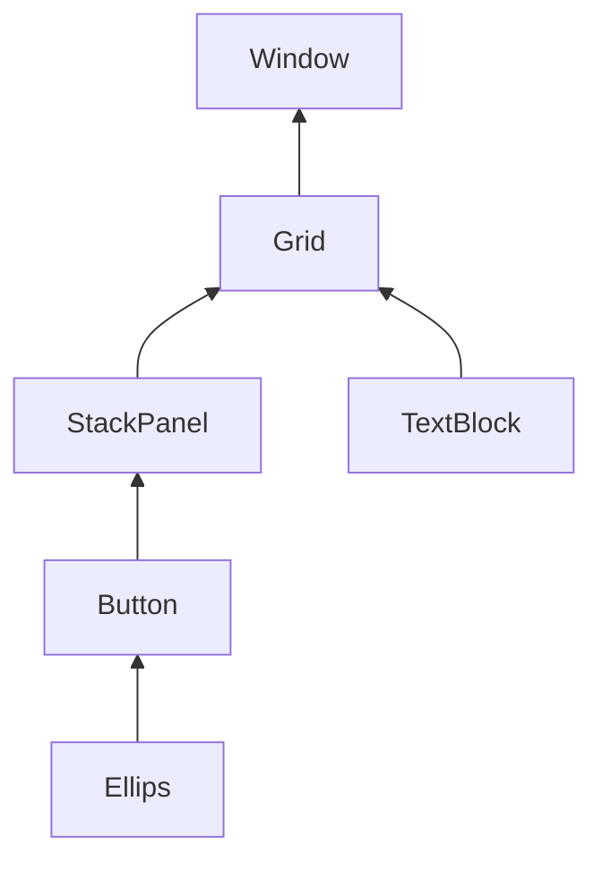

## Events / События

- [Events / События](#events--события)
  - [Модель событий в WPF](#модель-событий-в-wpf)
    - [Маршрутизируемые события](#маршрутизируемые-события)
      - [Генерация маршрутизируемого события](#генерация-маршрутизируемого-события)
    - [Подключение обработчиков событий](#подключение-обработчиков-событий)
      - [Обработка маршрутизируемого события](#обработка-маршрутизируемого-события)
    - [Определение маршрутизированных событий](#определение-маршрутизированных-событий)
    - [Маршрутизация событий](#маршрутизация-событий)
      - [Класс RoutedEventArgs](#класс-routedeventargs)
    - [Поднимающиеся события](#поднимающиеся-события)
      - [Обработка заблокированного события](#обработка-заблокированного-события)
    - [Прикрепляемые события](#прикрепляемые-события)
    - [Туннельные события](#туннельные-события)
  - [События клавиатуры](#события-клавиатуры)
    - [События ввода с клавиатуры](#события-ввода-с-клавиатуры)
      - [Обработка нажатия клавиши](#обработка-нажатия-клавиши)
    - [Валидация текстового ввода](#валидация-текстового-ввода)
    - [Состояние клавиш](#состояние-клавиш)
  - [События фокуса](#события-фокуса)
    - [Фокус ввода](#фокус-ввода)
    - [События получения/потери фокуса](#события-полученияпотери-фокуса)
    - [Выделение текста при получении фокуса ввода](#выделение-текста-при-получении-фокуса-ввода)
  - [События мыши](#события-мыши)
    - [События ввода с использованием мыши](#события-ввода-с-использованием-мыши)
      - [Щелчки кнопками мыши](#щелчки-кнопками-мыши)
      - [Захват мыши](#захват-мыши)
    - [События перетаскивания](#события-перетаскивания)
  - [События жизненного цикла](#события-жизненного-цикла)
    - [События окна](#события-окна)
    - [События приложения](#события-приложения)
    - [События времени существования](#события-времени-существования)
  - [События навигации](#события-навигации)
    - [Отслеживание событий навигации](#отслеживание-событий-навигации)
    - [Обработка на уровне страницы](#обработка-на-уровне-страницы)
    - [Обработка на уровне главного окна](#обработка-на-уровне-главного-окна)
    - [Обработка на уровне приложения](#обработка-на-уровне-приложения)

В прошлой главе рассматривались различные элементы управления. Но чтобы с ними взаимодействовать, нам надо использовать модель событий. Каждый разработчик, работающий в .NET, знаком с понятием <dfn title="событие">события</dfn>: это сообщение, которое посылается объектом (например, элементом WPF) для уведомления кода о том, что произошло что-то важное. Для элементов управления в WPF определено большое количество событий, которые условно можно разделить на несколько групп:

- **Keyboard events**: События клавиатуры

- **Mouse events**: События мыши

- **Stylus events**: События стилуса

- **(Multi)touch events**: События сенсорного экрана/мультитач

- **Lifecycle events**: События жизненного цикла

- **Navigation events**: События навигации

### Модель событий в WPF
WPF в отличие от других технологий, например, от Windows Forms, предлагает новую концепцию событий — **маршрутизированные события** (**routed events**), таким образом дополняя модель событий .NET новой идеей маршрутизации. Маршрутизация позволяет событию возникать в одном элементе, а генерироваться в другом: например, щелчок на кнопке панели инструментов генерируется в панели инструментов, а затем в содержащем эту панель окне, и только тогда передается на обработку коду.

#### Маршрутизируемые события
<dfn title="маршрутизируемое событие">Маршрутизируемые события</dfn> — это события с большими транспортными возможностями: они могут туннелироваться вниз и распространяться пузырьками наверх по дереву элементов и по пути запускать обработчики событий. Маршрутизируемые события позволяют обработать событие в одном элементе (например, в метке), хотя оно возникло в другом (например, в изображении внутри этой метки). Как и в случае свойств зависимости, маршрутизируемые события можно употреблять и традиционным способом — подключив обработчик событий с нужной сигнатурой — но все равно необходимо понимать принципы их работы, чтобы задействовать все их возможности.

Маршрутизация событий дает возможность писать лаконичный и понятный код, который может обрабатывать события в наиболее удобном для этого месте. Она необходима также для работы с моделью содержимого WPF, позволяющей создавать простые элементы (например, кнопки) из десятков отдельных ингредиентов, каждый из которых имеет свой собственный набор событий.

Модель событий WPF очень похожа на модель свойств WPF. Как и свойства зависимости, маршрутизируемые события представляются статическими полями, доступными только для чтения, которые регистрируются в статическом конструкторе и оформляются в виде стандартного определения события .NET.

Например, WPF-класс `Button` предлагает знакомое событие `Click`, являющееся потомком абстрактного класса `ButtonBase`. Ниже показано, как определяется и регистрируется это событие:
```cs
public abstract class ButtonBase : ContentControl, ...
{
   // Определение события
   public static readonly RoutedEvent ClickEvent;

   // Регистрация события
   static ButtonBase()
   {
      ButtonBase.ClickEvent = EventManager.RegisterRoutedEvent(
         "Click", RoutingStrategy.Bubble,
         typeof(RoutedEventHandler), typeof(ButtonBase));
   }

   // Традиционная оболочка события
   public event RoutedEventHandler Click
   {
      add
      {
         base.AddHandler(ButtonBase.ClickEvent, value);
      }
      remove
      {
         base.RemoveHandler(ButtonBase.ClickEvent, value);
      }
   }
   ...
}
```

Свойства зависимости регистрируются посредством метода `DependencyProperty.Register()`, а для регистрации маршрутизируемых событий предназначен метод `EventManager.RegisterRoutedEvent()`. При регистрации события нужно указать имя события, тип маршрутизации (об этом чуть позже), делегат, определяющий синтаксис обработчика события (в данном примере это `RoutedEventHandler`), и класс, которому принадлежит событие (в данном примере `ButtonBase`).

Как правило, маршрутизируемые события упаковываются в обычные события .NET, чтобы сделать их доступными для всех языков .NET. Оболочка события добавляет и удаляет зарегистрированные вызывающие объекты с помощью методов `AddHandler()` и `RemoveHandler()`, которые определены в базовом классе `FrameworkElement` и наследуются каждым элементом WPF.

Как и в случае свойств зависимости, определение маршрутизируемых событий можно совместно использовать несколькими классами. К примеру, событие `MouseUp` используют два базовых класса: `UIElement` (начальная точка для обычных элементов WPF) и `ContentElement` (начальная точка для элементов контента — отдельных частей содержимого, которые могут помещаться в документе потока). Событие `MouseUp` определено в классе `System.Windows.Input.Mouse`. Классы `UIElement` и `ContentElement` просто используют его с помощью метода `RoutedEvent.AddOwner()`:
```cs
UIElement.MouseUpEvent = Mouse.MouseUpEvent.AddOwner(typeof(UIElement));
```

##### Генерация маршрутизируемого события
Конечно, как и любое событие, определяющий класс должен где-то сгенерировать маршрутизируемое событие. Где именно — это уже детали реализации. Однако следует помнить, что ваше событие не возбуждается через традиционную оболочку событий .NET. Вместо этого используется метод `RaiseEvent()`, наследуемый каждым элементом от класса `UIElement`. Ниже представлен соответствующий код класса `ButtonBase`:
```cs
RoutedEventArgs е = new RoutedEventArgs(ButtonBase.ClickEvent, this);
base.RaiseEvent(e);
```

Метод `RaiseEvent()` отвечает за генерацию события для каждого вызывающего объекта, который был зарегистрирован с помощью метода `AddHandler()`. Поскольку этот метод является общедоступным, вызывающим объектам предоставляется выбор: они могут зарегистрироваться напрямую, с помощью метода `AddHandler()`, либо воспользоваться оболочкой события.

В любом случае они будут уведомлены о вызове метода `RaiseEvent()`. Все события WPF придерживаются знакомого вам условия о сигнатурах событий, существующего в .NET. Первый параметр каждого обработчика события содержит ссылку на объект, который сгенерировал событие (отправитель). Второй параметр — объект `EventArgs`, объединяющий все дополнительные детали, которые могут понадобиться.

Например, событие `MouseUp` предоставляет объект `MouseEventArgs`, который показывает, какая кнопка мыши была нажата при возникновении события.

В приложениях Windows Forms для многих событий обычно применялся базовый класс `EventArg`, если им не требовалось передавать дополнительную информацию. В приложениях WPF ситуация иная, поскольку в них поддерживается модель маршрутизируемых событий.

Если событию не нужно посылать какую-либо дополнительную информацию, то в WPF оно использует класс `RoutedEventArgs`, который содержит некоторые сведения о маршрутизации события. Если событию нужно передать дополнительную информацию, оно использует более специализированный объект, порожденный от `RoutedEventArgs`. Поскольку каждый класс аргумента события WPF порожден от `RoutedEventArgs`, каждый обработчик события WPF имеет доступ к информации о маршрутизации события.

#### Подключение обработчиков событий
Подключить обработчики событий можно декларативно в файле xaml-кода, а можно стандартным способом в файле отделенного кода.

Декларативное подключение:
```xml
<Button x:Name="Button1" Content="Click" Click="Button_Click" />
```

И подключим еще один обработчик в коде, чтобы при нажатии на кнопку срабатывали сразу два обработчика:
```cs
public partial class MainWindow : Window
{
    public MainWindow()
    {
        InitializeComponent();
        Button1.Click += Button1_Click;
    }
    // обработчик, подключаемый в XAML
    private void Button_Click(object sender, RoutedEventArgs e)
    {
        MessageBox.Show("Hi from Button_Click");
    }
    // обработчик, подключаемый в конструкторе
    private void Button1_Click(object sender, RoutedEventArgs e)
    {
        MessageBox.Show("Hi from Button1_Click");
    }
}
```

Таким образом, прикрепить обработчик события можно несколькими способами. Чаще всего для этой цели добавляется атрибут события в разметку XAML. Данный атрибут события получает имя события, которое нужно обрабатывать, а его значением является имя метода обработчика события. Вот пример, в котором этот синтаксис применяется для прикрепления обработчика `img_MouseUp` к событию `MouseUp` элемента `Image`:
```xml
<Image Source="my_foto.jpg" Name="img" MouseUp="img_MouseUp"></Image>
```

Обычно (хотя и не обязательно) имя метода обработчика события имеет вид `ИмяЭлемента_ИмяСобытия`. Если элемент не имеет определенного имени (возможно, потому, что с ним не нужно взаимодействовать в любом другом месте кода), попробуйте использовать имя, которое он мог бы иметь:
```xml
<Button Click="cmdOKClick">OK</Button>
```

Может возникнуть желание прикрепить событие к высокоуровневому методу, выполняющему задачу. Однако вы получите большую гибкость при наличии дополнительного уровня кода для обработки событий. Например, щелчок на кнопке `cmdUpdate` не вызовет непосредственно метод `UpdateDatabase()`. Вместо этого будет вызван обработчик события — например, `cmdUpdate_Click()` — который может вызвать метод `UpdateDatabase()`, а уже тот сделает всю работу. Этот принцип позволяет изменить местонахождение кода базы данных, заменить кнопку обновления другим элементом управления, привязать несколько элементов управления к одному и тому же процессу — и все это при полной возможности изменять в последующем пользовательский интерфейс.

Если необходим более простой способ работы с действиями, которые могут запускаться из нескольких разных мест в пользовательском интерфейсе (кнопки панели инструментов, команды меню и т.д.), понадобится добавить средство команд WPF.

Событие можно соединить и с кодом. Вот эквивалент приведенного выше кода разметки XAML:
```cs
img.MouseUp += new MouseButtonEventHandler(img_MouseUp);
```

Этот код создает объект делегата, имеющий правильную сигнатуру для события (в данном случае это экземпляр делегата `MouseButtonEventHandler`) и указывающий на метод `img_MouseUp()`. Затем он добавляет делегат в список зарегистрированных обработчиков для события `img.MouseUp`.

Язык C# разрешает применять более лаконичный синтаксис, создающий подходящий объект делегата неявно:
```cs
img.MouseUp += img_MouseUp;
```

Подход с использованием кода полезен тогда, когда нужно динамически создать элемент управления и прикрепить обработчик события в некоторый момент существования окна. Для сравнения скажем, что события, захватываемые в XAML, всегда присоединяются при первом создании экземпляра объекта окна. Этот подход позволяет также упростить и рационализировать код XAML, что исключительно полезно, если предполагается совместно использовать его не с программистами, а, скажем, с художниками-дизайнерами. Недостатком является большой объем шаблонного кода, который загромождает кодовые файлы.

##### Обработка маршрутизируемого события
Подход, продемонстрированный в предыдущем коде, основан на оболочке события, которая вызывает метод **`UIElement.AddHandler()`**. Вы можете связать событие напрямую, самостоятельно вызвав метод `UIElement.AddHandler()`, например:
```cs
img.AddHandler(Image.MouseUpEvent,
   new MouseButtonEventHandler(img_MouseUp));
```

При использовании этого подхода всегда приходится создавать подходящий тип делегата (например, `MouseButtonEventHandler`). Нельзя создать объект делегата неявно, как при захвате события через оболочку свойства, поскольку метод `UIElement.AddHandler()` поддерживает все события WPF и не знает, какой тип делегата вы хотите использовать.

Некоторые разработчики предпочитают использовать имя класса, в котором определено событие, а не имя класса, сгенерировавшего событие.

Выбор подхода зависит от ваших предпочтений. Хотя у второго подхода есть недостаток: он не дает ясного представления о том, что класс `Image` обеспечивает событие `MouseUpEvent`. Такой код можно неправильно понять и предположить, что он прикрепляет обработчик, предназначенный для обработки `MouseUpEvent` во вложенном элементе.

Если понадобится открепить обработчик события, то это можно сделать только в коде — например, с помощью операции `-=`:
```cs
img.MouseUp -= img_MouseUp;
```

Либо можно использовать метод `UIElement.RemoveHandler()`:
```cs
img.RemoveHandler(Image.MouseUpEvent,
   new MouseButtonEventHandler(img_MouseUp));
```

Технически возможно прикрепить один и тот же обработчик к одному и тому же событию более одного раза. Обычно это происходит из-за ошибки при кодировании. (В этом случае обработчик события будет запущен несколько раз.) После удаления обработчика события, который был подключен дважды, событие все-таки запустит этот обработчик, но только один раз.

#### Определение маршрутизированных событий
Определение маршрутизированных событий отличается от стандартного определения событий в языке C#. Для определения маршрутизированных событий в классе создавалось статическое поле по типу **`RoutedEvent`**:
```cs
public static RoutedEvent СобытиеEvent
```

Это поле, как правило, имеет суффикс *Event*. Затем это событие регистрируется в статическом конструкторе.

И также класс, в котором создается событие, как правило определяет объект-обертку над обычным событием. В этой обертке с помощью метода **`AddHandler`** происходит добавление обработчика для данного события, а с помощью метода **`RemoveHandler`** — удаление обработчика.

К примеру, возьмем встроенный класс `ButtonBase` — базовый класс для всех кнопок, который определяет ряд событий, в том числе событие **`Click`**:
```cs
public abstract class ButtonBase : ContentControl, ...
{
    // определение событие
    public static readonly RoutedEvent ClickEvent;

    static ButtonBase()
    {
        // регистрация маршрутизированного события
        ButtonBase.ClickEvent = EventManager.RegisterRoutedEvent("Click",
            RoutingStrategy.Bubble, typeof(RoutedEventHandler), typeof(ButtonBase));
        //................................
    }
    // обертка над событием
    public event RoutedEventHandler Click
    {
        add
        {
            // добавление обработчика
            base.AddHandler(ButtonBase.ClickEvent, value);
        }
        remove
        {
            // удаление обработчика
            base.RemoveHandler(ButtonBase.ClickEvent, value);
        }
    }
  // остальное содержимое класса
}
```

Маршрутизированные события регистрируются с помощью метода `EventManager.RegisterRoutedEvent()`. В этот метод передаются последовательно имя события, тип события (поднимающееся, прямое, опускающееся), тип делегата, предназначенного для обработки события, и класс, который владеет этим событием.

#### Маршрутизация событий
Многие элементы управления в WPF являются элементами управления содержимым, которые могут иметь разный тип и разный объем вложенного содержимого. Например, можно собрать графическую кнопку из отдельных графических элементов, создать метку, которая будет совмещать текст и рисунки, или поместить содержимое в специальный контейнер, чтобы его можно было прокручивать или сворачивать. И такой процесс "вкладывания" можно повторять столько раз, сколько уровней нужно получить.

При этом возникает интересный вопрос. Например, предположим, что имеется метка, в которой имеется панель `StackPanel`, содержащая два текстовых блока и изображение:
```xml
<Label BorderBrush="LightBlue" BorderThickness="3" Margin="5"  HorizontalAlignment="Center">
          <StackPanel>
                <TextBlock Margin="3" FontSize="13">
                Всем привет!
            </TextBlock>
            <Image Source="grimace.png" Width="80" Height="80" ></Image>
            <TextBlock Margin="3" FontSize="13">
                Маршрутизация событий
            </TextBlock>
          </StackPanel>
</Label>
```

Как вам уже известно, каждый ингредиент, помещаемый в окно WPF, так или иначе является наследником класса `UIElement`, включая `Label`, `StackPanel`, `TextBlock` и `Image`. Класс `UIElement` определяет несколько ключевых событий. Например, каждый класс, являющийся потомком `UIElement`, обеспечивает события `MouseUp` и `MouseDown`.

А теперь подумайте, что произойдет при щелчке на изображении в такой метке. Понятно, что при этом возникнут события `Image.MouseDown` и `Image.MouseUp`. А если вам нужно обрабатывать все щелчки на метке одинаковым образом? То есть неважно, где щелкнул пользователь: на изображении, на тексте или на пустом месте в области метки. В любом из этих случаев нужно реагировать на щелчок с помощью одного и того же кода.

Понятно, что к событиям `MouseDown` и `MouseUp` каждого элемента можно привязать один и тот же обработчик, однако это может загромоздить код и усложнить сопровождение разметки. WPF предлагает более удобное решение с помощью модели маршрутизируемых событий.

Модель событий WPF отличается от событий WinForms не только декларативным подключением. События, возникнув на одном элементе, могут обрабатываться на другом. События могут подниматься и опускаться по дереву элементов.

Маршрутизируемые события бывают трех видов:

- <dfn title="прямое событие">Прямые события</dfn> (direct events) — они возникают и отрабатывают на одном элементе и никуда дальше не передаются. Действуют как обычные события.

    Подобны обычным событиям .NET. Они возникают в одном элементе и не передаются в другой. Например, прямым является событие `MouseEnter`, которое возникает, когда указатель мыши наводится на элемент.

- <dfn title="поднимающееся событие">Поднимающиеся (пузырьковые) события</dfn> (bubbling events) — возникают на одном элементе, а потом передаются дальше к родителю — элементу-контейнеру и далее, пока не достигают наивысшего родителя в дереве элементов.

    Поднимаются по иерархии содержания. Например, пузырьковым событием является `MouseDown`. Оно возникает в элементе, на котором был произведен щелчок, потом передается от этого элемента к родителю, затем к родителю этого родителя, и т.д., пока WPF не достигнет вершины дерева элементов.

- <dfn title="опускающееся событие">Опускающиеся (туннелируемые, туннельные) события</dfn> (tunneling events) — начинают отрабатываться в корневом элементе окна приложения и идут далее по вложенным элементам, пока не достигают вызвавшего элемента.

    Опускаются по иерархии содержания. Они позволяют предварительно просматривать (и, возможно, останавливать) событие, прежде чем оно дойдет до подходящего элемента управления. Например, `PreviewKeyDown` позволяет перехватить нажатие клавиши, сначала на уровне окна, а затем в более специфических контейнерах, вплоть до элемента, содержавшего фокус в момент нажатия клавиши.

При регистрации маршрутизируемого события с помощью метода `EventManager.RegisterEvent()` ему передается значение из перечисления `RoutingStrategy`, которое задает необходимое поведение для события.

Поскольку события `MouseUp` и `MouseDown` являются пузырьковыми событиями, вы уже можете определить, что произойдет в примере с составной меткой. При щелчке на довольном смайлике событие `MouseDown` возникнет в следующем порядке:

- `Image.MouseDown`

- `StackPanel.MouseDown`

- `Label.MouseDown`

После того как событие `MouseDown` возникнет в метке, оно передается следующему элементу управления (в данном случае это сетка `Grid` для разметки вмещающего окна), а затем его родителю (окно). Окно находится на самом верху иерархии содержания и в самом конце в последовательности пузырькового распространения события. Здесь последний шанс обработать пузырьковое событие наподобие `MouseDown`. Если пользователь отпускает кнопку мыши, в такой же последовательности возникает событие `MouseUp`.

Пузырьковые события не обязательно обрабатывать в одном месте: например, ничто не мешает обрабатывать события `MouseDown` и `MouseUp` на каждом уровне. Однако, как правило, для каждой задачи выбирается наиболее подходящая маршрутизация событий.

##### Класс RoutedEventArgs
При обработке пузырькового события параметр отправителя содержит ссылку на последнее звено в цепочке. Например, если событие перед обработкой всплывает от изображения до метки, то параметр отправителя будет ссылаться на объект метки.

В некоторых случаях требуется знать, где первоначально произошло событие. Эту информацию, а также другие подробности, можно получить из свойств класса `RoutedEventArgs` (которые перечислены ниже). Поскольку все классы аргументов событий WPF являются наследниками `RoutedEventArgs`, эти свойства доступны в любом обработчике события.

Таким образом, все маршрутизируемые события используют класс **`RoutedEventArgs`** (или его наследников), который представляет доступ к следующим свойствам:

*Свойства класса `RoutedEventArgs`*
Имя | Описание
-- | --
**`Source`** | **Элемент логического дерева, являющийся источником события.** Указывает, какой объект сгенерировал событие. Если речь идет о событии клавиатуры, то это элемент управления, имевший фокус ввода в момент возникновения события (например, когда была нажата клавиша). В случае события мыши это самый верхний элемент под указателем мыши в момент возникновения события (например, когда был произведен щелчок кнопкой мыши).
**`OriginalSource`** | **Элемент визуального дерева, являющийся источником события.** Указывает, какой объект первоначально сгенерировал событие. Как правило, совпадает с `Source`. Однако в некоторых случаях `OriginalSource` спускается глубже по дереву объектов, чтобы дойти до внутреннего элемента, являющегося частью элемента более высокого уровня. Например, если вы щелкнете кнопкой мыши близко к границе окна, то получите объект Window в качестве источника события и `Border` в качестве первоначального источника. Это объясняется тем, что `Window` состоит из отдельных меньших элементов. Чтобы разобраться с этой сборной моделью более детально (и узнать, как ее можно изменить), обратитесь к шаблонам элементов управления.
**`RoutedEvent`** | **Представляет имя события.** Предоставляет объект `RoutedEvent` для события, сгенерированного вашим обработчиком события (например, статический объект `UIElement.MouseUpEvent`). Эта информация бывает полезна при обработке разных событий одним и тем же обработчиком.
**`Handled`** | **Позволяет остановить процесс пузырькового распространения или туннелирования события.** Если это свойство установлено в `True`, событие не будет подниматься и опускаться, а ограничится непосредственным источником.. Если элемент управления заносит в свойство `Handled` значение `true`, событие прекращает продвижение и не будет возникать в любых других элементах.

#### Поднимающиеся события
Допустим, у нас имеется такая разметка xaml:
```xml
<Window x:Class="EventsApp.MainWindow"
        xmlns="http://schemas.microsoft.com/winfx/2006/xaml/presentation"
        xmlns:x="http://schemas.microsoft.com/winfx/2006/xaml"
        xmlns:d="http://schemas.microsoft.com/expression/blend/2008"
        xmlns:mc="http://schemas.openxmlformats.org/markup-compatibility/2006"
        xmlns:local="clr-namespace:EventsApp"
        mc:Ignorable="d"
        Title="MainWindow" Height="250" Width="400">
    <Grid>
        <Grid.ColumnDefinitions>
            <ColumnDefinition Width="Auto" />
            <ColumnDefinition />
        </Grid.ColumnDefinitions>
        <StackPanel Grid.Column="0" VerticalAlignment="Center" MouseDown="Control_MouseDown">
            <Button x:Name="button1" Width="80" Height="50" MouseDown="Control_MouseDown" Margin="10" >
                <Ellipse Width="30" Height="30" Fill="Red" MouseDown="Control_MouseDown" />
            </Button>
        </StackPanel>
        <TextBlock x:Name="textBlock1" Grid.Column="1" Padding="10" />
    </Grid>
</Window>
```

В данном случае мы получаем следующее дерево элементов:



Три элемента имеют привязку к одному обработчику события, которое возникает при нажатии правой кнопки мыши или тачпада. Определим этот обработчик в файле кода C#:
```cs
private void Control_MouseDown(object sender, MouseButtonEventArgs e)
{
    textBlock1.Text = textBlock1.Text + "sender: " + sender.ToString() + "\n";
    textBlock1.Text = textBlock1.Text + "source: " + e.Source.ToString() + "\n\n";
}
```

Обработчик в данном случае выводит информацию о событии в текстовый блок.

И так как это событие **`MouseDown`** является поднимающимся, то при нажатии правой кнопкой мыши на элемент самого нижнего уровня — `Ellipse`, событие `MouseDown` будет подниматься к контейнерам и отработает три раза последовательно для всех элементов `Ellipse`, `Button`, `StackPanel`.

Ниже представлен пример программы демонстрирующей пузырьковое распространение событий:
```xml
<Window x:Class="WpfApplication1.MainWindow"
        xmlns="http://schemas.microsoft.com/winfx/2006/xaml/presentation"
        xmlns:x="http://schemas.microsoft.com/winfx/2006/xaml"
        Title="MainWindow" Height="350" Width="525"
        MouseUp="Some_Clicked">
    <Grid Margin="3" MouseUp="Some_Clicked">
        <Grid.RowDefinitions>
            <RowDefinition Height="auto"></RowDefinition>
            <RowDefinition></RowDefinition>
            <RowDefinition Height="auto"></RowDefinition>
            <RowDefinition Height="auto"></RowDefinition>
        </Grid.RowDefinitions>
        <Label BorderBrush="LightBlue" BorderThickness="3"  HorizontalAlignment="Center" MouseUp="Some_Clicked">
            <StackPanel MouseUp="Some_Clicked">
                <TextBlock Margin="3" FontSize="13" MouseUp="Some_Clicked">
                Всем привет!
                </TextBlock>
                <Image Source="grimace.png" Width="60" Height="60" MouseUp="Some_Clicked"></Image>
                <TextBlock Margin="3" FontSize="13" MouseUp="Some_Clicked">
                Маршрутизация событий
                </TextBlock>
            </StackPanel>
        </Label>
        <ListBox Grid.Row="1" Margin="3" Name="lbInfo"></ListBox>
        <CheckBox Grid.Row="2" Margin="3" Content="Показать первое событие"
                  Name="chb_ShowFirstEvent"></CheckBox>
        <Button Grid.Row="3" Margin="3" Padding="3" HorizontalAlignment="Right"
                Click="Button_Click">Очистить</Button>
    </Grid>
</Window>
```

c#:
```cs
public partial class MainWindow : Window
    {
        public MainWindow()
        {
            InitializeComponent();
        }

        int i = 0;
        private void Some_Clicked(object sender, MouseButtonEventArgs e)
        {
            i++;
            string message = "--> " + i + ":\r\n" +
                "Объект: " + sender.ToString() + "\r\n" +
                "Источник: " + e.Source.ToString() + "\r\n" +
                "Начальный источник: " + e.OriginalSource;
            lbInfo.Items.Add(message);
            e.Handled = (bool)chb_ShowFirstEvent.IsChecked;
        }

        private void Button_Click(object sender, RoutedEventArgs e)
        {
            lbInfo.Items.Clear();
        }
}
```

В данном примере создается простое окно, которое демонстрирует пузырьковое распространение события. Если щелкнуть на какой-либо части метки, события будут возникать в порядке, перечисленном на текстовой панели ниже. На рисунке приведен вид этого окна сразу после щелчка пользователя на изображении внутри метки. Событие `MouseUp` проходит пять уровней и останавливается на окне `MainWindow`.

С технической точки зрения событие `MouseUp` предоставляет объект `MouseButtonEventArgs` с дополнительной информацией о состоянии мыши в момент возникновения события. Однако класс `MouseButtonEventArgs` является наследником `MouseEventArgs`, который в свою очередь является наследником класса `RoutedEventArgs`. Это позволяет использовать его при объявлении обработчика события (как показано здесь), если дополнительная информация о мыши не требуется.

В этом примере есть еще один момент. Если установить флажок `chb_ShowFirstEvent`, метод `Some_Clicked()` присвоит свойству `RoutedEventArgs.Handled` значение `true`, что останавливает последовательность пузырькового распространения события сразу при его возникновении. Поэтому вы увидите в списке только первое событие.

Здесь нужно дополнительное приведение, т.к. свойство `CheckBox.IsChecked` является логическим значением, которое может принимать значение `null` (`bool?`, а не `bool`). Значение `null` представляет неопределенное состояние флажка, которое означает, что он и не установлен, и не сброшен. Эта особенность не используется в данном примере, поэтому достаточно простого приведения.

Поскольку метод `Some_Clicked()` обрабатывает событие `MouseUp`, которое возникает в объекте `Window`, щелчки можно перехватывать в текстовой панели и на пустой поверхности окна. Однако событие `MouseUp` не возникает при щелчке на кнопке "Очистить" (которая удаляет из текстовой панели все записи). Это связано с тем, что кнопке соответствует интересный фрагмент кода, который блокирует событие `MouseUp` и генерирует событие более высокого уровня `Click`. Одновременно флагу `Handled` присваивается значение `true`, что блокирует дальнейшее продвижение события `MouseUp`.

В отличие от элементов управления Windows Forms, большинство элементов WPF не имеют события `Click`. Вместо этого у них есть более простые события `MouseDown` и `MouseUp`. Событие `Click` зарезервировано для кнопочных элементов управления.

##### Обработка заблокированного события
Интересно, что существует способ получать события, которые отмечены как обработанные. Вместо прикрепления обработчика события посредством XAML следует использовать рассмотренный ранее метод `AddHandler()`. Этот метод имеет перегруженный вариант, который принимает логическое значение в третьем параметре. Если задать его равным `true`, вы получите событие, даже если для него был установлен флаг `Handled`:
```cs
cmdClear.AddHandler(UIElement.MouseUpEvent,
   new MouseButtonEventHandler(cmdClear_MouseUp), true);
```

Такое решение редко бывает удачным. Кнопка предназначена для блокирования события `MouseUp` по очень простой причине: чтобы избежать путаницы. Ведь в Windows принято, что "щелкнуть" на кнопке можно и с помощью клавиатуры, да еще несколькими способами. Если вы ошибочно будете обрабатывать в элементе `Button` событие `MouseUp`, а не события `Click`, то ваш код будет реагировать только на щелчки мышью, но не на эквивалентные клавиатурные действия.

#### Прикрепляемые события
Рассмотренная декоративная метка из предыдущей статьи является довольно простым примером пузырькового распространения события, поскольку все элементы поддерживают событие `MouseUp`. Но многие элементы управления обладают собственными специальными событиями. Одним из таких примеров является кнопка: она добавляет событие `Click`, которое не определено ни в одном базовом классе.

Событие `Click` определено в классе `ButtonBase` и наследуется классом `Button`. Это позволяет использовать его не только для кнопок, но и для других элементов, таких как `RadioButton` и `CheckBox`. Событие `Click` в WPF является маршрутизируемым событием типа "пузырьковое" (bubbling). Это означает, что когда кнопка получает щелчок мыши, событие `Click` возникает на кнопке и затем распространяется вверх по дереву элементов, позволяя обрабатывать его на родительских элементах.

Здесь возникает интересный момент. Предположим, что стек кнопок упакован в элемент `StackPanel`, и необходимо обработать все щелчки на кнопках в одном обработчике события. Конечно, можно прикрепить события `Click` каждой кнопки к одному и тому же обработчику события. Однако событие `Click` поддерживает пузырьковое распространение событий, и это позволяет решить задачу более изящным способом. Все щелчки на кнопках можно обработать, реагируя на событие `Click` на более высоком уровне (например, на уровне элемента `StackPanel`).

К сожалению, следующий — вроде бы очевидный — код работать не будет:
```xml
<StackPanel Click="DoSomething" Margin="5">
   <Button Name="cmd1">Command 1</Button>
   <Button Name="cmd2">Command 2</Button>
   <Button Name="cmd3">Command 3</Button>
</StackPanel>
```

Дело в том, что `StackPanel` не содержит событие `Click`, поэтому такой код вызовет ошибку во время синтаксического анализа XAML. Для решения этой задачи нужно использовать другой синтаксис с применением прикрепленных событий в виде `ИмяКласса.ИмяСобытия`. Вот исправленный вариант:
```xml
<StackPanel Button.Click="DoSomething" Margin="5">
   <Button Name="cmd1">Command 1</Button>
   <Button Name="cmd2">Command 2</Button>
   <Button Name="cmd3">Command 3</Button>
</StackPanel>
```

Теперь обработчик события получит управление при щелчках на всех упакованных кнопках.

Событие `Click` определено в классе `ButtonBase` и наследуется классом `Button`. Если прикрепить обработчик события к `ButtonBase.Click`, то этот обработчик события будет использоваться при щелчке на любом элементе управления, порожденном от `ButtonBase` (включая классы `Button`, `RadioButton` и `CheckBox`). Но если прикрепить обработчик события к `Button.Click`, то он будет использоваться только для объектов `Button`.

Прикрепляемое событие можно подключить и в коде, но тогда вместо операции `+=` придется использовать метод `UIElement.AddHandler()`. Вот пример (здесь предполагается, что элемент `StackPanel` имеет имя `pnlButtons`):
```cs
pnlButtons.AddHandler(Button.Click, new RoutedEventHandler(DoSomething));
```

Есть несколько возможностей определить в обработчике события `DoSomething()`, какая кнопка сгенерировала событие. Можно сравнить ее текст (возможны проблемы с локализацией) или ее имя (ненадежно, так как на этапе создания приложения невозможно перехватить ошибочно введенные имена). Лучше всего задать с помощью XAML у каждой кнопки свойство `Name` — тогда можно обратиться к соответствующему объекту посредством свойства `OriginalSource` класса `RoutedEventArgs`. Вот пример:
```cs
private void DoSomething(object sender, RoutedEventArgs e)
{
            if (e.OriginalSource == cmd1)
            {       }
            else if (e.OriginalSource == cmd2)
            {       }
            else if (e.OriginalSource == cmd3)
            {       }
}
```

Существует еще один вариант: вместе с кнопкой отправить порцию информации, которую можно использовать в коде. Например, для каждой кнопки можно задать свойство `Tag`:
```xml
<StackPanel Button.Click="DoSomething" Margin="5">
   <Button Name="cmd1" Tag="The first button.">Command 1</Button>
   <Button Name="cmd2" Tag="The second button.">Command 2</Button>
   <Button Name="cmd3" Tag="The third button.">Command 3</Button>
</StackPanel>
```

После этого можно обращаться к свойству `Tag` в коде:
```cs
private void DoSomething(object sender, RoutedEventArgs e)
{
    object tag = ((Button)e.OriginalSource).Tag;
    MessageBox.Show((string)tag);
}
```

Таким образом, если у нас есть несколько элементов одного и того же типа и мы хотим привязать их к одному событию, то мы можем воспользоваться прикрепляемыми событиями (attached events).

Так, ранее у нас была группа элементов `RadioButton` и, чтобы вывести при выборе любого из них выбранное значение, нам приходилось у каждого определять обработчик события. Но это не оптимальная модель. И именно здесь мы и применим прикрепляемые события:
```xml
<StackPanel x:Name="menuSelector" Grid.Column="0" RadioButton.Checked="RadioButton_Click">
    <RadioButton GroupName="menu" Content="Салат Оливье" />
    <RadioButton GroupName="menu" Content="Котлета по-киевски" />
    <RadioButton GroupName="menu" Content="Пицца с овощами" />
    <RadioButton GroupName="menu" Content="Мясной рулет" />
</StackPanel>
```

Обработчик для прикрепляемого события задается в формате *`Имя_класса.Название_события="Обработчик"`*. Здесь атрибут `RadioButton.Checked="RadioButton_Click"` закрепляет все радиокнопки на `StackPanel` за одним обработчиком. Тогда в коде можно прописать:
```cs
private void RadioButton_Click(object sender, RoutedEventArgs e)
{
    RadioButton selectedRadio = (RadioButton)e.Source;
    textBlock1.Text = "Вы выбрали: " + selectedRadio.Content.ToString();
}
```

И на текстовый блок выводится выбранный пункт.

Также обработчик для прикрепляемого события мы можем задать в коде c#:
```cs
menuSelector.AddHandler(RadioButton.CheckedEvent, new RoutedEventHandler(RadioButton_Click));
```

#### Туннельные события
Туннельные события действуют прямо противоположным способом. Как правило, все они начинаются со слова `Preview`. Возьмем выше приведенный пример и заменим событие `MouseDown` на `PreviewMouseDown`
```xml
<StackPanel Grid.Column="0" VerticalAlignment="Center" PreviewMouseDown="Control_MouseDown">
    <Button x:Name="button1" Width="80" Height="50" PreviewMouseDown="Control_MouseDown" Margin="10" >
        <Ellipse Width="30" Height="30" Fill="Red" PreviewMouseDown="Control_MouseDown" />
    </Button>
</StackPanel>
```

Нажмем на элемент `Ellipse`. Тогда событие сначала отработает на элементе `StackPanel` и затем последовательно на элементе `Button` и закончится на элементе `Ellipse`.

Итак, **туннелируемые события** (которые все начинаются с префикса `Preview`, например, `PreviewMouseDown`) спускаются вниз от элемента верхнего уровня во вложенные контексты дерева объектов. В общем случае, каждому пузырьковому событию в библиотеках базовых классов WPF соответствует связанное туннелируемое событие, которое инициируется перед его пузырьковым дополнением. Например, перед инициацией пузырькового события `MouseDown` сначала происходит туннелируемое событие `PreviewMouseDown`.

Обработка туннелируемых событий выглядит как обработка любых других событий; вы просто назначаете имя обработчика события в XAML (или, если необходимо, используете соответствующий синтаксис обработки событий C# в файле кода) и реализуете этот обработчик в файле кода.

Туннелируемые события работают так же, как и пузырьковые, но в обратном направлении. Например, если бы событие `MouseUp` было туннельным (а это не так), то при щелчке на изображении в примере с меткой событие `MouseUp` возникло бы сначала в окне, затем в элементе `Grid`, затем в `StackPanel` и так далее до достижения источника, т.е. изображения в метке.

WPF обычно определяет события попарно. Это означает, что если имеется пузырьковое событие `MouseUp`, то, скорее всего, существует и туннелируемое событие `PreviewMouseUp`. Туннелируемые событие всегда возникает перед пузырьковым событием.

Интересный момент: если пометить туннелируемое событие как обработанное, то пузырьковое событие не возникнет. Это связано с тем, что оба события совместно используют один и тот же экземпляр класса `RoutedEventArgs`.

Туннелируемые события полезны, если нужно выполнить предварительную обработку, связанную с определенными нажатиями клавиш, или отфильтровать некоторые события мыши.

Будьте аккуратны с пометкой туннелируемого события как обработанного. В зависимости от конструкции управляющего элемента, это может помешать ему обработать собственное (соответствующее пузырьковое) событие, чтобы выполнить какое-то действие или обновить свое состояние.

Понятно, что разные стратегии маршрутизации влияют на способ использования событий. А как определить, какой тип маршрутизации использует данное событие?

С туннелируемыми событиями все просто. В соответствии с соглашениями, принятыми в .NET, туннелируемое событие всегда начинается со слова `Preview` (например, `PreviewKeyDown`). Однако похожего механизма различения пузырьковых и прямых событий не существует. Разработчикам, применяющим WPF, лучше всего найти описание события в документации по WPF. В разделе "Routed Event Information" указываются статическое поле события, тип маршрутизации и сигнатура события.

Эту же информацию можно получить программным способом, проверив статическое поле для события. Например, свойство `ButtonBase.ClickEvent.RoutingStrategy` содержит перечислимое значение, которое сообщает, какой тип маршрутизации использует событие `Click`.

Итак, почему же события WPF обычно идут парами (одно туннелируемое и одно пузырьковое)? Ответ заключается в том, что за счет предварительного отслеживания событий вы получаете возможность выполнять любую специфическую логику (проверку достоверности данных, отключение пузырьковых действий и т.д.), прежде чем будет инициирован пузырьковый аналог события. Для примера предположим, что имеется элемент `TextBox`, который должен допускать ввод только числовых данных. В обработчике события `PreviewKeyDown`, если пользователь ввел какие-то нечисловые данные, можно отменить пузырьковое событие, установив свойство `Handled` в `true`.

При построении специального элемента управления, который содержит специальные события, событие можно написать таким образом, чтобы оно могло распространяться, как пузырьковое (или туннелируемое) по дереву XAML. Если интересно, загляните в раздел "Routed Events Overview" ("Обзор маршрутизируемых событий") документации .NET Framework 4.0 SDK. Там вы найдете множество полезных подсказок.

### События клавиатуры

#### События ввода с клавиатуры

Когда пользователь нажимает клавишу, возникает целая серия событий. В таблице эти события перечислены в порядке их возникновения:

К событиям клавиатуры можно отнести следующие события:

*Хронология возникновения событий*
Имя | Тип маршрутизации | Описание
-- | -- | --
**`PreviewKeyDown`** | Туннельное | Возникает при нажатии клавиши
**`KeyDown`** | Поднимающееся | Возникает при нажатии клавиши
**`PreviewTextInput`** | Туннельное | Возникает при получении элементом текстового ввода, т.е. когда нажатие клавиши завершено, и элемент получает текстовый ввод. Это событие не возникает для тех клавиш, которые не "печатают" символы (например, оно не возникает при нажатии клавиш <kbd>Ctrl</kbd>, <kbd>Shift</kbd>, <kbd>Backspace</kbd>, клавиш управления курсором, функциональных клавиш и т.д.)
**`TextInput`** | Поднимающееся | Возникает при получении элементом текстового ввода (генерируется не только клавиатурой, но и стилусом)
**`PreviewKeyUp`** | Туннельное | Возникает при освобождении (отпускании) клавиши
**`KeyUp`** | Поднимающееся | Возникает при освобождении клавиши

Обработка событий клавиатуры отнюдь не так легка, как это может показаться. Некоторые элементы управления могут блокировать часть этих событий, чтобы выполнять свою собственную обработку клавиатуры. Наиболее ярким примером является элемент `TextBox`, который блокирует событие `TextInput`, а также событие `KeyDown` для нажатия некоторых клавиш, таких как клавиши управления курсором. В подобных случаях обычно все-таки можно использовать туннелируемые события (`PreviewTextlnput` и `PreviewKeyDown`).

Элемент `TextBox` добавляет одно новое событие — `TextChanged`. Это событие возникает сразу после того, как нажатие клавиши приводит к изменению текста в текстовом поле. Однако в этот момент новый текст уже видим в текстовом поле, потому отменять нежелательное нажатие клавиши уже поздно.

##### Обработка нажатия клавиши
Понять, как работают и используются события клавиатуры, лучше всего на примере. Ниже представлен пример программы, которая отслеживает и протоколирует все возможные нажатия клавиш, когда в фокусе находится текстовое поле. В данном случае показан результат ввода заглавной буквы S.

Этот пример демонстрирует один важный момент. События `PreviewKeyDown` и `KeyDown` возникают при каждом нажатии клавиши. Однако событие `TextInput` возникает только тогда, когда в элементе был "введен" символ. На самом деле это может означать нажатие многих клавиш. В примере, нужно нажать две клавиши, чтобы получить заглавную букву S: сначала клавишу <kbd>Shift</kbd>, а затем клавишу <kbd>S</kbd>. В результате получаются по два события `KeyDown` и `KeyUp`, но только одно событие `TextInput`.

XAML:
```xml
<Grid>
        <Grid.RowDefinitions>
            <RowDefinition Height="auto"></RowDefinition>
            <RowDefinition Height="*"></RowDefinition>
            <RowDefinition Height="auto"></RowDefinition>
            <RowDefinition Height="auto"></RowDefinition>
        </Grid.RowDefinitions>
        <Grid>
            <Grid.ColumnDefinitions>
                <ColumnDefinition Width="auto"></ColumnDefinition>
                <ColumnDefinition Width="*"></ColumnDefinition>
            </Grid.ColumnDefinitions>
            <Label Margin="3" Grid.Column="0">Введите букву: </Label>
            <TextBox MinWidth="100" HorizontalAlignment="Stretch" Grid.Column="1"
                     Margin="3" Padding="3" KeyDown="KeyEvents" KeyUp="KeyEvents"
                     PreviewTextInput="TextInputEvent" Name="txtContent"></TextBox>
        </Grid>
        <ListBox Grid.Row="1" Margin="3" BorderBrush="LightBlue"
                 BorderThickness="3" Padding="3" Name="lbxEvents"></ListBox>
        <CheckBox Grid.Row="2" Margin="3" Name="chkIgnoreRepeat">
            Игнорировать повторное нажатие символов</CheckBox>
        <Button Grid.Row="3" Margin="3" Padding="3" HorizontalAlignment="Right" Name="Clear"
                Click="Clear_Click">Очистить</Button>
</Grid>
```

C#:
```cs
public partial class MainWindow : Window
    {
        public MainWindow()
        {
            InitializeComponent();
        }

        private void Clear_Click(object sender, RoutedEventArgs e)
        {
            lbxEvents.Items.Clear();
            txtContent.Clear();
            i = 0;
        }

        protected int i = 0;
        private void KeyEvents(object sender, KeyEventArgs e)
        {
            if ((bool)chkIgnoreRepeat.IsChecked && e.IsRepeat) return;
            i++;
            string s = "Event" + i + ": " + e.RoutedEvent + " Клавиша: " + e.Key;
            lbxEvents.Items.Add(s);
        }

        private void TextInputEvent(object sender, TextCompositionEventArgs e)
        {
            i++;
            string s = "Event" + i + ": " + e.RoutedEvent + " Клавиша: " + e.Text;
            lbxEvents.Items.Add(s);
        }
}
```

Большинство событий клавиатуры (`KeyUp`/`PreviewKeyUp`, `KeyDown`/`PreviewKeyDown`) принимает в качестве аргумента объект `KeyEventArgs`, у которого можно отметить следующие свойства:

- **`Key`** позволяет получить нажатую или отпущенную клавишу

- **`SystemKey`** позволяет узнать, нажата ли системная клавиша, например, <kbd>Alt</kbd>

- **`KeyboardDevice`** получает объект `KeyboardDevice`, представляющее устройство клавиатуры

- **`IsRepeat`** указывает, что клавиша удерживается в нажатом положении

- **`IsUp`** и **`IsDown`** указывает, была ли клавиша нажата или отпущена

- **`IsToggled`** указывает, была ли клавиша включена — относится только к включаемым клавишам <kbd>Caps Lock</kbd>, <kbd>Scroll Lock</kbd>, <kbd>Num Lock</kbd>

Например, обработаем событие `KeyDown` для текстового поля и выведем данные о нажатой клавише в текстовый блок:
```xml
<Window x:Class="EventsApp.MainWindow"
        xmlns="http://schemas.microsoft.com/winfx/2006/xaml/presentation"
        xmlns:x="http://schemas.microsoft.com/winfx/2006/xaml"
        xmlns:d="http://schemas.microsoft.com/expression/blend/2008"
        xmlns:mc="http://schemas.openxmlformats.org/markup-compatibility/2006"
        xmlns:local="clr-namespace:EventsApp"
        mc:Ignorable="d"
        Title="MainWindow" Height="250" Width="400">
    <Grid>
        <Grid.RowDefinitions>
            <RowDefinition />
            <RowDefinition />
        </Grid.RowDefinitions>
        <DockPanel >
            <TextBox KeyDown="TextBox_KeyDown"  />
        </DockPanel>
        <TextBlock x:Name="textBlock1" Grid.Row="1" />
    </Grid>
</Window>
```

А в файле кода пропишем обработчик `TextBox_KeyDown`:
```cs
private void TextBox_KeyDown(object sender, KeyEventArgs e)
{
    textBlock1.Text += e.Key.ToString();
}
```

Здесь в текстовый блок добавляется текстовое представление нажатой клавиши в текстовом поле.

Правда, в данном случае реальную пользу от текстового представления мы можем получить только для алфавитно-цифровых клавиш, в то время как при нажатии специальных клавиш или кавычек будут добавляться их полные текстовые представления, например, для кавычек — `OemQuotes`.

Если нам надо отловить нажатие какой-то определенной клавиши, то мы можем ее проверить через перечисление **`Key`**:
```cs
if (e.Key == Key.OemQuotes)
    textBlock1.Text += "'"; // добавляем кавычки
else
    textBlock1.Text += e.Key.ToString();
```

Каждое из событий `PreviewKeyDown`, `KeyDown`, `PreviewKey` и `KeyUp` передает объекту `KeyEventArgs` одну и ту же информацию. Самой важной ее частью является свойство `Key`, которое возвращает значение из перечисления `System.Windows.Input.Key` и идентифицирует нажатую или отпущенную клавишу.

Значение `Key` не учитывает состояние любой другой клавиши — например, была ли прижата клавиша <kbd>Shift</kbd> в момент нажатия <kbd>S</kbd>; в любом случае вы получите одно и то же значение `Key` (`Key.S`).

Здесь присутствует одна сложность. В зависимости от настройки клавиатуры в Windows, удержание клавиши в прижатом состоянии приводит к повторам нажатия после короткого промежутка времени. Например, прижатие клавиши <kbd>S</kbd> приведет к вводу в текстовое поле целой серии символов S. Точно так же прижатие клавиши <kbd>Shift</kbd> приводит к повторам нажатия и возникновению серии событий `KeyDown`. В реальном примере при нажатии комбинации <kbd>Shift</kbd>+<kbd>S</kbd> текстовое поле сгенерирует серию событий `KeyDown` для клавиши <kbd>Shift</kbd>, потом событие `KeyDown` для клавиши <kbd>S</kbd>, событие `TextInput` (или событие `TextChanged` в случае текстового поля), а затем событие `KeyUp` для клавиш <kbd>Shift</kbd> и <kbd>S</kbd>. Если нужно игнорировать повторы нажатия клавиши <kbd>S</kbd>, то можно проверить, является ли нажатие результатом прижатия клавиши, с помощью свойства `KeyEventArgs.IsRepeat`.

События `PreviewKeyDown`, `KeyDown`, `PreviewKey` и `KeyUp` больше подходят для написания низкоуровневого кода обработки ввода с клавиатуры (что редко бывает нужно — разве что в пользовательских элементах управления) и обработки нажатий специальных клавиш (например, функциональных).

За событием `KeyDown` следует событие `PreviewTextInput`. (Событие `TextInput` не возникает, поскольку элемент `TextBox` блокирует его.) В этот момент текст еще не отображается в элементе управления.

События `TextInput`/`PreviewTextInput` в качестве параметра принимают объект `TextCompositionEventArgs`. Из его свойств стоит отметить, пожалуй, только свойство `Text`, которое получает введенный текст, причем  именно не текстовое представление клавиши, а именно текст, уже в обработанном виде и подготовленный к передаче элементу управления. Для получения этого свойства добавим к текстовому полю обработчик:
```xml
<TextBox Height="40" Width="260" PreviewTextInput="TextBox_TextInput" />
```

И определим обработчик в файле кода:
```cs
private void TextBox_TextInput(object sender, TextCompositionEventArgs e)
{
    textBlock1.Text += e.Text;
}
```

Причем в данном случае я обрабатываю именно событие `PreviewTextInput`, а не `TextInput`, так как элемент `TextBox` подавляет событие `TextInput`, и вместо него генерирует событие `TextChanged`. Для большинства других элементов управления, например, кнопок, событие `TextInput` прекрасно срабатывает.

В идеале событие `PreviewTextInput` можно было бы использовать для выполнения проверки в элементах управления наподобие `TextBox`. Например, если вы создаете текстовое поле для ввода только чисел, можно проверить, не была ли введена при текущем нажатии клавиши буква, и установить флаг `Handled`, если это так. Увы — событие `PreviewTextIlnput` не генерируется для некоторых клавиш, которые бывает нужно обрабатывать. Например, при нажатии клавиши пробела в текстовом поле событие `PreviewTextInput` вообще пропускается. Это означает, что придется обрабатывать также событие `PreviewKeyDown`.

К сожалению, трудно реализовать надежную логику проверки данных в обработчике события `PreviewKeyDown`, т.к. в наличии имеется только значение `Key`, а это слишком низкоуровневый фрагмент информации. Например, в перечислении `Key` различаются клавиши цифровой клавиатуры (блок, предназначенный для ввода только цифр) и обычной клавиатуры. Это означает, что в зависимости от того, где нажата клавиша с цифрой 9, вы получите или значение `Key.D9`, или значение `Key.NumPad9`. Проверка всех допустимых значений как минимум очень утомительна.

Одним из выходов является использование класса **`KeyConverter`**, который позволяет преобразовать значение `Key` в более полезную строку. Например, вызов функции `KeyConverter.ConvertToString()` с любым из значений `Key.D9` и `Key.NumPad9` возвращает строковый результат "9". Вызов преобразования `Key.ToString()` дает менее полезное имя перечисления (либо "D9", либо "NumPad9"):
```cs
KeyConverter converter = new KeyConverter();
   string key = converter.ConvertToString(e.Key);
```

Однако использовать `KeyConverter` тоже не очень удобно, поскольку приходится обрабатывать длинные строки (например, "Backspace") для тех нажатий клавиш, которые не приводят к вводу текста.

Наиболее подходящим вариантом является обработка события `PreviewTextlnput` (где выполняется большая часть проверки) в сочетании с событием `PreviewKeyDown` для нажатий тех клавиш, которые не генерируют событие `PreviewTextInput` в текстовом поле (например, пробела).

Объект `KeyboardDevice` позволяет нам получить ряд дополнительных данных о событиях клавиатуры через ряд свойств и методов:

- **`Modifiers`** позволяет узнать, какая клавиша была нажата вместе с основной (<kbd>Ctrl</kbd>, <kbd>Shift</kbd>, <kbd>Alt</kbd>)

- **`IsKeyDown()`** определяет, была ли нажата определенная клавиша во время события

- **`IsKeyUp()`** позволяет узнать, была ли отжата определенная клавиша во время события

- **`IsKeyToggled()`** позволяет узнать, была ли во время события включена клавиша <kbd>Caps Lock</kbd>, <kbd>Scroll Lock</kbd> или <kbd>Num Lock</kbd>

- **`GetKeyStates()`** возвращает одно из значений перечисления `KeyStates`, которое указывает на состояние клавиши

Пример использования KeyEventArgs при одновременном нажатии двух клавиш <kbd>Shift</kbd> и <kbd>F1</kbd>:
```cs
private void TextBox_KeyDown(object sender, KeyEventArgs e)
{
    if (e.KeyboardDevice.Modifiers == ModifierKeys.Shift && e.Key == Key.F1)
        MessageBox.Show("HELLO");
}
```

#### Валидация текстового ввода
События открывают нам большой простор для валидации текстового ввода. Нередко при вводе используются те или иные ограничения: нельзя вводить цифровые символы или, наоборот, можно только цифровые и т.д. Посмотрим, как мы можем провести валидацию ввода. К примеру, возьмем ввод номера телефона. Сначала зададим обработку двух событий в xaml:
```xml
<TextBox PreviewTextInput="TextBox_PreviewTextInput" PreviewKeyDown="TextBox_PreviewKeyDown"  />
```

И определим в файле кода обработчики:
```cs
private void TextBox_PreviewTextInput(object sender, TextCompositionEventArgs e)
{
    int val;
    if (!Int32.TryParse(e.Text, out val) && e.Text!="-")
    {
        e.Handled = true; // отклоняем ввод
    }
}

private void TextBox_PreviewKeyDown(object sender, KeyEventArgs e)
{
    if (e.Key == Key.Space)
    {
        e.Handled = true; // если пробел, отклоняем ввод
    }
}
```

Для валидации ввода нам надо использовать обработчики для двух событий — `PreviewKeyDown` и `PreviewTextInput`. Дело в том, что нажатия не всех клавиш `PreviewTextInput` обрабатывает. Например, нажатие на клавишу пробела не обрабатывается. Поэтому также применяется обработка и `PreviewKeyDown`.

Сами обработчики проверяют ввод и если ввод соответствует критериям, то он отклоняется с помощью установки **`e.Handled = true`**. Тем самым мы говорим, что событие обработано, а введенные текстовые символы не будут появляться в текстовом поле. Конкретно в данном случае пользователь может вводить только цифровые символы и пробел в соответствии с форматом телефонного номера.

#### Состояние клавиш
Когда происходит нажатие клавиши, часто бывает необходимо знать больше, чем просто какая именно клавиша была нажата. Кроме этого, важно знать, какие еще клавиши были прижаты в это же время. Это означает, что может понадобиться проанализировать состояние остальных клавиш, особенно модификаторов вроде <kbd>Shift</kbd>, <kbd>Ctrl</kbd> и <kbd>Alt</kbd>.

События клавиш (`PreviewKeyDown`, `KeyDown`, `PreviewKeyUp` и `KeyUp`) позволяют получить эту информацию. Во-первых, объект `KeyEventArgs` содержит свойство `KeyState`, которое отражает свойство клавиши, сгенерировавшей событие. Есть еще одно, более полезное, свойство `KeyboardDevice`, которое предоставляет такую же информацию для любой клавиши на клавиатуре.

Неудивительно, что свойство `KeyboardDevice` предоставляет экземпляр класса `KeyboardDevice`. Его свойства содержат информацию о том, какой элемент в данный момент имеет фокус (`FocusedElement`) и какие клавиши-модификаторы были прижаты в момент возникновения события (`Modifiers`). К клавишам-модификаторам относятся <kbd>Shift</kbd>, <kbd>Ctrl</kbd> и <kbd>Alt</kbd>; их состояние можно проверить с помощью следующего кода:
```cs
if ((е.KeyboardDevice.Modifiers & ModifierKeys.Control) == ModifierKeys.Control)
{
   lblInfо.Text = "Вы нажали клавишу модификатор...";
}
```

Класс `KeyboardDevice` тоже предоставляет несколько удобных методов, которые перечислены ниже. Каждому из них нужно передать значение из перечисления `Key`:

- **`IsKeyDown()`**

    Сообщает, была ли прижата данная клавиша в момент возникновения события

- **`IsKeyUp()`**

    Сообщает, была ли отпущена (не прижата) данная клавиша в момент возникновения события

- **`IsKeyToggled()`**

    Сообщает, находилась ли данная клавиша во "включенном" состоянии в момент возникновения события. Это относится лишь к клавишам, которые могут быть включены или выключены: <kbd>Caps Lock</kbd>, <kbd>Scroll Lock</kbd> и <kbd>Num Lock</kbd>

- **`GetKeyStates()`**

    Возвращает одно или несколько значений из перечисления `KeyStates` и сообщает, является ли данная клавиша прижатой, отпущенной, включенной или выключенной. По сути, дублирует вызов методов `IsKeyDown()` и `IsKeyUp()` с передачей им той же клавиши

При использовании свойства `KeyEventArgs.KeyboardDevice` код получает состояние виртуальной клавиши — состояние клавиатуры в момент возникновения события. Оно не обязательно совпадает с текущим состоянием клавиатуры. Например, допустим, что пользователь вводит данные быстрее, чем выполняется их обработка в коде. При каждом возникновении события `KeyPress` вы будете иметь доступ к клавише, сгенерировавшей событие, а не к уже введенным символам. Как правило, именно такое поведение и нужно.

Однако в событиях клавиатуры вы не ограничены получением лишь информации о клавише. Получать состояние клавиатуры можно в любой момент времени. Для этой цели предназначен **класс `Keyboard`**, который очень похож на класс `KeyboardDevice`, но состоит из статических членов. Вот пример использования класса `Keyboard` для проверки текущего состояния левой клавиши <kbd>Shift</kbd>:
```cs
if (Keyboard.IsKeyDown(Key.LeftShift))
{
   lblInfo.Text = "Левая клавиша Shift прижата";
}
```

Класс `Keyboard` содержит также методы, которые позволяют прикреплять обработчики событий клавиатуры уровня всего приложения: `AddKeyDownHandler()` и `AddKeyUpHandler().` Однако применять эти методы не рекомендуется. Лучше реализовать функциональность уровня приложения с помощью системы команд WPF.

### События фокуса
В мире Windows пользователь может работать в любой момент времени лишь с одним элементом управления. Элемент, который в данный момент получает нажатия клавиши пользователем, имеет <dfn title="фокус ввода">фокус ввода</dfn>. Иногда такой элемент выглядит немного по-другому. Например, кнопка WPF, имеющая фокус, приобретает синий оттенок.

Основные понятия, связанные с фокусом:
1. **Фокус клавиатуры**: Относится к элементу, который в настоящее время получает ввод с клавиатуры. Этот элемент имеет свойство `IsKeyboardFocused` со значением `true`.

2. **Логический фокус**: Относится к объекту внутри области фокуса, которая отслеживает элементы с логическим фокусом. <dfn title="область фокуса">Область фокуса</dfn> — это элемент контейнера, который управляет логическим фокусом внутри себя

#### Фокус ввода
<dfn title="фокус ввода">Фокус ввода</dfn> в WPF — это состояние, при котором элемент управления получает ввод с клавиатуры. В любой момент времени только один элемент может иметь фокус ввода. Фокус ввода можно получить с помощью клавиатуры или мыши.

Чтобы элемент управления мог получать фокус, его свойство `Focusable` должно иметь значение `true`. По умолчанию это так для всех элементов управления. Интересно, что свойство `Focusable` определено как часть класса `UIElement`: это означает, что остальные элементы, не являющиеся элементами управления, тоже могут получать фокус. Обычно в классах, не являющихся элементами управления, свойство `Focusable` по умолчанию имеет значение `false`. Но ему можно присвоить значение `true`. Попробуйте сделать это на примере контейнера компоновки наподобие `StackPanel`: когда он получит фокус, вокруг панели появится пунктирная рамка.

Чтобы переместить фокус с одного элемента на другой, пользователь может щелкнуть кнопкой мыши или воспользоваться клавишей <kbd>Tab</kbd> и клавишами управления курсором. В предыдущих средах разработки программисты прилагали много усилий, чтобы клавиша <kbd>Tab</kbd> передавала фокус понятным образом (обычно слева направо, а затем сверху вниз в окне), и чтобы при первом отображении окна фокус передавался нужному элементу управления. В WPF такая дополнительная работа требуется очень редко, т.к. тут для реализации последовательности переходов используется иерархическая компоновка элементов.

По сути, при нажатии клавиши <kbd>Tab</kbd> происходит переход к первому потомку в текущем элементе или, если текущий элемент не имеет (больше) потомков, к следующему элементу на том же уровне. Например, серия нажатий клавиши табуляции в окне, в котором имеются два контейнера `StackPanel`, перебирает все элементы управления в первом контейнере `StackPanel`, а затем все элементы управления во втором.

Если необходимо управлять последовательностью переходов, можно задать **свойство `TabIndex`** каждого элемента управления, чтобы пронумеровать их в нужном порядке. Элемент с нулевым значением свойства `TabIndex` получает фокус первым, а затем — элементы с большим значением этого свойства (например, 1, 2, 3 и т.д.). При наличии нескольких элементов с одинаковыми значениями `TabIndex` WPF выполняет автоматическую передачу фокуса, когда фокус получает ближайший элемент в последовательности.

По умолчанию свойство `TabIndex` во всех элементах управления имеет значение `Int32.MaxValue`. Это означает, что можно назначить определенный элемент в качестве стартовой точки в окне, присвоив его свойству `TabIndex` значение 0. Для остальных элементов в окне остается автоматическая навигация, и пользователь будет переходить по ним от данной стартовой точки в порядке определения этих элементов.

Свойство `TabIndex` определено в классе `Control`, там же, где и **`IsTabStop`**. Свойству `IsTabStop` можно присвоить значение `false`, чтобы исключить элемент управления из последовательности переходов. Различие между `IsTabStop` и `Focusable` заключается в том, что элемент управления со свойством `IsTabStop`, равным `false`, может получить фокус другим путем — либо программно (когда в коде вызывается метод `Focus()`), либо при щелчке кнопкой мыши.

Свойства `IsKeyboardFocused` и `IsKeyboardFocusWithin` в WPF используются для определения состояния фокуса клавиатуры на элементах интерфейса, но они имеют разные назначения:

- **`IsKeyboardFocused`**: Это свойство указывает, имеет ли сам элемент фокус клавиатуры. Оно возвращает `true`, если элемент является текущим получателем ввода с клавиатуры, и `false` в противном случае. Используется для проверки, имеет ли конкретный элемент фокус клавиатуры.

- **`IsKeyboardFocusWithin`**: Это свойство указывает, находится ли фокус клавиатуры в элементе или в любом из его дочерних элементов в визуальном дереве. Оно возвращает `true`, если фокус клавиатуры находится где-либо внутри элемента или его дочерних элементов, и `false` в противном случае. Используется для проверки, находится ли фокус клавиатуры в элементе или в любом из его дочерних элементов.

Пример:
```cs
// Проверка, имеет ли элемент фокус клавиатуры
if (myElement.IsKeyboardFocused)
{
    Console.WriteLine("Элемент имеет фокус клавиатуры");
}

// Проверка, находится ли фокус клавиатуры в элементе или его дочерних элементах
if (myElement.IsKeyboardFocusWithin)
{
    Console.WriteLine("Фокус клавиатуры находится в элементе или его дочерних элементах");
}
```

Эти свойства часто используются в обработчиках событий для реагирования на изменения фокуса клавиатуры, например, при обработке событий мыши и клавиатуры.

Элементы управления, являющиеся невидимыми или заблокированными (затенены) обычно не включаются в последовательность переходов и не активизируются, независимо от значений свойств `TabIndex`, `IsTabStop` и `Focusable`. Чтобы скрыть или заблокировать элемент управления, используются свойства `Visibility` и `IsEnabled`, соответственно.

#### События получения/потери фокуса
При обработке событий фокуса следует помнить, что элемент может получать фокус только в том случае, если его свойство `Focusable` имеет значение `true`.

Чтобы программным способом передать элементу фокус, надо вызвать у него методы `Focus` или `MoveFocus`:
```cs
textBox1.Focus();
```

Событие | Тип события | Описание
-- | -- | --
**`GotFocus`** | Поднимающееся | Возникает при получении фокуса
**`LostFocus`** | Поднимающееся | Возникает при потере фокуса
**`GotKeyboardFocus`** | Поднимающееся | Возникает при получении фокуса с помощью клавиатуры
**`PreviewGotKeyboardFocus`** | Туннельное | Возникает при получении фокуса с помощью клавиатуры
**`LostKeyboardFocus`** | Поднимающееся | Возникает при потере фокуса с помощью клавиатуры
**`PreviewLostKeyboardFocus`** | Туннельное | Возникает при потере фокуса с помощью клавиатуры

Обработаем событие получения фокуса для текстового поля:
```xml
<TextBox GotFocus="TextBox_GotFocus"  />
```

В файле кода пропишем обработчик:
```cs
private void TextBox_GotFocus(object sender, RoutedEventArgs e)
{
    MessageBox.Show("Получение фокуса");
}
```

#### Выделение текста при получении фокуса ввода
Следует иметь в виду, что в WPF существуют особенности, связанные с программным выделением текста в элементе `TextBox` после получения фокуса мыши.

Допустим, требуется при клике на `TextBox` выделять текст, при этом удалять по умолчанию его не нужно (пользователь сам должен принимать решение об удалении, изменении или сохранении выделенного фрагмента), но выделить перед введением текста, чтобы ускорить ввод, стоит.

XAML:
```xml
<TextBox x:Name="txtBx" KeyDown="txtBx_KeyDown" Text="Enter your text"
         GotFocus="txtBx_GotFocus" />
<TextBox></TextBox>
```

C#:
```cs
private void txtBx_GotFocus(object sender, RoutedEventArgs e)
{
    txtBx.SelectAll();
}
```

Текст выделяется при переходе в поле с помощью табуляции и, соответственно, установке клавиатурного фокуса, но при этом выделения не происходит при клике в поле (и установке фокуса с помощью мыши). Альтернативный вариант реализации этой логики работает так же:
```cs
private void txtBx_GotFocus(object sender, RoutedEventArgs e)
{
    txtBx.SelectionStart = 0;
    txtBx.SelectionLength = txtBx.Text.Length;
}
```

Если внимательно присмотреться к элементу `TextBox`, то можно заметить, что при первом клике на нем происходит следующее: элемент приобретает фокус и каретка курсора встает на месте клика пользователя. Особенно это заметно, если кликать не на свободном месте поля, а на самом тексте, при этом на короткий миг видно выделение, после чего фокус теряется и пользователю отображается мигающий курсор, обозначающий позицию ввода.

Когда мы пытаемся по события фокуса просто выделить весь текст внутри:
```cs
...
text = new TextBox();
text.Text = "Sample text";
text.GotFocus += text_GotFocus;
...
...
private void text_GotFocus(object sender, RoutedEventArgs e)
{
    TextBox text = sender as TextBox;
    if(text != null) text.SelectAll();
}
...
```

происходит следующее:  при клике на `TextBox` наш текстовый элемент получает событие `(Preview)MouseLeftButtonDown`, которое вызывает фокус и только потом устанавливает каретку в нужное положение, тем самым снимая наше выделение от события фокуса, установленное в обработчике `GotFocus`. Эта та причина, по которой при получении элементом фокуса от клавиатуры, выделение срабатывает нормально, а при клике нет. Таким образом, выделение текста в `TextBox` при клике мышкой не работает, потому что событие `GotFocus` возникает до того, как каретка курсора устанавливается в позицию клика.

Одним из вариантов решения является самому отловить событие нажатия мыши и обработать его, но у элемента `TextBox` отсутствуют какие-либо события мышки кроме `(Preview)DoubleMouseClick`. Для того, что бы решить эту проблему, используется регистрация события на все элементы `TextBox` через `EventManager.RegisterClassHandler`. При этом событие останавливается и элементу передается событие фокуса.

```cs
...
EventManager.RegisterClassHandler(typeof(TextBox),
                                  UIElement.PreviewMouseLeftButtonDownEvent,
                                  new MouseButtonEventHandler(StopTextBoxClick),
                                  true);
...
...
private void StopTextBoxClick(object sender, MouseButtonEventArgs e)
{
    TextBox text = sender as TextBox;

    if(text != null){
        e.Handled = true;
        text.Focus();
    }
}
...
```

В данном варианте остается одна проблема, теперь каждый раз срабатывает событие фокуса и текст остается выделенным всегда, а мышь не работает. Последней правкой является остановка событие только тогда, когда фокус у элемента еще не получен. Для этого можно использовать свойство `IsFocused`, но поскольку элемент может содержать еще какие-то вложенные элементы, используется `IsKeyboardFocusWithin`.

Кстати, событие получения фокуса можно установить не через `text.GotFocus += text_GotFocus`, а через тот же `EventManager.RegisterClassHandler`. Разницы в данном случае не будет. Вот мы и приходим к такому коду:
```cs
...
text = new TextBox();
text.Text = "Sample text";
...
...
EventManager.RegisterClassHandler(typeof(TextBox),
                                  UIElement.PreviewMouseLeftButtonDownEvent,
                                  new MouseButtonEventHandler(StopTextBoxClick),
                                  true);
EventManager.RegisterClassHandler(typeof(TextBox),
                                  UIElement.GotFocusEvent,
                                  new RoutedEventHandler(text_GotFocus),
                                  true);
...
...
private void text_GotFocus(object sender, RoutedEventArgs e)
{
    TextBox text = sender as TextBox;
    if(text != null) text.SelectAll();
}

private void StopTextBoxClick(object sender, MouseButtonEventArgs e)
{
    TextBox text = sender as TextBox;
    if (text != null && !text.IsKeyboardFocusWithin)
    {
        e.Handled = true;
        text.Focus();
    }
}
...
```

И все из-за того, что событие клика так работает — само устанавливает фокус и потом устанавливает каретку, снимая наши попытки выделения.

P.S. Опять же, событие действует на все элементы `TextBox`, поэтому если вам этого не надо, нужно в коде как-то ограничить события. Для этого внутри проверки `if (text != null && !text.IsKeyboardFocusWithin)` можно уже проверять дополнительные условия и свойства.[^462321]

[^462321]: [Выделение текста при клике на TextBox](https://ru.stackoverflow.com/questions/462321/%D0%92%D1%8B%D0%B4%D0%B5%D0%BB%D0%B5%D0%BD%D0%B8%D0%B5-%D1%82%D0%B5%D0%BA%D1%81%D1%82%D0%B0-%D0%BF%D1%80%D0%B8-%D0%BA%D0%BB%D0%B8%D0%BA%D0%B5-%D0%BD%D0%B0-textbox)

Существуют и более простые способы решить данную проблему. Например, можно использовать событие `PreviewMouseDown` для отмены установки каретки и последующего выделения текста:
```cs
private void txtBx_PreviewMouseDown(object sender, MouseButtonEventArgs e)
{
    e.Handled = true;
    txtBx.Focus();
    txtBx.SelectAll();
}
```

В разметке нужно заменить `GotFocus` этим обработчиком:
```xml
<TextBox x:Name="txtBx" KeyDown="txtBx_KeyDown" Text="Enter your text"
         PreviewMouseDown="txtBx_PreviewMouseDown"
         />
<TextBox></TextBox>
```

Однако этот подход может не работать корректно во всех ситуациях, особенно если необходимо сохранить стандартное поведение при клике мышкой.

Более надежный способ — использовать событие `PreviewMouseDown` для установки фокуса и последующего выделения текста в обработчике `GotFocus`, но с условием, чтобы фокус не был установлен ранее:
```cs
private void txtBx_PreviewMouseDown(object sender, MouseButtonEventArgs e)
{
    if (!txtBx.IsKeyboardFocusWithin)
    {
        e.Handled = true;
        txtBx.Focus();
    }
}

private void txtBx_GotFocus(object sender, RoutedEventArgs e)
{
    txtBx.SelectAll();
}
```

В этом случае в разметке нам потребуется сохранить оба обработчика:
```xml
<TextBox x:Name="txtBx" KeyDown="txtBx_KeyDown" Text="Enter your text"
         GotFocus="txtBx_GotFocus"
         PreviewMouseDown="txtBx_PreviewMouseDown"
         />
```

Этот подход позволяет выделить текст при клике мышкой, сохраняя при этом стандартное поведение при получении фокуса с клавиатуры.

### События мыши
В WPF для мыши определены следующие события:

Событие | Тип события | Описание
-- | -- | --
**`MouseEnter`** | Прямое | Возникает при вхождении указателя мыши в пределы элемента
**`MouseLeave`** | Прямое | Возникает, когда указатель мыши выходит за пределы элемента
**`PreviewMouseMove`** | Туннельное | Возникает при передвижении указателя мыши
**`MouseMove`** | Поднимающееся | Возникает при передвижении указателя мыши
**`PreviewMouseLeftButtonDown`**, **`PreviewMouseRightButtonDown`** | Туннельное | Возникает при нажатии левой/правой кнопки мыши
**`PreviewMouseDown`** | Туннельное | Возникает при нажатии кнопки мыши
**`MouseLeftButtonDown`**, **`MouseRightButtonDown`** | Поднимающееся | Возникает при нажатии левой/правой кнопки мыши
**`MouseDown`** | Поднимающееся | Возникает при нажатии кнопки мыши
**`PreviewMouseLeftButtonUp`**, **`PreviewMouseRightButtonUp`** | Поднимающееся | Возникает при освобождении (поднимании) левой/правой кнопки мыши
**`PreviewMouseUp`** | Туннельное | Возникает при освобождении кнопки мыши
**`MouseLeftButtonUp`**, **`MouseRightButtonUp`** | Поднимающееся | Возникает при освобождении (отпускании) левой/правой кнопки мыши
**`MouseUp`** | Поднимающееся | Возникает при освобождении кнопки мыши
**`PreviewMouseWheel`** | Туннельное | Возникает при передвижении колесика мыши
**`MouseWheel`** | Поднимающееся | Возникает при передвижении колесика мыши
**`GotMouseCapture`** | Поднимающееся | Возникает при получении фокуса с помощью мыши
**`LostMouseCapture`** | Поднимающееся | Возникает при потере фокуса с помощью мыши

Если вдруг мы не хотим, чтобы элемент генерировал события мыши, то мы можем у него установить свойство `IsHitTestVisible="False"`

Большинство обработчиков событий мыши в качестве параметра получают объект `MouseEventArgs`, имеющий ряд интересных свойств и методов, которые мы можем использовать:

- **`ButtonState`**: возвращает состояние кнопки мыши. Хранит одно из значений перечисления **`MouseButtonState`**:

  - `Pressed`: кнопка нажата

  - `Released`: кнопка отжата

- **`ChangedButton`**: получает кнопку, которая ассоциирована с данным событием. Хранит одно из значений перечисления **`MouseButton`**:

  - `Left`: левая кнопка мыши

  - `Middle`: средняя кнопка мыши

  - `Right`: правая кнопка мыши

  - `XButton1`: дополнительная кнопка мыши

  - `XButton2`: дополнительная кнопка мыши

- **`ClickCount`**: хранит число сделанных нажатий

- **`LeftButton`**: хранит состояние левой кнопки мыши в виде `MouseButtonState`

- **`MiddleButton`**: хранит состояние средней кнопки мыши в виде `MouseButtonState`

- **`RightButton`**: хранит состояние правой кнопки мыши в виде `MouseButtonState`

- **`XButton1`**: хранит состояние первой дополнительной кнопки

- **`XButton2`**: хранит состояние второй дополнительной кнопки

- **`GetPosition()`**: метод, который возвращает координаты нажатия в виде объекта `Point`

Например, используем метод `GetPosition()`. Для этого установим для грида обработчик:
```xml
<Grid MouseDown="Grid_MouseDown">
```

И определим этот обработчик:
```cs
private void Grid_MouseDown(object sender, MouseButtonEventArgs e)
{
    Point p = e.GetPosition(this);
    MessageBox.Show("Координата x=" +p.X.ToString()+ " y="+p.Y.ToString());
}
```

#### События ввода с использованием мыши
События мыши выполняют несколько связанных задач. Самые главные события мыши позволяют реагировать на перемещение указателя мыши над элементами. Это события **`MouseEnter`** (возникает, когда указатель мыши появляется над элементом) и **`MouseLeave`** (происходит, когда указатель мыши покидает элемент). Оба они являются прямыми событиями (direct events), то есть не используют туннелирования или пузырькового распространения. Это значит, что они генерируются только в том элементе, где и возникает их причина. Такое поведение вполне согласуется со способом вложения элементов управления в окнах WPF.

Например, пусть имеется панель `StackPanel`, а в ней содержится кнопка, и вы наводите указатель мыши на эту кнопку. При этом событие `MouseEnter` возникнет сначала в элементе `StackPanel` (при появлении указателя в пределах панели), а затем в кнопке (когда указатель попадет на нее). А при перемещении указателя мыши в сторону возникнет событие MouseLeave: сначала в кнопке, а затем в `StackPanel`.

Можно также реагировать на два события, которые возникают при перемещении указателя мыши: **`PreviewMouseMove`** (туннелируемое событие) и **`MouseMove`** (пузырьковое событие). Все эти события обеспечивают код одной и той же информацией: объектом `MouseEventArgs`. Свойства этого объекта позволяют узнать о состоянии кнопок мыши в момент возникновения события, а метод `GetPosition()` сообщает координаты указателя относительно указанного элемента. Ниже представлен пример, который выводит положение указателя мыши относительно формы в независимых от устройства единицах:
```xml
<Grid>
        <Grid.RowDefinitions>
            <RowDefinition></RowDefinition>
            <RowDefinition Height="auto"></RowDefinition>
        </Grid.RowDefinitions>
        <Button Background="LightBlue" MouseMove="Button_MouseMove"></Button>
        <Label Name="lblCoordinateInfo" Grid.Row="1" MinHeight="20" FontSize="14"></Label>
</Grid>
```

```cs
private void Button_MouseMove(object sender, MouseEventArgs e)
{
    Point pt = e.GetPosition(this);
    lblCoordinateInfo.Content = String.Format("X: {0}, Y: {1}",pt.X,pt.Y);
}
```

В данном случае координаты отсчитываются от левого верхнего угла клиентской области (под строкой заголовка). На рисунке виден результат выполнения этого кода.

Класс `UIElement` содержит два свойства, полезных для определения местоположения указателя мыши. Свойство `IsMouseOver` позволяет определить, находится ли указатель мыши над элементом или одним из его потомков, а свойство `isMouseDirectlyOver` — выяснить, находится ли указатель мыши над самим элементом, а не над его потомком. Как правило, значения этих свойств используются в коде не для анализа и реагирования, а для создания триггеров стилей, которые автоматически изменяют элементы при перемещении указателя мыши над ними.

##### Щелчки кнопками мыши
Щелчки кнопками мыши подобны нажатиям клавиш на клавиатуре. Однако существуют отдельные события для левой кнопки и правой кнопки. В таблице эти события приведены в порядке их возникновения:

*Хронология возникновения событий*
Имя | Тип маршрутизации | Описание
-- | -- | --
**`PreviewMouseLeftButtonDown`**, **`PreviewMouseRightButtonDown`** | Туннелирование | Возникает при нажатии кнопки мыши
`MouseLeftButtonDown` | Пузырьковое распространение | То же
**`PreviewMouseLeftButtonUp`**, **`PreviewMouseRightButtonUp`** | Туннелирование | Возникает при отпускании кнопки мыши
**`MouseRightButtonUp`** | Пузырьковое распространение | То же

Помимо перечисленных, есть еще два события, которые реагируют на вращение колесика мыши: **`PreviewMouseWheel`** и **`MouseWheel`**. Все события кнопок мыши предоставляют объект `MouseButtonEventArgs`. Класс `MouseButtonEventArgs` порожден от класса `MouseEventArgs` (а это означает, что он содержит ту же информацию о координатах и состоянии кнопки) и добавляет несколько новых членов. Менее важными свойствами являются `MouseButton` (сообщает о том, какая кнопка сгенерировала событие) и `ButtonState` (сообщает, была ли кнопка в момент возникновения события нажата или отпущена). Более интересным свойством является `ClickCount`, которое сообщает, сколько раз был произведен щелчок кнопкой, позволяя различать одиночные щелчки (`ClickCount` имеет значение 1) и двойные щелчки (`ClickCount` имеет значение 2).

##### Захват мыши
Обычно вскоре после того, как элемент получает событие нажатия кнопки мыши, он получает и соответствующее событие отпускания этой кнопки. Однако так бывает не всегда. Например, если щелкнуть на элементе и, не отпуская кнопку мыши, переместить указатель за пределы элемента, то элемент не получит событие отпускания кнопки.

В некоторых ситуациях бывают нужны уведомления о событиях отпускания кнопки мыши, даже если указатель мыши покинул пределы элемента. Для этого нужно *захватить* (*capture*) мышь, вызвав метод **`Mouse.Capture()`** и передав ему соответствующий элемент. С этого момента вы будете получать события о нажатии и отпускании кнопок мыши — пока снова не вызовете метод `Mouse.Capture()` с пустой (`null`) ссылкой в качестве аргумента.

Пока мышь захвачена, остальные элементы не будут получать события мыши. Это означает, что пользователь не сможет щелкать кнопками мыши в других местах окна, внутри текстовых полей и т.д. Захват мыши иногда используется для реализации элементов с возможностью перетаскивания и изменения размеров.

При вызове метода `Mouse.Capture()` ему можно передать необязательный второй параметр. Обычно при вызове метода `Mouse.Capture()` используется `CaptureMode.Element`, что означает, что ваш элемент будет всегда получать события мыши. Однако можно передать и `CaptureMode.SubTree`, чтобы события мыши могли доходить до элемента, на котором был произведен щелчок кнопкой мыши, если этот элемент является потомком элемента, выполняющего захват. Это бывает полезно, если уже используется пузырьковое распространение или туннелирование события для наблюдения за событиями мыши в дочерних элементах.

В некоторых случаях захват мыши теряется не из-за действий приложения. Например, Windows может освободить мышь, если потребуется отобразить системное диалоговое окно. Это может случиться и в ситуации, если не освободить мышь после возникновения события, а пользователь переместит указатель, чтобы щелкнуть в окне другого приложения. В любом случае можно среагировать на потерю захвата мыши, обрабатывая событие **`LostMouseCapture`** для данного элемента.

Пока мышь захвачена элементом, вы не можете взаимодействовать с другими элементами. (Например, пользователь не сможет щелкнуть на другом элементе окна.) Захват мыши обычно используется в краткосрочных операциях, таких как перетаскивание.

Вместо метода `Mouse.Capture()` можно использовать два метода из класса `UIElement`: `CaptureMouse()` и `ReleaseMouseCapture()`. Достаточно просто вызвать эти методы для нужного элемента. Единственным ограничением данного подхода является то, что он не позволяет использовать параметр `CaptureMode.SubTree`.

#### События перетаскивания
Операции перетаскивания (способ извлечения информации из одного места в окне и помещения ее в другое место) сегодня не являются столь распространенными, как несколько лет назад. Программисты постепенно перешли на другие методы копирования информации, которые не требуют удержания нажатой кнопки мыши (многим пользователям это удается с трудом). Программы, которые поддерживают перетаскивание, часто предлагают его как быстрый вариант для опытных пользователей, а не как стандартный способ работы.

Операции перетаскивания в WPF не претерпели существенных изменений. Если вы использовали их в приложениях Windows Forms, то увидите, что программный интерфейс в WPF остался практически таким же. Ключевым отличием является то, что методы и события, используемые в операциях перетаскивания, сосредоточены в классе **`System.Windows.DragDrop`** и через него доступны другим классам (например, `UIElement`).

События перетаскивания (drag & drop) связаны с перетаскиванием элементов, когда пользователь, нажимая на элементе мышкой и удерживая мышь нажатой, перемещает указатель на другой элемент, тем самым перемещая на этот элемент ранее нажатый.

Событие | Тип события | Описание
-- | -- | --
**`DragEnter`** | Поднимающееся | Возникает при перетаскивании при вхождении указателя мыши в пределы элемента
**`DragOver`** | Поднимающееся | Возникает при перемещении курсора в пределах границ элемента управления
**`DragLeave`** | Поднимающееся | Возникает при перемещении курсора мыши за пределы элемента
**`Drop`** | Поднимающееся | Возникает при завершении перетаскивания
**`PreviewDragEnter`** | Туннельное | Возникает при перетаскивании при вхождении указателя мыши в пределы элемента
**`PreviewDragOver`** | Туннельное | Возникает при перемещении курсора в пределах границ элемента управления
**`PreviewDragLeave`** | Туннельное | Возникает при перемещении курсора мыши за пределы элемента
**`PreviewDrop`** | Туннельное | Возникает при завершении перетаскивания

Эти события используют объект **`DragEventArgs`**, который имеет ряд свойств и методов:

- **`GetPosition`**: возвращает позицию мыши

- **`Data`**: объект, представляющий буфер обмена — то есть те данные, которые перемещаются

- **`Effects`** и **`AllowedEffects`**: представляют эффект перетаскивания. Хранят одно из значений перечисления **`DragDropEffects`**:

  - `All`: данные копируются из источника в целевой элемент с удалением из источника

  - `Copy`: данные просто копируются из источника в целевой элемент

  - `Link`: данные из источника связываются с данными из целевого элемента

  - `Move`: данные перемещаются из источника в целевой элемент

  - `None`: отсутствие эффекта

  - `Scroll`: данные прокручиваются при копировании в целевой элемент

- **`KeyStates`**: хранит значение из перечисления **`DragDropKeyStates`**, которое указывает, какая клавиша клавиатуры или мыши зажата во время перетаскивания: `LeftMouseButton`, `RightMouseButton`, `MiddleMouseButton`, `ShiftKey`, `ControlKey`, `AltKey`, `None`

Свойства `Effects` и `AllowedEffects` в WPF используются в контексте операций перетаскивания (drag-and-drop), но они имеют разные назначения:

- **`Effects`**: Это свойство указывает на эффект, который будет применен при успешном завершении операции перетаскивания. Оно устанавливается в обработчике события `DragOver` или `Drop` на стороне целевого элемента. Используется для указания того, какой именно эффект будет выполнен при успешном завершении операции перетаскивания (например, копирование, перемещение и т. д.).

- **`AllowedEffects`**: Это свойство указывает на допустимые эффекты, которые могут быть выполнены при операции перетаскивания. Оно передается в метод `DoDragDrop` на стороне источника. Используется для указания того, какие эффекты разрешены для операции перетаскивания. Например, можно разрешить только копирование или перемещение данных.

Пример:
```cs
// На стороне источника
DragDrop.DoDragDrop(this, data, DragDropEffects.Copy | DragDropEffects.Move);

// На стороне целевого элемента
private void Target_DragOver(object sender, DragEventArgs e)
{
    if (e.Data.GetDataPresent(typeof(string)))
    {
        e.Effects = DragDropEffects.Copy; // Установка эффекта
    }
}
```

В этом примере `AllowedEffects` включает в себя как копирование (`Copy`), так и перемещение (`Move`), а `Effects` на стороне целевого элемента устанавливается в `Copy`, указывая, что при успешном завершении операции данные будут скопированы.

По сути, операция перетаскивания выполняется в три этапа:

- Пользователь щелкает на элементе (или выделяет некоторую область внутри него) и удерживает прижатой кнопку мыши. В этот момент сохраняется некоторая информация и начинается выполнение операции перетаскивания.

- Пользователь перемещает указатель на другой элемент. Если этот элемент может принимать тип перетаскиваемого содержимого (например, изображение или фрагмент текста), указатель мыши принимает вид значка перетаскивания. Иначе указатель мыши принимает вид перечеркнутого кружка.

- Когда пользователь отпускает кнопку мыши, элемент получает информацию и принимает решение о дальнейшей ее судьбе. Эту операцию можно отменить, нажав клавишу <kbd>Esc</kbd> (когда кнопка мыши еще не отпущена).

Вы можете попробовать, как работает перетаскивание, добавив в окно два объекта `TextBox`, т.к. элемент `TextBox` имеет встроенную логику для поддержки операции перетаскивания. Если выбрать фрагмент текста внутри текстового поля, то его можно перетащить в другое текстовое поле. Когда вы отпустите кнопку мыши, текст будет перемещен. Те же принципы распространяются и на взаимодействие приложений — например, можно перетащить кусок текста из документа Word в объект WPF `TextBox`, или наоборот.

Посмотрим на примере. Допустим, у нас следующая разметка xaml:
```xml
<Window x:Class="EventsApp.MainWindow"
        xmlns="http://schemas.microsoft.com/winfx/2006/xaml/presentation"
        xmlns:x="http://schemas.microsoft.com/winfx/2006/xaml"
        xmlns:d="http://schemas.microsoft.com/expression/blend/2008"
        xmlns:mc="http://schemas.openxmlformats.org/markup-compatibility/2006"
        xmlns:local="clr-namespace:EventsApp"
        mc:Ignorable="d"
        Title="MainWindow" Height="250" Width="400">
    <Grid>
        <Grid.RowDefinitions>
            <RowDefinition />
            <RowDefinition />
        </Grid.RowDefinitions>
        <DockPanel >
            <TextBox x:Name="textBox1" MouseDown="textBox1_MouseDown" />
        </DockPanel>

        <Button x:Name="button1" Grid.Row="1" AllowDrop="True" Drop="button1_Drop"  />
    </Grid>
</Window>
```

Здесь мы будем перемещать введенный текст из текстового поля на кнопку. Чтобы кнопка могла принимать перемещаемые объекты, установим ее свойство `AllowDrop="True"`. Если мы хотим, чтобы была возможность перетаскивать одни элементы на другие, то нам надо у элементов-приемников всегда устанавливать данное свойство.

Здесь также подключены два обработчика события, которые мы зададим в коде C#:
```cs
private void textBox1_MouseDown(object sender, MouseButtonEventArgs e)
{
    DragDrop.DoDragDrop(textBox1, textBox1.Text, DragDropEffects.Copy);
}

private void button1_Drop(object sender, DragEventArgs e)
{
    button1.Content = e.Data.GetData(DataFormats.Text);
}
```

Чтобы захватить элемент для переноса, нам надо вызвать метод `DragDrop.DoDragDrop`, который в качестве первого параметра принимает элемент-источник, с которого идет перетаскивание, второй параметр — что перетаскиваем (в данном случае текст), и третий параметр — тип эффекта. Так как в данном случае у нас копирование, то устанавливаем `DragDropEffects.Copy`. Также мы можем использовать и другие константы: `Move`, `None`, `Link`, `Scroll`, `All`.

Введем текст в текстовое поле, выделим его, нажмем левой кнопкой и, не отпуская, переместим курсор в пределы кнопки. И отпустим. Здесь уже возникнет событие `Drop` кнопки, обработчик которого также прост: мы присваиваем ее содержимому данные перетаскивания. И поскольку мы перетаскиваем текст, то в качестве параметра выставляем **`DataFormats.Text`**.

Иногда бывает необходимо разрешить перетаскивание между элементами, не обладающими такой встроенной возможностью. Например, нужно сделать так, чтобы пользователь мог перетаскивать содержимое из текстового поля на метку. В такой ситуации придется обрабатывать события перетаскивания:
```xml
<Canvas>
        <Label Name="lbl2" Canvas.Top="100" Canvas.Left="30" Padding="10"
               BorderBrush="LightBlue" BorderThickness="2" MouseDown="lbl1_MouseDown">Всем пока (</Label>
        <Label Name="lbl1" Canvas.Top="40" Canvas.Left="30" Padding="10"
               BorderBrush="LightBlue" BorderThickness="2" MouseDown="lbl1_MouseDown">Всем привет!</Label>
        <Border Canvas.Top="75" Canvas.Left="250" BorderBrush="Black" BorderThickness="2">
            <TextBlock MinWidth="100" MinHeight="30" FontSize="16"
                       Name="txtTarget" AllowDrop="True" Drop="txtTarget_Drop"></TextBlock>
        </Border>
</Canvas>
```

```cs
public partial class MainWindow : Window
{
    public MainWindow()
    {
        InitializeComponent();
    }

    private void lbl1_MouseDown(object sender, MouseButtonEventArgs e)
    {
        Label lbl = (Label)sender;
        DragDrop.DoDragDrop(lbl, lbl.Content, DragDropEffects.Copy);
    }

    private void txtTarget_Drop(object sender, DragEventArgs e)
    {
        ((TextBlock)sender).Text = (string)e.Data.GetData(DataFormats.Text);
    }
}
```

У операции перетаскивания есть две стороны: источник и цель. Чтобы создать источник перетаскивания, нужно в некоторый момент вызвать метод `DragDrop.DoDragDrop()`, чтобы начать операцию перетаскивания. В этот момент идентифицируется источник для операции перетаскивания, выбирается содержимое, которое нужно переместить, и задаются разрешенные при перетаскивании эффекты (копирование, перемещение и т.д.).

Обычно метод `DoDragDrop()` вызывается в ответ на событие `MouseDown` или `PreviewMouseDown`. Для операции перетаскивания используется текстовое содержимое метки.

Свойство `AllowDrop` элемента, который принимает данные, должно иметь значение `true`. Кроме того, этот элемент должен обработать событие `Drop`, чтобы оперировать данными.

Когда свойству `AllowDrop` присваивается значение `true`, элементу разрешается принимать любой тип информации. Если нужны большие возможности, можно обрабатывать событие `DragEnter`. В этот момент можно проверить тип перетаскиваемых данных, а затем определить тип разрешаемой операции.

Операция перетаскивания позволяет обмениваться объектами любых типов. Этот вольный подход вполне годится для ваших приложений, но его не рекомендуется применять, если вам нужно сообщаться с другими приложениями. В этом случае следует использовать один из базовых типов данных (например, строки, целые числа и т.п.) или объект, который реализует интерфейс `ISerializable` или `IDataObject` (что позволит .NET передавать ваш объект в виде потока байтов и заново создавать объект в домене другого приложения). Интересным приемом является преобразование элемента WPF в XAML с последующей его реконструкцией в другом месте. Все, что для этого нужно — объекты `XamlWriter` и `XamlReader`.

### События жизненного цикла
<dfn title="событие жизненного цикла">События жизненного цикла приложения WPF</dfn> — это ключевые события, которые возникают на различных этапах существования приложения, начиная от его запуска и до завершения. Эти события позволяют разработчикам выполнять необходимые действия на каждом этапе жизненного цикла.

Основные события жизненного цикла:
1. **`Initialized`**: Возникает при инициализации элемента, когда все его свойства установлены, но до применения стилей и привязки данных. Это общее событие для всех элементов WPF, и оно генерируется для вложенных элементов раньше, чем для их контейнеров.

2. **`Loaded`**: Происходит после полной инициализации элемента и применения к нему стилей и привязки данных. После генерации этого события элемент становится видимым для пользователя.

3. **`Unloaded`**: Возникает при удалении элемента из дерева элементов или при закрытии окна. Это событие используется для освобождения ресурсов, связанных с элементом.

#### События окна
Для окон WPF существуют дополнительные события жизненного цикла:

1. **`Activated`**: Возникает, когда окно становится активным.

2. **`Deactivated`**: Происходит, когда окно теряет фокус.

3. **`Closing`**: Генерируется при попытке закрыть окно.

4. **`Closed`**: Возникает после закрытия окна4.

#### События приложения
Для объекта приложения (`Application`) существуют следующие события:

1. **`Startup`**: Возникает при запуске приложения.

2. **`Exit`**: Происходит при завершении приложения.

3. **`SessionEnding`**: Генерируется при завершении сеанса пользователя (например, при выключении компьютера).

4. **`DispatcherUnhandledException`**: Возникает при возникновении необработанного исключения в потоке диспетчера.

Эти события жизненного цикла позволяют разработчикам гибко управлять поведением приложения на различных этапах его существования.

Например, в файле *App.xaml* можно подписаться на событие `Startup` (запуск приложения), в котором можно "вручную" создать стартовое окно:
```xml
<Application x:Class="WpfTutorialSamples.App"
             xmlns="http://schemas.microsoft.com/winfx/2006/xaml/presentation"
             xmlns:x="http://schemas.microsoft.com/winfx/2006/xaml"
			 Startup="Application_Startup">
    <Application.Resources></Application.Resources>
</Application>
```

Обратите внимание, как свойство `StartupUri` замещается подпиской на событие `Startup`. В отделенном коде (CodeBehind) можно использовать это событие следующим образом:
```cs
using System;
using System.Collections.Generic;
using System.Windows;

namespace WpfTutorialSamples
{
	public partial class App : Application
	{

		private void Application_Startup(object sender, StartupEventArgs e)
		{
			// Create the startup window
			MainWindow wnd = new MainWindow();
			// Do stuff here, e.g. to the window
			wnd.Title = "Something else";
			// Show the window
			wnd.Show();
		}
	}
}
```

#### События времени существования
Все элементы генерируют события при создании и освобождении. Эти события можно использовать для инициализации окна. События времени существования перечислены ниже; все они определены в классе `FrameworkElement`.

- **`Initialized`**

    Возникает после создания экземпляра элемента и установки его свойств в соответствии с разметкой XAML. В этот момент элемент уже инициализирован, но другие части окна могут еще быть не инициализированными. Кроме того, еще не применены стили и привязка данных. Свойство `IsInitialized` имеет значение `true`. Данное событие является обычным событием .NET, а не маршрутизируемым.

- **`Loaded`**

    Возникает после завершения инициализации всего окна и применения стилей и привязки данных. Это последний этап перед прорисовкой элемента. В этот момент свойство `isLoaded` имеет значение `true`.

- **`Unloaded`**

    Возникает после освобождения элемента: или из-за закрытия содержащего его окна, или из-за удаления из окна данного элемента

Чтобы понять, как связаны между собой события `Initialized` и `Loaded`, полезно рассмотреть процесс прорисовки. `FrameworkElement` реализует интерфейс `ISupportInitialize`, который предоставляет два метода управления процессом инициализации. Первый из них, `BeginInit()`, вызывается сразу после создания экземпляра элемента. После этого вызова интерпретатор XAML устанавливает все свойства элемента (и добавляет любое содержимое). Второй метод, `EndInit()`, вызывается после завершения инициализации, когда возникает событие `Initialized`.

Это несколько упрощенное описание. Интерпретатор XAML самостоятельно вызывает методы `BeginInit()` и `EndInit()`, как и должно быть. Однако если создать элемент вручную и добавить его в окно, то вы вряд ли будете использовать этот интерфейс. В этом случае элемент сгенерирует событие `Initialized` сразу после добавления его в окно, непосредственно перед событием `Loaded`.

При создании окна каждая ветвь элементов инициализируется снизу вверх. Это означает, что глубоко вложенные элементы инициализируются до того, как будут инициализированы их контейнеры. Когда возникает событие `Initialized`, это означает, что дерево элементов от текущего элемента и ниже полностью инициализировано. Однако элемент, содержащий данный элемент, скорее всего, не инициализирован, и нет оснований предполагать, что инициализирована любая другая часть окна.

После инициализации каждого элемента он размещается в контейнере, обрабатывается стилями и при необходимости привязывается к источнику данных. После возбуждения события `Initialized` для окна пора переходить к следующему этапу.

После завершения процесса инициализации возникает событие `Loaded`. Оно распространяется в порядке, обратном событию `Initialized`: сначала событие `Loaded` генерируется во вмещающем окне, а затем его генерируют остальные вложенные элементы. Когда событие `Loaded` будет сгенерировано во всех элементах, окно станет видимым, и в нем будут прорисованы все элементы.

События времени существования, перечисленные выше — это еще не все. Содержащее окно имеет собственные события времени существования. Они перечислены ниже:

- **`SourceInitialized`**

    Возникает при получении свойства `HwndSource` (но перед тем, как окно станет видимым). `HwndSource` — это дескриптор окна, который может понадобиться для вызова устаревших функций интерфейса Win32 API. <dfn title="дескриптор окна">Дескриптор окна</dfn> (Window Handle, HWND) — это уникальный идентификатор, который операционная система Windows присваивает каждому окну. Этот идентификатор используется для обращения к окну и выполнения различных операций над ним, таких как изменение его состояния, позиции или размера. Таким образом, `HwndSource` — это класс в WPF, который позволяет интегрировать содержимое WPF в окна Win32. Он обеспечивает взаимодействие между WPF и Win32, позволяя использовать возможности Win32 для управления окнами и обработки сообщений.

- **`ContentRendered`**

    Возникает сразу после первой прорисовки окна. Здесь лучше не выполнять какие-либо изменения, которые могут повлиять на внешний вид окна, иначе придется выполнять еще одну прорисовку. (Используйте вместо него событие `Loaded`.) Однако событие `ContentRendered` означает, что окно является полностью видимым и готово для ввода.

- **`Activated`**

    Возникает, когда пользователь переключается на это окно (например, из другого окна в данном приложении или вообще из другого приложения). Это событие возникает также во время первой загрузки окна. В концептуальном плане событие `Activated` является "оконным" эквивалентом события `GotFocus` для элементов управления.

- **`Deactivated`**

    Возникает, когда пользователь выходит (т.е. переключается) из этого окна (например, переходит в другое окно в данном приложении или вообще в другое приложение). Это событие возникает также, когда пользователь закрывает окно, после события `Closing`, но перед событием `Closed`. В концептуальном плане событие `Deactivated` является "оконным" эквивалентом события `LostFocus` элементов управления.

- **`Closing`**

    Возникает при закрытии окна — либо пользователем, либо программно с помощью метода `Window.Close()` или `Application.Shutdown()`. Событие `Closing` позволяет отменить операцию и оставить окно открытым: достаточно присвоить свойству `CancelEventArgs.Cancel` значение `true`. Однако код не получит событие `Closing`, если приложение завершает работу вследствие того, что пользователь выключает компьютер или выходит из системы — для этого нужно обрабатывать событие `Application.SessionEnding`.

- **`Closed`**

    Возникает после закрытия окна. Объекты элемента еще доступны, а событие `Unloaded` еще не возникло. В этот момент можно выполнить зачистку, записать параметры для постоянного хранения (например, в конфигурационный файл или в системный реестр Windows) и т.д.

Если вам нужно просто выполнить первичную инициализацию элементов управления, то наилучшим моментом для этого является событие `Loaded`. Как правило, все действия, связанные с инициализацией, можно выполнить в одном месте — обычно это обработчик события `Window.Loaded`.

Для выполнения инициализации можно применять также конструктор окна (просто добавьте необходимый код сразу после вызова `InitializeComponent()`). Однако лучше всего использовать событие `Loaded`. Это связано с тем, что если в конструкторе Window возникнет исключение, оно будет сгенерировано во время разбора страницы интерпретатором XAML. В результате исключение будет упаковано в бесполезный объект `XamlParseException` (с исходным исключением в свойстве `InnerException`).

### События навигации
Класс `NavigationService` предоставляет полезный набор событий, которые можно использовать для реагирования на навигацию. Эти события позволяют обрабатывать различные этапы навигации и реагировать на ошибки. Наиболее распространенной причиной реагирования на навигацию является необходимость выполнения по ее завершении какой-то задачи. Например, если страница размещается внутри рамки в обычном окне, может понадобиться, чтобы по завершении навигации в окне обновлялся текст строки состояния.

Поскольку навигация осуществляется асинхронным образом, возврат из метода `Navigate()` происходит до появления целевой страницы. В некоторых случаях разница во времени может быть значительной, например, как в случае перехода на несвязанную XAML-страницу, расположенную на веб-сайте (или на XAML-страницу, находящуюся в другой сборке, которая инициирует веб-загрузку), или в случае, когда страница включает длительно выполняющийся код в обработчике событий `Initialized` или `Loaded`.

Процесс навигации в WPF описан ниже:

- Определяется местонахождение страницы.

- Извлекается информация о странице. (Если страница находится на удаленном сайте, тогда она на этом этапе загружается.)

- Устанавливается местонахождение всех необходимых странице и связанных с ней ресурсов (например, изображений) и выполняется их загрузка.

- Осуществляется синтаксический анализ страницы и генерируется дерево ее объектов. На этом этапе страница запускает события `Initialized` (если только она не восстанавливается из журнала) и `Loaded`.

- Страница визуализируется.

- Если URI включает фрагмент, WPF переходит сразу же к этому элементу.

Ниже перечислены события, генерируемые классом `NavigationService` в течение этого процесса. Эти события навигации также предоставляются классом `Application` и навигационными контейнерами (такими как `NavigationWindow` и `Frame`). При наличии более одного навигационного контейнера это дает возможность обрабатывать процесс навигации в разных контейнерах по отдельности. Однако встроенного способа для обработки навигационных событий единственной страницы не существует:

- **`Navigating`**

    Процесс навигации начинается. Это событие можно отменить и тем самым предотвратить выполнение навигации

- **`Navigated`**

    Процесс навигации начался, но целевая страница еще не извлечена

- **`LoadCompleted`**

    Страница прошла синтаксический анализ. Однако события `Initialized` и `Loaded` еще не были сгенерированы

- **`FragmentNavigation`**

    Страница готовится к прокручиванию до целевого элемента. Это событие срабатывает только в случае, если используется URI с информацией о фрагменте

- **`NavigationStopped`**

    Процесс навигации был отменен с помощью метода `StopLoading()`

- **`NavigationFailed`**

    Процесс навигации не удался из-за того, что не получилось обнаружить или загрузить целевую страницу. Это событие можно использовать для нейтрализации исключения до того, как оно появится и превратится в необработанное исключение приложения. Для этого необходимо просто установить `NavigationFailedEventArgs.Handled` в `true`

- **`NavigationProgress`**

    Процесс навигации идет полным ходом, и часть данных страницы уже загружена. Это событие вызывается периодически для предоставления информации о ходе навигации. Оно предоставляет информацию об объеме данных, которые уже загружены (`NavigationProgressEventArgs.BytesRead`), и общем объеме данных, которые требуется загрузить (`NavigationProgressEventArgs.MaxBytes`). Это событие запускается после каждого извлечения данных объемом 1 Кбайт

После присоединения к навигационному контейнеру службы навигации и обработчика событий он продолжает генерировать события при переходе со страницы на страницу (или до тех пор, пока обработчик событий не будет удален). В целом это означает, что навигацию легче всего обрабатывать на уровне приложения.

События навигации нельзя подавлять с помощью свойства `RoutedEventArgs.Handled`. Причина в том, что они являются не маршрутизируемыми, а обычными событиями .NET.

Навигационным событиям можно передавать данные из метода `Navigate()`. Нужно просто использовать ту из перегруженных версий метода `Navigate()`, которая в качестве параметра принимает дополнительный объект. Этот объект сделан доступным в событиях `Navigated`, `NavigationStopped` и `LoadCompleted` через свойство `NavigationEventArgs.ExtraData`. Данное свойство можно использовать, например, для отслеживания времени поступления запроса на навигацию.

#### Отслеживание событий навигации
Чтобы отслеживать события навигации, можно добавить обработчики к соответствующим событиям `NavigationService`. Например, для обработки события `Navigated`:
```cs
NavigationService nav = NavigationService.GetNavigationService(this);
nav.Navigated += Nav_Navigated;

private void Nav_Navigated(object sender, NavigationEventArgs e)
{
    // Код для обработки завершения навигации
}
```

Аналогично можно обрабатывать другие события навигации.

Примечание:
- События навигации не маршрутизируются, поэтому их нельзя подавлять с помощью свойства `RoutedEventArgs.Handled`.

- События генерируются навигационными контейнерами (`NavigationWindow`, `Frame`), поэтому обработчики должны быть установлены на этих контейнерах или на страницах внутри них.

#### Обработка на уровне страницы
На уровне отдельной страницы (*Page.xaml.cs*) можно использовать статический метод `NavigationService.GetNavigationService(this)` для получения ссылки на `NavigationService` и отслеживания событий навигации:
```cs
public partial class EventsPg : Page
{
    public EventsPg()
    {
        InitializeComponent();
        Loaded += MyPage_Loaded;
    }

    private void MyPage_Loaded(object sender, RoutedEventArgs e)
    {
        // Получение ссылки на NavigationService
        NavigationService nav = NavigationService.GetNavigationService(this);

        // Подписка на события навигации
        nav.Navigating += Nav_Navigating;
        nav.Navigated += Nav_Navigated;
        nav.NavigationFailed += Nav_NavigationFailed;
        nav.LoadCompleted += Nav_LoadCompleted;
        nav.NavigationProgress += Nav_Progress;
    }

    private void Nav_LoadCompleted(object sender, NavigationEventArgs e) => MessageBox.Show("Navigation load complete");

    private void Nav_Progress(object sender, NavigationProgressEventArgs e) =>
        MessageBox.Show($"Navigation progress: {e.BytesRead} of {e.MaxBytes} bytes total");

    private void Nav_Navigating(object sender, NavigatingCancelEventArgs e)
    {
        // Обработка начала навигации
        MessageBox.Show("Navigation began");
    }

    private void Nav_Navigated(object sender, NavigationEventArgs e)
    {
        // Обработка завершения навигации
        MessageBox.Show("Navigation complete");
    }

    private void Nav_NavigationFailed(object sender, NavigationFailedEventArgs e)
    {
        // Обработка ошибок навигации
        MessageBox.Show("Navigation error: " + e.Exception.Message);
    }
}
```

В этом примере в событии `Loaded` страницы мы получаем ссылку на `NavigationService` и подписываемся на события `Navigating`, `Navigated`, `NavigationFailed` и другие. Это позволяет отслеживать и обрабатывать различные этапы навигации.

Обратите внимание, что объект `NavigationService` можно использовать только после того, как страница загружена, поэтому его необходимо получать в событии `Loaded` или позже.

#### Обработка на уровне главного окна
В главном окне (*MainWindow.xaml.cs*) можно отслеживать события навигации напрямую для элемента `Frame`:
```cs
public partial class MainWindow : Window
{
    public MainWindow()
    {
        InitializeComponent();

        // Установка обработчиков событий навигации
        Frame.Navigating += Frame_Navigating;
        Frame.Navigated += Frame_Navigated;
        Frame.NavigationFailed += Frame_NavigationFailed;
    }

    private void Frame_Navigating(object sender, NavigatingCancelEventArgs e)
    {
        // Обработка начала навигации
    }

    private void Frame_Navigated(object sender, NavigationEventArgs e)
    {
        // Обработка завершения навигации
    }

    private void Frame_NavigationFailed(object sender, NavigationFailedEventArgs e)
    {
        // Обработка ошибок навигации
    }
}
```

#### Обработка на уровне приложения
Если необходимо обрабатывать навигацию на уровне всего приложения, можно использовать события навигации в классе `Application`. Однако, для этого необходимо получить ссылку на навигационный контейнер (`NavigationWindow` или `Frame`) и использовать его для обработки событий.

```cs
// В App.xaml.cs
protected override void OnStartup(StartupEventArgs e)
{
    base.OnStartup(e);
    // Получение ссылки на главное окно
    MainWindow mainWindow = new MainWindow();
    mainWindow.Show();

    // Установка обработчиков событий навигации для главного окна
    mainWindow.Frame.Navigating += Frame_Navigating;
    mainWindow.Frame.Navigated += Frame_Navigated;
    mainWindow.Frame.NavigationFailed += Frame_NavigationFailed;
}

private void Frame_Navigating(object sender, NavigatingCancelEventArgs e)
{
    // Обработка начала навигации
}

private void Frame_Navigated(object sender, NavigationEventArgs e)
{
    // Обработка завершения навигации
}

private void Frame_NavigationFailed(object sender, NavigationFailedEventArgs e)
{
    // Обработка ошибок навигации
}
```
