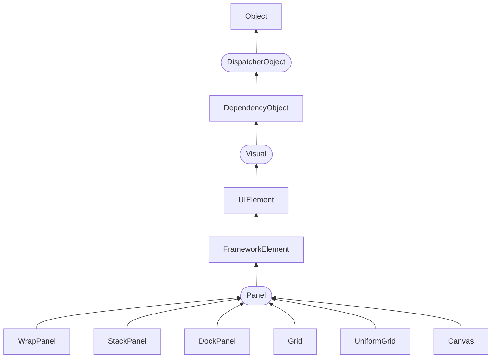
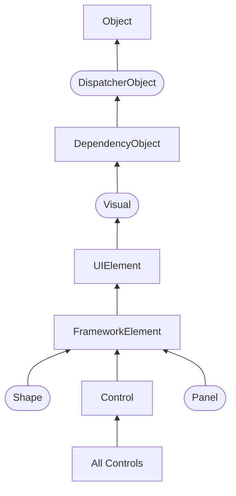

# WPF

- [Введение в WPF](#введение-в-wpf)
  - [Особенности платформы WPF](#особенности-платформы-wpf)
    - [Преимущества WPF](#преимущества-wpf)
    - [Структура проекта WPF](#структура-проекта-wpf)
- [XAML](#xaml)
  - [Введение в язык XAML](#введение-в-язык-xaml)
    - [Структура XAML](#структура-xaml)
    - [Пространства имен XAML](#пространства-имен-xaml)
    - [Элементы и их атрибуты](#элементы-и-их-атрибуты)
    - [Специальные символы](#специальные-символы)
  - [Файлы отделенного кода](#файлы-отделенного-кода)
    - [Взаимодействие кода C# и XAML](#взаимодействие-кода-c-и-xaml)
    - [Создание элементов в коде C#](#создание-элементов-в-коде-c)
  - [Сложные свойства и конвертеры](#сложные-свойства-и-конвертеры)
    - [Сложные свойства в WPF](#сложные-свойства-в-wpf)
    - [Конвертеры типов в WPF](#конвертеры-типов-в-wpf)
    - [Конвертеры значений](#конвертеры-значений)
  - [Пространства имен из C# в XAML](#пространства-имен-из-c-в-xaml)
    - [Преимущества](#преимущества)
    - [Проблемы и решения](#проблемы-и-решения)
- [Компоновка](#компоновка)
  - [Введение в компоновку](#введение-в-компоновку)
  - [Иерархия классов](#иерархия-классов)
  - [Принципы компоновки](#принципы-компоновки)
  - [Процесс компоновки](#процесс-компоновки)
  - [Диспетчеры компоновки](#диспетчеры-компоновки)
    - [`System.Windows.Controls`](#systemwindowscontrols)
    - [`System.Windows.Controls.Primitives`](#systemwindowscontrolsprimitives)
  - [StackPanel](#stackpanel)
  - [WrapPanel](#wrappanel)
  - [DockPanel](#dockpanel)
  - [Присоединяемые свойства XAML (attached properties)](#присоединяемые-свойства-xaml-attached-properties)
    - [Определение присоединенного свойства](#определение-присоединенного-свойства)
    - [Использование в XAML](#использование-в-xaml)
    - [Пример](#пример)
  - [VirtualizingPanel](#virtualizingpanel)
    - [VirtualizingStackPanel](#virtualizingstackpanel)
    - [DataGridCellsPanel](#datagridcellspanel)
  - [Grid](#grid)
    - [Установка размеров](#установка-размеров)
      - [Автоматические размеры](#автоматические-размеры)
      - [Абсолютные размеры](#абсолютные-размеры)
      - [Пропорциональные размеры](#пропорциональные-размеры)
    - [Программное добавление элементов и IAddChild](#программное-добавление-элементов-и-iaddchild)
    - [GridSplitter](#gridsplitter)
  - [Canvas](#canvas)
  - [UniformGrid](#uniformgrid)
  - [TabPanel](#tabpanel)
  - [ToolBarOverflowPanel](#toolbaroverflowpanel)
  - [ToolBarPanel](#toolbarpanel)
  - [Основные свойства компоновки элементов](#основные-свойства-компоновки-элементов)
    - [Ширина и высота](#ширина-и-высота)
    - [Выравнивание](#выравнивание)
      - [`HorizontalAlignment`](#horizontalalignment)
      - [`VerticalAlignment`](#verticalalignment)
    - [Отступы / `Margin`](#отступы--margin)
    - [`Panel.ZIndex`](#panelzindex)
- [Элементы управления](#элементы-управления)
  - [Обзор элементов управления и их свойств](#обзор-элементов-управления-и-их-свойств)
  - [Иерархия классов элементов управления](#иерархия-классов-элементов-управления)
  - [Основные свойства элементов управления](#основные-свойства-элементов-управления)
    - [`Name`](#name)
    - [`FieldModifier`](#fieldmodifier)
    - [`Visibility`](#visibility)
    - [Свойства настройки шрифтов](#свойства-настройки-шрифтов)
    - [`Cursor`](#cursor)
    - [`FlowDirection`](#flowdirection)
    - [Цвета фона и шрифта](#цвета-фона-и-шрифта)
  - [Позиционирование контента](#позиционирование-контента)
    - [Content Alignment](#content-alignment)
    - [Padding](#padding)
  - [Обработчики событий](#обработчики-событий)
  - [Элементы управления содержимым](#элементы-управления-содержимым)
- [Навигация](#навигация)
  - [Основные подходы к навигации](#основные-подходы-к-навигации)
  - [Страничная навигация](#страничная-навигация)

## Введение в WPF

### Особенности платформы WPF
Технология WPF (Windows Presentation Foundation) является часть экосистемы платформы .NET и представляет собой подсистему для построения графических интерфейсов.

Если при создании традиционных приложений на основе WinForms за отрисовку элементов управления и графики отвечали такие части ОС Windows, как User32 и GDI+, то приложения WPF основаны на DirectX. В этом состоит ключевая особенность рендеринга графики в WPF: используя WPF, значительная часть работы по отрисовке графики, как простейших кнопочек, так и сложных 3D-моделей, ложится на графический процессор на видеокарте, что также позволяет воспользоваться аппаратным ускорением графики.

Одной из важных особенностей является использование языка декларативной разметки интерфейса XAML, основанного на XML: вы можете создавать насыщенный графический интерфейс, используя или декларативное объявление интерфейса, или код на управляемых языках C#, VB.NET и F#, либо совмещать и то, и другое.

Первая версия — WPF 3.0 вышла вместе с .NET Framework 3.0 и операционной системой Windows Vista в 2006 году. И с тех пор платформа WPF является частью экосистемы .NET и развивается вместе с фреймворком .NET. Например, на сегодняшний день последней версией фреймворка .NET является .NET 8, и WPF полностью поддерживается этой версией фреймворка.

#### Преимущества WPF
Что вам, как разработчику, предлагает WPF?

- Использование традиционных языков .NET-платформы — C#, F# и VB.NET для создания логики приложения.

- Возможность **декларативного определения** графического интерфейса с помощью специального языка разметки XAML, основанном на xml и представляющем альтернативу программному созданию графики и элементов управления, а также возможность комбинировать XAML и C#/VB.NET

- **Независимость от разрешения экрана**: поскольку в WPF все элементы измеряются в независимых от устройства единицах, приложения на WPF легко масштабируются под разные экраны с разным разрешением.

- Новые возможности, которых сложно было достичь в WinForms, например, создание трехмерных моделей, привязка данных, использование таких элементов, как стили, шаблоны, темы и др.

- Хорошее **взаимодействие с WinForms**, благодаря чему, например, в приложениях WPF можно использовать традиционные элементы управления из WinForms.

- **Богатые возможности** по созданию различных приложений: это и мультимедиа, и двухмерная и трехмерная графика, и богатый набор встроенных элементов управления, а также возможность самим создавать новые элементы, создание анимаций, привязка данных, стили, шаблоны, темы и многое другое

- **Аппаратное ускорение графики** — вне зависимости от того, работаете ли вы с 2D или 3D, графикой или текстом, все компоненты приложения транслируются в объекты, понятные Direct3D, и затем визуализируются с помощью процессора на видеокарте, что повышает производительность, делает графику более плавной.

- Создание приложений под множество ОС семейства Windows

В тоже время WPF имеет определенные ограничения. Несмотря на поддержку трехмерной визуализации, для создания приложений с большим количеством трехмерных изображений, прежде всего игр, лучше использовать другие средства — DirectX или специальные фреймворки, такие как Monogame или Unity.

Также стоит учитывать, что по сравнению с приложениями на Windows Forms объем программ на WPF и потребление ими памяти в процессе работы в среднем несколько выше. Но это с лихвой компенсируется более широкими графическими возможностями и повышенной производительностью при отрисовке графики.

Кроме того, несмотря на то, что WPF работает поверх кроссплатформенной среды .NET, но в силу природы WPF и зависимости от компонентов Windows, на данный момент создавать приложения на WPF можно только под ОС Windows.

#### Структура проекта WPF
Рассмотрим базовую структуру простейшего стандартного проекта WPF:

*[XML]: Extensible Markup Language (XML)
- *App.config*: файл конфигурации приложения в формате XML, позволяет настроить способ обнаружения и загрузки файлов сборок в среде CLR.

- ***App.xaml*** задает ресурсы приложения и ряд конфигурационных настроек в виде кода XAML. В частности, в файле ***App.xaml*** задается файл окна программы, которое будет открываться при запуске приложения. Если вы откроете этот файл, то можете найти в нем строку **`StartupUri="MainWindow.xaml`** — то есть в данном случае, когда мы запустим приложение, будет создаваться интерфейс из файла ***MainWindow.xaml***.

- ***App.xaml.cs*** — это файл кода на C#, связанный с файлом ***App.xaml***, который также позволяет задать ряд общих ресурсов и общую логику для приложения, но в вид кода C#.

- ***MainWindow.xaml*** представляет визуальный интерфейс окна приложения в виде кода XAML.

- ***MainWindow.xaml.cs*** — это файл логики кода на C#, связанный с окном ***MainWindow.xaml***.

Каталог *Properties*:

- ***AssemblyInfo.cs*** содержит информацию о создаваемой в процессе компиляции сборке.
- *Resources.resx* служит для управления локализованными ресурсами, такими как строки, изображения и другие объекты, которые могут изменяться в зависимости от языка и культуры пользователя. Он является ключевым элементом для создания многоязычных приложений на WPF, обеспечивая гибкость и удобство при работе с локализованными данными.
- *Resources.Designer.cs* автоматически генерируется на основе файла ресурсов *Resources.resx* и служит для упрощения доступа к ресурсам, таким как строки, изображения и другие данные, определенные в .resx файле.
- *Settings.settings* спользуется для хранения настроек приложения, которые могут быть изменены пользователем или программой. Эти настройки позволяют сохранять различные параметры, такие как размеры окна, цвет фона и другие предпочтения, которые должны сохраняться между запусками приложения.
- *Settings.Designer.cs* автоматически генерируется на основе файла настроек *Settings.settings* и служит для упрощения доступа к определенным настройкам приложения. Он содержит сгенерированный код, который позволяет разработчикам легко взаимодействовать с настройками, используя статические свойства.

Объект *References*: используется для управления зависимостями проекта от внешних библиотек и компонентов. Он позволяет разработчику подключать необходимые сборки, которые содержат классы и методы, используемые в приложении.
- **Подключение внешних библиотек**: Объект *References* позволяет добавлять ссылки на внешние библиотеки (например, DLL-файлы), которые могут содержать функциональность, необходимую для работы приложения. Это может включать как сторонние библиотеки, так и другие проекты в решении.

- **Управление зависимостями**: Ссылки создают зависимости между проектами, что позволяет Visual Studio автоматически отслеживать изменения в подключенных библиотеках. Если библиотека изменяется, проект, который на нее ссылается, будет пересобран при следующем запуске сборки.

- **Упрощение разработки**: Благодаря объекту *References* разработчики могут легко использовать классы и методы из подключенных библиотек без необходимости копировать код или вручную управлять путями к файлам.

- **Поддержка различных типов ссылок**: В зависимости от требований проекта можно добавлять ссылки на проекты в решении, на файлы DLL или на общие проекты, что обеспечивает гибкость в организации кода.

Таким образом, объект *References* является ключевым элементом для управления зависимостями и интеграции внешней функциональности в WPF-приложениях, что значительно упрощает процесс разработки.

*References* является частью структуры проекта, управляемой Visual Studio, и не представляет собой отдельный физический файл или папку в файловой системе.

Причины отсутствия объекта *References* в файловом менеджере:
- **Логическая структура проекта**: Объект *References* отображается в Обозревателе решений как логическая группа зависимостей, а не как физическая папка или файл. Это означает, что он не будет виден в файловом менеджере, так как не существует отдельного файла для него.

- **Управление через Visual Studio**: Все ссылки и зависимости управляются через интерфейс Visual Studio. Они хранятся в файле проекта (*.csproj* или *.vbproj*), и при необходимости могут быть добавлены или удалены через диспетчер ссылок.

- **Скрытые файлы**: В некоторых случаях файлы проекта могут быть скрытыми или не отображаться в стандартном файловом менеджере. Например, файлы с расширением *.user* могут быть скрыты по умолчанию.

- ***Task_01.csproj***: стандартный файл проекта C#, который соответствует названию проекта (по умолчанию названию каталога) и описывает все его настройки. Является конфигурационным файлом, который описывает все аспекты проекта, необходимые для его сборки и управления. Он содержит информацию о настройках проекта, зависимостях, ресурсах и других параметрах, которые используются системой сборки MSBuild.

Основные назначения файла *.csproj*:
- **Определение структуры проекта**: Файл *.csproj* описывает, какие файлы и папки входят в проект, включая исходные файлы, ресурсы и зависимости. Это позволяет MSBuild знать, что необходимо собрать и как организовать выходные данные.

- **Настройка параметров сборки**: Внутри файла определяются различные параметры, такие как целевая платформа (.NET Framework или .NET Core), тип выходного файла (например, WinExe для приложений с графическим интерфейсом) и другие настройки, влияющие на процесс сборки.

- **Управление зависимостями**: Файл *.csproj* позволяет добавлять ссылки на внешние библиотеки и пакеты NuGet. Это упрощает управление зависимостями и обновлениями, так как все необходимые компоненты могут быть указаны в одном месте.

- **Поддержка локализации и ресурсов**: В файле можно определить ресурсы приложения (например, файлы XAML), которые будут использоваться в интерфейсе. Это позволяет организовать локализацию и управление ресурсами более эффективно.

- **Интеграция с Visual Studio**: Файл *.csproj* используется Visual Studio для управления проектом. Все изменения, внесенные через интерфейс (например, добавление файлов или зависимостей), автоматически отражаются в этом файле.

Таким образом, файл *.csproj* является ключевым элементом для управления проектом WPF, обеспечивая структурированное описание всех его компонентов и настроек.

- ***Task_01.csproj.user***: является дополнительным конфигурационным файлом, который хранит настройки, специфичные для текущего пользователя (такие, как настройки рабочего пространства/workspace, например, `showAllFiles`). Этот файл создается автоматически Visual Studio и используется для сохранения индивидуальных параметров, которые не должны влиять на другие копии проекта или его пользователей.

Основные назначения файла *.csproj.user*:
- **Хранение пользовательских настроек**: Файл *.csproj.user* содержит настройки, такие как параметры отладки, конфигурации среды выполнения и другие предпочтения, которые могут отличаться у разных пользователей. Это позволяет каждому разработчику настраивать свою среду работы без изменения общего проекта.

- **Изоляция изменений**: Поскольку файл *.csproj.user* не включается в систему контроля версий (например, Git), изменения, внесенные в него, не будут затрагивать других участников команды. Это особенно полезно для настройки локальной отладки или других параметров, специфичных для конкретной машины.

- **Упрощение работы с проектом**: Пользователи могут настроить свои параметры разработки без необходимости редактировать основной файл проекта (*.csproj*), что делает процесс более удобным и безопасным.

- **Формат XML**: Файл *.csproj.user* является XML-документом и может быть открыт и отредактирован вручную при необходимости, хотя обычно это не требуется.

Таким образом, файл *.csproj.user* играет важную роль в управлении индивидуальными настройками разработчиков в проектах WPF, обеспечивая гибкость и возможность персонализации среды разработки.

Каталог *bin* в проекте WPF служит для хранения собранных выходных файлов приложения, таких как исполняемые файлы (.exe) и библиотеки (.dll). Он автоматически создается при сборке проекта и содержит все необходимые файлы для запуска приложения.

Основные назначения каталога *bin*:
- **Хранение выходных файлов**: В каталоге *bin* находятся собранные версии приложения, которые могут быть в режиме отладки (Debug) или релиза (Release). Например, в подкаталоге Debug *будет* находиться исполняемый файл вашего приложения, а также все зависимости, необходимые для его работы1.

- **Упрощение развертывания**: Все необходимые файлы для запуска приложения находятся в одном месте, что упрощает процесс развертывания. Разработчики могут легко копировать содержимое каталога *bin* для установки приложения на другую машину без необходимости собирать проект заново.

- **Отладка и тестирование**: При разработке и тестировании приложения файлы в каталоге *bin* обновляются каждый раз при сборке проекта, что позволяет разработчикам быстро проверять изменения и тестировать функциональность.

- **Поддержка различных конфигураций**: В зависимости от конфигурации сборки (Debug или Release), в каталоге *bin* могут создаваться разные подкаталоги, что позволяет управлять версиями приложения и их зависимостями.

Таким образом, каталог *bin* является важной частью структуры проекта WPF, обеспечивая хранение и организацию выходных файлов, необходимых для работы и развертывания приложения.

Каталог *obj* в проекте WPF используется для хранения временных файлов, которые создаются во время процесса сборки. Этот каталог содержит промежуточные данные, необходимые для компиляции проекта, и не предназначен для конечного использования.

Основные назначения каталога *obj*:
- **Хранение промежуточных файлов**: В каталоге *obj* находятся временные файлы, такие как скомпилированные версии XAML-файлов (например, файлы *.g.cs*), которые генерируются на основе XAML-кода. Эти файлы содержат автоматически сгенерированный код, необходимый для работы с интерфейсом приложения.

- **Оптимизация процесса сборки**: Наличие каталога *obj* позволяет ускорить процесс сборки, так как временные файлы могут быть повторно использованы при последующих сборках. Это снижает время компиляции, так как не требуется каждый раз пересобирать все файлы.

- **Поддержка различных конфигураций**: В каталоге *obj* могут создаваться подкаталоги для различных конфигураций сборки (например, Debug и Release), что позволяет управлять временными файлами в зависимости от выбранной конфигурации.

- **Изоляция от конечного кода**: Файлы в каталоге *obj* не включаются в окончательную сборку приложения и не должны быть переданы другим пользователям или системам контроля версий. Это помогает сохранить чистоту структуры проекта.

Таким образом, каталог *obj* является важным элементом процесса разработки в WPF, обеспечивая хранение временных файлов и оптимизацию сборки приложения.

## XAML

### Введение в язык XAML
*[XAML]: eXtensible Application Markup Language
<dfn title="XAML">XAML</dfn> (eXtensible Application Markup Language) — язык разметки, используемый для инициализации объектов в технологиях на платформе .NET. Применительно к WPF (а также к Silverlight[^Silverlight]) данный язык используется прежде всего для создания пользовательского интерфейса декларативным путем. Хотя функциональность XAML только графическими интерфейсами не ограничивается: данный язык также используется в технологиях WCF[^WCF] и WF, где он никак не связан с графическим интерфейсом. То есть его область шире. Применительно к WPF мы будем говорить о нем чаще всего именно как о языке разметки, который позволяет создавать декларативным путем интерфейс, наподобие HTML в веб-программировании. Однако опять же повторюсь, сводить XAML к одному интерфейсу было бы неправильно, и далее на примерах мы это увидим.

[^Silverlight]: Microsoft Silverlight is a discontinued application framework designed for writing and running rich internet applications, similar to Adobe's runtime, Adobe Flash

[^WCF]: The Windows Communication Foundation, previously known as Indigo, is a free and open-source runtime and a set of APIs in the .NET Framework for building connected, service-oriented applications.

XAML не является обязательной частью приложения, мы вообще можем обходиться без него, создавая все элементы в файле связанного с ним кода на языке C#. Однако использование XAML все-таки несет некоторые преимущества:

- Возможность отделить графический интерфейс от логики приложения, благодаря чему над разными частями приложения могут относительно автономно работать разные специалисты: над интерфейсом — дизайнеры, над кодом логики — программисты.

- Компактность, понятность, код на XAML относительно легко поддерживать.

*[BAML]: Binary Application Markup Language
При компиляции приложения в Visual Studio код в xaml-файлах также компилируется в бинарное представление кода *xaml*, которое называется BAML (Binary Application Markup Language). И затем код baml встраивается в финальную сборку приложения — *exe* или *dll*-файл.

#### Структура XAML
При создании нового проекта WPF он уже содержит файлы с кодом *xaml*. Так, создаваемый по умолчанию в проекте файл *MainWindow.xaml* будет иметь следующую разметку:
```xml
<Window x:Class="XamlApp.MainWindow"
        xmlns="http://schemas.microsoft.com/winfx/2006/xaml/presentation"
        xmlns:x="http://schemas.microsoft.com/winfx/2006/xaml"
        xmlns:d="http://schemas.microsoft.com/expression/blend/2008"
        xmlns:mc="http://schemas.openxmlformats.org/markup-compatibility/2006"
        xmlns:local="clr-namespace:XamlApp"
        mc:Ignorable="d"
        Title="MainWindow" Height="350" Width="525">
    <Grid>

    </Grid>
</Window>
```

Подобно структуре веб-страничке на *html*, здесь есть некоторая иерархия элементов. Элементов верхнего уровня является `Window`, который представляет собой окно приложения. При создании других окон в приложении нам придется всегда начинать объявление интерфейса с элемента `Window`, поскольку это элемент самого верхнего уровня.

Кроме `Window` существует еще два элемента верхнего уровня:

- `Page`

- `Application`

Элемент `Window` имеет вложенный пустой элемент `Grid`, а также подобно html-элементам ряд атрибутов (`Title`, `Width`, `Height`) — они задают заголовок, ширину и высоту окна соответственно.

#### Пространства имен XAML
При создании кода на языке C#, чтобы нам были доступны определенные классы, мы подключаем пространства имен с помощью директивы `using`, например, `using System.Windows;`.

Чтобы задействовать элементы в XAML, мы также подключаем пространства имен. Вторая и третья строчки как раз и представляют собой пространства имен, подключаемые в проект по умолчанию. А атрибут **`xmlns`** представляет специальный атрибут для определения пространства имен в XML.

Так, пространство имен **`http://schemas.microsoft.com/winfx/2006/xaml/presentation`** содержит описание и определение большинства элементов управления. Так как является пространством имен по умолчанию, то объявляется без всяких префиксов.

**`http://schemas.microsoft.com/winfx/2006/xaml`** — это пространство имен, которое определяет некоторые свойства XAML, например свойство `Name` или `Key`. Используемый префикс `x` в определении `xmlns:x` означает, что те свойства элементов, которые заключены в этом пространстве имен, будут использоваться с префиксом **`x`** — `x:Name` или `x:Key`. Это же пространство имен используется уже в первой строчке **`x:Class="XamlApp.MainWindow"`** — здесь создается новый класс `MainWindow` и соответствующий ему файл кода, куда будет прописываться логика для данного окна приложения.

Это два основных пространства имен. Рассмотрим остальные:

- **`xmlns:d="http://schemas.microsoft.com/expression/blend/2008"`**: предоставляет поддержку атрибутов в режиме дизайнера. Это пространство имен преимущественно предназначено для другого инструмента по созданию дизайна на XAML — Microsoft Expression Blend

- **`xmlns:mc="http://schemas.openxmlformats.org/markup-compatibility/2006"`**: обеспечивает режим совместимости разметок XAML. В определении объекта Window двумя строчками ниже можно найти его применение:

  ```
  mc:Ignorable="d"
  ```

  Это выражение позволяет игнорировать парсерам XAML во время выполнения приложения дизайнерские атрибуты из пространства имен с префиксом **`d`**, то есть из `"http://schemas.microsoft.com/expression/blend/2008"`

- **`xmlns:local="clr-namespace:XamlApp"`**: пространство имен текущего проекта. Так как в моем случае проект называется *XamlApp*, то простраство имен называется аналогично. И через префикс `local` я смогу получить в XAML различные объекты, которые я определил в проекте.

Важно понимать, что эти пространства имен не эквивалентны тем пространствам имен, которые подключаются при помощи директивы `using` в c#. Так, например, **`http://schemas.microsoft.com/winfx/2006/xaml/presentation`** подключает в проект следующие пространства имен:

- `System.Windows`

- `System.Windows.Automation`

- `System.Windows.Controls`

- `System.Windows.Controls.Primitives`

- `System.Windows.Data`

- `System.Windows.Documents`

- `System.Windows.Forms.Integration`

- `System.Windows.Ink`

- `System.Windows.Input`

- `System.Windows.Media`

- `System.Windows.Media.Animation`

- `System.Windows.Media.Effects`

- `System.Windows.Media.Imaging`

- `System.Windows.Media.Media3D`

- `System.Windows.Media.TextFormatting`

- `System.Windows.Navigation`

- `System.Windows.Shapes`

- `System.Windows.Shell`

#### Элементы и их атрибуты
XAML предлагает очень простую и ясную схему определения различных элементов и их свойств. Каждый элемент, как и любой элемент XML, должен иметь открытый и закрытый тег, как в случае с элементом Window:
```xml
<Window></Window>
```

Либо элемент может иметь сокращенную форму с закрывающим слешем в конце, наподобие:
```xml
<Window />
```

Но в отличие от элементов *xml* каждый элемент в XAML соответствует определенному классу C#. Например, элемент `Button` соответствует классу `System.Windows.Controls.Button`. А свойства этого класса соответствуют атрибутам элемента `Button`.

Например, добавим кнопку в создаваемую по умолчанию разметку окна:
```xml
<Window x:Class="XamlApp.MainWindow"
        xmlns="http://schemas.microsoft.com/winfx/2006/xaml/presentation"
        xmlns:x="http://schemas.microsoft.com/winfx/2006/xaml"
        xmlns:d="http://schemas.microsoft.com/expression/blend/2008"
        xmlns:mc="http://schemas.openxmlformats.org/markup-compatibility/2006"
        xmlns:local="clr-namespace:XamlApp"
        mc:Ignorable="d"
        Title="MainWindow" Height="350" Width="525">
    <Grid x:Name="grid1">
        <Button x:Name="button1"  Width="100" Height="30" Content="Кнопка" />
    </Grid>
</Window>
```

Сначала идет элемент самого высшего уровня — `Window`, затем идет вложенный элемент `Grid` — контейнер для других элементов, и в нем уже определен элемент `Button`, представляющий кнопку.

Для кнопки мы можем определить свойства в виде атрибутов. Здесь определены атрибуты `x:Name` (имя кнопки), `Width`, `Height` и `Content`. Причем, атрибут `x:Name` берется в данном случае из пространства имен `"http://schemas.microsoft.com/winfx/2006/xaml"`, которое сопоставляется с префиксом **`x`**. А остальные атрибуты не используют префиксы, поэтому берутся из основного пространства имен `"http://schemas.microsoft.com/winfx/2006/xaml/presentation"`.

Подобным образом мы можем определить и другие атрибуты, которые нам нужны. Либо мы в общем можем не определять атрибуты, и тогда они будут использовать значения по умолчанию.

Определив разметку *xaml*, мы можем запустить проект, и нам отобразится графически весь код *xaml* — то есть наша кнопка

#### Специальные символы
При определении интерфейса в XAML мы можем столкнуться с некоторыми ограничениями. В частности, мы не можем использовать специальные символы, такие как знак амперсанда `&,` кавычки `"` и угловые скобки `<` и `>`. Например, мы хотим, чтобы текст кнопки был следующим: `<"Hello">`. У кнопки есть свойство `Content`, которое задает содержимое кнопки. И можно предположить, что нам надо написать так:
```xml
<Button Content="<"Hello">" />
```

Но такой вариант ошибочен и даже не скомпилируется. В этом случае нам надо использовать специальные коды символов (в соответствии с [XML Reserved Markup Characters](https://www.w3resource.com/xml/reserved-markup-characters.php)):

Символ | Код
-- | --
`<` | `&lt;`
`>` | `&gt;`
`&` | `&amp;`
`"` | `&quot;`
`'` | `&apos;`

Например:
```xml
<Button Content="&lt;&quot;Hello&quot;&gt;" />
```

Еще одна проблема, с которой мы можем столкнуться в XAML — добавление пробелов. Возьмем, к примеру, следующее определение кнопки:
```xml
<Button>
    Hello         World
</Button>
```

Здесь свойство `Content` задается неявно в виде содержимого между тегами `<Button>....</Button>`. Но несмотря на то, что у нас несколько пробелов между словами "Hello" и "World", XAML по умолчанию будет убирать все эти пробелы. И чтобы сохранить пробелы, нам надо использовать атрибут `xml:space="preserve"`:
```xml
<Button xml:space="preserve">
    Hello         World
</Button>
```

### Файлы отделенного кода
При создании нового проекта WPF в дополнение к создаваемому файлу *MainWindow.xaml* создается также файл отделенного кода *MainWindow.xaml.cs*, где, как предполагается, должна находится логика приложения связанная с разметкой из MainWindow.xaml. Файлы XAML позволяют нам определить интерфейс окна, но для создания логики приложения, например, для определения обработчиков событий элементов управления, нам все равно придется воспользоваться кодом C#.

По умолчанию в разметке окна используется атрибут **`x:Class`**:
```xml
<Window x:Class="XamlApp.MainWindow"
.......
```

Атрибут **`x:Class`** указывает на класс, который будет представлять данное окно и в который будет компилироваться код в XAML при компиляции. То есть во время компиляции будет генерироваться класс **`XamlApp.MainWindow`**, унаследованный от класса `System.Windows.Window`.

Кроме того в файле отделенного кода *MainWindow.xaml.cs*, который Visual Studio создает автоматически, мы также можем найти класс с тем же именем — в данном случае класс `XamlApp.MainWindow`. По умолчанию он имеет некоторый код:
```c#
using System;
using System.Collections.Generic;
using System.Linq;
using System.Text;
using System.Threading.Tasks;
using System.Windows;
using System.Windows.Controls;
using System.Windows.Data;
using System.Windows.Documents;
using System.Windows.Input;
using System.Windows.Media;
using System.Windows.Media.Imaging;
using System.Windows.Navigation;
using System.Windows.Shapes;

namespace XamlApp
{
    public partial class MainWindow : Window
    {
        public MainWindow()
        {
            InitializeComponent();
        }
    }
}
```

По сути пустой класс, но этот класс уже выполняет некоторую работу. Во время компиляции этот класс объединяется с классом, сгенерированном из кода XAML. Чтобы такое слияние классов во время компиляции произошло, класс `XamlApp.MainWindow` определяется как частичный с модификатором **`partial`**. А через метод `InitializeComponent()` класс `MainWindow` вызывает скомпилированный ранее код XAML, разбирает его и по нему строит графический интерфейс окна.

#### Взаимодействие кода C# и XAML
В приложении часто требуется обратиться к какому-нибудь элементу управления. Для этого надо установить у элемента в XAML свойство Name.

Еще одной точкой взаимодействия между xaml и C# являются события. С помощью атрибутов в XAML мы можем задать события, которые будут связанны с обработчиками в коде C#.

Итак, создадим новый проект WPF, который назовем XamlApp. В разметке главного окна определим два элемента: кнопку и текстовое поле.
```xml
<Window x:Class="XamlApp.MainWindow"
        xmlns="http://schemas.microsoft.com/winfx/2006/xaml/presentation"
        xmlns:x="http://schemas.microsoft.com/winfx/2006/xaml"
        xmlns:d="http://schemas.microsoft.com/expression/blend/2008"
        xmlns:mc="http://schemas.openxmlformats.org/markup-compatibility/2006"
        xmlns:local="clr-namespace:XamlApp"
        mc:Ignorable="d"
        Title="MainWindow" Height="350" Width="525">
    <Grid x:Name="grid1">
        <TextBox x:Name="textBox1" Width="150" Height="30" VerticalAlignment="Top" Margin="20" />
        <Button x:Name="button1"  Width="100" Height="30" Content="Кнопка" Click="Button_Click" />
    </Grid>
</Window>
```

И изменим файл отделенного кода, добавив в него обработчик нажатия кнопки:
```c#
using System.Windows;

namespace XamlApp
{
    public partial class MainWindow : Window
    {
        public MainWindow()
        {
            InitializeComponent();
        }

        private void Button_Click(object sender, RoutedEventArgs e)
        {
            string text = textBox1.Text;
            if (text != "")
            {
                MessageBox.Show(text);
            }
        }
    }
}
```

Определив имена элементов в XAML, затем мы можем к ним обращаться в коде c#: `string text = textBox1.Text`.

При определении имен в XAML надо учитывать, что оба пространства имен "http://schemas.microsoft.com/winfx/2006/xaml/presentation" и "http://schemas.microsoft.com/winfx/2006/xaml" определяют атрибут **`Name`**, который устанавливает имя элемента. Во втором случае атрибут используется с префиксом **`x`**: `x:Name`. Какое именно пространство имен использовать в данном случае, не столь важно, а следующие определения имени `x:Name="button1"` и `Name="button1"` фактически будут равноценны.

В обработчике нажатия кнопки просто выводится сообщение , введенное в текстовое поле. После определения обработчика мы его можем связать с событием нажатия кнопки в *xaml* через атрибут `Click`: `Click="Button_Click"`. В результате после нажатия на кнопку мы увидим в окне введенное в текстовое поле сообщение.

#### Создание элементов в коде C#
Еще одну форму взаимодействия C# и XAML представляет создание визуальных элементов в коде C#. Например, изменим код *xaml* следующим образом:
```xml
<Window x:Class="XamlApp.MainWindow"
        xmlns="http://schemas.microsoft.com/winfx/2006/xaml/presentation"
        xmlns:x="http://schemas.microsoft.com/winfx/2006/xaml"
        xmlns:d="http://schemas.microsoft.com/expression/blend/2008"
        xmlns:mc="http://schemas.openxmlformats.org/markup-compatibility/2006"
        xmlns:local="clr-namespace:XamlApp"
        mc:Ignorable="d"
        Title="MainWindow" Height="350" Width="525">
    <Grid x:Name="layoutGrid">

    </Grid>
</Window>
```

Здесь для элемента `Grid` установлено свойство `x:Name`, через которое мы можем к нему обращаться в коде. И также изменим код C#:
```c#
using System.Windows;
using System.Windows.Controls;

namespace XamlApp
{
    public partial class MainWindow : Window
    {
        public MainWindow()
        {
            InitializeComponent();

            Button myButton = new Button();
            myButton.Width = 100;
            myButton.Height = 30;
            myButton.Content = "Кнопка";
            layoutGrid.Children.Add(myButton);
        }
    }
}
```

В конструкторе страницы создается элемент `Button` и добавляется в `Grid`. И если мы запустим приложение, то увидим добавленную кнопку.

### Сложные свойства и конвертеры
В предыдущих темах было рассмотрено создание элементов в XAML. Например, мы могли бы определить кнопку следующим образом:
```html
<Button x:Name="myButton" Width="120" Height="40" Content="Кнопка" HorizontalAlignment="Center" Background="Red" />
```

С помощью атрибутов мы можем задать различные свойства кнопки. `Height` и `Width` являются простыми свойствами. Они хранят числовое значение. А например, свойства `HorizontalAlignment` или `Background` являются более сложными по своей структуре. Так, если мы будем определять эту же кнопку в коде c#, то нам надо использовать следующий набор инструкций:
```c#
Button myButton = new Button();
myButton.Content = "Кнопка";
myButton.Width = 120;
myButton.Height = 40;
myButton.HorizontalAlignment = HorizontalAlignment.Center;
myButton.Background = new System.Windows.Media.SolidColorBrush(System.Windows.Media.Colors.Red);
```

Чтобы выровнять кнопку по центру, применяется перечисление `HorizontalAlignment`, а для установки фонового цвета — класс `SolidColorBrush`. Хотя в коде XAML мы ничего такого не увидели и устанавливали эти свойства гораздо проще с помощью строк: `Background="Red"`. Дело в том, что по отношению к коду XAML применяются специальные объекты — **type converter** или конвертеры типов, которые могут преобразовать значения из XAML к тем типам тех объектов, которые используются в коде C#.

В WPF имеются встроенные конвертеры для большинства типов данных: `Brush`, `Color`, `FontWeight` и т.д. Все конвертеры типов являются производными от класса **`TypeConverter`**. Например, конкретно для преобразования значения `Background="Red"` в объект `SolidColorBrush` используется производный класс `BrushConverter`. При необходимости можно создать свои конвертеры для каких-то собственных типов данных.

Фактически установка значения в XAML `Background="Red"` сводилась бы к следующему вызову в коде c#:
```c#
myButton.Background = (Brush)System.ComponentModel.TypeDescriptor
        .GetConverter(typeof(Brush)).ConvertFromInvariantString("Red");
```

В данном случае программа пытается получить конвертер для типа `Brush` (базового класса для `SolidColorBrush`) и затем преобразовать строку `"Red"` в конкретный цвет. Для получения нужного конвертера, программа обращается к метаданным класса `Brush`. В частности, он имеет следующий атрибут:
```c#
[TypeConverter(typeof(BrushConverter))]
public abstract class Brush
```

Данный атрибут и позволяет системе определить, какой тип конвертера использовать.

В то же время мы можем более явно использовать эти объекты в коде XAML:
```xml
<Button x:Name="myButton" Width="120" Height="40" Content="Кнопка">
    <Button.HorizontalAlignment>
        <HorizontalAlignment>Center</HorizontalAlignment>
    </Button.HorizontalAlignment>

    <Button.Background>
        <SolidColorBrush Opacity="0.5" Color="Red" />
    </Button.Background>
</Button>
```

Преимуществом такого подхода является то, что у объектов мы можем установить дополнительные параметры.

#### Сложные свойства в WPF
<dfn title="сложное свойство">Сложные свойства</dfn> (Complex Properties) в WPF — это свойства, которые не могут быть представлены простым типом данных, таким как строка или целое число. Они часто используются для установки значений, которые требуют более сложной структуры, например, цвета, точки или геометрические фигуры. В XAML сложные свойства обычно устанавливаются с помощью элементов свойств, которые позволяют определить несколько атрибутов внутри одного свойства.

Пример установки сложного свойства — задание цвета фона кнопки с использованием элемента `Button.Background`:
```xml
<Button>
    <Button.Background>
        <SolidColorBrush Color="Blue" Opacity="0.5" />
    </Button.Background>
</Button>
```

В этом примере свойство `Background` кнопки является сложным, поскольку оно требует определения цвета и прозрачности заливки.

#### Конвертеры типов в WPF
<dfn title="конвертер типов">Конвертеры типов</dfn> (TypeConverters) — это специальные объекты в WPF, которые преобразуют значения строк из кода XAML в соответствующие типы свойств объектов, используемых в коде C#. Они необходимы для того, чтобы свойства могли быть установлены с помощью строковых значений в XAML, а затем преобразованы в необходимый тип данных.

Например, если вы хотите задать цвет заливки кнопки с помощью строки "Blue", конвертер типа поможет преобразовать эту строку в объект `Brush`, который может быть использован для заливки фона кнопки.

Пример использования конвертера типа
```xml
<Button Background="Blue" />
```

В этом случае конвертер типа автоматически преобразует строку "Blue" в объект `SolidColorBrush` с соответствующим цветом.

Чтобы создать собственный конвертер типа, необходимо реализовать интерфейс `TypeConverter`. Этот интерфейс требует реализации методов `ConvertFrom` и `ConvertTo`, которые отвечают за преобразование строковых значений в нужный тип и обратно:
```cs
public class CustomTypeConverter : TypeConverter
{
    public override bool CanConvertFrom(ITypeDescriptorContext context, Type sourceType)
    {
        if (sourceType == typeof(string))
            return true;
        return base.CanConvertFrom(context, sourceType);
    }

    public override object ConvertFrom(ITypeDescriptorContext context, CultureInfo culture, object value)
    {
        if (value is string strValue)
        {
            // Преобразуйте строку в нужный тип
            return CustomType.Parse(strValue);
        }
        return base.ConvertFrom(context, culture, value);
    }

    public override bool CanConvertTo(ITypeDescriptorContext context, Type destinationType)
    {
        if (destinationType == typeof(string))
            return true;
        return base.CanConvertTo(context, destinationType);
    }

    public override object ConvertTo(ITypeDescriptorContext context, CultureInfo culture, object value, Type destinationType)
    {
        if (destinationType == typeof(string))
        {
            // Преобразуйте объект в строку
            return value.ToString();
        }
        return base.ConvertTo(context, culture, value, destinationType);
    }
}
```

Эта реализация позволяет преобразовывать строковые значения в пользовательский тип и обратно, что делает возможным использование этого типа в XAML с помощью строковых значений.

#### Конвертеры значений
<dfn title="конвертер значений">Конвертеры значений</dfn> (ValueConverters) — это еще один тип конвертеров в WPF, которые используются для преобразования данных между источником и целевым объектом в привязках данных. Они позволяют преобразовывать данные в более удобочитаемый или подходящий для отображения формат, например, преобразование числовых кодов в строки или дат в определенный формат.

Пример использования конвертера значений:
```cs
public class DateToStringConverter : IValueConverter
{
    public object Convert(object value, Type targetType, object parameter, CultureInfo culture)
    {
        if (value is DateTime date)
        {
            return date.ToString("dd MMMM yyyy");
        }
        return value;
    }

    public object ConvertBack(object value, Type targetType, object parameter, CultureInfo culture)
    {
        if (value is string strValue)
        {
            return DateTime.Parse(strValue);
        }
        return value;
    }
}
```

### Пространства имен из C# в XAML
Отображение пространства имен из C# в XAML позволяет использовать классы и типы, определенные в коде C#, в разметке XAML. Это делается с помощью атрибута `xmlns`, который сопоставляет префикс с пространством имен .NET.

По умолчанию в WPF в XAML подключается предустановленный набор пространств имен *xml*. Но мы можем задействовать любые другие пространства имен и их функциональность в том числе и стандартные пространства имен платформы .NET, например, `System` или `System.Collections`. Например, по умолчанию в определении элемента Window подключается локальное пространство имен:
```xml
xmlns:local="clr-namespace:XamlApp"
```

Общий синтаксис подключения пространства имен в XAML следующий:
```xml
xmlns:Префикс="clr-namespace:Пространство_имен;assembly=имя_сборки"
```

- *Префикс*: Это префикс XML, который будет использоваться для указания пространства имен в разметке XAML.

- *Пространство имен*: Полностью квалифицированное название пространства имен .NET.

- *Имя сборки*: Сборка, в которой объявлен тип, без расширения .dll. Если используется сборка вашего проекта, этот параметр можно опустить.

`clr` здесь означает Common Language Runtime — общая среда выполнения языков программирования .NET. В контексте XAML `clr`-namespace указывает на то, что пространство имен относится к среде CLR, что позволяет использовать типы, определенные в коде C# или других языках .NET, в разметке XAML.

<details>
<summary><em>Что такое сборка</em></summary>

В контексте WPF и .NET сборка (assembly) — это базовая структурная единица, которая содержит код, данные и метаданные приложения. Это файлы с расширением *.exe* или *.dll*, которые создаются в результате компиляции проекта.

Основные компоненты сборки
- **Манифест**: Содержит метаданные о сборке, такие как ее имя, версия и культура.

- **Метаданные типов**: Определяют местоположение типов в сборке и их размещение в памяти.

- **Код приложения**: Это код на языке MSIL (Microsoft Intermediate Language), в который компилируется исходный код C# или других языков .NET.

- **Ресурсы**: Это файлы или данные, которые встраиваются в сборку, такие как изображения, файлы XAML или другие ресурсы.

В WPF сборки играют ключевую роль в организации и развертывании приложений. Они позволяют:

- Использовать сторонние библиотеки: WPF приложения могут ссылаться на сторонние сборки для использования дополнительных функций.

- Встраивать ресурсы: XAML-файлы и другие ресурсы встраиваются в сборку, что упрощает развертывание приложения.

- Управлять версиями: Сборки позволяют контролировать версии приложения и управлять зависимостями между сборками.

Когда вы создаете WPF приложение, Visual Studio компилирует его в сборку, которая может быть *.exe* или *.dll*. Эта сборка содержит все необходимые ресурсы и код для запуска приложения.

Таким образом, сборки являются фундаментальными для разработки приложений WPF, так как они позволяют организовать код, ресурсы и метаданные в едином файле, что упрощает развертывание и управление приложением.

</details>

Локальное пространство имен, как правило, называется по имени проекта (в моем случае проект называется `XamlApp`) и позволяет подключить все классы, которые определены в коде C# в нашем проекте. Например, добавим в проект следующий класс:
```c#
public class Phone
{
    public string Name { get; set; }
    public int Price { get; set; }

    public override string ToString()
    {
        return $"Смартфон {this.Name}; цена: {this.Price}";
    }
}
```

Используем этот класс в коде *xaml*:
```xml
<Window x:Class="XamlApp.MainWindow"
        xmlns="http://schemas.microsoft.com/winfx/2006/xaml/presentation"
        xmlns:x="http://schemas.microsoft.com/winfx/2006/xaml"
        xmlns:d="http://schemas.microsoft.com/expression/blend/2008"
        xmlns:mc="http://schemas.openxmlformats.org/markup-compatibility/2006"
        xmlns:local="clr-namespace:XamlApp"
        mc:Ignorable="d"
        Title="MainWindow" Height="350" Width="525">
    <Grid x:Name="layoutGrid">
        <Button x:Name="phoneButton" Width="250" Height="40" HorizontalAlignment="Center">
            <Button.Content>
                <local:Phone Name="Lumia 950" Price="700" />
            </Button.Content>
        </Button>
    </Grid>
</Window>
```

Так как пространство имен проекта проецируется на префикс **`local`**, то все классы проекта используются в форме `local:Название_Класса`. Так в данном случае объект `Phone` устанавливается в качестве содержимого кнопки через свойство `Content`. Для сложных объектов это свойство принимает их строковое представление, которое возвращается методом `ToString()`:

Мы можем подключить любые другие пространства имен, классы которых мы хотим использовать в приложении. Например:
```xml
<Window x:Class="XamlApp.MainWindow"
        xmlns="http://schemas.microsoft.com/winfx/2006/xaml/presentation"
        xmlns:x="http://schemas.microsoft.com/winfx/2006/xaml"
        xmlns:d="http://schemas.microsoft.com/expression/blend/2008"
        xmlns:mc="http://schemas.openxmlformats.org/markup-compatibility/2006"
        xmlns:local="clr-namespace:XamlApp"

        xmlns:col="clr-namespace:System.Collections;assembly=mscorlib"
        xmlns:sys="clr-namespace:System;assembly=mscorlib"

        mc:Ignorable="d"
        Title="MainWindow" Height="350" Width="525">
    <Window.Resources>
        <col:ArrayList x:Key="days">
            <sys:String>Понедельник</sys:String>
            <sys:String>Вторник</sys:String>
            <sys:String>Среда</sys:String>
            <sys:String>Четверг</sys:String>
            <sys:String>Пятница</sys:String>
            <sys:String>Суббота</sys:String>
            <sys:String>Воскресенье</sys:String>
        </col:ArrayList>
    </Window.Resources>
    <Grid>
        <ListBox x:Name="listDays" ItemsSource="{StaticResource days}" />
    </Grid>
</Window>
```

Здесь определены два дополнительных пространства имен:
```xml
xmlns:col="clr-namespace:System.Collections;assembly=mscorlib"
xmlns:sys="clr-namespace:System;assembly=mscorlib"
```

Благодаря этому нам становятся доступными объекты из пространств имен `System.Collections` и `System`. И затем используя префикс, мы можем использовать объекты, входящие в данные пространства имен: `<col:ArrayList...`.

Фрагмент `assembly=mscorlib` в XAML используется для указания сборки, в которой находится пространство имен CLR, которое вы хотите использовать. В данном случае `mscorlib` — это сборка, содержащая базовые типы .NET Framework, такие как System.String, System.Int32, System.Boolean и другие.

Когда вы используете `assembly=mscorlib`, вы указываете XAML-анализатору искать типы в пространстве имен `System` внутри сборки `mscorlib`. Это позволяет использовать базовые типы .NET в XAML.

Общий синтаксис подключения пространств имен следующий: `xmlns:Префикс="clr-namespace:Пространство_имен;assembly=имя_сборки"`. Так в предыдущем случае мы подключили пространство имен `System.Collections`, классы которого находятся в сборке `mscorlib`. И данное подключенное пространство имен у нас отображено на префикс `col`.

#### Преимущества
Отображение пространства имен из C# в XAML позволяет:

- Использовать пользовательские классы и типы в разметке XAML.

- Создавать более гибкие и настраиваемые пользовательские интерфейсы.

- Упрощать процесс разработки за счет разделения логики и представления.

#### Проблемы и решения
Если пространство имен не видит, проверьте:

- Правильность имени пространства имен и сборки.

- Наличие ссылки на сборку в проекте.

- Правильность префикса и его использование в XAML

- Пересоберите проект

Альтернативный способ — добавление элементов напрямую в XAML:
```xml
<Window x:Class="XamlApp.MainWindow"
        xmlns="http://schemas.microsoft.com/winfx/2006/xaml/presentation"
        xmlns:x="http://schemas.microsoft.com/winfx/2006/xaml"
        xmlns:d="http://schemas.microsoft.com/expression/blend/2008"
        xmlns:mc="http://schemas.openxmlformats.org/markup-compatibility/2006"
        xmlns:local="clr-namespace:XamlApp"
        mc:Ignorable="d"
        Title="MainWindow" Height="350" Width="525">
    <Grid>
        <ListBox>
            <ListBoxItem>Понедельник</ListBoxItem>
            <ListBoxItem>Вторник</ListBoxItem>
            <ListBoxItem>Среда</ListBoxItem>
            <ListBoxItem>Четверг</ListBoxItem>
            <ListBoxItem>Пятница</ListBoxItem>
            <ListBoxItem>Суббота</ListBoxItem>
            <ListBoxItem>Воскресенье</ListBoxItem>
        </ListBox>
    </Grid>
</Window>
```

## Компоновка

### Введение в компоновку
Чтобы перейти уже непосредственно к созданию красивых интерфейсов и их компонентов, сначала необходимо познакомиться с компоновкой. <dfn title="компоновка">Компоновка</dfn> (layout) представляет собой процесс размещения элементов внутри контейнера. Возможно, вы обращали внимание, что одни программы и веб-сайты на разных экранах с разным разрешением выглядят по-разному: где-то лучше, где-то хуже. В большинстве своем такие программы используют жестко закодированные в коде размеры элементов управления. WPF уходит от такого подхода в пользу так называемого "резинового дизайна", где весь процесс позиционирования элементов осуществляется с помощью компоновки.

Благодаря компоновке мы можем удобным нам образом настроить элементы интерфейса, позиционировать их определенным образом. Например, элементы компоновки в WPF позволяют при ресайзе — сжатии или растяжении — масштабировать элементы, что очень удобно, а визуально не создает всяких шероховатостей типа незаполненных пустот на форме.

В WPF компоновка осуществляется при помощи специальных контейнеров. Фреймворк предоставляет нам следующие контейнеры: **`Grid`**, **`UniformGrid`**, **`StackPanel`**, **`WrapPanel`**, **`DockPanel`** и **`Canvas`**.

Различные контейнеры могут содержать внутри себя другие контейнеры. Кроме данных контейнеров существует еще ряд элементов, такие как `TabPanel`, которые могут включать другие элементы и даже контейнеры компоновки, однако на саму компоновку не столь влияют в отличие от выше перечисленных. Кроме того, если нам не хватает стандартных контейнеров, мы можем определить свои с нужной нам функциональностью.

Контейнеры компоновки позволяют эффективно распределить доступное пространство между элементами, найти для него наиболее предпочтительные размеры.

### Иерархия классов
Все выше перечисленные контейнеры компоновки наследуются от абстрактного класса `Panel`, а само дерево наследования можно представить следующим образом:



где:


Ниже показан базовый обзор некоторых ключевых ветвей иерархии классов. Важно отметить, что основные пространства имен WPF начинаются в `System.Windows` (например, `System.Windows`, `System.Windows.Controls` и `System.Windows.Media`). Единственным исключением являются пространства имен, начинающиеся с `System.Windows.Forms`, которые относятся к инструментам Windows Forms.

- `System.Threading.DispatcherObject`

    Приложения WPF используют знакомую однопоточную модель (single-thread affinity — STA), а это означает, что весь пользовательский интерфейс принадлежит единственному потоку. Взаимодействовать с элементами пользовательского интерфейса из других потоков небезопасно. Чтобы содействовать работе этой модели, каждое WPF-приложение управляется диспетчером, координирующим сообщения (появляющиеся в результате клавиатурного ввода, перемещений курсора мыши и таких процессов платформы, как компоновка). Будучи унаследованным от `DispatcherObject`, каждый элемент пользовательского интерфейса может удостовериться, выполняется ли код в правильном потоке, и обратиться к диспетчеру, чтобы направить код в поток пользовательского интерфейса.

    Этот тип включает одно свойство, представляющее интерес — `Dispatcher`, которое возвращает ассоциированный объект `System.Windows.Threading.Dispatcher`. Класс `Dispatcher` — это точка входа в очередь событий приложения WPF, предоставляющая базовые конструкции для работы с параллелизмом и многопоточностью. По большому счету, это низкоуровневый класс, который в большинстве приложений WPF может быть проигнорирован.

- `System.Windows.DependencyObject`

    В WPF центральный путь взаимодействия с экранными элементами пролегает через свойства. На ранней стадии цикла проектирования архитекторы WPF решили создать более мощную модель свойств, которая положена в основу таких средств, как уведомления об изменениях, наследуемые значения по умолчанию и более экономичное хранилище свойств. Конечным результатом стало средство свойств зависимости (dependency property). За счет наследования от `DependencyObject`, классы WPF получают поддержку свойств зависимости.

    Базовый класс `DependencyObject` предоставляет два ключевых метода для всех производных типов: `GetValue()` и `SetValue()`. С помощью этих членов можно устанавливать само свойство. Другие части инфраструктуры позволяют "регистрировать" тех, кто может использовать свойства зависимости или присоединяемые свойства.

    Хотя свойства зависимости — это ключевой аспект разработки WPF, большую часть времени их детали скрыты от глаз.

- `System.Windows.Media.Visual`

    Каждый элемент, появляющийся в WPF, в основе своей является `Visual`. Класс `Visual` можно воспринимать как единственный объект рисования, инкапсулирующий в себе инструкции рисования, дополнительные подробности рисования (наподобие отсечения, прозрачности и настроек трансформации) и базовую функциональность (вроде проверки попадания). Класс `Visual` также обеспечивает связь между управляемыми библиотеками WPF и сборкой `milcore.dll`, которая визуализирует отображение. Любой класс, унаследованный от `Visual`, обладает способностью отображаться в окне. Если вы предпочитаете создавать свой пользовательский интерфейс с применением легковесного API-интерфейса, не обладающего высокоуровневыми средствами WPF, то можете программировать непосредственно с использованием объектов `Visual`.

    Применение типа `Visual` (и его потомков вроде `DrawingVisual`) обеспечивает наиболее легковесный способ визуализации графических данных, но также подразумевает участие большого объема управляемого кода для обеспечения работы всех необходимых служб.

- `System.Windows.UIElement`

    Класс `UIElement` добавляет поддержку таких сущностей WPF, как компоновка (layout), ввод (input), фокус (focus) и события (events) — все, что команда разработчиков WPF называет аббревиатурой LIFE. Например, именно здесь определен двухшаговый процесс измерения и организации компоновки. Здесь же щелчки кнопками мыши и нажатия клавиш трансформируются в более удобные события, такие как `MouseEnter`. Как и со свойствами, WPF реализует расширенную систему передачи событий, именуемую маршрутизируемыми событиями (routed events).

- `System.Windows.FrameworkElement`

    Класс `FrameworkElement` — конечный пункт в центральном дереве наследования WPF. Он реализует некоторые члены, которые просто определены в `UIElement`. Например, `UIElement` устанавливает фундамент для системы компоновки WPF, но `FrameworkElement` включает ключевые свойства (вроде `HorizontalAlignment` и `Margin`), которые поддерживают его. `UIElement` также добавляет поддержку привязки данных, анимации и стилей — все они являются центральными средствами.

- `System.Windows.Shapes.Shape`

    От этого класса наследуются базовые фигуры, такие как `Rectangle`, `Polygon`, `Ellipse`, `Line` и `Path`. Эти фигуры могут использоваться наряду с более традиционными графическими элементами Windows вроде кнопок и текстовых полей.

- `System.Windows.Controls.Control`

    Элемент управления (control) — это элемент, который может взаимодействовать с пользователем. К нему очевидным образом относятся такие классы, как `TextBox`, `Button` и `ListBox`. Класс `Control` добавляет дополнительные свойства для установки шрифта, а также цветов переднего плана и фона. Но наиболее интересная деталь, которую он предоставляет — это поддержка шаблонов, которая позволяет заменять стандартный внешний вид элемента управления собственным рисованием.

    `Control`, так же, определяет свойства для установки размеров элемента управления, прозрачности, порядка обхода по нажатию клавиши `<Tab>`, дисплейного курсора, цвета фона и т.д.

- `System.Windows.Controls.ContentControl`

    Это базовый класс для всех элементов управления, которые имеют отдельный фрагмент содержимого. Сюда относится все — от скромной метки `Label` до окна `Window`. Наиболее впечатляющая часть этой модели заключается в том, что единственный фрагмент содержимого может быть чем угодно — от обычной строки до панели компоновки, содержащей комбинацию других фигур и элементов управления.

    Например, когда речь идет о типичном элементе управления "кнопка", то обычно предполагается, что его содержимым будет базовый строковый литерал (ОК, Cancel, Abort и т.п.). В случае использования XAML для описания элемента управления WPF, и значение, которое необходимо присвоить свойству Content, может быть выражено в виде простой строки, можете установить свойство Content внутри открывающего определения элемента.

    Содержимое может быть любым. Например, предположим, что нужна "кнопка", которая содержит в себе нечто более интересное, чем простая строка, возможно, специальную графику или текст. На других платформах построения пользовательских интерфейсов, таких как Windows Forms, пришлось бы строить специальный элемент управления, что потребовало бы написания значительного объема кода и сопровождения нового класса. С моделью содержимого WPF это не требуется.

    Когда в свойстве `Content` должно быть установлено значение, которое не может быть выражено простым массивом символов, его нельзя присвоить с использованием атрибута в открывающем определении элемента управления. Вместо этого понадобится определить данные содержимого неявно, внутри контекста элемента.

- `System.Windows.Controls.ItemsControl`

    Это базовый класс для всех элементов управления, которые отображают коллекцию каких-то единиц информации, вроде `ListBox` и `TreeView`. Списочный элемент управления замечательно гибок; например, используя встроенные средства класса `ItemsControl`, можно трансформировать обычный `ListBox` в список переключателей, список флажков, упорядоченный набор картинок или комбинацию совершенно разных элементов по своему выбору. Фактически в WPF все меню, панели инструментов и линейки состояния на самом деле являются специализированными списками и классами.

- `System.Windows.Controls.Panel`

    Это базовый класс для всех контейнеров компоновки — элементов, которые содержат в себе один или более дочерних элементов и упорядочивают их в соответствии с определенными правилами компоновки. Эти контейнеры образуют фундамент системы компоновки WPF, и их использование — ключ к упорядочиванию содержимого наиболее привлекательным и гибким способом.

### Принципы компоновки

В WPF при компоновке и расположении элементов внутри окна нам надо придерживаться следующих принципов:

- Нежелательно указывать явные размеры элементов (за исключением минимальных и максимальных размеров). Размеры должны определяться контейнерами.

- Нежелательно указывать явные позицию и координаты элементов внутри окна. Позиционирование элементов всецело должно быть прерогативой контейнеров. И контейнер сам должен определять, как элемент будет располагаться. Если нам надо создать сложную систему компоновки, то мы можем вкладывать один контейнер в другой, чтобы добиться максимально удобного расположения элементов управления.

### Процесс компоновки
Процесс компоновки проходит два этапа: измерение (measure) и расстановка (arrange). На этапе измерения контейнер производит измерение предпочтительного для дочерних элементов места. Однако не всегда контейнер имеет достаточно места, чтобы расставить все элементы по их предпочтительным размером, поэтому их размеры приходится усекать. Затем происходит этап непосредственной расстановки дочерних элементов внутри контейнера.

Теперь рассмотрим контейнеры компоновки подробнее.

### Диспетчеры компоновки
Окно WPF-приложения обычно представлено корневым элементом `Window`. Дочерним элементом корневого элемента является диспетчер компоновки, который в свою очередь содержит любое количество элементов (в том числе, вложенных диспетчеров компоновки), определяющих пользовательский интерфейс. Диспетчер компоновки является объектом класса, унаследованного от абстрактного класса `System.Windows.Controls.Panel`.

Производные классы `Panel` из пространств имен `System.Windows.Controls` и `System.Windows.Controls.Primitives` различаются по назначению и функциональности. Основные различия:
- **Назначение**: `System.Windows.Controls` содержит классы для организации макета, в то время как `System.Windows.Controls.Primitives` содержит базовые компоненты для построения средств управления.

- **Функциональность**: Производные классы `Panel` в `System.Windows.Controls` обеспечивают различные макеты, тогда как классы в `System.Windows.Controls.Primitives` обеспечивают базовые компоненты для создания сложных средств управления.

#### `System.Windows.Controls`
Этот пространство имен содержит производные классы `Panel`, которые используются для создания пользовательского интерфейса приложений. 

Основные панели (диспетчеры компоновки, контейнерные элементы управления) WPF:

| Элемент | Описание
-- | --
**`Canvas`** | Позволяет размещать дочерние элементы с помощью координат. Элементы остаются в точности там, где были размещены во время проектирования
**`DockPanel`** | Прижимает дочерние элементы к краям панели. Привязывает содержимое к определенной стороне панели — `Тор` (верхняя), `Bottom` (нижняя), `Left` (левая) или `Right` (правая)
**`Grid`** | Располагает содержимое внутри серии ячеек, расположенных в табличной сетке (использует таблицу для расположения элементов)
**`StackPanel`** | Выводит содержимое по вертикали или горизонтали, в зависимости от значения свойства `Orientation`
**`WrapPanel`** | Располагает элементы в ряд, а затем переносит их на следующую строку, если не хватает места. Позиционирует содержимое слева направо, перенося на следующую строку по достижении границы панели. Последовательность размещения происходит сначала сверху вниз или сначала слева направо, в зависимости от значения свойства `Orientation`
**`VirtualizingStackPanel`** | Определяет базовую структуру для панелей виртуализации. Оптимизирует отображение большого количества элементов.

Эти классы предназначены для организации макета в приложениях WPF.

#### `System.Windows.Controls.Primitives`
Это пространство имен содержит базовые компоненты, используемые для создания средств управления. Оно включает компоненты, такие как `Thumb`, `RepeatButton`, и другие базовые элементы, которые могут быть частью более сложных средств управления, но не являются производными классами `Panel` напрямую.

Панели из базовых примитивов WPF:

| Элемент | Описание
-- | --
**`UniformGrid`** | Базовый компонент, который обеспечивает простой и универсальный способ упорядочивания содержимого в сетке, где все ячейки имеют одинаковый размер
**`TabPanel`** | Используется для организации макета вкладок в элементе управления `TabControl`. Он обеспечивает базовую функциональность для расположения заголовков вкладок и переключения между ними.
**`ToolBarPanel`** | Используется для организации элементов внутри элемента управления `ToolBar`. Он наследуется от `StackPanel` и обеспечивает базовую функциональность для расположения кнопок и других элементов управления в панели инструментов.
**`ToolBarOverflowPanel`** | Используется для обработки ситуации, когда элементы в панели инструментов (`ToolBar`) не помещаются в доступное пространство. В этом случае избыточные элементы автоматически перемещаются в выпадающее меню, которое отображается на панели инструментов в виде стрелки.

В отличие от `System.Windows.Controls`, классы в `System.Windows.Controls.Primitives` не предназначены для создания макетов, а скорее для построения базовых компонентов интерфейса.

### StackPanel

Определение:
```cs
public class StackPanel : System.Windows.Controls.Panel, System.Windows.Controls.Primitives.IScrollInfo
```

Описание: https://learn.microsoft.com/en-us/dotnet/api/system.windows.controls.stackpanel?view=windowsdesktop-9.0

Панель `StackPanel` располагает содержащиеся в нем элементы управления либо в вертикальном столбце (по умолчанию), либо в горизонтальной строке (если в атрибут `Orientation` записано значение “Vertical”). Если в панель `StackPanel` добавлено больше элементов управления, чем может быть отображено по ширине/высоте `StackPanel`, лишние элементы обрезаются и не отображаются.

При выводе элементов сверху вниз элементы по умолчанию растягиваются по горизонтали. Это поведение можно изменить с помощью свойств `HorizontalAlignment` и `VerticalAlignment`.

Рассмотрим панель `StackPanel` со следующим содержимым:
```xml
<StackPanel HorizontalAlignment="Center">
  <Label Content="Регистрация пользователя" />
  <Label Content="ФИО" />
  <TextBox Width="200" />
  <Label Content="Email" />
  <TextBox Width="200" />
  <Button Content="Зарегистрироваться" />
</StackPanel>
```

Это более простой элемент компоновки. Он располагает все элементы в ряд либо по горизонтали, либо по вертикали в зависимости от ориентации. Например,
```xml
<Window x:Class="LayoutApp.MainWindow"
        xmlns="http://schemas.microsoft.com/winfx/2006/xaml/presentation"
        xmlns:x="http://schemas.microsoft.com/winfx/2006/xaml"
        xmlns:d="http://schemas.microsoft.com/expression/blend/2008"
        xmlns:mc="http://schemas.openxmlformats.org/markup-compatibility/2006"
        xmlns:local="clr-namespace:LayoutApp"
        mc:Ignorable="d"
        Title="StackPanel" Height="300" Width="300">
    <Grid>
        <StackPanel>
            <Button Background="Blue" Content="1" />
            <Button Background="White" Content="2" />
            <Button Background="Red" Content="3" />
        </StackPanel>
    </Grid>
</Window>
```

В данном случае для свойства `Orientation` по умолчанию используется значение `Vertical`, то есть `StackPanel` создает вертикальный ряд, в который помещает все вложенные элементы сверху вниз. Мы также можем задать горизонтальный стек. Для этого нам надо указать свойство `Orientation="Horizontal"`:
```xml
<Window x:Class="LayoutApp.MainWindow"
        xmlns="http://schemas.microsoft.com/winfx/2006/xaml/presentation"
        xmlns:x="http://schemas.microsoft.com/winfx/2006/xaml"
        xmlns:d="http://schemas.microsoft.com/expression/blend/2008"
        xmlns:mc="http://schemas.openxmlformats.org/markup-compatibility/2006"
        xmlns:local="clr-namespace:LayoutApp"
        mc:Ignorable="d"
        Title="StackPanel" Height="300" Width="300">
    <StackPanel Orientation="Horizontal">
        <Button Background="Blue" MinWidth="30" Content="1" />
        <Button Background="White" MinWidth="30" Content="2" />
        <Button Background="Red" MinWidth="30" Content="3" />
    </StackPanel>
</Window>
```

При горизонтальной ориентации все вложенные элементы располагаются слева направо. Если мы хотим, чтобы наполнение стека начиналось справа налево, то нам надо задать свойство `FlowDirection`: `<StackPanel Orientation="Horizontal" FlowDirection="RightToLeft">`. По умолчанию это свойство имеет значение `LeftToRight` — то есть слева направо.

`StackPanel` реализует интерфейс `IScrollInfo` для поддержки логической прокрутки. Это означает, что вместо традиционной прокрутки на определенное количество пикселей, `StackPanel` прокручивается до следующего элемента в логическом дереве. Это поведение полезно, когда необходимо прокручивать содержимое в логических единицах, а не в физических пикселях.

Когда `StackPanel` используется внутри `ScrollViewer` с установленным свойством `CanContentScroll` равным `true`, он позволяет выполнять прокрутку до следующего элемента, а не на определенное количество пикселей. Это обеспечивает более удобный и интуитивный способ прокрутки содержимого, особенно когда элементы имеют разные размеры или когда необходимо прокручивать до конкретных элементов, а не на определенное расстояние.

Таким образом, реализация `IScrollInfo` в `StackPanel` позволяет разработчикам создавать пользовательские панели с особым поведением прокрутки, что может быть полезно в различных сценариях, таких как создание интерфейсов с особыми требованиями к прокрутке.

### WrapPanel

Определение:
```cs
public class WrapPanel : System.Windows.Controls.Panel
```

Описание: https://learn.microsoft.com/en-us/dotnet/api/system.windows.controls.wrappanel?view=windowsdesktop-9.0

Панель `WrapPanel` выводит дочерние элементы последовательно слева направо (либо сверху вниз, если для атрибута `Orientation` установлено значение “Vertical”) и при достижении границы окна переходит на новую строку (столбец). При изменении размеров окна панель перераспределяет компоненты таким образом, чтобы они находились в окне.

Рассмотрим панель `WrapPanel` со следующим содержимым:
```xml
<WrapPanel>
  <Label Content="Регистрация пользователя" />
  <Label Content="ФИО" />
  <TextBox Width="200" />
  <Label Content="Email" />
  <TextBox Width="200" />
  <Button Content="Зарегистрироваться" />
</WrapPanel>
```

Эта панель, подобно `StackPanel`, располагает все элементы в одной строке или колонке в зависимости от того, какое значение имеет свойство `Orientation` — `Horizontal` или `Vertical`. Главное отличие от `StackPanel` — если элементы не помещаются в строке или столбце, создаются новые столбец или строка для не поместившихся элементов.
```xml
<Window x:Class="LayoutApp.MainWindow"
        xmlns="http://schemas.microsoft.com/winfx/2006/xaml/presentation"
        xmlns:x="http://schemas.microsoft.com/winfx/2006/xaml"
        xmlns:d="http://schemas.microsoft.com/expression/blend/2008"
        xmlns:mc="http://schemas.openxmlformats.org/markup-compatibility/2006"
        xmlns:local="clr-namespace:LayoutApp"
        mc:Ignorable="d"
        Title="WrapPanel" Height="250" Width="300">
    <WrapPanel>
        <Button Background="AliceBlue" Content="Кнопка 1" />
        <Button Background="Blue" Content="Кнопка 2" />
        <Button Background="Aquamarine" Content="Кнопка 3" Height="30"/>
        <Button Background="DarkGreen" Content="Кнопка 4" Height="20"/>
        <Button Background="LightGreen" Content="Кнопка 5"/>
        <Button Background="RosyBrown" Content="Кнопка 6" Width="80" />
        <Button Background="GhostWhite" Content="Кнопка 7" />
    </WrapPanel>
</Window>
```

В горизонтальном стеке те элементы, у которых явным образом не установлена высота, будут автоматически принимать высоту самого большого элемента из стека.

Вертикальный `WrapPanel` делается аналогично:
```xml
<WrapPanel Orientation="Vertical">
    <Button Background="AliceBlue" Content="Кнопка 1" Height="50" />
    <Button Background="Blue" Content="Кнопка 2" />
    <Button Background="Aquamarine" Content="Кнопка 3" Width="60"/>
    <Button Background="DarkGreen" Content="Кнопка 4" Width="80"/>
    <Button Background="LightGreen" Content="Кнопка 5"/>
    <Button Background="RosyBrown" Content="Кнопка 6" Height="80" />
    <Button Background="GhostWhite" Content="Кнопка 7" />
    <Button Background="Bisque" Content="Кнопка 8" />
</WrapPanel>
```

В вертикальном стеке элементы, у которых явным образом не указана ширина, автоматически принимают ширину самого широкого элемента.

Мы также можем установить для всех вложенных элементов какую-нибудь определенную ширину (с помощью свойства `ItemWidth`) или высоту (свойство `ItemHeight`):
```xml
<WrapPanel ItemHeight="30" ItemWidth="80" Orientation="Horizontal">
    <Button Background="AliceBlue" Content="1" />
    <Button Background="Blue" Content="2" />
    <Button Background="Aquamarine" Content="3"/>
    <Button Background="DarkGreen" Content="4"/>
    <Button Background="LightGreen" Content="5"/>
    <Button Background="AliceBlue" Content="6"  />
    <Button Background="Blue" Content="7" />
</WrapPanel>
```

### DockPanel

Определение:
```cs
public class DockPanel : System.Windows.Controls.Panel
```

Описание: https://learn.microsoft.com/en-us/dotnet/api/system.windows.controls.dockpanel?view=windowsdesktop-9.0

Панель `DockPanel` пристыковывает дочерние элементы к различным сторонам панели: `Top`, `Bottom`, `Left`, `Right`. Атрибут `LastChildFill` по умолчанию имеет значение `True`, что означает, что последний дочерний элемент управления будет занимать всё оставшееся пространство панели.

Рассмотрим панель `DockPanel` со следующим содержимым:
```xml
<DockPanel LastChildFill="False">
  <Label DockPanel.Dock="Top" Content="Регистрация пользователя" />
  <Label DockPanel.Dock="Left" Content="ФИО" />
  <TextBox DockPanel.Dock="Left" Width="200" />
  <Label DockPanel.Dock="Right" Content="Email" />
  <TextBox DockPanel.Dock="Right" Width="200" />
  <Button DockPanel.Dock="Bottom" Content="Зарегистрироваться" />
</DockPanel>
```

Этот контейнер прижимает свое содержимое к определенной стороне внешнего контейнера. Для этого у вложенных элементов надо установить сторону, к которой они будут прижиматься с помощью свойства `DockPanel.Dock`. Например,
```xml
<Window x:Class="LayoutApp.MainWindow"
        xmlns="http://schemas.microsoft.com/winfx/2006/xaml/presentation"
        xmlns:x="http://schemas.microsoft.com/winfx/2006/xaml"
        xmlns:d="http://schemas.microsoft.com/expression/blend/2008"
        xmlns:mc="http://schemas.openxmlformats.org/markup-compatibility/2006"
        xmlns:local="clr-namespace:LayoutApp"
        mc:Ignorable="d"
        Title="DockPanel" Height="250" Width="300">
    <DockPanel LastChildFill="True">
        <Button DockPanel.Dock="Top" Background="AliceBlue" Content="Верхняя кнопка" />
        <Button DockPanel.Dock="Bottom" Background="BlanchedAlmond" Content="Нижняя кнопка" />
        <Button DockPanel.Dock="Left" Background="Aquamarine" Content="Левая кнопка" />
        <Button DockPanel.Dock="Right" Background="DarkGreen" Content="Правая кнопка" />
        <Button Background="LightGreen" Content="Центр" />
    </DockPanel>
</Window>
```

В итоге получаем массив кнопок, каждая из которых прижимается к определенной стороне элемента `DockPanel`. Причем у последней кнопки мы можем не устанавливать свойство `DockPanel.Dock`. Она уже заполняет все оставшееся пространство. Такой эффект получается благодаря установке у `DockPanel` свойства `LastChildFill="True"`, которое означает, что последний элемент заполняет все оставшееся место. Если у этого свойства поменять `True` на `False`, то кнопка прижмется к левой стороне, заполнив только о место, которое ей необходимо.

Также обратите внимание на порядок прикрепления к кнопкам свойства `DockPanel.Dock`. Например, если мы изменим порядок на:
```xml
<DockPanel LastChildFill="True">
    <Button DockPanel.Dock="Top" Background="AliceBlue" Content="Верхняя кнопка" />
    <Button DockPanel.Dock="Left" Background="Aquamarine" Content="Левая кнопка" />
    <Button DockPanel.Dock="Right" Background="DarkGreen" Content="Правая кнопка" />
    <Button DockPanel.Dock="Bottom" Background="BlanchedAlmond" Content="Нижняя кнопка" />
    <Button Background="LightGreen" Content="Центр" />
</DockPanel>
```

В этом случае нижняя кнопка уже будет заполнять меньшее место.

Мы также можем прижать к одной стороне сразу несколько элементов. В этом случае они просто будут располагаться по порядку:
```xml
<DockPanel LastChildFill="True">
    <Button DockPanel.Dock="Top" Background="AliceBlue" Content="Верхняя кнопка 1" />
    <Button DockPanel.Dock="Top" Background="AliceBlue" Content="Верхняя кнопка 2" />
    <Button DockPanel.Dock="Bottom" Background="BlanchedAlmond" Content="Нижняя кнопка" />
    <Button DockPanel.Dock="Left" Background="Aquamarine" Content="Левая кнопка1" />
    <Button DockPanel.Dock="Left" Background="Aquamarine" Content="Левая кнопка2" />
    <Button DockPanel.Dock="Right" Background="DarkGreen" Content="Правая кнопка" />
    <Button Background="LightGreen" Content="Центр" />
</DockPanel>
```

Контейнер `DockPanel` особенно удобно использовать для создания стандартных интерфейсов, где верхнюю и левую часть могут занимать какие-либо меню, нижнюю — строка состояния, правую — какая-то дополнительная информация, а в центре будет находиться основное содержание.

У внутренних элементов отсутствует собственный атрибут `Dock`, поэтому для определения положения элементов на панели используется синтаксис **присоединяемых свойств**.

### Присоединяемые свойства XAML (attached properties)
В XAML поддерживается специальный синтаксис, используемый для определения значения присоединяемого свойства. Присоединяемые свойства позволяют дочернему элементу устанавливать значение какого-то свойства, которое в действительности определено в родительском элементе. Общий шаблон:

```xml
<РодительскийЭлемент>
  <ДочернийЭлемент РодительскийЭлемент.СвойствоРодительскогоЭлемента = "Значение">
</РодительскийЭлемент>
```

С помощью присоединяемых свойств можно определить значения лишь ограниченного набора свойств родительских элементов, которые определены специальным образом в классе родительского элемента.

Присоединяемые свойства в XAML, используемые в WPF, позволяют задавать дополнительные свойства для элементов, которые не определяют эти свойства непосредственно. Они объявляются в классе родительского элемента с использованием статического метода `DependencyProperty.RegisterAttached()`.

#### Определение присоединенного свойства
Чтобы объявить присоединенное свойство, необходимо выполнить следующие шаги:

1. Создание поля **`DependencyProperty`**: Это поле будет хранить информацию о присоединенном свойстве. Например:
   ```cs
   public static readonly DependencyProperty MyProperty =
    DependencyProperty.RegisterAttached(
        "My",
        typeof(string),
        typeof(MyClass), // класс, который определяет это свойство
        new PropertyMetadata(default(string)));
   ```
2. Создание методов доступа: Для работы с присоединенным свойством необходимо определить статические методы `Get` и `Set`, которые будут использоваться для получения и установки значений этого свойства:
   ```cs
   public static void SetMy(DependencyObject element, string value)
   {
       element.SetValue(MyProperty, value);
   }

   public static string GetMy(DependencyObject element)
   {
       return (string)element.GetValue(MyProperty);
   }
   ```

#### Использование в XAML
В XAML присоединенные свойства задаются с использованием синтаксиса `<attached property provider type>.<property name>`. Например, если у вас есть класс `MyClass`, который определяет присоединенное свойство `My`, его можно использовать следующим образом:
```xml
<SomeParentElement local:MyClass.My="SomeValue" />
```

Здесь `local` — это пространство имен, в котором определен класс `MyClass`.

#### Пример
Для наглядности рассмотрим пример использования присоединенного свойства для управления расположением дочерних элементов внутри контейнера:
```cs
public static readonly DependencyProperty DockProperty =
    DependencyProperty.RegisterAttached(
        "Dock",
        typeof(Dock),
        typeof(DockPanel),
        new PropertyMetadata(Dock.Top));

public static void SetDock(UIElement element, Dock value)
{
    element.SetValue(DockProperty, value);
}

public static Dock GetDock(UIElement element)
{
    return (Dock)element.GetValue(DockProperty);
}
```

В этом примере `DockPanel` использует присоединенное свойство `Dock`, чтобы определить, как дочерние элементы должны быть расположены внутри него.

Присоединенные свойства являются мощным инструментом для расширения функциональности элементов управления без необходимости их изменения или создания новых классов.

</details>

### VirtualizingPanel

Определение:
```cs
public abstract class VirtualizingPanel : System.Windows.Controls.Panel
```

Описание: https://learn.microsoft.com/en-us/dotnet/api/system.windows.controls.virtualizingpanel?view=windowsdesktop-9.0

`VirtualizingPanel` — это абстрактный класс в WPF, который предоставляет базовую структуру для панелей, которые виртуализируют свою коллекцию дочерних данных. <dfn title="виртуализация">Виртуализация</dfn> означает создание визуальных контейнеров только для тех элементов, которые видны на экране, а также для нескольких элементов сверху и снизу от видимой области. Это позволяет значительно уменьшить потребление памяти и повысить производительность при работе с большими наборами данных.

Основные функции `VirtualizingPanel`:

1. **Оптимизация памяти**: Создание визуальных контейнеров только для видимых элементов снижает потребление памяти, что особенно важно при работе с большими коллекциями данных.

2. **Повышение производительности**: Виртуализация уменьшает накладные расходы на создание и уничтожение объектов, что делает прокрутку и отображение данных более плавным и быстрым.

3. **Базовая структура для производных классов**: `VirtualizingPanel` служит базой для производных классов, таких как `VirtualizingStackPanel`, которые реализуют виртуализацию для конкретных типов макетов.

Таким образом, `VirtualizingPanel` обеспечивает основу для создания эффективных и производительных панелей, которые могут обрабатывать большие объемы данных в приложениях WPF.

#### VirtualizingStackPanel

Определение:
```cs
public class VirtualizingStackPanel : System.Windows.Controls.VirtualizingPanel, System.Windows.Controls.Primitives.IScrollInfo
```

Описание: https://learn.microsoft.com/en-us/dotnet/api/system.windows.controls.dockpanel?view=windowsdesktop-9.0

`VirtualizingStackPanel` — это класс в WPF, который служит для оптимизации отображения больших коллекций данных в элементах управления типа `ItemsControl`, таких как `ListBox` или `ListView`. Основная цель `VirtualizingStackPanel` — уменьшить потребление памяти и повысить производительность при работе с большими наборами данных.

Основные функции:
1. **Виртуализация**: `VirtualizingStackPanel` создает визуальные контейнеры только для тех элементов, которые видны на экране, а также для нескольких элементов сверху и снизу от видимой области. Это позволяет значительно снизить количество создаваемых объектов и, следовательно, уменьшить потребление памяти34.

2. **Кэширование**: `VirtualizingStackPanel` поддерживает кэширование элементов, что позволяет хранить в памяти не только видимые элементы, но и несколько элементов сверху и снизу. Это обеспечивает плавную прокрутку, поскольку новые элементы создаются из кэша, а не создаваясь заново при прокрутке3.

3. **Режимы виртуализации**: `VirtualizingStackPanel` поддерживает два режима виртуализации: `Standard` и `Recycling`. Режим `Recycling` позволяет повторно использовать существующие визуальные контейнеры для новых элементов, что еще больше оптимизирует производительность.

4. **Использование в `ItemsControl`**: `VirtualizingStackPanel` часто используется как панель для элементов управления типа `ItemsControl`, чтобы обеспечить эффективное отображение и прокрутку больших наборов данных.

Пример использования `VirtualizingStackPanel` можно увидеть в контексте элемента управления `ListBox`. Виртуализация полезна при работе с большими наборами данных, поскольку она оптимизирует производительность, создавая визуальные контейнеры только для видимых элементов.

В этом примере мы создаем `ListBox`, который использует `VirtualizingStackPanel` для виртуализации элементов. Это особенно полезно, когда у вас большая коллекция данных.

```xml
<Window xmlns="http://schemas.microsoft.com/winfx/2006/xaml/presentation"
        xmlns:x="http://schemas.microsoft.com/winfx/2006/xaml"
        Title="VirtualizingStackPanel Sample" Height="300" Width="300">
    <Window.Resources>
        <x:Array x:Key="data" Type="sys:String">
            <sys:String>Элемент 1</sys:String>
            <sys:String>Элемент 2</sys:String>
            <!-- Добавьте много элементов сюда -->
            <sys:String>Элемент 100</sys:String>
        </x:Array>
    </Window.Resources>

    <StackPanel>
        <ListBox Height="250" ItemsSource="{StaticResource data}"
                 VirtualizingStackPanel.IsVirtualizing="True"
                 VirtualizingStackPanel.VirtualizationMode="Recycling" />
    </StackPanel>
</Window>
```

В этом примере:

- `VirtualizingStackPanel.IsVirtualizing="True"`: Включает виртуализацию, что означает, что будут созданы визуальные контейнеры только для видимых элементов.

- `VirtualizingStackPanel.VirtualizationMode="Recycling"`: Устанавливает режим виртуализации на "Recycling", который позволяет повторно использовать существующие визуальные контейнеры для новых элементов, что еще больше оптимизирует производительность.

Таким образом, `VirtualizingStackPanel` помогает улучшить производительность при работе с большими наборами данных в элементах управления типа `ListBox`.

В целом, `VirtualizingStackPanel` является важным инструментом для оптимизации производительности приложений WPF, работающих с большими объемами данных.

#### DataGridCellsPanel

Определение:
```cs
public class DataGridCellsPanel : System.Windows.Controls.VirtualizingPanel
```

Описание: https://learn.microsoft.com/en-us/dotnet/api/system.windows.controls.datagridcellspanel?view=windowsdesktop-9.0

`DataGridCellsPanel` — это класс в WPF, который используется для организации ячеек и заголовков столбцов внутри элемента управления `DataGrid`. Он отвечает за расположение этих элементов в сетке данных, обеспечивая правильное отображение таблицы с данными.

Основные функции `DataGridCellsPanel`:

1. **Расположение ячеек**: `DataGridCellsPanel` управляет расположением ячеек в сетке, гарантируя, что они правильно выравниваются и отображаются в соответствии с настройками столбцов и строк.

2. **Расположение заголовков столбцов**: Он также обеспечивает правильное расположение заголовков столбцов, которые обычно отображаются в верхней части `DataGrid`.

3. **Совместимость с `DataGrid`**: `DataGridCellsPanel` тесно связан с элементом управления `DataGrid`, обеспечивая базовую функциональность для отображения данных в табличном виде.

В отличие от других панелей, таких как `Grid` или `UniformGrid`, которые могут быть использованы для различных целей макета, `DataGridCellsPanel` специально предназначен для работы внутри `DataGrid`, что делает его важным компонентом для создания таблиц с данными в приложениях WPF.

`DataGridCellsPanel` используется внутри элемента управления `DataGrid` для организации ячеек и заголовков столбцов. Он не используется напрямую в коде или XAML для создания пользовательского интерфейса, а скорее является внутренним компонентом, который используется `DataGrid` для правильного расположения ячеек.

Однако вы можете увидеть его использование в контексте `DataGrid`, где он автоматически создается для размещения ячеек и заголовков столбцов. Вот пример использования `DataGrid`, где `DataGridCellsPanel` используется неявно:
```xml
<Window xmlns="http://schemas.microsoft.com/winfx/2006/xaml/presentation"
        xmlns:x="http://schemas.microsoft.com/winfx/2006/xaml"
        Title="DataGrid Sample" Height="300" Width="300">
    <Grid>
        <DataGrid x:Name="dataGrid" AutoGenerateColumns="True">
            <DataGrid.Columns>
                <DataGridTextColumn Header="ID" Binding="{Binding Path=ID}" />
                <DataGridTextColumn Header="Имя" Binding="{Binding Path=Name}" />
                <DataGridTextColumn Header="Возраст" Binding="{Binding Path=Age}" />
            </DataGrid.Columns>
        </DataGrid>
    </Grid>
</Window>
```

В этом примере `DataGridCellsPanel` используется неявно для расположения ячеек и заголовков столбцов внутри `DataGrid`.

Таким образом, хотя `DataGridCellsPanel` не используется напрямую, его функциональность обеспечивает правильное расположение ячеек и заголовков внутри `DataGrid`.

### Grid

Определение:
```cs
public class Grid : System.Windows.Controls.Panel, System.Windows.Markup.IAddChild
```

Описание: https://learn.microsoft.com/en-us/dotnet/api/system.windows.controls.grid?view=windowsdesktop-9.0

Это наиболее мощный и часто используемый контейнер, напоминающий обычную таблицу. Он содержит столбцы и строки, количество которых задает разработчик. Для определения строк используется свойство **`RowDefinitions`**, а для определения столбцов — свойство **`ColumnDefinitions`**:
```xml
<Grid.RowDefinitions>
    <RowDefinition></RowDefinition>
    <RowDefinition></RowDefinition>
    <RowDefinition></RowDefinition>
</Grid.RowDefinitions>
<Grid.ColumnDefinitions>
    <ColumnDefinition></ColumnDefinition>
    <ColumnDefinition></ColumnDefinition>
    <ColumnDefinition></ColumnDefinition>
</Grid.ColumnDefinitions>
```

Каждая строка задается с помощью вложенного элемента `RowDefinition`, который имеет открывающий и закрывающий тег. При этом задавать дополнительную информацию необязательно. То есть в данном случае у нас определено в гриде 3 строки.

Каждая столбец задается с помощью вложенного элемента `ColumnDefinition`. Таким образом, здесь мы определили 3 столбца. То есть в итоге у нас получится таблица 3х3.

Чтобы задать позицию элемента управления с привязкой к определенной ячейке `Grid`, в разметке элемента нужно прописать значения свойств `Grid.Column` и `Grid.Row`, тем самым указывая, в каком столбце и строке будет находиться элемент. Кроме того, если мы хотим растянуть элемент управления на несколько строк или столбцов, то можно указать свойства `Grid.ColumnSpan` и `Grid.RowSpan`, как в следующем примере:
```xml
<Window x:Class="LayoutApp.MainWindow"
        xmlns="http://schemas.microsoft.com/winfx/2006/xaml/presentation"
        xmlns:x="http://schemas.microsoft.com/winfx/2006/xaml"
        xmlns:d="http://schemas.microsoft.com/expression/blend/2008"
        xmlns:mc="http://schemas.openxmlformats.org/markup-compatibility/2006"
        xmlns:local="clr-namespace:LayoutApp"
        mc:Ignorable="d"
        Title="Grid" Height="250" Width="350">
    <Grid ShowGridLines="True">
        <Grid.RowDefinitions>
            <RowDefinition></RowDefinition>
            <RowDefinition></RowDefinition>
            <RowDefinition></RowDefinition>
        </Grid.RowDefinitions>
        <Grid.ColumnDefinitions>
            <ColumnDefinition></ColumnDefinition>
            <ColumnDefinition></ColumnDefinition>
            <ColumnDefinition></ColumnDefinition>
        </Grid.ColumnDefinitions>
        <Button Grid.Column="0" Grid.Row="0" Content="Строка 0 Столбец 0"  />
        <Button Grid.Column="0" Grid.Row="1" Content="Объединение трех столбцов" Grid.ColumnSpan="3"  />
        <Button Grid.Column="2" Grid.Row="2" Content="Строка 2 Столбец 2"  />
    </Grid>
</Window>
```

Атрибут `ShowGridLines="True"` у элемента `Grid` задает видимость сетки, по умолчанию оно равно `False`.

Подобно HTML-таблице, панель `Grid` может состоять из набора ячеек, каждая из которых имеет свое содержимое. При определении панели `Grid` выполняются следующие шаги:
1. Определение и конфигурирование каждого столбца.
2. Определение и конфигурирование каждой строки.
3. Назначение содержимого каждой ячейке сетки с использованием синтаксиса присоединяемых свойств.

Если не определить никаких строк и столбцов, то по умолчанию панель `Grid` будет состоять из одной ячейки, занимающей всю поверхность окна. Кроме того, если не указать ячейку для дочернего элемента, то он разместится в столбце 0 и строке 0.

Определение столбцов и строк выполняются за счет использования элементов `<Grid.ColumnDefinitions>` и `<Grid.RowDefinitions>`, которые содержат коллекции элементов `<ColumnDefinition>` и `<RowDefinition>`, соответственно.

Каждый дочерний элемент прикрепляется к ячейке сетки, используя присоединяемые свойства `Grid.Row` и `Grid.Column`. Левая верхняя ячейка определяется с помощью `Grid.Column="0"` и `Grid.Row="0"`.

Рассмотрим панель `Grid` со следующим содержимым:
```xml
<Grid>
  <Grid.RowDefinitions>
    <RowDefinition/>
    <RowDefinition/>
    <RowDefinition/>
    <RowDefinition/>
  </Grid.RowDefinitions>
  <Grid.ColumnDefinitions>
    <ColumnDefinition/>
    <ColumnDefinition/>
  </Grid.ColumnDefinitions>
  <Label Grid.Row="0" Grid.Column="0" Content="Регистрация пользователя" />
  <Label Grid.Row="1" Grid.Column="0" Content="ФИО" />
  <TextBox Grid.Row="1" Grid.Column="1" Width="200" />
  <Label Grid.Row="2" Grid.Column="0" Content="Email" />
  <TextBox Grid.Row="2" Grid.Column="1" Width="200" />
  <Button Grid.Row="3" Grid.Column="0" Content="Зарегистрироваться" />
</Grid>
```

Объединение ячеек осуществляется с помощью присоединяемых свойств `Grid.ColumnSpan` и `Grid.RowSpan` аналогично объединению ячеек в HTML-таблицах.

Рассмотрим панель `Grid` со следующим содержимым:
```xml
<Grid>
  <Grid.RowDefinitions>
    <RowDefinition/>
    <RowDefinition/>
    <RowDefinition/>
    <RowDefinition/>
  </Grid.RowDefinitions>
  <Grid.ColumnDefinitions>
    <ColumnDefinition/>
    <ColumnDefinition/>
  </Grid.ColumnDefinitions>
  <Label Grid.Row="0" Grid.Column="0" Grid.ColumnSpan="2" HorizontalAlignment="Center"
  Content="Регистрация пользователя" />
  <Label Grid.Row="1" Grid.Column="0" Content="ФИО" />
  <TextBox Grid.Row="1" Grid.Column="1" Width="200" />
  <Label Grid.Row="2" Grid.Column="0" Content="Email" />
  <TextBox Grid.Row="2" Grid.Column="1" Width="200" />
  <Button Grid.Row="3" Grid.Column="0" Grid.ColumnSpan="2" HorizontalAlignment="Center"
  Content="Зарегистрироваться" />
</Grid>
```

При определении ряда можно задать его высоту с помощью атрибута `Height`, а при определении столбца можно задать его ширину с помощью атрибута `Width`. Значение этих атрибутов может быть следующим:
- `"Auto"` — высота строчки (или ширина колонки) определяется её содержимым;
- `"`*`Число`*`"` — высота строчки (или ширина колонки) равна указанному числу точек;
- `"*"` —  высота строчки (или ширина колонки) занимает всё свободное пространство. Если строчек (колонок) с таким значением атрибута несколько, то свободное пространство перераспределяется между ними.

#### Установка размеров
Но если в предыдущем случае у нас строки и столбцы были равны друг другу, то теперь попробуем их настроить столбцы по ширине, а строки — по высоте. Есть несколько вариантов настройки размеров.

##### Автоматические размеры
Здесь столбец или строка занимает то место, которое им нужно.
```xml
<ColumnDefinition Width="Auto" />
<RowDefinition Height="Auto" />
```

##### Абсолютные размеры
В данном случае высота и ширина указываются в единицах, независимых от устройства:
```xml
<ColumnDefinition Width="150" />
<RowDefinition Height="150" />
```

Также абсолютные размеры можно задать в пикселях, дюймах, сантиметрах или точках:

<table>
<tbody>
    <tr><td>пиксели</td><td>px</td></tr>
    <tr><td>дюймы</td><td>in</td></tr>
    <tr><td>сантиметры</td><td>cm</td></tr>
    <tr><td>точки</td><td>pt</td></tr>
</tbody>
</table>

Например,
```xml
<ColumnDefinition Width="1 in" />
<RowDefinition Height="10 px" />
```

##### Пропорциональные размеры
Например, ниже задаются два столбца, второй из которых имеет ширину в четверть от ширины первого:
```xml
<ColumnDefinition Width="*" />
<ColumnDefinition Width="0.25*" />
```

Если строка или столбец имеет высоту, равную `*`, то данная строка или столбце будет занимать все оставшееся место. Если у нас есть несколько сток или столбцов, высота которых равна `*`, то все доступное место делится поровну между всеми такими сроками и столбцами. Использование коэффициентов (`0.25*`) позволяет уменьшить или увеличить выделенное место на данный коэффициент. При этом все коэффициенты складываются (коэффициент `*` аналогичен `1*`) и затем все пространство делится на сумму коэффициентов.

Например, если у нас три столбца:
```xml
<ColumnDefinition Width="*" />
<ColumnDefinition Width="0.5*" />
<ColumnDefinition Width="1.5*" />
```

В этом случае сумма коэффициентов равна 1* + 0.5* + 1.5* = 3*. Если у нас грид имеет ширину 300 единиц, то коэфициент 1* будет соответствовать пространству 300 / 3 = 100 единиц. Поэтому первый столбец будет иметь ширину в 100 единиц, второй — 100*0.5=50 единиц, а третий — 100 * 1.5 = 150 единиц.

Можно комбинировать все типы размеров. В этом случае от ширины/высоты грида отнимается ширина/высота столбцов/строк с абсолютными или автоматическими размерами, и затем оставшееся место распределяется между столбцами/строками с пропорциональными размерами.

#### Программное добавление элементов и IAddChild
`Grid` реализует интерфейс `IAddChild` для поддержки добавления дочерних элементов через XAML или код. Этот интерфейс предоставляет два метода: `AddChild` и `AddText`, которые позволяют добавлять дочерние объекты или текстовое содержимое к элементу.

Однако в современном WPF использование `IAddChild` считается устаревшим для большинства сценариев. Вместо этого рекомендуется использовать стандартные методы добавления дочерних элементов, такие как `Children.Add` для коллекций элементов.

Реализация `IAddChild` в `Grid` в основном сохранена для совместимости и поддержки определенных сценариев, таких как использование `FrameworkElementFactory`, который может обрабатывать создание дочерних объектов. Для большинства пользователей это означает, что они могут продолжать использовать `Grid` без прямого обращения к `IAddChild`, а вместо этого использовать более традиционные методы добавления элементов в коллекцию `Children`.

Например, добавление элемента в `Grid` обычно делается так:
```cs
Grid myGrid = new Grid();
TextBlock txt = new TextBlock { Text = "Пример текста" };
Grid.SetRow(txt, 0);
Grid.SetColumn(txt, 0);
myGrid.Children.Add(txt);
```

Таким образом, хотя `Grid` реализует `IAddChild`, это больше для поддержки внутренней инфраструктуры и совместимости, чем для прямого использования в пользовательском коде.

#### GridSplitter
Элемент **`GridSplitter`** помогает создавать интерфейсы наподобие элемента `SplitContainer` в WinForms, только более функциональные. Он представляет собой некоторый разделитель между столбцами или строками, путем сдвига которого можно регулировать ширину столбцов и высоту строк. В качестве примера можно привести стандартный интерфейс проводника в Windows, где разделительная полоса отделяет древовидный список папок от панели со списком файлов. Например,
```xml
<Grid>
    <Grid.ColumnDefinitions>
        <ColumnDefinition Width="*" />
        <ColumnDefinition Width="Auto" />
        <ColumnDefinition Width="*" />
    </Grid.ColumnDefinitions>
    <Button Grid.Column="0" Content="Левая кнопка" />
    <GridSplitter Grid.Column="1" ShowsPreview="False" Width="3"
        HorizontalAlignment="Center" VerticalAlignment="Stretch" />
    <Button Grid.Column="2" Content="Правая кнопка" />
</Grid>
```

Двигая центральную линию, разделяющую правую и левую части, мы можем устанавливать их ширину.

Итак, чтобы использовать элемент `GridSplitter`, нам надо поместить его в ячейку в `Grid`. По сути это обычный элемент, такой же, как кнопка. Как выше, у нас три ячейки (так как три столбца и одна строка), и `GridSplitter` помещен во вторую ячейку. Обычно строка или столбец, в которые помещают элемент, имеет для свойств `Height` или `Width` значение `Auto`.

Если у нас несколько строк, и мы хотим, чтобы разделитель распространялся на несколько строк, то мы можем задать свойство `Grid.RowSpan`:
```xml
<Grid.ColumnDefinitions>
    <ColumnDefinition Width="*" />
    <ColumnDefinition Width="Auto" />
    <ColumnDefinition Width="*" />
</Grid.ColumnDefinitions>
<Grid.RowDefinitions>
    <RowDefinition></RowDefinition>
    <RowDefinition></RowDefinition>
</Grid.RowDefinitions>
<GridSplitter Grid.Column="1" Grid.RowSpan="2" ShowsPreview="False" Width="3"
    HorizontalAlignment="Center" VerticalAlignment="Stretch" />
```

В случае, если мы задаем горизонтальный разделитель, то тогда соответственно надо использовать свойство `Grid.ColumnSpan`.

Затем нам надо настроить свойства. Во-первых, надо настроить ширину (`Width`) для вертикальных сплитеров и высоту (`Height`) для горизонтальных. Если не задать соответствующее свойство, то сплитер мы не увидим, так как он изначально очень мал.

Затем нам надо задать выравнивание. Если мы хотим, что сплитер заполнял всю высоту доступной области (то есть если у нас вертикальный сплитер), то нам надо установить для свойства **`VerticalAlignment`** значение `Stretch`.

Если же у нас горизонтальный сплитер, то надо установить свойство **`HorizontalAlignment`** в `Stretch`.

Также в примере выше используется свойство **`ShowsPreview`**. Если оно равно `False`, то изменение границ кнопок будет происходить сразу же при перемещении сплитера. Если же оно равно `True`, тогда изменение границ будет происходить только после того, как перемещение сплитера завершится, и при перемещении сплиттера мы увидим его проекцию.

В отличие от элемента `SplitContainer` в WinForms, в WPF можно установить различное количество динамически регулируемых частей окна. Немного усовершенствуем предыдущий пример:
```xml
<Grid>
    <Grid.ColumnDefinitions>
        <ColumnDefinition Width="*" />
        <ColumnDefinition Width="Auto" />
        <ColumnDefinition Width="*" />
    </Grid.ColumnDefinitions>
    <Grid.RowDefinitions>
        <RowDefinition Height="*"></RowDefinition>
        <RowDefinition Height="Auto"></RowDefinition>
        <RowDefinition Height="*"></RowDefinition>
    </Grid.RowDefinitions>
    <GridSplitter Grid.Column="1"  Grid.Row="0" ShowsPreview="False" Width="3"
        HorizontalAlignment="Center" VerticalAlignment="Stretch" />
    <GridSplitter Grid.Row="1" Grid.ColumnSpan="3" Height="3"
        HorizontalAlignment="Stretch" VerticalAlignment="Center" />
    <Canvas Grid.Column="0" Grid.Row="0">
        <TextBlock>Левая панель</TextBlock>
    </Canvas>
    <Canvas Grid.Column="2" Grid.Row="0" Background="LightGreen">
        <TextBlock>Правая панель</TextBlock>
    </Canvas>
    <Canvas Grid.ColumnSpan="3" Grid.Row="2" Background="#dfffff">
        <TextBlock Canvas.Left="60">Нижняя панель</TextBlock>
    </Canvas>
</Grid>
```

Здесь у нас сразу два сплитера: один между двумя верхними и нижней панелями, а второй — между правой и левой панелями.

### Canvas
Контейнер `Canvas` является наиболее простым контейнером. Для размещения на нем необходимо указать для элементов точные координаты относительно сторон `Canvas`. Для установки координат элементов используются свойства `Canvas.Left`, `Canvas.Right`, `Canvas.Bottom`, `Canvas.Top`. Например, свойство `Canvas.Left` указывает, на сколько единиц от левой стороны контейнера будет находиться элемент, а свойство `Canvas.Top` — на сколько единиц ниже верхней границы контейнера находится элемент.

При этом в качестве единиц используются не пиксели, а независимые от устройства единицы, которые помогают эффективно управлять масштабированием элементов. Каждая такая единица равна 1 /96 дюйма, и при стандартной установке в 96 dpi эта независимая от устройства единица будет равна физическому пикселю, так как 1/96 дюйма * 96 dpi (96 точек на дюйм) = 1. В тоже время при работе на других мониторах или при других установленных размеры, установленные в приложении, будут эффективно масштабироваться. Например, при разрешении в 120 dpi одна условная единица будет равна 1,25 пикселя, так как 1/96 дюйма * 120 dpi= 1,25 пикселя.

Если элемент не использует свойства `Canvas.Top` и другие, то по умолчанию свойства `Canvas.Left` и `Canvas.Top` будут равны нулю, то есть он будет находиться в верхнем левом углу.

Также надо учитывать, что нельзя одновременно задавать `Canvas.Left` и `Canvas.Right` или `Canvas.Bottom` и `Canvas.Top`. Если подобное произойдет, то последнее заданное свойство не будет учитываться. Например:
```xml
<Window x:Class="Layout.MainWindow"
        xmlns="http://schemas.microsoft.com/winfx/2006/xaml/presentation"
        xmlns:x="http://schemas.microsoft.com/winfx/2006/xaml"
        Title="MainWindow" Height="300" Width="300">
    <Grid>
        <Canvas Background="Lavender">
            <Button Background="AliceBlue" Content="Top 20 Left 40" Canvas.Top="20" Canvas.Left="40" />
            <Button Background="LightSkyBlue" Content="Top 20 Right 20" Canvas.Top="20" Canvas.Right="20"/>
            <Button Background="Aquamarine" Content="Bottom 30 Left 20" Canvas.Bottom="30" Canvas.Left="20"/>
            <Button Background="LightCyan" Content="Bottom 20 Right 40" Canvas.Bottom="20" Canvas.Right="40"/>
        </Canvas>
    </Grid>
</Window>
```

Панель `Canvas` поддерживает абсолютное позиционирование содержимого пользовательского интерфейса. Если пользователь изменяет размер окна, делая его меньше, чем компоновка, обслуживаемая панелью `Canvas`, ее внутреннее содержимое становится невидимым до тех пор, пока контейнер вновь не увеличится до размера, равного или больше начального размера области `Canvas`.

Панель `Canvas` обладает следующим недостатком: элементы внутри `Canvas` не изменяются динамически при применении стилей или шаблонов.

Рассмотрим панель Canvas со следующим содержимым:
```xml
<Canvas>
  <Label Canvas.Left="10" Canvas.Top="10" Content="Регистрация пользователя" />
  <Label Canvas.Left="10" Canvas.Top="40" Content="ФИО" />
  <TextBox Canvas.Left="70" Canvas.Top="40" Width="200" />
  <Label Canvas.Left="10" Canvas.Top="70" Content="Email" />
  <TextBox Canvas.Left="70" Canvas.Top="70" Width="200" />
  <Button Canvas.Left="50" Canvas.Top="100" Content="Зарегистрироваться" />
</Canvas>
```

У элементов управления `Label`, `TextBox`, `Button` отсутствуют атрибуты `Left` и `Top`, поэтому для определения положения элементов на панели используется синтаксис присоединяемых свойств.

Для дочернего элемента необходимо указать привязку по вертикали (`Canvas.Top` или `Canvas.Bottom`) и привязку по горизонтали (`Canvas.Left` или `Canvas.Right`). Также можно (не обязательно) задать ширину и высоту элемента с помощью атрибутов `Width` и `Height`.

Таким образом, положение дочернего элемента управления можно задать относительно любого угла окна. Например, в следующем примере положение кнопки задано относительно нижнего правого угла окна:
```xml
<Canvas>
  ...
  <Button Canvas.Right="10" Canvas.Bottom="10" Content="Зарегистрироваться" />
</Canvas>
```

Порядок объявления дочерних элементов управления определяет порядок их вывода на экран. В приведенном выше примере кнопка выводится перед текстовыми полями, т.к. она была объявлена в файле XAML последней.

### UniformGrid
Аналогичен контейнеру `Grid` контейнер `UniformGrid`, только в этом случае все столбцы и строки одинакового размера и используется упрощенный синтаксис для их определения. Помещает элементы в невидимую таблицу, устанавливая одинаковый размер для всех ячеек:
```xml
<UniformGrid Rows="2" Columns="2">
    <Button Content="Left Top" />
    <Button Content="Right Top" />
    <Button Content="Left Bottom" />
    <Button Content="Right Bottom" />
</UniformGrid>
```

Ключевые особенности:

- Элементы добавляются в ячейки в том порядке, в каком они указаны

- Порядок наполнения стека может быть изменен с помощью свойства `FlowDirection`

- Каждая ячейка в сетке по умолчанию будет иметь одинаковый размер.

- Если свойства `Rows` и `Columns` не задавать явно, рассчитывает количество колонок и строк сам (функция `UniformGrid` создаст квадратный макет на основе общего количества видимых элементов).

- Если указан фиксированный размер `Rows` и `Columns`, то часть элементов, не соответствующая размеру определенных ячеек (лишние), будет обрезана.

- Является упрощенной версией диспетчера `Grid`, наследуя его свойства.

`UniformGrid` относится к пространству имен `System.Windows.Controls.Primitives`, потому что это базовый компонент, который обеспечивает простой и универсальный способ упорядочивания содержимого в сетке, где все ячейки имеют одинаковый размер. Хотя `UniformGrid` является производным от `Panel`, его включение в `System.Windows.Controls.Primitives` обусловлено его ролью базового компонента, который может быть использован для построения более сложных элементов управления или макетов.

В отличие от других панелей в `System.Windows.Controls`, которые предназначены для более сложных и специализированных макетов, `UniformGrid` предоставляет базовую функциональность, которая может быть полезна при создании различных пользовательских элементов управления или макетов. Это делает его частью базовых примитивов, которые могут быть расширены или использованы в различных контекстах, что и определяет его принадлежность к `System.Windows.Controls.Primitives`.

### TabPanel

Определение:
```cs
public class TabPanel : System.Windows.Controls.Panel
```

Описание: https://learn.microsoft.com/en-us/dotnet/api/system.windows.controls.primitives.tabpanel?view=windowsdesktop-9.0

`TabPanel` — это класс из пространства имен `System.Windows.Controls.Primitives`, который используется для организации макета вкладок в элементе управления `TabControl`. Он обеспечивает базовую функциональность для расположения заголовков вкладок и переключения между ними.

Основная задача `TabPanel` — управлять расположением заголовков вкладок в верхней части `TabControl`, что позволяет пользователям переключаться между вкладками. Это достигается за счет того, что `TabPanel` наследуется от `Panel` и переопределяет методы макета для правильного расположения заголовков.

`TabPanel` не используется напрямую в коде или XAML для создания пользовательского интерфейса, а скорее является внутренним компонентом, который используется `TabControl` для организации своих вкладок. Таким образом, `TabPanel` является важной частью реализации `TabControl`, но не является самостоятельным элементом, который можно использовать отдельно.

В отличие от других панелей, таких как `Grid`, `StackPanel` или `UniformGrid`, которые используются для создания различных макетов в приложениях WPF, `TabPanel` специально предназначен для работы с вкладками и не используется для общих целей макета.

Использование `TabPanel` можно увидеть в контексте настройки шаблона для `TabControl`. Например, вы можете определить шаблон для `TabControl`, где `TabPanel` используется для расположения заголовков вкладок.

Пример использования TabPanel в ControlTemplate:
```xml
<Window xmlns="http://schemas.microsoft.com/winfx/2006/xaml/presentation"
        xmlns:x="http://schemas.microsoft.com/winfx/2006/xaml"
        Title="TabControl Template Sample" Height="300" Width="300">
    <Window.Resources>
        <Style TargetType="TabControl">
            <Setter Property="Template">
                <Setter.Value>
                    <ControlTemplate TargetType="TabControl">
                        <Grid>
                            <Grid.RowDefinitions>
                                <RowDefinition Height="Auto" />
                                <RowDefinition Height="*" />
                            </Grid.RowDefinitions>
                            <TabPanel Grid.Row="0" Margin="2">
                                <TabPanel.ItemContainerStyle>
                                    <Style TargetType="TabItem">
                                        <Setter Property="Template">
                                            <Setter.Value>
                                                <ControlTemplate TargetType="TabItem">
                                                    <Border Margin="2" Background="LightGray">
                                                        <ContentPresenter ContentSource="Header" />
                                                    </Border>
                                                </ControlTemplate>
                                            </Setter.Value>
                                        </Setter>
                                    </Style>
                                </TabPanel.ItemContainerStyle>
                            </TabPanel>
                            <ContentPresenter Grid.Row="1" Margin="2" />
                        </Grid>
                    </ControlTemplate>
                </Setter.Value>
            </Setter>
        </Style>
    </Window.Resources>

    <TabControl>
        <TabItem Header="Вкладка 1">Содержимое вкладки 1</TabItem>
        <TabItem Header="Вкладка 2">Содержимое вкладки 2</TabItem>
    </TabControl>
</Window>
```

В этом примере `TabPanel` используется внутри шаблона для `TabControl`, чтобы расположить заголовки вкладок. Однако это более продвинутый способ настройки внешнего вида и поведения `TabControl`, а не прямое использование `TabPanel` в коде или XAML для создания пользовательского интерфейса.

### ToolBarOverflowPanel

Определение:
```cs
public class ToolBarOverflowPanel : System.Windows.Controls.Panel
```

Описание: https://learn.microsoft.com/en-us/dotnet/api/system.windows.controls.primitives.toolbaroverflowpanel?view=windowsdesktop-9.0

`ToolBarOverflowPanel` — это класс в WPF, который используется для обработки ситуации, когда элементы в панели инструментов (`ToolBar`) не помещаются в доступное пространство. В этом случае избыточные элементы автоматически перемещаются в выпадающее меню, которое отображается на панели инструментов в виде стрелки.

Основные функции `ToolBarOverflowPanel`:

1. **Обработка переполнения**: Когда на панели инструментов не хватает места для всех элементов, `ToolBarOverflowPanel` берет на себя управление избыточными элементами и отображает их в выпадающем меню.

2. **Выпадающее меню**: Пользователь может кликнуть на стрелку в конце панели инструментов, чтобы открыть выпадающее меню и получить доступ к элементам, которые не поместились на панели.

3. **Интеграция с `ToolBar`**: `ToolBarOverflowPanel` тесно связан с элементом управления `ToolBar`, обеспечивая автоматическую обработку переполнения и возможность доступа к скрытым элементам через меню.

Таким образом, `ToolBarOverflowPanel` является важным компонентом для создания удобных и функциональных панелей инструментов в приложениях WPF, позволяя эффективно управлять большим количеством элементов на ограниченном пространстве.

Пример использования ToolBarOverflowPanel
```xml
<Window xmlns="http://schemas.microsoft.com/winfx/2006/xaml/presentation"
        xmlns:x="http://schemas.microsoft.com/winfx/2006/xaml"
        Title="ToolBarOverflowPanel Sample" Height="300" Width="300">
    <Window.Resources>
        <Style TargetType="ToolBar">
            <Setter Property="Template">
                <Setter.Value>
                    <ControlTemplate TargetType="ToolBar">
                        <Border Background="LightGray">
                            <DockPanel>
                                <ToolBarPanel DockPanel.Dock="Left" IsItemsHost="True" />
                                <ToolBarOverflowPanel DockPanel.Dock="Right" />
                            </DockPanel>
                        </Border>
                    </ControlTemplate>
                </Setter.Value>
            </Setter>
        </Style>
    </Window.Resources>

    <ToolBar>
        <Button Content="Кнопка 1" />
        <Button Content="Кнопка 2" />
        <Button Content="Кнопка 3" />
        <!-- Добавьте много кнопок сюда -->
        <Button Content="Кнопка 10" />
    </ToolBar>
</Window>
```

В этом примере `ToolBarOverflowPanel` используется внутри шаблона для `ToolBar`, чтобы обрабатывать элементы, которые не поместились на панели инструментов. Однако в реальных приложениях это происходит автоматически без необходимости прямого указания `ToolBarOverflowPanel` в XAML.

### ToolBarPanel

Определение:
```cs
public class ToolBarPanel : System.Windows.Controls.StackPanel
```

Описание: https://learn.microsoft.com/en-us/dotnet/api/system.windows.controls.primitives.toolbarpanel?view=windowsdesktop-9.0

`ToolBarPanel` — это класс из пространства имен `System.Windows.Controls.Primitives`, который используется для организации элементов внутри элемента управления `ToolBar`. Он наследуется от `StackPanel` и обеспечивает базовую функциональность для расположения кнопок и других элементов управления в панели инструментов.

Основные функции `ToolBarPanel`:

1. **Расположение элементов**: `ToolBarPanel` располагает элементы в горизонтальном ряду, что является стандартным для панелей инструментов. Это позволяет создавать традиционный вид панели инструментов, где кнопки и другие элементы управления расположены в одной строке.

2. **Взаимодействие с `ToolBarOverflowPanel`**: В случае, когда элементы не помещаются в пределах панели инструментов, ToolBarPanel работает в связке с ToolBarOverflowPanel, чтобы переместить избыточные элементы в выпадающее меню переполнения. Это обеспечивает автоматическую обработку переполнения и позволяет пользователям доступ к скрытым элементам через меню.

3. **Интеграция с `ToolBarTray`**: `ToolBarPanel` часто используется внутри контейнера `ToolBarTray`, который позволяет управлять несколькими панелями инструментов и обеспечивает функцию перетаскивания панелей.

В целом, `ToolBarPanel` является важным компонентом для создания и организации панелей инструментов в приложениях WPF, обеспечивая удобный и функциональный интерфейс для пользователей.

Он не используется напрямую в коде или XAML для создания пользовательского интерфейса, а скорее является внутренним компонентом, который используется `ToolBar` для правильного расположения элементов на панели инструментов.

Однако вы можете увидеть его использование в контексте настройки шаблона для ``ToolBar``. Например, вы можете определить шаблон для `ToolBar`, где ToolBarPanel используется для расположения элементов на панели инструментов.

Пример использования `ToolBarPanel` в `ControlTemplate`:
```xml
<Window xmlns="http://schemas.microsoft.com/winfx/2006/xaml/presentation"
        xmlns:x="http://schemas.microsoft.com/winfx/2006/xaml"
        Title="ToolBar Template Sample" Height="300" Width="300">
    <Window.Resources>
        <Style TargetType="ToolBar">
            <Setter Property="Template">
                <Setter.Value>
                    <ControlTemplate TargetType="ToolBar">
                        <Border Background="LightGray">
                            <ToolBarPanel Orientation="Horizontal" IsItemsHost="True" />
                        </Border>
                    </ControlTemplate>
                </Setter.Value>
            </Setter>
        </Style>
    </Window.Resources>

    <ToolBar>
        <Button Command="Cut" Content="Вырезать" />
        <Button Command="Copy" Content="Копировать" />
        <Button Command="Paste" Content="Вставить" />
    </ToolBar>
</Window>
```
В этом примере `ToolBarPanel` используется внутри шаблона для `ToolBar`, чтобы расположить элементы на панели инструментов. Свойство `IsItemsHost="True"` указывает, что этот `ToolBarPanel` будет содержать элементы, добавленные в `ToolBar`.

Таким образом, хотя `ToolBarPanel` не используется напрямую в коде или XAML для создания пользовательского интерфейса, его функциональность обеспечивает правильное расположение элементов внутри `ToolBar`.

### Основные свойства компоновки элементов
Элементы WPF обладают набором свойств, которые помогают позиционировать данные элементы. Рассмотрим некоторые из этих свойств.

#### Ширина и высота
У элемента можно установить ширину с помощью свойства `Width` и высоту с помощью свойства `Height`. Эти свойства принимают значение типа `double`. Хотя общая рекомендация состоит в том, что желательно избегать жестко закодированных в коде ширины и высоты.

Также мы можем задать возможный диапазон ширины и высоты с помощью свойств `MinWidth`/`MaxWidth` и `MinHeight`/`MaxHeight`. И при растяжении или сжатии контейнеров элементы с данными заданными свойствами не будут выходить за пределы установленных значений.

Возможно, возникает вопрос, а в каких единицах измерения устанавливаются ширина и высота? Да и в общем какие единицы измерения используются? В WPF можно использовать несколько единиц измерения: сантиметры (`cm`), точки (`pt`), дюймы (`in`) и пиксели (`px`). Например, зададим размеры в других единицах: `<Button Content="Кнопка" Width="5cm" Height="0.4in" />`.

Если единица измерения не задана явно, а просто стоит число, то используются по умолчанию пиксели. Но эти пиксели не равны обычным пикселям, а являются своего рода "логическими пикселями", независимыми от конкретного устройства. Каждый такой пиксель представляет 1/96 дюйма вне зависимости от разрешения экрана.

#### Выравнивание
С помощью специальных свойств мы можем выровнять элемент относительно определенной стороны контейнера по горизонтали или вертикали.

##### `HorizontalAlignment`
Свойство **`HorizontalAlignment`** выравнивает элемент по горизонтали относительно правой или левой стороны контейнера и соответственно может принимать значения `Left`, `Right`, `Center` (положение по центру), `Stretch` (растяжение по всей ширине). Например:
```xml
<Grid>
    <Button Content="Left" Width="60" Height="30" HorizontalAlignment="Left" />
    <Button Content="Center" Width="60" Height="30" HorizontalAlignment="Center" />
    <Button Content="Right" Width="60" Height="30" HorizontalAlignment="Right" />
    <Button Content="Stretch" Height="30" HorizontalAlignment="Stretch" Margin="10 -80 10 0" />
</Grid>
```

##### `VerticalAlignment`
Также мы можем задать для элемента выравнивание по вертикали с помощью свойства **`VerticalAlignment`**, которое принимает следующие значения: `Top` (положение в верху контейнера), `Bottom` (положение внизу), `Center` (положение по центру), `Stretch` (растяжение по всей высоте). Например:
```xml
<Grid>
    <Button Content="Bottom" Width="60" Height="30" VerticalAlignment="Bottom" />
    <Button Content="Center" Width="60" Height="30" VerticalAlignment="Center" />
    <Button Content="Top" Width="60" Height="30" VerticalAlignment="Top" />
    <Button Content="Stretch" Width="60" VerticalAlignment="Stretch" Margin="150 10 0 10" />
</Grid>
```

#### Отступы / `Margin`
Свойство **`Margin`** устанавливает отступы вокруг элемента. Синтаксис: Margin="левый_отступ верхний_отступ правый_отступ нижний_отступ". Например, установим отступы у одной кнопки слева и сверху, а у другой кнопки справа и снизу:
```xml
<Grid>
    <Button Content="15 10 0 0" Width="60" Height="30" Margin ="15 10 0 0"
                        HorizontalAlignment="Left" VerticalAlignment="Top"/>
    <Button Content="0 0 20 10" Width="60" Height="30" Margin ="0 0 20 10"
                    HorizontalAlignment="Right" VerticalAlignment="Bottom"/>
</Grid>
```

Если мы зададим свойство таким образом: `Margin="20"`, то сразу установим отступ для всех четырех сторон.

#### `Panel.ZIndex`
При создании интерфейса возможна ситуация, когда одни элементы будут полностью или частично перекрывать другие. По умолчанию те элементы, которые определены позже, перекрывают те элементы, которые определены ранее. Однако мы можем изменить подобное действие с помощью свойства **`Panel.ZIndex`**.

По умолчанию для всех создаваемых элементов `Panel.ZIndex="0"`. Однако назначив данному свойству более высокое значение, мы можем передвинуть его на передний план. Элементы с большим значением этого свойства будут перекрывать те элементы, у которых меньшее значение этого свойства:
```xml
<Grid>
    <Button Width="60" Height="30" Panel.ZIndex="2" Margin="10 10 0 0">Один</Button>
    <Button Width="60" Height="30" Panel.ZIndex="1" Margin="45 45 0 0">Два</Button>
    <Button Width="60" Height="30" Panel.ZIndex="0" Margin="75 75 0 0">Три</Button>
</Grid>
```

## Элементы управления

### Обзор элементов управления и их свойств
Чтобы как-то взаимодействовать с пользователем, получать от пользователя ввод с клавиатуры или мыши и использовать введенные данные в программе, нам нужны элементы управления. WPF предлагает нам богатый стандартный набор элементов управления

Все элементы управления могут быть условно разделены на несколько подгрупп:

- **Элементы управления содержимым**, например кнопки (`Button`), метки (`Label`).

- **Специальные контейнеры**, которые содержат другие элементы, но в отличие от элементов `Grid` или `Canvas` не являются контейнерами компоновки — `ScrollViewer`,`GroupBox`.

- **Декораторы**, чье предназначение создание определенного фона вокруг вложенных элементов, например, `Border` или `Viewbox`.

- **Элементы управления списками**, например, `ListBox`, `ComboBox`.

- **Текстовые элементы управления**, например, `TextBox`, `RichTextBox`.

- **Элементы, основанные на диапазонах значений**, например, `ProgressBar`, `Slider`.

- **Элементы для работ с датами**, например, `DatePicker` и `Calendar`.

- **Остальные элементы управления**, которые не вошли в предыдущие подгруппы, например, `Image`.

Все элементы управления наследуются от общего класса **`System.Window.Controls.Control`** и имеют ряд общих свойств. А общую иерархию элементов управления можно представить следующим образом:



где:


Вкратце рассмотрим, что представляют все эти типы в иерархии.

### Иерархия классов элементов управления

- `System.Threading.DispatcherObject`

    *[STA]: Single-Thread Affinity
    В основе WPF лежит модель STA (Single-Thread Affinity), согласно которой за пользовательский интерфейс отвечает один поток. И чтобы пользовательский интерфейс мог взаимодействовать с другими потоками, WPF использует концепцию <dfn title="диспетчер">диспетчера</dfn> — специального объекта, управляющего обменом сообщениями, через которые взаимодействуют потоки. Наследование типов от класса `DispatcherObject` позволяет получить доступ к подобному объекту-диспетчеру и и другим функциям по управлению параллелизмом.

- `System.Windows.DependencyObject`

    Наследование от этого класса позволяет взаимодействовать с элементами в приложении через их специальную модель свойств, которые называются *свойствами зависимостей* (dependency properties). Эта модель упрощает применение ряда особенностей WPF, например, привязки данных. Так, система свойств зависимостей отслеживает зависимости между значениями свойств, автоматически проверяет их и изменяет при изменении зависимости.

- `System.Windows.Media.Visual`

    Класс `Visual` содержит инструкции, которые отвечают за отрисовку, визуализацию объекта.

- `System.Windows.UIElement`

    Класс `UIElement` добавляет возможности по компоновке элемента, обработку событий и получение ввода.

- `System.Windows.FrameworkElement`

    Класс `FrameworkElement` добавляет поддержку привязки данных, анимации, стилей. Также добавляет ряд свойств, связанных с компоновкой (выравнивание, отступы) и ряд других.

- `System.Windows.Controls.Control`

    Класс `Control` представляет элемент управления, с которым взаимодействует пользователь. Этот класс добавляет ряд дополнительных свойств для поддержки элементами шрифтов, цветов фона, шрифта, а также добавляет поддержку шаблонов — специального механизма в WPF, который позволяет изменять стандартное представление элемента, кастомизировать его.

    И далее от класса `Control` наследуются непосредственно конкретные элементы управления или их базовые классы, которые получают весь функционал, добавляемый к типам в этой иерархии классов.

Рассмотрим некоторые из основных свойств, которые наследуются элементами управления.

### Основные свойства элементов управления

#### `Name`
Данное свойство определяет имя элемента управления, через которое впоследствии можно будет обращаться к данному элементу, как в коде, так и в *xaml* разметке. Например, в xaml-коде у нас определена следующая кнопка:
```xml
<Button x:Name="button1" Width="60" Height="30" Content="Текст" Click="button1_Click" />
```

Здесь у нас задан атрибут `Click` с названием метода обработчика `button1_Click`, который будет определен в файле кода C# и будет вызываться по нажатию кнопки. Тогда в связанном файле кода C# мы можем обратиться к этой кнопке:
```cs
private void button1_Click(object sender, RoutedEventArgs e)
{
    button1.Content = "Привет!";
}
```

Поскольку свойство `Name` имеет значение `button1`, то через это значение мы можем обратиться к кнопке в коде.

#### `FieldModifier`
Свойство `FieldModifier` задает модификатор доступа к объекту:
```xml
<StackPanel>
    <Button x:FieldModifier="private" x:Name="button1" Content="Hello World" />
    <Button x:FieldModifier="internal" x:Name="button2" Content="Hello WPF" />
</StackPanel>
```

В качестве значения используются стандартные модификатора доступа языка C#: `private`, `protected`, `internal`, `protected internal` и `public`. В данном случае объявление кнопок с модификаторами будет равноценно следующему их определению в коде:
```cs
private Button button1;
internal Button button2;
```

Если для элемента не определен атрибут `x:FieldModifier`, то по умолчанию он равен "protected internal".

#### `Visibility`
Это свойство устанавливает параметры видимости элемента и может принимать одно из трех значений:

- **`Visible`** — элемент виден и участвует в компоновке.

- **`Collapsed`** — элемент не виден и не участвует в компоновке.

- **`Hidden`** — элемент не виден, но при этом участвует в компоновке.

Различия между `Collapsed` и `Hidden` можно продемонстрировать на примере:
```xml
<Grid>
    <Grid.ColumnDefinitions>
        <ColumnDefinition Width="*" />
        <ColumnDefinition Width="*" />
    </Grid.ColumnDefinitions>
    <StackPanel Grid.Column="0" Background="Lavender">
        <Button Visibility="Collapsed" Content="Панель Collapsed" />
        <Button Height="20" Content="Visible Button" />
    </StackPanel>
    <StackPanel Grid.Column="1" Background="LightGreen">
        <Button Visibility="Hidden" Content="Панель Hidden" />
        <Button Height="20" Content="Visible Button" />
    </StackPanel>
</Grid>
```

#### Свойства настройки шрифтов
- **`FontFamily`** — определяет семейство шрифта (например, Arial, Verdana и т.д.)

- **`FontSize`** — определяет высоту шрифта

- **`FontStyle`** — определяет наклон шрифта, принимает одно из трех значений — **`Normal`**, **`Italic`**, **`Oblique`**.

- **`FontWeight`** — определяет толщину шрифта и принимает ряд значений, как **`Black`**, **`Bold`** и др.

- **`FontStretch`** — определяет, как будет растягивать или сжимать текст, например, значение **`Condensed`** сжимает текст, а **`Expanded`** — растягивает.

Например:
```xml
<Button Content="Hello World!" FontFamily="Verdana" FontSize="13" FontStretch="Expanded" />
```

#### `Cursor`
Это свойство позволяет нам получить или установить курсор для элемента управления в одно из значений, например, **`Hand`**, **`Arrow`**, **`Wait`** и др. Например, установка курсора в коде c#: `button1.Cursor=Cursors.Hand;`

#### `FlowDirection`
Данное свойство задает направление текста. Если оно равно `RightToLeft`, то текст начинается с правого края, если — `LeftToRight`, то с левого.

```xml
<StackPanel>
    <TextBlock FlowDirection="RightToLeft">RightToLeft</TextBlock>
    <TextBlock FlowDirection="LeftToRight">LeftToRight</TextBlock>
</StackPanel>
```

#### Цвета фона и шрифта
Свойства **`Background`** и **`Foreground`** задают соответственно цвет фона и текста элемента управления.

Простейший способ задания цвета в коде xaml: `Background="#ffffff"`. В качестве значения свойство `Background` (`Foreground`) может принимать запись в виде шестнадцатеричного значения в формате `#rrggbb`, где `rr` — красная составляющая, `gg` — зеленая составляющая, а `bb` — синяя. Также можно задать цвет в формате `#aarrggbb`.

Либо можно использовать названия цветов напрямую:
```xml
<Button Width="60" Height="30" Background="LightGray" Foreground="DarkRed" Content="Цвет" />
```

Однако при компиляции будет создаваться объект `SolidColorBrush`, который и будет задавать цвет элемента. То есть определение кнопки выше фактически будет равноценно следующему:
```xml
<Button Width="60" Height="30" Content="Цвет">
    <Button.Background>
        <SolidColorBrush Color="LightGray" />
    </Button.Background>
    <Button.Foreground>
        <SolidColorBrush Color="DarkRed" />
    </Button.Foreground>
</Button>
```

`SolidColorBrush` представляет собой кисть, покрывающую элемент одним цветом. Позже мы подробнее поговорим о цветах. А пока надо знать, что эти записи эквивалентны, кроме того, вторая форма определения цвета позволяет задать другие кисти — например, градиент.

Это надо также учитывать при установке или получении цвета элемента в коде c#:
```xml
button1.Background = new SolidColorBrush(Colors.Red);
button1.Foreground = new SolidColorBrush(Color.FromRgb(0,255, 0));
```

Класс `Colors` предлагает ряд встроенный цветовых констант, которыми мы можем воспользоваться. А если мы захотим конкретизировать настройки цвета с помощью значений RGB, то можно использовать метод **`Color.FromRgb`**.

### Позиционирование контента

#### Content Alignment
Выравнивание содержимого внутри элемента задается свойствами **`HorizontalContentAlignment`** (выравнивание по горизонтали) и **`VerticalContentAlignment`** (выравнивание по вертикали), аналогичными свойствам `VerticalAlignment`/`HorizontalAlignment`. Свойство `HorizontalContentAlignment` принимает значения `Left`, `Right`, `Center` (положение по центру), `Stretch` (растяжение по всей ширине). Например:
```xml
<StackPanel>
    <Button Margin="5" HorizontalContentAlignment="Left" Content="Left" Height="90" Width="500" />
    <Button Margin="5" HorizontalContentAlignment="Right" Content="Right" Height="90" Width="500" />
    <Button Margin="5" HorizontalContentAlignment="Center" Content="Center" Height="90" Width="500" />
</StackPanel>
```

`VerticalContentAlignment` принимает значения `Top` (положение в верху), `Bottom` (положение внизу), `Center` (положение по центру), `Stretch` (растяжение по всей высоте).

#### Padding
С помощью свойства `Padding` мы можем установить отступ содержимого элемента:
```xml
<StackPanel>
    <Button x:Name="button1" Padding="50 30 0 40" HorizontalContentAlignment="Left">
        Hello World
    </Button>
    <Button x:Name="button2" Padding="60 20 0 30" HorizontalContentAlignment="Center">
        Hello World
    </Button>
</StackPanel>
```

Свойство `Padding` задается в формате `Padding="отступ_слева отступ_сверху отступ_справа отступ_снизу"`.

Если со всех четырех сторон предполагается один и тот же отступ, то, как и в случае с `Margin`, мы можем задать одно число:
```xml
<Button x:Name="button2" Padding="20"  Content="Hello World" />
```

Важно понимать, от какой точки задается отступ. В случае с первой кнопкой в ней контент выравнивается по левому краю, поэтому отступ слева будет предполагать отступ от левого края элемента `Button`. А вторая кнопка располагается по центру. Поэтому для нее отступ слева предполагает отступ от той точки, в которой содержимое бы находилось при центрировании без применения `Padding`.

Комбинация значений свойств `HorizontalContentAlignment`/`VerticalContentAlignment` и `Padding` позволяет оптимальным образом задать расположение содержимого.

### Обработчики событий
Для добавления обработчика для какого-либо события объекта необходимо в открывающем теге элемента написать имя события и через знак «=» имя функции-обработчика, либо выбрать команду «Новый обработчик события»:

При выборе команды «Новый обработчик события» в CS-файле, относящемся к  XAML-файлу, будет добавлена соответствующая функция:
```cs
private void MenuItem_Click(object sender, RoutedEventArgs e)
{

}
```

В обработчике можно обратиться по имени к любому объекту, для которого в  XAML-файле было определено имя с помощью атрибута `Name` или `x:Name`:
```xml
<MenuItem Name="mi_open" Header="_Открыть" Click="MenuItem_Click" />
```
```cs
private void MenuItem_Click(object sender, RoutedEventArgs e)
{
  mi_open.Background = Brushes.LightGreen;
}
```

С помощью объекта `sender`, переданного в качестве параметра, можно получить доступ к элементу управления, для которого возникло обрабатываемое событие, даже в случае, если для него не задано имя:
```cs
private void CheckBox_Click(object sender, RoutedEventArgs e)
{
  ((FrameworkElement)sender).Visibility = System.Windows.Visibility.Hidden;
}
private void CheckBox_Click(object sender, RoutedEventArgs e)
{
  MessageBox.Show(((CheckBox)sender).IsChecked.ToString());
}
```

В первом примере объект `sender` был приведен к базовому классу `FrameworkElement` для доступа к базовым свойствам, присущим всем элементам управления. Во втором случае объект `sender` был приведен к классу `CheckBox` для доступа к специфическим свойствам данного элемента управления.

Если для нескольких элементов управления определен один обработчик какого-либо события, то для определения выбранного элемента управления в коде обработчика можно использовать свойство `Tag`, доступное для всех элементов управления:
```cs
private void MenuItem_Click(object sender, RoutedEventArgs e)
{
if (((FrameworkElement)sender).Tag.ToString() == "open") MessageBox.Show("Выбрана команда 'Открыть'");
else
if (((FrameworkElement)sender).Tag.ToString() == "save") MessageBox.Show("Выбрана   команда 'Сохранить'");
}
```

Наиболее часто используемые события:

| Событие | Описание
-- | --
`Click` | Происходит при нажатии на элемент управления
`MouseMove` | Происходит, когда указатель мыши совершает движение по этому элементу
`MouseEnter` | Происходит, когда указатель мыши входит в границы данного элемента
`MouseLeave` | Происходит, когда указатель мыши покидает границы данного элемента
`MouseDown` | Происходит при нажатии кнопки мыши, если указатель мыши находится на элементе
`MouseUp` | Происходит, когда кнопка мыши отпускается на элементе
`MouseWheel` | Происходит при прокрутке пользователем колесика мыши, если указатель мыши находится на элементе
`KeyDown` | Происходит при нажатии клавиши, если элемент имеет фокус
`KeyUp` | Происходит при отжатии клавиши, если элемент имеет фокус

### Элементы управления содержимым
<dfn title="элемент управления содержимым">Элементы управления содержимым</dfn> (content controls) представляют такие элементы управления, которые содержат в себе другой элемент. Все элементы управления содержимым наследуются от класса **`ContentControl`**, который в свою очередь наследуется от класса `System.Window.Controls.Control`.


где:


К элементам управления содержимым относятся такие элементы как `Button`, `Label`, `ToggleButton`, `ToolTip`, `RadioButton`, `CheckBox`, `GroupBox`, `TabItem`, `Expander`, `ScrollViewer`. Также элементом управления содержимым является и главный элемент окна — `Window`.

Отличительной чертой всех этих элементов является наличие свойства **`Content`**, которое и устанавливает вложенный элемент. В этом элементы управления содержимым схожи с контейнерами компоновки. Только контейнеры могут иметь множество вложенных элементов, а элементы управления содержимым только один.

Свойство `Content` может представлять любой объект, который может относиться к одному из двух типов:

- Объект класса, не наследующего от `UIElement`. Для такого объекта вызывается метод `ToString()`, который возвращает строковое преставление объекта. Затем эта строка устанавливается в качестве содержимого.

- Объект класса, наследующего от `UIElement`. Для такого объекта вызывается метод `UIElement.OnRender()`, который выполняет отрисовку внутри элемента управления содержимым.

Рассмотрим на примере кнопки, которая является элементом управления содержимым:
```xml
<Button Content="Hello World!" />
```

В качестве содержимого устанавливается обычная строка. Этот же пример мы можем в XAML прописать иначе:
```xml
<Button>
    <Button.Content>
        Hello World!
    </Button.Content>
</Button>
```

Либо мы можем использовать сокращенное неявное определения свойства `Content`:
```xml
<Button>
    Hello World!
</Button>
```

Возьмем другой пример. Определим кнопку с именем `button1`:
```xml
<Window x:Class="ControlsApp.MainWindow"
        xmlns="http://schemas.microsoft.com/winfx/2006/xaml/presentation"
        xmlns:x="http://schemas.microsoft.com/winfx/2006/xaml"
        xmlns:d="http://schemas.microsoft.com/expression/blend/2008"
        xmlns:mc="http://schemas.openxmlformats.org/markup-compatibility/2006"
        xmlns:local="clr-namespace:ControlsApp"
        mc:Ignorable="d"
        Title="Элементы управления" Height="250" Width="300">
    <StackPanel>
        <Button x:Name="button1" />
    </StackPanel>
</Window>
```

А в файле коде `MainWindow.xaml.cs` присвоим ее свойству `Content` какой-либо объект:
```cs
using System;
using System.Windows;

namespace ControlsApp
{
    public partial class MainWindow : Window
    {
        public MainWindow()
        {
            InitializeComponent();
            double d = 5.6;
            button1.Content = d;
        }
    }
}
```

В итоге число конвертируется в строку и устанавливается в качесте содержимого.

Иначе все будет работать, если мы в качестве содержимого используем объект, унаследованный от `UIElement`:
```xml
<Button x:Name="button1">
    <Button Content="Hello" />
</Button>
```

Для создания той же кнопки через код C# мы бы могли прописать следующее выражение:
```cs
button1.Content = new Button { Content = "Hello" };
```

В отличие от контейнеров компоновки для элементов управления содержимым мы можем задать только один вложенный элемент. Если же нам надо вложить в элемент управления содержимым несколько элементов, то мы можем использовать те же контейнеры компоновки:
```xml
<Button x:Name="button1">
    <StackPanel>
        <TextBlock Text="Набор кнопок" />
        <Button Background="Red" Height="20" Content="Red" />
        <Button Background="Yellow" Height="20" Content="Yellow" />
        <Button Background="Green" Height="20" Content="Green" />
    </StackPanel>
</Button>
```

То же самое мы могли бы прописать через код C#:
```cs
StackPanel stackPanel = new StackPanel();
stackPanel.Children.Add(new TextBlock { Text = "Набор кнопок" });
stackPanel.Children.Add(new Button { Content = "Red", Height = 20, Background = new SolidColorBrush(Colors.Red) });
stackPanel.Children.Add(new Button { Content = "Yellow", Height = 20, Background = new SolidColorBrush(Colors.Yellow) });
stackPanel.Children.Add(new Button { Content = "Green", Height = 20, Background = new SolidColorBrush(Colors.Green) });
button1.Content = stackPanel;
```

## Навигация

### Основные подходы к навигации
В WPF существуют несколько видов навигации, которые можно использовать для создания приложений с разными моделями взаимодействия. Основные виды навигации включают:

- <dfn title="оконная навигация">Оконная навигация</dfn> — это традиционный подход, при котором приложение состоит из нескольких окон (`Window`). Каждое окно может содержать различные элементы управления и может быть открыто независимо от других окон. Эта модель широко используется в настольных приложениях, где пользователю необходимо взаимодействовать с несколькими окнами одновременно.

- <dfn title="страничная навигация">Страничная навигация</dfn> в WPF реализуется с помощью класса `Page`. Она напоминает навигацию в веб-приложениях, где пользователь перемещается между страницами. Эта модель часто используется в простых приложениях или для создания приложений, которые могут работать внутри браузера (XBAP), или для создания мастеров и справочных систем. Использует журнал для запоминания истории переходов и позволяет возвращаться к предыдущим страницам. Основные элементы страничной навигации включают:

  - `Page`: Представляет собой отдельную страницу.

  - `NavigationService`: Служба, которая управляет переходами между страницами.

  - `NavigationWindow`: Окно, которое содержит страницы и обеспечивает навигацию между ними.

- <dfn title="навигация с использованием фреймов">Навигация с использованием фреймов</dfn> в WPF — это мощный и гибкий способ создания приложений с поддержкой переходов между страницами. Как и предыдущий, этот вид обеспечивает навигацию между страницами, но страничная навигация более тесно связана с возможностью работы в браузере и поддержкой журнала переходов, в то время как навигация с помощью фреймов более гибка и подходит для автономных приложений, где необходимо создать навигацию между страницами внутри одного окна. Основные компоненты, участвующие в этой навигации, включают:

  - `Frame` — это элемент управления, который позволяет содержать и отображать страницы (`Page`). Он обеспечивает поддержку навигации между страницами, аналогичную браузерной навигации. `Frame` может быть размещен внутри главного окна приложения (`MainWindow`) и служит контейнером для страниц.

  - `Page`— это класс, представляющий отдельную страницу в приложении. Каждая страница может содержать различные элементы управления и может быть создана как отдельный XAML-файл. Страницы наследуют класс `Page` и могут быть загружены в `Frame` для отображения.

  - `NavigationService` — это служба, которая управляет переходами между страницами. Она позволяет программно переходить между страницами, используя методы `Navigate`, `GoBack`, и `GoForward`. Доступ к `NavigationService` можно получить через `Frame` или `NavigationWindow`, в которых размещена страница.

- <dfn title="структурная навигация">Структурная навигация</dfn> — это более сложная модель, которая позволяет передавать параметры между страницами и возвращать результаты. Она часто используется для реализации диалогов или мастеров, где страницы взаимодействуют друг с другом. Структурная навигация часто используется в приложениях, где необходимо собрать данные на нескольких страницах или выполнить сложную логику, например, в мастерах или при добавлении новых записей в базу данных. Этот подход к навигации между страницами напоминает вызов методов в программировании. Основные компоненты и принципы:
  - `Page`: представляет собой отдельную страницу
  - `PageFunction<T>` — это специальный тип страницы, который позволяет возвращать значения после завершения работы.
  - **Передача данных**: Структурная навигация позволяет передавать данные между страницами. Когда одна страница вызывает другую, она может передавать необходимые параметры.
  - **Возврат результатов**: Вызванная страница может возвращать результаты вызывающей странице. Это может включать информацию о состоянии (например, подтверждение или отмена) и собранные данные.
  - **Журнал навигации**: Структурная навигация управляет журналом навигации так, чтобы вызванная страница удалялась из журнала после завершения работы, предотвращая повторное использование одного и того же экземпляра страницы.

Помимо этих основных видов, в WPF также можно использовать другие подходы к навигации, такие как создание пользовательских навигационных систем с помощью MVVM-паттерна.

### Страничная навигация
В основе большинства традиционных приложений Windows лежит окно с различными панелями инструментов и меню. Панели инструментов и меню являются своего рода "двигателем" приложения — когда пользователь на них щелкает, происходит какое-то действие, и появляются другие окна. В документных приложениях может существовать несколько одинаковых по степени важности "главных" окон, которые открываются одновременно, но в целом модель та же. Пользователи проводят большую часть своего времени в каком-то одном месте и переходят в другие окна, только когда это необходимо.

Приложения Windows являются настолько привычными, что порой даже бывает трудно представить, каким еще образом можно разработать приложение. Однако в Интернете используется совершенно иная модель навигации, основанная на *страницах*, и разработчики настольных приложений осознали, что она удивительно хорошо подходит для создания приложений определенных типов.

Чтобы предоставить разработчикам возможность создавать настольные приложения в стиле веб-приложений, в состав WPF была включена собственная система страничной навигации, которая является удивительно гибкой по своей природе.

*[XBAP]: XAML Browser Applications
В настоящее время страничная модель чаще всего применяется в простых, облегченных приложениях (или для реализации небольших наборов средств в более сложных оконных приложениях). Однако она является замечательным вариантом в тех случаях, когда требуется упростить процесс развертывания. Причина в том, что WPF позволяет создавать страничные приложения, способные выполняться внутри браузера Internet Explorer или Firefox. Это означает, что пользователи получают возможность запуска таких приложений, не выполняя их явную установку, а просто указывая в браузерах нужное расположение. Такая модель называется ХВАР[^xbap].

[^xbap]: XBAP (англ. XAML Browser Application — браузерное приложение XAML) — это WPF-приложение, которые выполняется внутри браузера Web-страниц. В отличие от программной модели, используемой в технологиях ActiveX и Silverlight, где апплеты действительно загружаются внутри процесса браузера, XBAP-приложения *только* отображают своё содержимое в окне браузера, но при этом, как любое WPF-приложение, запускаются в виде отдельного процесса управляемого средой CLR. Для работы XBAPs требуются устаревшие браузеры, такие как Internet Explorer и старые версии Firefox. Эти старые браузеры обычно не поддерживаются в Windows 10 и Windows 11. Современные браузеры больше не поддерживают технологию, необходимую для приложений XBAP из-за рисков безопасности. Модули, позволяющие работу с XBAP, перестали поддерживаться.

И, наконец, в WPF существует элемент управления **WebBrowser**, который позволяет размещать HTML-страницы в WPF-окне. Этот элемент управления предоставляет возможность не только отображать веб-страницы, но также программно исследовать их структуру и содержимое (с использованием модели HTML DOM). Кроме того, он даже позволяет приложению взаимодействовать с кодом JavaScript.

Элемент управления WebBrowser, появился в версии WPF 3.5 SP1. Для получения похожей функциональности в предшествующих версиях WPF разработчики должны были использовать элемент управления WebBrowser из Windows Forms.

Обычное веб-приложение на вид значительно отличается от традиционного клиентского программного обеспечения с множеством функций. Пользователи веб-сайта проводят время, перемещаясь с одной страницы на другую. Если не считать всплывающие рекламные сообщения, они никогда не видят одновременно более одной страницы. При решении задачи (например, размещении заказа или выполнении сложного поиска) им приходится проходить эти страницы в линейной последовательности от начала до конца.

HTML не поддерживает сложных оконных возможностей настольных операционных систем, поэтому профессиональные веб-разработчики всегда полагаются на качественное проектное решение и понятные интерфейсы. Поскольку технологии веб-проектирования значительно усложнились, разработчики приложений Windows тоже начали замечать преимущества такого подхода. Но важнее то, что веб-модель является простой и хорошо отлаженной. Именно по этой причине новичками часто легче разобраться в использовании веб-сайтов, чем в работе с Windows-приложениями, хотя очевидно, что вторые обладают куда большим количеством возможностей.

Благодаря WPF, больше нет причин искать какой-то компромисс, потому что в состав WPF входит встроенная модель страниц с уже готовыми средствами навигации. Лучше всего то, что эту модель можно применять для создания самых разнообразных страничных приложений, приложений, использующих только какие-то определенные страничные функции (например, в мастере или справочной системе), или приложений, функционирующих непосредственно в браузере.
