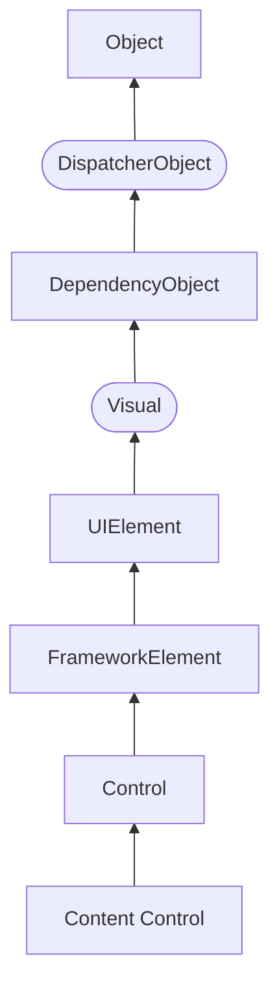
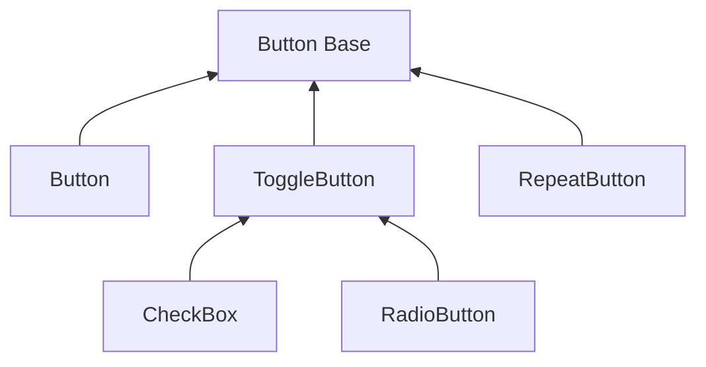
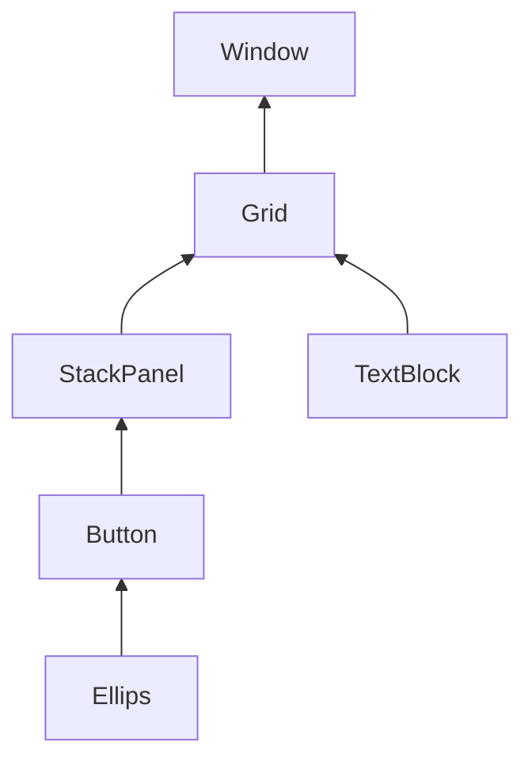

# WPF

- [Введение в WPF](#введение-в-wpf)
  - [Особенности платформы WPF](#особенности-платформы-wpf)
    - [Преимущества WPF](#преимущества-wpf)
    - [Структура проекта WPF](#структура-проекта-wpf)
- [XAML](#xaml)
  - [Введение в язык XAML](#введение-в-язык-xaml)
    - [Структура XAML](#структура-xaml)
    - [Пространства имен XAML](#пространства-имен-xaml)
    - [Элементы и их атрибуты](#элементы-и-их-атрибуты)
    - [Специальные символы](#специальные-символы)
  - [Файлы отделенного кода](#файлы-отделенного-кода)
    - [Взаимодействие кода C# и XAML](#взаимодействие-кода-c-и-xaml)
    - [Создание элементов в коде C#](#создание-элементов-в-коде-c)
  - [Сложные свойства и конвертеры](#сложные-свойства-и-конвертеры)
    - [Сложные свойства в WPF](#сложные-свойства-в-wpf)
    - [Конвертеры типов в WPF](#конвертеры-типов-в-wpf)
    - [Конвертеры значений](#конвертеры-значений)
  - [Пространства имен из C# в XAML](#пространства-имен-из-c-в-xaml)
    - [Преимущества](#преимущества)
    - [Проблемы и решения](#проблемы-и-решения)
- [Компоновка](#компоновка)
  - [Введение в компоновку](#введение-в-компоновку)
  - [Иерархия классов](#иерархия-классов)
  - [Принципы компоновки](#принципы-компоновки)
  - [Процесс компоновки](#процесс-компоновки)
  - [Диспетчеры компоновки](#диспетчеры-компоновки)
    - [`System.Windows.Controls`](#systemwindowscontrols)
    - [`System.Windows.Controls.Primitives`](#systemwindowscontrolsprimitives)
  - [Основные диспетчеры](#основные-диспетчеры)
    - [StackPanel](#stackpanel)
    - [WrapPanel](#wrappanel)
    - [DockPanel](#dockpanel)
    - [Присоединяемые свойства XAML (attached properties)](#присоединяемые-свойства-xaml-attached-properties)
      - [Определение присоединенного свойства](#определение-присоединенного-свойства)
      - [Использование в XAML](#использование-в-xaml)
      - [Пример](#пример)
    - [VirtualizingPanel](#virtualizingpanel)
      - [VirtualizingStackPanel](#virtualizingstackpanel)
      - [DataGridCellsPanel](#datagridcellspanel)
    - [Grid](#grid)
      - [Установка размеров](#установка-размеров)
        - [Автоматические размеры](#автоматические-размеры)
        - [Абсолютные размеры](#абсолютные-размеры)
        - [Пропорциональные размеры](#пропорциональные-размеры)
      - [Программное добавление элементов и IAddChild](#программное-добавление-элементов-и-iaddchild)
      - [GridSplitter](#gridsplitter)
    - [Canvas](#canvas)
  - [Базовые примитивы](#базовые-примитивы)
    - [UniformGrid](#uniformgrid)
    - [TabPanel](#tabpanel)
    - [ToolBarOverflowPanel](#toolbaroverflowpanel)
    - [ToolBarPanel](#toolbarpanel)
  - [Основные свойства компоновки элементов](#основные-свойства-компоновки-элементов)
    - [Ширина и высота](#ширина-и-высота)
    - [Выравнивание](#выравнивание)
      - [`HorizontalAlignment`](#horizontalalignment)
      - [`VerticalAlignment`](#verticalalignment)
    - [Отступы / `Margin`](#отступы--margin)
    - [`Panel.ZIndex`](#panelzindex)
- [Элементы управления / Control](#элементы-управления--control)
  - [Обзор элементов управления и их свойств](#обзор-элементов-управления-и-их-свойств)
  - [Иерархия классов элементов управления](#иерархия-классов-элементов-управления)
  - [Основные свойства элементов управления](#основные-свойства-элементов-управления)
    - [Name](#name)
    - [FieldModifier](#fieldmodifier)
    - [Visibility](#visibility)
    - [Свойства настройки шрифтов](#свойства-настройки-шрифтов)
    - [Cursor](#cursor)
    - [FlowDirection](#flowdirection)
    - [Цвета фона и шрифта](#цвета-фона-и-шрифта)
  - [Обработчики событий](#обработчики-событий)
    - [Наиболее часто используемые события](#наиболее-часто-используемые-события)
    - [Подключение обработчиков](#подключение-обработчиков)
      - [Декларативный подход](#декларативный-подход)
      - [Императивный подход](#императивный-подход)
  - [Элементы управления содержимым / ContentControl](#элементы-управления-содержимым--contentcontrol)
    - [Позиционирование контента](#позиционирование-контента)
      - [Content Alignment](#content-alignment)
      - [Padding](#padding)
    - [ButtonBase / Кнопки](#buttonbase--кнопки)
      - [Button / Обыкновенная кнопка](#button--обыкновенная-кнопка)
        - [Форматирование содержимого](#форматирование-содержимого)
        - [Сложное содержимое](#сложное-содержимое)
        - [Внутренние отступы](#внутренние-отступы)
        - [Другие свойства](#другие-свойства)
      - [RepeatButton / Кнопка повтора](#repeatbutton--кнопка-повтора)
      - [ToggleButton / Элементарный переключатель](#togglebutton--элементарный-переключатель)
      - [CheckBox / Независимый переключатель](#checkbox--независимый-переключатель)
      - [RadioButton / Зависимый переключатель](#radiobutton--зависимый-переключатель)
    - [HeaderedContentControl / Заголовочное содержимое](#headeredcontentcontrol--заголовочное-содержимое)
      - [GroupBox](#groupbox)
      - [Expander](#expander)
      - [TabItem](#tabitem)
    - [ListBoxItem / Списочные элементы](#listboxitem--списочные-элементы)
      - [ListViewItem](#listviewitem)
      - [ComboBoxItem](#comboboxitem)
    - [Label / Метка](#label--метка)
      - [Label и клавиши доступа (мнемоники)](#label-и-клавиши-доступа-мнемоники)
      - [Использование элементов в качестве содержимого](#использование-элементов-в-качестве-содержимого)
      - [Label и TextBlock](#label-и-textblock)
    - [ToolTip / Всплывающая подсказка](#tooltip--всплывающая-подсказка)
      - [Свойства ToolTip](#свойства-tooltip)
      - [Свойства ToolTipService](#свойства-tooltipservice)
      - [Программное создание всплывающей подсказки](#программное-создание-всплывающей-подсказки)
    - [ScrollViewer / Область прокрутки](#scrollviewer--область-прокрутки)
    - [Window / Окно](#window--окно)
      - [Важнейшие свойства окна](#важнейшие-свойства-окна)
    - [Frame / Фрейм](#frame--фрейм)
    - [UserControl / Пользовательский элемент управления](#usercontrol--пользовательский-элемент-управления)
      - [UserControl vs. CustomControl](#usercontrol-vs-customcontrol)
  - [TextBoxBase / Текстовые элементы](#textboxbase--текстовые-элементы)
    - [TextBox / Неформатированный текст](#textbox--неформатированный-текст)
      - [Однострочный ввод](#однострочный-ввод)
      - [Многострочный ввод](#многострочный-ввод)
      - [Работа с выделением](#работа-с-выделением)
      - [Модифицирование выделения](#модифицирование-выделения)
      - [Проверка орфографии](#проверка-орфографии)
      - [Преимущества и недостатки](#преимущества-и-недостатки)
    - [RichTextBox / Форматированный текст](#richtextbox--форматированный-текст)
      - [Модель потоковых документов / FlowDocument](#модель-потоковых-документов--flowdocument)
      - [Работа с текстом и выделением](#работа-с-текстом-и-выделением)
      - [Использования элемента Run](#использования-элемента-run)
      - [Загрузка и сохранение содержимого](#загрузка-и-сохранение-содержимого)
      - [Преимущества и недостатки](#преимущества-и-недостатки-1)
  - [RangeBase / Элементы диапазонов значений](#rangebase--элементы-диапазонов-значений)
    - [Slider / Ползунок](#slider--ползунок)
    - [ProgressBar / Индикатор выполнения](#progressbar--индикатор-выполнения)
    - [ScrollBar / Линейка прокрутки](#scrollbar--линейка-прокрутки)
  - [Thumb / Бегунок](#thumb--бегунок)
    - [GridSplitter / Разделитель панелей](#gridsplitter--разделитель-панелей)
  - [PasswordBox / Пароль](#passwordbox--пароль)
    - [Примечания по безопасности](#примечания-по-безопасности)
  - [Calendar / Календарь](#calendar--календарь)
  - [DatePicker / Выбор дат](#datepicker--выбор-дат)
  - [Separator / Разделитель](#separator--разделитель)
  - [ItemsControl / Элементы управления коллекциями](#itemscontrol--элементы-управления-коллекциями)
    - [Основные свойства](#основные-свойства)
    - [Управление списком](#управление-списком)
    - [Отображение сложных данных](#отображение-сложных-данных)
    - [ItemsSource](#itemssource)
    - [Преимущества и недостатки](#преимущества-и-недостатки-2)
    - [Selector / Селектор](#selector--селектор)
      - [Выбор элементов](#выбор-элементов)
      - [ListBox](#listbox)
        - [ListView](#listview)
        - [Выделение элементов](#выделение-элементов)
      - [TabControl / Создание вкладок](#tabcontrol--создание-вкладок)
        - [Программное добавление вкладок](#программное-добавление-вкладок)
        - [Сравнение с другими элементами](#сравнение-с-другими-элементами)
      - [ComboBox / Выпадающий список](#combobox--выпадающий-список)
        - [Событие SelectionChanged и обработка выбора объекта](#событие-selectionchanged-и-обработка-выбора-объекта)
        - [Свойства и события](#свойства-и-события)
        - [Сравнение с другими элементами](#сравнение-с-другими-элементами-1)
      - [MutliSelector / Множественное выделение](#mutliselector--множественное-выделение)
        - [DataGrid / Таблица данных](#datagrid--таблица-данных)
        - [Некоторые полезные свойства DataGrid](#некоторые-полезные-свойства-datagrid)
        - [Фильтрация и сортировка](#фильтрация-и-сортировка)
    - [HeaderedItemsControl / Заголовочные списки](#headereditemscontrol--заголовочные-списки)
      - [MenuItem / Элемент меню](#menuitem--элемент-меню)
      - [TreeViewItem / Элемент дерева](#treeviewitem--элемент-дерева)
      - [ToolBar / Панель инструментов](#toolbar--панель-инструментов)
    - [MenuBase / Меню](#menubase--меню)
      - [Menu / Стандартное меню](#menu--стандартное-меню)
      - [ContextMenu / Контекстное меню](#contextmenu--контекстное-меню)
    - [TreeView / Древовидный список](#treeview--древовидный-список)
    - [StatusBar / Строка состояния](#statusbar--строка-состояния)
- [UI Elements / Элементы интерфейса](#ui-elements--элементы-интерфейса)
  - [Visual / Визуальные элементы](#visual--визуальные-элементы)
  - [UIElement / Элемент пользовательского интерфейса](#uielement--элемент-пользовательского-интерфейса)
  - [FrameworkElement / Элементы фреймворка](#frameworkelement--элементы-фреймворка)
  - [TextBlock / Текстовый блок](#textblock--текстовый-блок)
    - [Отображение многострочного содержимого](#отображение-многострочного-содержимого)
    - [TextBlock и Label](#textblock-и-label)
    - [Inline / Встроенные элементы](#inline--встроенные-элементы)
      - [Bold, Italic и Underline](#bold-italic-и-underline)
      - [LineBreak](#linebreak)
      - [Hyperlink](#hyperlink)
      - [Run](#run)
      - [Span](#span)
      - [InlineUIContainer](#inlineuicontainer)
      - [AnchoredBlock](#anchoredblock)
    - [Программное форматирование](#программное-форматирование)
  - [Popup / Всплывающее окно](#popup--всплывающее-окно)
    - [Popup и ToolTip](#popup-и-tooltip)
    - [Скрытие окна](#скрытие-окна)
  - [Image / Изображение](#image--изображение)
  - [InkCanvas / Полотно](#inkcanvas--полотно)
    - [Режимы рисования](#режимы-рисования)
    - [Настройка внешнего вида](#настройка-внешнего-вида)
    - [Сохранение и загрузка](#сохранение-и-загрузка)
- [Навигация](#навигация)
  - [Основные подходы к навигации](#основные-подходы-к-навигации)
  - [Оконная навигация](#оконная-навигация)
    - [Окно](#окно)
    - [Важнейшие свойства окна](#важнейшие-свойства-окна-1)
  - [Страничная навигация](#страничная-навигация)
    - [Страничные интерфейсы](#страничные-интерфейсы)
      - [Окно навигации](#окно-навигации)
      - [Класс Page](#класс-page)
    - [Гиперссылка](#гиперссылка)
      - [Навигация по веб-сайтам](#навигация-по-веб-сайтам)
    - [Размещение страниц](#размещение-страниц)
      - [Размещение страниц во фрейме](#размещение-страниц-во-фрейме)
      - [Размещение страниц внутри другой страницы](#размещение-страниц-внутри-другой-страницы)
    - [Хронология страниц](#хронология-страниц)
      - [Хронология навигации](#хронология-навигации)
    - [Служба навигации](#служба-навигации)
      - [Программная навигация](#программная-навигация)
      - [События навигации](#события-навигации)
- [События](#события)
  - [Модель событий в WPF](#модель-событий-в-wpf)
    - [Маршрутизируемые события](#маршрутизируемые-события)
      - [Генерация маршрутизируемого события](#генерация-маршрутизируемого-события)
    - [Подключение обработчиков событий](#подключение-обработчиков-событий)
      - [Обработка маршрутизируемого события](#обработка-маршрутизируемого-события)
    - [Определение маршрутизированных событий](#определение-маршрутизированных-событий)
    - [Маршрутизация событий](#маршрутизация-событий)
      - [Класс RoutedEventArgs](#класс-routedeventargs)
    - [Поднимающиеся события](#поднимающиеся-события)
      - [Обработка заблокированного события](#обработка-заблокированного-события)
    - [Прикрепляемые события](#прикрепляемые-события)
    - [Туннельные события](#туннельные-события)
- [Работа с базами данных в .NET Framework](#работа-с-базами-данных-в-net-framework)

## Введение в WPF

### Особенности платформы WPF
Технология WPF (Windows Presentation Foundation) является часть экосистемы платформы .NET и представляет собой подсистему для построения графических интерфейсов.

Если при создании традиционных приложений на основе WinForms за отрисовку элементов управления и графики отвечали такие части ОС Windows, как User32 и GDI+, то приложения WPF основаны на DirectX. В этом состоит ключевая особенность рендеринга графики в WPF: используя WPF, значительная часть работы по отрисовке графики, как простейших кнопочек, так и сложных 3D-моделей, ложится на графический процессор на видеокарте, что также позволяет воспользоваться аппаратным ускорением графики.

Одной из важных особенностей является использование языка декларативной разметки интерфейса XAML, основанного на XML: вы можете создавать насыщенный графический интерфейс, используя или декларативное объявление интерфейса, или код на управляемых языках C#, VB.NET и F#, либо совмещать и то, и другое.

Первая версия — WPF 3.0 вышла вместе с .NET Framework 3.0 и операционной системой Windows Vista в 2006 году. И с тех пор платформа WPF является частью экосистемы .NET и развивается вместе с фреймворком .NET. Например, на сегодняшний день последней версией фреймворка .NET является .NET 8, и WPF полностью поддерживается этой версией фреймворка.

#### Преимущества WPF
Что вам, как разработчику, предлагает WPF?

- Использование традиционных языков .NET-платформы — C#, F# и VB.NET для создания логики приложения.

- Возможность **декларативного определения** графического интерфейса с помощью специального языка разметки XAML, основанном на xml и представляющем альтернативу программному созданию графики и элементов управления, а также возможность комбинировать XAML и C#/VB.NET

- **Независимость от разрешения экрана**: поскольку в WPF все элементы измеряются в независимых от устройства единицах, приложения на WPF легко масштабируются под разные экраны с разным разрешением.

- Новые возможности, которых сложно было достичь в WinForms, например, создание трехмерных моделей, привязка данных, использование таких элементов, как стили, шаблоны, темы и др.

- Хорошее **взаимодействие с WinForms**, благодаря чему, например, в приложениях WPF можно использовать традиционные элементы управления из WinForms.

- **Богатые возможности** по созданию различных приложений: это и мультимедиа, и двухмерная и трехмерная графика, и богатый набор встроенных элементов управления, а также возможность самим создавать новые элементы, создание анимаций, привязка данных, стили, шаблоны, темы и многое другое

- **Аппаратное ускорение графики** — вне зависимости от того, работаете ли вы с 2D или 3D, графикой или текстом, все компоненты приложения транслируются в объекты, понятные Direct3D, и затем визуализируются с помощью процессора на видеокарте, что повышает производительность, делает графику более плавной.

- Создание приложений под множество ОС семейства Windows

В тоже время WPF имеет определенные ограничения. Несмотря на поддержку трехмерной визуализации, для создания приложений с большим количеством трехмерных изображений, прежде всего игр, лучше использовать другие средства — DirectX или специальные фреймворки, такие как Monogame или Unity.

Также стоит учитывать, что по сравнению с приложениями на Windows Forms объем программ на WPF и потребление ими памяти в процессе работы в среднем несколько выше. Но это с лихвой компенсируется более широкими графическими возможностями и повышенной производительностью при отрисовке графики.

Кроме того, несмотря на то, что WPF работает поверх кроссплатформенной среды .NET, но в силу природы WPF и зависимости от компонентов Windows, на данный момент создавать приложения на WPF можно только под ОС Windows.

#### Структура проекта WPF
Рассмотрим базовую структуру простейшего стандартного проекта WPF:

*[XML]: Extensible Markup Language (XML)
- *App.config*: файл конфигурации приложения в формате XML, позволяет настроить способ обнаружения и загрузки файлов сборок в среде CLR.

- ***App.xaml*** задает ресурсы приложения и ряд конфигурационных настроек в виде кода XAML. В частности, в файле ***App.xaml*** задается файл окна программы, которое будет открываться при запуске приложения. Если вы откроете этот файл, то можете найти в нем строку **`StartupUri="MainWindow.xaml`** — то есть в данном случае, когда мы запустим приложение, будет создаваться интерфейс из файла ***MainWindow.xaml***.

- ***App.xaml.cs*** — это файл кода на C#, связанный с файлом ***App.xaml***, который также позволяет задать ряд общих ресурсов и общую логику для приложения, но в вид кода C#.

- ***MainWindow.xaml*** представляет визуальный интерфейс окна приложения в виде кода XAML.

- ***MainWindow.xaml.cs*** — это файл логики кода на C#, связанный с окном ***MainWindow.xaml***.

Каталог *Properties*:

- ***AssemblyInfo.cs*** содержит информацию о создаваемой в процессе компиляции сборке.
- *Resources.resx* служит для управления локализованными ресурсами, такими как строки, изображения и другие объекты, которые могут изменяться в зависимости от языка и культуры пользователя. Он является ключевым элементом для создания многоязычных приложений на WPF, обеспечивая гибкость и удобство при работе с локализованными данными.
- *Resources.Designer.cs* автоматически генерируется на основе файла ресурсов *Resources.resx* и служит для упрощения доступа к ресурсам, таким как строки, изображения и другие данные, определенные в .resx файле.
- *Settings.settings* спользуется для хранения настроек приложения, которые могут быть изменены пользователем или программой. Эти настройки позволяют сохранять различные параметры, такие как размеры окна, цвет фона и другие предпочтения, которые должны сохраняться между запусками приложения.
- *Settings.Designer.cs* автоматически генерируется на основе файла настроек *Settings.settings* и служит для упрощения доступа к определенным настройкам приложения. Он содержит сгенерированный код, который позволяет разработчикам легко взаимодействовать с настройками, используя статические свойства.

Объект *References*: используется для управления зависимостями проекта от внешних библиотек и компонентов. Он позволяет разработчику подключать необходимые сборки, которые содержат классы и методы, используемые в приложении.
- **Подключение внешних библиотек**: Объект *References* позволяет добавлять ссылки на внешние библиотеки (например, DLL-файлы), которые могут содержать функциональность, необходимую для работы приложения. Это может включать как сторонние библиотеки, так и другие проекты в решении.

- **Управление зависимостями**: Ссылки создают зависимости между проектами, что позволяет Visual Studio автоматически отслеживать изменения в подключенных библиотеках. Если библиотека изменяется, проект, который на нее ссылается, будет пересобран при следующем запуске сборки.

- **Упрощение разработки**: Благодаря объекту *References* разработчики могут легко использовать классы и методы из подключенных библиотек без необходимости копировать код или вручную управлять путями к файлам.

- **Поддержка различных типов ссылок**: В зависимости от требований проекта можно добавлять ссылки на проекты в решении, на файлы DLL или на общие проекты, что обеспечивает гибкость в организации кода.

Таким образом, объект *References* является ключевым элементом для управления зависимостями и интеграции внешней функциональности в WPF-приложениях, что значительно упрощает процесс разработки.

*References* является частью структуры проекта, управляемой Visual Studio, и не представляет собой отдельный физический файл или папку в файловой системе.

Причины отсутствия объекта *References* в файловом менеджере:
- **Логическая структура проекта**: Объект *References* отображается в Обозревателе решений как логическая группа зависимостей, а не как физическая папка или файл. Это означает, что он не будет виден в файловом менеджере, так как не существует отдельного файла для него.

- **Управление через Visual Studio**: Все ссылки и зависимости управляются через интерфейс Visual Studio. Они хранятся в файле проекта (*.csproj* или *.vbproj*), и при необходимости могут быть добавлены или удалены через диспетчер ссылок.

- **Скрытые файлы**: В некоторых случаях файлы проекта могут быть скрытыми или не отображаться в стандартном файловом менеджере. Например, файлы с расширением *.user* могут быть скрыты по умолчанию.

- ***Task_01.csproj***: стандартный файл проекта C#, который соответствует названию проекта (по умолчанию названию каталога) и описывает все его настройки. Является конфигурационным файлом, который описывает все аспекты проекта, необходимые для его сборки и управления. Он содержит информацию о настройках проекта, зависимостях, ресурсах и других параметрах, которые используются системой сборки MSBuild.

Основные назначения файла *.csproj*:
- **Определение структуры проекта**: Файл *.csproj* описывает, какие файлы и папки входят в проект, включая исходные файлы, ресурсы и зависимости. Это позволяет MSBuild знать, что необходимо собрать и как организовать выходные данные.

- **Настройка параметров сборки**: Внутри файла определяются различные параметры, такие как целевая платформа (.NET Framework или .NET Core), тип выходного файла (например, WinExe для приложений с графическим интерфейсом) и другие настройки, влияющие на процесс сборки.

- **Управление зависимостями**: Файл *.csproj* позволяет добавлять ссылки на внешние библиотеки и пакеты NuGet. Это упрощает управление зависимостями и обновлениями, так как все необходимые компоненты могут быть указаны в одном месте.

- **Поддержка локализации и ресурсов**: В файле можно определить ресурсы приложения (например, файлы XAML), которые будут использоваться в интерфейсе. Это позволяет организовать локализацию и управление ресурсами более эффективно.

- **Интеграция с Visual Studio**: Файл *.csproj* используется Visual Studio для управления проектом. Все изменения, внесенные через интерфейс (например, добавление файлов или зависимостей), автоматически отражаются в этом файле.

Таким образом, файл *.csproj* является ключевым элементом для управления проектом WPF, обеспечивая структурированное описание всех его компонентов и настроек.

- ***Task_01.csproj.user***: является дополнительным конфигурационным файлом, который хранит настройки, специфичные для текущего пользователя (такие, как настройки рабочего пространства/workspace, например, `showAllFiles`). Этот файл создается автоматически Visual Studio и используется для сохранения индивидуальных параметров, которые не должны влиять на другие копии проекта или его пользователей.

Основные назначения файла *.csproj.user*:
- **Хранение пользовательских настроек**: Файл *.csproj.user* содержит настройки, такие как параметры отладки, конфигурации среды выполнения и другие предпочтения, которые могут отличаться у разных пользователей. Это позволяет каждому разработчику настраивать свою среду работы без изменения общего проекта.

- **Изоляция изменений**: Поскольку файл *.csproj.user* не включается в систему контроля версий (например, Git), изменения, внесенные в него, не будут затрагивать других участников команды. Это особенно полезно для настройки локальной отладки или других параметров, специфичных для конкретной машины.

- **Упрощение работы с проектом**: Пользователи могут настроить свои параметры разработки без необходимости редактировать основной файл проекта (*.csproj*), что делает процесс более удобным и безопасным.

- **Формат XML**: Файл *.csproj.user* является XML-документом и может быть открыт и отредактирован вручную при необходимости, хотя обычно это не требуется.

Таким образом, файл *.csproj.user* играет важную роль в управлении индивидуальными настройками разработчиков в проектах WPF, обеспечивая гибкость и возможность персонализации среды разработки.

Каталог *bin* в проекте WPF служит для хранения собранных выходных файлов приложения, таких как исполняемые файлы (.exe) и библиотеки (.dll). Он автоматически создается при сборке проекта и содержит все необходимые файлы для запуска приложения.

Основные назначения каталога *bin*:
- **Хранение выходных файлов**: В каталоге *bin* находятся собранные версии приложения, которые могут быть в режиме отладки (Debug) или релиза (Release). Например, в подкаталоге Debug *будет* находиться исполняемый файл вашего приложения, а также все зависимости, необходимые для его работы1.

- **Упрощение развертывания**: Все необходимые файлы для запуска приложения находятся в одном месте, что упрощает процесс развертывания. Разработчики могут легко копировать содержимое каталога *bin* для установки приложения на другую машину без необходимости собирать проект заново.

- **Отладка и тестирование**: При разработке и тестировании приложения файлы в каталоге *bin* обновляются каждый раз при сборке проекта, что позволяет разработчикам быстро проверять изменения и тестировать функциональность.

- **Поддержка различных конфигураций**: В зависимости от конфигурации сборки (Debug или Release), в каталоге *bin* могут создаваться разные подкаталоги, что позволяет управлять версиями приложения и их зависимостями.

Таким образом, каталог *bin* является важной частью структуры проекта WPF, обеспечивая хранение и организацию выходных файлов, необходимых для работы и развертывания приложения.

Каталог *obj* в проекте WPF используется для хранения временных файлов, которые создаются во время процесса сборки. Этот каталог содержит промежуточные данные, необходимые для компиляции проекта, и не предназначен для конечного использования.

Основные назначения каталога *obj*:
- **Хранение промежуточных файлов**: В каталоге *obj* находятся временные файлы, такие как скомпилированные версии XAML-файлов (например, файлы *.g.cs*), которые генерируются на основе XAML-кода. Эти файлы содержат автоматически сгенерированный код, необходимый для работы с интерфейсом приложения.

- **Оптимизация процесса сборки**: Наличие каталога *obj* позволяет ускорить процесс сборки, так как временные файлы могут быть повторно использованы при последующих сборках. Это снижает время компиляции, так как не требуется каждый раз пересобирать все файлы.

- **Поддержка различных конфигураций**: В каталоге *obj* могут создаваться подкаталоги для различных конфигураций сборки (например, Debug и Release), что позволяет управлять временными файлами в зависимости от выбранной конфигурации.

- **Изоляция от конечного кода**: Файлы в каталоге *obj* не включаются в окончательную сборку приложения и не должны быть переданы другим пользователям или системам контроля версий. Это помогает сохранить чистоту структуры проекта.

Таким образом, каталог *obj* является важным элементом процесса разработки в WPF, обеспечивая хранение временных файлов и оптимизацию сборки приложения.

## XAML

### Введение в язык XAML
*[XAML]: eXtensible Application Markup Language
<dfn title="XAML">XAML</dfn> (eXtensible Application Markup Language) — язык разметки, используемый для инициализации объектов в технологиях на платформе .NET. Применительно к WPF (а также к Silverlight[^Silverlight]) данный язык используется прежде всего для создания пользовательского интерфейса декларативным путем. Хотя функциональность XAML только графическими интерфейсами не ограничивается: данный язык также используется в технологиях WCF[^WCF] и WF, где он никак не связан с графическим интерфейсом. То есть его область шире. Применительно к WPF мы будем говорить о нем чаще всего именно как о языке разметки, который позволяет создавать декларативным путем интерфейс, наподобие HTML в веб-программировании. Однако опять же повторюсь, сводить XAML к одному интерфейсу было бы неправильно, и далее на примерах мы это увидим.

[^Silverlight]: Microsoft Silverlight is a discontinued application framework designed for writing and running rich internet applications, similar to Adobe's runtime, Adobe Flash

[^WCF]: The Windows Communication Foundation, previously known as Indigo, is a free and open-source runtime and a set of APIs in the .NET Framework for building connected, service-oriented applications.

XAML не является обязательной частью приложения, мы вообще можем обходиться без него, создавая все элементы в файле связанного с ним кода на языке C#. Однако использование XAML все-таки несет некоторые преимущества:

- Возможность отделить графический интерфейс от логики приложения, благодаря чему над разными частями приложения могут относительно автономно работать разные специалисты: над интерфейсом — дизайнеры, над кодом логики — программисты.

- Компактность, понятность, код на XAML относительно легко поддерживать.

*[BAML]: Binary Application Markup Language
При компиляции приложения в Visual Studio код в xaml-файлах также компилируется в бинарное представление кода *xaml*, которое называется BAML (Binary Application Markup Language). И затем код baml встраивается в финальную сборку приложения — *exe* или *dll*-файл.

#### Структура XAML
При создании нового проекта WPF он уже содержит файлы с кодом *xaml*. Так, создаваемый по умолчанию в проекте файл *MainWindow.xaml* будет иметь следующую разметку:
```xml
<Window x:Class="XamlApp.MainWindow"
        xmlns="http://schemas.microsoft.com/winfx/2006/xaml/presentation"
        xmlns:x="http://schemas.microsoft.com/winfx/2006/xaml"
        xmlns:d="http://schemas.microsoft.com/expression/blend/2008"
        xmlns:mc="http://schemas.openxmlformats.org/markup-compatibility/2006"
        xmlns:local="clr-namespace:XamlApp"
        mc:Ignorable="d"
        Title="MainWindow" Height="350" Width="525">
    <Grid>

    </Grid>
</Window>
```

Подобно структуре веб-страничке на *html*, здесь есть некоторая иерархия элементов. Элементов верхнего уровня является `Window`, который представляет собой окно приложения. При создании других окон в приложении нам придется всегда начинать объявление интерфейса с элемента `Window`, поскольку это элемент самого верхнего уровня.

Кроме `Window` существует еще два элемента верхнего уровня:

- `Page`

- `Application`

Элемент `Window` имеет вложенный пустой элемент `Grid`, а также подобно html-элементам ряд атрибутов (`Title`, `Width`, `Height`) — они задают заголовок, ширину и высоту окна соответственно.

#### Пространства имен XAML
При создании кода на языке C#, чтобы нам были доступны определенные классы, мы подключаем пространства имен с помощью директивы `using`, например, `using System.Windows;`.

Чтобы задействовать элементы в XAML, мы также подключаем пространства имен. Вторая и третья строчки как раз и представляют собой пространства имен, подключаемые в проект по умолчанию. А атрибут **`xmlns`** представляет специальный атрибут для определения пространства имен в XML.

Так, пространство имен **`http://schemas.microsoft.com/winfx/2006/xaml/presentation`** содержит описание и определение большинства элементов управления. Так как является пространством имен по умолчанию, то объявляется без всяких префиксов.

**`http://schemas.microsoft.com/winfx/2006/xaml`** — это пространство имен, которое определяет некоторые свойства XAML, например свойство `Name` или `Key`. Используемый префикс `x` в определении `xmlns:x` означает, что те свойства элементов, которые заключены в этом пространстве имен, будут использоваться с префиксом **`x`** — `x:Name` или `x:Key`. Это же пространство имен используется уже в первой строчке **`x:Class="XamlApp.MainWindow"`** — здесь создается новый класс `MainWindow` и соответствующий ему файл кода, куда будет прописываться логика для данного окна приложения.

Это два основных пространства имен. Рассмотрим остальные:

- **`xmlns:d="http://schemas.microsoft.com/expression/blend/2008"`**: предоставляет поддержку атрибутов в режиме дизайнера. Это пространство имен преимущественно предназначено для другого инструмента по созданию дизайна на XAML — Microsoft Expression Blend

- **`xmlns:mc="http://schemas.openxmlformats.org/markup-compatibility/2006"`**: обеспечивает режим совместимости разметок XAML. В определении объекта Window двумя строчками ниже можно найти его применение:

  ```
  mc:Ignorable="d"
  ```

  Это выражение позволяет игнорировать парсерам XAML во время выполнения приложения дизайнерские атрибуты из пространства имен с префиксом **`d`**, то есть из `"http://schemas.microsoft.com/expression/blend/2008"`

- **`xmlns:local="clr-namespace:XamlApp"`**: пространство имен текущего проекта. Так как в моем случае проект называется *XamlApp*, то простраство имен называется аналогично. И через префикс `local` я смогу получить в XAML различные объекты, которые я определил в проекте.

Важно понимать, что эти пространства имен не эквивалентны тем пространствам имен, которые подключаются при помощи директивы `using` в c#. Так, например, **`http://schemas.microsoft.com/winfx/2006/xaml/presentation`** подключает в проект следующие пространства имен:

- `System.Windows`

- `System.Windows.Automation`

- `System.Windows.Controls`

- `System.Windows.Controls.Primitives`

- `System.Windows.Data`

- `System.Windows.Documents`

- `System.Windows.Forms.Integration`

- `System.Windows.Ink`

- `System.Windows.Input`

- `System.Windows.Media`

- `System.Windows.Media.Animation`

- `System.Windows.Media.Effects`

- `System.Windows.Media.Imaging`

- `System.Windows.Media.Media3D`

- `System.Windows.Media.TextFormatting`

- `System.Windows.Navigation`

- `System.Windows.Shapes`

- `System.Windows.Shell`

#### Элементы и их атрибуты
XAML предлагает очень простую и ясную схему определения различных элементов и их свойств. Каждый элемент, как и любой элемент XML, должен иметь открытый и закрытый тег, как в случае с элементом Window:
```xml
<Window></Window>
```

Либо элемент может иметь сокращенную форму с закрывающим слешем в конце, наподобие:
```xml
<Window />
```

Но в отличие от элементов *xml* каждый элемент в XAML соответствует определенному классу C#. Например, элемент `Button` соответствует классу `System.Windows.Controls.Button`. А свойства этого класса соответствуют атрибутам элемента `Button`.

Например, добавим кнопку в создаваемую по умолчанию разметку окна:
```xml
<Window x:Class="XamlApp.MainWindow"
        xmlns="http://schemas.microsoft.com/winfx/2006/xaml/presentation"
        xmlns:x="http://schemas.microsoft.com/winfx/2006/xaml"
        xmlns:d="http://schemas.microsoft.com/expression/blend/2008"
        xmlns:mc="http://schemas.openxmlformats.org/markup-compatibility/2006"
        xmlns:local="clr-namespace:XamlApp"
        mc:Ignorable="d"
        Title="MainWindow" Height="350" Width="525">
    <Grid x:Name="grid1">
        <Button x:Name="button1"  Width="100" Height="30" Content="Кнопка" />
    </Grid>
</Window>
```

Сначала идет элемент самого высшего уровня — `Window`, затем идет вложенный элемент `Grid` — контейнер для других элементов, и в нем уже определен элемент `Button`, представляющий кнопку.

Для кнопки мы можем определить свойства в виде атрибутов. Здесь определены атрибуты `x:Name` (имя кнопки), `Width`, `Height` и `Content`. Причем, атрибут `x:Name` берется в данном случае из пространства имен `"http://schemas.microsoft.com/winfx/2006/xaml"`, которое сопоставляется с префиксом **`x`**. А остальные атрибуты не используют префиксы, поэтому берутся из основного пространства имен `"http://schemas.microsoft.com/winfx/2006/xaml/presentation"`.

Подобным образом мы можем определить и другие атрибуты, которые нам нужны. Либо мы в общем можем не определять атрибуты, и тогда они будут использовать значения по умолчанию.

Определив разметку *xaml*, мы можем запустить проект, и нам отобразится графически весь код *xaml* — то есть наша кнопка

#### Специальные символы
При определении интерфейса в XAML мы можем столкнуться с некоторыми ограничениями. В частности, мы не можем использовать специальные символы, такие как знак амперсанда `&,` кавычки `"` и угловые скобки `<` и `>`. Например, мы хотим, чтобы текст кнопки был следующим: `<"Hello">`. У кнопки есть свойство `Content`, которое задает содержимое кнопки. И можно предположить, что нам надо написать так:
```xml
<Button Content="<"Hello">" />
```

Но такой вариант ошибочен и даже не скомпилируется. В этом случае нам надо использовать специальные коды символов (в соответствии с [XML Reserved Markup Characters](https://www.w3resource.com/xml/reserved-markup-characters.php)):

Символ | Код
-- | --
`<` | `&lt;`
`>` | `&gt;`
`&` | `&amp;`
`"` | `&quot;`
`'` | `&apos;`

Например:
```xml
<Button Content="&lt;&quot;Hello&quot;&gt;" />
```

Еще одна проблема, с которой мы можем столкнуться в XAML — добавление пробелов. Возьмем, к примеру, следующее определение кнопки:
```xml
<Button>
    Hello         World
</Button>
```

Здесь свойство `Content` задается неявно в виде содержимого между тегами `<Button>....</Button>`. Но несмотря на то, что у нас несколько пробелов между словами "Hello" и "World", XAML по умолчанию будет убирать все эти пробелы. И чтобы сохранить пробелы, нам надо использовать атрибут `xml:space="preserve"`:
```xml
<Button xml:space="preserve">
    Hello         World
</Button>
```

### Файлы отделенного кода
При создании нового проекта WPF в дополнение к создаваемому файлу *MainWindow.xaml* создается также файл отделенного кода *MainWindow.xaml.cs*, где, как предполагается, должна находится логика приложения связанная с разметкой из MainWindow.xaml. Файлы XAML позволяют нам определить интерфейс окна, но для создания логики приложения, например, для определения обработчиков событий элементов управления, нам все равно придется воспользоваться кодом C#.

По умолчанию в разметке окна используется атрибут **`x:Class`**:
```xml
<Window x:Class="XamlApp.MainWindow"
.......
```

Атрибут **`x:Class`** указывает на класс, который будет представлять данное окно и в который будет компилироваться код в XAML при компиляции. То есть во время компиляции будет генерироваться класс **`XamlApp.MainWindow`**, унаследованный от класса `System.Windows.Window`.

Кроме того в файле отделенного кода *MainWindow.xaml.cs*, который Visual Studio создает автоматически, мы также можем найти класс с тем же именем — в данном случае класс `XamlApp.MainWindow`. По умолчанию он имеет некоторый код:
```c#
using System;
using System.Collections.Generic;
using System.Linq;
using System.Text;
using System.Threading.Tasks;
using System.Windows;
using System.Windows.Controls;
using System.Windows.Data;
using System.Windows.Documents;
using System.Windows.Input;
using System.Windows.Media;
using System.Windows.Media.Imaging;
using System.Windows.Navigation;
using System.Windows.Shapes;

namespace XamlApp
{
    public partial class MainWindow : Window
    {
        public MainWindow()
        {
            InitializeComponent();
        }
    }
}
```

По сути пустой класс, но этот класс уже выполняет некоторую работу. Во время компиляции этот класс объединяется с классом, сгенерированном из кода XAML. Чтобы такое слияние классов во время компиляции произошло, класс `XamlApp.MainWindow` определяется как частичный с модификатором **`partial`**. А через метод `InitializeComponent()` класс `MainWindow` вызывает скомпилированный ранее код XAML, разбирает его и по нему строит графический интерфейс окна.

#### Взаимодействие кода C# и XAML
В приложении часто требуется обратиться к какому-нибудь элементу управления. Для этого надо установить у элемента в XAML свойство Name.

Еще одной точкой взаимодействия между xaml и C# являются события. С помощью атрибутов в XAML мы можем задать события, которые будут связанны с обработчиками в коде C#.

Итак, создадим новый проект WPF, который назовем XamlApp. В разметке главного окна определим два элемента: кнопку и текстовое поле.
```xml
<Window x:Class="XamlApp.MainWindow"
        xmlns="http://schemas.microsoft.com/winfx/2006/xaml/presentation"
        xmlns:x="http://schemas.microsoft.com/winfx/2006/xaml"
        xmlns:d="http://schemas.microsoft.com/expression/blend/2008"
        xmlns:mc="http://schemas.openxmlformats.org/markup-compatibility/2006"
        xmlns:local="clr-namespace:XamlApp"
        mc:Ignorable="d"
        Title="MainWindow" Height="350" Width="525">
    <Grid x:Name="grid1">
        <TextBox x:Name="textBox1" Width="150" Height="30" VerticalAlignment="Top" Margin="20" />
        <Button x:Name="button1"  Width="100" Height="30" Content="Кнопка" Click="Button_Click" />
    </Grid>
</Window>
```

И изменим файл отделенного кода, добавив в него обработчик нажатия кнопки:
```c#
using System.Windows;

namespace XamlApp
{
    public partial class MainWindow : Window
    {
        public MainWindow()
        {
            InitializeComponent();
        }

        private void Button_Click(object sender, RoutedEventArgs e)
        {
            string text = textBox1.Text;
            if (text != "")
            {
                MessageBox.Show(text);
            }
        }
    }
}
```

Определив имена элементов в XAML, затем мы можем к ним обращаться в коде c#: `string text = textBox1.Text`.

При определении имен в XAML надо учитывать, что оба пространства имен "http://schemas.microsoft.com/winfx/2006/xaml/presentation" и "http://schemas.microsoft.com/winfx/2006/xaml" определяют атрибут **`Name`**, который устанавливает имя элемента. Во втором случае атрибут используется с префиксом **`x`**: `x:Name`. Какое именно пространство имен использовать в данном случае, не столь важно, а следующие определения имени `x:Name="button1"` и `Name="button1"` фактически будут равноценны.

В обработчике нажатия кнопки просто выводится сообщение , введенное в текстовое поле. После определения обработчика мы его можем связать с событием нажатия кнопки в *xaml* через атрибут `Click`: `Click="Button_Click"`. В результате после нажатия на кнопку мы увидим в окне введенное в текстовое поле сообщение.

#### Создание элементов в коде C#
Еще одну форму взаимодействия C# и XAML представляет создание визуальных элементов в коде C#. Например, изменим код *xaml* следующим образом:
```xml
<Window x:Class="XamlApp.MainWindow"
        xmlns="http://schemas.microsoft.com/winfx/2006/xaml/presentation"
        xmlns:x="http://schemas.microsoft.com/winfx/2006/xaml"
        xmlns:d="http://schemas.microsoft.com/expression/blend/2008"
        xmlns:mc="http://schemas.openxmlformats.org/markup-compatibility/2006"
        xmlns:local="clr-namespace:XamlApp"
        mc:Ignorable="d"
        Title="MainWindow" Height="350" Width="525">
    <Grid x:Name="layoutGrid">

    </Grid>
</Window>
```

Здесь для элемента `Grid` установлено свойство `x:Name`, через которое мы можем к нему обращаться в коде. И также изменим код C#:
```c#
using System.Windows;
using System.Windows.Controls;

namespace XamlApp
{
    public partial class MainWindow : Window
    {
        public MainWindow()
        {
            InitializeComponent();

            Button myButton = new Button();
            myButton.Width = 100;
            myButton.Height = 30;
            myButton.Content = "Кнопка";
            layoutGrid.Children.Add(myButton);
        }
    }
}
```

В конструкторе страницы создается элемент `Button` и добавляется в `Grid`. И если мы запустим приложение, то увидим добавленную кнопку.

### Сложные свойства и конвертеры
В предыдущих темах было рассмотрено создание элементов в XAML. Например, мы могли бы определить кнопку следующим образом:
```html
<Button x:Name="myButton" Width="120" Height="40" Content="Кнопка" HorizontalAlignment="Center" Background="Red" />
```

С помощью атрибутов мы можем задать различные свойства кнопки. `Height` и `Width` являются простыми свойствами. Они хранят числовое значение. А например, свойства `HorizontalAlignment` или `Background` являются более сложными по своей структуре. Так, если мы будем определять эту же кнопку в коде c#, то нам надо использовать следующий набор инструкций:
```c#
Button myButton = new Button();
myButton.Content = "Кнопка";
myButton.Width = 120;
myButton.Height = 40;
myButton.HorizontalAlignment = HorizontalAlignment.Center;
myButton.Background = new System.Windows.Media.SolidColorBrush(System.Windows.Media.Colors.Red);
```

Чтобы выровнять кнопку по центру, применяется перечисление `HorizontalAlignment`, а для установки фонового цвета — класс `SolidColorBrush`. Хотя в коде XAML мы ничего такого не увидели и устанавливали эти свойства гораздо проще с помощью строк: `Background="Red"`. Дело в том, что по отношению к коду XAML применяются специальные объекты — **type converter** или конвертеры типов, которые могут преобразовать значения из XAML к тем типам тех объектов, которые используются в коде C#.

В WPF имеются встроенные конвертеры для большинства типов данных: `Brush`, `Color`, `FontWeight` и т.д. Все конвертеры типов являются производными от класса **`TypeConverter`**. Например, конкретно для преобразования значения `Background="Red"` в объект `SolidColorBrush` используется производный класс `BrushConverter`. При необходимости можно создать свои конвертеры для каких-то собственных типов данных.

Фактически установка значения в XAML `Background="Red"` сводилась бы к следующему вызову в коде c#:
```c#
myButton.Background = (Brush)System.ComponentModel.TypeDescriptor
        .GetConverter(typeof(Brush)).ConvertFromInvariantString("Red");
```

В данном случае программа пытается получить конвертер для типа `Brush` (базового класса для `SolidColorBrush`) и затем преобразовать строку `"Red"` в конкретный цвет. Для получения нужного конвертера, программа обращается к метаданным класса `Brush`. В частности, он имеет следующий атрибут:
```c#
[TypeConverter(typeof(BrushConverter))]
public abstract class Brush
```

Данный атрибут и позволяет системе определить, какой тип конвертера использовать.

В то же время мы можем более явно использовать эти объекты в коде XAML:
```xml
<Button x:Name="myButton" Width="120" Height="40" Content="Кнопка">
    <Button.HorizontalAlignment>
        <HorizontalAlignment>Center</HorizontalAlignment>
    </Button.HorizontalAlignment>

    <Button.Background>
        <SolidColorBrush Opacity="0.5" Color="Red" />
    </Button.Background>
</Button>
```

Преимуществом такого подхода является то, что у объектов мы можем установить дополнительные параметры.

#### Сложные свойства в WPF
<dfn title="сложное свойство">Сложные свойства</dfn> (Complex Properties) в WPF — это свойства, которые не могут быть представлены простым типом данных, таким как строка или целое число. Они часто используются для установки значений, которые требуют более сложной структуры, например, цвета, точки или геометрические фигуры. В XAML сложные свойства обычно устанавливаются с помощью элементов свойств, которые позволяют определить несколько атрибутов внутри одного свойства.

Пример установки сложного свойства — задание цвета фона кнопки с использованием элемента `Button.Background`:
```xml
<Button>
    <Button.Background>
        <SolidColorBrush Color="Blue" Opacity="0.5" />
    </Button.Background>
</Button>
```

В этом примере свойство `Background` кнопки является сложным, поскольку оно требует определения цвета и прозрачности заливки.

#### Конвертеры типов в WPF
<dfn title="конвертер типов">Конвертеры типов</dfn> (TypeConverters) — это специальные объекты в WPF, которые преобразуют значения строк из кода XAML в соответствующие типы свойств объектов, используемых в коде C#. Они необходимы для того, чтобы свойства могли быть установлены с помощью строковых значений в XAML, а затем преобразованы в необходимый тип данных.

Например, если вы хотите задать цвет заливки кнопки с помощью строки "Blue", конвертер типа поможет преобразовать эту строку в объект `Brush`, который может быть использован для заливки фона кнопки.

Пример использования конвертера типа
```xml
<Button Background="Blue" />
```

В этом случае конвертер типа автоматически преобразует строку "Blue" в объект `SolidColorBrush` с соответствующим цветом.

Чтобы создать собственный конвертер типа, необходимо реализовать интерфейс `TypeConverter`. Этот интерфейс требует реализации методов `ConvertFrom` и `ConvertTo`, которые отвечают за преобразование строковых значений в нужный тип и обратно:
```cs
public class CustomTypeConverter : TypeConverter
{
    public override bool CanConvertFrom(ITypeDescriptorContext context, Type sourceType)
    {
        if (sourceType == typeof(string))
            return true;
        return base.CanConvertFrom(context, sourceType);
    }

    public override object ConvertFrom(ITypeDescriptorContext context, CultureInfo culture, object value)
    {
        if (value is string strValue)
        {
            // Преобразуйте строку в нужный тип
            return CustomType.Parse(strValue);
        }
        return base.ConvertFrom(context, culture, value);
    }

    public override bool CanConvertTo(ITypeDescriptorContext context, Type destinationType)
    {
        if (destinationType == typeof(string))
            return true;
        return base.CanConvertTo(context, destinationType);
    }

    public override object ConvertTo(ITypeDescriptorContext context, CultureInfo culture, object value, Type destinationType)
    {
        if (destinationType == typeof(string))
        {
            // Преобразуйте объект в строку
            return value.ToString();
        }
        return base.ConvertTo(context, culture, value, destinationType);
    }
}
```

Эта реализация позволяет преобразовывать строковые значения в пользовательский тип и обратно, что делает возможным использование этого типа в XAML с помощью строковых значений.

#### Конвертеры значений
<dfn title="конвертер значений">Конвертеры значений</dfn> (ValueConverters) — это еще один тип конвертеров в WPF, которые используются для преобразования данных между источником и целевым объектом в привязках данных. Они позволяют преобразовывать данные в более удобочитаемый или подходящий для отображения формат, например, преобразование числовых кодов в строки или дат в определенный формат.

Пример использования конвертера значений:
```cs
public class DateToStringConverter : IValueConverter
{
    public object Convert(object value, Type targetType, object parameter, CultureInfo culture)
    {
        if (value is DateTime date)
        {
            return date.ToString("dd MMMM yyyy");
        }
        return value;
    }

    public object ConvertBack(object value, Type targetType, object parameter, CultureInfo culture)
    {
        if (value is string strValue)
        {
            return DateTime.Parse(strValue);
        }
        return value;
    }
}
```

### Пространства имен из C# в XAML
Отображение пространства имен из C# в XAML позволяет использовать классы и типы, определенные в коде C#, в разметке XAML. Это делается с помощью атрибута `xmlns`, который сопоставляет префикс с пространством имен .NET.

По умолчанию в WPF в XAML подключается предустановленный набор пространств имен *xml*. Но мы можем задействовать любые другие пространства имен и их функциональность в том числе и стандартные пространства имен платформы .NET, например, `System` или `System.Collections`. Например, по умолчанию в определении элемента Window подключается локальное пространство имен:
```xml
xmlns:local="clr-namespace:XamlApp"
```

Общий синтаксис подключения пространства имен в XAML следующий:
```xml
xmlns:Префикс="clr-namespace:Пространство_имен;assembly=имя_сборки"
```

- *Префикс*: Это префикс XML, который будет использоваться для указания пространства имен в разметке XAML.

- *Пространство имен*: Полностью квалифицированное название пространства имен .NET.

- *Имя сборки*: Сборка, в которой объявлен тип, без расширения .dll. Если используется сборка вашего проекта, этот параметр можно опустить.

`clr` здесь означает Common Language Runtime — общая среда выполнения языков программирования .NET. В контексте XAML `clr`-namespace указывает на то, что пространство имен относится к среде CLR, что позволяет использовать типы, определенные в коде C# или других языках .NET, в разметке XAML.

<details>
<summary><em>Что такое сборка</em></summary>

В контексте WPF и .NET сборка (assembly) — это базовая структурная единица, которая содержит код, данные и метаданные приложения. Это файлы с расширением *.exe* или *.dll*, которые создаются в результате компиляции проекта.

Основные компоненты сборки
- **Манифест**: Содержит метаданные о сборке, такие как ее имя, версия и культура.

- **Метаданные типов**: Определяют местоположение типов в сборке и их размещение в памяти.

- **Код приложения**: Это код на языке MSIL (Microsoft Intermediate Language), в который компилируется исходный код C# или других языков .NET.

- **Ресурсы**: Это файлы или данные, которые встраиваются в сборку, такие как изображения, файлы XAML или другие ресурсы.

В WPF сборки играют ключевую роль в организации и развертывании приложений. Они позволяют:

- Использовать сторонние библиотеки: WPF приложения могут ссылаться на сторонние сборки для использования дополнительных функций.

- Встраивать ресурсы: XAML-файлы и другие ресурсы встраиваются в сборку, что упрощает развертывание приложения.

- Управлять версиями: Сборки позволяют контролировать версии приложения и управлять зависимостями между сборками.

Когда вы создаете WPF приложение, Visual Studio компилирует его в сборку, которая может быть *.exe* или *.dll*. Эта сборка содержит все необходимые ресурсы и код для запуска приложения.

Таким образом, сборки являются фундаментальными для разработки приложений WPF, так как они позволяют организовать код, ресурсы и метаданные в едином файле, что упрощает развертывание и управление приложением.

</details>

Локальное пространство имен, как правило, называется по имени проекта (в моем случае проект называется `XamlApp`) и позволяет подключить все классы, которые определены в коде C# в нашем проекте. Например, добавим в проект следующий класс:
```c#
public class Phone
{
    public string Name { get; set; }
    public int Price { get; set; }

    public override string ToString()
    {
        return $"Смартфон {this.Name}; цена: {this.Price}";
    }
}
```

Используем этот класс в коде *xaml*:
```xml
<Window x:Class="XamlApp.MainWindow"
        xmlns="http://schemas.microsoft.com/winfx/2006/xaml/presentation"
        xmlns:x="http://schemas.microsoft.com/winfx/2006/xaml"
        xmlns:d="http://schemas.microsoft.com/expression/blend/2008"
        xmlns:mc="http://schemas.openxmlformats.org/markup-compatibility/2006"
        xmlns:local="clr-namespace:XamlApp"
        mc:Ignorable="d"
        Title="MainWindow" Height="350" Width="525">
    <Grid x:Name="layoutGrid">
        <Button x:Name="phoneButton" Width="250" Height="40" HorizontalAlignment="Center">
            <Button.Content>
                <local:Phone Name="Lumia 950" Price="700" />
            </Button.Content>
        </Button>
    </Grid>
</Window>
```

Так как пространство имен проекта проецируется на префикс **`local`**, то все классы проекта используются в форме `local:Название_Класса`. Так в данном случае объект `Phone` устанавливается в качестве содержимого кнопки через свойство `Content`. Для сложных объектов это свойство принимает их строковое представление, которое возвращается методом `ToString()`:

Мы можем подключить любые другие пространства имен, классы которых мы хотим использовать в приложении. Например:
```xml
<Window x:Class="XamlApp.MainWindow"
        xmlns="http://schemas.microsoft.com/winfx/2006/xaml/presentation"
        xmlns:x="http://schemas.microsoft.com/winfx/2006/xaml"
        xmlns:d="http://schemas.microsoft.com/expression/blend/2008"
        xmlns:mc="http://schemas.openxmlformats.org/markup-compatibility/2006"
        xmlns:local="clr-namespace:XamlApp"

        xmlns:col="clr-namespace:System.Collections;assembly=mscorlib"
        xmlns:sys="clr-namespace:System;assembly=mscorlib"

        mc:Ignorable="d"
        Title="MainWindow" Height="350" Width="525">
    <Window.Resources>
        <col:ArrayList x:Key="days">
            <sys:String>Понедельник</sys:String>
            <sys:String>Вторник</sys:String>
            <sys:String>Среда</sys:String>
            <sys:String>Четверг</sys:String>
            <sys:String>Пятница</sys:String>
            <sys:String>Суббота</sys:String>
            <sys:String>Воскресенье</sys:String>
        </col:ArrayList>
    </Window.Resources>
    <Grid>
        <ListBox x:Name="listDays" ItemsSource="{StaticResource days}" />
    </Grid>
</Window>
```

Здесь определены два дополнительных пространства имен:
```xml
xmlns:col="clr-namespace:System.Collections;assembly=mscorlib"
xmlns:sys="clr-namespace:System;assembly=mscorlib"
```

Благодаря этому нам становятся доступными объекты из пространств имен `System.Collections` и `System`. И затем используя префикс, мы можем использовать объекты, входящие в данные пространства имен: `<col:ArrayList...`.

Фрагмент `assembly=mscorlib` в XAML используется для указания сборки, в которой находится пространство имен CLR, которое вы хотите использовать. В данном случае `mscorlib` — это сборка, содержащая базовые типы .NET Framework, такие как System.String, System.Int32, System.Boolean и другие.

Когда вы используете `assembly=mscorlib`, вы указываете XAML-анализатору искать типы в пространстве имен `System` внутри сборки `mscorlib`. Это позволяет использовать базовые типы .NET в XAML.

Общий синтаксис подключения пространств имен следующий: `xmlns:Префикс="clr-namespace:Пространство_имен;assembly=имя_сборки"`. Так в предыдущем случае мы подключили пространство имен `System.Collections`, классы которого находятся в сборке `mscorlib`. И данное подключенное пространство имен у нас отображено на префикс `col`.

#### Преимущества
Отображение пространства имен из C# в XAML позволяет:

- Использовать пользовательские классы и типы в разметке XAML.

- Создавать более гибкие и настраиваемые пользовательские интерфейсы.

- Упрощать процесс разработки за счет разделения логики и представления.

#### Проблемы и решения
Если пространство имен не видит, проверьте:

- Правильность имени пространства имен и сборки.

- Наличие ссылки на сборку в проекте.

- Правильность префикса и его использование в XAML

- Пересоберите проект

Альтернативный способ — добавление элементов напрямую в XAML:
```xml
<Window x:Class="XamlApp.MainWindow"
        xmlns="http://schemas.microsoft.com/winfx/2006/xaml/presentation"
        xmlns:x="http://schemas.microsoft.com/winfx/2006/xaml"
        xmlns:d="http://schemas.microsoft.com/expression/blend/2008"
        xmlns:mc="http://schemas.openxmlformats.org/markup-compatibility/2006"
        xmlns:local="clr-namespace:XamlApp"
        mc:Ignorable="d"
        Title="MainWindow" Height="350" Width="525">
    <Grid>
        <ListBox>
            <ListBoxItem>Понедельник</ListBoxItem>
            <ListBoxItem>Вторник</ListBoxItem>
            <ListBoxItem>Среда</ListBoxItem>
            <ListBoxItem>Четверг</ListBoxItem>
            <ListBoxItem>Пятница</ListBoxItem>
            <ListBoxItem>Суббота</ListBoxItem>
            <ListBoxItem>Воскресенье</ListBoxItem>
        </ListBox>
    </Grid>
</Window>
```

## Компоновка

### Введение в компоновку
Чтобы перейти уже непосредственно к созданию красивых интерфейсов и их компонентов, сначала необходимо познакомиться с компоновкой. <dfn title="компоновка">Компоновка</dfn> (layout) представляет собой процесс размещения элементов внутри контейнера. Возможно, вы обращали внимание, что одни программы и веб-сайты на разных экранах с разным разрешением выглядят по-разному: где-то лучше, где-то хуже. В большинстве своем такие программы используют жестко закодированные в коде размеры элементов управления. WPF уходит от такого подхода в пользу так называемого "резинового дизайна", где весь процесс позиционирования элементов осуществляется с помощью компоновки.

Благодаря компоновке мы можем удобным нам образом настроить элементы интерфейса, позиционировать их определенным образом. Например, элементы компоновки в WPF позволяют при ресайзе — сжатии или растяжении — масштабировать элементы, что очень удобно, а визуально не создает всяких шероховатостей типа незаполненных пустот на форме.

В WPF компоновка осуществляется при помощи специальных контейнеров. Фреймворк предоставляет нам следующие контейнеры: **`Grid`**, **`UniformGrid`**, **`StackPanel`**, **`WrapPanel`**, **`DockPanel`** и **`Canvas`**.

Различные контейнеры могут содержать внутри себя другие контейнеры. Кроме данных контейнеров существует еще ряд элементов, такие как `TabPanel`, которые могут включать другие элементы и даже контейнеры компоновки, однако на саму компоновку не столь влияют в отличие от выше перечисленных. Кроме того, если нам не хватает стандартных контейнеров, мы можем определить свои с нужной нам функциональностью.

Контейнеры компоновки позволяют эффективно распределить доступное пространство между элементами, найти для него наиболее предпочтительные размеры.

### Иерархия классов
Все выше перечисленные контейнеры компоновки наследуются от абстрактного класса `Panel`, а само дерево наследования можно представить следующим образом:


где:


Ниже показан базовый обзор некоторых ключевых ветвей иерархии классов. Важно отметить, что основные пространства имен WPF начинаются в `System.Windows` (например, `System.Windows`, `System.Windows.Controls` и `System.Windows.Media`). Единственным исключением являются пространства имен, начинающиеся с `System.Windows.Forms`, которые относятся к инструментам Windows Forms.

- `System.Threading.DispatcherObject`

    Приложения WPF используют знакомую однопоточную модель (single-thread affinity — STA), а это означает, что весь пользовательский интерфейс принадлежит единственному потоку. Взаимодействовать с элементами пользовательского интерфейса из других потоков небезопасно. Чтобы содействовать работе этой модели, каждое WPF-приложение управляется диспетчером, координирующим сообщения (появляющиеся в результате клавиатурного ввода, перемещений курсора мыши и таких процессов платформы, как компоновка). Будучи унаследованным от `DispatcherObject`, каждый элемент пользовательского интерфейса может удостовериться, выполняется ли код в правильном потоке, и обратиться к диспетчеру, чтобы направить код в поток пользовательского интерфейса.

    Этот тип включает одно свойство, представляющее интерес — `Dispatcher`, которое возвращает ассоциированный объект `System.Windows.Threading.Dispatcher`. Класс `Dispatcher` — это точка входа в очередь событий приложения WPF, предоставляющая базовые конструкции для работы с параллелизмом и многопоточностью. По большому счету, это низкоуровневый класс, который в большинстве приложений WPF может быть проигнорирован.

- `System.Windows.DependencyObject`

    В WPF центральный путь взаимодействия с экранными элементами пролегает через свойства. На ранней стадии цикла проектирования архитекторы WPF решили создать более мощную модель свойств, которая положена в основу таких средств, как уведомления об изменениях, наследуемые значения по умолчанию и более экономичное хранилище свойств. Конечным результатом стало средство свойств зависимости (dependency property). За счет наследования от `DependencyObject`, классы WPF получают поддержку свойств зависимости.

    Базовый класс `DependencyObject` предоставляет два ключевых метода для всех производных типов: `GetValue()` и `SetValue()`. С помощью этих членов можно устанавливать само свойство. Другие части инфраструктуры позволяют "регистрировать" тех, кто может использовать свойства зависимости или присоединяемые свойства.

    Хотя свойства зависимости — это ключевой аспект разработки WPF, большую часть времени их детали скрыты от глаз.

- `System.Windows.Media.Visual`

    Каждый элемент, появляющийся в WPF, в основе своей является `Visual`. Класс `Visual` можно воспринимать как единственный объект рисования, инкапсулирующий в себе инструкции рисования, дополнительные подробности рисования (наподобие отсечения, прозрачности и настроек трансформации) и базовую функциональность (вроде проверки попадания). Класс `Visual` также обеспечивает связь между управляемыми библиотеками WPF и сборкой `milcore.dll`, которая визуализирует отображение. Любой класс, унаследованный от `Visual`, обладает способностью отображаться в окне. Если вы предпочитаете создавать свой пользовательский интерфейс с применением легковесного API-интерфейса, не обладающего высокоуровневыми средствами WPF, то можете программировать непосредственно с использованием объектов `Visual`.

    Применение типа `Visual` (и его потомков вроде `DrawingVisual`) обеспечивает наиболее легковесный способ визуализации графических данных, но также подразумевает участие большого объема управляемого кода для обеспечения работы всех необходимых служб.

- `System.Windows.UIElement`

    Класс `UIElement` добавляет поддержку таких сущностей WPF, как компоновка (layout), ввод (input), фокус (focus) и события (events) — все, что команда разработчиков WPF называет аббревиатурой LIFE. Например, именно здесь определен двухшаговый процесс измерения и организации компоновки. Здесь же щелчки кнопками мыши и нажатия клавиш трансформируются в более удобные события, такие как `MouseEnter`. Как и со свойствами, WPF реализует расширенную систему передачи событий, именуемую маршрутизируемыми событиями (routed events).

- `System.Windows.FrameworkElement`

    Класс `FrameworkElement` — конечный пункт в центральном дереве наследования WPF. Он реализует некоторые члены, которые просто определены в `UIElement`. Например, `UIElement` устанавливает фундамент для системы компоновки WPF, но `FrameworkElement` включает ключевые свойства (вроде `HorizontalAlignment` и `Margin`), которые поддерживают его. `UIElement` также добавляет поддержку привязки данных, анимации и стилей — все они являются центральными средствами.

- `System.Windows.Shapes.Shape`

    От этого класса наследуются базовые фигуры, такие как `Rectangle`, `Polygon`, `Ellipse`, `Line` и `Path`. Эти фигуры могут использоваться наряду с более традиционными графическими элементами Windows вроде кнопок и текстовых полей.

- `System.Windows.Controls.Control`

    Элемент управления (control) — это элемент, который может взаимодействовать с пользователем. К нему очевидным образом относятся такие классы, как `TextBox`, `Button` и `ListBox`. Класс `Control` добавляет дополнительные свойства для установки шрифта, а также цветов переднего плана и фона. Но наиболее интересная деталь, которую он предоставляет — это поддержка шаблонов, которая позволяет заменять стандартный внешний вид элемента управления собственным рисованием.

    `Control`, так же, определяет свойства для установки размеров элемента управления, прозрачности, порядка обхода по нажатию клавиши `<Tab>`, дисплейного курсора, цвета фона и т.д.

- `System.Windows.Controls.ContentControl`

    Это базовый класс для всех элементов управления, которые имеют отдельный фрагмент содержимого. Сюда относится все — от скромной метки `Label` до окна `Window`. Наиболее впечатляющая часть этой модели заключается в том, что единственный фрагмент содержимого может быть чем угодно — от обычной строки до панели компоновки, содержащей комбинацию других фигур и элементов управления.

    Например, когда речь идет о типичном элементе управления "кнопка", то обычно предполагается, что его содержимым будет базовый строковый литерал (ОК, Cancel, Abort и т.п.). В случае использования XAML для описания элемента управления WPF, и значение, которое необходимо присвоить свойству Content, может быть выражено в виде простой строки, можете установить свойство Content внутри открывающего определения элемента.

    Содержимое может быть любым. Например, предположим, что нужна "кнопка", которая содержит в себе нечто более интересное, чем простая строка, возможно, специальную графику или текст. На других платформах построения пользовательских интерфейсов, таких как Windows Forms, пришлось бы строить специальный элемент управления, что потребовало бы написания значительного объема кода и сопровождения нового класса. С моделью содержимого WPF это не требуется.

    Когда в свойстве `Content` должно быть установлено значение, которое не может быть выражено простым массивом символов, его нельзя присвоить с использованием атрибута в открывающем определении элемента управления. Вместо этого понадобится определить данные содержимого неявно, внутри контекста элемента.

- `System.Windows.Controls.ItemsControl`

    Это базовый класс для всех элементов управления, которые отображают коллекцию каких-то единиц информации, вроде `ListBox` и `TreeView`. Списочный элемент управления замечательно гибок; например, используя встроенные средства класса `ItemsControl`, можно трансформировать обычный `ListBox` в список переключателей, список флажков, упорядоченный набор картинок или комбинацию совершенно разных элементов по своему выбору. Фактически в WPF все меню, панели инструментов и линейки состояния на самом деле являются специализированными списками и классами.

- `System.Windows.Controls.Panel`

    Это базовый класс для всех контейнеров компоновки — элементов, которые содержат в себе один или более дочерних элементов и упорядочивают их в соответствии с определенными правилами компоновки. Эти контейнеры образуют фундамент системы компоновки WPF, и их использование — ключ к упорядочиванию содержимого наиболее привлекательным и гибким способом.

### Принципы компоновки

В WPF при компоновке и расположении элементов внутри окна нам надо придерживаться следующих принципов:

- Нежелательно указывать явные размеры элементов (за исключением минимальных и максимальных размеров). Размеры должны определяться контейнерами.

- Нежелательно указывать явные позицию и координаты элементов внутри окна. Позиционирование элементов всецело должно быть прерогативой контейнеров. И контейнер сам должен определять, как элемент будет располагаться. Если нам надо создать сложную систему компоновки, то мы можем вкладывать один контейнер в другой, чтобы добиться максимально удобного расположения элементов управления.

### Процесс компоновки
Процесс компоновки проходит два этапа: измерение (measure) и расстановка (arrange). На этапе измерения контейнер производит измерение предпочтительного для дочерних элементов места. Однако не всегда контейнер имеет достаточно места, чтобы расставить все элементы по их предпочтительным размером, поэтому их размеры приходится усекать. Затем происходит этап непосредственной расстановки дочерних элементов внутри контейнера.

Теперь рассмотрим контейнеры компоновки подробнее.

### Диспетчеры компоновки
Окно WPF-приложения обычно представлено корневым элементом `Window`. Дочерним элементом корневого элемента является диспетчер компоновки, который в свою очередь содержит любое количество элементов (в том числе, вложенных диспетчеров компоновки), определяющих пользовательский интерфейс. Диспетчер компоновки является объектом класса, унаследованного от абстрактного класса `System.Windows.Controls.Panel`.

Производные классы `Panel` из пространств имен `System.Windows.Controls` и `System.Windows.Controls.Primitives` различаются по назначению и функциональности. Основные различия:
- **Назначение**: `System.Windows.Controls` содержит классы для организации макета, в то время как `System.Windows.Controls.Primitives` содержит базовые компоненты для построения средств управления.

- **Функциональность**: Производные классы `Panel` в `System.Windows.Controls` обеспечивают различные макеты, тогда как классы в `System.Windows.Controls.Primitives` обеспечивают базовые компоненты для создания сложных средств управления.

#### `System.Windows.Controls`
Этот пространство имен содержит производные классы `Panel`, которые используются для создания пользовательского интерфейса приложений. 

Основные панели (диспетчеры компоновки, контейнерные элементы управления) WPF:

| Элемент | Описание
-- | --
**`Canvas`** | Позволяет размещать дочерние элементы с помощью координат. Элементы остаются в точности там, где были размещены во время проектирования
**`DockPanel`** | Прижимает дочерние элементы к краям панели. Привязывает содержимое к определенной стороне панели — `Тор` (верхняя), `Bottom` (нижняя), `Left` (левая) или `Right` (правая)
**`Grid`** | Располагает содержимое внутри серии ячеек, расположенных в табличной сетке (использует таблицу для расположения элементов)
**`StackPanel`** | Выводит содержимое по вертикали или горизонтали, в зависимости от значения свойства `Orientation`
**`WrapPanel`** | Располагает элементы в ряд, а затем переносит их на следующую строку, если не хватает места. Позиционирует содержимое слева направо, перенося на следующую строку по достижении границы панели. Последовательность размещения происходит сначала сверху вниз или сначала слева направо, в зависимости от значения свойства `Orientation`
**`VirtualizingStackPanel`** | Определяет базовую структуру для панелей виртуализации. Оптимизирует отображение большого количества элементов.

Эти классы предназначены для организации макета в приложениях WPF.

#### `System.Windows.Controls.Primitives`
Это пространство имен содержит базовые компоненты, используемые для создания средств управления. Оно включает компоненты, такие как `Thumb`, `RepeatButton`, и другие базовые элементы, которые могут быть частью более сложных средств управления, но не являются производными классами `Panel` напрямую.

Панели из базовых примитивов WPF:

| Элемент | Описание
-- | --
**`UniformGrid`** | Базовый компонент, который обеспечивает простой и универсальный способ упорядочивания содержимого в сетке, где все ячейки имеют одинаковый размер
**`TabPanel`** | Используется для организации макета вкладок в элементе управления `TabControl`. Он обеспечивает базовую функциональность для расположения заголовков вкладок и переключения между ними.
**`ToolBarPanel`** | Используется для организации элементов внутри элемента управления `ToolBar`. Он наследуется от `StackPanel` и обеспечивает базовую функциональность для расположения кнопок и других элементов управления в панели инструментов.
**`ToolBarOverflowPanel`** | Используется для обработки ситуации, когда элементы в панели инструментов (`ToolBar`) не помещаются в доступное пространство. В этом случае избыточные элементы автоматически перемещаются в выпадающее меню, которое отображается на панели инструментов в виде стрелки.

В отличие от `System.Windows.Controls`, классы в `System.Windows.Controls.Primitives` не предназначены для создания макетов, а скорее для построения базовых компонентов интерфейса.

### Основные диспетчеры

#### StackPanel

Панель `StackPanel` располагает содержащиеся в нем элементы управления либо в вертикальном столбце (по умолчанию), либо в горизонтальной строке (если в атрибут `Orientation` записано значение “Vertical”). Если в панель `StackPanel` добавлено больше элементов управления, чем может быть отображено по ширине/высоте `StackPanel`, лишние элементы обрезаются и не отображаются.

Определение:
```cs
public class StackPanel : System.Windows.Controls.Panel, System.Windows.Controls.Primitives.IScrollInfo
```

Описание: https://learn.microsoft.com/en-us/dotnet/api/system.windows.controls.stackpanel?view=windowsdesktop-9.0

При выводе элементов сверху вниз элементы по умолчанию растягиваются по горизонтали. Это поведение можно изменить с помощью свойств `HorizontalAlignment` и `VerticalAlignment`.

Рассмотрим панель `StackPanel` со следующим содержимым:
```xml
<StackPanel HorizontalAlignment="Center">
  <Label Content="Регистрация пользователя" />
  <Label Content="ФИО" />
  <TextBox Width="200" />
  <Label Content="Email" />
  <TextBox Width="200" />
  <Button Content="Зарегистрироваться" />
</StackPanel>
```

Это более простой элемент компоновки. Он располагает все элементы в ряд либо по горизонтали, либо по вертикали в зависимости от ориентации. Например,
```xml
<Window x:Class="LayoutApp.MainWindow"
        xmlns="http://schemas.microsoft.com/winfx/2006/xaml/presentation"
        xmlns:x="http://schemas.microsoft.com/winfx/2006/xaml"
        xmlns:d="http://schemas.microsoft.com/expression/blend/2008"
        xmlns:mc="http://schemas.openxmlformats.org/markup-compatibility/2006"
        xmlns:local="clr-namespace:LayoutApp"
        mc:Ignorable="d"
        Title="StackPanel" Height="300" Width="300">
    <Grid>
        <StackPanel>
            <Button Background="Blue" Content="1" />
            <Button Background="White" Content="2" />
            <Button Background="Red" Content="3" />
        </StackPanel>
    </Grid>
</Window>
```

В данном случае для свойства `Orientation` по умолчанию используется значение `Vertical`, то есть `StackPanel` создает вертикальный ряд, в который помещает все вложенные элементы сверху вниз. Мы также можем задать горизонтальный стек. Для этого нам надо указать свойство `Orientation="Horizontal"`:
```xml
<Window x:Class="LayoutApp.MainWindow"
        xmlns="http://schemas.microsoft.com/winfx/2006/xaml/presentation"
        xmlns:x="http://schemas.microsoft.com/winfx/2006/xaml"
        xmlns:d="http://schemas.microsoft.com/expression/blend/2008"
        xmlns:mc="http://schemas.openxmlformats.org/markup-compatibility/2006"
        xmlns:local="clr-namespace:LayoutApp"
        mc:Ignorable="d"
        Title="StackPanel" Height="300" Width="300">
    <StackPanel Orientation="Horizontal">
        <Button Background="Blue" MinWidth="30" Content="1" />
        <Button Background="White" MinWidth="30" Content="2" />
        <Button Background="Red" MinWidth="30" Content="3" />
    </StackPanel>
</Window>
```

При горизонтальной ориентации все вложенные элементы располагаются слева направо. Если мы хотим, чтобы наполнение стека начиналось справа налево, то нам надо задать свойство `FlowDirection`: `<StackPanel Orientation="Horizontal" FlowDirection="RightToLeft">`. По умолчанию это свойство имеет значение `LeftToRight` — то есть слева направо.

`StackPanel` реализует интерфейс `IScrollInfo` для поддержки логической прокрутки. Это означает, что вместо традиционной прокрутки на определенное количество пикселей, `StackPanel` прокручивается до следующего элемента в логическом дереве. Это поведение полезно, когда необходимо прокручивать содержимое в логических единицах, а не в физических пикселях.

Когда `StackPanel` используется внутри `ScrollViewer` с установленным свойством `CanContentScroll` равным `true`, он позволяет выполнять прокрутку до следующего элемента, а не на определенное количество пикселей. Это обеспечивает более удобный и интуитивный способ прокрутки содержимого, особенно когда элементы имеют разные размеры или когда необходимо прокручивать до конкретных элементов, а не на определенное расстояние.

Таким образом, реализация `IScrollInfo` в `StackPanel` позволяет разработчикам создавать пользовательские панели с особым поведением прокрутки, что может быть полезно в различных сценариях, таких как создание интерфейсов с особыми требованиями к прокрутке.

#### WrapPanel

Панель `WrapPanel` выводит дочерние элементы последовательно слева направо (либо сверху вниз, если для атрибута `Orientation` установлено значение “Vertical”) и при достижении границы окна переходит на новую строку (столбец). При изменении размеров окна панель перераспределяет компоненты таким образом, чтобы они находились в окне.

Определение:
```cs
public class WrapPanel : System.Windows.Controls.Panel
```

Описание: https://learn.microsoft.com/en-us/dotnet/api/system.windows.controls.wrappanel?view=windowsdesktop-9.0

Рассмотрим панель `WrapPanel` со следующим содержимым:
```xml
<WrapPanel>
  <Label Content="Регистрация пользователя" />
  <Label Content="ФИО" />
  <TextBox Width="200" />
  <Label Content="Email" />
  <TextBox Width="200" />
  <Button Content="Зарегистрироваться" />
</WrapPanel>
```

Эта панель, подобно `StackPanel`, располагает все элементы в одной строке или колонке в зависимости от того, какое значение имеет свойство `Orientation` — `Horizontal` или `Vertical`. Главное отличие от `StackPanel` — если элементы не помещаются в строке или столбце, создаются новые столбец или строка для не поместившихся элементов.
```xml
<Window x:Class="LayoutApp.MainWindow"
        xmlns="http://schemas.microsoft.com/winfx/2006/xaml/presentation"
        xmlns:x="http://schemas.microsoft.com/winfx/2006/xaml"
        xmlns:d="http://schemas.microsoft.com/expression/blend/2008"
        xmlns:mc="http://schemas.openxmlformats.org/markup-compatibility/2006"
        xmlns:local="clr-namespace:LayoutApp"
        mc:Ignorable="d"
        Title="WrapPanel" Height="250" Width="300">
    <WrapPanel>
        <Button Background="AliceBlue" Content="Кнопка 1" />
        <Button Background="Blue" Content="Кнопка 2" />
        <Button Background="Aquamarine" Content="Кнопка 3" Height="30"/>
        <Button Background="DarkGreen" Content="Кнопка 4" Height="20"/>
        <Button Background="LightGreen" Content="Кнопка 5"/>
        <Button Background="RosyBrown" Content="Кнопка 6" Width="80" />
        <Button Background="GhostWhite" Content="Кнопка 7" />
    </WrapPanel>
</Window>
```

В горизонтальном стеке те элементы, у которых явным образом не установлена высота, будут автоматически принимать высоту самого большого элемента из стека.

Вертикальный `WrapPanel` делается аналогично:
```xml
<WrapPanel Orientation="Vertical">
    <Button Background="AliceBlue" Content="Кнопка 1" Height="50" />
    <Button Background="Blue" Content="Кнопка 2" />
    <Button Background="Aquamarine" Content="Кнопка 3" Width="60"/>
    <Button Background="DarkGreen" Content="Кнопка 4" Width="80"/>
    <Button Background="LightGreen" Content="Кнопка 5"/>
    <Button Background="RosyBrown" Content="Кнопка 6" Height="80" />
    <Button Background="GhostWhite" Content="Кнопка 7" />
    <Button Background="Bisque" Content="Кнопка 8" />
</WrapPanel>
```

В вертикальном стеке элементы, у которых явным образом не указана ширина, автоматически принимают ширину самого широкого элемента.

Мы также можем установить для всех вложенных элементов какую-нибудь определенную ширину (с помощью свойства `ItemWidth`) или высоту (свойство `ItemHeight`):
```xml
<WrapPanel ItemHeight="30" ItemWidth="80" Orientation="Horizontal">
    <Button Background="AliceBlue" Content="1" />
    <Button Background="Blue" Content="2" />
    <Button Background="Aquamarine" Content="3"/>
    <Button Background="DarkGreen" Content="4"/>
    <Button Background="LightGreen" Content="5"/>
    <Button Background="AliceBlue" Content="6"  />
    <Button Background="Blue" Content="7" />
</WrapPanel>
```

#### DockPanel

Панель `DockPanel` пристыковывает дочерние элементы к различным сторонам панели: `Top`, `Bottom`, `Left`, `Right`. Атрибут `LastChildFill` по умолчанию имеет значение `True`, что означает, что последний дочерний элемент управления будет занимать всё оставшееся пространство панели.

Определение:
```cs
public class DockPanel : System.Windows.Controls.Panel
```

Описание: https://learn.microsoft.com/en-us/dotnet/api/system.windows.controls.dockpanel?view=windowsdesktop-9.0

Рассмотрим панель `DockPanel` со следующим содержимым:
```xml
<DockPanel LastChildFill="False">
  <Label DockPanel.Dock="Top" Content="Регистрация пользователя" />
  <Label DockPanel.Dock="Left" Content="ФИО" />
  <TextBox DockPanel.Dock="Left" Width="200" />
  <Label DockPanel.Dock="Right" Content="Email" />
  <TextBox DockPanel.Dock="Right" Width="200" />
  <Button DockPanel.Dock="Bottom" Content="Зарегистрироваться" />
</DockPanel>
```

Этот контейнер прижимает свое содержимое к определенной стороне внешнего контейнера. Для этого у вложенных элементов надо установить сторону, к которой они будут прижиматься с помощью свойства `DockPanel.Dock`. Например,
```xml
<Window x:Class="LayoutApp.MainWindow"
        xmlns="http://schemas.microsoft.com/winfx/2006/xaml/presentation"
        xmlns:x="http://schemas.microsoft.com/winfx/2006/xaml"
        xmlns:d="http://schemas.microsoft.com/expression/blend/2008"
        xmlns:mc="http://schemas.openxmlformats.org/markup-compatibility/2006"
        xmlns:local="clr-namespace:LayoutApp"
        mc:Ignorable="d"
        Title="DockPanel" Height="250" Width="300">
    <DockPanel LastChildFill="True">
        <Button DockPanel.Dock="Top" Background="AliceBlue" Content="Верхняя кнопка" />
        <Button DockPanel.Dock="Bottom" Background="BlanchedAlmond" Content="Нижняя кнопка" />
        <Button DockPanel.Dock="Left" Background="Aquamarine" Content="Левая кнопка" />
        <Button DockPanel.Dock="Right" Background="DarkGreen" Content="Правая кнопка" />
        <Button Background="LightGreen" Content="Центр" />
    </DockPanel>
</Window>
```

В итоге получаем массив кнопок, каждая из которых прижимается к определенной стороне элемента `DockPanel`. Причем у последней кнопки мы можем не устанавливать свойство `DockPanel.Dock`. Она уже заполняет все оставшееся пространство. Такой эффект получается благодаря установке у `DockPanel` свойства `LastChildFill="True"`, которое означает, что последний элемент заполняет все оставшееся место. Если у этого свойства поменять `True` на `False`, то кнопка прижмется к левой стороне, заполнив только о место, которое ей необходимо.

Также обратите внимание на порядок прикрепления к кнопкам свойства `DockPanel.Dock`. Например, если мы изменим порядок на:
```xml
<DockPanel LastChildFill="True">
    <Button DockPanel.Dock="Top" Background="AliceBlue" Content="Верхняя кнопка" />
    <Button DockPanel.Dock="Left" Background="Aquamarine" Content="Левая кнопка" />
    <Button DockPanel.Dock="Right" Background="DarkGreen" Content="Правая кнопка" />
    <Button DockPanel.Dock="Bottom" Background="BlanchedAlmond" Content="Нижняя кнопка" />
    <Button Background="LightGreen" Content="Центр" />
</DockPanel>
```

В этом случае нижняя кнопка уже будет заполнять меньшее место.

Мы также можем прижать к одной стороне сразу несколько элементов. В этом случае они просто будут располагаться по порядку:
```xml
<DockPanel LastChildFill="True">
    <Button DockPanel.Dock="Top" Background="AliceBlue" Content="Верхняя кнопка 1" />
    <Button DockPanel.Dock="Top" Background="AliceBlue" Content="Верхняя кнопка 2" />
    <Button DockPanel.Dock="Bottom" Background="BlanchedAlmond" Content="Нижняя кнопка" />
    <Button DockPanel.Dock="Left" Background="Aquamarine" Content="Левая кнопка1" />
    <Button DockPanel.Dock="Left" Background="Aquamarine" Content="Левая кнопка2" />
    <Button DockPanel.Dock="Right" Background="DarkGreen" Content="Правая кнопка" />
    <Button Background="LightGreen" Content="Центр" />
</DockPanel>
```

Контейнер `DockPanel` особенно удобно использовать для создания стандартных интерфейсов, где верхнюю и левую часть могут занимать какие-либо меню, нижнюю — строка состояния, правую — какая-то дополнительная информация, а в центре будет находиться основное содержание.

У внутренних элементов отсутствует собственный атрибут `Dock`, поэтому для определения положения элементов на панели используется синтаксис **присоединяемых свойств**.

#### Присоединяемые свойства XAML (attached properties)
В XAML поддерживается специальный синтаксис, используемый для определения значения присоединяемого свойства. Присоединяемые свойства позволяют дочернему элементу устанавливать значение какого-то свойства, которое в действительности определено в родительском элементе. Общий шаблон:

```xml
<РодительскийЭлемент>
  <ДочернийЭлемент РодительскийЭлемент.СвойствоРодительскогоЭлемента = "Значение">
</РодительскийЭлемент>
```

С помощью присоединяемых свойств можно определить значения лишь ограниченного набора свойств родительских элементов, которые определены специальным образом в классе родительского элемента.

Присоединяемые свойства в XAML, используемые в WPF, позволяют задавать дополнительные свойства для элементов, которые не определяют эти свойства непосредственно. Они объявляются в классе родительского элемента с использованием статического метода `DependencyProperty.RegisterAttached()`.

##### Определение присоединенного свойства
Чтобы объявить присоединенное свойство, необходимо выполнить следующие шаги:

1. Создание поля **`DependencyProperty`**: Это поле будет хранить информацию о присоединенном свойстве. Например:
   ```cs
   public static readonly DependencyProperty MyProperty =
    DependencyProperty.RegisterAttached(
        "My",
        typeof(string),
        typeof(MyClass), // класс, который определяет это свойство
        new PropertyMetadata(default(string)));
   ```
2. Создание методов доступа: Для работы с присоединенным свойством необходимо определить статические методы `Get` и `Set`, которые будут использоваться для получения и установки значений этого свойства:
   ```cs
   public static void SetMy(DependencyObject element, string value)
   {
       element.SetValue(MyProperty, value);
   }

   public static string GetMy(DependencyObject element)
   {
       return (string)element.GetValue(MyProperty);
   }
   ```

##### Использование в XAML
В XAML присоединенные свойства задаются с использованием синтаксиса `<attached property provider type>.<property name>`. Например, если у вас есть класс `MyClass`, который определяет присоединенное свойство `My`, его можно использовать следующим образом:
```xml
<SomeParentElement local:MyClass.My="SomeValue" />
```

Здесь `local` — это пространство имен, в котором определен класс `MyClass`.

##### Пример
Для наглядности рассмотрим пример использования присоединенного свойства для управления расположением дочерних элементов внутри контейнера:
```cs
public static readonly DependencyProperty DockProperty =
    DependencyProperty.RegisterAttached(
        "Dock",
        typeof(Dock),
        typeof(DockPanel),
        new PropertyMetadata(Dock.Top));

public static void SetDock(UIElement element, Dock value)
{
    element.SetValue(DockProperty, value);
}

public static Dock GetDock(UIElement element)
{
    return (Dock)element.GetValue(DockProperty);
}
```

В этом примере `DockPanel` использует присоединенное свойство `Dock`, чтобы определить, как дочерние элементы должны быть расположены внутри него.

Присоединенные свойства являются мощным инструментом для расширения функциональности элементов управления без необходимости их изменения или создания новых классов.

</details>

#### VirtualizingPanel

`VirtualizingPanel` — это абстрактный класс в WPF, который предоставляет базовую структуру для панелей, которые виртуализируют свою коллекцию дочерних данных. <dfn title="виртуализация">Виртуализация</dfn> означает создание визуальных контейнеров только для тех элементов, которые видны на экране, а также для нескольких элементов сверху и снизу от видимой области. Это позволяет значительно уменьшить потребление памяти и повысить производительность при работе с большими наборами данных.

Определение:
```cs
public abstract class VirtualizingPanel : System.Windows.Controls.Panel
```

Описание: https://learn.microsoft.com/en-us/dotnet/api/system.windows.controls.virtualizingpanel?view=windowsdesktop-9.0

Основные функции `VirtualizingPanel`:

1. **Оптимизация памяти**: Создание визуальных контейнеров только для видимых элементов снижает потребление памяти, что особенно важно при работе с большими коллекциями данных.

2. **Повышение производительности**: Виртуализация уменьшает накладные расходы на создание и уничтожение объектов, что делает прокрутку и отображение данных более плавным и быстрым.

3. **Базовая структура для производных классов**: `VirtualizingPanel` служит базой для производных классов, таких как `VirtualizingStackPanel`, которые реализуют виртуализацию для конкретных типов макетов.

Таким образом, `VirtualizingPanel` обеспечивает основу для создания эффективных и производительных панелей, которые могут обрабатывать большие объемы данных в приложениях WPF.

##### VirtualizingStackPanel

Определение:
```cs
public class VirtualizingStackPanel : System.Windows.Controls.VirtualizingPanel, System.Windows.Controls.Primitives.IScrollInfo
```

Описание: https://learn.microsoft.com/en-us/dotnet/api/system.windows.controls.dockpanel?view=windowsdesktop-9.0

`VirtualizingStackPanel` — это класс в WPF, который служит для оптимизации отображения больших коллекций данных в элементах управления типа `ItemsControl`, таких как `ListBox` или `ListView`. Основная цель `VirtualizingStackPanel` — уменьшить потребление памяти и повысить производительность при работе с большими наборами данных.

Основные функции:
1. **Виртуализация**: `VirtualizingStackPanel` создает визуальные контейнеры только для тех элементов, которые видны на экране, а также для нескольких элементов сверху и снизу от видимой области. Это позволяет значительно снизить количество создаваемых объектов и, следовательно, уменьшить потребление памяти34.

2. **Кэширование**: `VirtualizingStackPanel` поддерживает кэширование элементов, что позволяет хранить в памяти не только видимые элементы, но и несколько элементов сверху и снизу. Это обеспечивает плавную прокрутку, поскольку новые элементы создаются из кэша, а не создаваясь заново при прокрутке3.

3. **Режимы виртуализации**: `VirtualizingStackPanel` поддерживает два режима виртуализации: `Standard` и `Recycling`. Режим `Recycling` позволяет повторно использовать существующие визуальные контейнеры для новых элементов, что еще больше оптимизирует производительность.

4. **Использование в `ItemsControl`**: `VirtualizingStackPanel` часто используется как панель для элементов управления типа `ItemsControl`, чтобы обеспечить эффективное отображение и прокрутку больших наборов данных.

Пример использования `VirtualizingStackPanel` можно увидеть в контексте элемента управления `ListBox`. Виртуализация полезна при работе с большими наборами данных, поскольку она оптимизирует производительность, создавая визуальные контейнеры только для видимых элементов.

В этом примере мы создаем `ListBox`, который использует `VirtualizingStackPanel` для виртуализации элементов. Это особенно полезно, когда у вас большая коллекция данных.

```xml
<Window xmlns="http://schemas.microsoft.com/winfx/2006/xaml/presentation"
        xmlns:x="http://schemas.microsoft.com/winfx/2006/xaml"
        Title="VirtualizingStackPanel Sample" Height="300" Width="300">
    <Window.Resources>
        <x:Array x:Key="data" Type="sys:String">
            <sys:String>Элемент 1</sys:String>
            <sys:String>Элемент 2</sys:String>
            <!-- Добавьте много элементов сюда -->
            <sys:String>Элемент 100</sys:String>
        </x:Array>
    </Window.Resources>

    <StackPanel>
        <ListBox Height="250" ItemsSource="{StaticResource data}"
                 VirtualizingStackPanel.IsVirtualizing="True"
                 VirtualizingStackPanel.VirtualizationMode="Recycling" />
    </StackPanel>
</Window>
```

В этом примере:

- `VirtualizingStackPanel.IsVirtualizing="True"`: Включает виртуализацию, что означает, что будут созданы визуальные контейнеры только для видимых элементов.

- `VirtualizingStackPanel.VirtualizationMode="Recycling"`: Устанавливает режим виртуализации на "Recycling", который позволяет повторно использовать существующие визуальные контейнеры для новых элементов, что еще больше оптимизирует производительность.

Таким образом, `VirtualizingStackPanel` помогает улучшить производительность при работе с большими наборами данных в элементах управления типа `ListBox`.

В целом, `VirtualizingStackPanel` является важным инструментом для оптимизации производительности приложений WPF, работающих с большими объемами данных.

##### DataGridCellsPanel

`DataGridCellsPanel` — это класс в WPF, который используется для организации ячеек и заголовков столбцов внутри элемента управления `DataGrid`. Он отвечает за расположение этих элементов в сетке данных, обеспечивая правильное отображение таблицы с данными.

Определение:
```cs
public class DataGridCellsPanel : System.Windows.Controls.VirtualizingPanel
```

Описание: https://learn.microsoft.com/en-us/dotnet/api/system.windows.controls.datagridcellspanel?view=windowsdesktop-9.0

Основные функции `DataGridCellsPanel`:

1. **Расположение ячеек**: `DataGridCellsPanel` управляет расположением ячеек в сетке, гарантируя, что они правильно выравниваются и отображаются в соответствии с настройками столбцов и строк.

2. **Расположение заголовков столбцов**: Он также обеспечивает правильное расположение заголовков столбцов, которые обычно отображаются в верхней части `DataGrid`.

3. **Совместимость с `DataGrid`**: `DataGridCellsPanel` тесно связан с элементом управления `DataGrid`, обеспечивая базовую функциональность для отображения данных в табличном виде.

В отличие от других панелей, таких как `Grid` или `UniformGrid`, которые могут быть использованы для различных целей макета, `DataGridCellsPanel` специально предназначен для работы внутри `DataGrid`, что делает его важным компонентом для создания таблиц с данными в приложениях WPF.

`DataGridCellsPanel` используется внутри элемента управления `DataGrid` для организации ячеек и заголовков столбцов. Он не используется напрямую в коде или XAML для создания пользовательского интерфейса, а скорее является внутренним компонентом, который используется `DataGrid` для правильного расположения ячеек.

Однако вы можете увидеть его использование в контексте `DataGrid`, где он автоматически создается для размещения ячеек и заголовков столбцов. Вот пример использования `DataGrid`, где `DataGridCellsPanel` используется неявно:
```xml
<Window xmlns="http://schemas.microsoft.com/winfx/2006/xaml/presentation"
        xmlns:x="http://schemas.microsoft.com/winfx/2006/xaml"
        Title="DataGrid Sample" Height="300" Width="300">
    <Grid>
        <DataGrid x:Name="dataGrid" AutoGenerateColumns="True">
            <DataGrid.Columns>
                <DataGridTextColumn Header="ID" Binding="{Binding Path=ID}" />
                <DataGridTextColumn Header="Имя" Binding="{Binding Path=Name}" />
                <DataGridTextColumn Header="Возраст" Binding="{Binding Path=Age}" />
            </DataGrid.Columns>
        </DataGrid>
    </Grid>
</Window>
```

В этом примере `DataGridCellsPanel` используется неявно для расположения ячеек и заголовков столбцов внутри `DataGrid`.

Таким образом, хотя `DataGridCellsPanel` не используется напрямую, его функциональность обеспечивает правильное расположение ячеек и заголовков внутри `DataGrid`.

#### Grid

Это наиболее мощный и часто используемый контейнер, напоминающий обычную таблицу. Он содержит столбцы и строки, количество которых задает разработчик. Для определения строк используется свойство **`RowDefinitions`**, а для определения столбцов — свойство **`ColumnDefinitions`**.

Определение:
```cs
public class Grid : System.Windows.Controls.Panel, System.Windows.Markup.IAddChild
```

Описание: https://learn.microsoft.com/en-us/dotnet/api/system.windows.controls.grid?view=windowsdesktop-9.0

Пример:
```xml
<Grid.RowDefinitions>
    <RowDefinition></RowDefinition>
    <RowDefinition></RowDefinition>
    <RowDefinition></RowDefinition>
</Grid.RowDefinitions>
<Grid.ColumnDefinitions>
    <ColumnDefinition></ColumnDefinition>
    <ColumnDefinition></ColumnDefinition>
    <ColumnDefinition></ColumnDefinition>
</Grid.ColumnDefinitions>
```

Каждая строка задается с помощью вложенного элемента `RowDefinition`, который имеет открывающий и закрывающий тег. При этом задавать дополнительную информацию необязательно. То есть в данном случае у нас определено в гриде 3 строки.

Каждая столбец задается с помощью вложенного элемента `ColumnDefinition`. Таким образом, здесь мы определили 3 столбца. То есть в итоге у нас получится таблица 3х3.

Чтобы задать позицию элемента управления с привязкой к определенной ячейке `Grid`, в разметке элемента нужно прописать значения свойств `Grid.Column` и `Grid.Row`, тем самым указывая, в каком столбце и строке будет находиться элемент. Кроме того, если мы хотим растянуть элемент управления на несколько строк или столбцов, то можно указать свойства `Grid.ColumnSpan` и `Grid.RowSpan`, как в следующем примере:
```xml
<Window x:Class="LayoutApp.MainWindow"
        xmlns="http://schemas.microsoft.com/winfx/2006/xaml/presentation"
        xmlns:x="http://schemas.microsoft.com/winfx/2006/xaml"
        xmlns:d="http://schemas.microsoft.com/expression/blend/2008"
        xmlns:mc="http://schemas.openxmlformats.org/markup-compatibility/2006"
        xmlns:local="clr-namespace:LayoutApp"
        mc:Ignorable="d"
        Title="Grid" Height="250" Width="350">
    <Grid ShowGridLines="True">
        <Grid.RowDefinitions>
            <RowDefinition></RowDefinition>
            <RowDefinition></RowDefinition>
            <RowDefinition></RowDefinition>
        </Grid.RowDefinitions>
        <Grid.ColumnDefinitions>
            <ColumnDefinition></ColumnDefinition>
            <ColumnDefinition></ColumnDefinition>
            <ColumnDefinition></ColumnDefinition>
        </Grid.ColumnDefinitions>
        <Button Grid.Column="0" Grid.Row="0" Content="Строка 0 Столбец 0"  />
        <Button Grid.Column="0" Grid.Row="1" Content="Объединение трех столбцов" Grid.ColumnSpan="3"  />
        <Button Grid.Column="2" Grid.Row="2" Content="Строка 2 Столбец 2"  />
    </Grid>
</Window>
```

Атрибут `ShowGridLines="True"` у элемента `Grid` задает видимость сетки, по умолчанию оно равно `False`.

Подобно HTML-таблице, панель `Grid` может состоять из набора ячеек, каждая из которых имеет свое содержимое. При определении панели `Grid` выполняются следующие шаги:
1. Определение и конфигурирование каждого столбца.
2. Определение и конфигурирование каждой строки.
3. Назначение содержимого каждой ячейке сетки с использованием синтаксиса присоединяемых свойств.

Если не определить никаких строк и столбцов, то по умолчанию панель `Grid` будет состоять из одной ячейки, занимающей всю поверхность окна. Кроме того, если не указать ячейку для дочернего элемента, то он разместится в столбце 0 и строке 0.

Определение столбцов и строк выполняются за счет использования элементов `<Grid.ColumnDefinitions>` и `<Grid.RowDefinitions>`, которые содержат коллекции элементов `<ColumnDefinition>` и `<RowDefinition>`, соответственно.

Каждый дочерний элемент прикрепляется к ячейке сетки, используя присоединяемые свойства `Grid.Row` и `Grid.Column`. Левая верхняя ячейка определяется с помощью `Grid.Column="0"` и `Grid.Row="0"`.

Рассмотрим панель `Grid` со следующим содержимым:
```xml
<Grid>
  <Grid.RowDefinitions>
    <RowDefinition/>
    <RowDefinition/>
    <RowDefinition/>
    <RowDefinition/>
  </Grid.RowDefinitions>
  <Grid.ColumnDefinitions>
    <ColumnDefinition/>
    <ColumnDefinition/>
  </Grid.ColumnDefinitions>
  <Label Grid.Row="0" Grid.Column="0" Content="Регистрация пользователя" />
  <Label Grid.Row="1" Grid.Column="0" Content="ФИО" />
  <TextBox Grid.Row="1" Grid.Column="1" Width="200" />
  <Label Grid.Row="2" Grid.Column="0" Content="Email" />
  <TextBox Grid.Row="2" Grid.Column="1" Width="200" />
  <Button Grid.Row="3" Grid.Column="0" Content="Зарегистрироваться" />
</Grid>
```

Объединение ячеек осуществляется с помощью присоединяемых свойств `Grid.ColumnSpan` и `Grid.RowSpan` аналогично объединению ячеек в HTML-таблицах.

Рассмотрим панель `Grid` со следующим содержимым:
```xml
<Grid>
  <Grid.RowDefinitions>
    <RowDefinition/>
    <RowDefinition/>
    <RowDefinition/>
    <RowDefinition/>
  </Grid.RowDefinitions>
  <Grid.ColumnDefinitions>
    <ColumnDefinition/>
    <ColumnDefinition/>
  </Grid.ColumnDefinitions>
  <Label Grid.Row="0" Grid.Column="0" Grid.ColumnSpan="2" HorizontalAlignment="Center"
  Content="Регистрация пользователя" />
  <Label Grid.Row="1" Grid.Column="0" Content="ФИО" />
  <TextBox Grid.Row="1" Grid.Column="1" Width="200" />
  <Label Grid.Row="2" Grid.Column="0" Content="Email" />
  <TextBox Grid.Row="2" Grid.Column="1" Width="200" />
  <Button Grid.Row="3" Grid.Column="0" Grid.ColumnSpan="2" HorizontalAlignment="Center"
  Content="Зарегистрироваться" />
</Grid>
```

При определении ряда можно задать его высоту с помощью атрибута `Height`, а при определении столбца можно задать его ширину с помощью атрибута `Width`. Значение этих атрибутов может быть следующим:
- `"Auto"` — высота строчки (или ширина колонки) определяется её содержимым;
- `"`*`Число`*`"` — высота строчки (или ширина колонки) равна указанному числу точек;
- `"*"` —  высота строчки (или ширина колонки) занимает всё свободное пространство. Если строчек (колонок) с таким значением атрибута несколько, то свободное пространство перераспределяется между ними.

##### Установка размеров
Но если в предыдущем случае у нас строки и столбцы были равны друг другу, то теперь попробуем их настроить столбцы по ширине, а строки — по высоте. Есть несколько вариантов настройки размеров.

###### Автоматические размеры
Здесь столбец или строка занимает то место, которое им нужно.
```xml
<ColumnDefinition Width="Auto" />
<RowDefinition Height="Auto" />
```

###### Абсолютные размеры
В данном случае высота и ширина указываются в единицах, независимых от устройства:
```xml
<ColumnDefinition Width="150" />
<RowDefinition Height="150" />
```

Также абсолютные размеры можно задать в пикселях, дюймах, сантиметрах или точках:

<table>
<tbody>
    <tr><td>пиксели</td><td>px</td></tr>
    <tr><td>дюймы</td><td>in</td></tr>
    <tr><td>сантиметры</td><td>cm</td></tr>
    <tr><td>точки</td><td>pt</td></tr>
</tbody>
</table>

Например,
```xml
<ColumnDefinition Width="1 in" />
<RowDefinition Height="10 px" />
```

###### Пропорциональные размеры
Например, ниже задаются два столбца, второй из которых имеет ширину в четверть от ширины первого:
```xml
<ColumnDefinition Width="*" />
<ColumnDefinition Width="0.25*" />
```

Если строка или столбец имеет высоту, равную `*`, то данная строка или столбце будет занимать все оставшееся место. Если у нас есть несколько сток или столбцов, высота которых равна `*`, то все доступное место делится поровну между всеми такими сроками и столбцами. Использование коэффициентов (`0.25*`) позволяет уменьшить или увеличить выделенное место на данный коэффициент. При этом все коэффициенты складываются (коэффициент `*` аналогичен `1*`) и затем все пространство делится на сумму коэффициентов.

Например, если у нас три столбца:
```xml
<ColumnDefinition Width="*" />
<ColumnDefinition Width="0.5*" />
<ColumnDefinition Width="1.5*" />
```

В этом случае сумма коэффициентов равна 1* + 0.5* + 1.5* = 3*. Если у нас грид имеет ширину 300 единиц, то коэфициент 1* будет соответствовать пространству 300 / 3 = 100 единиц. Поэтому первый столбец будет иметь ширину в 100 единиц, второй — 100*0.5=50 единиц, а третий — 100 * 1.5 = 150 единиц.

Можно комбинировать все типы размеров. В этом случае от ширины/высоты грида отнимается ширина/высота столбцов/строк с абсолютными или автоматическими размерами, и затем оставшееся место распределяется между столбцами/строками с пропорциональными размерами.

##### Программное добавление элементов и IAddChild
`Grid` реализует интерфейс `IAddChild` для поддержки добавления дочерних элементов через XAML или код. Этот интерфейс предоставляет два метода: `AddChild` и `AddText`, которые позволяют добавлять дочерние объекты или текстовое содержимое к элементу.

Однако в современном WPF использование `IAddChild` считается устаревшим для большинства сценариев. Вместо этого рекомендуется использовать стандартные методы добавления дочерних элементов, такие как `Children.Add` для коллекций элементов.

Реализация `IAddChild` в `Grid` в основном сохранена для совместимости и поддержки определенных сценариев, таких как использование `FrameworkElementFactory`, который может обрабатывать создание дочерних объектов. Для большинства пользователей это означает, что они могут продолжать использовать `Grid` без прямого обращения к `IAddChild`, а вместо этого использовать более традиционные методы добавления элементов в коллекцию `Children`.

Например, добавление элемента в `Grid` обычно делается так:
```cs
Grid myGrid = new Grid();
TextBlock txt = new TextBlock { Text = "Пример текста" };
Grid.SetRow(txt, 0);
Grid.SetColumn(txt, 0);
myGrid.Children.Add(txt);
```

Таким образом, хотя `Grid` реализует `IAddChild`, это больше для поддержки внутренней инфраструктуры и совместимости, чем для прямого использования в пользовательском коде.

##### GridSplitter
Элемент **`GridSplitter`** помогает создавать интерфейсы наподобие элемента `SplitContainer` в WinForms, только более функциональные. Он представляет собой некоторый разделитель между столбцами или строками, путем сдвига которого можно регулировать ширину столбцов и высоту строк. В качестве примера можно привести стандартный интерфейс проводника в Windows, где разделительная полоса отделяет древовидный список папок от панели со списком файлов. Например,
```xml
<Grid>
    <Grid.ColumnDefinitions>
        <ColumnDefinition Width="*" />
        <ColumnDefinition Width="Auto" />
        <ColumnDefinition Width="*" />
    </Grid.ColumnDefinitions>
    <Button Grid.Column="0" Content="Левая кнопка" />
    <GridSplitter Grid.Column="1" ShowsPreview="False" Width="3"
        HorizontalAlignment="Center" VerticalAlignment="Stretch" />
    <Button Grid.Column="2" Content="Правая кнопка" />
</Grid>
```

Двигая центральную линию, разделяющую правую и левую части, мы можем устанавливать их ширину.

Итак, чтобы использовать элемент `GridSplitter`, нам надо поместить его в ячейку в `Grid`. По сути это обычный элемент, такой же, как кнопка. Как выше, у нас три ячейки (так как три столбца и одна строка), и `GridSplitter` помещен во вторую ячейку. Обычно строка или столбец, в которые помещают элемент, имеет для свойств `Height` или `Width` значение `Auto`.

Если у нас несколько строк, и мы хотим, чтобы разделитель распространялся на несколько строк, то мы можем задать свойство `Grid.RowSpan`:
```xml
<Grid.ColumnDefinitions>
    <ColumnDefinition Width="*" />
    <ColumnDefinition Width="Auto" />
    <ColumnDefinition Width="*" />
</Grid.ColumnDefinitions>
<Grid.RowDefinitions>
    <RowDefinition></RowDefinition>
    <RowDefinition></RowDefinition>
</Grid.RowDefinitions>
<GridSplitter Grid.Column="1" Grid.RowSpan="2" ShowsPreview="False" Width="3"
    HorizontalAlignment="Center" VerticalAlignment="Stretch" />
```

В случае, если мы задаем горизонтальный разделитель, то тогда соответственно надо использовать свойство `Grid.ColumnSpan`.

Затем нам надо настроить свойства. Во-первых, надо настроить ширину (`Width`) для вертикальных сплитеров и высоту (`Height`) для горизонтальных. Если не задать соответствующее свойство, то сплитер мы не увидим, так как он изначально очень мал.

Затем нам надо задать выравнивание. Если мы хотим, что сплитер заполнял всю высоту доступной области (то есть если у нас вертикальный сплитер), то нам надо установить для свойства **`VerticalAlignment`** значение `Stretch`.

Если же у нас горизонтальный сплитер, то надо установить свойство **`HorizontalAlignment`** в `Stretch`.

Также в примере выше используется свойство **`ShowsPreview`**. Если оно равно `False`, то изменение границ кнопок будет происходить сразу же при перемещении сплитера. Если же оно равно `True`, тогда изменение границ будет происходить только после того, как перемещение сплитера завершится, и при перемещении сплиттера мы увидим его проекцию.

В отличие от элемента `SplitContainer` в WinForms, в WPF можно установить различное количество динамически регулируемых частей окна. Немного усовершенствуем предыдущий пример:
```xml
<Grid>
    <Grid.ColumnDefinitions>
        <ColumnDefinition Width="*" />
        <ColumnDefinition Width="Auto" />
        <ColumnDefinition Width="*" />
    </Grid.ColumnDefinitions>
    <Grid.RowDefinitions>
        <RowDefinition Height="*"></RowDefinition>
        <RowDefinition Height="Auto"></RowDefinition>
        <RowDefinition Height="*"></RowDefinition>
    </Grid.RowDefinitions>
    <GridSplitter Grid.Column="1"  Grid.Row="0" ShowsPreview="False" Width="3"
        HorizontalAlignment="Center" VerticalAlignment="Stretch" />
    <GridSplitter Grid.Row="1" Grid.ColumnSpan="3" Height="3"
        HorizontalAlignment="Stretch" VerticalAlignment="Center" />
    <Canvas Grid.Column="0" Grid.Row="0">
        <TextBlock>Левая панель</TextBlock>
    </Canvas>
    <Canvas Grid.Column="2" Grid.Row="0" Background="LightGreen">
        <TextBlock>Правая панель</TextBlock>
    </Canvas>
    <Canvas Grid.ColumnSpan="3" Grid.Row="2" Background="#dfffff">
        <TextBlock Canvas.Left="60">Нижняя панель</TextBlock>
    </Canvas>
</Grid>
```

Здесь у нас сразу два сплитера: один между двумя верхними и нижней панелями, а второй — между правой и левой панелями.

#### Canvas
Контейнер `Canvas` является наиболее простым контейнером. Для размещения на нем необходимо указать для элементов точные координаты относительно сторон `Canvas`. Для установки координат элементов используются свойства `Canvas.Left`, `Canvas.Right`, `Canvas.Bottom`, `Canvas.Top`. Например, свойство `Canvas.Left` указывает, на сколько единиц от левой стороны контейнера будет находиться элемент, а свойство `Canvas.Top` — на сколько единиц ниже верхней границы контейнера находится элемент.

Определение:
```cs
public class Canvas : System.Windows.Controls.Panel
```

Описание: https://learn.microsoft.com/en-us/dotnet/api/system.windows.controls.canvas?view=windowsdesktop-9.0

При этом в качестве единиц используются не пиксели, а независимые от устройства единицы, которые помогают эффективно управлять масштабированием элементов. Каждая такая единица равна 1 /96 дюйма, и при стандартной установке в 96 dpi эта независимая от устройства единица будет равна физическому пикселю, так как 1/96 дюйма * 96 dpi (96 точек на дюйм) = 1. В тоже время при работе на других мониторах или при других установленных размеры, установленные в приложении, будут эффективно масштабироваться. Например, при разрешении в 120 dpi одна условная единица будет равна 1,25 пикселя, так как 1/96 дюйма * 120 dpi= 1,25 пикселя.

Если элемент не использует свойства `Canvas.Top` и другие, то по умолчанию свойства `Canvas.Left` и `Canvas.Top` будут равны нулю, то есть он будет находиться в верхнем левом углу.

Также надо учитывать, что нельзя одновременно задавать `Canvas.Left` и `Canvas.Right` или `Canvas.Bottom` и `Canvas.Top`. Если подобное произойдет, то последнее заданное свойство не будет учитываться. Например:
```xml
<Window x:Class="Layout.MainWindow"
        xmlns="http://schemas.microsoft.com/winfx/2006/xaml/presentation"
        xmlns:x="http://schemas.microsoft.com/winfx/2006/xaml"
        Title="MainWindow" Height="300" Width="300">
    <Grid>
        <Canvas Background="Lavender">
            <Button Background="AliceBlue" Content="Top 20 Left 40" Canvas.Top="20" Canvas.Left="40" />
            <Button Background="LightSkyBlue" Content="Top 20 Right 20" Canvas.Top="20" Canvas.Right="20"/>
            <Button Background="Aquamarine" Content="Bottom 30 Left 20" Canvas.Bottom="30" Canvas.Left="20"/>
            <Button Background="LightCyan" Content="Bottom 20 Right 40" Canvas.Bottom="20" Canvas.Right="40"/>
        </Canvas>
    </Grid>
</Window>
```

Панель `Canvas` поддерживает абсолютное позиционирование содержимого пользовательского интерфейса. Если пользователь изменяет размер окна, делая его меньше, чем компоновка, обслуживаемая панелью `Canvas`, ее внутреннее содержимое становится невидимым до тех пор, пока контейнер вновь не увеличится до размера, равного или больше начального размера области `Canvas`.

Панель `Canvas` обладает следующим недостатком: элементы внутри `Canvas` не изменяются динамически при применении стилей или шаблонов.

Рассмотрим панель Canvas со следующим содержимым:
```xml
<Canvas>
  <Label Canvas.Left="10" Canvas.Top="10" Content="Регистрация пользователя" />
  <Label Canvas.Left="10" Canvas.Top="40" Content="ФИО" />
  <TextBox Canvas.Left="70" Canvas.Top="40" Width="200" />
  <Label Canvas.Left="10" Canvas.Top="70" Content="Email" />
  <TextBox Canvas.Left="70" Canvas.Top="70" Width="200" />
  <Button Canvas.Left="50" Canvas.Top="100" Content="Зарегистрироваться" />
</Canvas>
```

У элементов управления `Label`, `TextBox`, `Button` отсутствуют атрибуты `Left` и `Top`, поэтому для определения положения элементов на панели используется синтаксис присоединяемых свойств.

Для дочернего элемента необходимо указать привязку по вертикали (`Canvas.Top` или `Canvas.Bottom`) и привязку по горизонтали (`Canvas.Left` или `Canvas.Right`). Также можно (не обязательно) задать ширину и высоту элемента с помощью атрибутов `Width` и `Height`.

Таким образом, положение дочернего элемента управления можно задать относительно любого угла окна. Например, в следующем примере положение кнопки задано относительно нижнего правого угла окна:
```xml
<Canvas>
  ...
  <Button Canvas.Right="10" Canvas.Bottom="10" Content="Зарегистрироваться" />
</Canvas>
```

Порядок объявления дочерних элементов управления определяет порядок их вывода на экран. В приведенном выше примере кнопка выводится перед текстовыми полями, т.к. она была объявлена в файле XAML последней.

### Базовые примитивы

#### UniformGrid
Аналогичен контейнеру `Grid` контейнер `UniformGrid`, только в этом случае все столбцы и строки одинакового размера и используется упрощенный синтаксис для их определения. Помещает элементы в невидимую таблицу, устанавливая одинаковый размер для всех ячеек.

Определение:
```cs
public class UniformGrid : System.Windows.Controls.Panel
```

Описание: https://learn.microsoft.com/en-us/dotnet/api/system.windows.controls.primitives.uniformgrid?view=windowsdesktop-9.0

Пример:
```xml
<UniformGrid Rows="2" Columns="2">
    <Button Content="Left Top" />
    <Button Content="Right Top" />
    <Button Content="Left Bottom" />
    <Button Content="Right Bottom" />
</UniformGrid>
```

Ключевые особенности:

- Элементы добавляются в ячейки в том порядке, в каком они указаны

- Порядок наполнения стека может быть изменен с помощью свойства `FlowDirection`

- Каждая ячейка в сетке по умолчанию будет иметь одинаковый размер.

- Если свойства `Rows` и `Columns` не задавать явно, рассчитывает количество колонок и строк сам (функция `UniformGrid` создаст квадратный макет на основе общего количества видимых элементов).

- Если указан фиксированный размер `Rows` и `Columns`, то часть элементов, не соответствующая размеру определенных ячеек (лишние), будет обрезана.

- Является упрощенной версией диспетчера `Grid`, наследуя его свойства.

`UniformGrid` относится к пространству имен `System.Windows.Controls.Primitives`, потому что это базовый компонент, который обеспечивает простой и универсальный способ упорядочивания содержимого в сетке, где все ячейки имеют одинаковый размер. Хотя `UniformGrid` является производным от `Panel`, его включение в `System.Windows.Controls.Primitives` обусловлено его ролью базового компонента, который может быть использован для построения более сложных элементов управления или макетов.

В отличие от других панелей в `System.Windows.Controls`, которые предназначены для более сложных и специализированных макетов, `UniformGrid` предоставляет базовую функциональность, которая может быть полезна при создании различных пользовательских элементов управления или макетов. Это делает его частью базовых примитивов, которые могут быть расширены или использованы в различных контекстах, что и определяет его принадлежность к `System.Windows.Controls.Primitives`.

#### TabPanel

`TabPanel` — это класс из пространства имен `System.Windows.Controls.Primitives`, который используется для организации макета вкладок в элементе управления `TabControl`. Он обеспечивает базовую функциональность для расположения заголовков вкладок и переключения между ними.

Определение:
```cs
public class TabPanel : System.Windows.Controls.Panel
```

Описание: https://learn.microsoft.com/en-us/dotnet/api/system.windows.controls.primitives.tabpanel?view=windowsdesktop-9.0

Основная задача `TabPanel` — управлять расположением заголовков вкладок в верхней части `TabControl`, что позволяет пользователям переключаться между вкладками. Это достигается за счет того, что `TabPanel` наследуется от `Panel` и переопределяет методы макета для правильного расположения заголовков.

`TabPanel` не используется напрямую в коде или XAML для создания пользовательского интерфейса, а скорее является внутренним компонентом, который используется `TabControl` для организации своих вкладок. Таким образом, `TabPanel` является важной частью реализации `TabControl`, но не является самостоятельным элементом, который можно использовать отдельно.

В отличие от других панелей, таких как `Grid`, `StackPanel` или `UniformGrid`, которые используются для создания различных макетов в приложениях WPF, `TabPanel` специально предназначен для работы с вкладками и не используется для общих целей макета.

Использование `TabPanel` можно увидеть в контексте настройки шаблона для `TabControl`. Например, вы можете определить шаблон для `TabControl`, где `TabPanel` используется для расположения заголовков вкладок.

Пример использования TabPanel в ControlTemplate:
```xml
<Window xmlns="http://schemas.microsoft.com/winfx/2006/xaml/presentation"
        xmlns:x="http://schemas.microsoft.com/winfx/2006/xaml"
        Title="TabControl Template Sample" Height="300" Width="300">
    <Window.Resources>
        <Style TargetType="TabControl">
            <Setter Property="Template">
                <Setter.Value>
                    <ControlTemplate TargetType="TabControl">
                        <Grid>
                            <Grid.RowDefinitions>
                                <RowDefinition Height="Auto" />
                                <RowDefinition Height="*" />
                            </Grid.RowDefinitions>
                            <TabPanel Grid.Row="0" Margin="2">
                                <TabPanel.ItemContainerStyle>
                                    <Style TargetType="TabItem">
                                        <Setter Property="Template">
                                            <Setter.Value>
                                                <ControlTemplate TargetType="TabItem">
                                                    <Border Margin="2" Background="LightGray">
                                                        <ContentPresenter ContentSource="Header" />
                                                    </Border>
                                                </ControlTemplate>
                                            </Setter.Value>
                                        </Setter>
                                    </Style>
                                </TabPanel.ItemContainerStyle>
                            </TabPanel>
                            <ContentPresenter Grid.Row="1" Margin="2" />
                        </Grid>
                    </ControlTemplate>
                </Setter.Value>
            </Setter>
        </Style>
    </Window.Resources>

    <TabControl>
        <TabItem Header="Вкладка 1">Содержимое вкладки 1</TabItem>
        <TabItem Header="Вкладка 2">Содержимое вкладки 2</TabItem>
    </TabControl>
</Window>
```

В этом примере `TabPanel` используется внутри шаблона для `TabControl`, чтобы расположить заголовки вкладок. Однако это более продвинутый способ настройки внешнего вида и поведения `TabControl`, а не прямое использование `TabPanel` в коде или XAML для создания пользовательского интерфейса.

#### ToolBarOverflowPanel

`ToolBarOverflowPanel` — это класс в WPF, который используется для обработки ситуации, когда элементы в панели инструментов (`ToolBar`) не помещаются в доступное пространство. В этом случае избыточные элементы автоматически перемещаются в выпадающее меню, которое отображается на панели инструментов в виде стрелки.

Определение:
```cs
public class ToolBarOverflowPanel : System.Windows.Controls.Panel
```

Описание: https://learn.microsoft.com/en-us/dotnet/api/system.windows.controls.primitives.toolbaroverflowpanel?view=windowsdesktop-9.0

Основные функции `ToolBarOverflowPanel`:

1. **Обработка переполнения**: Когда на панели инструментов не хватает места для всех элементов, `ToolBarOverflowPanel` берет на себя управление избыточными элементами и отображает их в выпадающем меню.

2. **Выпадающее меню**: Пользователь может кликнуть на стрелку в конце панели инструментов, чтобы открыть выпадающее меню и получить доступ к элементам, которые не поместились на панели.

3. **Интеграция с `ToolBar`**: `ToolBarOverflowPanel` тесно связан с элементом управления `ToolBar`, обеспечивая автоматическую обработку переполнения и возможность доступа к скрытым элементам через меню.

Таким образом, `ToolBarOverflowPanel` является важным компонентом для создания удобных и функциональных панелей инструментов в приложениях WPF, позволяя эффективно управлять большим количеством элементов на ограниченном пространстве.

Пример использования ToolBarOverflowPanel
```xml
<Window xmlns="http://schemas.microsoft.com/winfx/2006/xaml/presentation"
        xmlns:x="http://schemas.microsoft.com/winfx/2006/xaml"
        Title="ToolBarOverflowPanel Sample" Height="300" Width="300">
    <Window.Resources>
        <Style TargetType="ToolBar">
            <Setter Property="Template">
                <Setter.Value>
                    <ControlTemplate TargetType="ToolBar">
                        <Border Background="LightGray">
                            <DockPanel>
                                <ToolBarPanel DockPanel.Dock="Left" IsItemsHost="True" />
                                <ToolBarOverflowPanel DockPanel.Dock="Right" />
                            </DockPanel>
                        </Border>
                    </ControlTemplate>
                </Setter.Value>
            </Setter>
        </Style>
    </Window.Resources>

    <ToolBar>
        <Button Content="Кнопка 1" />
        <Button Content="Кнопка 2" />
        <Button Content="Кнопка 3" />
        <!-- Добавьте много кнопок сюда -->
        <Button Content="Кнопка 10" />
    </ToolBar>
</Window>
```

В этом примере `ToolBarOverflowPanel` используется внутри шаблона для `ToolBar`, чтобы обрабатывать элементы, которые не поместились на панели инструментов. Однако в реальных приложениях это происходит автоматически без необходимости прямого указания `ToolBarOverflowPanel` в XAML.

#### ToolBarPanel

`ToolBarPanel` — это класс из пространства имен `System.Windows.Controls.Primitives`, который используется для организации элементов внутри элемента управления `ToolBar`. Он наследуется от `StackPanel` и обеспечивает базовую функциональность для расположения кнопок и других элементов управления в панели инструментов.

Определение:
```cs
public class ToolBarPanel : System.Windows.Controls.StackPanel
```

Описание: https://learn.microsoft.com/en-us/dotnet/api/system.windows.controls.primitives.toolbarpanel?view=windowsdesktop-9.0

Основные функции `ToolBarPanel`:

1. **Расположение элементов**: `ToolBarPanel` располагает элементы в горизонтальном ряду, что является стандартным для панелей инструментов. Это позволяет создавать традиционный вид панели инструментов, где кнопки и другие элементы управления расположены в одной строке.

2. **Взаимодействие с `ToolBarOverflowPanel`**: В случае, когда элементы не помещаются в пределах панели инструментов, ToolBarPanel работает в связке с ToolBarOverflowPanel, чтобы переместить избыточные элементы в выпадающее меню переполнения. Это обеспечивает автоматическую обработку переполнения и позволяет пользователям доступ к скрытым элементам через меню.

3. **Интеграция с `ToolBarTray`**: `ToolBarPanel` часто используется внутри контейнера `ToolBarTray`, который позволяет управлять несколькими панелями инструментов и обеспечивает функцию перетаскивания панелей.

В целом, `ToolBarPanel` является важным компонентом для создания и организации панелей инструментов в приложениях WPF, обеспечивая удобный и функциональный интерфейс для пользователей.

Он не используется напрямую в коде или XAML для создания пользовательского интерфейса, а скорее является внутренним компонентом, который используется `ToolBar` для правильного расположения элементов на панели инструментов.

Однако вы можете увидеть его использование в контексте настройки шаблона для ``ToolBar``. Например, вы можете определить шаблон для `ToolBar`, где ToolBarPanel используется для расположения элементов на панели инструментов.

Пример использования `ToolBarPanel` в `ControlTemplate`:
```xml
<Window xmlns="http://schemas.microsoft.com/winfx/2006/xaml/presentation"
        xmlns:x="http://schemas.microsoft.com/winfx/2006/xaml"
        Title="ToolBar Template Sample" Height="300" Width="300">
    <Window.Resources>
        <Style TargetType="ToolBar">
            <Setter Property="Template">
                <Setter.Value>
                    <ControlTemplate TargetType="ToolBar">
                        <Border Background="LightGray">
                            <ToolBarPanel Orientation="Horizontal" IsItemsHost="True" />
                        </Border>
                    </ControlTemplate>
                </Setter.Value>
            </Setter>
        </Style>
    </Window.Resources>

    <ToolBar>
        <Button Command="Cut" Content="Вырезать" />
        <Button Command="Copy" Content="Копировать" />
        <Button Command="Paste" Content="Вставить" />
    </ToolBar>
</Window>
```
В этом примере `ToolBarPanel` используется внутри шаблона для `ToolBar`, чтобы расположить элементы на панели инструментов. Свойство `IsItemsHost="True"` указывает, что этот `ToolBarPanel` будет содержать элементы, добавленные в `ToolBar`.

Таким образом, хотя `ToolBarPanel` не используется напрямую в коде или XAML для создания пользовательского интерфейса, его функциональность обеспечивает правильное расположение элементов внутри `ToolBar`.

### Основные свойства компоновки элементов
Элементы WPF обладают набором свойств, которые помогают позиционировать данные элементы. Рассмотрим некоторые из этих свойств.

#### Ширина и высота
У элемента можно установить ширину с помощью свойства `Width` и высоту с помощью свойства `Height`. Эти свойства принимают значение типа `double`. Хотя общая рекомендация состоит в том, что желательно избегать жестко закодированных в коде ширины и высоты.

Также мы можем задать возможный диапазон ширины и высоты с помощью свойств `MinWidth`/`MaxWidth` и `MinHeight`/`MaxHeight`. И при растяжении или сжатии контейнеров элементы с данными заданными свойствами не будут выходить за пределы установленных значений.

Возможно, возникает вопрос, а в каких единицах измерения устанавливаются ширина и высота? Да и в общем какие единицы измерения используются? В WPF можно использовать несколько единиц измерения: сантиметры (`cm`), точки (`pt`), дюймы (`in`) и пиксели (`px`). Например, зададим размеры в других единицах: `<Button Content="Кнопка" Width="5cm" Height="0.4in" />`.

Если единица измерения не задана явно, а просто стоит число, то используются по умолчанию пиксели. Но эти пиксели не равны обычным пикселям, а являются своего рода "логическими пикселями", независимыми от конкретного устройства. Каждый такой пиксель представляет 1/96 дюйма вне зависимости от разрешения экрана.

#### Выравнивание
С помощью специальных свойств мы можем выровнять элемент относительно определенной стороны контейнера по горизонтали или вертикали.

##### `HorizontalAlignment`
Свойство **`HorizontalAlignment`** выравнивает элемент по горизонтали относительно правой или левой стороны контейнера и соответственно может принимать значения `Left`, `Right`, `Center` (положение по центру), `Stretch` (растяжение по всей ширине). Например:
```xml
<Grid>
    <Button Content="Left" Width="60" Height="30" HorizontalAlignment="Left" />
    <Button Content="Center" Width="60" Height="30" HorizontalAlignment="Center" />
    <Button Content="Right" Width="60" Height="30" HorizontalAlignment="Right" />
    <Button Content="Stretch" Height="30" HorizontalAlignment="Stretch" Margin="10 -80 10 0" />
</Grid>
```

##### `VerticalAlignment`
Также мы можем задать для элемента выравнивание по вертикали с помощью свойства **`VerticalAlignment`**, которое принимает следующие значения: `Top` (положение в верху контейнера), `Bottom` (положение внизу), `Center` (положение по центру), `Stretch` (растяжение по всей высоте). Например:
```xml
<Grid>
    <Button Content="Bottom" Width="60" Height="30" VerticalAlignment="Bottom" />
    <Button Content="Center" Width="60" Height="30" VerticalAlignment="Center" />
    <Button Content="Top" Width="60" Height="30" VerticalAlignment="Top" />
    <Button Content="Stretch" Width="60" VerticalAlignment="Stretch" Margin="150 10 0 10" />
</Grid>
```

#### Отступы / `Margin`
Свойство **`Margin`** устанавливает отступы вокруг элемента. Синтаксис: Margin="левый_отступ верхний_отступ правый_отступ нижний_отступ". Например, установим отступы у одной кнопки слева и сверху, а у другой кнопки справа и снизу:
```xml
<Grid>
    <Button Content="15 10 0 0" Width="60" Height="30" Margin ="15 10 0 0"
                        HorizontalAlignment="Left" VerticalAlignment="Top"/>
    <Button Content="0 0 20 10" Width="60" Height="30" Margin ="0 0 20 10"
                    HorizontalAlignment="Right" VerticalAlignment="Bottom"/>
</Grid>
```

Если мы зададим свойство таким образом: `Margin="20"`, то сразу установим отступ для всех четырех сторон.

#### `Panel.ZIndex`
При создании интерфейса возможна ситуация, когда одни элементы будут полностью или частично перекрывать другие. По умолчанию те элементы, которые определены позже, перекрывают те элементы, которые определены ранее. Однако мы можем изменить подобное действие с помощью свойства **`Panel.ZIndex`**.

По умолчанию для всех создаваемых элементов `Panel.ZIndex="0"`. Однако назначив данному свойству более высокое значение, мы можем передвинуть его на передний план. Элементы с большим значением этого свойства будут перекрывать те элементы, у которых меньшее значение этого свойства:
```xml
<Grid>
    <Button Width="60" Height="30" Panel.ZIndex="2" Margin="10 10 0 0">Один</Button>
    <Button Width="60" Height="30" Panel.ZIndex="1" Margin="45 45 0 0">Два</Button>
    <Button Width="60" Height="30" Panel.ZIndex="0" Margin="75 75 0 0">Три</Button>
</Grid>
```

## Элементы управления / Control

### Обзор элементов управления и их свойств
Чтобы как-то взаимодействовать с пользователем, получать от пользователя ввод с клавиатуры или мыши и использовать введенные данные в программе, нам нужны элементы управления. WPF предлагает нам богатый стандартный набор элементов управления

Все элементы управления могут быть условно разделены на несколько подгрупп:

- **Элементы управления содержимым**, например кнопки (`Button`), метки (`Label`).

- **Специальные контейнеры**, которые содержат другие элементы, но в отличие от элементов `Grid` или `Canvas` не являются контейнерами компоновки — `ScrollViewer`,`GroupBox`.

- **Декораторы**, чье предназначение создание определенного фона вокруг вложенных элементов, например, `Border` или `Viewbox`.

- **Элементы управления списками**, например, `ListBox`, `ComboBox`.

- **Текстовые элементы управления**, например, `TextBox`, `RichTextBox`.

- **Элементы, основанные на диапазонах значений**, например, `ProgressBar`, `Slider`.

- **Элементы для работ с датами**, например, `DatePicker` и `Calendar`.

- **Остальные элементы управления**, которые не вошли в предыдущие подгруппы, например, `Image`.

Все элементы управления наследуются от общего класса **`System.Window.Controls.Control`** и имеют ряд общих свойств. А общую иерархию элементов управления можно представить следующим образом:


где:


Вкратце рассмотрим, что представляют все эти типы в иерархии.

### Иерархия классов элементов управления

- `System.Threading.DispatcherObject`

    *[STA]: Single-Thread Affinity
    В основе WPF лежит модель STA (Single-Thread Affinity), согласно которой за пользовательский интерфейс отвечает один поток. И чтобы пользовательский интерфейс мог взаимодействовать с другими потоками, WPF использует концепцию <dfn title="диспетчер">диспетчера</dfn> — специального объекта, управляющего обменом сообщениями, через которые взаимодействуют потоки. Наследование типов от класса `DispatcherObject` позволяет получить доступ к подобному объекту-диспетчеру и и другим функциям по управлению параллелизмом.

- `System.Windows.DependencyObject`

    Наследование от этого класса позволяет взаимодействовать с элементами в приложении через их специальную модель свойств, которые называются *свойствами зависимостей* (dependency properties). Эта модель упрощает применение ряда особенностей WPF, например, привязки данных. Так, система свойств зависимостей отслеживает зависимости между значениями свойств, автоматически проверяет их и изменяет при изменении зависимости.

- `System.Windows.Media.Visual`

    Класс `Visual` содержит инструкции, которые отвечают за отрисовку, визуализацию объекта.

- `System.Windows.UIElement`

    Класс `UIElement` добавляет возможности по компоновке элемента, обработку событий и получение ввода.

- `System.Windows.FrameworkElement`

    Класс `FrameworkElement` добавляет поддержку привязки данных, анимации, стилей. Также добавляет ряд свойств, связанных с компоновкой (выравнивание, отступы) и ряд других.

- `System.Windows.Controls.Control`

    Класс `Control` представляет элемент управления, с которым взаимодействует пользователь. Этот класс добавляет ряд дополнительных свойств для поддержки элементами шрифтов, цветов фона, шрифта, а также добавляет поддержку шаблонов — специального механизма в WPF, который позволяет изменять стандартное представление элемента, кастомизировать его.

    И далее от класса `Control` наследуются непосредственно конкретные элементы управления или их базовые классы, которые получают весь функционал, добавляемый к типам в этой иерархии классов.

Рассмотрим некоторые из основных свойств, которые наследуются элементами управления.

### Основные свойства элементов управления

#### Name
Данное свойство определяет имя элемента управления, через которое впоследствии можно будет обращаться к данному элементу, как в коде, так и в *xaml* разметке. Например, в xaml-коде у нас определена следующая кнопка:
```xml
<Button x:Name="button1" Width="60" Height="30" Content="Текст" Click="button1_Click" />
```

Здесь у нас задан атрибут `Click` с названием метода обработчика `button1_Click`, который будет определен в файле кода C# и будет вызываться по нажатию кнопки. Тогда в связанном файле кода C# мы можем обратиться к этой кнопке:
```cs
private void button1_Click(object sender, RoutedEventArgs e)
{
    button1.Content = "Привет!";
}
```

Поскольку свойство `Name` имеет значение `button1`, то через это значение мы можем обратиться к кнопке в коде.

#### FieldModifier
Свойство `FieldModifier` задает модификатор доступа к объекту:
```xml
<StackPanel>
    <Button x:FieldModifier="private" x:Name="button1" Content="Hello World" />
    <Button x:FieldModifier="internal" x:Name="button2" Content="Hello WPF" />
</StackPanel>
```

В качестве значения используются стандартные модификатора доступа языка C#: `private`, `protected`, `internal`, `protected internal` и `public`. В данном случае объявление кнопок с модификаторами будет равноценно следующему их определению в коде:
```cs
private Button button1;
internal Button button2;
```

Если для элемента не определен атрибут `x:FieldModifier`, то по умолчанию он равен "protected internal".

#### Visibility
Это свойство устанавливает параметры видимости элемента и может принимать одно из трех значений:

- **`Visible`** — элемент виден и участвует в компоновке.

- **`Collapsed`** — элемент не виден и не участвует в компоновке.

- **`Hidden`** — элемент не виден, но при этом участвует в компоновке.

Различия между `Collapsed` и `Hidden` можно продемонстрировать на примере:
```xml
<Grid>
    <Grid.ColumnDefinitions>
        <ColumnDefinition Width="*" />
        <ColumnDefinition Width="*" />
    </Grid.ColumnDefinitions>
    <StackPanel Grid.Column="0" Background="Lavender">
        <Button Visibility="Collapsed" Content="Панель Collapsed" />
        <Button Height="20" Content="Visible Button" />
    </StackPanel>
    <StackPanel Grid.Column="1" Background="LightGreen">
        <Button Visibility="Hidden" Content="Панель Hidden" />
        <Button Height="20" Content="Visible Button" />
    </StackPanel>
</Grid>
```

#### Свойства настройки шрифтов
- **`FontFamily`** — определяет семейство шрифта (например, Arial, Verdana и т.д.)

- **`FontSize`** — определяет высоту шрифта

- **`FontStyle`** — определяет наклон шрифта, принимает одно из трех значений — **`Normal`**, **`Italic`**, **`Oblique`**.

- **`FontWeight`** — определяет толщину шрифта и принимает ряд значений, как **`Black`**, **`Bold`** и др.

- **`FontStretch`** — определяет, как будет растягивать или сжимать текст, например, значение **`Condensed`** сжимает текст, а **`Expanded`** — растягивает.

Например:
```xml
<Button Content="Hello World!" FontFamily="Verdana" FontSize="13" FontStretch="Expanded" />
```

#### Cursor
Это свойство позволяет нам получить или установить курсор для элемента управления в одно из значений, например, **`Hand`**, **`Arrow`**, **`Wait`** и др. Например, установка курсора в коде c#: `button1.Cursor=Cursors.Hand;`

#### FlowDirection
Данное свойство задает направление текста. Если оно равно `RightToLeft`, то текст начинается с правого края, если — `LeftToRight`, то с левого.

```xml
<StackPanel>
    <TextBlock FlowDirection="RightToLeft">RightToLeft</TextBlock>
    <TextBlock FlowDirection="LeftToRight">LeftToRight</TextBlock>
</StackPanel>
```

#### Цвета фона и шрифта
Свойства **`Background`** и **`Foreground`** задают соответственно цвет фона и текста элемента управления.

Простейший способ задания цвета в коде xaml: `Background="#ffffff"`. В качестве значения свойство `Background` (`Foreground`) может принимать запись в виде шестнадцатеричного значения в формате `#rrggbb`, где `rr` — красная составляющая, `gg` — зеленая составляющая, а `bb` — синяя. Также можно задать цвет в формате `#aarrggbb`.

Либо можно использовать названия цветов напрямую:
```xml
<Button Width="60" Height="30" Background="LightGray" Foreground="DarkRed" Content="Цвет" />
```

Однако при компиляции будет создаваться объект `SolidColorBrush`, который и будет задавать цвет элемента. То есть определение кнопки выше фактически будет равноценно следующему:
```xml
<Button Width="60" Height="30" Content="Цвет">
    <Button.Background>
        <SolidColorBrush Color="LightGray" />
    </Button.Background>
    <Button.Foreground>
        <SolidColorBrush Color="DarkRed" />
    </Button.Foreground>
</Button>
```

`SolidColorBrush` представляет собой кисть, покрывающую элемент одним цветом. Позже мы подробнее поговорим о цветах. А пока надо знать, что эти записи эквивалентны, кроме того, вторая форма определения цвета позволяет задать другие кисти — например, градиент.

Это надо также учитывать при установке или получении цвета элемента в коде c#:
```xml
button1.Background = new SolidColorBrush(Colors.Red);
button1.Foreground = new SolidColorBrush(Color.FromRgb(0,255, 0));
```

Класс `Colors` предлагает ряд встроенный цветовых констант, которыми мы можем воспользоваться. А если мы захотим конкретизировать настройки цвета с помощью значений RGB, то можно использовать метод **`Color.FromRgb`**.

### Обработчики событий

#### Наиболее часто используемые события

| Событие | Описание
-- | --
`Click` | Происходит при нажатии на элемент управления
`MouseMove` | Происходит, когда указатель мыши совершает движение по этому элементу
`MouseEnter` | Происходит, когда указатель мыши входит в границы данного элемента
`MouseLeave` | Происходит, когда указатель мыши покидает границы данного элемента
`MouseDown` | Происходит при нажатии кнопки мыши, если указатель мыши находится на элементе
`MouseUp` | Происходит, когда кнопка мыши отпускается на элементе
`MouseWheel` | Происходит при прокрутке пользователем колесика мыши, если указатель мыши находится на элементе
`KeyDown` | Происходит при нажатии клавиши, если элемент имеет фокус
`KeyUp` | Происходит при отжатии клавиши, если элемент имеет фокус

#### Подключение обработчиков

##### Декларативный подход
Для добавления обработчика для какого-либо события объекта необходимо в открывающем теге элемента написать имя события и через знак «=» имя функции-обработчика, либо выбрать команду «Новый обработчик события»:

При выборе команды «Новый обработчик события» в CS-файле, относящемся к  XAML-файлу, будет добавлена соответствующая функция:
```cs
private void MenuItem_Click(object sender, RoutedEventArgs e)
{

}
```

В обработчике можно обратиться по имени к любому объекту, для которого в  XAML-файле было определено имя с помощью атрибута `Name` или `x:Name`:
```xml
<MenuItem Name="mi_open" Header="_Открыть" Click="MenuItem_Click" />
```
```cs
private void MenuItem_Click(object sender, RoutedEventArgs e)
{
  mi_open.Background = Brushes.LightGreen;
}
```

С помощью объекта `sender`, переданного в качестве параметра, можно получить доступ к элементу управления, для которого возникло обрабатываемое событие, даже в случае, если для него не задано имя:
```cs
private void CheckBox_Click(object sender, RoutedEventArgs e)
{
  ((FrameworkElement)sender).Visibility = System.Windows.Visibility.Hidden;
}
private void CheckBox_Click(object sender, RoutedEventArgs e)
{
  MessageBox.Show(((CheckBox)sender).IsChecked.ToString());
}
```

В первом примере объект `sender` был приведен к базовому классу `FrameworkElement` для доступа к базовым свойствам, присущим всем элементам управления. Во втором случае объект `sender` был приведен к классу `CheckBox` для доступа к специфическим свойствам данного элемента управления.

Если для нескольких элементов управления определен один обработчик какого-либо события, то для определения выбранного элемента управления в коде обработчика можно использовать свойство `Tag`, доступное для всех элементов управления:
```cs
private void MenuItem_Click(object sender, RoutedEventArgs e)
{
if (((FrameworkElement)sender).Tag.ToString() == "open") MessageBox.Show("Выбрана команда 'Открыть'");
else
if (((FrameworkElement)sender).Tag.ToString() == "save") MessageBox.Show("Выбрана   команда 'Сохранить'");
}
```

##### Императивный подход
Иногда может возникнуть необходимость организовать подписку на событие напрямую из отделенного кода. Для добавления обработчика в список обработчиков события используется синтаксис C# `+=` (эквивалентен вызову аксессора `add` для события):
```cs
using System;
using System.Windows;
using System.Windows.Input;


namespace WpfTutorialSamples.XAML
{
	public partial class EventsSample : Window
	{
		public EventsSample()
		{
			InitializeComponent();
			pnlMainGrid.MouseUp += new MouseButtonEventHandler(pnlMainGrid_MouseUp);
		}

		private void pnlMainGrid_MouseUp(object sender, MouseButtonEventArgs e)
		{
			MessageBox.Show("You clicked me at " + e.GetPosition(this).ToString());
		}

	}
}
```

Опять же для этого необходимо знать, какой именно делегат использовать, и вновь Visual Studio может помочь нам с этим. Как только вы наберёте:
```cs
pnlMainGrid.MouseDown +=
```

Visual Studio подскажет наиболее подходящий.

Далее нужно просто дважды нажать клавишу <kbd>Tab</kbd>, чтобы принять сгенерированный Visual Studio подходящий обработчик событий. При подобной организации подписки необходимость осуществлять её в XAML отпадает (хотя по-прежнему возможна).

В современном C# часто используется более краткий синтаксис, не требующий указания делегата:
```cs
pnlMainGrid.MouseUp += pnlMainGrid_MouseUp;
```

### Элементы управления содержимым / ContentControl
<dfn title="элемент управления содержимым">Элементы управления содержимым</dfn> (content controls) представляют такие элементы управления, которые содержат в себе другой элемент. Все элементы управления содержимым наследуются от класса **`ContentControl`**, который в свою очередь наследуется от класса `System.Window.Controls.Control`.



где:


Определение:
```cs
[System.Windows.Localizability(System.Windows.LocalizationCategory.None, Readability=System.Windows.Readability.Unreadable)]
[System.Windows.Markup.ContentProperty("Content")]
public class ContentControl : System.Windows.Controls.Control, System.Windows.Markup.IAddChild
```

Описание: https://learn.microsoft.com/en-us/dotnet/api/system.windows.controls.contentcontrol?view=windowsdesktop-9.0

К элементам управления содержимым относятся такие элементы как `Button`, `Label`, `ToggleButton`, `ToolTip`, `RadioButton`, `CheckBox`, `GroupBox`, `TabItem`, `Expander`, `ScrollViewer`. Также элементом управления содержимым является и главный элемент окна — `Window`.

Отличительной чертой всех этих элементов является наличие свойства **`Content`**, которое и устанавливает вложенный элемент. В этом элементы управления содержимым схожи с контейнерами компоновки. Только контейнеры могут иметь множество вложенных элементов, а элементы управления содержимым только один.

Свойство `Content` может представлять любой объект, который может относиться к одному из двух типов:

- Объект класса, не наследующего от `UIElement`. Для такого объекта вызывается метод `ToString()`, который возвращает строковое преставление объекта. Затем эта строка устанавливается в качестве содержимого.

- Объект класса, наследующего от `UIElement`. Для такого объекта вызывается метод `UIElement.OnRender()`, который выполняет отрисовку внутри элемента управления содержимым.

Рассмотрим на примере кнопки, которая является элементом управления содержимым:
```xml
<Button Content="Hello World!" />
```

В качестве содержимого устанавливается обычная строка. Этот же пример мы можем в XAML прописать иначе:
```xml
<Button>
    <Button.Content>
        Hello World!
    </Button.Content>
</Button>
```

Либо мы можем использовать сокращенное неявное определения свойства `Content`:
```xml
<Button>
    Hello World!
</Button>
```

Возьмем другой пример. Определим кнопку с именем `button1`:
```xml
<Window x:Class="ControlsApp.MainWindow"
        xmlns="http://schemas.microsoft.com/winfx/2006/xaml/presentation"
        xmlns:x="http://schemas.microsoft.com/winfx/2006/xaml"
        xmlns:d="http://schemas.microsoft.com/expression/blend/2008"
        xmlns:mc="http://schemas.openxmlformats.org/markup-compatibility/2006"
        xmlns:local="clr-namespace:ControlsApp"
        mc:Ignorable="d"
        Title="Элементы управления" Height="250" Width="300">
    <StackPanel>
        <Button x:Name="button1" />
    </StackPanel>
</Window>
```

А в файле коде `MainWindow.xaml.cs` присвоим ее свойству `Content` какой-либо объект:
```cs
using System;
using System.Windows;

namespace ControlsApp
{
    public partial class MainWindow : Window
    {
        public MainWindow()
        {
            InitializeComponent();
            double d = 5.6;
            button1.Content = d;
        }
    }
}
```

В итоге число конвертируется в строку и устанавливается в качесте содержимого.

Иначе все будет работать, если мы в качестве содержимого используем объект, унаследованный от `UIElement`:
```xml
<Button x:Name="button1">
    <Button Content="Hello" />
</Button>
```

Для создания той же кнопки через код C# мы бы могли прописать следующее выражение:
```cs
button1.Content = new Button { Content = "Hello" };
```

В отличие от контейнеров компоновки для элементов управления содержимым мы можем задать только один вложенный элемент. Если же нам надо вложить в элемент управления содержимым несколько элементов, то мы можем использовать те же контейнеры компоновки:
```xml
<Button x:Name="button1">
    <StackPanel>
        <TextBlock Text="Набор кнопок" />
        <Button Background="Red" Height="20" Content="Red" />
        <Button Background="Yellow" Height="20" Content="Yellow" />
        <Button Background="Green" Height="20" Content="Green" />
    </StackPanel>
</Button>
```

То же самое мы могли бы прописать через код C#:
```cs
StackPanel stackPanel = new StackPanel();
stackPanel.Children.Add(new TextBlock { Text = "Набор кнопок" });
stackPanel.Children.Add(new Button { Content = "Red", Height = 20, Background = new SolidColorBrush(Colors.Red) });
stackPanel.Children.Add(new Button { Content = "Yellow", Height = 20, Background = new SolidColorBrush(Colors.Yellow) });
stackPanel.Children.Add(new Button { Content = "Green", Height = 20, Background = new SolidColorBrush(Colors.Green) });
button1.Content = stackPanel;
```

#### Позиционирование контента

##### Content Alignment
Выравнивание содержимого внутри элемента задается свойствами **`HorizontalContentAlignment`** (выравнивание по горизонтали) и **`VerticalContentAlignment`** (выравнивание по вертикали), аналогичными свойствам `VerticalAlignment`/`HorizontalAlignment`. Свойство `HorizontalContentAlignment` принимает значения `Left`, `Right`, `Center` (положение по центру), `Stretch` (растяжение по всей ширине). Например:
```xml
<StackPanel>
    <Button Margin="5" HorizontalContentAlignment="Left" Content="Left" Height="90" Width="500" />
    <Button Margin="5" HorizontalContentAlignment="Right" Content="Right" Height="90" Width="500" />
    <Button Margin="5" HorizontalContentAlignment="Center" Content="Center" Height="90" Width="500" />
</StackPanel>
```

`VerticalContentAlignment` принимает значения `Top` (положение в верху), `Bottom` (положение внизу), `Center` (положение по центру), `Stretch` (растяжение по всей высоте).

##### Padding
С помощью свойства `Padding` мы можем установить отступ содержимого элемента:
```xml
<StackPanel>
    <Button x:Name="button1" Padding="50 30 0 40" HorizontalContentAlignment="Left">
        Hello World
    </Button>
    <Button x:Name="button2" Padding="60 20 0 30" HorizontalContentAlignment="Center">
        Hello World
    </Button>
</StackPanel>
```

Свойство `Padding` задается в формате `Padding="отступ_слева отступ_сверху отступ_справа отступ_снизу"`.

Если со всех четырех сторон предполагается один и тот же отступ, то, как и в случае с `Margin`, мы можем задать одно число:
```xml
<Button x:Name="button2" Padding="20"  Content="Hello World" />
```

Важно понимать, от какой точки задается отступ. В случае с первой кнопкой в ней контент выравнивается по левому краю, поэтому отступ слева будет предполагать отступ от левого края элемента `Button`. А вторая кнопка располагается по центру. Поэтому для нее отступ слева предполагает отступ от той точки, в которой содержимое бы находилось при центрировании без применения `Padding`.

Комбинация значений свойств `HorizontalContentAlignment`/`VerticalContentAlignment` и `Padding` позволяет оптимальным образом задать расположение содержимого.

#### ButtonBase / Кнопки

В WPF кнопки представлены целым рядом классов, которые наследуются от базового класса `ButtonBase`:



Класс `ButtonBase` в WPF является базовым классом для всех элементов управления кнопками. Он наследуется от `ContentControl`, что позволяет ему содержать один объект любого типа, например, строку, изображение или панель.

Определение:
```cs
[System.Windows.Localizability(System.Windows.LocalizationCategory.Button)]
public abstract class ButtonBase : System.Windows.Controls.ContentControl, System.Windows.Input.ICommandSource
```

Описание: https://learn.microsoft.com/en-us/dotnet/api/system.windows.controls.primitives.buttonbase?view=windowsdesktop-9.0

Ключевые особенности класса `ButtonBase` включают:

1. **Событие `Click`**: Определяет событие `Click`, которое позволяет обрабатывать пользовательский ввод, например, щелчок мышью или нажатие клавиши <kbd>Enter</kbd>, когда кнопка находится в фокусе.

2. **Поддержка команд**: Реализует интерфейс `ICommandSource`, что позволяет кнопкам быть подключенными к высокоуровневым задачам приложений через команды (копирование, вырезание, вставка и т.п.).

3. **Свойство `ClickMode`**: Определяет, когда кнопка генерирует событие `Click` в ответ на действия мыши. Значения могут быть `ClickMode.Release` (по умолчанию), `ClickMode.Press`, или `ClickMode.Hover`.

4. **Свойства `IsPressed` и `IsInputMethodEnabled`**: Свойство `IsPressed` указывает, нажата ли кнопка, а `IsInputMethodEnabled` всегда установлено в `false` для кнопок.

5. **Наследники**: Классы `Button`, `ToggleButton`, `RepeatButton`, `CheckBox`, и `RadioButton` наследуются от `ButtonBase`, каждый из которых имеет свои особенности и применения.

Эти особенности делают `ButtonBase` фундаментальным классом для создания различных типов кнопок в приложениях WPF.

##### Button / Обыкновенная кнопка
Ни один GUI-фреймворк не обходится без кнопок, и, конечно же, такой элемент управления есть и в WPF. Как и другие элементы фреймворка, он обладает большой гибкостью в настройке и позволяет выполнить почти любую поставленную задачу.

Элемент `Button` представляет обычную кнопку:
```xml
<Button x:Name="button1" Width="60" Height="30" Background="LightGray" />
```

Как и многие другие элементы управления WPF, кнопку можно отобразить, просто добавив тег `Button`. Текст (или другой элемент), размещенный между тегами, будет интерпретирован как содержимое `Button`:
```xml
<Button>Hello, world!</Button>
```

Хотя в таком виде кнопка совершенно бесполезна, но при наведении на неё уже можно заметить неплохой встроенный эффект.

От класса `ButtonBase` кнопка наследует ряд событий, например, `Click`, которые позволяют обрабатывать пользовательский ввод. Чтобы связать кнопку с обработчиком события нажатия, нам надо определить в самой кнопке атрибут `Click`. А значением этого атрибута будет название обработчика в коде C#. А затем в самом коде C# определить этот обработчик.

```xml
<Button x:Name="button1" Content="Отправить запрос" Click="Button_Click" />
```

И обработчик в коде C#:
```cs
private void Button_Click(object sender, RoutedEventArgs e)
{
    MessageBox.Show("Кнопка нажата");
}
```

Либо можно не задавать обработчик через атрибут, а стандартным образом для C# прописать в коде: `button1.Click+=Button_Click;`

###### Форматирование содержимого
Интересно, что обычный текст, помещенный между тегами или указанный значением свойства `Content`, внутренне конвертируется в элемент `TextBlock`, что дает возможность аналогичным образом контролировать его визуальное отображение. Для этого `Button` предоставляет такие свойства, как **`Foreground`**, **`Background`**, **`FontWeight`** и т.п. В общем, текст внутри элемента `Button` отформатировать проще простого:

```xml
<Button Background="Beige" Foreground="Blue" FontWeight="Bold">Formatted Button</Button>
```

Конечно, при установке этих свойств непосредственно на `Button` форматирование будет ограничено применением ко всему содержимому элемента, однако, если этого недостаточно, то можно использовать более сложные варианты форматирования уже самого содержимого.

###### Сложное содержимое
Одна из замечательных особенностей WPF — это возможность заменить простой текст внутри элемента управления другими элементами WPF, а это значит, что совсем необязательно ограничивать содержимое кнопок лишь единообразно оформленным текстом — например, можно добавить несколько текстовых элементов, имеющих разное форматирование. Необходимо лишь учитывать то обстоятельство, что `Button` поддерживает только один непосредственно вложенный элемент, но в качестве такого элемента всегда можно использовать `Panel`, который способен разместить столько элементов управления, сколько будет необходимо. Данный подход можно использовать при создании кнопок, одновременно совмещающих разные виды форматирования:
```xml
<Button>
    <StackPanel Orientation="Horizontal">
    <TextBlock>Formatted </TextBlock>
    <TextBlock Foreground="Blue" FontWeight="Bold" Margin="2,0">Button</TextBlock>
    <TextBlock Foreground="Gray" FontStyle="Italic">[Various]</TextBlock>
    </StackPanel>
</Button>
```

Конечно, совсем не обязательно ограничивается лишь текстом — внутрь кнопок можно помещать что угодно, создавая таким образом, например, кнопки с картинками.

Во многих фреймворках, предназначенных для создания пользовательского интерфейса, можно обнаружить стандартную кнопку и затем один или несколько ее вариантов с дополнительными возможностями. Один из наиболее часто используемых **`ImageButton`** (кнопка с изображением), название которой говорит само за себя — обычно она позволяет расположить картинку перед надписью на кнопке. Однако в WPF нет никакой необходимости в отдельном элементе управления для решения этой задачи — как уже было показано, внутри `Button` можно размещать другие элементы, так что туда без проблем можно добавить элемент `Image`, как в следующем примере:
```xml
<Button Padding="5">
    <StackPanel Orientation="Horizontal">
    <Image Source="/WpfTutorialSamples;component/Images/help.png" />
    <TextBlock Margin="5,0">Help</TextBlock>
    </StackPanel>
</Button>
```

В общем, сделать кнопку с картинкой в WPF проще простого, при этом, конечно, можно как угодно управлять расположением внутренних элементов, например, разместив кнопку не перед, а за текстом.

###### Внутренние отступы
Нетрудно заметить, что в WPF кнопки по умолчанию не имеют внутреннего отступа. Как следствие, текст располагается вплотную к краям, что выглядит несколько странно, так как большинство привычных нам кнопок (на веб-страницах, в других приложениях и т.п.) всё-таки имеют какой-то отступ от границ. Но повода для беспокойства нет, ведь у кнопки есть свойство **`Padding`**:
```xml
<Button Padding="5,2">Hello, World!</Button>
```

Это создаст отступ в 5 пикселей слева и справа и в 2 — сверху и снизу. Но постоянно добавлять отступы ко всем кнопкам в определенный момент может надоесть, так что вот небольшой совет: эти отступы можно настроить глобально для всего приложения либо только на определенном окне, используя `Style`. Ниже показано применение стиля для окна с помощью свойства `Window.Resources`:
```xml
<Window.Resources>
    <Style TargetType="{x:Type Button}">
    <Setter Property="Padding" Value="5,2"/>
    </Style>
</Window.Resources>
```

Теперь этот отступ будет применен ко всем кнопкам, но, конечно, его можно переопределить указав другое свойство `Padding` на нужной кнопке.

###### Другие свойства
Кнопка имеет такие свойства как **`IsDefault`** и **`IsCancel`**, которые принимают значения `true` и `false`.

Если свойство `IsDefault` установлено в `true`, то при нажатии клавиши <kbd>Enter</kbd> будет вызываться обработчик нажатия этой кнопки.

Аналогично если свойство `IsCancel` будет установлено в `true`, то при нажатии на клавишу <kbd>Esc</kbd> будет вызываться обработчик нажатия этой кнопки.

Например, определим код *xaml*:
```xml
<Window x:Class="ControlsApp.MainWindow"
        xmlns="http://schemas.microsoft.com/winfx/2006/xaml/presentation"
        xmlns:x="http://schemas.microsoft.com/winfx/2006/xaml"
        xmlns:d="http://schemas.microsoft.com/expression/blend/2008"
        xmlns:mc="http://schemas.openxmlformats.org/markup-compatibility/2006"
        xmlns:local="clr-namespace:ControlsApp"
        mc:Ignorable="d"
        Title="Элементы управления" Height="250" Width="300">
    <StackPanel>
        <Button x:Name="acceptButton" Content="ОК" IsDefault="True" Click="acceptButton_Click" />
        <Button x:Name="escButton" Content="Выход" IsCancel="True" Click="escButton_Click" />
    </StackPanel>
</Window>
```

А в коде `MainWindow.xaml.cs` определим следующий код C#:
```cs
using System.Windows;

namespace ControlsApp
{
    public partial class MainWindow : Window
    {
        public MainWindow()
        {
            InitializeComponent();
        }

        private void acceptButton_Click(object sender, RoutedEventArgs e)
        {
            MessageBox.Show("Действие выполнено");
        }

        private void escButton_Click(object sender, RoutedEventArgs e)
        {
            this.Close(); // закрытие окна
        }
    }
}
```

Теперь при нажатии на клавишу <kbd>Enter</kbd> будет отображаться сообщение, а при нажатии на <kbd>Esc</kbd> будет происходить выход из приложения и закрытие окна.

Отличительные особенности:
- Событие **`Click`** – нажатие на кнопку. В атрибуте `Click` указывается название функции-обработчика этого события.
- Свойство **`IsCancel`**.  Возможные значения: `True`, `False`. Если записано  `True`, то кнопка будет срабатывать при нажатии на кнопку <kbd>Esc</kbd> в данном окне, т.е. когда пользователь хочет закрыть окно без выполнения каких-либо действий.
- Свойство **`IsDefault`**. Возможные значения: `True`, `False`. Если записано  `True`, то кнопка будет срабатывать при нажатии на кнопку <kbd>Enter</kbd> в данном окне, но только если не выделена какая-либо другая кнопка. В отличие от приложения  Windows Forms, в WPF-приложении при открытии окна не происходит автоматического выделения какого-либо элемента. Чтобы выделить первый элемент в окне, необходимо нажать кнопку <kbd>Tab</kbd>. Кнопка со свойством `IsDefault="True"` подсвечивается в окне, как будто она получила фокус. Но на самом деле кнопка не получает фокус, т.к. нажатие на клавишу «Пробел» не приводит к нажатию кнопки, а нажатие клавиши  <kbd>Tab</kbd> приводит к выделению первого элемента на странице, а не элемента, следующего за кнопкой.
- Свойство **`IsDefaulted`** указывает, является ли кнопка в настоящий момент активной кнопкой по умолчанию, учитывая текущий фокус и обработку клавиши <kbd>Enter</kbd>. Это свойство доступно только для чтения и указывает, будет ли кнопка активирована при нажатии клавиши <kbd>Enter</kbd>.

##### RepeatButton / Кнопка повтора
Отличительная особенность элемента `RepeatButton` — непрерывная генерация события `Click`, пока нажата кнопка. Интервал генерации события корректируется свойствами **`Delay`** и **`Interval`**.

Сам по себе элемент `RepeatButton` редко используется, однако он может служить основой для создания ползунка в элементах `ScrollBar` и `ScrollViewer`, в которых нажатие на ползунок инициирует постоянную прокрутку.

##### ToggleButton / Элементарный переключатель
Представляет элементарный переключатель. Может находиться в трех состояниях — `true`, `false` и "нулевом" (неотмеченном) состоянии, а его значение представляет значение типа `bool?` в языке C#. Состояние можно установить или получить с помощью свойства **`IsChecked`**. Также добавляет три события — `Checked` (переход в отмеченное состояние), **`Unchecked`** (снятие отметки) и **`Indeterminate`** (если значение равно `null`). Чтобы отрабатывать все три события, надо установить свойство **`IsThreeState="True"`**.

```xml
<ToggleButton Click="ToggleButton_Click">Закрыть соединение</ToggleButton>
```

```cs
private void ToggleButton_Click(object sender, RoutedEventArgs e)
{
  MessageBox.Show("Состояние кнопки: " + (sender as System.Windows.Controls.Primitives.ToggleButton).IsChecked)
}
```

Отличительные особенности:
- Событие **`Click`** – нажатие или отжатие кнопки. В атрибуте `Click` указывается название функции-обработчика этого события.
- Событие **`Checked`** – нажатие кнопки. В атрибуте `Checked` указывается название функции-обработчика этого события.
- Событие **`Unchecked`** – отжатие кнопки. В атрибуте `Unchecked` указывается название функции-обработчика этого события.
- Свойство **`IsChecked`** – состояние кнопки. `True` – кнопка нажата, `False` – кнопка отжата.

`ToggleButton`, как правило, сам по себе тоже редко используется, однако при этом он служит основой для создания других более функциональных элементов, таких как `checkbox` и `radiobutton`.

##### CheckBox / Независимый переключатель
Элемент `CheckBox` представляет собой обычный флажок. Данный элемент является производным от класса `ToggleButton` и поэтому может принимать также три состояния: `Checked`, `Unchecked` и `Indeterminate`.

```xml
<CheckBox x:Name="CheckBox_CloseAfterComplete">Закрыть окно по завершении</CheckBox>
```

```cs
...
if (CheckBox_CloseAfterComplete.IsChecked == true)
    MessageBox.Show("IsChecked == true");
...
```

Класс `CheckBox` является наследником от класса `ToggleButton` и наследует его свойства и события.

Для обращения к элементу управления из кода программы необходимо в XAML-коде задать для него имя в атрибуте `Name` с префиксом `x`, как это показано в примере выше. Префикс 'x:' означает пространство имен XAML, а не пространство имен WPF.

Чтобы получить или установить определенное состояние, надо использовать свойство `IsChecked`, которое также унаследовано от `ToggleButton`:
```xml
<StackPanel x:Name="stackPanel">
    <CheckBox x:Name="checkBox1" IsThreeState="True" IsChecked="False" Height="20" Content="Неотмечено" />
    <CheckBox x:Name="checkBox2" IsThreeState="True" IsChecked="True" Height="20" Content="Отмечено" />
    <CheckBox x:Name="checkBox3" IsThreeState="True" IsChecked="{x:Null}" Height="20" Content="Неопределено"/>
</StackPanel>
```

Установка свойства `IsChecked="{x:Null}"` задает неопределенное состояние для элемента `checkbox`. Остальные два состояния задаются с помощью `True` и `False`. В данном примере также привязан к двум флажкам обработчик события `Checked`. Это событие возникает при установке `checkbox` в отмеченное состояние.

А атрибут `IsThreeState="True"` указывает, что флажок может находиться в трех состояниях.

Ключевыми событиями флажка являются события **`Checked`** (генерируется при установке флажка в отмеченное состояние), **`Unchecked`** (генерируется при снятии отметки с флажка) и **`Indeterminate`** (флажок переведен в неопределенное состояние). Например, определим флажок:
```xml
<CheckBox x:Name="checkBox" IsChecked="False" Height="20" Content="Флажок"
    IsThreeState="True"
    Unchecked="checkBox_Unchecked"
    Indeterminate="checkBox_Indeterminate"
    Checked="checkBox_Checked" />
```

А в файле кода C# пропишем для него обработчики:
```cs
private void checkBox_Checked(object sender, RoutedEventArgs e)
{
    MessageBox.Show(checkBox.Content.ToString() + " отмечен");
}

private void checkBox_Unchecked(object sender, RoutedEventArgs e)
{
    MessageBox.Show(checkBox.Content.ToString() + " не отмечен");
}

private void checkBox_Indeterminate(object sender, RoutedEventArgs e)
{
    MessageBox.Show(checkBox.Content.ToString() + " в неопределенном состоянии");
}
```

Программное добавление флажка:
```cs
using System.Windows;
using System.Windows.Controls;

namespace ControlsApp
{
    public partial class MainWindow : Window
    {
        public MainWindow()
        {
            InitializeComponent();
            // создаем флажок
            CheckBox checkBox2 = new CheckBox { Content = "Новый флажок", MinHeight = 20, IsChecked=true };
            // установка обработчика
            checkBox2.Checked += checkBox_Checked;
            // добавление в StackPanel
            stackPanel.Children.Add(checkBox2);
        }

        private void checkBox_Checked(object sender, RoutedEventArgs e)
        {
            CheckBox chBox = (CheckBox)sender;
            MessageBox.Show(chBox.Content.ToString() + " отмечен");
        }
    }
}
```

##### RadioButton / Зависимый переключатель
Элемент управления, также производный от `ToggleButton`, представляющий переключатель. Главная его особенность — поддержка групп. Несколько элементов `RadioButton` можно объединить в группы, и в один момент времени мы можем выбрать из этой группы только один переключатель. Например,
```xml
<StackPanel x:Name="stackPanel">
    <RadioButton GroupName="Languages" Content="C#" IsChecked="True" />
    <RadioButton GroupName="Languages" Content="VB.NET" />
    <RadioButton GroupName="Languages" Content="C++" />
    <RadioButton GroupName="Technologies" Content="WPF" IsChecked="True" />
    <RadioButton GroupName="Technologies" Content="WinForms" />
    <RadioButton GroupName="Technologies" Content="ASP.NET" />
</StackPanel>
```

Чтобы включить элемент в определенную группу, используется свойство `GroupName`. В данном случае у нас две группы — `Languages` и `Technologies`. Мы можем отметить не более одного элемента `RadioButton` в пределах одной группы, зафиксировав тем самым выбор из нескольких возможностей.

Чтобы проследить за выбором того или иного элемента, мы также можем определить у элементов событие `Checked` и его обрабатывать в коде:
```xml
<RadioButton GroupName="Languages" Content="VB.NET" Checked="RadioButton_Checked" />
```

Обработчик в файле кода:
```cs
private void RadioButton_Checked(object sender, RoutedEventArgs e)
{
    RadioButton pressed = (RadioButton)sender;
    MessageBox.Show(pressed.Content.ToString());
}
```

Программное добавление элемента `RadioButton`:
```cs
using System.Windows;
using System.Windows.Controls;

namespace ControlsApp
{
    public partial class MainWindow : Window
    {
        public MainWindow()
        {
            InitializeComponent();

            RadioButton rb = new RadioButton { IsChecked = true, GroupName = "Languages", Content = "JavaScript" };
            rb.Checked += RadioButton_Checked;
            stackPanel.Children.Add(rb);
        }

        private void RadioButton_Checked(object sender, RoutedEventArgs e)
        {
            RadioButton pressed = (RadioButton)sender;
            MessageBox.Show(pressed.Content.ToString());
        }
    }
}
```

Пример элемента управления `RadioButton` (зависимый переключатель):
```xml
<RadioButton GroupName="Boot" x:Name="RadioButton_Boot1">Загрузиться с жесткого диска</RadioButton>
<RadioButton GroupName="Boot" x:Name="RadioButton_Boot2">Загрузиться с DVD-привода</RadioButton>
<RadioButton GroupName="Boot" x:Name="RadioButton_Boot3">Установить операционную систему</RadioButton>
```

```cs
...
if (RadioButton_Boot1.IsChecked == true)
    MessageBox.Show(RadioButton_Boot1.Content.ToString());
else
if (RadioButton_Boot2.IsChecked == true)
    MessageBox.Show(RadioButton_Boot2.Content.ToString());
else
if (RadioButton_Boot3.IsChecked == true)
    MessageBox.Show(RadioButton_Boot3.Content.ToString());
...
```

Класс `RadioButton` является наследником от класса `ToggleButton` и наследует его свойства и события.

Отличительные особенности:
- Свойство **`GroupName`** – название группы зависимых переключателей. В одном окне может быть несколько групп зависимых переключателей с разными названиями групп.

#### HeaderedContentControl / Заголовочное содержимое
Особая группа элементов управления образована от класса **`HeaderedContentControl`**, который является подклассом `ContentControl`. Эта группа отличается тем, что позволяет задать заголовок содержимому. В эту группу элементов входят `GroupBox` и `Expander`.

`HeaderedContentControl` — это базовый класс в WPF, который наследует от `ContentControl`. Предоставляет базовую реализацию для всех элементов управления, имеющих отдельное содержимое и заголовок. Он позволяет создавать элементы управления, которые имеют как содержимое (`Content`), так и заголовок (`Header`). Это делает его удобным для создания пользовательских элементов управления с заголовками.

Определение:
```cs
[System.Windows.Localizability(System.Windows.LocalizationCategory.Text)]
public class HeaderedContentControl : System.Windows.Controls.ContentControl
```

Описание: https://learn.microsoft.com/ru-ru/dotnet/api/system.windows.controls.headeredcontentcontrol?view=windowsdesktop-8.0

Ключевые свойства
- **`Header`**: Определяет заголовок элемента управления. Может быть любым объектом, включая текст, изображения или другие элементы управления.

- **`HeaderTemplate`**: Позволяет применить шаблон к заголовку.

- **`HeaderTemplateSelector`**: Используется для выбора шаблона заголовка на основе определенных условий.

- **`HeaderStringFormat`**: Определяет формат строки для заголовка, если он является строкой.

Пример использования:
```xml
<HeaderedContentControl Header="Заголовок" Content="Это содержимое" />
```

В этом примере создается элемент `HeaderedContentControl` с простым текстовым заголовком и содержимым.


Несколько элементов управления WPF наследуют от `HeaderedContentControl`, включая:

- `GroupBox`: Используется для группировки элементов с заголовком.

- `TabItem`: Представляет отдельную вкладку в `TabControl`.

- `Expander`: Позволяет скрыть или показать содержимое по нажатию на заголовок.

Пример с `GroupBox`:
```xml
<GroupBox Header="Группа элементов">
    <StackPanel>
        <CheckBox>Один</CheckBox>
        <CheckBox>Два</CheckBox>
        <CheckBox>Три</CheckBox>
    </StackPanel>
</GroupBox>
```

В этом примере `GroupBox` используется для группировки элементов с заголовком.

Пример с `TabItem`:
```xml
<TabControl>
    <TabItem Header="Вкладка 1">
        <TextBlock>Содержимое вкладки 1</TextBlock>
    </TabItem>
    <TabItem Header="Вкладка 2">
        <TextBlock>Содержимое вкладки 2</TextBlock>
    </TabItem>
</TabControl>
```

В этом примере `TabItem` используется для создания вкладок с заголовками в `TabControl`.

Пример с `Expander`:
```xml
<Expander Header="Раскрыть">
    <TextBlock>Это скрытое содержимое</TextBlock>
</Expander>
```

В этом примере `Expander` используется для скрытия и показа содержимого по нажатию на заголовок.

`HeaderedContentControl` обеспечивает гибкую основу для создания пользовательских элементов управления с заголовками, что делает его полезным для различных сценариев в WPF.

##### GroupBox
Элемент `GroupBox` организует наборы элементов управления в отдельные группы. При этом мы можем определить у группы заголовок:
```xml
<GroupBox Header="Выбрать блюдо" Padding="5">
    <StackPanel>
        <RadioButton IsChecked="True" Margin="3">Салат Оливье</RadioButton>
        <RadioButton Margin="3">Котлеты по-киевски</RadioButton>
        <RadioButton Margin="3">Селедка под шубой</RadioButton>
        <Button Width="80" Margin="3">Заказать</Button>
    </StackPanel>
</GroupBox>
```

GroupBox включает группу различных элементов, однако, как и всякий элемент управления содержимым, он принимает внутри себя только один контейнер, поэтому сначала мы вкладываем в `GroupBox` общий контейнер, а в него уже все остальные элементы.

Однако заголовок `GroupBox` необязательно представляет простой текст. Мы можем пойти дальше и изменить предыдущий пример, засунув кнопку заказа прямо в заголовок:
```xml
<GroupBox Padding="5">
    <GroupBox.Header>
        <Button Background="Lavender">Выбрать блюдо</Button>
    </GroupBox.Header>
    <StackPanel>
        <RadioButton IsChecked="True" Margin="3">Салат Оливье</RadioButton>
        <RadioButton Margin="3">Котлеты по-киевски</RadioButton>
        <RadioButton Margin="3">Селедка под шубой</RadioButton>
    </StackPanel>
</GroupBox>
```

Осталось добавить обработчик нажатия кнопки `Click` для обработки заказа и можно заказывать блюда.

##### Expander
Представляет скрытое содержимое, раскрывающееся по нажатию мышкой на указатель в виде стрелки. Причем содержимое опять же может быть самым разным: кнопки, текст, картинки и т.д.

С помощью свойства **`IsExpanded`** можно задать раскрытие узла при старте приложения. По умолчанию узел скрыт. Пример использования:
```xml
<StackPanel>
    <Expander Header="Некрасов">
        <TextBlock>Однажды в студеную зимнюю пору...</TextBlock>
    </Expander>
    <Expander Header="Пушкин">
        <TextBlock>Онегин был, по мнению многих, ученый малый, но ...</TextBlock>
    </Expander>
    <Expander Header="Опрос">
        <StackPanel>
            <TextBlock>Отметьте, что вам больше нравится</TextBlock>
            <CheckBox>WinForms</CheckBox>
            <CheckBox>WPF</CheckBox>
            <CheckBox>ASP.NET</CheckBox>
        </StackPanel>
    </Expander>
</StackPanel>
```

Опять же мы можем изменить заголовок, вложив в него, например, кнопку или изображение:
```xml
<Expander>
    <Expander.Header>
        <Button Background="Lavender">Опрос</Button>
    </Expander.Header>
    <StackPanel>
        <TextBlock>Выберите технологию</TextBlock>
        <CheckBox>WinForms</CheckBox>
        <CheckBox>WPF</CheckBox>
        <CheckBox>ASP.NET</CheckBox>
    </StackPanel>
</Expander>
```

Если мы хотим обработать открытие экспандера, то нам надо обработать событие `Expanded` (а при обработке закрытия — событие `Collapsed`). Данные события вызываются до самого действия, поэтому мы можем перед открытием, например, динамически устанавливать содержание экспандера:
```xml
<Expander Expanded="Expander_Expanded" Collapsed="Expander_Collapsed">
```

А обработка событий в файле C# могла бы выглядеть так:
```cs
private void Expander_Expanded(object sender, RoutedEventArgs e)
{
    ((Expander)sender).Content = new Button() { Width = 80, Height = 30, Content = "Привет" };
}

private void Expander_Collapsed(object sender, RoutedEventArgs e)
{
    MessageBox.Show("Экспандер свернут");
}
```

В итоге при раскрытии элемента вместо начального содержимого там будет определенная в коде кнопка.

Программное создание `Expander`'a:
```cs
StackPanel expanderPanel = new StackPanel();
expanderPanel.Children.Add(new CheckBox { Content = "WinForms" });
expanderPanel.Children.Add(new CheckBox { Content = "WPF" });
expanderPanel.Children.Add(new CheckBox { Content = "ASP.NET" });

Expander expander = new Expander();
expander.Header = "Выберите технологию";
expander.Content = expanderPanel;
```

##### TabItem
Представляет отдельную вкладку внутри элемента `TabControl`:
```xml
<TabControl>
    <TabItem Header="Вкладка 1">Первая вкладка</TabItem>
    <TabItem Header="Вкладка 2">Вторая вкладка</TabItem>
</TabControl>
```

Элемент `TabItem` является элементом управления содержимым, поэтому в него можно вложить другие элементы:
```xml
<TabControl x:Name="products">
    <TabItem x:Name="smartphonesTab">
        <TabItem.Header>
            <StackPanel Orientation="Horizontal">
                <Ellipse Height="10" Width="10" Fill="Black" />
                <TextBlock Margin="3">Смартфоны</TextBlock>
            </StackPanel>
        </TabItem.Header>
        <TabItem.Content>
            <StackPanel>
                <RadioButton IsChecked="True">iPhone S6</RadioButton>
                <RadioButton>LG G 4</RadioButton>
                <RadioButton>Lumia 550</RadioButton>
            </StackPanel>
        </TabItem.Content>
    </TabItem>
    <TabItem x:Name="tabletsTab">
        <TabItem.Header>
            <StackPanel Orientation="Horizontal">
                <Rectangle Height="10" Width="10" Fill="Black" />
                <TextBlock Margin="3">Планшеты</TextBlock>
            </StackPanel>
        </TabItem.Header>
    </TabItem>
</TabControl>
```

Класс `TabItem` наследуется от класса `HeaderedContentControl`, поэтому кроме свойства `Content`, определяющее содержимое вкладки, имеет также свойство **`Header`**, которое определяет заголовок. И в этот заголовок мы можем вложить различное содержимое.

#### ListBoxItem / Списочные элементы

`ListBoxItem` — это элемент управления в WPF, который представляет собой отдельный элемент внутри `ListBox`. Он является производным от `ContentControl`, что означает, что он может содержать один объект любого типа, включая текст, изображения или другие элементы управления.

Определение:
```cs
public class ListBoxItem : System.Windows.Controls.ContentControl
```

Описание: https://learn.microsoft.com/en-us/dotnet/api/system.windows.controls.listboxitem?view=windowsdesktop-9.0

Ключевые особенности `ListBoxItem`
- **Содержимое**: Может содержать любой объект, включая строки, изображения или сложные композиции элементов.

- **Свойства**: Поддерживает различные свойства для настройки внешнего вида, такие как `Background`, `Foreground`, `FontFamily`, и `FontSize`.

- **Стилизация**: Может быть стилизован с помощью шаблонов или стилей для изменения внешнего вида.

Пример использования:
```xml
<ListBox SelectedIndex="1">
  <ListBoxItem Content="Red" />
  <ListBoxItem Content="Green" />
  <ListBoxItem Content="Blue" />
</ListBox>
```

В качестве содержимого элементов списка можно задавать не только текст, но и другие элементы.

```xml
<ListBox>
    <ListBoxItem>Элемент 1</ListBoxItem>
    <ListBoxItem>Элемент 2</ListBoxItem>
    <ListBoxItem>
        <StackPanel Orientation="Horizontal">
            <Image Source="image.jpg" Width="20" />
            <TextBlock>Элемент 3</TextBlock>
        </StackPanel>
    </ListBoxItem>
</ListBox>
```

В этом примере показано, как создать элементы `ListBoxItem` с простым текстом и более сложным содержимым.

Программное создание `ListBoxItem`:
```cs
ListBoxItem item = new ListBoxItem();
item.Content = "Новый элемент";
listBox1.Items.Add(item);
```

Этот код создает новый `ListBoxItem` программно и добавляет его в `ListBox`.

Чтобы получить доступ к конкретному `ListBoxItem`, можно использовать `ItemContainerGenerator`:
```cs
ListBoxItem lbi = (ListBoxItem)listBox1.ItemContainerGenerator.ContainerFromIndex(0);
```

Этот код возвращает элемент `ListBoxItem` по его индексу в списке4.

`ListBoxItem` обеспечивает гибкий способ создания и настройки элементов внутри `ListBox`, что делает его полезным для различных сценариев в WPF.

`ListBoxItem`, `ListViewItem`, и `ComboBoxItem` — это элементы управления в WPF, которые используются для представления отдельных элементов внутри соответствующих контейнеров (`ListBox`, `ListView`, и `ComboBox`). Каждый из них имеет свои особенности и используется в разных контекстах.

Все элементы (`ListBoxItem`, `ListViewItem`, и `ComboBoxItem`) являются производными от `ContentControl`, что позволяет им содержать один объект любого типа. Однако, они используются в разных контекстах и имеют свои особенности в зависимости от родительского элемента управления (`ListBox`, `ListView`, или `ComboBox`).

##### ListViewItem
`ListViewItem` — это элемент управления в WPF, который представляет собой отдельный элемент внутри `ListView`. Он наследует от `ContentControl`, что позволяет ему содержать любой объект, включая текст, изображения или сложные композиции элементов. `ListViewItem` используется внутри `ListView`, который позволяет отображать данные в виде таблицы или сетки.

Пример использования:
```xml
<ListView>
    <ListView.View>
        <GridView>
            <GridViewColumn Header="Имя" Width="100" />
            <GridViewColumn Header="Возраст" Width="50" />
        </GridView>
    </ListView.View>
    <ListViewItem>
        <GridViewRowPresenter>
            <GridViewRowPresenter.Columns>
                <GridViewColumnHeader Content="Иван" />
                <GridViewColumnHeader Content="25" />
            </GridViewColumnPresenter.Columns>
        </GridViewRowPresenter>
    </ListViewItem>
</ListView>
```

Ключевые особенности:
- **Содержимое**: Может содержать любой объект, включая строки, изображения или другие элементы управления.

- **Привязка** данных: Часто используется с привязкой данных для отображения информации из объектов.

- **Шаблоны**: Может использовать шаблоны (DataTemplate) для настройки внешнего вида содержимого.

Пример использования:
```xml
<ListView>
    <ListViewItem>
        <StackPanel Orientation="Horizontal">
            <Image Source="image.jpg" />
            <TextBlock>Элемент 1</TextBlock>
        </StackPanel>
    </ListViewItem>
    <ListViewItem>Элемент 2</ListViewItem>
</ListView>
```

В этом примере показано, как создать элементы ListViewItem с простым текстом и более сложным содержимым.

`ListViewItem` часто используется с привязкой данных для отображения информации из объектов. Для этого можно использовать свойство `View` в `ListView` для определения структуры данных:
```xml
<ListView>
    <ListView.View>
        <GridView>
            <GridViewColumn Header="Имя" DisplayMemberBinding="{Binding Name}" />
            <GridViewColumn Header="Возраст" DisplayMemberBinding="{Binding Age}" />
        </GridView>
    </ListView.View>
    <!-- Элементы ListViewItem генерируются автоматически при привязке данных -->
</ListView>
```

В этом случае `ListViewItem` генерируется автоматически для каждого объекта в привязанных данных.

Свойства:
- `IsSelected`: Указывает, выбран ли элемент.

- `Content`: Определяет содержимое элемента.

`ListViewItem` обеспечивает гибкий способ отображения данных в `ListView`, позволяя использовать различные шаблоны и привязки для настройки внешнего вида и поведения.

##### ComboBoxItem
`ComboBoxItem` — это элемент управления в WPF, который представляет собой отдельный элемент внутри `ComboBox`. Он наследует от `ContentControl`, что позволяет ему содержать любой объект, включая текст, изображения или сложные композиции элементов.

Пример использования:
```xml
<ComboBox>
    <ComboBoxItem>Элемент 1</ComboBoxItem>
    <ComboBoxItem>
        <StackPanel Orientation="Horizontal">
            <Image Source="image.jpg" />
            <TextBlock>Элемент 2</TextBlock>
        </StackPanel>
    </ComboBoxItem>
</ComboBox>
```


`ComboBoxItem` используется внутри `ComboBox` для представления отдельных элементов выпадающего списка. Он также является элементом управления содержимым и может содержать различные типы данных.

Ключевые особенности:
- **Содержимое**: Может содержать любой объект, включая строки, изображения или другие элементы управления.

- **Привязка данных**: Часто используется с привязкой данных для отображения информации из объектов.

- **Шаблоны**: Может использовать шаблоны (DataTemplate) для настройки внешнего вида содержимого.

Пример использования:
```xml
<ComboBox>
    <ComboBoxItem>Элемент 1</ComboBoxItem>
    <ComboBoxItem>
        <StackPanel Orientation="Horizontal">
            <Image Source="image.jpg" />
            <TextBlock>Элемент 2</TextBlock>
        </StackPanel>
    </ComboBoxItem>
</ComboBox>
```

В этом примере показано, как создать элементы `ComboBoxItem` с простым текстом и более сложным содержимым.

`ComboBoxItem` часто используется с привязкой данных для отображения информации из объектов. Для этого можно использовать свойство `ItemsSource` в `ComboBox` для привязки к коллекции объектов:
```cs
public partial class MainWindow : Window
{
    public MainWindow()
    {
        InitializeComponent();

        // Пример привязки данных
        peopleComboBox.ItemsSource = new Person[]
        {
            new Person { Name = "Tom", Company = "Microsoft" },
            new Person { Name = "Bob", Company = "Google" },
            new Person { Name = "Sam", Company = "JetBrains" }
        };
    }
}

public class Person
{
    public string Name { get; set; } = "";
    public string Company { get; set; } = "";
    public override string ToString() => $"{Name} ({Company})";
}
```

В этом случае `ComboBoxItem` генерируется автоматически для каждого объекта в привязанных данных.

Свойства:
- `IsEnabled`: Управляет доступностью элемента.

- `IsHighlighted`: Получает значение, указывающее является ли данный заголовок выделенным

- `IsSelected`: Указывает, выбран ли элемент.

- `Content`: Определяет содержимое элемента.

`ComboBoxItem` обеспечивает гибкий способ отображения данных в `ComboBox`, позволяя использовать различные шаблоны и привязки для настройки внешнего вида и поведения.

#### Label / Метка
Элемент управления `Label` в WPF — это текстовая подпись для элемента управления, которая обеспечивает функциональную и визуальную поддержку ключей доступа (мнемоник). Он наследует от `ContentControl`, что позволяет ему содержать любой объект, включая текст, изображения или другие элементы управления (в отличие от такого элемента, как `TextBlock`, который вместо этого ипользует свойство `Text` и может содержать только текст).

Определение:
```cs
public class Label : System.Windows.Controls.ContentControl
```

Описание: https://learn.microsoft.com/en-us/dotnet/api/system.windows.controls.label?view=windowsdesktop-9.0

В простейшем случае содержимое элемента может представлять собой обыкновенную строку:
```xml
<Window x:Class="WpfTutorialSamples.Basic_controls.LabelControlSample"
        xmlns="http://schemas.microsoft.com/winfx/2006/xaml/presentation"
        xmlns:x="http://schemas.microsoft.com/winfx/2006/xaml"
        Title="LabelControlSample" Height="100" Width="200">
    <Grid>
		<Label Content="This is a Label control." />
	</Grid>
</Window>
```

Ещё одна особенность, которая сразу бросается в глаза, заключается в том, что `Label` по умолчанию имеет небольшие внутренние отступы, позволяющие отобразить текст на несколько пикселей ниже и правее левого верхнего угла. Этим он также отличается от `TextBlock`, в котором такие отступы необходимо устанавливать явно.

Стоит также отметить, что в таких примерах, как выше, где содержимым является простая строка, для её отображения `Label` самостоятельно под капотом создаёт `TextBlock`, в котором и демонстрирует указанный фрагмент текста.

Ключевые особенности:
- **Содержимое**: Может содержать любой объект, включая строки, изображения или сложные композиции элементов.

- **Клавиши доступа**: Поддерживает клавиши доступа, которые позволяют быстро переместить фокус на связанный элемент управления при нажатии определенной клавиши.

- **Связывание с элементом управления**: Свойство `Target` позволяет связать `Label` с элементом управления, который получит фокус при нажатии клавиши доступа.

##### Label и клавиши доступа (мнемоники)
В Windows, впрочем как и в других операционных системах, распространен механизм, при котором пользователь получает доступ к элементам управления в диалоговом режиме путем нажатия клавиши символа, соответствующего желаемому элементу, после нажатия и удержания клавиши <kbd>Alt</kbd>. К примеру, `TextBlock` не поддерживает данный функционал в отличие от `Label`, который является отличным выбором для реализации аналогичного механизма в WPF.

Базовый пример использования:
```xml
<TextBox Name="tb" Width="50"/>
<Label Target="{Binding ElementName=tb}">_File</Label>
```

В этом примере `Label` связан с `TextBox` и имеет клавишу доступа (_). При нажатии клавиши <kbd>Alt</kbd> + <kbd><i>клавиша доступа</i></kbd> (F в данном случае), фокус будет перенесен на `TextBox`.

Свойства:
- `Content`: Определяет содержимое элемента.

- `Target`: Указывает элемент управления, который получит фокус при нажатии клавиши доступа.

Таким образом, главной особенностью меток является поддержка мнемонических команд-клавиш быстрого доступа (access keys), которые передают фокус связанному элементу. Например,
```xml
<Label Target="{Binding ElementName=TextBox1}">_привет</Label>
<TextBox Name="TextBox1" Margin="0 30 0 0" Height="30" Width="100"></TextBox>
```

Теперь, нажав на клавишу "п", мы переведем фокус на связанное текстовое поле. При вызове приложения подчеркивание не отображается, чтобы отображать подчеркивание, надо нажать на клавишу <kbd>Alt</kbd>. Тогда чтобы перевести фокус на связанное текстовое поле необходимо будет нажать сочетание <kbd>Alt</kbd> + "<kbd>п</kbd>". Если не предполагается использование клавиш быстрого доступа, то для вывода обычной текста вместо меток лучше использовать элемент `TextBlock`.

Полный пример:
```xml
<Window x:Class="WpfTutorialSamples.Basic_controls.LabelControlSample"
        xmlns="http://schemas.microsoft.com/winfx/2006/xaml/presentation"
        xmlns:x="http://schemas.microsoft.com/winfx/2006/xaml"
        Title="LabelControlSample" Height="180" Width="250">
	<StackPanel Margin="10">
		<Label Content="_Name:" Target="{Binding ElementName=txtName}" />
		<TextBox Name="txtName" />
		<Label Content="_Mail:" Target="{Binding ElementName=txtMail}" />
		<TextBox Name="txtMail" />
	</StackPanel>
</Window>
```

Ниже представлен вид приложения при нажатой клавише <kbd>Alt</kbd>. Если после этого нажимать <kbd>N</kbd> и <kbd>M</kbd> при удержании <kbd>Alt</kbd>, то фокус будет последовательно перемещаться в соответствующие поля.

Таким образом, клавиша доступа определяется подчеркиванием (`_`) перед нужным символом, причем не обязательно первым — им может быть любой символ содержимого метки. Общепринятой практикой является использование первого символа, не занятого в качестве клавиши доступа к какому-нибудь другому элементу управления.

Для подключения `Label` к определенному элементу используется атрибут **`Target`** с помощью стандартного механизма связывания WPF через свойство **`ElementName`**. Это связывание осуществляется на основании имени элемента, при изменении которого необходимо не забывать модифицировать и само связывание.

##### Использование элементов в качестве содержимого
Как было уже упомянуто, элемент `Label` может содержать в себе другие элементы, сохраняя при этом свои преимущества. Давайте рассмотрим пример, в котором внутри `Label` будут одновременно размещены изображение и некоторый текст, при этом для каждой метки по-прежнему будут доступны клавиши доступа:
```xml
<Window x:Class="WpfTutorialSamples.Basic_controls.LabelControlAdvancedSample"
        xmlns="http://schemas.microsoft.com/winfx/2006/xaml/presentation"
        xmlns:x="http://schemas.microsoft.com/winfx/2006/xaml"
        Title="LabelControlAdvancedSample" Height="180" Width="250">
	<StackPanel Margin="10">
		<Label Target="{Binding ElementName=txtName}">
			<StackPanel Orientation="Horizontal">
				<Image Source="http://cdn1.iconfinder.com/data/icons/fatcow/16/bullet_green.png" />
				<AccessText Text="_Name:" />
			</StackPanel>
		</Label>
		<TextBox Name="txtName" />
		<Label Target="{Binding ElementName=txtMail}">
			<StackPanel Orientation="Horizontal">
				<Image Source="http://cdn1.iconfinder.com/data/icons/fatcow/16/bullet_blue.png" />
				<AccessText Text="_Mail:" />
			</StackPanel>
		</Label>
		<TextBox Name="txtMail" />
	</StackPanel>
</Window>
```

По сути это просто расширенный вариант предыдущего примера — вместо строки текста наш `Label` теперь содержит в себе изображение и текстовый фрагмент (находящийся внутри элемента `AccessText`, благодаря которому мы по-прежнему можем использовать клавиши доступа для метки). Оба этих элемента помещены внутрь горизонально ориентированного контейнера `StackPanel`, поскольку `Label`, будучи наследником `ContentControl`, может содержать лишь один дочерний элемент.

*Стоит отметить, что использование удаленных изображений здесь преследует исключительно демонстрационные цели и НЕ является хорошей практикой при построении реальных приложений.*

##### Label и TextBlock
Существует несколько важных отличий между элементами `Label` и `TextBlock`. Самым существенным является то, что `TextBlock` позволяет отображать только текстовые строки, тогда как `Label` помимо этого даёт возможность:

- определять рамки;
- отображать другие элементы, например изображения;
- использовать шаблонное содержимое при помощи свойства `ContentTemplate`;
- **использовать клавиши доступа для передачи фокуса связанным элементам управления**.

Последний пункт, как правило, является главной причиной выбора `Label`. С другой стороны, если где не требуется поддержка клавиш доступа, для простого отображения текста, как правило, следует отдавать предпочтение `TextBlock`, который не имеет отступов по умолчанию, более легковесен и в большинстве случаев будет менее ресурсоемким.

Преимущества перед `TextBlock`
- **Поддержка клавиш доступа**: `Label` поддерживает клавиши доступа, что делает его более удобным для создания интерфейсов, где требуется быстрый доступ к элементам управления с помощью клавиатуры.

- **Связывание с элементом управления**: Может быть связан с элементом управления для передачи фокуса.

#### ToolTip / Всплывающая подсказка
ToolTip в WPF — это элемент управления, который отображает всплывающую подсказку при наведении мыши на связанный с ним элемент. Он позволяет предоставить пользователям дополнительную информацию об элементах интерфейса.

Определение:
```cs
[System.Windows.Localizability(System.Windows.LocalizationCategory.ToolTip)]
public class ToolTip : System.Windows.Controls.ContentControl
```

Описание: https://learn.microsoft.com/en-us/dotnet/api/system.windows.controls.tooltip?view=windowsdesktop-9.0

Ключевые особенности:
- **Содержимое**: Может содержать любой объект, включая текст, изображения или сложные композиции элементов.

- **Свойства**: Поддерживает различные свойства для настройки внешнего вида и поведения, такие как `Background`, `Foreground`, `HasDropShadow`, и `Placement`.

- **Гибкость**: Позволяет создавать сложные всплывающие подсказки с несколькими элементами и шаблонами.

Пример использования:
```xml
<Button ToolTip="Нажмите для действия">Кнопка</Button>
```

В этом простом примере при наведении мыши на кнопку появляется всплывающая подсказка с текстом.

Для определения всплывающей подсказки у элементов уже есть свойство `ToolTip`, которому можно задать текст, отображаемый при наведении:
```xml
<Button Content="Tooltip" ToolTip="Всплывающая подсказка для кнопки" Height="30" Width="80" />
```

Также мы можем более точно настроить всплывающую подсказку с помощью свойства `Button.ToolTip`:
```xml
<Button Content="Tooltip" Height="30" Width="80">
    <Button.ToolTip>
        <ToolTip>
            Всплывающая подсказка для кнопки
        </ToolTip>
    </Button.ToolTip>
</Button>
```

Всплывающие подсказки можно применять не только кнопкам, но и ко всем другим элементам управления, например, к текстовому блоку:
```xml
<StackPanel>
    <TextBlock Text="TextTooltip 1" ToolTip="Hello Tooltip" />
    <TextBlock Text="TextTooltip 2">
        <TextBlock.ToolTip>
            <ToolTip>
                Hello WPF
            </ToolTip>
        </TextBlock.ToolTip>
    </TextBlock>
</StackPanel>
```

Оба определения всплывающей подсказки будут аналогичны.

Пример со сложным содержимым:
```xml
<Button>
    <Button.ToolTip>
        <ToolTip>
            <StackPanel>
                <TextBlock Text="Подсказка" />
                <Image Source="image.jpg" />
            </StackPanel>
        </ToolTip>
    </Button.ToolTip>
    Кнопка
</Button>
```

Поскольку `ToolTip` является элементом управления содержимого, то в него можно встроить другие элементы для создания более богатой функциональности. Например:
```xml
<StackPanel>
    <TextBlock Text="Просмотр фотографий" Margin="0 0 0 10" />
    <RadioButton GroupName="Photos" Content="Мои кошки" Height="20">
        <RadioButton.ToolTip>
            <ToolTip Width="200" Height="150">
                <StackPanel>
                    <TextBlock Text="Мои кошки" />
                    <Image Source="cats.jpg" />
                </StackPanel>
            </ToolTip>
        </RadioButton.ToolTip>
    </RadioButton>
    <RadioButton GroupName="Photos" Content="Остальные фото" Height="20" ToolTip="Остальное" />
</StackPanel>
```

Здесь у нас два переключателя, и на одном из них определен расширенный элемент `ToolTip`: а именно в него вложен элемент `Image`, выводящий изображение, и элемент `TextBlock`. Таким образом, можно создавать всплывающие подсказки с различным наполнением.

Изображение для элемента `Image` в данном случае было добавлено в проект.

##### Свойства ToolTip
Некоторые полезные свойства элемента `Tooltip`:

- **`HasDropShadow`**: определяет, будет ли всплывающая подсказка отбрасывать тень.

- **`Placement`**: определяет, как будет позиционироваться всплывающая подсказка на окне приложения. По умолчанию ее верхний левый угол позиционируется на указатель мыши.

- **`HorizontalOffset`**/**`VerticalOffset`**: определяет смещение относительно начального местоположения.

- **`PlacementTarget`**: определяет позицию всплывающей подсказки относительно другого элемента управления.

- **`IsOpen`**: определяет видимость подсказки

- **`StaysOpen`**: определяет режим отображения подсказки ()

Применим свойства:
```xml
<StackPanel>
    <RadioButton GroupName="Phones" Content="iPhone 6S">
        <RadioButton.ToolTip>
            <ToolTip Background="#60AA4030" Foreground="White" HasDropShadow="False"
                Placement="Relative" HorizontalOffset="15" VerticalOffset="10">
                <StackPanel>
                    <TextBlock>Цена:</TextBlock>
                    <TextBlock>Связной: 54990 рублей</TextBlock>
                    <TextBlock>Ситилинк: 539990 рублей</TextBlock>
                </StackPanel>
            </ToolTip>
        </RadioButton.ToolTip>
    </RadioButton>
    <RadioButton GroupName="Phones" ToolTipService.Placement="Mouse"
        ToolTip="Цена: 29990 рублей" Content="Nexus 5X" />
    <RadioButton GroupName="Phones" ToolTip="Цена: 39990 рублей" Content="Lumia 950" />
</StackPanel>
```


Здесь у нас три переключателя. У первого мы задаем свойства через элемент `ToolTip`. Для второго переключателя мы также можем задать свойства, несмотря на то, что здесь мы всплывающую подсказку задаем просто `ToolTip="Цена: 29990 рублей" Content="Nexus 5X"`. В этом случае мы можем использовать прикрепленные свойства класса **`ToolTipService`**.

##### Свойства ToolTipService
Для управления поведением всплывающих подсказок можно использовать свойства класса `ToolTipService`:

- `InitialShowDelay`: задает задержку перед отображением всплывающей подсказки.

- `ShowDuration`: устанавливает время отображения всплывающей подсказки.

- `BetweenShowDelay`: устанавливает время, в течение которого пользователь сможет перейти к другому элементу с подсказкой, и для этого элемента не будет работать свойство `InitialShowDelay` (если оно указано).

- `ToolTip`: устанавливает содержимое всплывающей подсказки.

- `HasDropShadow`: определяет, будет ли подсказка отбрасывать тень.

- `ShowOnDisabled`: устанавливает поведение всплывающей подсказки для недоступного элемента (со значением `IsEnabled="True"`). Если это свойство равно `true`, то подсказка отображается для недоступных элементов. По умолчанию равно `false`.

- `Placement` / `HorizontalOffset` / `VerticalOffset` / `PlacementTarget`: те же свойства, что и у элемента `ToolTip`, которые устанавливают положение всплывающей подсказки

```xml
<Button ToolTip="Подсказка" ToolTipService.ShowDuration="5000" ToolTipService.HasDropShadow="True">Кнопка</Button>
```

Этот код устанавливает время отображения подсказки в 5 секунд и включает отображение тени.

##### Программное создание всплывающей подсказки
Допустим, в коде XAML у нас определена следующая кнопка:
```xml
<Button x:Name="button1" Content="Hello" />
```

Тогда в файле кода C# мы могли бы определить всплывающую подсказку для кнопки так:
```cs
ToolTip toolTip = new ToolTip();
StackPanel toolTipPanel = new StackPanel();
toolTipPanel.Children.Add(new TextBlock { Text = "Заголовок", FontSize=16 });
toolTipPanel.Children.Add(new TextBlock { Text = "Текст" });
toolTip.Content = toolTipPanel;
button1.ToolTip = toolTip;
```

#### ScrollViewer / Область прокрутки
[6713e2c05040133e8429e528](https://metanit.com/sharp/wpf/5.20.php)

Элемент управления `ScrollViewer` в WPF — это составной элемент, который обеспечивает прокрутку содержимого в приложениях. Он инкапсулирует горизонтальные и вертикальные полосы прокрутки (`ScrollBar`) и контейнер для содержимого, что позволяет отображать большие объемы информации в ограниченной области.

Определение:
```cs
[System.Windows.Localizability(System.Windows.LocalizationCategory.Ignore)]
[System.Windows.TemplatePart(Name="PART_ScrollContentPresenter", Type=typeof(System.Windows.Controls.ScrollContentPresenter))]
[System.Windows.TemplatePart(Name="PART_HorizontalScrollBar", Type=typeof(System.Windows.Controls.Primitives.ScrollBar))]
[System.Windows.TemplatePart(Name="PART_VerticalScrollBar", Type=typeof(System.Windows.Controls.Primitives.ScrollBar))]
public class ScrollViewer : System.Windows.Controls.ContentControl
```

Описание: https://learn.microsoft.com/en-us/dotnet/api/system.windows.controls.scrollviewer?view=windowsdesktop-9.0

Ключевые особенности:
- **Содержимое**: Может содержать только один дочерний элемент, обычно это контейнер компоновки (`Panel`), который может включать несколько элементов.

- **Прокрутка**: Поддерживает как вертикальную, так и горизонтальную прокрутку.

- **Свойства**: Имеет свойства для управления видимостью полос прокрутки (`HorizontalScrollBarVisibility` и `VerticalScrollBarVisibility`), которые могут быть установлены в `Auto`, `Visible`, `Hidden`, или `Disabled`.

- **Программная прокрутка**: Предоставляет методы для программной прокрутки, такие как `LineUp()`, `LineDown()`, `ScrollToEnd()`, и `ScrollToHome()`.

Пример использования:
```xml
<ScrollViewer HorizontalScrollBarVisibility="Auto" VerticalScrollBarVisibility="Auto">
    <StackPanel>
        <TextBlock TextWrapping="Wrap" Margin="0,0,0,20">Прокрутка включена при необходимости.</TextBlock>
        <Rectangle Fill="Red" Width="500" Height="500"></Rectangle>
    </StackPanel>
</ScrollViewer>
```

В этом примере `ScrollViewer` содержит `StackPanel` с текстом и большим прямоугольником. Полосы прокрутки появляются автоматически, если содержимое превышает размер окна.

Свойства прокрутки:
- **`CanContentScroll`**: Если установлено в `true`, прокрутка осуществляется к началу следующего элемента, а не на несколько пикселей.

- **`ScrollChanged`**: Событие, которое возникает при изменении состояния прокрутки.

Как и все элементы управления WPF, `ScrollViewer` можно стилизовать с помощью шаблонов и стилей для изменения внешнего вида.

Таким образом, элемент `ScrollViewer` обеспечивает прокрутку содержимого. Может вмещать в себя только один элемент, поэтому все элементы, помещаемые внутрь `ScrollViewer` необходимо облачить в еще один контейнер. Например:
```xml
<Window x:Class="ControlsApp.MainWindow"
        xmlns="http://schemas.microsoft.com/winfx/2006/xaml/presentation"
        xmlns:x="http://schemas.microsoft.com/winfx/2006/xaml"
        xmlns:d="http://schemas.microsoft.com/expression/blend/2008"
        xmlns:mc="http://schemas.openxmlformats.org/markup-compatibility/2006"
        xmlns:local="clr-namespace:ControlsApp"
        mc:Ignorable="d"
        Title="ScrolViewer" Height="250" Width="300">
    <Grid>
        <ScrollViewer>
            <StackPanel>
                <Button MinHeight="60" Background="Red"/>
                <Button MinHeight="60" Background="Orange"/>
                <Button MinHeight="60" Background="Yellow"/>
                <Button MinHeight="60" Background="Green"/>
                <Button MinHeight="60" Background="Blue"/>
            </StackPanel>
        </ScrollViewer>
    </Grid>
</Window>
```

`ScrollViewer` поддерживает как вертикальную, так и горизонтальную прокрутку. Ее можно установить с помощью свойств **`HorizontalScrollBarVisibility`** и **`VerticalScrollBarVisibility`**. Эти свойства принимают одно из следующих значений:

- **`Auto`**: наличие полос прокрутки устанавливается автоматически

- **`Visible`**: полосы прокрутки отображаются в окне приложения

- **`Hidden`**: полосы прокрутки не видно, но прокрутка возможна с помощью клавиш клавиатуры

- **`Disabled`**: полосы прокрутки не используются, а сама прокрутка даже с помощью клавиатуры невозможна

Среди свойств нужно отметить еще **`CanContentScroll`**. Если оно установлено в `True`, то прокрутка осуществляется не на несколько пикселей, а к началу следующего элемента.

Кроме того, прокрутку можно организовать программным способом — с помощью следующих методов элемента `ScrollViewer`:

- **`LineUp()`**, **`LineDown()`**, **`LineRight()`**, **`LineLeft()`**: прокрутка соответственно вверх, вниз, вправо, влево.

- **`ScrollToEnd()`**, **`ScrollToHome()`**: прокрутка в конец окна и в начало.

- **`ScrollToRightEnd()`**, **`ScrollToLeftEnd()`**: прокрутка в правый и левый конец окна.

В качестве примера обернем несколько элементов `RadioButton` в элемент `ScrollViewer`:
```xml
<Window x:Class="ControlsApp.MainWindow"
        xmlns="http://schemas.microsoft.com/winfx/2006/xaml/presentation"
        xmlns:x="http://schemas.microsoft.com/winfx/2006/xaml"
        xmlns:d="http://schemas.microsoft.com/expression/blend/2008"
        xmlns:mc="http://schemas.openxmlformats.org/markup-compatibility/2006"
        xmlns:local="clr-namespace:ControlsApp"
        mc:Ignorable="d"
        Title="ScrolViewer" Height="220" Width="300">
    <StackPanel>
        <ScrollViewer Name="scroll" CanContentScroll="True" Height="150">
            <GroupBox Header="Смартфон 2015" Padding="5">
                <StackPanel>
                    <RadioButton GroupName="Phones" Margin="4">iPhone 6S</RadioButton>
                    <RadioButton GroupName="Phones" Margin="4">iPhone 6S Plus</RadioButton>
                    <RadioButton GroupName="Phones" Margin="4">Lumia 550</RadioButton>
                    <RadioButton GroupName="Phones" Margin="4">Lumia 950</RadioButton>
                    <RadioButton GroupName="Phones" Margin="4">Nexus 5X</RadioButton>
                    <RadioButton GroupName="Phones" Margin="4">Nexus 6P</RadioButton>
                    <RadioButton GroupName="Phones" Margin="4">Galaxy S6 Edge</RadioButton>
                </StackPanel>
            </GroupBox>
        </ScrollViewer>
        <Grid>
            <Grid.ColumnDefinitions>
                <ColumnDefinition Width="*" />
                <ColumnDefinition Width="*" />
            </Grid.ColumnDefinitions>
            <Button Content="Up" Grid.Column="0" Margin="4" Click="Up_Click" />
            <Button Content="Down" Grid.Column="1" Margin="4" Click="Down_Click" />
        </Grid>
    </StackPanel>
</Window>
```

А в файле кода C# пропишем обработчики кнопок, которые будут выполнять программно прокрутку:
```cs
using System.Windows;

namespace ControlsApp
{
    public partial class MainWindow : Window
    {
        public MainWindow()
        {
            InitializeComponent();
        }

        private void Up_Click(object sender, RoutedEventArgs e)
        {
            scroll.LineUp();
        }

        private void Down_Click(object sender, RoutedEventArgs e)
        {
            scroll.LineDown();
        }
    }
}
```


#### Window / Окно
Класс `Window` в WPF — это фундаментальный элемент, который представляет собой отдельное окно приложения. Он наследует от `ContentControl`, что означает, что может содержать только один дочерний элемент, обычно контейнер компоновки (`Panel`) для организации содержимого окна.

Определение:
```cs
[System.Windows.Localizability(System.Windows.LocalizationCategory.Ignore)]
public class Window : System.Windows.Controls.ContentControl
```

Описание: https://learn.microsoft.com/en-us/dotnet/api/system.windows.window?view=windowsdesktop-9.0

Ключевые особенности:
- **Содержимое**: Может содержать любой объект, включая текст, изображения или сложные композиции элементов, но обычно это один контейнер компоновки (`Grid`, `StackPanel`).

- **Свойства**: Имеет свойства для настройки внешнего вида и поведения окна, такие как `Title`, `Icon`, `WindowStyle`, `Topmost`, и `WindowStartupLocation`.

- **Жизненный цикл**: Предоставляет события для управления жизненным циклом окна, включая `Loaded`, `Activated`, `Deactivated`, `Closing`, и `Closed`

Пример использования:
```xml
<Window x:Class="WpfApplication1.MainWindow"
        xmlns="http://schemas.microsoft.com/winfx/2006/xaml/presentation"
        xmlns:x="http://schemas.microsoft.com/winfx/2006/xaml"
        Title="Main Window" Height="300" Width="300">
    <Grid>
        <!-- Содержимое окна -->
    </Grid>
</Window>
```

В этом примере создается окно с заголовком и содержимым, организованным с помощью `Grid`.

Программное создание окна:
```cs
public partial class MainWindow : Window
{
    public MainWindow()
    {
        InitializeComponent();
        this.Title = "Main Window";
        this.Width = 300;
        this.Height = 300;
    }
}
```

Этот код создает окно программно и устанавливает его свойства.

Класс `Window` является определяет базовый вид окна, предоставляя такие свойства, как рамка (standard border), строка заголовка (title bar) и кнопки управления окном (maximize, minimize and close buttons). Окно в WPF представляет собой сочетание файлов XAML (.xaml) (где корневым элементом является `<Window>`) и файла отделенного кода (CodeBehind) (.cs). При создании нового WPF-приложения Visual Studio (Express) автоматически генерирует окно по умолчанию, выглядящее примерно так:
```xml
<Window x:Class="WpfApplication1.Window1"
    xmlns="http://schemas.microsoft.com/winfx/2006/xaml/presentation"
    xmlns:x="http://schemas.microsoft.com/winfx/2006/xaml"
    Title="Window1" Height="300" Width="300">
    <Grid>

    </Grid>
</Window>
```

Атрибут *`x:class`* сообщает файлу XAML о том, какой класс необходимо использовать — в данном случае это `Window1`, также автоматически создаваемый Visual Studio. Его можно обнаружить в дереве проекта VS как вложенный узел файла XAML. По умолчанию он выгядит примерно так:
```cs
using System;
using System.Windows;
using System.Windows.Controls;
//…more using statements

namespace WpfApplication1
{
    /// <summary>
    /// Interaction logic for Window1.xaml
    /// </summary>
    public partial class Window1 : Window
    {
        public Window1()
        {
            InitializeComponent();
        }
    }
}
```

Как видно, класс `Window1` определен как частичный (`partial`), поскольку во время выполнения (runtime) он объединяется с файлом XAML для создания полноценного окна. За это как раз ответственен вызов `InitializeComponent()`, который необходим для запуска и успешной работы полнофункционального окна.

Если вернуться к файлу XAML, то можно обратить внимание на несколько интересных атрибутов элемента `Window`, таких как `Title`, который определяет заголовок окна (title bar), а также начальные ширина и высота. Так же, здесь находится несколько определений пространств имен.

Также можно обратить внимание на то, что Visual Studio создаёт элемент `Grid` внутри `Window`. `Grid` является одним из контейнеров WPF, и хотя на его месте может быть любая панель или элемент управления, `Window` может содержать только один элемент в качестве прямого потомка, поэтому использование в этом качестве любого наследника класса `Panel`, который допускает вложение множества элементов, обычно является хорошим выбором.

##### Важнейшие свойства окна
Класс `Window` имеет несколько атрибутов, которые можно устанавливать для управления внешним видом и поведением окна приложения. Ниже представлен короткий список наиболее интересных:

- **`Icon`** — позволяет определить иконку окна, которая обычно расположена в левом верхнем углу, слева от заголовка.

- **`ResizeMode`** — управляет тем, может ли конечный пользователь изменять размер окна. Значение по умолчанию — `CanResize`, что позволяет пользователю изменять размер окна либо с помощью кнопок "свернуть"/"развернуть", либо перетягиванием за углы курсором мыши. `CanMinimize` позволяет пользователю свернуть окно, но запрещает разворачивать его на весь экран или изменять его размер. `NoResize` — самое строгое правило, которое убирает кнопки "свернуть"/"развернуть" и не позволяет менять размер окна.

- **`ShowInTaskbar`** — по умолчанию имеет значение `true`, но если переназначить его на `false`, то окно не будет представлено в панели задач `Windows`. Это свойство очень полезно, так как позволяет убрать с панели задач второстепенные окна или приложения, которые должны быть свернуты в трей.

- **`SizeToContent`** — определяет, будет ли окно автоматически менять свой размер, приспосабливаясь под содержимое. Значение по умолчанию — `Manual`, что означает, что окно не будет автоматически подстраивать свой размер. Другими опциями являются: `Width`, `Height` и `WidthAndHeight`, которые позволяют настроить автоподстройку размера окна по ширине, высоте, либо по двум параметрам сразу.

- **`Topmost`** — по умолчанию `false`, но при переключении на `true` окно будет оставаться на переднем плане (поверх остальных окон), если его не минимизировать, что в определенных ситуациях может быть полезным.

- **`WindowStartupLocation`** — управляет начальным положением окна. Значение по умолчанию `Manual`, означает, что окно при инициализации будет расположено в соответствии со свойствами окна `Top` и `Left`. Другими опциями являются `CenterOwner`, которая будет располагать окно в центре родительского окна и `CenterScreen`, располагающая окно в центре экрана.

- **`WindowState`** — регулирует начальное состояние окна. Оно может принимать значения `Normal`, `Maximized` или `Minimized`. По умолчанию `Normal`, которое используется в случае, если вы не хотите, чтобы при запуске окно было свернуто или развернулось на весь экран.

Следует иметь в виду, что помимо вышеописанных у `Window` имеется множество других атрибутов.

#### Frame / Фрейм
Класс `Frame` в WPF — это элемент управления, который позволяет отображать содержимое, такое как страницы (`Page`), внутри окна или другого элемента управления. Он обеспечивает функциональность навигации между страницами, что делает его удобным для создания приложений с несколькими страницами.

Определение:
```cs
[System.Windows.Localizability(System.Windows.LocalizationCategory.Ignore)]
[System.Windows.Markup.ContentProperty]
[System.Windows.TemplatePart(Name="PART_FrameCP", Type=typeof(System.Windows.Controls.ContentPresenter))]
public class Frame : System.Windows.Controls.ContentControl, System.Windows.Markup.IAddChild, System.Windows.Markup.IUriContext
```

Описание: https://learn.microsoft.com/en-us/dotnet/api/system.windows.controls.frame?view=windowsdesktop-9.0

Ключевые особенности:
- **Содержимое**: Может содержать любой элемент, но особенно полезен для отображения страниц (`Page`).

- **Навигация**: Поддерживает навигацию между страницами с помощью свойств `Source`, `Navigate`, и методов `GoBack`, `GoForward`.

- **Журнал навигации**: Хранит записи о предыдущих страницах, что позволяет перемещаться назад и вперед.

Пример использования:
```xml
<Window>
    <Grid>
        <Frame Name="mainFrame" />
    </Grid>
</Window>
```

```cs
public partial class MainWindow : Window
{
    public MainWindow()
    {
        InitializeComponent();
        mainFrame.Navigate(new Uri("Pages/HomePage.xaml", UriKind.Relative));
    }
}
```

В этом примере `Frame` используется для отображения страницы *HomePage.xaml*.

Свойства и методы:
- **`Source`**: Устанавливает URI страницы для отображения.

- **`Navigate`**: Переходит к указанной странице.

- **`GoBack`**: Переходит к предыдущей странице.

- **`GoForward`**: Переходит к следующей странице в журнале навигации.

- **`BackStack`**: Возвращает коллекцию записей о предыдущих страницах.

Преимущества:
- **Упрощает навигацию**: Позволяет легко перемещаться между страницами.

- **Поддерживает журнал навигации**: Хранит историю переходов для навигации назад и вперед.

Таким образом, `Frame` — это мощный инструмент для создания приложений с несколькими страницами, что делает его удобным для разработки сложных интерфейсов в WPF.

#### UserControl / Пользовательский элемент управления
`UserControl` в WPF — это класс, который позволяет создавать пользовательские элементы управления путем объединения существующих элементов в один контейнер. Он наследует от `ContentControl`, что позволяет ему содержать один дочерний элемент, но обычно используется для группировки нескольких элементов в XAML-коде.

Определение:
```cs
public class UserControl : System.Windows.Controls.ContentControl
```

Описание: https://learn.microsoft.com/en-us/dotnet/api/system.windows.controls.usercontrol?view=windowsdesktop-9.0

Ключевые особенности:
- **Композиция**: `UserControl` позволяет создавать сложные элементы управления, объединяя существующие элементы в один контейнер.

- **Разметка и код**: Как и окно WPF, `UserControl` состоит из файла XAML для разметки и файла кода (обычно с расширением .xaml.cs) для логики.

- **Шаблон**: Имеет собственный шаблон, который включает элемент `Border` и `ContentPresenter`, что позволяет настраивать внешний вид.

- **Свойства**: Может иметь свои собственные свойства, такие как `DependencyProperty`, для привязки данных и настройки поведения.

Пример использования:
```xml
<UserControl x:Class="MyApp.MyControl"
             xmlns="http://schemas.microsoft.com/winfx/2006/xaml/presentation"
             xmlns:x="http://schemas.microsoft.com/winfx/2006/xaml">
    <Grid>
        <TextBlock Text="Это мой пользовательский элемент" />
    </Grid>
</UserControl>
```

В этом примере создается простой `UserControl` с текстом внутри сетки.

Чтобы использовать созданный `UserControl` в окне, необходимо добавить ссылку на пространство имен и использовать его как любой другой элемент:
```xml
<Window xmlns="http://schemas.microsoft.com/winfx/2006/xaml/presentation"
        xmlns:x="http://schemas.microsoft.com/winfx/2006/xaml"
        xmlns:uc="clr-namespace:MyApp">
    <uc:MyControl />
</Window>
```

Преимущества и ограничения:
- **Преимущества**: Легко создавать и использовать, аналогично созданию окон WPF.

- **Ограничения**: Не поддерживает изменение внешнего вида с помощью шаблонов (`ControlTemplate`), если не создать собственный шаблон для `UserControl`.

`UserControl` — это удобный способ создания повторно используемых элементов управления в WPF, но для более гибкой настройки внешнего вида рекомендуется использовать `CustomControl`.

Различия с `CustomControl`:
- **`UserControl`**: Используется для композиции существующих элементов управления. Не предназначен для изменения внешнего вида через стили.

- **`CustomControl`**: Предназначен для создания элементов управления с изменяемым внешним видом через стили и шаблоны. Обычно используется для более сложных и гибких элементов управления.

##### UserControl vs. CustomControl
https://www.vitaliy.org/post/62

WPF имеет 2 подхода к созданию собственных контролов: `CustomControl` и `UserControl`.

**`UserControl`** — композиция существующих элементов:

- Представляет собой композицию существующих контролов в группу для облегчения повторного использования.
- Содержит XAML и C#-код.
- Не может менять внешний вид с помощью стилей и шаблонов.
- Наследуется от `UserControl`.

**`CustomControl`** — расширение существующих контролов:

- Расширяет функционал существующих контролов.
- Содержит файл кода и стиль по умолчанию, определенный в файле *Themes/Generic.xaml*.
- Может быть стилизован произвольным образом.
- Рекомендованый подход для построения библиотеки компонентов.

### TextBoxBase / Текстовые элементы
`TextBoxBase` в WPF — это абстрактный базовый класс, который предоставляет функциональные возможности для редактирования текстовых элементов управления, включая `TextBox` и `RichTextBox`. Этот класс наследуется от `System.Windows.Controls.Control` и содержит общие свойства и методы, которые могут быть использованы в производных классах для работы с текстом.

Определение:
```cs
[System.Windows.Localizability(System.Windows.LocalizationCategory.Text)]
[System.Windows.TemplatePart(Name="PART_ContentHost", Type=typeof(System.Windows.FrameworkElement))]
public abstract class TextBoxBase : System.Windows.Controls.Control
```

Описание: https://learn.microsoft.com/en-us/dotnet/api/system.windows.controls.primitives.textboxbase?view=windowsdesktop-9.0

Основные особенности
- **Абстрактный класс**: Это означает, что напрямую экземпляр `TextBoxBase` создать нельзя, но его можно использовать как базовый класс для создания других текстовых элементов управления.

- **Общие свойства и методы**: `TextBoxBase` предоставляет базовые свойства и методы, которые могут быть использованы в производных классах, таких как `TextBox` и `RichTextBox`, для работы с текстом.

    - **`AcceptsReturn`**: определяет обработку нажатия клавиши возврата (<kbd>Enter &#9166;</kbd>)
    - **`AcceptsTab`**: определяет обработку нажатия клавиши табуляции (<kbd>Tab ↹</kbd>)
    - **`IsReadOnly`**: определяет возможность редактирования текста

- **Шаблон элемента управления**: `TextBoxBase` определяет шаблон элемента управления, который может быть расширен в производных классах.

Производные классы, такие как `TextBox` и `RichTextBox`, наследуют функциональность от `TextBoxBase` и добавляют свои собственные возможности:

- **`TextBox`**: Используется для ввода и отображения неформатированного текста. Может быть настроен для поддержки нескольких строк и переноса текста.

- **`RichTextBox`**: Позволяет работать с форматированным текстом и добавляет поддержку различных шрифтов, цветов и других форматирований.

Когда использовать `TextBox`:
- **Формы ввода**: Идеален для простых форм ввода текста, где форматирование не требуется.

- **Многострочный ввод**: Может быть использован для приема нескольких строк текста.

Когда использовать `RichTextBox`:
- **Форматированный текст**: Лучше использовать `RichTextBox`, если требуется форматирование текста, добавление изображений или других элементов

#### TextBox / Неформатированный текст
`TextBox` в WPF — это элемент управления, который позволяет пользователям вводить и редактировать текст. Он является базовым элементом для ввода текста и может быть использован как для однострочного (режим диалога), так и для многострочного (режим редактора) ввода.

Определение:
```cs
[System.Windows.Localizability(System.Windows.LocalizationCategory.Text)]
[System.Windows.Markup.ContentProperty("Text")]
public class TextBox : System.Windows.Controls.Primitives.TextBoxBase, System.Windows.Markup.IAddChild
```

Описание: https://learn.microsoft.com/en-us/dotnet/api/system.windows.controls.textbox?view=windowsdesktop-9.0

Основные особенности `TextBox`
- **Однострочный и многострочный ввод**: По умолчанию TextBox является однострочным, но его можно превратить в многострочный, установив свойства `TextWrapping="Wrap"` и `AcceptsReturn="True"`.

- **Перенос текста**: Свойство `TextWrapping` позволяет переносить текст на новую строку при достижении края элемента управления. Оно может иметь значения `Wrap` или `WrapWithOverflow`.

- **Ограничение длины текста**: Свойство `MaxLength` позволяет ограничить количество символов, которые можно ввести в текстовое поле.

- **Выделение текста**: `TextBox` поддерживает выделение текста, что позволяет пользователям копировать или удалять текст.

Пример использования `TextBox`:
```xml
<TextBox
    Name="myTextBox"
    TextWrapping="Wrap"
    AcceptsReturn="True"
    VerticalScrollBarVisibility="Visible"
    Width="500"
    Height="200" />
```

Основные свойства `TextBox`:
- **`Text`**: Определяет текст, отображаемый в элементе управления. Это свойство зависимостей, что позволяет использовать привязку данных.

- **`MaxLength`**: Устанавливает максимальное количество символов, которое можно ввести в текстовое поле.

- **`TextWrapping`**: Определяет, как текст будет переноситься на новую строку при достижении края элемента. Может иметь значения `NoWrap`, `Wrap`, или `WrapWithOverflow`. При использовании `Wrap` текст переносится на новую строку по границам слов. Если слово не вмещается в текущую строку, оно может быть разорвано и перенесено на следующую строку, даже если это происходит в середине слова. При использовании `WrapWithOverflow` текст также переносится на новую строку по границам слов. Однако, если слово не вмещается в текущую строку, оно не разрывается, а вместо этого может выходить за границы элемента.

- **`AcceptsReturn`**: Если установлено в `true`, позволяет пользователю создавать новые строки, нажимая клавишу <kbd>Enter</kbd>.

- **`TextAlignment`**: Устанавливает выравнивание текста внутри элемента (например, по левому краю, по правому краю или по центру).

- **`VerticalScrollBarVisibility`** и **`HorizontalScrollBarVisibility`**: Определяют видимость вертикальной и горизонтальной полос прокрутки.

- **`SpellCheck.IsEnabled`**: Включает или выключает проверку орфографии в текстовом поле.

- **`CharacterCasing`**: Позволяет автоматически преобразовывать вводимый текст в верхний или нижний регистр.

`TextBox` также поддерживает различные события, такие как `TextChanged`, которое можно использовать для обработки изменений текста в элементе. Например:
```cs
private void myTextBox_TextChanged(object sender, TextChangedEventArgs e)
{
    TextBox tb = (TextBox)sender;
    // Обработка изменений текста
}
```

Этот код позволяет отслеживать изменения текста в `TextBox` и выполнять необходимые действия в ответ на эти изменения.

Если `TextBlock` просто выводит статический текст, то этот элемент представляет поле для ввода текстовой информации.

Он также, как и `TextBlock`, имеет свойства `TextWrapping`, `TextAlignment` и `TextDecorations`.

С помощью свойства `MaxLength` можно задать предельное количество вводимых символов.
```xml
<TextBox MaxLength="250" TextChanged="TextBox_TextChanged">Начальный текст</TextBox>
```

В коде C# мы можем обработать событие изменения текста:
```cs
private void TextBox_TextChanged(object sender, TextChangedEventArgs e)
{
    TextBox textBox = (TextBox)sender;
    MessageBox.Show(textBox.Text);
}
```

##### Однострочный ввод
`TextBox` является настолько ходовым элементом, что часто даже можно не задавать каких-то особых свойств для того, чтобы получить полноценное редактируемое текстовое поле. Ниже приведён базовый пример:
```xml
<Window x:Class="WpfTutorialSamples.Basic_controls.TextBoxSample"
        xmlns="http://schemas.microsoft.com/winfx/2006/xaml/presentation"
        xmlns:x="http://schemas.microsoft.com/winfx/2006/xaml"
        Title="TextBoxSample" Height="80" Width="250">
    <StackPanel Margin="10">
		<TextBox />
	</StackPanel>
</Window>
```

Собственно, это всё, что нужно для создания текстового поля. Как правило, текстовое поле предназначено для приема пользовательского ввода, но при этом оно может быть предварительно заполнено через разметку с помощью свойства `Text`:
```xml
<TextBox Text="Hello, world!" />
```

Если понажимать правую кнопку мыши, находясь внутри элемента `TextBox`, то можно увидеть меню с опциями, позволяющими использовать `TextBox` с буфером обмена Windows. Горячие клавиши отмена и повтора (<kbd>Ctrl</kbd>+<kbd>Z</kbd> и <kbd>Ctrl</kbd>+<kbd>Y</kbd>) также должны работать уже по умолчанию, и всё это доступно сразу, без дополнительных .

##### Многострочный ввод
По умолчанию, если вводимый текст превышает установленные границы поля, то текстовое поле растет, чтобы вместить весь текст. Но визуально это не очень хорошо выглядит. Также ничего не происходит при нажатии на клавишу <kbd>Enter</kbd>, а если добавить текста больше, чем его может визуально поместиться в одну строку, элемент просто прокрутит текст на текущую позицию ввода. Однако исправить эту ситуацию не так уж сложно, превратив `TextBox` в многострочный редактор: как и в случае с `TextBlock`, мы можем перенести непомещающийся текст на новую строку, установив свойство `TextWrapping="Wrap"`:
```xml
<Window x:Class="WpfTutorialSamples.Basic_controls.TextBoxSample"
        xmlns="http://schemas.microsoft.com/winfx/2006/xaml/presentation"
        xmlns:x="http://schemas.microsoft.com/winfx/2006/xaml"
        Title="TextBoxSample" Height="160" Width="280">
    <Grid Margin="10">
		<TextBox AcceptsReturn="True" TextWrapping="Wrap" />
	</Grid>
</Window>
```

Здесь добавлены два дополнительных свойства: чтобы переводить по нажатию на клавишу <kbd>Enter</kbd> курсор на следующую строку, нам надо установить свойство `AcceptsReturn="True"`, при этом свойство `TextWrapping` реализует автоматический перенос по достижении конца строки.

Также мы можем добавить полю возможность создавать табуляцию с помощью клавиши <kbd>Tab</kbd>, установив свойство `AcceptsTab="True"`.

Для отображения полос прокрутки `TextBox` поддерживает свойства **`VerticalScrollBarVisibility`** и **`НоrizontalScrollBarVisibility`**:
```xml
<TextBox AcceptsReturn="True" Height="100" VerticalScrollBarVisibility="Auto"
         HorizontalScrollBarVisibility="Auto">Начальный текст</TextBox>
```

Возможно, при создании приложения нам потребуется сделать текстовое поле недоступным для ввода (на время в зависимости от условий или вообще), тогда для этого нам надо установить свойство `IsReadOnly="True"`.

Свойства `MaxLines` и `MinLines` определяют предельное допустимое количество видимых строк текста.

##### Работа с выделением
Как и любой другой элемент Windows с поддержкой редактирования, `TextBox` позволяет выделять текст: например для удаления целого слова или копирования текстового фрагмента в буфер обмена. `TextBox` в WPF имеет ряд свойств для работы с выделенным текстом, которые можно как считывать, так и модифицировать. В следующем примере мы проанализируем следующие свойства:
```xml
<Window x:Class="WpfTutorialSamples.Basic_controls.TextBoxSelectionSample"
        xmlns="http://schemas.microsoft.com/winfx/2006/xaml/presentation"
        xmlns:x="http://schemas.microsoft.com/winfx/2006/xaml"
        Title="TextBoxSelectionSample" Height="150" Width="300">
	<DockPanel Margin="10">
		<TextBox SelectionChanged="TextBox_SelectionChanged" DockPanel.Dock="Top" />
		<TextBox Name="txtStatus" AcceptsReturn="True" TextWrapping="Wrap" IsReadOnly="True" />

	</DockPanel>
</Window>
```

Пример состоит из двух элементов `TextBox`: один для редактирования, а второй для отображения текущего состояния выделения. Для последнего мы установили свойство `IsReadOnly` в `true` во избежание редактирования текста, предназначенного для отображения статусов. Мы подписываемся на событие `SelectionChanged` первого поля, которое обрабатываем в отделенном коде (CodeBehind):
```cs
using System;
using System.Text;
using System.Windows;
using System.Windows.Controls;

namespace WpfTutorialSamples.Basic_controls
{
	public partial class TextBoxSelectionSample : Window
	{
		public TextBoxSelectionSample()
		{
			InitializeComponent();
		}

		private void TextBox_SelectionChanged(object sender, RoutedEventArgs e)
		{
			TextBox textBox = sender as TextBox;
			txtStatus.Text = "Selection starts at character #" + textBox.SelectionStart + Environment.NewLine;
			txtStatus.Text += "Selection is " + textBox.SelectionLength + " character(s) long" + Environment.NewLine;
			txtStatus.Text += "Selected text: '" + textBox.SelectedText + "'";
		}
	}
}
```

Для достижения результата здесь использованы три интересных свойства:

- **`SelectionStart`**, предоставляющее текущее положение курсора либо в случае выделения обознающее начальную позицию выделения.

- **`SelectionLength`**, предоставляющее длину текущего выделения, если таковое имеет место. В противном случае возвращается 0.

- **`SelectedText`**, предоставляющее фрагмент выделенной строки, если выделение имеется. В противном случае возвращается пустая строка.

##### Модифицирование выделения
Итак, для выделения текста есть свойства `SelectionStart`, `SelectionLength` и `SelectionText`. Все эти свойства доступны как для чтения, так и для записи, а значит их вполне можно модифицировать. К примеру, для выделения произвольного фрагмента текста можно установить свойства `SelectionStart` и `SelectionLength`, а для вставки и выделения строки — использовать `SelectedText`. Главное здесь помнить, что для реализации подобных механизмов `TextBlock` должен получить фокус, другим словами, чтобы это заработало, необходимо не забыть вызвать метод `Focus()`.

Например, выделим программно текст по нажатию кнопки:
```xml
<StackPanel>
    <TextBox x:Name="textBox1" Height="100" SelectionBrush="Blue" />
    <Button Content="Выделить текст" Height="30" Width="100" Click="Button_Click" Margin="10" />
</StackPanel>
```

Обработчик нажатия кнопки:
```cs
private void Button_Click(object sender, RoutedEventArgs e)
{
    textBox1.SelectionStart = 5;
    textBox1.SelectionLength = 10;
    textBox1.Focus();
    // данное выражение эквивалентно
    //textBox1.Select(5, 10);
}
```

##### Проверка орфографии
Дополнительным преимуществом `TextBox` является то, что он обладает встроенной поддержкой орфографии. Чтобы ее задействовать, надо установить значение присоединяемого свойства `IsEnabled` класса `SpellCheck` в `True`. Кроме того, по умолчанию проверка орфографии распространяется только на английский язык, поэтому, если приложение ориентирован на другой язык, нам надо его явным образом указать через свойство `Language`:
```xml
<DockPanel>
    <TextBox SpellCheck.IsEnabled="True" Language="ru-ru">Привет, как дила?</TextBox>
</DockPanel>
```

Этот механизм работает аналогично проверке орфографии в Microsoft Word, где ошибки написания подчеркиваются, а по нажатию правой кнопкой мыши предлагаются варианты исправления:
```xml
<Window x:Class="WpfTutorialSamples.Basic_controls.TextBoxSample"
        xmlns="http://schemas.microsoft.com/winfx/2006/xaml/presentation"
        xmlns:x="http://schemas.microsoft.com/winfx/2006/xaml"
        Title="TextBoxSample" Height="160" Width="280">
    <Grid Margin="10">
		<TextBox AcceptsReturn="True" TextWrapping="Wrap" SpellCheck.IsEnabled="True" Language="en-US" />
	</Grid>
</Window>
```

##### Преимущества и недостатки

Преимущества:
- **Эффективное использование ресурсов**: `TextBox` требует меньше системных ресурсов по сравнению с `RichTextBox`, что делает его идеальным для редактирования простого текста.

- **Простота использования**: Легко использовать для создания простых форм ввода текста.

- **Привязка данных**: Поддерживает привязку данных, что упрощает связывание текста с данными модели.

- **Многострочный ввод**: Может быть настроен для приема нескольких строк текста с помощью свойств `TextWrapping` и `AcceptsReturn`.

Недостатки:
- **Отсутствие форматирования**: Не поддерживает форматирование текста, что ограничивает его использование для простых текстовых полей.

- **Нет поддержки изображений и таблиц**: Не может отображать изображения или другие сложные элементы, такие как таблицы.

- **Менее гибкий, чем `RichTextBox`**: Не предлагает столько же возможностей для создания сложных документов, как `RichTextBox`.

#### RichTextBox / Форматированный текст
`RichTextBox` в WPF — это элемент управления, который позволяет отображать и редактировать форматированный текст, включая изображения, таблицы и другие элементы. Он использует модель потоковых документов (`FlowDocument`) для хранения и редактирования содержимого, что отличает его от традиционных текстовых полей, таких как `TextBox`.

Определение:
```cs
[System.Windows.Localizability(System.Windows.LocalizationCategory.Inherit)]
[System.Windows.Markup.ContentProperty("Document")]
public class RichTextBox : System.Windows.Controls.Primitives.TextBoxBase, System.Windows.Markup.IAddChild
```

Описание: https://learn.microsoft.com/en-us/dotnet/api/system.windows.controls.richtextbox?view=windowsdesktop-9.0

Основные свойства `RichTextBox`
- **`Document`**: Это свойство получает или задает объект `FlowDocument`, представляющий содержимое `RichTextBox`. Это ключевое свойство, которое позволяет работать с форматированным текстом и другими элементами внутри документа.

- **`Effect`**: Позволяет применять эффекты растрового изображения к элементу управления.

- **`ExtentHeight`** и **`ExtentWidth`**: Возвращают размер видимой области содержимого по вертикали и горизонтали соответственно.

- **`Foreground`**: Определяет цвет текста в элементе управления.

- **`Background`**: Позволяет задать фон для всего документа.

- **`FontFamily`**, **`FontSize`**, **`FontStretch`**, **`FontStyle`**, и **`FontWeight`**: Эти свойства конфигурируют шрифт, используемый для отображения текста.

Основные особенности `RichTextBox`
- **Форматированный текст**: `RichTextBox` поддерживает форматирование текста, включая шрифты, цвета, выравнивание и другие атрибуты.

- **`FlowDocument`**: Содержимое `RichTextBox` хранится в виде объекта `FlowDocument`, который может включать абзацы, изображения, таблицы и другие элементы.

- **Редактирование**: Позволяет пользователям редактировать содержимое, включая добавление и удаление текста, изображений и других элементов.

- **Команды форматирования**: Поддерживает команды форматирования, такие как `ToggleBold` (жирный текст), `ToggleItalic` (курсивный текст) и `ToggleUnderline` (подчеркнутый текст).

Пример использования `RichTextBox`
```xml
<RichTextBox Name="richTB">
    <FlowDocument>
        <Paragraph>
            <Run FontWeight="Bold">Жирный текст</Run>
            <Run FontStyle="Italic">Курсивный текст</Run>
            <Run TextDecorations="Underline">Подчеркнутый текст</Run>
        </Paragraph>
    </FlowDocument>
</RichTextBox>
```

Этот пример демонстрирует, как создать `RichTextBox` с форматированным текстом, используя объект `FlowDocument`.

##### Модель потоковых документов / FlowDocument
Модель потоковых документов (`FlowDocument`) в WPF — это способ представления и форматирования текста и других элементов, таких как изображения и таблицы, в приложениях. Она предназначена для создания документов, которые могут адаптироваться к разным размерам и разрешениям экрана, что делает их удобными для просмотра на различных устройствах.

Основные особенности `FlowDocument`:
- **Гибкость**: `FlowDocument` позволяет содержимому адаптироваться к размеру окна или элемента, в котором он отображается, что делает его идеальным для просмотра на экране.

- **Элементы содержимого**: `FlowDocument` может включать различные элементы, такие как параграфы (`Paragraph`), списки (`List`), таблицы (`Table`) и контейнеры для пользовательских элементов (`BlockUIContainer`).

- **Форматирование текста**: Поддерживает форматирование текста, включая шрифты, цвета и выравнивание.

- **Контейнеры**: Для отображения `FlowDocument` используются специальные контейнеры: `FlowDocumentScrollViewer`, `FlowDocumentPageViewer` и `FlowDocumentReader`. Каждый контейнер имеет свои особенности, такие как полосы прокрутки или разбивка на страницы

Пример создания простого `FlowDocument` с параграфом:
```xml
<FlowDocumentScrollViewer>
    <FlowDocument>
        <Paragraph TextAlignment="Left" FontSize="15">
            Привет, мир!
        </Paragraph>
    </FlowDocument>
</FlowDocumentScrollViewer>
```

Этот пример демонстрирует, как создать документ с одним параграфом текста и отобразить его с помощью `FlowDocumentScrollViewer`.

`FlowDocument` также можно создавать программно в коде C#:
```cs
FlowDocument document = new FlowDocument();
Paragraph paragraph = new Paragraph(new Run("Привет, мир!"));
document.Blocks.Add(paragraph);
```

Преимущества:

- Гибкость и адаптивность к разным размерам экрана.

- Поддержка форматированного текста и сложных документов.

- Возможность добавления изображений и других элементов.

Недостатки:

- Может быть более сложным в использовании по сравнению с простыми текстовыми элементами.

- Требует использования специальных контейнеров для отображения.

##### Работа с текстом и выделением
`RichTextBox` позволяет форматировать отдельные фрагменты текста, что делает его более гибким, чем обычные текстовые поля. Однако из-за сложности модели потоковых документов работа с текстом и выделением может быть более сложной, чем в `TextBox`.

##### Использования элемента Run
Элемент `Run` в WPF — это строковый элемент, предназначенный для хранения и отображения текста внутри документов, таких как `FlowDocument`. Он позволяет форматировать текст, применяя различные стили, шрифты и цвета.

Основные особенности элемента `Run`:
- **Текстовое содержимое**: `Run` содержит неформатированный или форматированный текст, который может быть изменен с помощью свойств, таких как `FontSize`, `FontWeight`, `FontStyle`, и `Foreground`.

- **Форматирование**: Хотя `Run` может форматировать текст, для более сложного форматирования часто используется элемент `Span`, который позволяет объединять несколько строковых элементов и применять к ним единый стиль.

- **Привязка данных**: Начиная с .NET Framework 4, свойство `Text` элемента `Run` является свойством зависимостей, что позволяет использовать привязку данных для динамического обновления текста.

- **Использование в документах**: `Run` обычно используется внутри блочных элементов, таких как `Paragraph`, для отображения текста в документах.

Пример использования элемента `Run`:
```xml
<FlowDocument>
    <Paragraph>
        <Run Text="Привет, мир!" FontSize="18" FontWeight="Bold" />
    </Paragraph>
</FlowDocument>
```

Этот пример демонстрирует, как создать параграф с форматированным текстом, используя элемент `Run`.

Программное создание элемента `Run`:
```cs
Run run = new Run("Привет, мир!");
run.FontSize = 18;
run.FontWeight = FontWeights.Bold;
```

Этот код создает элемент Run с форматированным текстом и добавляет его в документ программно.

Преимущества:

- Позволяет форматировать текст внутри документов.

- Поддерживает привязку данных для динамического обновления текста.

Недостатки:

- Может быть менее удобен для сложного форматирования по сравнению с элементом `Span`.

- Привязка данных не поддерживается в `RichTextBox` из-за операций редактирования

##### Загрузка и сохранение содержимого
Для загрузки и сохранения содержимого `RichTextBox` можно использовать классы `XamlReader` и `XamlWriter` для файлов XAML, а для других форматов (например, RTF) — класс `TextRange` для преобразования в `FlowDocument`.

##### Преимущества и недостатки
Преимущества:

- Поддержка форматированного текста и сложных документов.

- Возможность добавления изображений и других элементов.

- Поддержка команд форматирования.

Недостатки:

- Может работать медленнее, чем обычные текстовые поля.

- Более сложная модель программирования из-за использования потоковых документов.

Таким образом, для вывода текстового содержимого, насыщенного форматированием, графикой, хорошо подходит `RichTextBox`. Можно даже сказать, что он выводит не просто текст, а документы с более сложным форматированием, чем обычный `TextBox`. На его основе можно даже создать простой текстовый редактор.

### RangeBase / Элементы диапазонов значений
`RangeBase` в WPF — это абстрактный базовый класс, который представляет элементы управления, значения которых лежат в определённом диапазоне. Он наследуется от `System.Windows.Controls.Control` и определяет свойства и события, которые могут быть использованы в производных классах для работы с диапазонами значений.

Определение:
```cs
public abstract class RangeBase : System.Windows.Controls.Control
```

Описание: https://learn.microsoft.com/en-us/dotnet/api/system.windows.controls.primitives.rangebase?view=windowsdesktop-9.0

Основные особенности `RangeBase`
- **Диапазон значений**: Класс `RangeBase` определяет свойства `Minimum`, `Maximum`, `SmallChange`, и `LargeChange`, которые позволяют задать диапазон и шаг изменения значения элемента.

- **Текущее значение**: Свойство `Value` представляет текущее значение элемента, которое должно находиться между `Minimum` и `Maximum`.

- **События**: `RangeBase` генерирует событие `ValueChanged`, которое возникает при изменении значения элемента.

- **Производные классы**: Классы `ScrollBar`, `ProgressBar`, и `Slider` являются производными от `RangeBase` и используют его свойства для реализации своих функций.

Преимущества:

- Предоставляет базовые свойства для работы с диапазонами значений.

- Позволяет создавать элементы управления с гибкими настройками диапазонов.

Недостатки:

- Требует создания производных классов для конкретных реализаций.

`RangeBase` можно использовать программно для создания элементов управления с диапазонами значений. Так, `ProgressBar` и `Slider` представляют элементы, основанные на диапазонах значений. То есть они хранят и отображают числовые данные на определенном диапазоне.

Все они являются наследниками класса **`RangeBase`**, поэтому наследуют такие его свойства, как:

- **`Value`** указывает на текущее значение элемента (представлено типом `Double`)

- **`Maximum`**/**`Minimum`** указывает на максимальное/минимальное значение элемента

- **`SmallChange`** используется для точных изменений, обычно при ручном вводе или клавиатурном управлении.

- **`LargeChange`** используется для быстрого перемещения по диапазону значений, обычно при клике на треке или полосе прокрутки.

#### Slider / Ползунок
Элемент `Slider` в WPF — это элемент управления, который позволяет пользователям выбирать значение из определенного диапазона, перетаскивая бегунок (Thumb) по полосе (Track). `Slider` является наследником класса `RangeBase`, что означает, что он наследует свойства для работы с диапазонами значений.

Определение:
```cs
[System.Windows.Localizability(System.Windows.LocalizationCategory.Ignore)]
[System.Windows.TemplatePart(Name="PART_SelectionRange", Type=typeof(System.Windows.FrameworkElement))]
[System.Windows.TemplatePart(Name="PART_Track", Type=typeof(System.Windows.Controls.Primitives.Track))]
public class Slider : System.Windows.Controls.Primitives.RangeBase
```

Описание: https://learn.microsoft.com/en-us/dotnet/api/system.windows.controls.slider?view=windowsdesktop-9.0

Элемент `Slider` представляет собою обычный ползунок с минимальным значением  `Minimum`, максимальным значением `Maximum` и текущим значением `Value`:
```xml
<Slider Height="25" Width="100" Minimum="1" Maximum="100" Value="20" />
```

Он добавляет следующие свойства:

- **`Orientation`**: указывает ориентацию ползунка — горизонтальную (`Horizontal`) или вертикальную (`Vertical`)

- **`Delay`**: указывает время в миллисекундах, по истечении которого ползунок переместится на одну единицу (*малое изменение*) после щелчка на `RepeatButton`. Другими словами, это задержка перед началом перемещения ползунка при удержании кнопки мыши.

- **`Interval`**: указывает время в миллисекундах, по истечении которого ползунок продолжит перемещаться, если кнопка мыши остается нажатой. Это означает, что после первоначальной задержки (`Delay`), ползунок будет продолжать двигаться с заданной скоростью, пока кнопка мыши не будет отпущена.

- **`TickPlacement`**: задает визуализацию шкалы ползунка. По умолчанию имеет значение `None` (отсутствие шкалы). Значение `BottomRight` создают шкалу в нижней части ползунка, `TopLeft` — в верхней, `Both` — по обоим сторонам.

- **`TickFrequency`**: указывает частоту появления отметок на шкале ползунка.

- **`Ticks`**: позволяет определять и получать конкретные позиции отметок на шкале.

- **`IsSelectionRangeEnabled`**: задает затенение участка ползунка. Если оно установлено в `True`, то начальная и конечная отметка затенения задаются с помощью свойств **`SelectionStart`** и **`SelectionEnd`**.

Простейший слайдер:
```xml
<Slider Value="0" Minimum="0" Maximum="100" SelectionStart="0" Height="30"
        IsSelectionRangeEnabled="True" ValueChanged="Slider_ValueChanged" />
```

Этот пример демонстрирует, как создать ползунок с диапазоном от 0 до 100 и обработать событие изменения значения.

В файле кода мы можем прописать обработчик `Slider_ValueChanged`, который будет срабатывать при возникновении события `ValueChanged` — изменении значения слайдера. В данном случае обработчик этого события будет изменять выделение слайдера:
```cs
private void Slider_ValueChanged(object sender, RoutedPropertyChangedEventArgs<double> e)
{
    ((Slider)sender).SelectionEnd=e.NewValue;
}
```

Пример программного создания элемента `Slider`:
```cs
Slider slider = new Slider();
slider.Orientation = Orientation.Horizontal;
slider.Minimum = 0;
slider.Maximum = 100;
slider.Value = 50;
slider.TickPlacement = TickPlacement.BottomRight;
slider.TickFrequency = 10;
slider.ValueChanged += Slider_ValueChanged;
```

Этот код создает горизонтальный ползунок с диапазоном от 0 до 100, шкалой внизу, отметками каждые 10 единиц и обработчиком события изменения значения.

Преимущества:

- Позволяет пользователям выбирать значения из диапазона в интерактивном режиме.

- Поддерживает привязку данных и события для обработки изменений значения.

Недостатки:

- Может быть менее удобен для точного выбора значений по сравнению с другими элементами управления.

- Требует настройки свойств для корректного отображения и поведения.

#### ProgressBar / Индикатор выполнения
`ProgressBar` в WPF — это элемент управления, который отображает ход выполнения длительной задачи. Он не является интерактивным, то есть пользователь не может изменить его состояние напрямую, а обновление значения прогресса производится программно.

Определение:
```cs
[System.Windows.TemplatePart(Name="PART_Track", Type=typeof(System.Windows.FrameworkElement))]
[System.Windows.TemplatePart(Name="PART_Indicator", Type=typeof(System.Windows.FrameworkElement))]
[System.Windows.TemplatePart(Name="PART_GlowRect", Type=typeof(System.Windows.FrameworkElement))]
public class ProgressBar : System.Windows.Controls.Primitives.RangeBase
```

Описание: https://learn.microsoft.com/en-us/dotnet/api/system.windows.controls.progressbar?view=windowsdesktop-9.0

`ProgressBar` представляет индикатор, отображающий выполнение определенного процесса. Также имеет свойство **`Orientation`**, которое устанавливает вертикальное или горизонтальное расположение индикатора. Для связи с реальными процессами вся логика изменения индикатора, его свойства `Value` должна отрабатываться в коде.

Пример использования `ProgressBar` для отображения прогресса выполнения задачи:
```xml
<ProgressBar Minimum="0" Maximum="100" Value="50" Height="25"
             Orientation="Horizontal" />
```

Этот пример демонстрирует, как создать горизонтальный `ProgressBar` с прогрессом, равным 50%.

Основные свойства и особенности `ProgressBar`:
- **`Minimum`** и **`Maximum`**: Определяют диапазон значений прогресса. По умолчанию диапазон от 0 до 100.

- **`Value`**: Указывает текущее значение прогресса. Обычно обновляется программно во время выполнения задачи.

- **`IsIndeterminate`**: Устанавливает неопределённое состояние индикатора. Если установлено в `true`, `ProgressBar` отображает анимированный прогресс, не связанный с конкретным значением. Используется, когда неизвестно, сколько времени потребуется для выполнения задачи.

- **`Orientation`**: Позволяет выбрать горизонтальную или вертикальную ориентацию `ProgressBar`.

`ProgressBar` можно использовать программно для обновления прогресса во время выполнения задачи:
```cs
ProgressBar progressBar = new ProgressBar();
progressBar.Minimum = 0;
progressBar.Maximum = 100;
progressBar.Value = 50;

// Обновление прогресса в цикле
for (int i = 0; i <= 100; i++)
{
    progressBar.Value = i;
    // Дополнительные действия...
    // Для обновления интерфейса необходимо использовать Dispatcher
    Dispatcher.Invoke(() => progressBar.Value = i);
    Thread.Sleep(100); // Имитация задержки
}
```

Этот код создает `ProgressBar` и обновляет его значение в цикле, имитируя выполнение задачи.

Для отображения неопределенного прогресса можно использовать свойство `IsIndeterminate`:
```xml
<ProgressBar IsIndeterminate="True" />
```

Этот код создает `ProgressBar` с анимированным прогрессом, не связанным с конкретным значением.

Преимущества:

- Позволяет визуализировать ход выполнения задачи.

- Может быть использован для отображения неопределенного прогресса с помощью свойства `IsIndeterminate`.

Недостатки:

- Не является интерактивным элементом, требует программного обновления значения прогресса.

- Может быть менее удобен для сложных интерфейсов, требующих одновременного отображения нескольких прогрессов.

#### ScrollBar / Линейка прокрутки
`ScrollBar` в WPF — это элемент управления, который позволяет пользователям прокручивать содержимое, перемещая бегунок/ползунок (Thumb) по полосе прокрутки (Track). `ScrollBar` обычно используется внутри элемента `ScrollViewer`, который предоставляет более удобный способ прокрутки содержимого.

Определение:
```cs
[System.Windows.Localizability(System.Windows.LocalizationCategory.NeverLocalize)]
[System.Windows.TemplatePart(Name="PART_Track", Type=typeof(System.Windows.Controls.Primitives.Track))]
public class ScrollBar : System.Windows.Controls.Primitives.RangeBase
```

Описание: https://learn.microsoft.com/en-us/dotnet/api/system.windows.controls.primitives.scrollbar?view=windowsdesktop-9.0

Основные особенности `ScrollBar`
- **Полоса прокрутки**: `ScrollBar` состоит из трёх основных частей: `Track` (полоса прокрутки), `Thumb` (бегунок/ползунок), и две `RepeatButton` (кнопки для прокрутки вверх и вниз или влево и вправо).

- **Направление**: Свойство `Orientation` определяет, будет ли `ScrollBar` отображаться вертикально или горизонтально.

- **Диапазон значений**: Свойства `Minimum`, `Maximum`, и `Value` определяют диапазон и текущее положение ползунка. По умолчанию диапазон значений — от 0 до 1.

- **Шаг изменения**: Свойства `SmallChange` и `LargeChange` определяют величину изменения значения при нажатии на кнопки прокрутки или перемещении ползунка.

`ScrollBar` обычно используется внутри `ScrollViewer`, но его можно использовать и самостоятельно для создания пользовательских интерфейсов:
```xml
<ScrollBar 
    Orientation="Vertical" 
    Minimum="0" 
    Maximum="100" 
    SmallChange="1" 
    LargeChange="10" />
```

Этот пример демонстрирует вертикальный `ScrollBar` с диапазоном от 0 до 100.

`ScrollBar` можно использовать программно для создания пользовательских интерфейсов:
```cs
ScrollBar scrollBar = new ScrollBar();
scrollBar.Orientation = Orientation.Vertical;
scrollBar.Minimum = 0;
scrollBar.Maximum = 100;
scrollBar.SmallChange = 1;
scrollBar.LargeChange = 10;
```

Этот код создает вертикальный `ScrollBar` с диапазоном от 0 до 100.

Свойства:

- **`Track`**: возвращает ссылку на соответствующий экземпляр класса `Track`, который можно настроить для изменения внешнего вида и поведения полосы прокрутки.
- **`ViewportSize`** — это свойство, которое определяет размер видимой области содержимого, которое прокручивается с помощью `ScrollBar`. Оно используется для расчета размера `Thumb`. `ViewportSize` задает количество содержимого, которое видимо в данный момент. Например, если `ScrollBar` используется для прокрутки текста, `ViewportSize` может представлять количество видимых строк.

Свойство `ViewportSize` связано с размером `Thumb`: чем больше `ViewportSize`, тем больше `Thumb` относительно полосы прокрутки. Это означает, что если большая часть содержимого видима, `Thumb` будет занимать большую часть полосы прокрутки.

Пример установки `ViewportSize` для `ScrollBar`:
```xml
<ScrollBar Name="myScrollBar" Orientation="Horizontal" ViewportSize="10" />
```

Свойства `Track` и `ViewportSize` связаны через размер `Thumb`. Размер `Thumb` рассчитывается на основе `ViewportSize` и общего размера содержимого. Это позволяет `Thumb` отражать пропорцию видимого содержимого от общего содержимого.

Например, если `ViewportSize` равно 10, а общий размер содержимого равен 100, `Thumb` будет занимать 10% от общей длины `Track`. Это означает, что видимая область содержит 10% от общего содержимого.

Преимущества:

- Позволяет пользователям прокручивать содержимое вручную.

- Может быть настроен для различных диапазонов и шагов изменения.

Недостатки:

- Требует ручной настройки для использования вне `ScrollViewer`.

- Может быть менее удобен для использования в сравнении с `ScrollViewer`, который инкапсулирует функциональность `ScrollBar`.

### Thumb / Бегунок
`Thumb` в WPF — это элемент управления, который позволяет пользователям взаимодействовать с элементами интерфейса, перетаскивая их. Он часто используется внутри других элементов управления, таких как `Slider` и `ScrollBar`, где служит ползунком для изменения значения.

Определение:
```cs
[System.Windows.Localizability(System.Windows.LocalizationCategory.NeverLocalize)]
public class Thumb : System.Windows.Controls.Control
```

Описание: https://learn.microsoft.com/en-us/dotnet/api/system.windows.controls.primitives.thumb?view=windowsdesktop-9.0

Основные особенности `Thumb`:
- **Перетаскивание**: `Thumb` генерирует события `DragStarted`, `DragDelta`, и `DragCompleted`, которые позволяют отслеживать начало, продолжение и окончание операции перетаскивания.

- **Нет фокуса клавиатуры**: `Thumb` не может получать фокус клавиатуры, но может захватывать мышь.

- **Шаблоны**: `Thumb` можно стилизовать с помощью шаблонов (`ControlTemplate`), чтобы изменить его внешний вид.

- **Состояния**: `Thumb` имеет несколько визуальных состояний, таких как нормальное, наведение курсора, нажатие и отключение.

`Thumb` обычно используется внутри других элементов управления, таких как `Slider` и `ScrollBar`. Однако его можно использовать и самостоятельно для создания пользовательских интерфейсов:
```xml
<Thumb DragStarted="Thumb_DragStarted" DragDelta="Thumb_DragDelta" DragCompleted="Thumb_DragCompleted">
    <Thumb.Template>
        <ControlTemplate TargetType="Thumb">
            <Ellipse Width="20" Height="20" Fill="Red" />
        </ControlTemplate>
    </Thumb.Template>
</Thumb>
```

И в коде:
```cs
private void Thumb_DragStarted(object sender, DragStartedEventArgs e)
{
    // Обработка начала перетаскивания
}

private void Thumb_DragDelta(object sender, DragDeltaEventArgs e)
{
    // Обработка изменения положения Thumb
}

private void Thumb_DragCompleted(object sender, DragCompletedEventArgs e)
{
    // Обработка окончания перетаскивания
}
```

Этот пример демонстрирует, как использовать `Thumb` для создания пользовательского интерфейса с поддержкой перетаскивания.

Преимущества:

- Позволяет пользователям взаимодействовать с элементами интерфейса, перетаскивая их.

- Может быть стилизован для изменения внешнего вида.

Недостатки:

- Не может получать фокус клавиатуры.

- Требует ручной обработки событий для изменения положения `Thumb`.

`Thumb` является важным компонентом для создания интерактивных элементов управления в WPF, таких как ползунки и полосы прокрутки.

#### GridSplitter / Разделитель панелей
`GridSplitter` в WPF — это элемент управления, который позволяет пользователям изменять размеры строк и столбцов внутри элемента `Grid`.  Он используется для создания интерфейсов с динамически регулируемыми панелями, подобно проводнику Windows.

Определение:
```cs
[System.Windows.StyleTypedProperty(Property="PreviewStyle", StyleTargetType=typeof(System.Windows.Controls.Control))]
public class GridSplitter : System.Windows.Controls.Primitives.Thumb
```

Описание: https://learn.microsoft.com/en-us/dotnet/api/system.windows.controls.gridsplitter?view=windowsdesktop-9.0

Элемент **`GridSplitter`** помогает создавать интерфейсы наподобие элемента `SplitContainer` в WinForms, только более функциональные. Он представляет собой некоторый разделитель между столбцами или строками, путем сдвига которого можно регулировать ширину столбцов и высоту строк. В качестве примера можно привести стандартный интерфейс проводника в Windows, где разделительная полоса отделяет древовидный список папок от панели со списком файлов. Например,
```xml
<Grid>
    <Grid.ColumnDefinitions>
        <ColumnDefinition Width="*" />
        <ColumnDefinition Width="Auto" />
        <ColumnDefinition Width="*" />
    </Grid.ColumnDefinitions>
    <Button Grid.Column="0" Content="Левая кнопка" />
    <GridSplitter Grid.Column="1" ShowsPreview="False" Width="3"
        HorizontalAlignment="Center" VerticalAlignment="Stretch" />
    <Button Grid.Column="2" Content="Правая кнопка" />
</Grid>
```

Двигая центральную линию, разделяющую правую и левую части, мы можем устанавливать их ширину.

Пример использования `GridSplitter` для вертикального разделения:
```xml
<Grid>
    <Grid.ColumnDefinitions>
        <ColumnDefinition Width="*" />
        <ColumnDefinition Width="5" />
        <ColumnDefinition Width="*" />
    </Grid.ColumnDefinitions>

    <TextBlock FontSize="55" HorizontalAlignment="Center" VerticalAlignment="Center" TextWrapping="Wrap">Левая панель</TextBlock>

    <GridSplitter Grid.Column="1" Width="5" HorizontalAlignment="Stretch" />


    <TextBlock Grid.Column="2" FontSize="55" HorizontalAlignment="Center" VerticalAlignment="Center" TextWrapping="Wrap">Правая панель</TextBlock>
</Grid>
```

Этот пример демонстрирует, как создать две панели с вертикальным разделителем между ними.

Основные особенности `GridSplitter`:
- **Разделение строк и столбцов**: `GridSplitter` может быть использован как для вертикального, так и для горизонтального разделения, позволяя пользователям изменять размеры строк и столбцов.

- **Позиционирование**: `GridSplitter` должен быть помещен в ячейку `Grid`, и его можно настроить для изменения размера смежных строк или столбцов.

- **Свойства `ResizeDirection` и `ResizeBehavior`**: Свойство `ResizeDirection` определяет, будут ли изменены размеры строк (Rows) или столбцов (Columns). Свойство `ResizeBehavior` позволяет указать, как будет изменен размер соседних ячеек.

- **Ширина и высота**: Для вертикального разделения `GridSplitter` обычно имеет фиксированную ширину, а для горизонтального — фиксированную высоту.

- **`DragIncrement`**: Позволяет задать шаг изменения размера при перетаскивании `GridSplitter` мышкой.

- **`KeyboardIncrement`**: Позволяет задать шаг изменения размера при управлении разделителем стрелками клавиатуры.

- **`ShowsPreview`**: Если установлено в `true`, то изменение границ будет происходить только после того, как перемещение сплитера завершится, и при перемещении сплиттера будет видна его проекция.

- **`PreviewStyle`** позволяет настроить внешний вид индикатора предварительного просмотра, отображаемого при перетаскивании `GridSplitter` с помощью шаблонов стилей

Итак, чтобы использовать элемент `GridSplitter`, нам надо поместить его в ячейку в `Grid`. По сути это обычный элемент, такой же, как кнопка. Как выше, у нас три ячейки (так как три столбца и одна строка), и `GridSplitter` помещен во вторую ячейку. Обычно строка или столбец, в которые помещают элемент, имеет для свойств `Height` или `Width` значение `Auto`.

Пример использования `GridSplitter` для вертикального разделения:
```xml
<Grid>
    <Grid.ColumnDefinitions>
        <ColumnDefinition Width="*" />
        <ColumnDefinition Width="5" />
        <ColumnDefinition Width="*" />
    </Grid.ColumnDefinitions>

    <TextBlock FontSize="55" HorizontalAlignment="Center" VerticalAlignment="Center" TextWrapping="Wrap">Левая панель</TextBlock>

    <GridSplitter Grid.Column="1" Width="5" HorizontalAlignment="Stretch" />

    <TextBlock Grid.Column="2" FontSize="55" HorizontalAlignment="Center" VerticalAlignment="Center" TextWrapping="Wrap">Правая панель</TextBlock>
</Grid>
```

Этот пример демонстрирует, как создать две панели с вертикальным разделителем между ними.

Если у нас несколько строк, и мы хотим, чтобы разделитель распространялся на несколько строк, то мы можем задать свойство `Grid.RowSpan`:
```xml
<Grid.ColumnDefinitions>
    <ColumnDefinition Width="*" />
    <ColumnDefinition Width="Auto" />
    <ColumnDefinition Width="*" />
</Grid.ColumnDefinitions>
<Grid.RowDefinitions>
    <RowDefinition></RowDefinition>
    <RowDefinition></RowDefinition>
</Grid.RowDefinitions>
<GridSplitter Grid.Column="1" Grid.RowSpan="2" ShowsPreview="False" Width="3"
    HorizontalAlignment="Center" VerticalAlignment="Stretch" />
```

В случае, если мы задаем горизонтальный разделитель, то тогда соответственно надо использовать свойство `Grid.ColumnSpan`.

Затем нам надо настроить свойства. Во-первых, надо настроить ширину (`Width`) для вертикальных сплитеров и высоту (`Height`) для горизонтальных. Если не задать соответствующее свойство, то сплитер мы не увидим, так как он изначально очень мал.

Затем нам надо задать выравнивание. Если мы хотим, что сплитер заполнял всю высоту доступной области (то есть если у нас вертикальный сплитер), то нам надо установить для свойства **`VerticalAlignment`** значение `Stretch`.

Если же у нас горизонтальный сплитер, то надо установить свойство **`HorizontalAlignment`** в `Stretch`.

Также в примере выше используется свойство **`ShowsPreview`**. Если оно равно `False`, то изменение границ кнопок будет происходить сразу же при перемещении сплитера. Если же оно равно `True`, тогда изменение границ будет происходить только после того, как перемещение сплитера завершится, и при перемещении сплиттера мы увидим его проекцию.

В отличие от элемента `SplitContainer` в WinForms, в WPF можно установить различное количество динамически регулируемых частей окна. Немного усовершенствуем предыдущий пример:
```xml
<Grid>
    <Grid.ColumnDefinitions>
        <ColumnDefinition Width="*" />
        <ColumnDefinition Width="Auto" />
        <ColumnDefinition Width="*" />
    </Grid.ColumnDefinitions>
    <Grid.RowDefinitions>
        <RowDefinition Height="*"></RowDefinition>
        <RowDefinition Height="Auto"></RowDefinition>
        <RowDefinition Height="*"></RowDefinition>
    </Grid.RowDefinitions>
    <GridSplitter Grid.Column="1"  Grid.Row="0" ShowsPreview="False" Width="3"
        HorizontalAlignment="Center" VerticalAlignment="Stretch" />
    <GridSplitter Grid.Row="1" Grid.ColumnSpan="3" Height="3"
        HorizontalAlignment="Stretch" VerticalAlignment="Center" />
    <Canvas Grid.Column="0" Grid.Row="0">
        <TextBlock>Левая панель</TextBlock>
    </Canvas>
    <Canvas Grid.Column="2" Grid.Row="0" Background="LightGreen">
        <TextBlock>Правая панель</TextBlock>
    </Canvas>
    <Canvas Grid.ColumnSpan="3" Grid.Row="2" Background="#dfffff">
        <TextBlock Canvas.Left="60">Нижняя панель</TextBlock>
    </Canvas>
</Grid>
```

Здесь у нас сразу два сплитера: один между двумя верхними и нижней панелями, а второй — между правой и левой панелями.

`GridSplitter` можно создавать и настраивать программно в коде C#:
```cs
Grid grid = new Grid();
grid.ColumnDefinitions.Add(new ColumnDefinition { Width = new GridLength(1, GridUnitType.Star) });
grid.ColumnDefinitions.Add(new ColumnDefinition { Width = new GridLength(5) });
grid.ColumnDefinitions.Add(new ColumnDefinition { Width = new GridLength(1, GridUnitType.Star) });

TextBlock leftPanel = new TextBlock { Text = "Левая панель", FontSize = 55 };
Grid.SetColumn(leftPanel, 0);
grid.Children.Add(leftPanel);

GridSplitter splitter = new GridSplitter { Width = 5, HorizontalAlignment = HorizontalAlignment.Stretch };
Grid.SetColumn(splitter, 1);
grid.Children.Add(splitter);

TextBlock rightPanel = new TextBlock { Text = "Правая панель", FontSize = 55 };
Grid.SetColumn(rightPanel, 2);
grid.Children.Add(rightPanel);
```

Этот код создает `Grid` с двумя панелями и вертикальным разделителем между ними.

Преимущества:

- Позволяет пользователям динамически изменять размеры строк и столбцов.

- Может быть использован как для вертикального, так и для горизонтального разделения.

Недостатки:

- Требует ручной настройки свойств `Grid` и `GridSplitter` для корректного функционирования.

- Может быть менее удобен для сложных интерфейсов с несколькими разделителями.

### PasswordBox / Пароль
`PasswordBox` в WPF — это элемент управления, предназначенный для ввода паролей. Он обеспечивает безопасность, скрывая вводимые символы, и позволяет пользователям вводить конфиденциальную информацию, такую как пароли, без риска ее утечки.

Определение:
```cs
[System.Windows.TemplatePart(Name="PART_ContentHost", Type=typeof(System.Windows.FrameworkElement))]
public sealed class PasswordBox : System.Windows.Controls.Control
```

Описание: https://learn.microsoft.com/en-us/dotnet/api/system.windows.controls.passwordbox?view=windowsdesktop-9.0

Элемент предназначен для ввода парольной информации. По сути это тоже текстовое поле, только для ввода символов используется маска. Свойство **`PasswordChar`** устанавливает символ маски, отображаемый при вводе пароля. Если это свойство не задано, то по умолчанию для маски символа используется черная точка. Свойство **`Password`** устанавливает парольную строку, отображаемую по умолчанию при загрузке окна приложения.

```xml
<StackPanel>
    <PasswordBox PasswordChar="*" MinHeight="30" />
    <PasswordBox MinHeight="30" />
</StackPanel>
```

Основные особенности:
- **Скрытие символов**: При вводе текста в `PasswordBox` символы отображаются в виде маски (по умолчанию — точки), что предотвращает их просмотр другими людьми. Это поведение можно изменить с помощью свойства **`PasswordChar`**, чтобы использовать другой символ для маскировки, например, `X` или `*`.

- **Свойство `Password`**: Это свойство позволяет получить или установить пароль в виде обычной строки. Однако его использование может быть небезопасным, так как пароль будет храниться в виде строки в памяти. Вместо этого рекомендуется использовать свойство **`SecurePassword`**, которое возвращает пароль в виде объекта **`SecureString`**, обеспечивая более высокий уровень безопасности.

- **Событие `PasswordChanged`**: Этот элемент управления поддерживает событие **`PasswordChanged`**, которое вызывается каждый раз, когда изменяется введенный пароль. Это позволяет разработчикам реагировать на изменения пароля в реальном времени.

- **Максимальная длина**: Свойство **`MaxLength`** позволяет ограничить количество вводимых символов, что может быть полезно для обеспечения соответствия требованиям к паролям.

Пример создания простого `PasswordBox` в XAML:
```xml
<StackPanel Margin="10">
    <Label>Password:</Label>
    <PasswordBox Name="myPasswordBox" MaxLength="12" PasswordChar="*" />
</StackPanel>
```

В этом примере создается элемент управления `PasswordBox`, который позволяет вводить пароль длиной до 12 символов и отображает введенные символы как звездочки.

Хотя `PasswordBox` не поддерживает привязку данных напрямую к свойству `Password`, существуют обходные пути для работы с ним в рамках паттерна MVVM. Например, можно использовать события для передачи значения пароля в модель представления или применять специальные методы для извлечения значения безопасным образом.

В целом, `PasswordBox` является важным элементом управления для ввода паролей в WPF-приложениях, обеспечивая безопасность и удобство использования.

#### Примечания по безопасности
Использование свойства `Password` не рекомендуется для хранения паролей, так как они могут быть доступны в памяти приложения. Вместо этого следует использовать `SecurePassword`, чтобы минимизировать риски безопасности.

**`SecurePassword`** в `PasswordBox` — это свойство, которое возвращает введенный пароль в виде объекта `SecureString`, что обеспечивает более высокий уровень безопасности по сравнению с использованием свойства `Password`, которое возвращает пароль как обычную строку.

Пример использования `SecurePassword` для безопасного получения пароля:
```cs
PasswordBox pwdBox = new PasswordBox();

// Получение пароля в виде SecureString
SecureString securePassword = pwdBox.SecurePassword;

// Преобразование SecureString в обычную строку (не рекомендуется из-за безопасности)
// string password = new NetworkCredential(string.Empty, securePassword).Password;

// Рекомендуется использовать SecureString напрямую для аутентификации
// Например, для использования в методе аутентификации, который принимает SecureString
void Authenticate(SecureString password)
{
    // Код аутентификации
}

// Вызов метода аутентификации с SecurePassword
Authenticate(pwdBox.SecurePassword);
```

Преимущества использования `SecurePassword`:
- **Безопасность**: `SecurePassword` хранит пароль в памяти в зашифрованном виде и автоматически очищает память после использования, что снижает риск утечки пароля.

- **Совместимость с безопасными API**: Многие методы аутентификации и криптографии в .NET поддерживают `SecureString`, что позволяет использовать его напрямую без необходимости преобразования в обычную строку.

Важные замечания:
- **Избегайте преобразования в строку**: Преобразование `SecureString` в обычную строку снижает безопасность, так как строка остается в памяти до сборки мусора. Поэтому рекомендуется использовать `SecureString` напрямую в методах аутентификации или других безопасных операциях.

При проектировании приложений с использованием `PasswordBox` важно учитывать архитектуру и подход к обработке паролей, чтобы обеспечить максимальную безопасность данных пользователей.

### Calendar / Календарь
Элементы для работы с данными представлены следующими классами: **`Calendar`** и **`DatePicker`**. `Calendar` представляет собой элемент в виде календаря, тогда как `DatePicker` — текстовое поле для ввода даты с выпадающим календарем после ввода.

Они имеют некоторые общие свойства:

| Свойство | Описание
-- | --
**`BlackoutDates`** | Принимает в качестве значения объект **`CalendarDateRange`**, задающий с помощью свойств **`Start`** и **`End`** диапазон дат, которые будут зачеркнуты в календаре.
**`DisplayDateStart`** и<br>**`DisplayDateEnd`** | Задают соответственно начальную и конечную дату диапазона, который будет отображаться в календаре.
**`IsTodayHighlighted`** | Отмечает, будет ли выделена текущая дата
**`SelectedDate(SelectedDates)`** | Задает выделенную дату (диапазон выделенных дат)
**`FirstDayOfWeek`** | Задает первый день недели

`Calendar` в WPF — это элемент управления, который позволяет пользователям выбирать даты с помощью визуального отображения календаря. Он может быть использован как самостоятельно, так и в составе другого элемента управления, например, `DatePicker`.

Определение:
```cs
[System.Windows.TemplatePart(Name="PART_CalendarItem", Type=typeof(System.Windows.Controls.Primitives.CalendarItem))]
[System.Windows.TemplatePart(Name="PART_Root", Type=typeof(System.Windows.Controls.Panel))]
public class Calendar : System.Windows.Controls.Control
```

Описание: https://learn.microsoft.com/en-us/dotnet/api/system.windows.controls.calendar?view=windowsdesktop-9.0

Также `Calendar` имеет еще два важных свойства: `DisplayMode` (формат отображения дат) и `SelectionMode` (способ выделения).

`DisplayMode` может принимать одно из следующих значений:

- **`Month`** (по умолчанию) отображает все дни текущего месяца

- **`Decade`** отображает все года текущего десятилетия

- **`Year`** отображает все месяцы текущего года

`SelectionMode` может принимать одно из следующих значений:

- **`SingleDate`** (по умолчанию) выделяет только одну дату

- **`None`** запрещает выделение

- **`SingleRange`** по нажатию на <kbd>Ctrl</kbd> выделяет несколько последовательно идущих дат

- **`MultipleRange`** по нажатию на <kbd>Ctrl</kbd> выделяет несколько не последовательно идущих диапазонов дат

Например:
```xml
<Calendar x:Name="calendar1" FirstDayOfWeek="Monday"
        SelectedDatesChanged="calendar_SelectedDatesChanged">
    <Calendar.BlackoutDates>
        <CalendarDateRange Start="10/5/2013" End="10/8/2013"></CalendarDateRange>
    </Calendar.BlackoutDates>
</Calendar>
```

Обратите внимание, что при задании даты мы сначала пишем месяц, а потом число.

Чтобы использовать в программе выбор даты пользователем, мы можем обработать событие `SelectedDatesChanged` в коде c#:
```cs
private void calendar_SelectedDatesChanged(object sender, SelectionChangedEventArgs e)
{
    DateTime? selectedDate = calendar1.SelectedDate;

    MessageBox.Show(selectedDate.Value.Date.ToShortDateString());
}
```

Основные особенности:
- **Отображение календаря**: `Calendar` отображает календарь, похожий на тот, который используется в операционной системе Windows, показывая один месяц с возможностью перехода к соседним месяцам или выбора конкретного месяца из года.

- **Выбор дат**: Пользователи могут выбирать даты в календаре. Свойство `SelectionMode` позволяет настроить режим выбора: `SingleDate` (одна дата), `None` (выбор запрещен), `SingleRange` (один диапазон дат), или `MultipleRange` (несколько диапазонов дат).

- **Отображение дат**: Свойство `DisplayMode` определяет, как будет отображаться календарь: `Month` (месяц), `Year` (год), или `Decade` (десятилетие).

- **Задачи календаря**: `Calendar` позволяет указывать даты, которые нельзя выбрать (`BlackoutDates`), и отображать диапазон дат (`DisplayDateStart` и `DisplayDateEnd`)

Пример создания простого `Calendar` с возможностью выбора нескольких дат:
```xml
<Calendar Name="myCalendar" SelectionMode="MultipleRange" />
```

И обработка события изменения выбранных дат:
```cs
private void myCalendar_SelectedDatesChanged(object sender, SelectionChangedEventArgs e)
{
    foreach (DateTime date in myCalendar.SelectedDates)
    {
        MessageBox.Show(date.ToShortDateString());
    }
}
```

Преимущества использования:
- **Гибкость**: `Calendar` позволяет настроить режим отображения и выбора дат, что делает его универсальным для различных приложений.

- **Простота использования**: Пользователи могут легко выбирать даты с помощью визуального интерфейса.

- **Возможность интеграции**: Может быть использован как часть `DatePicker` или как самостоятельный элемент

### DatePicker / Выбор дат
`DatePicker` в WPF — это элемент управления, который позволяет пользователям выбирать даты с помощью текстового поля и встроенного календаря. Он обеспечивает удобный способ ввода дат в приложениях, особенно в формах или интерфейсах, где требуется ввод даты вместе с другими данными.

Определение:
```cs
[System.Windows.TemplatePart(Name="PART_Popup", Type=typeof(System.Windows.Controls.Primitives.Popup))]
[System.Windows.TemplatePart(Name="PART_Root", Type=typeof(System.Windows.Controls.Grid))]
[System.Windows.TemplatePart(Name="PART_TextBox", Type=typeof(System.Windows.Controls.Primitives.DatePickerTextBox))]
[System.Windows.TemplatePart(Name="PART_Button", Type=typeof(System.Windows.Controls.Button))]
public class DatePicker : System.Windows.Controls.Control
```

Описание: https://learn.microsoft.com/en-us/dotnet/api/system.windows.controls.datepicker?view=windowsdesktop-9.0

Кроме выше названных свойств, общих с элементом `Calendar`, элемент `DatePicker` определяет еще ряд свойств, среди которых **`IsDropDownOpen`** (показывает, будет ли связанный с элементом всплывающий календарь оставаться открытым после выбора даты) и **`SelectedDateFormat`** (формат даты, принимает значение `Short` — формат в виде дд.мм.гггг или мм.дд.гггг и значение `Long` — с полными названиями месяцев):
```xml
<DatePicker Name="datePicker1" IsDropDownOpen="True" SelectedDateFormat="Short" />
```

И при нажатии на элемент отобразится тот же календарь для дальнейшего выбора даты.

Основные особенности:
- **Текстовое поле и календарь**: `DatePicker` отображается как текстовое поле, в которое можно ввести дату вручную. Справа от поля находится кнопка, которая при нажатии открывает календарь для выбора даты.

- **Форматы даты**: Свойство `SelectedDateFormat` позволяет выбрать формат отображения даты, например, короткий (дд.мм.гггг) или длинный (с полными названиями месяцев).

- **Свойства календаря**: `DatePicker` наследует многие свойства от `Calendar`, такие как `BlackoutDates` (запрещенные даты), `DisplayDateStart` и `DisplayDateEnd` (диапазон отображаемых дат), и `IsTodayHighlighted` (выделение текущей даты).

- **События**: `DatePicker` поддерживает событие `DateValidationError`, которое возникает при попытке ввести недопустимую дату, и `SelectedDateChanged`, которое вызывается при изменении выбранной даты.

Пример создания простого `DatePicker`:
```xml
<DatePicker Name="myDatePicker" />
```

И установка даты по умолчанию в коде:
```cs
myDatePicker.SelectedDate = DateTime.Now;
```

Преимущества использования:
- **Удобство использования**: `DatePicker` позволяет пользователям вводить даты как вручную, так и с помощью календаря, что делает его гибким и удобным для различных сценариев использования.

- **Встроенные функции календаря**: Наследует многие функции от `Calendar`, что упрощает управление датами и их отображением.

- **Интеграция с другими элементами**: Может быть легко интегрирован в формы и другие интерфейсы, что делает его подходящим для использования в приложениях, где требуется ввод даты вместе с другими данными.

В целом, `DatePicker` является важным элементом управления в WPF для работы с датами, обеспечивая удобный и гибкий способ ввода и выбора дат в приложениях.

### Separator / Разделитель
`Separator` в WPF — это элемент управления, который используется для разделения элементов в других элементах управления, таких как `ContextMenu`, `Menu`, `StatusBar` и `ToolBar`. Он отображается как горизонтальная или вертикальная линия и служит для визуального разделения элементов.

Определение:
```cs
[System.Windows.Localizability(System.Windows.LocalizationCategory.None, Readability=System.Windows.Readability.Unreadable)]
public class Separator : System.Windows.Controls.Control
```

Описание: https://learn.microsoft.com/en-us/dotnet/api/system.windows.controls.separator?view=windowsdesktop-9.0

Основные особенности:
- **Отображение линии**: `Separator` рисует линию между элементами, что улучшает читаемость и визуальное разделение содержимого.

- **Использование в элементах управления**: Часто используется в `Menu`, `ToolBar`, `StatusBar` и `ContextMenu` для разделения групп элементов.

- **Нереактивность**: `Separator` не реагирует на ввод с клавиатуры или мыши и не может быть выбран или включен.

- **Стили**: Стили для `Separator` могут быть заданы с помощью словарей ресурсов и ключей, таких как `MenuItem.SeparatorStyleKey` для меню.

Пример использования `Separator` в `ToolBar`:
```xml
<ToolBar>
    <Button>
        <Image Source="toolbargraphics\new.bmp" />
    </Button>
    <Button>
        <Image Source="toolbargraphics\open.bmp" />
    </Button>
    <Separator />
    <Button>
        <Image Source="toolbargraphics\save.bmp" />
    </Button>
</ToolBar>
```

`Separator` в меню используется для визуального разделения пунктов меню. Вот пример:
```xml
<Menu>
    <MenuItem Header="Файл">
        <MenuItem Header="Новый проект" />
        <MenuItem Header="Открыть проект" />
        <Separator />
        <MenuItem Header="Выход" />
    </MenuItem>
    <MenuItem Header="Правка" />
    <MenuItem Header="Вид" />
</Menu>
```

В этом примере `Separator` разделяет пункты "Открыть проект" и "Выход" в меню "Файл".

Преимущества использования:
- **Улучшение читаемости**: `Separator` помогает визуально разделить элементы, что делает интерфейс более понятным и удобным для пользователя.

- **Стандартное поведение**: Используется в соответствии со стандартными практиками проектирования интерфейсов Windows, что делает его знакомым для пользователей.

В целом, `Separator` является простым, но полезным элементом для улучшения визуальной организации и читаемости интерфейсов в приложениях WPF.

Хотя `Separator` обычно используется в меню, его можно использовать и в других элементах управления, таких как `ListBox`, для разделения элементов. Однако это менее распространено, поскольку `ListBox` не поддерживает встроенные разделители. Для добавления разделителей в `ListBox` можно использовать `Separator` в шаблоне элементов:
```xml
<ListBox>
    <ListBoxItem>Элемент 1</ListBoxItem>
    <Separator Style="{StaticResource {x:Static MenuItem.SeparatorStyleKey}}" />
    <ListBoxItem>Элемент 2</ListBoxItem>
</ListBox>
```

Однако этот подход не является стандартным для `ListBox`, поскольку `Separator` не является встроенным элементом для этого контрола. Вместо этого можно использовать другие элементы или стили для визуального разделения элементов.

Если вам нужно разделить элементы в `ListBox`, вы можете использовать другие методы, такие как добавление пустых элементов с определенным стилем или использование `Border` для создания разделителей:
```xml
<ListBox>
    <ListBoxItem>Элемент 1</ListBoxItem>
    <Border Height="1" Background="Gray" Margin="0 5" />
    <ListBoxItem>Элемент 2</ListBoxItem>
</ListBox>
```

Этот подход позволяет создавать разделители без использования `Separator`.

### ItemsControl / Элементы управления коллекциями
`ItemsControl` в WPF — это базовый элемент управления, который позволяет отображать коллекции данных. Он является родительским классом для многих других элементов управления списками, таких как `ListBox`, `ListView`, и `ComboBox`. `ItemsControl` предоставляет гибкие возможности для форматирования и привязки данных.

Определение:
```cs
[System.Windows.Localizability(System.Windows.LocalizationCategory.None, Readability=System.Windows.Readability.Unreadable)]
[System.Windows.Markup.ContentProperty("Items")]
[System.Windows.StyleTypedProperty(Property="ItemContainerStyle", StyleTargetType=typeof(System.Windows.FrameworkElement))]
public class ItemsControl : System.Windows.Controls.Control, System.Windows.Controls.Primitives.IContainItemStorage, System.Windows.Markup.IAddChild
```

Описание: https://learn.microsoft.com/en-us/dotnet/api/system.windows.controls.itemscontrol?view=windowsdesktop-9.0

Эти элементы представлены в WPF довольно широко. Все они являются производными от класса **`ItemsControl`**, который в свою очередь является наследником класса `Control`. Все они содержат коллекцию элементов. Элементы могут быть напрямую добавлены в коллекцию, возможна также привязка некоторого массива данных к коллекции.

Основные особенности `ItemsControl`:
- **Привязка данных**: `ItemsControl` поддерживает привязку данных через свойства `ItemsSource` и `Items`. Это позволяет связать элемент управления с коллекцией данных и автоматически отображать ее содержимое.

- **Шаблоны**: `ItemsControl` позволяет использовать шаблоны (ItemTemplate) для настройки внешнего вида каждого элемента в списке.

- **Панели компоновки**: Свойство `ItemsPanelTemplate` позволяет указать панель компоновки для элементов, например, `StackPanel`, `WrapPanel`, или `Canvas`.

- **Гибкость**: `ItemsControl` может содержать элементы разных типов, включая строки, объекты `UIElement`, и другие элементы управления.

Пример использования `ItemsControl` с привязкой данных и шаблоном:
```xml
<ItemsControl ItemsSource="{Binding MyData}">
    <ItemsControl.ItemTemplate>
        <DataTemplate>
            <TextBlock Text="{Binding}" />
        </DataTemplate>
    </ItemsControl.ItemTemplate>
    <ItemsControl.ItemsPanel>
        <ItemsPanelTemplate>
            <WrapPanel />
        </ItemsPanelTemplate>
    </ItemsControl.ItemsPanel>
</ItemsControl>
```

Этот пример демонстрирует, как создать `ItemsControl`, который отображает коллекцию строк с помощью шаблона и использует `WrapPanel` для компоновки элементов.

`ItemsControl` можно использовать программно для создания динамических списков:
```cs
ItemsControl itemsControl = new ItemsControl();
itemsControl.ItemsSource = new ObservableCollection<string> { "Item1", "Item2", "Item3" };
```

Этот код создает `ItemsControl` с динамическим списком строк.

Возьмем простейший элемент-список — **`ListBox`** и определим в файле ***MainWindow.xaml*** следующий интерфейс:
```xml
<Window x:Class="MetanitApp.MainWindow"
        xmlns="http://schemas.microsoft.com/winfx/2006/xaml/presentation"
        xmlns:x="http://schemas.microsoft.com/winfx/2006/xaml"
        xmlns:d="http://schemas.microsoft.com/expression/blend/2008"
        xmlns:mc="http://schemas.openxmlformats.org/markup-compatibility/2006"
        xmlns:sys="clr-namespace:System;assembly=mscorlib"
        xmlns:local="clr-namespace:MetanitApp"
        mc:Ignorable="d"
        Name="MainWindow" Height="200" Width="300">
    <ListBox x:Name="usersList">
        <sys:String>Tom</sys:String>
        <sys:String>Bob</sys:String>
        <sys:String>Sam</sys:String>
        <sys:String>Alice</sys:String>
    </ListBox>
</Window>
```

Все элементы, размещенные внутри спискового элемента `ListBox`, представляют элементы списка.

#### Основные свойства
`ItemsControl` предоставляет несколько ключевых свойств для управления и настройки содержимого:
1. **`Items`**

    **Описание**: Это свойство возвращает коллекцию, используемую для создания содержимого `ItemsControl`. По умолчанию это пустая коллекция.

    **Использование**: Вы можете добавлять элементы напрямую в коллекцию `Items`, но если свойство `ItemsSource` задано, коллекция становится доступной только для чтения и фиксированного размера.

2. **`ItemsSource`**

    **Описание**: Это свойство позволяет привязать коллекцию данных к `ItemsControl`. Любой объект, реализующий `IEnumerable`, может быть использован в качестве источника данных.

    **Использование**: Когда `ItemsSource` задан, элементы управления автоматически создаются для каждого элемента в коллекции. Если `ItemsSource` присвоить `null`, коллекция удаляется и восстанавливается пустая коллекция `Items`.

3. **`ItemTemplate`**

    **Описание**: Это свойство определяет шаблон для каждого элемента в коллекции. Используется для настройки визуального представления элементов.

    **Использование**: В шаблоне можно использовать привязки данных для отображения свойств элементов коллекции.

4. **`ItemsPanel`**

    **Описание**: Это свойство позволяет указать панель компоновки, которая будет использоваться для размещения элементов. По умолчанию используется `StackPanel`.

    **Использование**: Вы можете заменить `StackPanel` на другие панели, такие как `Canvas`, `Grid` или `WrapPanel`, для изменения расположения элементов.

5. **`ItemContainerStyle`**

    **Описание**: Это свойство позволяет задать стиль для контейнера каждого элемента.

    **Использование**: Используется для настройки внешнего вида контейнеров элементов, например, для изменения цвета фона или шрифта.

6. **`AlternationCount`**

    **Описание**: Это свойство определяет количество элементов, которые будут отображаться с одинаковым индексом чередования. Чередование используется для того, чтобы визуально различать соседние элементы в списке.

    **Использование**: Если `AlternationCount` равно 2, то каждый второй элемент будет иметь одинаковый стиль чередования.

7. **`GroupStyle`**

    **Описание**: Это свойство позволяет задать стиль для группировки элементов. Используется, когда элементы сгруппированы по определенным критериям.

    **Использование**: В `GroupStyle` можно указать шаблон для заголовка группы и саму группу. Это полезно для визуального разделения группированных данных.

8. **`GroupStyleSelector`**

    **Описание**: Это свойство позволяет выбрать стиль для группировки элементов динамически на основе условий. Используется, когда необходимо применять разные стили для разных групп.

    **Использование**: `GroupStyleSelector` — это класс, который наследуется от `StyleSelector`, и он позволяет выбрать стиль для каждой группы на основе логики, определенной в классе.

9. **`HasItems`**

    **Описание**: Это свойство указывает, содержит ли `ItemsControl` хотя бы один элемент.

    **Использование**: Это полезно для проверки наличия элементов перед выполнением операций над коллекцией.

10. **`IsGrouping`**

    **Описание**: Это свойство указывает, используется ли группировка для элементов в `ItemsControl`.

    **Использование**: Если `IsGrouping` равно `true`, это означает, что элементы сгруппированы, и можно использовать свойства, связанные с группировкой, такие как `GroupStyle`.

11. **`DisplayMemberPath`**

    **Описание**: Используется для указания свойства объекта, которое будет отображаться в списке. Это свойство позволяет быстро и просто определить, какое свойство объекта данных должно быть показано в элементе управления списком, без необходимости создания сложного шаблона (`ItemTemplate`). `DisplayMemberPath` может быть любым допустимым путем к свойству объекта данных. Это свойство является частью привязки данных и позволяет легко настроить отображение данных в списке.

    **Использование**: Используйте `DisplayMemberPath`, когда вам нужно отобразить только одно свойство объекта данных. Это свойство можно рассматривать как быстрый шаблон, который автоматически генерирует текстовое представление элементов. Если вам нужно отобразить несколько свойств или создать более сложное представление, лучше использовать `ItemTemplate`. `DisplayMemberPath` и `ItemTemplate` не могут использоваться одновременно, так как они конфликтуют друг с другом.

12. **`ItemTemplateSelector`**

    **Описание**: Используется для динамического выбора шаблона для каждого элемента в списке. Это позволяет применять разные шаблоны к разным элементам на основе определенных условий. `ItemTemplateSelector` работает в сочетании с привязкой данных, позволяя создавать сложные и динамические интерфейсы.

    **Использование**: Используйте `ItemTemplateSelector`, когда вам нужно применять разные шаблоны к разным элементам в зависимости от их свойств. Это свойство позволяет динамически выбирать шаблон для каждого элемента, что делает его гибким инструментом для настройки визуального представления данных. Если `ItemTemplate` задан, `ItemTemplateSelector` будет игнорирован. Вы можете использовать либо один из этих подходов, но не оба одновременно.

Эти свойства позволяют гибко настраивать и управлять содержимым `ItemsControl`, что делает его универсальным инструментом для отображения коллекций данных в WPF.

Ниже представлены примеры использования описанных выше свойств:

Использование компоновщика `WrapPanel`:
```xml
<ItemsControl>
    <ItemsControl.ItemsPanel>
        <ItemsPanelTemplate>
            <WrapPanel />
        </ItemsPanelTemplate>
    </ItemsControl.ItemsPanel>
    <ItemsControl.ItemTemplate>
        <DataTemplate>
            <Button Content="{Binding}" Margin="5" />
        </DataTemplate>
    </ItemsControl.ItemTemplate>
    <system:String>Item #1</system:String>
    <system:String>Item #2</system:String>
    <system:String>Item #3</system:String>
    <system:String>Item #4</system:String>
    <system:String>Item #5</system:String>
</ItemsControl>
```

Использование компоновщика `UniformGrid`:
```xml
<ItemsControl>
    <ItemsControl.ItemsPanel>
        <ItemsPanelTemplate>
            <UniformGrid Columns="3" />
        </ItemsPanelTemplate>
    </ItemsControl.ItemsPanel>
    <ItemsControl.ItemTemplate>
        <DataTemplate>
            <Button Content="{Binding}" Margin="5" />
        </DataTemplate>
    </ItemsControl.ItemTemplate>
    <system:String>Item #1</system:String>
    <system:String>Item #2</system:String>
    <system:String>Item #3</system:String>
    <system:String>Item #4</system:String>
    <system:String>Item #5</system:String>
</ItemsControl>
```

Чтобы использовать `Canvas`, вам нужно задать координаты для каждого элемента, так как `Canvas` требует явного указания позиции элементов:
```xml
<ItemsControl>
    <ItemsControl.ItemsPanel>
        <ItemsPanelTemplate>
            <Canvas />
        </ItemsPanelTemplate>
    </ItemsControl.ItemsPanel>
    <ItemsControl.ItemContainerStyle>
        <Style TargetType="ContentPresenter">
            <Setter Property="Canvas.Left" Value="{Binding Left}" />
            <Setter Property="Canvas.Top" Value="{Binding Top}" />
        </Style>
    </ItemsControl.ItemContainerStyle>
    <ItemsControl.ItemTemplate>
        <DataTemplate>
            <Button Content="{Binding Name}" />
        </DataTemplate>
    </ItemsControl.ItemTemplate>
    <!-- В качестве ItemsSource нужно использовать коллекцию объектов с свойствами Left, Top и Name -->
</ItemsControl>
```

В этом примере предполагается, что у каждого элемента данных есть свойства `Left`, `Top` и `Name`, которые используются для позиционирования и отображения элементов на `Canvas`.

Пример использования `ItemContainerStyle`:
```xml
<ItemsControl ItemsSource="{Binding MyCollection}">
    <ItemsControl.ItemContainerStyle>
        <Style TargetType="ContentPresenter">
            <Setter Property="Background" Value="LightGray" />
            <Setter Property="Foreground" Value="Black" />
            <Setter Property="Margin" Value="5" />
            <Style.Triggers>
                <Trigger Property="IsMouseOver" Value="True">
                    <Setter Property="Background" Value="Gray" />
                </Trigger>
            </Style.Triggers>
        </Style>
    </ItemsControl.ItemContainerStyle>
    <ItemsControl.ItemTemplate>
        <DataTemplate>
            <TextBlock Text="{Binding Name}" />
        </DataTemplate>
    </ItemsControl.ItemTemplate>
</ItemsControl>
```

В этом примере стиль применяется к элементам-контейнерам (ContentPresenter), изменяя их фон и цвет текста. Также добавлен триггер, который меняет фон при наведении мыши.

Важные моменты:
- **Целевой тип стиля**: В примере выше стиль применяется к `ContentPresenter`, но в зависимости от конкретного элемента управления (например, `ListBox`, `ComboBox`) целевой тип может быть другим (например, `ListBoxItem`, `ComboBoxItem`).

- **Привязка данных**: Если вы используете привязку данных, убедитесь, что ваши данные имеют необходимые свойства для работы с выбранным шаблоном.

- **Шаблон элемента**: Используйте `ItemTemplate` для настройки визуального представления каждого элемента данных.

Если вы используете `ItemsPanel` с другой панелью (например, `Canvas`, `Grid`), вы можете привязать свойства позиционирования в `ItemContainerStyle`. Например, для `Canvas`:
```xml
<ItemsControl.ItemContainerStyle>
    <Style TargetType="ContentPresenter">
        <Setter Property="Canvas.Left" Value="{Binding Left}" />
        <Setter Property="Canvas.Top" Value="{Binding Top}" />
    </Style>
</ItemsControl.ItemContainerStyle>
```

В этом случае ваши данные должны иметь свойства `Left` и `Top` для позиционирования элементов на `Canvas`.

Пример использования `AlternationCount`:
```xml
<ItemsControl AlternationCount="2" ItemsSource="{Binding MyCollection}">
    <ItemsControl.ItemContainerStyle>
        <Style TargetType="ContentPresenter">
            <Style.Triggers>
                <Trigger Property="ItemsControl.AlternationIndex" Value="0">
                    <Setter Property="Background" Value="LightBlue" />
                </Trigger>
                <Trigger Property="ItemsControl.AlternationIndex" Value="1">
                    <Setter Property="Background" Value="LightGray" />
                </Trigger>
            </Style.Triggers>
        </Style>
    </ItemsControl.ItemContainerStyle>
    <ItemsControl.ItemTemplate>
        <DataTemplate>
            <TextBlock Text="{Binding Name}" />
        </DataTemplate>
    </ItemsControl.ItemTemplate>
</ItemsControl>
```

В этом примере:

- `AlternationCount` установлен в 2, что означает, что каждый второй элемент будет иметь другой стиль.

- В `ItemContainerStyle` используются триггеры для установки фона элементов в зависимости от значения `AlternationIndex`. Элементы с `AlternationIndex` равным 0 будут иметь синий фон, а с `AlternationIndex` равным 1 — серый.

Если вы хотите чередовать стили в более длинной последовательности, вы можете установить `AlternationCount` в большее значение. Например, если `AlternationCount` равен 3, вы можете создать три чередующихся стиля:
```xml
<ItemsControl AlternationCount="3" ItemsSource="{Binding MyCollection}">
    <ItemsControl.ItemContainerStyle>
        <Style TargetType="ContentPresenter">
            <Style.Triggers>
                <Trigger Property="ItemsControl.AlternationIndex" Value="0">
                    <Setter Property="Background" Value="LightBlue" />
                </Trigger>
                <Trigger Property="ItemsControl.AlternationIndex" Value="1">
                    <Setter Property="Background" Value="LightGray" />
                </Trigger>
                <Trigger Property="ItemsControl.AlternationIndex" Value="2">
                    <Setter Property="Background" Value="PaleGreen" />
                </Trigger>
            </Style.Triggers>
        </Style>
    </ItemsControl.ItemContainerStyle>
    <ItemsControl.ItemTemplate>
        <DataTemplate>
            <TextBlock Text="{Binding Name}" />
        </DataTemplate>
    </ItemsControl.ItemTemplate>
</ItemsControl>
```
В этом случае элементы будут чередоваться между тремя стилями: синим, серым и зеленым.

`GroupStyle` — это коллекция объектов `GroupStyle`, которые определяют внешний вид каждой группы. Вот пример использования `GroupStyle`:
```xml
<ItemsControl>
    <ItemsControl.GroupStyle>
        <GroupStyle>
            <GroupStyle.HeaderTemplate>
                <DataTemplate>
                    <TextBlock FontWeight="Bold" FontSize="15" Text="{Binding Name}" />
                </DataTemplate>
            </GroupStyle.HeaderTemplate>
            <GroupStyle.Panel>
                <ItemsPanelTemplate>
                    <StackPanel Orientation="Vertical" />
                </ItemsPanelTemplate>
            </GroupStyle.Panel>
        </GroupStyle>
    </ItemsControl.GroupStyle>
    <ItemsControl.ItemTemplate>
        <DataTemplate>
            <TextBlock Text="{Binding ItemName}" />
        </DataTemplate>
    </ItemsControl.ItemTemplate>
</ItemsControl>
```

В этом примере каждая группа будет иметь заголовок, отображаемый как жирный текст, а элементы внутри группы будут расположены вертикально.

`GroupStyleSelector` позволяет выбрать стиль для каждой группы динамически. Для этого нужно создать класс, наследующий от `StyleSelector`, и переопределить метод `SelectStyle`.

```cs
public class GroupStyleSelector : StyleSelector
{
    public override Style SelectStyle(object item, DependencyObject container)
    {
        var group = item as CollectionViewGroup;
        if (group.Name == "Work")
        {
            return (Style)Application.Current.Resources["WorkGroupStyle"];
        }
        else if (group.Name == "Home")
        {
            return (Style)Application.Current.Resources["HomeGroupStyle"];
        }
        return null;
    }
}
```

Затем в XAML вы можете использовать этот селектор:
```xml
<ItemsControl>
    <ItemsControl.GroupStyleSelector>
        <local:GroupStyleSelector />
    </ItemsControl.GroupStyleSelector>
    <!-- Другие настройки -->
</ItemsControl>
```

В этом случае стиль для каждой группы будет выбран на основе имени группы.

Чтобы использовать группировку, вам также нужно добавить группировку в коллекцию данных. Это можно сделать с помощью `CollectionView` и добавления группировки через `PropertyGroupDescription`.

```cs
CollectionView myView = (CollectionView)CollectionViewSource.GetDefaultView(myItemsControl.ItemsSource);
myView.GroupDescriptions.Add(new PropertyGroupDescription("GroupProperty"));
```

В этом примере `GroupProperty` — это свойство в ваших данных, по которому будут сгруппированы элементы.

Важные моменты:
- **Группировка данных**: Для группировки данных необходимо использовать `CollectionView` и добавить группировку с помощью `PropertyGroupDescription`.

- **Шаблон заголовка**: Используйте `GroupStyle.HeaderTemplate` для настройки внешнего вида заголовка каждой группы.

- **Панель групп**: Используйте `GroupStyle.Panel` для настройки макета элементов внутри каждой группы.

#### Управление списком
Коллекция объектов внутри элемента-списка доступна в виде свойства **`Items`**. Для управления элементами из этой коллекции мы можем использовать следующие методы:

- **`Add(object item)`**: добавление элемента
- **`Clear()`**: полная очистка коллекции
- **`Insert(int index, object item)`**: вставка элемента по определенному индексу в коллекции
- **`Remove(object item)`**: удаление элемента
- **`RemoveAt(int index)`**: удаление элемента по индексу

А свойство **`Count`** позволяет узнать, сколько элементов в коллекции.

Например, оставим предыдущий интерфейс и в файле связанного кода ***MainWindow.xaml.cs*** добавим и удалим программно несколько элементов:
```cs
using System.Windows;
namespace MetanitApp
{
    public partial class MainWindow : Window
    {
        public MainWindow()
        {
            InitializeComponent();
            usersList.Items.Remove("Sam");      // удаляем элемент "Sam"
            usersList.Items.RemoveAt(1);        // удаляем второй элемент
            usersList.Items.Add("Kate");        // Добавляем элемент "Kate"
            usersList.Items.Insert(0, "Mike"); // Вставляем элемент "Mike" на первое место в списке
        }
    }
}
```

В данном случае добавляем и удаляем ряд элементов с помощью различных методов и в итоге получим список.

При вызове методов, которые используют индексы, как выше методы `RemoveAt(index)` и `Insert(index, object)`, следует учитывать, что передаваемые индексы должны быть действительны. Естественно мы не можем удалить, к примеру, второй объект, если списке только один объект или вообще нет объектов. В этом случае мы можем проверять длину списка:
```cs
if(usersList.Items.Count > 1)    // если в списке больше 1 элемента
 {
    usersList.Items.Insert(1, "Mike"); // Вставляем элемент "Mike" на второе место
    usersList.Items.RemoveAt(2);    // удаляем третий элемент
}
```

#### Отображение сложных данных
Списковые элементы могут отображать не только простые строки или числа, но и сложные данные. Например, создадим в коде новый класс `Person`:
```cs
public class Person
{
    public string Name { get; set; } = "";
    public int Age { get; set; }

    public override string ToString()
    {
        return $"Name: {Name}  Age: {Age}";
    }
}
```

Теперь создадим в *xaml* набор объектов этого класса `Person` и выведем в их в списке:
```xml
<Window x:Class="MetanitApp.MainWindow"
        xmlns="http://schemas.microsoft.com/winfx/2006/xaml/presentation"
        xmlns:x="http://schemas.microsoft.com/winfx/2006/xaml"
        xmlns:d="http://schemas.microsoft.com/expression/blend/2008"
        xmlns:mc="http://schemas.openxmlformats.org/markup-compatibility/2006"
        xmlns:sys="clr-namespace:System;assembly=mscorlib"
        xmlns:local="clr-namespace:ItemsControl"
        mc:Ignorable="d"
        Title="MainWindow" Height="200" Width="300">
    <ItemsControl x:Name="usersList">
        <local:Person Name="Tom" Age="38" />
        <local:Person Name="Bob" Age="42" />
        <local:Person Name="Sam" Age="25" />
        <local:Person Name="Alice" Age="34" />
    </ItemsControl>
</Window>
```

Поскольку мы используем класс, определенный в текущем проекте, то соответственно у нас обязательно должно быть подключено пространство имен проекте. В нашем случае проект (и пространство имен) называется "ItemsControl". Соответственно у нас это пространство имен проецируется на префикс **`local`**:
```cs
xmlns:local="clr-namespace:ItemsControl"
```

В принципе по умолчанию WPF уже его подключает. После этого через префикс "local" можно обращаться к классу Person: "local:Person".

Кроме того, чтобы не возникало проблем с разметкой XAML, желательно сделать перестроение проекта. И в итоге `ItemsControl` выведет все объекты:

По умолчанию списковые элементы выводят то, что возвращает метод `ToString()` объекта. Именно для этой демонстрации и реализован данный метод в классе `Person` выше. Но также с помощью свойства `DisplayMemberPath` можно установить свойство объекта, значение которого будет отображаться в списке. Например, отобразим только имя:
```xml
<Window x:Class="MetanitApp.MainWindow"
        xmlns="http://schemas.microsoft.com/winfx/2006/xaml/presentation"
        xmlns:x="http://schemas.microsoft.com/winfx/2006/xaml"
        xmlns:d="http://schemas.microsoft.com/expression/blend/2008"
        xmlns:mc="http://schemas.openxmlformats.org/markup-compatibility/2006"
        xmlns:local="clr-namespace:MetanitApp"
        mc:Ignorable="d"
        Title="MainWindow" Height="200" Width="300">
    <ItemsControl x:Name="usersList" DisplayMemberPath="Name">
        <local:Person Name="Tom" Age="38" />
        <local:Person Name="Bob" Age="42" />
        <local:Person Name="Sam" Age="25" />
        <local:Person Name="Alice" Age="34" />
    </ItemsControl>
</Window>
```

В этом случае в коде C# таким же образом можно добавлять и удалять данные:
```cs
var firstPerson = usersList.Items[0];   // получаем первый объект
usersList.Items.Remove(firstPerson);    // удаляем его
usersList.Items.Add(new Person { Name = "Kate", Age = 23 }); // добавляем новый объект
```

#### ItemsSource
Нам необязательно вручную заполнять значения элемента управления списком, так как мы можем установить свойство **`ItemsSource`**, задав в качестве параметра коллекцию, из которой будет формироваться элемент управления списком. Например, в коде xaml-разметки определим пустой список:
```xml
<Window x:Class="MetanitApp.MainWindow"
        xmlns="http://schemas.microsoft.com/winfx/2006/xaml/presentation"
        xmlns:x="http://schemas.microsoft.com/winfx/2006/xaml"
        xmlns:d="http://schemas.microsoft.com/expression/blend/2008"
        xmlns:mc="http://schemas.openxmlformats.org/markup-compatibility/2006"
        mc:Ignorable="d"
        Title="MainWindow" Height="200" Width="300">

    <ItemsControl x:Name="usersList" />

</Window>
```

А в файле отделенного кода выполним наполнение списка:
```cs
using System.Windows;
using System.Collections.Generic;

namespace MetanitApp;

public partial class MainWindow : Window
{
    public MainWindow()
    {
        InitializeComponent();
        usersList.ItemsSource = new List<Person>()
        {
            new Person{Name="Tom", Age=38},
            new Person {Name="Bob", Age=42},
            new Person{Name="Sam", Age=25}
        };
        // устанавливаем отображаемое свойство
        usersList.DisplayMemberPath = "Name";
    }
}
```

Но стоит учитывать, что если мы наполняем элемент управления списком через свойство **`ItemsSource`**, то мы не сможем использовать выше рассмотренные методы `Add`/`Remove`/`RemoveAt`/`Insert`/`Clear` для добавления/удаления элементов списка. В этом случае для управления элементами необходимо обращаться непосредственно к самому источнику данных. Например, определим в коде xaml кнопку для добавления одного объекта:
```xml
<Window x:Class="MetanitApp.MainWindow"
        xmlns="http://schemas.microsoft.com/winfx/2006/xaml/presentation"
        xmlns:x="http://schemas.microsoft.com/winfx/2006/xaml"
        xmlns:d="http://schemas.microsoft.com/expression/blend/2008"
        xmlns:mc="http://schemas.openxmlformats.org/markup-compatibility/2006"
        mc:Ignorable="d"
        Title="MainWindow" Height="200" Width="300">
    <StackPanel>
        <ListBox x:Name="usersList" DisplayMemberPath="Name" />
        <Button Content="Add" Click="Button_Click" Margin="5" Width="80" HorizontalAlignment="Left" />
    </StackPanel>
</Window>
```

По нажатию на кнопку будет вызываться метод `Button_Click`. И в файле связанного кода C# определим данный метод и наполним `ListBox` данными:
```cs
using System.Windows;
using System.Collections.Generic;

namespace MetanitApp;

public partial class MainWindow : Window
{
    List<Person> people = new List<Person>()
        {
            new Person{Name="Tom", Age=38},
            new Person {Name="Bob", Age=42},
            new Person{Name="Sam", Age=25}
        };
    public MainWindow()
    {
        InitializeComponent();
        usersList.ItemsSource = people;
    }
    private void Button_Click(object sender, RoutedEventArgs e)
    {
        people.Add(new Person { Name = "Mike", Age = 29 });
        usersList.Items.Refresh();
    }
}
```

Здесь в качестве источника данных выступает список `people`, и из этого списка `ListBox` будет брать данные.

В обработчике нажатия кнопки добавляем в список `people` один объект `Person` для теста. Обратите внимание, что добавляем именно в стандартный список `List<Person>`, а не в `ListBox`. `ListBox` в данном случае просто отображает данные. Но чтобы `ListBox` обновил свое визуальное представление, после изменения списка `people` обновляем данные в `ListBox`:
```cs
usersList.Items.Refresh();
```

Стоит отметить, что если в качестве источника данных выступает `ObservableCollection`, то нам не надо вызывать обновление данных списка, так как коллекция `ObservableCollection` сама извещает систему об изменениях.

#### Преимущества и недостатки
Преимущества:

- Гибкость в форматировании и привязке данных.

- Может содержать элементы разных типов.

- Поддерживает различные панели компоновки.

Недостатки:

- Может потребовать ручной настройки шаблонов и панелей для корректного отображения.

#### Selector / Селектор
`Selector` в WPF — это базовый класс для элементов управления, которые позволяют пользователю выбрать один или несколько элементов из коллекции. Он наследуется от `ItemsControl` и добавляет свойства и события для управления выбором элементов.

Определение:
```cs
[System.Windows.Localizability(System.Windows.LocalizationCategory.None, Readability=System.Windows.Readability.Unreadable)]
public abstract class Selector : System.Windows.Controls.ItemsControl
```

Описание: https://learn.microsoft.com/en-us/dotnet/api/system.windows.controls.primitives.selector?view=windowsdesktop-9.0

Свойства и события `Selector`
- **`SelectedItem`**: Возвращает выбранный элемент.

- **`SelectedIndex`**: Возвращает индекс выбранного элемента.

- **`SelectedValue`**: Возвращает значение выбранного элемента, указанное свойством `SelectedValuePath`.

- **`SelectedValuePath`**: Указывает путь к свойству объекта данных, которое будет возвращено как `SelectedValue`.

- **`IsSelected`**: Присоединенное свойство, которое можно использовать для установки выбора элемента, если контейнер элементов не создается явно.

- **`SelectionChanged`**: Событие, возникающее при изменении выбора.

- **`Selected`**: Событие, возникающее при выборе элемента.

- **`Unselected`**: Событие, возникающее при снятии выбора с элемента.

Некоторые элементы управления в WPF наследуются от `Selector`, такие как:

- **`ListBox`**: Позволяет выбрать один или несколько элементов.

- **`ComboBox`**: Комбинированный список, позволяющий выбрать один элемент.

- **`TabControl`**: Позволяет выбрать одну вкладку.

Пример использования `Selector`:
```xml
<ListBox ItemsSource="{Binding MyCollection}" SelectedItem="{Binding SelectedItem}" />
```

В этом примере `ListBox` — это элемент управления, наследующий от `Selector`, и он позволяет выбрать один элемент из коллекции.

Важные моменты:
- **Выбор элементов**: `Selector` поддерживает выбор только одного элемента по умолчанию. Для множественного выбора необходимо использовать `SelectionMode` в элементах управления, таких как `ListBox`.

- **Привязка данных**: Свойства `SelectedItem`, `SelectedIndex`, `SelectedValue` можно привязывать к объектам данных для автоматического обновления выбора.

##### Выбор элементов
Все наследники класса `Selector` поддерживают выделение входящих элементов. Выделенный элемент(ы) можно получить с помощью свойств **`SelectedItem`**(`SelectedItems`), а получить индекс выделенного элемента — с помощью свойства **`SelectedIndex`**. Свойство **`SelectedValue`** позволяет получить значение выделенного элемента.

При выделении элемента в списке генерируется событие **`SelectionChanged`**, которое мы можем обработать. Например, возьмем предыдущий список:
```xml
<Window x:Class="MetanitApp.MainWindow"
        xmlns="http://schemas.microsoft.com/winfx/2006/xaml/presentation"
        xmlns:x="http://schemas.microsoft.com/winfx/2006/xaml"
        xmlns:d="http://schemas.microsoft.com/expression/blend/2008"
        xmlns:mc="http://schemas.openxmlformats.org/markup-compatibility/2006"
        xmlns:local="clr-namespace:MetanitApp"
        mc:Ignorable="d"
        Title="MainWindow" Height="200" Width="300">
    <ListBox x:Name="usersList" DisplayMemberPath="Name" SelectionChanged="usersList_SelectionChanged">
        <local:Person Name="Tom" Age="38" />
        <local:Person Name="Bob" Age="42" />
        <local:Person Name="Sam" Age="25" />
        <local:Person Name="Alice" Age="34" />
    </ListBox>
</Window>
```

А в файле кода определим обработчик для этого события:
```cs
using System.Windows;
using System.Windows.Controls;

namespace MetanitApp;

public partial class MainWindow : Window
{
    public MainWindow()
    {
        InitializeComponent();
    }
    private void usersList_SelectionChanged(object sender, SelectionChangedEventArgs e)
    {
        if (usersList.SelectedItem is Person person)
        {
            MessageBox.Show(person.Name);
        }
    }
}
```

Важно учитывать, что так как в разметке *xaml* в списке определены элементы `Person`, то в коде мы можем привести объект `usersList.SelectedItem` к типу `Person`.

Предположим, у нас есть класс `Person` с свойствами `Name` и `Age`, и мы хотим отобразить список людей в `ComboBox`, где выбранное значение будет именем человека.

```cs
public class Person
{
    public string Name { get; set; }
    public int Age { get; set; }
}
```

```xml
<ComboBox x:Name="peopleComboBox"
          ItemsSource="{Binding People}"
          SelectedValuePath="Name"
          DisplayMemberPath="Name" />
```

В этом примере:

- **`ItemsSource`**: Связан с коллекцией объектов `Person`.

- **`SelectedValuePath`**: Указывает, что свойство `Name` должно быть использовано как выбранное значение.

- **`DisplayMemberPath`**: Указывает, что свойство `Name` должно быть отображено в списке.

Как это работает:
- **`SelectedItem`**: Возвращает выбранный объект целиком (в данном случае объект `Person`).

- **`SelectedValue`**: Возвращает значение свойства, указанного в `SelectedValuePath` (в данном случае имя человека).

- **`SelectedValuePath`**: Определяет путь к свойству объекта данных, которое будет возвращено как `SelectedValue`.

Пример кода:
```cs
public partial class MainWindow : Window
{
    public ObservableCollection<Person> People { get; set; }

    public MainWindow()
    {
        InitializeComponent();
        People = new ObservableCollection<Person>
        {
            new Person { Name = "John", Age = 30 },
            new Person { Name = "Alice", Age = 25 },
            new Person { Name = "Bob", Age = 40 }
        };
        DataContext = this;
    }

    private void peopleComboBox_SelectionChanged(object sender, SelectionChangedEventArgs e)
    {
        if (peopleComboBox.SelectedValue is string selectedName)
        {
            MessageBox.Show($"Выбрано имя: {selectedName}");
        }
    }
}
```

В этом примере при изменении выбора в `ComboBox` отображается выбранное имя.

Итак, после заполнения любого элемента управления `Selector` есть три способа определен выбранного в них элемента. Во-первых, если необходимо найти числовой индекс выбранного элемента, необходимо использовать свойство `SelectedIndex` (отсчет начинается с `0`; `-`1 означает отсутствие выбора). Во-вторых, если требуется получить объект, выбранный внутри списка, то используется свойство `SelectedItem`. В-третьих, `SelectedValue` позволяет получить значение выбранного объекта.

##### ListBox
`ListBox` в WPF — это элемент управления, который позволяет отображать список элементов и предоставляет пользователю возможность выбрать один или несколько элементов. Он наследуется от `ItemsControl` и добавляет функциональность для управления выбором элементов.

Основные свойства и события `ListBox`:
- **`SelectionMode`**: Определяет режим выбора элементов. Может принимать значения `Single`, `Multiple` или `Extended`.

    - `Single`: Пользователь может выбрать только один элемент.

    - `Multiple`: Пользователь может выбрать несколько элементов без использования клавиш <kbd>Shift</kbd> или <kbd>Ctrl</kbd>.

    - `Extended`: Пользователь может выбрать несколько последовательных элементов, удерживая <kbd>Shift</kbd>, или не последовательных элементов, удерживая <kbd>Ctrl</kbd>.

- **`SelectedItem`**: Возвращает выбранный элемент.

- **`SelectedItems`**: Возвращает коллекцию выбранных элементов (доступна только в режиме `Multiple` или `Extended`).

- **`SelectedIndex`**: Возвращает индекс выбранного элемента.

- **`SelectionChanged`**: Событие, возникающее при изменении выбора.

Пример использования `ListBox`:
```xml
<ListBox Name="myListBox" SelectionMode="Multiple">
    <ListBoxItem>Элемент 1</ListBoxItem>
    <ListBoxItem>Элемент 2</ListBoxItem>
    <ListBoxItem>Элемент 3</ListBoxItem>
</ListBox>
```

Элемент `ListBox` представляет собою обычный список, элементы которого определены с помощью элементов `ListBoxItem`:
```xml
<ListBox SelectedIndex="1">
  <ListBoxItem Content="Red" />
  <ListBoxItem Content="Green" />
  <ListBoxItem Content="Blue" />
</ListBox>
```

`ListBox` содержит коллекцию элементов `ListBoxItem`, которые являются типичными элементами управления содержимым. В качестве содержимого элементов списка можно задавать не только текст, но и любоые другие элементы, например:
```xml
<ListBox Name="phonesList">
    <TextBlock FontWeight="Bold" TextDecorations="Underline" Text="Новинки 2015 года" />
    <ListBoxItem Background="LightGray">LG Nexus 5X</ListBoxItem>
    <ListBoxItem>Huawei Nexus 6P</ListBoxItem>
    <ListBoxItem Background="LightGray">iPhone 6S</ListBoxItem>
    <ListBoxItem>iPhone 6S Plus</ListBoxItem>
    <ListBoxItem Background="LightGray">Аsus Zenphone 2</ListBoxItem>
    <ListBoxItem>Microsoft Lumia 950</ListBoxItem>
</ListBox>
```

Все эти элементы будут находиться в коллекции `phonesList.Items` и, таким образом, по счетчику можно к ним обращаться, например, `phonesList.Items[0]` — первый элемент `ListBox`, который в данном случае представляет `TextBlock`. Также мы можем установить элемент: `phonesList.Items[2]="LG G 4";`

Компонент `ListBoxItem` представляет элемент управления содержимым, поэтому также мы можем задавать через его свойство `Content` более сложные композиции элементов, например:
```xml
<ListBox Name="Photos" Background="Lavender">
    <ListBoxItem Margin="3">
        <StackPanel Orientation="Horizontal">
            <Image Source="cats.jpg" Width="60" />
            <TextBlock>cats.jpg</TextBlock>
        </StackPanel>
    </ListBoxItem>
    <StackPanel Orientation="Horizontal">
        <Image Source="windowcat.jpg" Width="60" />
        <TextBlock>windowcat.jpg</TextBlock>
    </StackPanel>
    <StackPanel Orientation="Horizontal">
        <Image Source="234.jpg" Width="60" />
        <TextBlock>234.jpg</TextBlock>
    </StackPanel>
</ListBox>
```

Мы можем использовать элементы как внутри элемента `ListBoxItem`, так и непосредственно вставляя их в список. Однако на следующем примере видно, что использование `ListBoxItem` имеет небольшое преимущество, так как мы можем задать некоторые дополнительные свойства, например, отступы.

`ListBox` часто используется с привязкой данных. Вы можете связать свойство `ItemsSource` с коллекцией объектов для отображения данных.

```xml
<ListBox ItemsSource="{Binding MyCollection}" />
```

Вы можете использовать `ItemTemplate` для настройки внешнего вида каждого элемента в списке.

```xml
<ListBox ItemsSource="{Binding MyCollection}">
    <ListBox.ItemTemplate>
        <DataTemplate>
            <TextBlock Text="{Binding Name}" />
        </DataTemplate>
    </ListBox.ItemTemplate>
</ListBox>
```

Важные моменты
- **Элементы управления**: `ListBox` может содержать любые элементы управления, что делает его гибким инструментом для создания сложных интерфейсов.

- **Производительность**: Отображение большого количества элементов может привести к проблемам с производительностью. Для оптимизации можно использовать виртуализацию или другие методы.

Пример обработки выбора:
```cs
public partial class MainWindow : Window
{
    public ObservableCollection<Person> People { get; set; }

    public MainWindow()
    {
        InitializeComponent();
        People = new ObservableCollection<Person>
        {
            new Person { Name = "John", Age = 30 },
            new Person { Name = "Alice", Age = 25 },
            new Person { Name = "Bob", Age = 40 }
        };
        DataContext = this;
    }

    private void myListBox_SelectionChanged(object sender, SelectionChangedEventArgs e)
    {
        if (myListBox.SelectedItem is Person selectedPerson)
        {
            MessageBox.Show($"Выбран человек: {selectedPerson.Name}");
        }
    }
}
```

В этом примере при изменении выбора в `ListBox` отображается выбранный человек.

###### ListView
`ListView` в WPF — это элемент управления, который позволяет отображать набор элементов данных в различных представлениях. Он наследуется от `ListBox` и добавляет свойство `View`, которое позволяет создавать сложные представления данных, такие как таблицы с несколькими столбцами.

Основные свойства и представления `ListView`:
- **`View`**: Это свойство определяет режим представления данных в `ListView`. В WPF доступен режим `GridView`, который позволяет отображать данные в виде таблицы с настраиваемыми столбцами.

- **`GridView`**: Это представление позволяет создавать таблицы с несколькими столбцами. Каждый столбец определяется с помощью `GridViewColumn`, где можно указать заголовок (`Header`) и привязку к свойству данных (`DisplayMemberBinding`).

Этот элемент управления отображает информацию на множестве строк и столбцов. Он унаследован от класса `ListBox`, поэтому может вести себя простой список:
```xml
<ListView>
    <TextBlock>LG Nexus 5X</TextBlock>
    <TextBlock>Huawei Nexus 6P</TextBlock>
    <TextBlock>iPhone 6S</TextBlock>
    <TextBlock>iPhone 6S Plus</TextBlock>
    <TextBlock>Аsus Zenphone 2</TextBlock>
    <TextBlock>Microsoft Lumia 950</TextBlock>
</ListView>
```

Но чтобы создать более сложные по структуре данные используется свойство **`View`**. Это свойство принимает в качестве значения объект `GridView`, который управляет отображением данных. `GridView` определяет коллекцию определений столбцов — **`GridViewColumn`**, которое с помощью свойства `Header` определяет название столбца, а с помощью свойства `DisplayMemberBinding` можно определить привязку столбца к определенному свойству добавляемого в `ListView` объекта.

```xml
<GridViewColumn DisplayMemberBinding="{Binding Path=Company}">Компания</GridViewColumn>
```

Допустим у нас в проекте определен класс `Phone`:
```cs
public class Phone
{
    public string Title { get; set; }
    public string Company { get; set; }
    public int Price { get; set; }
}
```

Создадим в xaml-коде коллекцию объектов `Phone` (в принципе это можно было бы сделать и в файле кода) и объявим привязку столбцов `ListView` к свойствам объектов `Phone`:
```xml
<Window x:Class="ControlsApp.MainWindow"
        xmlns="http://schemas.microsoft.com/winfx/2006/xaml/presentation"
        xmlns:x="http://schemas.microsoft.com/winfx/2006/xaml"
        xmlns:d="http://schemas.microsoft.com/expression/blend/2008"
        xmlns:mc="http://schemas.openxmlformats.org/markup-compatibility/2006"
        xmlns:local="clr-namespace:ControlsApp"
        xmlns:col="clr-namespace:System.Collections;assembly=mscorlib"
        mc:Ignorable="d"
        Title="ListView" Height="220" Width="300">
    <Grid Background="Lavender">
        <ListView Name="phonesList" ItemsSource="{DynamicResource ResourceKey=phones}" >
            <ListView.View>
                <GridView>
                    <GridViewColumn DisplayMemberBinding="{Binding Path=Title}">Модель</GridViewColumn>
                    <GridViewColumn DisplayMemberBinding="{Binding Path=Company}" Width="100">Компания</GridViewColumn>
                    <GridViewColumn DisplayMemberBinding="{Binding Path=Price}">Цена</GridViewColumn>
                </GridView>
            </ListView.View>
            <ListView.Resources>
                <col:ArrayList x:Key="phones">
                    <local:Phone Title="iPhone 6S" Company="Apple" Price="54990" />
                    <local:Phone Title="Lumia 950" Company="Microsoft" Price="39990" />
                    <local:Phone Title="Nexus 5X" Company="Google" Price="29990" />
                    <local:Phone Title = "Galaxy Edge" Company = "Samsung" Price = "45670" />
                </col:ArrayList>
            </ListView.Resources>
        </ListView>
    </Grid>
</Window>
```

Таким образом, `GridView` — это представление для элемента управления `ListView` в WPF, которое позволяет отображать данные в виде таблицы с несколькими столбцами. Каждый столбец определяется с помощью `GridViewColumn`, где можно указать заголовок (`Header`) и привязку к свойству данных (`DisplayMemberBinding`).

В WPF по умолчанию доступно только представление `GridView`. Однако вы можете создавать свои собственные представления, наследуя от `ViewBase`, что позволяет расширить возможности `ListView`.

Чтобы создать свое собственное представление, вам нужно создать класс, наследующий от `ViewBase`, и переопределить необходимые методы для отображения данных. Это позволяет создавать любые пользовательские представления, которые могут быть использованы с `ListView`.

Важные моменты:
- **Гибкость**: `ListView` позволяет переключаться между разными представлениями данных, что делает его гибким инструментом для отображения информации в приложениях.

- **Сравнение с `WinForms`**: В отличие от `ListView` в WinForms, который использует Windows API для отображения стандартного элемента управления, `ListView` в WPF является независимым элементом управления и не полагается на Windows API.

- **Создание пользовательских представлений**: Вы можете создавать свои собственные представления, наследуя от `ViewBase`, что позволяет расширить возможности `ListView` за пределы стандартного `GridView`.

Пример кода:
```cs
public class Phone
{
    public string Title { get; set; }
    public string Company { get; set; }
    public int Price { get; set; }
}

public partial class MainWindow : Window
{
    public ObservableCollection<Phone> Phones { get; set; }

    public MainWindow()
    {
        InitializeComponent();
        Phones = new ObservableCollection<Phone>
        {
            new Phone { Title = "iPhone 6S", Company = "Apple", Price = 54990 },
            new Phone { Title = "Lumia 950", Company = "Microsoft", Price = 39990 },
        };
        DataContext = this;
    }
}
```

XAML:
```xml
<ListView ItemsSource="{Binding Phones}">
    <ListView.View>
        <GridView>
            <GridViewColumn Header="Модель" DisplayMemberBinding="{Binding Path=Title}" />
            <GridViewColumn Header="Компания" DisplayMemberBinding="{Binding Path=Company}" Width="100" />
            <GridViewColumn Header="Цена" DisplayMemberBinding="{Binding Path=Price}" />
        </GridView>
    </ListView.View>
</ListView>
```

В этом примере `ListView` отображает коллекцию объектов Phone в виде таблицы.

###### Выделение элементов
`ListBox` поддерживает множественный выбор. Для этого нужно установить свойство `SelectionMode="Multiple"` или `SelectionMode="Extended"`. В последнем случае, чтобы выделить несколько элементов, необходимо держать нажатой клавишу <kbd>Ctrl</kbd> или <kbd>Shift</kbd>. По умолчанию `SelectionMode="Single"`, то есть допускается только единственное выделение.

##### TabControl / Создание вкладок
Для создания вкладок в WPF, как и в WinForms, предназначен элемент `TabControl`, а отдельная вкладка представлена элементом `TabItem`:
```xml
<TabControl>
    <TabItem Header="Вкладка 1">Первая вкладка</TabItem>
    <TabItem Header="Вкладка 2">Вторая вкладка</TabItem>
</TabControl>
```

`TabControl` в WPF — это элемент управления, который позволяет разбить интерфейс на несколько вкладок, каждая из которых содержит отдельное содержимое. Это удобный способ организовать большое количество информации в приложении, делая его более навигируемым и компактным.

Основные компоненты `TabControl`:
- **`TabControl`**: Сам элемент управления, который содержит вкладки.

- **`TabItem`**: Представляет отдельную вкладку. Каждая вкладка имеет свойство Header, которое определяет заголовок вкладки, и свойство Content, которое содержит содержимое вкладки.

Пример использования `TabControl`:
```xml
<TabControl>
    <TabItem Header="Вкладка 1">
        <TextBlock>Содержимое первой вкладки</TextBlock>
    </TabItem>
    <TabItem Header="Вкладка 2">
        <TextBlock>Содержимое второй вкладки</TextBlock>
    </TabItem>
</TabControl>
```

Свойства и события `TabControl`:
- **`SelectedItem`**: Возвращает выбранную вкладку.

- **`SelectedIndex`**: Возвращает индекс выбранной вкладки.

- **`SelectionChanged`**: Событие, возникающее при изменении выбора вкладки.

- **`Items`**: Коллекция вкладок (`TabItem`).

Элемент `TabItem` является элементом управления содержимым, поэтому в него можно вложить другие элементы:
```xml
<TabControl x:Name="products">
    <TabItem x:Name="smartphonesTab">
        <TabItem.Header>
            <StackPanel Orientation="Horizontal">
                <Ellipse Height="10" Width="10" Fill="Black" />
                <TextBlock Margin="3">Смартфоны</TextBlock>
            </StackPanel>
        </TabItem.Header>
        <TabItem.Content>
            <StackPanel>
                <RadioButton IsChecked="True">iPhone S6</RadioButton>
                <RadioButton>LG G 4</RadioButton>
                <RadioButton>Lumia 550</RadioButton>
            </StackPanel>
        </TabItem.Content>
    </TabItem>
    <TabItem x:Name="tabletsTab">
        <TabItem.Header>
            <StackPanel Orientation="Horizontal">
                <Rectangle Height="10" Width="10" Fill="Black" />
                <TextBlock Margin="3">Планшеты</TextBlock>
            </StackPanel>
        </TabItem.Header>
    </TabItem>
</TabControl>
```

Класс `TabItem` наследуется от класса `HeaderedContentControl`, поэтому кроме свойства `Content`, определяющее содержимое вкладки, имеет также свойство **`Header`**, которое определяет заголовок. И в этот заголовок мы можем вложить различное содержимое, как в примере выше.

И также, как и в случае с `ListBoxItem` и `ComboBoxItem`, мы можем вложить в `TabControl` и другие элементы, которые неявно образуют отдельные вкладки:
```xml
<TabControl>
    <TextBlock>Первая вкладка</TextBlock>
    <TextBlock>Вторая вкладка</TextBlock>
    <TextBlock>Третья вкладка</TextBlock>
</TabControl>
```

Важные моменты:
- **Гибкость**: `TabControl` позволяет создавать сложные интерфейсы с несколькими вкладками, что делает его удобным для организации большого количества информации.

- **Содержимое вкладок**: Каждая вкладка может содержать любые элементы управления, что позволяет создавать сложные и настраиваемые интерфейсы.

- **Привязка данных**: Вы можете использовать привязку данных для автоматического заполнения вкладок данными из модели данных.

Вы можете добавлять вкладки в `TabControl` программно:
```cs
TabItem item = new TabItem();
item.Header = "Новая вкладка";
item.Content = new TextBlock { Text = "Содержимое новой вкладки" };
myTabControl.Items.Add(item);
```

###### Программное добавление вкладок
Допустим, у нас на форме есть `TabControl`:
```xml
<TabControl x:Name="products">
</TabControl>
```

Через код C# добавим в него вкладку:
```cs
// формируем содержимое вкладки в виде списка
ListBox notesList = new ListBox();
notesList.Items.Add("Macbook Pro");
notesList.Items.Add("HP Pavilion 5478");
notesList.Items.Add("Acer LK-08");
// добавление вкладки
products.Items.Add(new TabItem
{
    Header = new TextBlock { Text = "Ноутбуки" }, // установка заголовка вкладки
    Content = notesList // установка содержимого вкладки
});
```

###### Сравнение с другими элементами
- `TabControl` vs `ListBox`: `TabControl` используется для создания навигационных систем с вкладками, в то время как `ListBox` — для отображения списков элементов для выбора.

- `TabControl` vs `GridView`: `GridView` — это представление для `ListView`, которое позволяет отображать данные в виде таблицы, в то время как `TabControl` — это отдельный элемент управления для создания вкладок.

##### ComboBox / Выпадающий список
`ComboBox` в WPF — это элемент управления, который позволяет пользователю выбрать один элемент из выпадающего списка. Он наследуется от `ItemsControl`, что означает, что может содержать коллекцию объектов любого типа.

Элемент `ComboBox` представляет собою выпадающий список, элементы которого определены с помощью элементов `ComboBoxItem`:
```xml
<ComboBox SelectedIndex="1">
  <ComboBoxItem Content="Red" />
  <ComboBoxItem Content="Green" />
  <ComboBoxItem Content="Blue" />
</ComboBox>
```

В качестве содержимого элементов выпадающего списка можно задавать не только текст, но и другие элементы, например эллипс или прямоугольник.

Например, определим элемент `ComboBox` в *xaml*:
```xml
<Window x:Class="MetanitApp.MainWindow"
        xmlns="http://schemas.microsoft.com/winfx/2006/xaml/presentation"
        xmlns:x="http://schemas.microsoft.com/winfx/2006/xaml"
        xmlns:d="http://schemas.microsoft.com/expression/blend/2008"
        xmlns:mc="http://schemas.openxmlformats.org/markup-compatibility/2006"
        xmlns:sys="clr-namespace:System;assembly=mscorlib"
        mc:Ignorable="d"
        Title="METANIT.COM" Height="200" Width="300">
    <StackPanel>
        <ComboBox>
            <sys:String>Tom</sys:String>
            <sys:String>Bob</sys:String>
            <sys:String>Sam</sys:String>
            <sys:String>Alice</sys:String>
        </ComboBox>
    </StackPanel>
</Window>
```

Здесь в качестве элементов выпадающего списка используются строки. И после запуска программы мы сможем выбрать один из четырех элементов.

В реальности в качестве элементов могут выступать любые объекты, например, элементы `TextBlock`:
```xml
<ComboBox>
    <TextBlock>Tom</TextBlock>
    <TextBlock>Bob</TextBlock>
    <TextBlock>Sam</TextBlock>
    <TextBlock>Alice</TextBlock>
</ComboBox>
```

Результат будет тот же самый, что и в предыдущем случае.

Однако также в WPF предоставляет для `ComboBox` специальный тип — **`ComboBoxItem`**. `ComboBoxItem` представляет элемент управления содержимым, в который через свойство `Content` мы можем поместить другие элементы. Например:
```xml
<Window x:Class="MetanitApp.MainWindow"
        xmlns="http://schemas.microsoft.com/winfx/2006/xaml/presentation"
        xmlns:x="http://schemas.microsoft.com/winfx/2006/xaml"
        xmlns:d="http://schemas.microsoft.com/expression/blend/2008"
        xmlns:mc="http://schemas.openxmlformats.org/markup-compatibility/2006"
        mc:Ignorable="d"
        Title="METANIT.COM" Height="200" Width="300">
    <StackPanel>
        <ComboBox>
            <ComboBoxItem>
                <StackPanel>
                    <TextBlock FontSize="16">Tom</TextBlock>
                    <TextBlock>Microsoft</TextBlock>
                </StackPanel>
            </ComboBoxItem>
            <ComboBoxItem>
                <StackPanel>
                    <TextBlock FontSize="16">Bob</TextBlock>
                    <TextBlock>Google</TextBlock>
                </StackPanel>
            </ComboBoxItem>
            <ComboBoxItem>
                <StackPanel>
                    <TextBlock FontSize="16">Sam</TextBlock>
                    <TextBlock>JetBrains</TextBlock>
                </StackPanel>
            </ComboBoxItem>
        </ComboBox>
    </StackPanel>
</Window>
```

Стоит отметить, что в примеры выше для демонстрации применяется повторяющаяся разметка. В реальном же приложении для создании подобных разметок, применяются шаблон данных и механизм привязки, которые рассматриваются далее.

Например, вы можете связать свойство `ItemsSource` с коллекцией объектов для отображения данных.
```xml
<ComboBox ItemsSource="{Binding MyCollection}">
    <ComboBox.ItemTemplate>
        <DataTemplate>
            <TextBlock Text="{Binding Name}" />
        </DataTemplate>
    </ComboBox.ItemTemplate>
</ComboBox>
```

Как и другие элементы управления списками, `ComboBox` можно отображать объекты пользовательских классов. Например, определим пустой `ComboBox`:
```xml
<Window x:Class="MetanitApp.MainWindow"
        xmlns="http://schemas.microsoft.com/winfx/2006/xaml/presentation"
        xmlns:x="http://schemas.microsoft.com/winfx/2006/xaml"
        xmlns:d="http://schemas.microsoft.com/expression/blend/2008"
        xmlns:mc="http://schemas.openxmlformats.org/markup-compatibility/2006"
        mc:Ignorable="d"
        Title="METANIT.COM" Height="200" Width="300">
    <StackPanel>
        <ComboBox x:Name="peopleComboBox" />
    </StackPanel>
</Window>
```

В файле связанного кода C# определим класс `Person`, который представляет данные, и добавим в список несколько объектов этого класса:
```cs
using System.Windows;

namespace MetanitApp;

public partial class MainWindow : Window
{
    public MainWindow()
    {
        InitializeComponent();
        peopleComboBox.ItemsSource = new Person[]
        {
            new Person { Name = "Tom", Company = "Microsoft" },
            new Person { Name = "Bob", Company = "Google" },
            new Person { Name = "Sam", Company = "JetBrains" }
        };
    }
}
public class Person
{
    public string Name { get; set; } = "";
    public string Company { get; set; } = "";
    public override string ToString() => $"{Name} ({Company})";
}
```

По умолчанию `ComboBox` выводит строковое представление объекта. Если необходимо отображать значение определенного свойства, применяется свойство `DisplayMemberPath`, например, выведем значение свойства `Name`:
```xml
<ComboBox x:Name="peopleComboBox" DisplayMemberPath="Name" />
```

Важные моменты:
- **Гибкость**: `ComboBox` может содержать любые объекты, что делает его гибким инструментом для отображения данных.

- **Создание пользовательских элементов**: Вы можете использовать `ComboBoxItem` для создания пользовательских элементов в выпадающем списке.

- **События**: `ComboBox` имеет событие `SelectionChanged`, которое позволяет обрабатывать изменения выбора.

###### Событие SelectionChanged и обработка выбора объекта
Обрабатывая событие **`SelectionChanged`**, мы можем динамически получать выделенный элемент. Для управления выбранными объектами класс `ComboBox` предоставляет следующие свойства:

- **`SelectedItem`**: выбранный объект списка

- **`SelectedValue`**: выбранное значение

- **`SelectedIndex`**: индекс выбранного объекта в списке

Определим в *xaml* следующий интерфейс:
```xml
<Window x:Class="MetanitApp.MainWindow"
        xmlns="http://schemas.microsoft.com/winfx/2006/xaml/presentation"
        xmlns:x="http://schemas.microsoft.com/winfx/2006/xaml"
        xmlns:d="http://schemas.microsoft.com/expression/blend/2008"
        xmlns:mc="http://schemas.openxmlformats.org/markup-compatibility/2006"
        mc:Ignorable="d"
        Title="METANIT.COM" Height="200" Width="300">
    <StackPanel>
        <TextBlock x:Name="selectedLabel" FontSize="18" />
        <ComboBox x:Name="peopleComboBox" SelectionChanged="peopleComboBox_SelectionChanged" />
    </StackPanel>
</Window>
```

Здесь для события `SelectionChanged` установлен обработчик `"peopleComboBox_SelectionChanged"`, а для вывода выбранного объекта определен элемент `TextBlock`.

В коде C# определим обработчик события:
```cs
using System.Windows;
using System.Windows.Controls;

namespace MetanitApp;

public partial class MainWindow : Window
{
    public MainWindow()
    {
        InitializeComponent();
        peopleComboBox.ItemsSource = new Person[]
        {
            new Person { Name = "Tom", Company = "Microsoft" },
            new Person { Name = "Bob", Company = "Google" },
            new Person { Name = "Sam", Company = "JetBrains" }
        };
        peopleComboBox.SelectedIndex = 1;   // по умолчанию будет выбран второй элемент
    }

    private void peopleComboBox_SelectionChanged(object sender, SelectionChangedEventArgs e)
    {
        if(peopleComboBox.SelectedItem is Person person)
        {
            selectedLabel.Text = person.Name;
        }
    }
}
public class Person
{
    public string Name { get; set; } = "";
    public string Company { get; set; } = "";
    public override string ToString() => $"{Name} ({Company})";
}
```

Поскольку здесь элементами списка являются объекты `Person`, то выбранный объект мы можем привести к типу `Person`
```cs
if(peopleComboBox.SelectedItem is Person person)
```

И вывести в текстовую метку значение свойства `Name`.

Также мы могли бы использовать свойство **`SelectedValue`**, которое представляет выбранное значение. Для его использования определим следующий код *xaml*:
```xml
<Window x:Class="MetanitApp.MainWindow"
        xmlns="http://schemas.microsoft.com/winfx/2006/xaml/presentation"
        xmlns:x="http://schemas.microsoft.com/winfx/2006/xaml"
        xmlns:d="http://schemas.microsoft.com/expression/blend/2008"
        xmlns:mc="http://schemas.openxmlformats.org/markup-compatibility/2006"
        mc:Ignorable="d"
        Title="METANIT.COM" Height="200" Width="300">
    <StackPanel>
        <TextBlock x:Name="selectedPerson" FontSize="18" />
        <ComboBox x:Name="peopleComboBox" SelectedValuePath="Name"
                  SelectionChanged="peopleComboBox_SelectionChanged" />
    </StackPanel>
</Window>
```

Обратите внимание на свойство `SelectedValuePath="Name"` — здесь мы указываем, что свойство "Name" будет выступать в качестве свойства значения.

Для обработки события выбора элемента определим следующий код C#:
```cs
using System.Windows;
using System.Windows.Controls;

namespace MetanitApp;

public partial class MainWindow : Window
{
    public MainWindow()
    {
        InitializeComponent();
        peopleComboBox.ItemsSource = new Person[]
        {
            new Person { Name = "Tom", Company = "Microsoft" },
            new Person { Name = "Bob", Company = "Google" },
            new Person { Name = "Sam", Company = "JetBrains" }
        };
        peopleComboBox.SelectedIndex = 1;   // по умолчанию будет выбран второй элемент
    }

    private void peopleComboBox_SelectionChanged(object sender, SelectionChangedEventArgs e)
    {
        if(peopleComboBox.SelectedValue is { }) // если не равно null
        {
            selectedPerson.Text = peopleComboBox.SelectedValue.ToString();
        }
        // или так
        // selectedPerson.Text = peopleComboBox.SelectedValue?.ToString();
    }
}
public class Person
{
    public string Name { get; set; } = "";
    public string Company { get; set; } = "";
    public override string ToString() => $"{Name} ({Company})";
}
```

Здесь проверяем, не равно ли `peopleComboBox.SelectedValue` `null` (хотя в примере выше это не имеет смысла, поскольку это свойство представляет строку), и выводим значение этого свойства в текстовый блок. Результат будет аналогичен предыдущему.

###### Свойства и события
Основные свойства и события `ComboBox`:
- **`ItemsSource`**: Связывает элемент управления с коллекцией данных.

- **`SelectedItem`**: Возвращает выбранный элемент.

- **`SelectedValue`**: Возвращает значение выбранного элемента, указанное свойством `SelectedValuePath`.

- **`SelectedIndex`**: Возвращает индекс выбранного элемента.

- **`SelectionChanged`**: Событие, возникающее при изменении выбора.

- **`IsEditable`**: Определяет, может ли пользователь вводить текст в текстовое поле элемента управления.

- **`IsReadOnly`**: Определяет, может ли пользователь редактировать текст в текстовом поле.

Установка свойства `IsEditable="True"` позволяет вводить в поле списка начальные символы, а затем функция автозаполнения подставит подходящий результат. По умолчанию свойство имеет значение `False`.

Это свойство работает в комбинации со свойством `IsReadOnly`: оно указывает, является поле ввода доступным только для чтения. По умолчанию имеет значение `False`, поэтому если `IsEditable="True"`, то мы можем вводить туда произвольный текст.

Таким образом можно ввести данные, отсутствующие в списке `ItemsSource`, если свойство `IsEditable` установлено в `true`. Это позволяет пользователю вводить произвольный текст в текстовое поле `ComboBox`, даже если введенный текст не соответствует ни одному из элементов в списке.

Важные моменты:
- **`IsReadOnly`**: Если `IsReadOnly` установлено в `true`, то даже при `IsEditable="true"` пользователь не сможет вводить или редактировать текст в текстовом поле.

- **Автозаполнение**: Если вы хотите включить автозаполнение, чтобы пользователь мог вводить начальные символы и получать подходящие варианты, можно использовать свойство `IsTextSearchEnabled`.

В коде вы можете обрабатывать событие `TextChanged` или `SelectionChanged`, чтобы проверить, был ли введен пользователем текст, отсутствующий в списке:
```cs
private void myComboBox_TextChanged(object sender, TextChangedEventArgs e)
{
    if (myComboBox.Text != null && !myComboBox.Items.Contains(myComboBox.Text))
    {
        // Обработка ввода текста, отсутствующего в списке
    }
}
```

Свойство `IsDropDownOpen` в `ComboBox` используется для управления состоянием выпадающего списка. Оно позволяет программно открывать или закрывать список элементов.

Основные сферы применения `IsDropDownOpen`:
- **Программное управление**: Вы можете использовать это свойство для открытия или закрытия выпадающего списка в коде, что может быть полезно для реализации определенного поведения приложения.

- **Привязка данных**: Свойство `IsDropDownOpen` можно привязывать к свойству модели данных, что позволяет управлять состоянием выпадающего списка из кода модели.

- **Обработка событий**: Это свойство часто используется в сочетании с событиями, такими как `DropDownOpened` и `DropDownClosed`, для обработки моментов открытия и закрытия выпадающего списка.

Еще одно свойство `StaysOpenOnEdit` при установке в `True` позволяет сделать список раскрытым на время ввода значений в поле ввода.

###### Сравнение с другими элементами
- **`ComboBox` vs `ListBox`**: `ComboBox` позволяет выбрать только один элемент и отображает его в текстовом поле, в то время как `ListBox` может отображать несколько элементов и позволяет выбрать несколько из них.

- **`ComboBox` vs `DropDownList`**: В WPF нет отдельного элемента `DropDownList`, но `ComboBox` может быть использован в режиме, когда пользователь может только выбрать элемент из списка, установив `IsEditable` в `false`.

##### MutliSelector / Множественное выделение
`MutliSelector` — абстрактный класс для элементов управления, реализующих множественное выделение.

Определение:
```cs
public abstract class MultiSelector : System.Windows.Controls.Primitives.Selector
```

Описание: https://learn.microsoft.com/en-us/dotnet/api/system.windows.controls.primitives.multiselector?view=windowsdesktop-9.0

###### DataGrid / Таблица данных
`DataGrid` в WPF — это мощный элемент управления, предназначенный для отображения и редактирования данных в табличном виде. Он позволяет создавать сложные интерфейсы для работы с данными, включая сортировку, фильтрацию и редактирование.

Определение:
```cs
public class DataGrid : System.Windows.Controls.Primitives.MultiSelector
```

Описание: https://learn.microsoft.com/en-us/dotnet/api/system.windows.controls.datagrid?view=windowsdesktop-9.0

`DataGrid` во многом похож на `ListView`, но более сложный по характеру и допускает редактирование содержимого таблицы.

В разделе о `ListView` мы создали класс `Phone`, объекты которого выводили в список:
```cs
public class Phone
{
    public string Title { get; set; }
    public string Company { get; set; }
    public int Price { get; set; }
}
```

Теперь же выведем объекты в таблицу `DataGrid`. Чтобы `DataGrid` автоматически разбивал таблицу на столбцы, установим свойство `AutoGenerateColumns="True"`:
```xml
<Window x:Class="ControlsApp.MainWindow"
        xmlns="http://schemas.microsoft.com/winfx/2006/xaml/presentation"
        xmlns:x="http://schemas.microsoft.com/winfx/2006/xaml"
        xmlns:d="http://schemas.microsoft.com/expression/blend/2008"
        xmlns:mc="http://schemas.openxmlformats.org/markup-compatibility/2006"
        xmlns:local="clr-namespace:ControlsApp"
        xmlns:col="clr-namespace:System.Collections;assembly=mscorlib"

        mc:Ignorable="d"
        Title="DataGrid" Height="220" Width="300">
    <Grid Background="Lavender">
        <DataGrid x:Name="phonesGrid" AutoGenerateColumns="True" ItemsSource="{DynamicResource ResourceKey=phones}">
            <DataGrid.Resources>
                <col:ArrayList x:Key="phones">
                    <local:Phone Title="iPhone 6S" Company="Apple" Price="54990" />
                    <local:Phone Title="Lumia 950" Company="Microsoft" Price="39990" />
                    <local:Phone Title="Nexus 5X" Company="Google" Price="29990" />
                </col:ArrayList>
            </DataGrid.Resources>
        </DataGrid>
    </Grid>
</Window>
```

В данном случае префикс `local` ссылается на пространство имен текущего проекта, в котором определен класс `Phone` (`xmlns:local="clr-namespace:Controls"`), а `col` — префикс-ссылка на пространство имен `System.Collections (xmlns:col="clr-namespace:System.Collections;assembly=mscorlib")`. И это даст в итоге следующий вывод:

Программная установка источника для `DataGrid`:
```cs
List<Phone> phonesList = new List<Phone>
{
    new Phone { Title="iPhone 6S", Company="Apple", Price=54990 },
    new Phone {Title="Lumia 950", Company="Microsoft", Price=39990 },
    new Phone {Title="Nexus 5X", Company="Google", Price=29990 }
};
phonesGrid.ItemsSource = phonesList;
```

Основные особенности:
- **Отображение данных**: `DataGrid` может отображать данные из различных источников, таких как базы данных, коллекции объектов или XML-файлы. Каждая строка соответствует объекту в источнике данных, а каждый столбец — свойству этого объекта.

- **Автоматическая генерация столбцов**: Свойство `AutoGenerateColumns` позволяет автоматически создавать столбцы на основе свойств объектов в источнике данных.

- **Редактирование данных**: `DataGrid` поддерживает редактирование данных по умолчанию, что позволяет пользователям изменять значения в ячейках.

- **Сортировка и фильтрация**: Элемент управления поддерживает сортировку и фильтрацию данных, что упрощает работу с большими объемами информации.

- **Типы столбцов**: `DataGrid` предлагает различные типы столбцов, такие как `DataGridTextColumn`, `DataGridCheckBoxColumn`, и `DataGridComboBoxColumn`, что позволяет отображать разные типы данных

Пример создания простого `DataGrid` с автоматической генерацией столбцов:
```xml
<DataGrid Name="myDataGrid" AutoGenerateColumns="True">
</DataGrid>
```

И установка источника данных в коде:
```cs
using System.Collections.Generic;

public partial class MainWindow : Window
{
    public MainWindow()
    {
        InitializeComponent();

        List<User> users = new List<User>();
        users.Add(new User() { Id = 1, Name = "John Doe" });
        users.Add(new User() { Id = 2, Name = "Jane Doe" });

        myDataGrid.ItemsSource = users;
    }
}

public class User
{
    public int Id { get; set; }
    public string Name { get; set; }
}
```

Преимущества использования:
- **Гибкость**: `DataGrid` может быть настроен для отображения различных типов данных и поддерживает пользовательские шаблоны столбцов.

- **Редактирование и сортировка**: Встроенная поддержка редактирования и сортировки делает его удобным для работы с данными.

- **Привязка данных**: Легко интегрируется с механизмом привязки данных WPF, что упрощает обновление интерфейса при изменении данных.

В целом, `DataGrid` является мощным инструментом для создания сложных интерфейсов управления данными в приложениях WPF.

###### Некоторые полезные свойства DataGrid

| Свойство | Описание
-- | --
**`RowBackground`** и<br>**`AlternatingRowBackground`** | Устанавливают фон строки. Если установлены оба свойства, цветовой фон чередуется: **`RowBackground`** — для нечетных строк и **`AlternatingRowBackground`** — для четных
**`ColumnHeaderHeight`** | Устанавливает высоту строки названий столбцов.
**`ColumnWidth`** | Устанавливает ширину столбцов.
**`RowHeight`** | Устанавливает высоту строк.
**`GridLinesVisibility`** | Устанавливает видимость линий, разделяющих столбцы и строки. Имеет четыре значения — `All` — видны все линии, `Horizontal` — видны только горизонтальные линии, `Vertical` — видны только вертикальные линии, `None` — линии отсутствуют
**`HeadersVisibility`** | Задает видимость заголовков
**`HorizontalGridLinesBrush`** и<br>**`VerticalGridLinesBrush`** | Задает цвет горизонтальных и вертикальных линий соответственно

Хотя предыдущий пример довольно прост, в нем есть несколько недочетов. Во-первых, у нас нет возможности повлиять на расстановку столбцов. Во-вторых, заголовки определены по названиям свойств, которые на английском языке, а хотелось бы на русском. В этом случае мы должны определить свойства отображения столбцов сами. Для этого надо воспользоваться свойством **`DataGrid.Columns`** и определить коллекцию столбцов для отображения в таблице.

Причем можно задать также и другой тип столбца, отличный от текстового. `DataGrid` поддерживает следующие варианты столбцов:

| Свойства | Описание
-- | --
`DataGridTextColumn` | Отображает элемент `TextBlock` или `TextBox` при редактировании
`DataGridHyperlinkColumn` | Представляет гиперссылку и позволяет переходить по указанному адресу
`DataGridCheckBoxColumn` | Отображает элемент `CheckBox`
`DataGridComboBoxColumn` | Отображает выпадающий список — элемент `ComboBox`
`DataGridTemplateColumn` | Позволяет задать специфичный шаблон для отображения столбца

Перепишем предыдущий пример с учетом новой информации:
```xml
<DataGrid x:Name="phonesGrid" AutoGenerateColumns="False" HorizontalGridLinesBrush="DarkGray"
    RowBackground="LightGray" AlternatingRowBackground="White">

    <DataGrid.Items>
        <local:Phone Title="iPhone 6S" Company="Apple" Price="54990" />
        <local:Phone Title="Lumia 950" Company="Microsoft" Price="39990" />
        <local:Phone Title="Nexus 5X" Company="Google" Price="29990" />
    </DataGrid.Items>
    <DataGrid.Columns>
        <DataGridTextColumn Header="Модель" Binding="{Binding Path=Title}" Width="90" />
        <DataGridHyperlinkColumn Header="Компания" Binding="{Binding Path=Company}" Width="80" />
        <DataGridTextColumn Header="Цена" Binding="{Binding Path=Price}" Width="50" />
    </DataGrid.Columns>
</DataGrid>
```

Среди свойств `DataGrid` одним из самых интересных является **`RowDetailsTemplate`**. Оно позволяет задать шаблон отображения дополнительной информации касательно данной строки. Изменим элемент `DataGrid`:
```xml
<DataGrid x:Name="phonesGrid" AutoGenerateColumns="False" HorizontalGridLinesBrush="DarkGray"
    RowBackground="LightGray" AlternatingRowBackground="White">

    <DataGrid.Items>
        <local:Phone Title="iPhone 6S" Company="Apple" Price="54990" />
        <local:Phone Title="Lumia 950" Company="Microsoft" Price="39990" />
        <local:Phone Title="Nexus 5X" Company="Google" Price="29990" />
    </DataGrid.Items>
    <DataGrid.Columns>
        <DataGridTextColumn Header="Модель" Binding="{Binding Path=Title}" Width="90" />
        <DataGridHyperlinkColumn Header="Компания" Binding="{Binding Path=Company}" Width="80" />
        <DataGridTextColumn Header="Цена" Binding="{Binding Path=Price}" Width="50" />
    </DataGrid.Columns>

    <DataGrid.RowDetailsTemplate>
        <DataTemplate>
            <StackPanel Orientation="Horizontal">
                <TextBlock Text="{Binding Path=Price}" />
                <TextBlock Text=" рублей по скидке" />
            </StackPanel>
        </DataTemplate>
    </DataGrid.RowDetailsTemplate>

</DataGrid>
```

###### Фильтрация и сортировка
Фильтрация и сортировка в `DataGrid` WPF — это важные функции, которые позволяют пользователям упорядочивать и ограничивать отображаемые данные. Давайте рассмотрим, как реализовать эти функции.

Фильтрация в `DataGrid` обычно реализуется с помощью `CollectionView`, который является представлением коллекции данных. Для фильтрации необходимо задать предикат, который проверяет каждый элемент коллекции и возвращает `true`, если элемент должен быть отображен.

Пример фильтрации:
```cs
// Получение представления коллекции
ICollectionView view = CollectionViewSource.GetDefaultView(phonesGrid.ItemsSource);

// Установка функции фильтрации
view.Filter = item =>
{
    // Пример фильтрации по названию телефона
    if (item is PhoneEditable phone)
    {
        return phone.Title.Contains("iPhone"); // Фильтруем по названию "iPhone"
    }
    return false;
};

// Применение фильтрации
view.Refresh();
```

Если вы хотите реализовать динамическую фильтрацию по вводу в `TextBox`, вы можете привязать текст в `TextBox` к свойству в представлении модели и обновлять фильтр при изменении этого свойства.

```xml
<TextBox x:Name="filterTextBox" Text="{Binding FilterText, UpdateSourceTrigger=PropertyChanged}" />
```

И в представлении модели:
```cs
private string _filterText;

public string FilterText
{
    get => _filterText;
    set
    {
        _filterText = value;
        OnFilterTextChanged();
        OnPropertyChanged(nameof(FilterText));
    }
}

private void OnFilterTextChanged()
{
    ICollectionView view = CollectionViewSource.GetDefaultView(phonesGrid.ItemsSource);
    view.Filter = item =>
    {
        if (item is PhoneEditable phone)
        {
            return phone.Title.Contains(FilterText);
        }
        return false;
    };
    view.Refresh();
}
```

Этот подход позволяет фильтровать данные в `DataGrid` по вводу в `TextBox`.

Сортировка в `DataGrid` может быть реализована как для данных, так и для их представления. Для сортировки представления можно использовать `CollectionView` и задать свойство `SortDescriptions`.

Пример сортировки:
```cs
// Создание CollectionView
ICollectionView view = CollectionViewSource.GetDefaultView(myDataGrid.ItemsSource);

// Установка сортировки
view.SortDescriptions.Add(new SortDescription("Name", ListSortDirection.Ascending));
```

Преимущества использования `CollectionView`:
- **Гибкость**: `CollectionView` позволяет легко переключаться между разными режимами сортировки и фильтрации.

- **Отделение данных от представления**: Это позволяет изменять представление данных без изменения самих данных.

При использовании паттерна MVVM фильтрацию и сортировку можно обрабатывать в представлении модели, что упрощает управление данными и их отображением.

```cs
public class MyViewModel
{
    private ObservableCollection<MyData> _data;

    public MyViewModel()
    {
        _data = new ObservableCollection<MyData>();
        // Инициализация данных
    }

    public ICollectionView DataView
    {
        get
        {
            return CollectionViewSource.GetDefaultView(_data);
        }
    }

    // Методы для установки фильтра и сортировки
    public void SetFilter(string filterText)
    {
        DataView.Filter = item =>
        {
            // Логика фильтрации
        };
    }

    public void Sort(string propertyName)
    {
        DataView.SortDescriptions.Clear();
        DataView.SortDescriptions.Add(new SortDescription(propertyName, ListSortDirection.Ascending));
    }
}
```

Продемонстрируем полный пример использования `CollectionView` для сортировки и фильтрации данных в `DataGrid`. В этом примере мы будем использовать `DataGrid`, который отображает список телефонов, и добавим сортировку по названию телефона и фильтрацию по компании.

XAML:
```xml
<Window xmlns="http://schemas.microsoft.com/winfx/2006/xaml/presentation"
        xmlns:x="http://schemas.microsoft.com/winfx/2006/xaml"
        xmlns:col="clr-namespace:System.Collections;assembly=mscorlib"
        xmlns:local="clr-namespace:YourNamespace"
        Title="Телефоны" Height="350" Width="525">
    <DockPanel>
        <DataGrid x:Name="phonesGrid" AutoGenerateColumns="True" DockPanel.Dock="Top"
                  ItemsSource="{DynamicResource ResourceKey=phones}">
        </DataGrid>
        <StackPanel DockPanel.Dock="Bottom" Orientation="Horizontal">
            <Button x:Name="sortButton" Content="Сортировать по названию" Click="sortButton_Click" />
            <Button x:Name="filterButton" Content="Фильтровать по Apple" Click="filterButton_Click" />
            <Button x:Name="clearFilterButton" Content="Сбросить фильтр" Click="clearFilterButton_Click" />
        </StackPanel>
    </DockPanel>
    <Window.Resources>
        <col:ArrayList x:Key="phones">
            <local:PhoneEditable Title="iPhone 6S" Company="Apple" Price="54990" IsChecked="True" />
            <local:PhoneEditable Title="Lumia 950" Company="Microsoft" Price="39990" IsChecked="False" />
            <local:PhoneEditable Title="Nexus 5X" Company="Google" Price="29990" IsChecked="True" />
            <local:PhoneEditable Title="iPhone 12" Company="Apple" Price="69990" IsChecked="True" />
        </col:ArrayList>
    </Window.Resources>
</Window>
```

CodeBehind:
```cs
using System.Collections;
using System.Collections.Generic;
using System.Collections.Specialized;
using System.ComponentModel;
using System.Windows;
using System.Windows.Data;

namespace YourNamespace
{
    public partial class MainWindow : Window
    {
        private ICollectionView _view;

        public MainWindow()
        {
            InitializeComponent();

            _view = CollectionViewSource.GetDefaultView(phonesGrid.ItemsSource);
        }

        private void sortButton_Click(object sender, RoutedEventArgs e)
        {
            // Установка сортировки
            _view.SortDescriptions.Clear();
            _view.SortDescriptions.Add(new SortDescription("Title", ListSortDirection.Ascending));
        }

        private void filterButton_Click(object sender, RoutedEventArgs e)
        {
            // Установка фильтра
            _view.Filter = item =>
            {
                if (item is PhoneEditable phone)
                {
                    return phone.Company == "Apple";
                }
                return false;
            };
            _view.Refresh();
        }

        private void clearFilterButton_Click(object sender, RoutedEventArgs e)
        {
            // Сброс фильтра
            _view.Filter = null;
            _view.Refresh();
        }
    }

    public class PhoneEditable
    {
        public string Title { get; set; }
        public string Company { get; set; }
        public decimal Price { get; set; }
        public bool IsChecked { get; set; }
    }
}
```

В этом примере мы использовали `CollectionView` для сортировки данных по названию телефона и для фильтрации по компании "Apple". Кнопки в нижней части окна позволяют пользователям управлять сортировкой и фильтрацией данных.

#### HeaderedItemsControl / Заголовочные списки
`HeaderedItemsControl` — это базовый класс в WPF, который наследуется от `ItemsControl`. Он используется для создания элементов управления, которые содержат заголовок и коллекцию элементов. Этот класс предоставляет свойства для управления заголовком и его внешним видом.

Определение:
```cs
[System.Windows.Localizability(System.Windows.LocalizationCategory.Menu)]
public class HeaderedItemsControl : System.Windows.Controls.ItemsControl
```

Описание: https://learn.microsoft.com/en-us/dotnet/api/system.windows.controls.headereditemscontrol?view=windowsdesktop-9.0

Основные свойства `HeaderedItemsControl`:
- **`Header`**: Определяет заголовок элемента управления. Может быть объектом любого типа.

- **`HeaderTemplate`**: Шаблон данных, используемый для отображения заголовка. Позволяет настроить внешний вид заголовка.

- **`HeaderTemplateSelector`**: Объект, обеспечивающий пользовательскую логику выбора шаблона для заголовка.

- **`HeaderStringFormat`**: Определяет форматирование заголовка, если он отображается как строка.

В WPF есть несколько элементов управления, которые наследуются от `HeaderedItemsControl`, такие как:

- **`MenuItem`**: Используется для создания меню и подменю.

- **`TreeViewItem`**: Используется в `TreeView` для отображения элементов дерева.

`ListBoxItem` и `ComboBoxItem` не наследуются напрямую от `HeaderedItemsControl`, но могут использовать заголовки через свойство `Header`.

Пример использования `HeaderedItemsControl`:
```xml
<MenuItem Header="Файл">
    <MenuItem Header="Открыть" />
    <MenuItem Header="Сохранить" />
</MenuItem>
```

В этом примере `MenuItem` — это элемент управления, наследующий от `HeaderedItemsControl`, где `Header` используется для указания заголовка меню.

Важные моменты:
- **Гибкость**: `HeaderedItemsControl` позволяет создавать элементы управления с настраиваемыми заголовками, что делает его гибким инструментом для создания интерфейсов.

- **Шаблоны**: Используйте `HeaderTemplate` для настройки внешнего вида заголовка, что позволяет создавать сложные и настраиваемые интерфейсы.

- **Создание пользовательских элементов**: Вы можете создавать свои собственные элементы управления, наследуя от `HeaderedItemsControl`, для расширения его возможностей.

##### MenuItem / Элемент меню
`MenuItem` в WPF — это элемент управления, который используется для создания пунктов меню. Он наследуется от `HeaderedItemsControl`, что позволяет ему иметь заголовок и коллекцию дочерних элементов, включая другие `MenuItem` для создания подменю.

Основные особенности `MenuItem`:
- **Заголовок**: Свойство `Header` позволяет задавать текст или другие элементы (например, изображения) для отображения в меню.

- **Подменю**: `MenuItem` может содержать другие `MenuItem`, что позволяет создавать иерархические меню.

- **Иконки и флажки**: Помимо текста, можно добавлять иконки или флажки к пунктам меню.

- **Клавиатурные сокращения**: Поддерживает отображение клавиатурных сокращений (например, <kbd>Ctrl</kbd>+<kbd>O</kbd>).

- **Команды**: Может быть связан с командами (`ICommand`), что упрощает обработку событий.

Пример использования `MenuItem` с клавишами быстрого доступа:
```xml
<Menu Height="25" VerticalAlignment="Top">
    <MenuItem Header="_File">
        <MenuItem Header="_New Project" InputGestureText="Ctrl+N" />
        <MenuItem Header="_Open Project">
            <MenuItem Header="_WinForms" />
            <MenuItem Header="_WPF" />
            <MenuItem Header="_submenuitem1" StaysOpenOnClick="true" IsCheckable="true" />
        </MenuItem>
        <Separator />
        <MenuItem Header="_Exit" />
    </MenuItem>
    <MenuItem Header="_Edit" />
    <MenuItem Header="_View" />
</Menu>
```

Чтобы использовать эти клавиши доступа, пользователь должен нажать <kbd>Alt</kbd>, а затем клавишу доступа. Например, чтобы открыть меню "File", пользователь нажимает <kbd>Alt</kbd> + <kbd>F</kbd>. Если меню уже открыто, можно просто нажать клавишу доступа без <kbd>Alt</kbd>.

Если вы хотите использовать клавиатурные сокращения типа <kbd>Ctrl</kbd>+<kbd>N</kbd> для пунктов меню, можно использовать свойство `InputGestureText` для отображения текста сокращения, а затем обрабатывать события клавиатуры вручную или использовать команды (`ICommand`).

Свойство `StaysOpenOnClick` в `MenuItem` WPF используется для того, чтобы подменю, в котором находится этот элемент, не закрывалось при нажатии на него. Это может пригодиться, если клик на элементе меню запускает сложную операцию, и пользователь должен иметь возможность продолжить взаимодействие с меню без его закрытия. Это свойство особенно полезно, когда в меню есть флажки (`IsCheckable="True"`), чтобы пользователь мог выбрать несколько опций без закрытия меню, или другие элементы, которые должны оставаться доступными после клика. По умолчанию равно `false`: Если не указано иное, меню закрывается после клика на элементе.

Для обработки нажатия на пункт меню можно использовать событие `Click` или связать с командой (`ICommand`):
```cs
private void MenuItem_Click(object sender, RoutedEventArgs e)
{
    MenuItem menuItem = (MenuItem)sender;
    MessageBox.Show(menuItem.Header.ToString());
}
```

`MenuItem` также используется в контекстных меню (`ContextMenu`), которые отображаются при нажатии правой кнопки мыши на элементе:
```xml
<ListBox Name="list" Height="145">
    <ListBoxItem Margin="3">MS SQL Server</ListBoxItem>
    <ListBoxItem Margin="3">MySQL</ListBoxItem>
    <ListBoxItem Margin="3">Oracle</ListBoxItem>
    <ListBox.ContextMenu>
        <ContextMenu>
            <MenuItem Header="Копировать" />
            <MenuItem Header="Вставить" />
            <MenuItem Header="Вырезать" />
            <MenuItem Header="Удалить" />
        </ContextMenu>
    </ListBox.ContextMenu>
</ListBox>
```

Для создания клавиатурных сокращений в меню WPF используются два основных подхода:

1. Подчеркивание клавиш доступа: Чтобы сделать клавишу доступной с помощью клавиатуры, перед ней нужно поставить символ подчеркивания (`_`). Например, `_New` будет отображать `New` с подчеркнутой клавишей `N`. При нажатии <kbd>Alt</kbd> и последующем нажатии клавиши доступа (`N` в данном случае) будет выбран соответствующий пункт меню.

2. Свойство `InputGestureText`: Это свойство позволяет отобразить текст сокращенной клавиатурной команды рядом с текстом меню. Однако, само по себе оно не активирует обработку клавиатурных сокращений; для этого необходимо либо использовать команды (`Command`), либо обрабатывать события клавиатуры вручную.

Команды (`ICommand`) — это мощный способ связать клавиатурные сокращения с пунктами меню. Когда вы используете команды, WPF автоматически отображает текст жеста ввода (например, <kbd>Ctrl</kbd>+<kbd>N</kbd> для `ApplicationCommands.New`) и обрабатывает нажатие клавиш без дополнительного кода.

Пример использования команд:
```cs
private void Window_PreviewKeyDown(object sender, KeyEventArgs e)
{
    if (e.Key == Key.N && (Keyboard.Modifiers & ModifierKeys.Control) == ModifierKeys.Control)
    {
        // Обработка нажатия Ctrl+N
    }
}
```

Этот подход позволяет гибко настраивать обработку клавиатурных событий, но требует больше кода и внимания к деталям.

Клавиатурные сообщения в `MenuItem` WPF позволяют пользователям эффективно взаимодействовать с меню с помощью клавиатуры. Использование подчеркивания для клавиш доступа и свойств команд для автоматической обработки сокращений делает интерфейс более удобным и интуитивным.

##### TreeViewItem / Элемент дерева
`TreeViewItem` в WPF — это элемент управления, который используется внутри элемента `TreeView` для представления отдельных узлов в иерархической структуре данных. Каждый `TreeViewItem` может содержать другие `TreeViewItem`, что позволяет создавать многоуровневые представления данных.

Основные особенности `TreeViewItem`:
- **`Header`**: Свойство `Header` позволяет задавать текстовую метку или заголовок узла дерева. Это может быть простой текст или более сложный элемент, такой как `TextBlock` или `Image`.

- **`Items`**: Свойство `Items` содержит коллекцию дочерних элементов TreeViewItem, что позволяет создавать иерархические структуры данных.

- **`IsExpanded`** и **`IsSelected`**: Свойства `IsExpanded` и `IsSelected` позволяют контролировать состояние узла: раскрыт ли он и выбран ли.

- **События**: `TreeViewItem` генерирует события `Expanded`, `Collapsed`, и `Selected`, которые можно использовать для обработки взаимодействия с узлами дерева.

Пример использования `TreeViewItem`:
```xml
<TreeView>
    <TreeViewItem Header="Базы данных">
        <TreeViewItem Header="MS SQL Server" />
        <TreeViewItem Header="MySQL" />
        <TreeViewItem Header="MongoDB" />
        <TreeViewItem Header="Postgres" />
    </TreeViewItem>
    <TreeViewItem Header="Языки программирования">
        <TreeViewItem Header="C-языки">
            <TreeViewItem Header="C#" />
            <TreeViewItem Header="C/C++" />
            <TreeViewItem Header="Java" />
        </TreeViewItem>
        <TreeViewItem Header="Basic">
            <TreeViewItem Header="Visual Basic" />
            <TreeViewItem Header="VB.Net" />
            <TreeViewItem Header="PureBasic" />
        </TreeViewItem>
    </TreeViewItem>
</TreeView>
```

Для более сложных данных можно использовать шаблоны данных, такие как `HierarchicalDataTemplate`, чтобы связать данные с `TreeViewItem` и автоматически создавать иерархическую структуру:
```xml
<TreeView>
    <TreeView.ItemTemplate>
        <HierarchicalDataTemplate ItemsSource="{Binding Path=Nodes}">
            <TextBlock Text="{Binding Path=Name}" />
        </HierarchicalDataTemplate>
    </TreeView.ItemTemplate>
</TreeView>
```

В этом примере `HierarchicalDataTemplate` используется для отображения иерархических данных, где каждый узел имеет свойство `Name` и коллекцию дочерних узлов (Nodes).

Чтобы обрабатывать выбор или раскрытие узлов, можно использовать события `Expanded`, `Collapsed`, и `Selected` на уровне `TreeViewItem` или на уровне `TreeView`:
```cs
private void TreeViewItem_Expanded(object sender, RoutedEventArgs e)
{
    TreeViewItem tvItem = (TreeViewItem)sender;
    MessageBox.Show("Узел " + tvItem.Header.ToString() + " раскрыт");
}

private void TreeViewItem_Selected(object sender, RoutedEventArgs e)
{
    TreeViewItem tvItem = (TreeViewItem)sender;
    MessageBox.Show("Выбран узел: " + tvItem.Header.ToString());
}
```

Эти события позволяют реагировать на действия пользователя и выполнять необходимые действия при выборе или раскрытии узлов дерева.

Свойство `IsSelectionActive` у `TreeViewItem` в WPF используется для определения, имеет ли содержащий объект `TreeView` фокус клавиатуры, когда текущий `TreeViewItem` выбран, что важно для обработки клавиатурных событий. Это свойство показывает, что не только элемент выбран (`IsSelected`), но и его родительский `TreeView` имеет фокус клавиатуры. `IsSelectionActive` отличается от `IsSelected`, поскольку последнее только указывает на то, что элемент выбран, но не обязательно имеет фокус клавиатуры. Это свойство часто используется в стилях для изменения внешнего вида выбранного элемента, когда он имеет фокус.

Пример использования свойства `IsSelectionActive`:
```xml
<Style TargetType="TreeViewItem">
    <Style.Triggers>
        <Trigger Property="IsSelectionActive" Value="True">
            <Setter Property="Background" Value="LightBlue" />
        </Trigger>
    </Style.Triggers>
</Style>
```

В этом примере, когда `TreeViewItem` выбран и имеет фокус клавиатуры (`IsSelectionActive="True"`), его фон будет изменен на светло-синий.

##### ToolBar / Панель инструментов
Панель инструментов в WPF представлена классом `ToolBar`, который в качестве содержимого может включать в себя коллекцию любых других элементов. Панели инструментов обычно используются как альтернативный способ активизации пунктов меню.

`ToolBar` в WPF — это элемент управления, который позволяет создавать панели инструментов, содержащие набор команд или элементов управления, обычно функционально связанных между собой. Панель инструментов обычно содержит кнопки, вызывающие команды, и может включать другие элементы, такие как `ComboBox`, `CheckBox`, `RadioButton` и `Separator`.

Пример элемента `ToolBar`:
```xml
<ToolBar>
  <Button>
    <Image Source="open.png"></Image>
  </Button>
  <Separator/>
  <Button>
    <Image Source="http://www.readyicons.com/IconSets/Sky_Light_%28Basic%29/48x48-save.png"></Image>
  </Button>
</ToolBar>
```

Кнопки содержат элементы `Image`. Первый элемент `Image` получает данные из файла *open.png*, включенного в проект. Второй элемент `Image` получает данные с веб-сайта по протоколу HTTP. Другие изображения можно выбрать, открыв в браузере адрес http://www.readyicons.com/IconSets/Sky_Light_%28Basic%29/

Для создания нескольких панелей инструментов элементы `ToolBar` необходимо поместить в элемент `ToolBarTray`.

Основные особенности `ToolBar`:
- **Элементы управления**: `ToolBar` обычно содержит кнопки (`Button`), комбобоксы (`ComboBox`), флажки (`CheckBox`), радиокнопки (`RadioButton`) и разделители (`Separator`).

- **Переполнение**: Если на панели инструментов не хватает места для всех элементов, WPF автоматически помещает их в специальную область переполнения, доступную через стрелку на правой стороне панели.

- **`ToolBarTray`**: Для размещения нескольких панелей инструментов можно использовать `ToolBarTray`, который позволяет упорядочивать и изменять размер панелей инструментов.

- **Настройка внешнего вида**: `ToolBar` позволяет настраивать внешний вид элементов, например, делая кнопки плоскими и без границ, что соответствует стандартному виду панелей инструментов в Windows.

Пример использования `ToolBar`:
```xml
<ToolBarTray>
    <ToolBar>
        <Button Content="Кнопка 1" />
        <Button Content="Кнопка 2" />
        <Separator />
        <ComboBox>
            <ComboBoxItem>Опция 1</ComboBoxItem>
            <ComboBoxItem>Опция 2</ComboBoxItem>
        </ComboBox>
    </ToolBar>
    <ToolBar>
        <Button Content="Кнопка 3" />
        <Button Content="Кнопка 4" />
    </ToolBar>
</ToolBarTray>
```

Этот элемент, как правило, применяется для обеспечения быстрого доступа к наиболее часто используемым операциям. Он может содержать прочие элементы как кнопки, текстовые поля, объекты `Menu` и др.

```xml
<ToolBar Height="25" VerticalAlignment="Top">
    <ToggleButton><Image Source="icon0.gif" /></ToggleButton>
    <Separator />
    <Button><Image Source="icon1.gif" /></Button>
    <Separator />
    <Button><Image Source="icon2.png" /></Button>
    <Separator />
    <Button><Image Source="icon3.png" /></Button>
    <TextBox Foreground="LightGray" Width="100">Поиск...</TextBox>
</ToolBar>
```

Также можно создавать сразу несколько связанных элементов **`ToolBar`** внутри **`ToolBarTray`**. Преимущество его использования заключается в возможности задать как горизонтальное, так и вертикальное расположение элементов `ToolBar` в окне приложения.

```xml
<ToolBarTray>
     <ToolBar Height="25" VerticalAlignment="Top">
        <ToggleButton><Image Source="icon0.gif" /></ToggleButton>
        <Separator />
        <Button><Image Source="icon1.gif" /></Button>
        <Separator />
        <Button><Image Source="icon2.png" /></Button>
        <Separator />
        <Button><Image Source="icon3.png" /></Button>
        <TextBox Foreground="LightGray" Width="100">Поиск...</TextBox>
    </ToolBar>
    <ToolBar>
        <Button>
            <StackPanel Orientation="Horizontal">
                <Ellipse Width="10" Height="10" Fill="Black"  HorizontalAlignment="Left"/>
                <TextBlock HorizontalAlignment="Right" Width="60" Margin="5 0 0 0">Найти</TextBlock>
            </StackPanel>
        </Button>
    </ToolBar>
</ToolBarTray>
```

Свойства и методы:
- **`Band`** и **`BandIndex`**: Используются для размещения `ToolBar` внутри `ToolBarTray`, позволяя управлять положением панелей инструментов.

- **`Orientation`**: Свойство, которое можно использовать в `ToolBarTray` для изменения ориентации панелей инструментов (например, вертикальная или горизонтальная).

Используя свойство `Orientation` мы можем настроить у `ToolBarTray` ориентацию. По умолчанию она горизонтальная, но мы можем расположить его вертикально:
```xml
<ToolBarTray Orientation="Vertical">
     <ToolBar Width="25" VerticalAlignment="Top">
     <!-- здесь остальной код -->
```

Свойства `HasOverflowItems` и `IsOverflowOpen` в `ToolBar` WPF используются для управления поведением области переполнения панели инструментов.

- **`HasOverflowItems`**: Это свойство указывает, есть ли у панели инструментов элементы, которые не помещаются в основную область и поэтому перемещены в область переполнения (`ToolBarOverflowPanel`). Оно полезно для проверки, есть ли элементы в области переполнения, что может быть важно для динамической настройки или обработки событий.

- **`IsOverflowOpen`**: Это свойство указывает, открыта ли в данный момент область переполнения (`ToolBarOverflowPanel`). Когда оно установлено в `true`, пользователь может видеть и взаимодействовать с элементами в области переполнения. Это свойство часто используется для программного открытия или закрытия области переполнения. Например, можно открыть область переполнения при наведении мыши на панель инструментов или при нажатии на кнопку.

Пример использования:
```cs
if (toolBar.HasOverflowItems)
{
    // Обработка наличия элементов в области переполнения
}
toolBar.IsOverflowOpen = true; // Открыть область переполнения
```

Таким образом, `HasOverflowItems` указывает на наличие элементов в области переполнения, но не говорит о том, открыта ли эта область, а `IsOverflowOpen` указывает, открыта ли область переполнения для взаимодействия с элементами. Эти свойства позволяют гибко управлять поведением панели инструментов и ее элементами, особенно в ситуациях, когда на панели не хватает места для всех элементов.

Преимущества использования `ToolBar`:
- **Автоматическое переполнение**: `ToolBar` автоматически обрабатывает переполнение, что упрощает управление элементами на панели.

- **Гибкая компоновка**: В сочетании с `ToolBarTray` позволяет гибко управлять расположением и размером панелей инструментов.

- **Стандартный вид**: `ToolBar` обеспечивает стандартный внешний вид панелей инструментов, соответствующий интерфейсу Windows.

Еще один элемент — **`StatusBar`**, во многом напоминает `ToolBar` и выполняет схожие функции, только в отличие о `ToolBar` его располагают обычно внизу окна приложения.

#### MenuBase / Меню
`MenuBase` в WPF — это абстрактный базовый класс для элементов управления, которые предоставляют пользователю варианты выбора. Он наследуется от `ItemsControl`, что позволяет ему содержать коллекцию объектов любого типа, таких как строки, изображения или панели.

Определение:
```cs
[System.Windows.Localizability(System.Windows.LocalizationCategory.Menu)]
[System.Windows.StyleTypedProperty(Property="ItemContainerStyle", StyleTargetType=typeof(System.Windows.Controls.MenuItem))]
public abstract class MenuBase : System.Windows.Controls.ItemsControl
```

Описание: https://learn.microsoft.com/en-us/dotnet/api/system.windows.controls.primitives.menubase?view=windowsdesktop-9.0

Основные особенности `MenuBase`:
- **Наследование**: `MenuBase` является базовым классом для элементов управления `Menu` и `ContextMenu`. Оба этих элемента управления позволяют пользователю выбрать элемент для вызова какого-либо действия.

- **`ItemsControl`**: Как производный от `ItemsControl`, `MenuBase` может содержать коллекцию объектов, что делает его гибким для различных типов данных.

- **Шаблоны**: Поскольку MenuBase наследуется от `ItemsControl`, он поддерживает шаблоны для настройки внешнего вида элементов меню.

Пример использования:
```xml
<!-- Пример использования Menu -->
<Menu>
    <MenuItem Header="Файл">
        <MenuItem Header="Новый" />
        <MenuItem Header="Открыть" />
    </MenuItem>
</Menu>

<!-- Пример использования ContextMenu -->
<Button>
    <Button.ContextMenu>
        <ContextMenu>
            <MenuItem Header="Копировать" />
            <MenuItem Header="Вставить" />
        </ContextMenu>
    </Button.ContextMenu>
</Button>
```

Свойства и методы:
- **`ItemContainerTemplateSelectorProperty`**: Определяет свойство зависимостей для селектора шаблонов контейнеров элементов.

- **`UsesItemContainerTemplateProperty`**: Определяет свойство зависимостей для использования шаблона контейнера элементов.

Разница между `Menu` и `ContextMenu`:
- **`Menu`**: Используется для создания основных меню приложений.

- **`ContextMenu`**: Используется для создания всплывающих меню, которые появляются при нажатии правой кнопки мыши на элементе.

Оба этих элемента управления наследуются от `MenuBase`, что обеспечивает им общую функциональность для работы с меню.

##### Menu / Стандартное меню
Меню в WPF представлено классом `Menu`, который может включать в себя набор объектов `MenuItem`. Каждый объект `MenuItem` в свою очередь может включать в себя другие объекты `MenuItem` и объекты `Separator` (разделитель).

`Menu` в WPF — это элемент управления, который позволяет создавать иерархические меню для приложений. Он используется для организации команд и обработчиков событий в удобном для пользователя виде.

Пример элемента `Menu`:
```xml
<Menu Background="White" BorderBrush="Navy" BorderThickness="1">
  <MenuItem Header="_Файл" />
    <MenuItem Header="_Открыть" />
    <MenuItem Header="_Сохранить" />
    <Separator />
    <MenuItem Header="_Закрыть" />
  </MenuItem>
  <MenuItem Header="_О программе" />
</Menu>
```

Знак подчеркивания в названиях пунктов меню указывает «горячие» клавиши для доступа к этим пунктам меню.

Элемент `MenuItem` может содержать и другие элементы управления, например зависимые (`RadioButton`) и независимые (`CheckBox`) переключатели:
```xml
<CheckBox Content="Предупреждать о несохраненных данных при закрытии" />
<RadioButton GroupName="codepage" Content="Windows-1251" />
<RadioButton GroupName="codepage" Content="Koi8-r" />
<RadioButton GroupName="codepage" Content="UTF-8" />
```

Основные особенности `Menu`:
- **Иерархическая структура**: `Menu` содержит элементы `MenuItem`, которые могут иметь дочерние элементы, позволяя создавать многоуровневые меню.

- **Свойства `ItemsControl`**: `Menu` наследуется от `ItemsControl`, что позволяет использовать свойства `ItemsSource`, `DisplayMemberPath`, `ItemTemplate` и `ItemTemplateSelector` для привязки данных и настройки внешнего вида.

- **Свойство `IsMainMenu`**: Определяет, является ли меню основным меню приложения. Если установлено в `true`, нажатие клавиш <kbd>Alt</kbd> или <kbd>F10</kbd> перемещает фокус на меню.

- **Гибкое размещение**: Меню можно размещать в любом месте окна, используя элементы управления компоновки, такие как `DockPanel` или `Grid`.

Данный элемент служит для создания стандартных меню:
```xml
<Menu Height="25" VerticalAlignment="Top">
    <MenuItem Header="File">
        <MenuItem Header="New Project" ></MenuItem>
        <MenuItem Header="Open Project" >
            <MenuItem Header="WinForms"></MenuItem>
            <MenuItem Header="WPF" ></MenuItem>
        </MenuItem>
        <Separator />
        <MenuItem Header="Exit" ></MenuItem>
    </MenuItem>
    <MenuItem Header="Edit" ></MenuItem>
    <MenuItem Header="View" ></MenuItem>
</Menu>
```

Элемент `Menu` включает набор элементов `MenuItem`, которые опять же являются элементами управления содержимым и могут включать другие элементы `MenuItem` и не только. Также мы можем вложить в меню и другие элементы, которые неявно будут преобразованы в `MenuItem`. Например:
```xml
<Menu Height="25" VerticalAlignment="Top">
    <MenuItem Header="File">
        <Button Content="Exit" />
    </MenuItem>
    <MenuItem Header="Edit" ></MenuItem>
    <MenuItem Header="View" ></MenuItem>
    <Button Content="Кнопка в меню" />
</Menu>
```

Также для разделения отдельных пунктов меню можно включать элемент `Separator`, как в примере выше.

Мы также можем настроить внешний вид отображения, задав свойство **`MenuItem.Header`** или использовав свойство `Icons`:
```xml
<Menu Height="25" VerticalAlignment="Top" Background="LightGray">
    <MenuItem>
        <MenuItem.Header>
            <StackPanel Orientation="Horizontal">
                <Ellipse Height="10" Width="10" Fill="Black" Margin="0 0 5 0" />
                <TextBlock>File</TextBlock>
            </StackPanel>
        </MenuItem.Header>
    </MenuItem>
    <MenuItem Header="Edit">
        <MenuItem.Icon>
            <Image Source="C:\Users\Eugene\Documents\pen.png"></Image>
        </MenuItem.Icon>
    </MenuItem>
    <MenuItem Header="View"></MenuItem>
</Menu>
```

Чтобы обработать нажатие пункта меню и произвести определенное действие, можно использовать событие `Click`, однако в будущем мы познакомимся с еще одним инструментом под названием команды (`ICommand`), который также широко применяется для реакции на нажатие кнопок меню. А пока свяжем обработчик c событием:
```xml
<MenuItem Header="View"  Click="MenuItem_Click"></MenuItem>
```

И определим сам обработчик в коде C#:
```cs
private void MenuItem_Click(object sender, RoutedEventArgs e)
{
    MenuItem menuItem = (MenuItem)sender;
    MessageBox.Show(menuItem.Header.ToString());
}
```

##### ContextMenu / Контекстное меню
`ContextMenu` в WPF — это элемент управления, который позволяет создавать всплывающие меню, отображающиеся при определенных действиях пользователя, обычно при нажатии правой кнопки мыши на элементе интерфейса. Он используется для обеспечения функциональности, связанной с конкретным элементом управления.

Пример:
```xml
<Button Name="cmButton" Height="30">
    Button with Context Menu
    <Button.ContextMenu>
        <ContextMenu Name="cm" Opened="OnOpened" Closed="OnClosed" StaysOpen="true">
            <MenuItem Header="File"/>
            <MenuItem Header="Save"/>
            <MenuItem Header="SaveAs"/>
            <MenuItem Header="Recent Files">
                <MenuItem Header="ReadMe.txt"/>
                <MenuItem Header="Schedule.xls"/>
            </MenuItem>
        </ContextMenu>
    </Button.ContextMenu>
</Button>
```

Основные особенности `ContextMenu`:
- **Присоединение к элементам**: Свойство `ContextMenu` определено в классе `FrameworkElement`, поэтому его можно присоединить к большинству элементов WPF, таких как `Button`, `TextBox`, `ListBoxItem` и т.д.

- **Отображение**: Контекстное меню отображается автоматически при щелчке правой кнопкой мыши на элементе, к которому оно присоединено. Также можно открыть его программно, установив свойство **`IsOpen`** в `true`.

- **Содержимое**: Как и `Menu`, `ContextMenu` содержит коллекцию объектов `MenuItem`, которые могут иметь подменю и обрабатывать события или команды

Таким образом, класс `ContextMenu` служит для создания контекстных всплывающих меню, отображающихся после нажатия на правую кнопку мыши. Этот элемент также содержит коллекцию элементов `MenuItem`. Однако сам по себе `ContextMenu` существовать не может и должен быть прикреплен к другому элементу управления. Для этого у элементов есть свойство `ContextMenu`:
```xml
<ListBox Name="list" Height="145">
    <ListBoxItem Margin="3">MS SQL Server</ListBoxItem>
    <ListBoxItem Margin="3">MySQL</ListBoxItem>
    <ListBoxItem Margin="3">Oracle</ListBoxItem>
    <ListBox.ContextMenu>
        <ContextMenu>
            <MenuItem Header="Копировать"></MenuItem>
            <MenuItem Header="Вставить"></MenuItem>
            <MenuItem Header="Вырезать"></MenuItem>
            <MenuItem Header="Удалить"></MenuItem>
        </ContextMenu>
    </ListBox.ContextMenu>
</ListBox>
```

И при нажатии правой кнопкой мыши на один из элементов отобразится контекстное меню.

Для обработки нажатия на пункты меню можно использовать событие `Click` или связать с командами (`ICommand`).

```cs
<MenuItem Header="Save" Click="MenuItem_Click"></MenuItem>

private void MenuItem_Click(object sender, RoutedEventArgs e)
{
    MenuItem menuItem = (MenuItem)sender;
    MessageBox.Show(menuItem.Header.ToString());
}
```

Если необходимо открыть контекстное меню программно, можно использовать следующий код:
```cs
private void Button_Click(object sender, RoutedEventArgs e)
{
    ContextMenu cm = (ContextMenu)cmButton.ContextMenu;
    cm.PlacementTarget = cmButton;
    cm.IsOpen = true;
}
```

Свойства `Placement`, `PlacementRectangle`, и `PlacementTarget` в `ContextMenu` WPF используются для управления поведением и размещением контекстного меню относительно целевого элемента.

- **`Placement`**: Это свойство определяет, где контекстное меню будет отображено относительно целевого элемента. Возможные значения включают `Bottom`, `Left`, `Right`, `Top`, `Mouse`, `Absolute`, `AbsolutePoint`, `Center`, и `Custom`. Например, если установить `Placement="Bottom"`, меню будет отображаться под целевым элементом.

- **`PlacementRectangle`**: Это свойство позволяет указать прямоугольную область на целевом элементе, относительно которой будет позиционировано контекстное меню. Используется для более точного контроля над позицией меню, например, если нужно отобразить меню в конкретной части элемента.

- **`PlacementTarget`**: Это свойство указывает на элемент, относительно которого будет позиционировано контекстное меню. Если не задано явно, целевым элементом становится родительский элемент, к которому присоединено контекстное меню. Используется для программного открытия меню или для доступа к элементу, который вызвал меню.

Пример использования:
```xml
<Button Name="cmButton" Height="30">
    Button with Context Menu
    <Button.ContextMenu>
        <ContextMenu Placement="Bottom" PlacementTarget="{Binding RelativeSource={RelativeSource Self}}">
            <MenuItem Header="File"/>
            <MenuItem Header="Save"/>
        </ContextMenu>
    </Button.ContextMenu>
</Button>
```

В этом примере контекстное меню будет отображаться под кнопкой (`Placement="Bottom"`), и кнопка является целевым элементом (`PlacementTarget="{Binding RelativeSource={RelativeSource Self}}"`).

Свойство **`StaysOpen`** в `ContextMenu` WPF используется для того, чтобы контекстное меню оставалось открытым после клика на одном из его элементов. Однако, это свойство не работает так, как ожидается, если не использовать его в сочетании с другими настройками. По умолчанию контекстное меню закрывается после клика на одном из его элементов. Даже если установить StaysOpen="True", меню все равно закроется при клике вне его области или при клике на другой элемент.

Чтобы контекстное меню оставалось открытым после клика, необходимо использовать свойство `StaysOpenOnClick="True"` для каждого `MenuItem`. Это позволит меню оставаться открытым после клика на элементе, но только если клик происходит внутри меню.

```xml
<ContextMenu StaysOpen="True">
    <MenuItem Header="Item 1" StaysOpenOnClick="True" />
    <MenuItem Header="Item 2" StaysOpenOnClick="True">
        <MenuItem Header="Sub item 1" StaysOpenOnClick="True" />
        <MenuItem Header="Sub item 2" StaysOpenOnClick="True" />
    </MenuItem>
</ContextMenu>
```

Если вы хотите, чтобы контекстное меню оставалось открытым вне зависимости от кликов вне его области, вам, возможно, стоит рассмотреть использование другого элемента управления, такого как `Popup`, который позволяет более гибко управлять поведением всплывающих окон.

#### TreeView / Древовидный список
`TreeView` в WPF — это элемент управления, предназначенный для отображения данных в древовидной структуре. Он позволяет пользователям просматривать иерархические данные, сворачивая и разворачивая узлы дерева.

Определение:
```cs
[System.Windows.StyleTypedProperty(Property="ItemContainerStyle", StyleTargetType=typeof(System.Windows.Controls.TreeViewItem))]
public class TreeView : System.Windows.Controls.ItemsControl
```

Описание: https://learn.microsoft.com/en-us/dotnet/api/system.windows.controls.treeview?view=windowsdesktop-9.0

Основные особенности:
- **Иерархическая структура**: `TreeView` состоит из элементов `TreeViewItem`, которые могут содержать другие `TreeViewItem`, образуя иерархическую структуру данных.

- **Привязка данных**: `TreeView` поддерживает привязку данных, что позволяет легко отображать сложные иерархические данные. Для этого используется свойство `ItemsSource` и шаблоны данных, такие как `HierarchicalDataTemplate`.

- **События**: `TreeView` позволяет обрабатывать события, связанные с выбором и раскрытием узлов, такие как `Selected` и `Expanded`.

Таким образом, данный элемент управления предназначен для древовидного отображения данных в окне приложения. Может содержать как коллекцию элементов **`TreeViewItem`**, так и другое содержимое, например, текстовые блоки:
```xml
<TreeView>
    <TextBox>Элемент TreeView</TextBox>
    <TreeViewItem Header="Базы данных">
        <TreeViewItem Header="MS SQL Server" />
        <TreeViewItem Header="MySQL" />
        <TreeViewItem Header="MongoDB" />
        <TreeViewItem Header="Postgres" />
    </TreeViewItem>
    <TreeViewItem Header="Языки программирования">
        <TreeViewItem Header="C-языки">
            <TreeViewItem Header="C#" />
            <TreeViewItem Header="C/C++" />
            <TreeViewItem Header="Java" />
        </TreeViewItem>
        <TreeViewItem Header="Basic">
            <TreeViewItem Header="Visual Basic" />
            <TreeViewItem Header="VB.Net" />
            <TreeViewItem Header="PureBasic" />
        </TreeViewItem>
    </TreeViewItem>
</TreeView>
```

Однако все же лучше обертывать элементы в объекты `TreeViewItem`. С помощью его свойства **`Header`** мы можем установить текстовую метку или заголовок узла дерева. Элемент `TreeViewItem` предлагает также ряд свойств для управления состоянием: **`IsExpanded`** (принимает логическое значение и показывает, раскрыт ли узел) и **`IsSelected`** (показывает, выбран ли узел).

Чтобы отследить выбор или раскрытие узла, мы можем обработать соответствующие события. Событие **`Expanded`** возникает при раскрытии узла, а событие **`Collapsed`**, наоборот, при его сворачивании.

Выбор узла дерева мы можем обработать с помощью обработки события **`Selected`**. Например:
```xml
<TreeView>
    <TreeViewItem Header="C-языки" Expanded="TreeViewItem_Expanded">
        <TreeViewItem Header="C#" Selected="TreeViewItem_Selected" />
        <TreeViewItem Header="C/C++" Selected="TreeViewItem_Selected" />
        <TreeViewItem Header="Java" Selected="TreeViewItem_Selected" />
    </TreeViewItem>
</TreeView>
```

Теперь добавим в файл связанного кода C# обработчики для этих событий:
```cs
private void TreeViewItem_Expanded(object sender, RoutedEventArgs e)
{
    TreeViewItem tvItem = (TreeViewItem)sender;
    MessageBox.Show("Узел " + tvItem.Header.ToString() + " раскрыт");
}

private void TreeViewItem_Selected(object sender, RoutedEventArgs e)
{
    TreeViewItem tvItem = (TreeViewItem)sender;
    MessageBox.Show("Выбран узел: " + tvItem.Header.ToString());
}
```

Основные свойства:
- **`SelectedItem`** — это свойство, которое возвращает объект, представляющий выбранный элемент в `TreeView`. Это свойство доступно только для чтения и не поддерживает привязку данных по умолчанию, что означает, что вы не можете напрямую привязать его к свойству в модели представления (`ViewModel`) с помощью двухсторонней привязки.

- **`SelectedValue`** — это свойство, которое возвращает значение выбранного элемента, определенное по пути, указанному в `SelectedValuePath`. Это свойство полезно, когда вы хотите получить конкретное значение из выбранного объекта, а не весь объект целиком.

- **`SelectedValuePath`** — это свойство, которое указывает путь к свойству выбранного объекта, значение которого должно быть возвращено в `SelectedValue`. Например, если у вас есть объекты с свойством `EmployeeNumber`, вы можете установить `SelectedValuePath` равным "EmployeeNumber", чтобы при выборе элемента в `TreeView` в `SelectedValue` возвращалось значение свойства `EmployeeNumber` выбранного объекта

Пример использования этих свойств:
```xml
<TreeView Name="myTreeView"
          SelectedValuePath="EmployeeNumber">
    <!-- Шаблон данных для отображения информации -->
    <TreeView.ItemTemplate>
        <HierarchicalDataTemplate ItemsSource="{Binding Children}">
            <TextBlock Text="{Binding EmployeeName}" />
        </HierarchicalDataTemplate>
    </TreeView.ItemTemplate>
</TreeView>

<!-- Отображение выбранного значения -->
<TextBlock Text="{Binding ElementName=myTreeView, Path=SelectedValue}" />
```

В этом примере `SelectedValue` будет содержать значение свойства `EmployeeNumber` выбранного элемента.

Для привязки данных к `TreeView` можно использовать следующий подход:

1. Определение источника данных: Создайте коллекцию объектов, которые будут отображаться в `TreeView`.

2. Привязка к `ItemsSource`: Установите свойство `ItemsSource` элемента `TreeView` на вашу коллекцию данных.

3. Использование шаблонов данных: Определите шаблоны данных для отображения информации в узлах дерева.

Пример привязки данных:
```cs
// Создание коллекции данных
var categories = new ObservableCollection<Category>();

// Привязка данных к TreeView
trw_Products.ItemsSource = categories;
```

*[MVVM]: Model-View-ViewModel
При использовании шаблона MVVM (Model-View-ViewModel) для привязки данных к `TreeView` необходимо создать `ViewModel`, который будет содержать коллекцию данных и обрабатывать команды для управления состоянием узлов дерева.

При работе с большими объемами данных важно оптимизировать производительность `TreeView`, чтобы избежать замедления приложения. Для этого можно использовать техники, такие как отложенная загрузка данных и оптимизация шаблонов данных.

#### StatusBar / Строка состояния
Строка состояния в WPF представлена классом `StatusBar`, который в качестве содержимого может включать в себя коллекцию любых других элементов, в том числе `StatusBarItem`.

`StatusBar` в WPF — это элемент управления, используемый для отображения информации о состоянии приложения в нижней части окна. Он позволяет добавлять различные элементы, такие как текст, изображения или другие сложные элементы управления, для предоставления пользователю полезной информации.

Определение:
```cs
[System.Windows.StyleTypedProperty(Property="ItemContainerStyle", StyleTargetType=typeof(System.Windows.Controls.Primitives.StatusBarItem))]
public class StatusBar : System.Windows.Controls.ItemsControl
```

Описание: https://learn.microsoft.com/en-us/dotnet/api/system.windows.controls.primitives.statusbar?view=windowsdesktop-9.0

Пример элемента `StatusBar`:
```xml
<StatusBar DockPanel.Dock="Bottom">
  <TextBlock Text="Сохранение документа ..." />
  <StatusBarItem HorizontalAlignment="Right" >
    <TextBlock Text="Подключение к БД: ОК" />
  </StatusBarItem>
</StatusBar>
```

Элемент `TextBlock` может применяться для отображения текста с добавлением форматирования: полужирный текст, подчеркнутый текст, разрывы строк и т.д.

Основные особенности:
- **Отображение информации**: `StatusBar` используется для отображения информации о текущем состоянии приложения, например, положения курсора, прогресса заданий или других сведений.

- **Компоновка элементов**: По умолчанию `StatusBar` использует `StackPanel` с горизонтальной ориентацией для компоновки своих дочерних элементов. Однако вы можете изменить это поведение, используя свойство `ItemsPanelTemplate`, чтобы применить другую панель, например `Grid` или `DockPanel`.

- **Элементы `StatusBarItem`**: `StatusBar` содержит элементы типа `StatusBarItem`, которые могут отображать текст, изображения или другие сложные элементы.

Пример создания простого `StatusBar` с помощью XAML:
```xml
<StatusBar>
    <StatusBarItem>
        <TextBlock Text="Текст в строке состояния" />
    </StatusBarItem>
    <Separator Style="{StaticResource {x:Static ToolBar.SeparatorStyleKey}}" />
    <StatusBarItem>
        <ProgressBar Width="100" Height="20" />
    </StatusBarItem>
</StatusBar>
```

Чтобы изменить внешний вид `StatusBar`, вы можете использовать стили и шаблоны. Например, можно изменить шаблон элемента управления, чтобы придать ему уникальный вид.

`StatusBar` не идеален для использования элементов управления, таких как кнопки или комбинированные списки, поскольку они могут выглядеть неестественно в строке состояния. В таких случаях лучше использовать другие элементы управления, такие как `ToolBar`.

В отличие от `StatusStrip` в Windows Forms, который более гибок и функционален, `StatusBar` в WPF менее изощрен, но все же может быть полезен для базового отображения информации о состоянии приложения.

## UI Elements / Элементы интерфейса
Иерархия базовых классов, являющихся основой элементов интерфейса, обеспечивает постепенное добавление функциональности:

- **`Visual`**: Отвечает за отрисовку и визуализацию объектов.

- **`UIElement`**: Добавляет возможности по компоновке, обработку событий и получение ввода.

- **`FrameworkElement`**: Расширяет возможности `UIElement`, добавляя поддержку привязки данных, анимации, стилизации и другие свойства, связанные с компоновкой.

### Visual / Визуальные элементы
`Visual` в WPF — это базовый абстрактный класс, который обеспечивает фундаментальные возможности для отрисовки и визуализации объектов. Он является основой для всех элементов управления в WPF и служит точкой входа для создания пользовательских элементов интерфейса.

Определение:
```cs
public abstract class Visual : System.Windows.DependencyObject
```

Описание: https://learn.microsoft.com/en-us/dotnet/api/system.windows.media.visual?view=windowsdesktop-9.0

Основные особенности:
- **Отрисовка и визуализация**: Класс `Visual` инкапсулирует инструкции рисования и обеспечивает базовую функциональность для отображения объектов на экране. Он поддерживает отсечение, прозрачность и настройки трансформации.

- **Проверка попадания**: Visual позволяет определять, содержится ли указанная координата или геометрия в границах визуального элемента.

- **Вычисление ограничивающего прямоугольника**: Класс может вычислять ограничивающий прямоугольник визуального объекта, что важно для компоновки и отрисовки.

- **Связь с `milcore.dll`**: `Visual` обеспечивает связь между управляемыми библиотеками WPF и сборкой `milcore.dll`, которая визуализирует отображение.

`Visual` наследуется от `DependencyObject` и является базовым классом для `UIElement`, который добавляет поддержку компоновки, ввода и событий.

Использование `Visual` и его наследников, таких как `DrawingVisual`, позволяет создавать легковесные и эффективные графические интерфейсы. Это особенно полезно при разработке пользовательских элементов управления или при необходимости прямого доступа к низкоуровневым графическим возможностям WPF.

Пример использования `Visual` обычно включает создание пользовательских элементов интерфейса, наследующих от `Visual` или его производных классов. Например, `DrawingVisual` может быть использован для отрисовки пользовательских графиков или фигур:
```cs
using System.Windows;
using System.Windows.Media;

public class MyVisual : Visual
{
    protected override void OnRender(DrawingContext drawingContext)
    {
        // Код для отрисовки элемента
        drawingContext.DrawRectangle(Brushes.Red, null, new Rect(0, 0, 100, 100));
    }
}
```

В этом примере `MyVisual` наследует от `Visual` и переопределяет метод `OnRender`, чтобы нарисовать красный прямоугольник.

### UIElement / Элемент пользовательского интерфейса
`UIElement` в WPF — это базовый класс, который предоставляет фундаментальные возможности для элементов управления, таких как поддержка компоновки, обработка событий и получение ввода. Он является ключевым элементом в иерархии классов WPF, расширяя возможности `Visual` и добавляя функциональность, необходимую для работы с элементами управления на уровне ядра WPF.

Определение:
```cs
[System.Windows.Markup.UidProperty("Uid")]
public class UIElement : System.Windows.Media.Visual, System.Windows.IInputElement, System.Windows.Media.Animation.IAnimatable
```

Описание: https://learn.microsoft.com/en-us/dotnet/api/system.windows.uielement?view=windowsdesktop-9.0

Основные особенности:
- **Компоновка и отрисовка**: `UIElement` наследуется от **`Visual`**, что обеспечивает базовые возможности для отрисовки и визуализации объектов. Он также предоставляет фундаментальные методы для компоновки элементов, такие как определение размеров и позиционирования.

- **Обработка событий и ввода**: Класс `UIElement` добавляет поддержку событий ввода, включая клавиатуру, мышь и другие устройства ввода. Это позволяет элементам реагировать на взаимодействие с пользователем, например, на нажатие кнопок мыши или клавиш клавиатуры.

- **Маршрутизация событий**: `UIElement` поддерживает маршрутизацию событий, что позволяет событиям распространяться по дереву элементов. Это включает как восходящую (туннелированную), так и нисходящую (пузырьковую) маршрутизацию событий.

- **Анимация**: Класс `UIElement` реализует интерфейс `IAnimatable`, что позволяет использовать анимацию для элементов, производных от него.

Пример создания пользовательского элемента управления, наследующего от `UIElement`:
```cs
public class MyUserControl : UIElement
{
    protected override void OnRender(DrawingContext drawingContext)
    {
        // Код для отрисовки элемента
        drawingContext.DrawRectangle(Brushes.Red, null, new Rect(0, 0, 100, 100));
    }
}
```

В этом примере `MyUserControl` наследует от `UIElement` и переопределяет метод `OnRender`, чтобы нарисовать красный прямоугольник.

Важные аспекты:
- **`Visibility`**: Состояние видимости элемента влияет на обработку событий ввода. Элементы, которые не видны, не получают события ввода.

- **События**: `UIElement` предоставляет широкий спектр событий для обработки различных типов ввода и взаимодействия с пользователем.

Таким образом, `UIElement` наследуется от `Visual` и реализует интерфейсы `IInputElement` и `IAnimatable`. Реализация интерфейса `IInputElement` в `UIElement` обеспечивает базовые возможности для обработки ввода в WPF, а интерфейса `IAnimatable` — поддержку анимации для элементов управления в WPF. Он является базовым классом для `FrameworkElement`, который добавляет поддержку привязки данных, стилизации и других свойств, связанных с компоновкой.

### FrameworkElement / Элементы фреймворка
`FrameworkElement` в WPF — это базовый класс, который предоставляет фундаментальные возможности для элементов управления, таких как поддержка привязки данных, анимации, стилизацию и компоновку. Он является ключевым элементом в иерархии классов WPF, расширяя возможности `UIElement` и добавляя функциональность, необходимую для работы с элементами управления на уровне платформы WPF.

Определение:
```cs
[System.Windows.Markup.RuntimeNameProperty("Name")]
[System.Windows.Markup.UsableDuringInitialization(true)]
[System.Windows.Markup.XmlLangProperty("Language")]
[System.Windows.StyleTypedProperty(Property="FocusVisualStyle", StyleTargetType=typeof(System.Windows.Controls.Control))]
public class FrameworkElement : System.Windows.UIElement, System.ComponentModel.ISupportInitialize, System.Windows.IFrameworkInputElement, System.Windows.Markup.IQueryAmbient
```

Описание: https://learn.microsoft.com/en-us/dotnet/api/system.windows.frameworkelement?view=windowsdesktop-9.0

Основные особенности:
- **Поддержка привязки данных и ресурсов**: `FrameworkElement` позволяет использовать привязку данных и динамические ссылки на ресурсы, что упрощает связывание элементов управления с данными и ресурсами приложения.

- **Свойства компоновки**: Класс предоставляет свойства, связанные с компоновкой, такие как выравнивание и отступы, что позволяет точно позиционировать элементы на экране.

- **Анимация и стилизация**: `FrameworkElement` поддерживает анимацию и стилизацию, что позволяет создавать динамические и визуально привлекательные интерфейсы.

- **События времени существования объекта**: Класс определяет события, связанные с инициализацией и загрузкой элементов, что позволяет программно обрабатывать различные этапы жизненного цикла элементов.

`FrameworkElement` позволяет определять свойства зависимостей (dependency properties), которые являются ключевым механизмом в WPF для реализации привязки данных, анимации и других функций. Эти свойства регистрируются с помощью метода `DependencyProperty.Register` и используются для хранения и обновления значений свойств в элементах управления.

Пример создания пользовательского элемента управления, наследующего от `FrameworkElement`:
```cs
public class MyUserControl : FrameworkElement
{
    // Определение свойства зависимости
    public static readonly DependencyProperty MyPropertyProperty =
        DependencyProperty.Register("MyProperty", typeof(string), typeof(MyUserControl));

    public string MyProperty
    {
        get { return (string)GetValue(MyPropertyProperty); }
        set { SetValue(MyPropertyProperty, value); }
    }
}
```

В этом примере `MyUserControl` наследует от `FrameworkElement` и определяет свойство зависимости `MyProperty`, которое может быть использовано для привязки данных или других целей в WPF.

`FrameworkElement` реализует три интерфейса:

- **`System.ComponentModel.ISupportInitialize`**

    Этот интерфейс предоставляет два метода: `BeginInit()` и `EndInit()`. Они используются для управления процессом инициализации элементов. Эти методы автоматически вызываются анализатором разметки XAML, но если элементы создаются в коде, их следует вызывать вручную. Реализация `ISupportInitialize` позволяет обеспечить правильную последовательность инициализации свойств элементов, особенно при создании сложных объектов с взаимосвязанными свойствами.

- **`System.Windows.IFrameworkInputElement`**

    Этот интерфейс обеспечивает поддержку ввода для элементов управления в WPF. Он позволяет элементам получать и обрабатывать события ввода, такие как нажатия клавиш клавиатуры и клики мыши. Реализация `IFrameworkInputElement` является важной для обеспечения интерактивности элементов в приложениях WPF.

- **`System.Windows.Markup.IQueryAmbient`**

    Этот интерфейс используется для запроса окружающих свойств в дереве элементов WPF. <dfn title="окружающие свойства">Окружающие свойства</dfn> — это свойства, которые наследуются от родительских элементов и могут быть использованы дочерними элементами. Реализация `IQueryAmbient` позволяет элементам получать доступ к этим свойствам и использовать их для настройки своего поведения или внешнего вида.

В целом, реализация этих интерфейсов в `FrameworkElement` обеспечивает базовые возможности для инициализации, обработки ввода и доступа к окружающим свойствам, что делает его универсальным и гибким классом для построения элементов управления в WPF.

### TextBlock / Текстовый блок
[671f479b5040133e8429e58a](https://metanit.com/sharp/wpf/5.5.php)

`TextBlock` в WPF — это элемент, предназначенный для отображения текста в приложениях. Он является легковесным и простым в использовании (благодаря тому, что наследуется напрямую от `FrameworkElement`, а не класса `Control`), что делает его идеальным для вывода небольших порций текста в пользовательском интерфейсе.

Определение:
```cs
[System.Windows.Localizability(System.Windows.LocalizationCategory.Text)]
[System.Windows.Markup.ContentProperty("Inlines")]
public class TextBlock : System.Windows.FrameworkElement, IServiceProvider, System.Windows.IContentHost
```

Описание: https://learn.microsoft.com/en-us/dotnet/api/system.windows.controls.textblock?view=windowsdesktop-9.0

Элемент предназначен для вывода текстовой информации, для создания простых надписей:
```xml
<StackPanel>
    <TextBlock>Текст1</TextBlock>
    <TextBlock Text="Текст2" />
</StackPanel>
```

Ключевым свойством здесь является свойство `Text`, которое задает текстовое содержимое. Причем в случае `<TextBlock>Текст1</TextBlock>` данное свойство задается неявно.

```xml
<Window x:Class="WpfTutorialSamples.Basic_controls.TextBlockSample"
        xmlns="http://schemas.microsoft.com/winfx/2006/xaml/presentation"
        xmlns:x="http://schemas.microsoft.com/winfx/2006/xaml"
        Title="TextBlockSample" Height="100" Width="200">
    <Grid>
		<TextBlock>This is a TextBlock</TextBlock>
    </Grid>
</Window>
```

Для изменения параметров отображаемого текста данный элемент имеет такие свойства, как `LineHeight`, `TextWrapping` и `TextAlignment`.

- Свойство **`LineHeight`** позволяет указывать высоту строк.

- Свойство **`TextWrapping`** позволяет переносить текст при установке этого свойства `TextWrapping="Wrap"`. По умолчанию это свойство имеет значение `NoWrap`, поэтому текст не переносится.

- Свойство **`TextAlignment`** выравнивает текст по центру (значение `Center`), правому (`Right`) или левому краю (`Left`): `<TextBlock TextAlignment="Right">`.

- Для декорации текста используется свойство **`TextDecorations`**, например, если `TextDecorations="Underline"`, то текст будет подчеркнут.

С помощью таких свойств, как `FontFamily`, `TextDecorations` и др., мы можем настроить отображение текста. Однако мы можем задать и более сложное форматирование, например:
```xml
<TextBlock TextWrapping="Wrap">
    <Run FontSize="20" Foreground="Red" FontWeight="Bold">О</Run>
    <Run FontSize="16" Foreground="LightSeaGreen">негин был, по мненью многих...</Run>
</TextBlock>
```

Основные особенности:
- **Отображение текста**: `TextBlock` может содержать текст, который задается с помощью свойства `Text`. Текст может быть добавлен как в XAML, так и в коде.

- **Форматирование текста**: `TextBlock` поддерживает различные свойства для форматирования текста, такие как `FontFamily`, `FontSize`, `FontWeight`, `FontStyle`, и `TextDecorations`. Эти свойства позволяют изменять шрифт, размер, жирность и стиль текста, а также добавлять подчеркивания или зачеркивания.

- **Перенос строк**: Для того чтобы текст переносился на новую строку, можно использовать свойство `TextWrapping` с значением `Wrap`. По умолчанию текст не переносится.

- **Выравнивание текста**: Свойство `TextAlignment` позволяет выравнивать текст по левому, правому краю или центру.

- **Встроенное содержимое**: `TextBlock` поддерживает встроенное содержимое, такое как `Run`, `Bold`, `Italic`, и `Hyperlink`, что позволяет создавать сложные форматы текста внутри одного элемента.

Пример создания простого `TextBlock` с помощью XAML:
```xml
<TextBlock Text="Привет, мир!"
           FontSize="18"
           FontWeight="Bold"
           FontStyle="Italic" />
```

Или в коде:
```cs
TextBlock myTextBlock = new TextBlock();
myTextBlock.Text = "Привет, мир!";
myTextBlock.FontSize = 18;
myTextBlock.FontWeight = FontWeights.Bold;
myTextBlock.FontStyle = FontStyles.Italic;
```

Преимущества использования:
- **Легковесность**: `TextBlock` не наследует класс `Control`, что делает его более легким и менее требовательным к ресурсам по сравнению с другими элементами управления, такими как `Label`.

- **Гибкость**: Он может быть использован для отображения как простого текста, так и сложных форматов с помощью встроенных элементов, таких как `Run` и `Bold`.

Для обеспечения определенных функциональных возможностей `TextBlock` в WPF реализует интерфейсы `IServiceProvider` и `IContentHost`:

- **`IServiceProvider`**

    Этот интерфейс позволяет `TextBlock` предоставлять службы другим элементам или компонентам в приложении. В контексте WPF, `IServiceProvider` часто используется для доступа к службам, предоставляемым родительскими элементами или контекстом приложения. Реализация этого интерфейса в `TextBlock` позволяет ему участвовать в общей инфраструктуре WPF для предоставления и получения служб.

- **`IContentHost`**

    Этот интерфейс обеспечивает поддержку для хранения и управления содержимым внутри `TextBlock`. `IContentHost` позволяет `TextBlock` содержать встроенные элементы, такие как `Run`, `Bold`, `Italic`, и другие, что делает его гибким для форматирования и структурирования текста. Свойство `Inlines` в `TextBlock` является ключевым для реализации этого интерфейса, поскольку оно позволяет добавлять и управлять встроенными элементами.

Реализация этих интерфейсов в `TextBlock` дает следующие преимущества:

- **Гибкость содержимого**: `IContentHost` позволяет создавать сложные форматы текста с помощью встроенных элементов.

- **Интеграция с другими элементами**: `IServiceProvider` обеспечивает интеграцию с другими элементами и службами в приложении WPF.

В целом, реализация этих интерфейсов делает `TextBlock` более универсальным и интегрированным элементом в экосистеме WPF.

#### Отображение многострочного содержимого
Элемент `TextBlock` идеально подходит для коротких текстовых фрагментов, однако он в равной степени хорошо справляется и с длинным, а также многострочным текстом. Однако по умолчанию элемент отображает лишь ту часть текста, которая может быть помещена внутри него в одну строку, обрезая то, что выходит за пределы границ элемента.

```xml
<Window x:Class="WpfTutorialSamples.Basic_controls.TextBlockSample"
        xmlns="http://schemas.microsoft.com/winfx/2006/xaml/presentation"
        xmlns:x="http://schemas.microsoft.com/winfx/2006/xaml"
        Title="TextBlockSample" Height="100" Width="200">
    <Grid>
		<TextBlock Margin="10">This is a TextBlock control and it comes with a very long text</TextBlock>
    </Grid>
</Window>
```

Существует несколько способов повлиять на данную ситуацию:
```xml
<Window x:Class="WpfTutorialSamples.Basic_controls.TextBlockSample"
        xmlns="http://schemas.microsoft.com/winfx/2006/xaml/presentation"
        xmlns:x="http://schemas.microsoft.com/winfx/2006/xaml"
        Title="TextBlockSample" Height="200" Width="250">
    <StackPanel>
		<TextBlock Margin="10" Foreground="Red">
			This is a TextBlock control<LineBreak />
			with multiple lines of text.
		</TextBlock>
		<TextBlock Margin="10" TextTrimming="CharacterEllipsis" Foreground="Green">
			This is a TextBlock control with text that may not be rendered completely, which will be indicated with an ellipsis.
		</TextBlock>
		<TextBlock Margin="10" TextWrapping="Wrap" Foreground="Blue">
			This is a TextBlock control with automatically wrapped text, using the TextWrapping property.
		</TextBlock>
	</StackPanel>
</Window>
```

В примере выше показаны три элемента `TextBlock`, для удобства показанные разными цветами (заданные свойством `Foreground`), каждый из которых использует разные подходы к обработке длинного текстового содержимого.

- <span style="color: red">Красный TextBlock</span> задействует тег **`LineBreak`** для ручного переноса строки (возврата каретки) в установленном месте. Это дает абсолютный контроль над тем, где именно должен быть переход на новую строку, но в большинстве ситуаций данный подход недостаточно гибкий. При увеличении размера окна текст останется прерванным в том же самом месте, хотя пространства для размещения текста в одну строку уже будет достаточно.

- <span style="color: green">Зеленый TextBlock</span> использует свойство **`TextTrimming`** со значением **`CharacterEllipsis`** для того, чтобы отобразить многоточие (`...`) в том месте, где текст перестает помещаться в элемент. Это распространённый метод сигнализирования о том, что текста имеется больше, чем позволяет вместить контейнер. Это прекрасный вариант в случае длинного текста, который необходимо отобразить в формате одной строки. Как вариант, вместо **`CharacterEllipsis`** можно использовать значение **`WordEllipsis`**, которое при недостатке пространства обрезает текст не по последнему видимому символу, а до целого слова, что позволяет избежать ситуации с постановкой многоточия посреди слова.

- <span style="color: blue">Синий TextBlock</span> использует свойство **`TextWrapping`** со значением **`Wrap`** для переноса на следующую строка текста, который не умещается в предыдущей строке. В противоположность первому элементу `TextBlock`, где мы вручную указывали место переноса, на этот раз процесс является полностью автоматическим и имеет еще одно достоинство: при изменении размера контейнера и, соответственно, доступного пространства, места переносов обновляются сами. Делая окно больше или меньше, можно заметить, как переносы изменяются в соответствии с новыми условиям.

#### TextBlock и Label
`TextBlock` и `Label` могут использоваться для отображения текста, но `Label` поддерживает доступные клавиши (Access Key) и может содержать не только текст, но и другие элементы, такие как изображения. В свою очередь, `TextBlock` позволяет разместить текст на экране, как `Label`, но при этом он проще в использовании и менее требователен к ресурсам, однако `TextBlock` предназначен исключительно для текста и не поддерживает доступные клавиши.

В целом, элемент `Label` ассоциируется с коротким однострочным текстом (который может включать в себя, например, изображение), в то время как `TextBlock` отлично справляется еще и с многострочным текстом, но может содержать в себе исключительно строковые данные. Таким образом, выбор того или иного элемента зависит от конкретной ситуации с учётом достоинств и недостатков каждого из них.

#### Inline / Встроенные элементы
Встроенные элементы в `TextBlock` — это специальные элементы, которые наследуют класс `Inline` и позволяют создавать сложные форматы текста внутри одного `TextBlock`. Эти элементы могут быть использованы для изменения стиля, цвета или других свойств текста в различных частях `TextBlock`.

Основные встроенные элементы:
- **`Bold`**: Отображает текст в жирном стиле.

- **`Italic`**: Отображает текст в курсивном стиле.

- **`Underline`**: Добавляет подчеркивание к тексту.

- **`LineBreak`**: Создает перенос строки в определенном месте.

- **`Hyperlink`**: Создает ссылку, которая может быть кликнута для открытия URL или выполнения другого действия.

- **`Run`**: Базовый элемент для отображения текста. Позволяет задавать свойства, такие как `FontSize`, `FontWeight`, и `Foreground`.

- **`Span`**: Группирует несколько элементов `Run` или других встроенных элементов для применения общих стилей.

- **`InlineUIContainer`**: Позволяет встраивать другие элементы управления WPF, такие как кнопки или изображения, в текст.

- **`AnchoredBlock`**: Позволяет создавать элементы, которые могут быть привязаны к определенному месту внутри потоковых документов.

Пример создания `TextBlock` с встроенными элементами:
```xml
<TextBlock TextWrapping="Wrap">
    <Bold>Жирный текст</Bold>
    <Run Text=" обычый текст" />
    <Italic>курсивный текст</Italic>
    <Underline>подчеркнутый текст</Underline>
    <Hyperlink NavigateUri="https://example.com">Ссылка</Hyperlink>
</TextBlock>
```

Или в коде:
```cs
TextBlock textBlock = new TextBlock();
textBlock.TextWrapping = TextWrapping.Wrap;

textBlock.Inlines.Add(new Bold(new Run("Жирный текст")));
textBlock.Inlines.Add(new Run(" обычного текста"));
textBlock.Inlines.Add(new Italic(new Run("курсивный текст")));
textBlock.Inlines.Add(new Underline(new Run("подчеркнутый текст")));
textBlock.Inlines.Add(new Hyperlink(new Run("Ссылка")) { NavigateUri = new Uri("https://example.com") });
```

Преимущества использования:
- **Гибкость форматирования**: Встроенные элементы позволяют создавать сложные форматы текста внутри одного `TextBlock`.

- **Легкость использования**: Эти элементы легко добавляются как в XAML, так и в коде.

- **Универсальность**: Поддержка различных стилей и элементов, таких как ссылки и контейнеры для других элементов управления.

##### Bold, Italic и Underline
Пожалуй, наиболее простыми из всех встроенных элементов являются те, что позволяют задавать начертание шрифта:
```xml
<Window x:Class="WpfTutorialSamples.Basic_controls.TextBlockInlineSample"
        xmlns="http://schemas.microsoft.com/winfx/2006/xaml/presentation"
        xmlns:x="http://schemas.microsoft.com/winfx/2006/xaml"
        Title="TextBlockInlineSample" Height="100" Width="300">
    <Grid>
		<TextBlock Margin="10" TextWrapping="Wrap">
			TextBlock with <Bold>bold</Bold>, <Italic>italic</Italic> and <Underline>underlined</Underline> text.
		</TextBlock>
    </Grid>
</Window>
```

Почти как в HTML необходимый фрагмент оборачивается в тег `Bold`, чтобы получить жирный текст. Это сильно упрощает процесс создания и отображения форматированного текста в приложении.

Все три рассматриваемых тега являются дочерними классами `Span`, каждый из которых устанавливает определенное свойство элементу `Span` для получения желаемого эффекта. Например, тег `Bold` просто определяет свойство `FontWeight` базового элемента `Span`, `Italic` — `FontStyle` и т.д.

##### LineBreak
Если нам вдруг потребуется перенести текст на другую строку, то тогда мы можем использовать элемент `LineBreak`:
```xml
<TextBlock>
    Однажды в студеную зимнюю пору
    <LineBreak />
    Я из лесу вышел
</TextBlock>
```

##### Hyperlink
Элемент `Hyperlink` позволяет вставлять ссылки в текст. Они отображаются в соответствии с текущей темой Windows, обычно в формате подчеркнутого синего текста, который при наведении указателя мыши становится красным, отображая курсор в виде руки. Для определения целевого URL можно использовать свойство `NavigateUri`. Вот пример:
```xml
<Window x:Class="WpfTutorialSamples.Basic_controls.TextBlockHyperlinkSample"
        xmlns="http://schemas.microsoft.com/winfx/2006/xaml/presentation"
        xmlns:x="http://schemas.microsoft.com/winfx/2006/xaml"
        Title="TextBlockHyperlinkSample" Height="100" Width="300">
	<Grid>
		<TextBlock Margin="10" TextWrapping="Wrap">
			This text has a <Hyperlink RequestNavigate="Hyperlink_RequestNavigate" NavigateUri="https://www.google.com">link</Hyperlink> in it.
		</TextBlock>
	</Grid>
</Window>
```

Элемент `Hyperlink` также используются внутри элемента WPF `Page` для навигации между страницами. В таком случае нет необходимости специально обрабатывать событие `RequestNavigate`, как в примере выше, но для  соединения со внешними URL из обыкновенного приложения WPF, это событие придется использовать, причем вместе с классом `Process`. Для этого необходимо подписаться на событие `RequestNavigate`, которое позволит запустить содержимое по внешнему URL в пользовательском браузере, установленном в системе по умолчанию, при помощи простого обработчика событий, как, например, в отделенном коде, представленном ниже:
```cs
private void Hyperlink_RequestNavigate(object sender, System.Windows.Navigation.RequestNavigateEventArgs e)
{
	System.Diagnostics.Process.Start(e.Uri.AbsoluteUri);
}
```

##### Run
Элементы `Run` представляют куски обычного текста, для которых можно задать отдельное форматирование. Элемент `Run` позволяет форматировать сроку, используя все свойства, доступные для элемента `Span`, но в отличие от `Span`, поддерживающего другие встроенные элементы, `Run` может содержать лишь простой текст. Это делает `Span` более гибким элементом, и, следовательно, логичным выбором в большинстве случаев.

##### Span
Элемент `Span` не имеет специального отображения по умолчанию, но позволяет устанавливать практически любой формат отображения, включая размер шрифта, стиль, начертание, цвет фона, цвет текста и другие. Самым ценным в `Span` является то, что он поддерживает другие встроенные элементы внутри себя, позволяя без особых проблем определять самые замысловатые комбинации стилизованного текста. В следующем примере используется множество элементов `Span` для демонстрации широких возможностей, которые дает их применение:
```xml
<Window x:Class="WpfTutorialSamples.Basic_controls.TextBlockSpanSample"
        xmlns="http://schemas.microsoft.com/winfx/2006/xaml/presentation"
        xmlns:x="http://schemas.microsoft.com/winfx/2006/xaml"
        Title="TextBlockSpanSample" Height="100" Width="300">
    <Grid>
		<TextBlock Margin="10" TextWrapping="Wrap">
			This <Span FontWeight="Bold">is</Span> a
			<Span Background="Silver" Foreground="Maroon">TextBlock</Span>
			with <Span TextDecorations="Underline">several</Span>
			<Span FontStyle="Italic">Span</Span> elements,
			<Span Foreground="Blue">
				using a <Bold>variety</Bold> of <Italic>styles</Italic>
			</Span>.
		</TextBlock>
	</Grid>
</Window>
```

Таким образом видно, что элемент `Span` является идеальным вариантом в случае, если ни один из элементов не подходит или просто необходимо определить пустой контейнер для последующего форматировании текста.

##### InlineUIContainer
`InlineUIContainer` — это класс в WPF, который позволяет встраивать элементы управления (`UIElement`) в потоковые документы на уровне строковых элементов. Это означает, что вы можете включать кнопки, изображения или другие элементы управления непосредственно в текст внутри элементов, таких как `Paragraph`.

Основные свойства и использование:
- **`Child`**: Это свойство определяет элемент управления (`UIElement`), который будет встроен в потоковое содержимое.

- **`InlineUIContainer`** может содержать только один верхний элемент управления, но этот элемент может содержать другие элементы управления внутри себя.

Пример использования `InlineUIContainer` в потоковом документе (`FlowDocument`):
```xml
<FlowDocument>
    <Paragraph>
        <Run>Текст перед кнопкой.</Run>
        <InlineUIContainer>
            <Button>Нажмите меня!</Button>
        </InlineUIContainer>
        <Run>Текст после кнопки.</Run>
    </Paragraph>
</FlowDocument>
```

Пример программного создания `InlineUIContainer`:
```cs
FlowDocument document = new FlowDocument();
Paragraph paragraph = new Paragraph();

Run run1 = new Run("Текст перед кнопкой.");
paragraph.Inlines.Add(run1);

InlineUIContainer container = new InlineUIContainer();
Button button = new Button { Content = "Нажмите меня!" };
container.Child = button;
paragraph.Inlines.Add(container);

Run run2 = new Run("Текст после кнопки.");
paragraph.Inlines.Add(run2);

document.Blocks.Add(paragraph);
```

Важные Моменты:
- `InlineUIContainer` должен быть размещен внутри элемента, который поддерживает строковые элементы, например, внутри `Paragraph`.

- Если вы используете `InlineUIContainer` в контексте `RadRichTextBox`, необходимо задать явно размеры (`Width` и `Height`) для отображения элемента.

`InlineUIContainer` является строковым элементом, в то время как `BlockUIContainer` — блочным. Это означает, что `InlineUIContainer` будет отображаться на одной строке с текстом, а `BlockUIContainer` будет занимать всю ширину и создавать новый блок содержимого

`InlineUIContainer` не может быть напрямую использован внутри `TextBlock`, поскольку он предназначен для использования в потоковых документах (`FlowDocument`).

##### AnchoredBlock
`AnchoredBlock` — абстрактный класс в пространстве имен `System.Windows.Documents`, который служит базовым классом для элементов `Inline`, используемых для привязки элементов `Block` к потоковому содержимому. Этот класс позволяет создавать элементы, которые могут быть привязаны к определенному месту внутри потоковых документов, таких как `FlowDocument`.

Основные Свойства и Использование:
- **`Parent`**: Ссылка на родительский элемент, который содержит `AnchoredBlock`.

- **`AnchorBlock`**: Ссылка на элемент Block, который привязан к потоковому содержимому.

Существует два основных типа классов, наследующих от `AnchoredBlock`:

1. **`Figure`**: Используется для создания фигур, которые могут быть привязаны к потоковому содержимому. Фигуры могут содержать изображения, текст или другие элементы.

2. **`Floater`**: Используется для создания плавающих элементов, которые могут быть привязаны к потоковому содержимому.

Пример использования `Figure` внутри `FlowDocument`:
```xml
<FlowDocument>
    <Paragraph>
        <Figure HorizontalAnchor="ContentLeft" Width="100" Height="100">
            <BlockUIContainer>
                <Image Source="myPhoto.jpg" />
            </BlockUIContainer>
        </Figure>
        Этот текст будет отображаться рядом с изображением.
    </Paragraph>
</FlowDocument>
```

Пример программного создания `Figure`:
```cs
Figure figure = new Figure();
figure.HorizontalAnchor = FigureHorizontalAnchor.ContentLeft;
figure.Width = new FigureLength(100);
figure.Height = new FigureLength(100);

BlockUIContainer container = new BlockUIContainer();
Image image = new Image();
image.Source = new BitmapImage(new Uri("myPhoto.jpg"));
container.Child = image;

figure.Blocks.Add(new BlockUIContainer { Child = image });

FlowDocument document = new FlowDocument();
Paragraph paragraph = new Paragraph();
paragraph.Inlines.Add(figure);
document.Blocks.Add(paragraph);
```

Важные Моменты:
- `AnchoredBlock` используется в основном в потоковых документах (FlowDocument) для привязки элементов к определенному месту внутри текста.

- Классы, наследующие от `AnchoredBlock`, такие как `Figure` и `Floater`, позволяют создавать привязанные элементы с различными свойствами позиционирования.

`AnchoredBlock` не может быть напрямую использован как `Inline` элемент внутри `TextBlock`, поскольку он предназначен для использования в потоковых документах (`FlowDocument`).

#### Программное форматирование
Как можно заметить, форматирование текста с помощью XAML не представляет особых трудностей, однако в определенных случаях необходимо этот процесс выполнять на C# из файла отделённого года. Подобная реализация, как правило, получается немного более громоздкой, однако ниже представлен пример, как это можно сделать:
```xml
<Window x:Class="WpfTutorialSamples.Basic_controls.TextBlockCodeBehindSample"
        xmlns="http://schemas.microsoft.com/winfx/2006/xaml/presentation"
        xmlns:x="http://schemas.microsoft.com/winfx/2006/xaml"
        Title="TextBlockCodeBehindSample" Height="100" Width="300">
    <Grid></Grid>
</Window>
```

```cs
using System;
using System.Windows;
using System.Windows.Controls;
using System.Windows.Documents;
using System.Windows.Media;

namespace WpfTutorialSamples.Basic_controls
{
	public partial class TextBlockCodeBehindSample : Window
	{
		public TextBlockCodeBehindSample()
		{
			InitializeComponent();
			TextBlock tb = new TextBlock();
			tb.TextWrapping = TextWrapping.Wrap;
			tb.Margin = new Thickness(10);
			tb.Inlines.Add("An example on ");
			tb.Inlines.Add(new Run("the TextBlock control ") { FontWeight = FontWeights.Bold });
			tb.Inlines.Add("using ");
			tb.Inlines.Add(new Run("inline ") { FontStyle = FontStyles.Italic });
			tb.Inlines.Add(new Run("text formatting ") { Foreground = Brushes.Blue });
			tb.Inlines.Add("from ");
			tb.Inlines.Add(new Run("Code-Behind") { TextDecorations = TextDecorations.Underline });
			tb.Inlines.Add(".");
			this.Content = tb;
		}
	}
}
```

Здорово иметь возможность влиять на форматирование программно, а в определенных случаях это просто необходимо, тем не менее, пример выше, скорее всего, заставит вас еще больше ценить XAML.

### Popup / Всплывающее окно
`Popup` в WPF — это элемент управления, который отображает содержимое в отдельном окне, расположенном поверх текущего окна приложения. Он позволяет создавать всплывающие окна, которые могут содержать любые элементы WPF, такие как кнопки, текстовые блоки или даже сложные пользовательские элементы управления.

Определение:
```cs
[System.Windows.Localizability(System.Windows.LocalizationCategory.None)]
[System.Windows.Markup.ContentProperty("Child")]
public class Popup : System.Windows.FrameworkElement, System.Windows.Markup.IAddChild
```

Описание: https://learn.microsoft.com/en-us/dotnet/api/system.windows.controls.primitives.popup?view=windowsdesktop-9.0

Основные особенности:
- **Отображение содержимого**: `Popup` может содержать любой элемент WPF, который хранится в свойстве `Child`. Это позволяет создавать всплывающие окна с различным содержимым, от простого текста до сложных интерфейсов.

- **Положение и размещение**: Положение `Popup` можно задать с помощью свойств `PlacementTarget`, `PlacementRectangle`, `Placement`, `HorizontalOffset`, и `VerticalOffset`. Это позволяет точно контролировать, где будет отображаться всплывающее окно.

- **Открытие и закрытие**: `Popup` не открывается автоматически; для его отображения необходимо установить свойство `IsOpen` в `true`. Закрытие происходит при установке `IsOpen` в `false` или при настройке поведения закрытия с помощью свойства `StaysOpen`.

- **Анимация и прозрачность**: `Popup` поддерживает анимацию при открытии и закрытии, если свойству `AllowsTransparency` присвоено значение `true`. Анимация может быть настроена с помощью свойства `PopupAnimation`.

Пример создания простого `Popup` с помощью XAML:
```xml
<Popup Name="myPopup">
    <TextBlock Name="myPopupText"
               Background="LightBlue"
               Foreground="Blue">
        Popup Text
    </TextBlock>
</Popup>
```

Или в коде:
```cs
Popup codePopup = new Popup();
TextBlock popupText = new TextBlock();
popupText.Text = "Popup Text";
popupText.Background = Brushes.LightBlue;
popupText.Foreground = Brushes.Blue;
codePopup.Child = popupText;
```

Основные свойства:

1. **`Child`**: Определяет содержимое элемента `Popup`. Может быть любым элементом `UIElement`.

    ```xml
    <Popup><TextBlock>Popup Text</TextBlock></Popup>
    ```

2. **`IsOpen`**: Управляет видимостью `Popup`. Если установлено в `true`, `Popup` отображается.

    ```xml
    <Popup IsOpen="True">...</Popup>
    ```

3. **`PlacementTarget`**: Определяет элемент, относительно которого будет позиционирован `Popup`.

    ```xml
    <Popup PlacementTarget="{Binding ElementName=myButton}">...</Popup>
    ```

4. **`Placement`**: Определяет положение `Popup` относительно `PlacementTarget`. Возможные значения: `Absolute`, `Bottom`, `Center`, `Left`, `Mouse`, `MousePoint`, `Relative`, `RelativePoint`, `Right`, `Top`.

    ```xml
    <Popup Placement="Bottom">...</Popup>
    ```

5. **`HorizontalOffset`** и **`VerticalOffset`**: Позволяют сместить `Popup` от заданного положения.

    ```xml
    <Popup HorizontalOffset="10" VerticalOffset="20">...</Popup>
    ```

6. **`AllowsTransparency`**: Если установлено в true, позволяет использовать прозрачное содержимое в Popup. Также необходимо для анимаций.

    ```xml
    <Popup AllowsTransparency="True">...</Popup>
    ```

7. **`PopupAnimation`**: Определяет анимацию, которая будет использоваться при открытии `Popup`. Возможные значения: `None`, `Fade`, `Scroll`, `Slide`.

    ```xml
    <Popup PopupAnimation="Fade">...</Popup>
    ```

8. **`StaysOpen`**: Если установлено в `false`, Popup закрывается при клике вне его области.

    ```xml
    <Popup StaysOpen="False">...</Popup>
    ```

9. **`CustomPopupPlacementCallback`**: Позволяет задать пользовательскую логику позиционирования `Popup`

    ```xml
    <Popup CustomPopupPlacementCallback="MyCustomCallback">...</Popup>
    ```

Преимущества использования:
- **Гибкость**: `Popup` может содержать любые элементы WPF, что делает его универсальным инструментом для создания всплывающих окон.

- **Интерактивность**: В отличие от `ToolTip`, `Popup` может получать фокус и содержать интерактивные элементы, такие как кнопки.

- **Настройка внешнего вида**: Внешний вид `Popup` можно настроить с помощью свойств `Background` и `Border`, что позволяет создавать всплывающие окна в соответствии с дизайном приложения.

- **Поведение открытия и закрытия**: `Popup` остается открытым до тех пор, пока свойство `IsOpen` не будет установлено в `false`. Если необходимо закрыть `Popup` при клике вне его границ, можно использовать события мыши для обработки этого поведения

#### Popup и ToolTip
Как и `ToolTip`, элемент `Popup` также представляет всплывающее окно, только в данном случае оно имеет другую функциональность. Если `Tooltip` отображается автоматически при наведении и также автоматически скрывается через некоторое время, то в случае с `Popup` все эти действия нам надо задавать вручную.

Так, чтобы отразить при наведении мыши на элемент всплывающее окно, нам надо соответственным образом обработать событие `MouseEnter`.

Второй момент, который надо учесть, это установка свойства `StaysOpen="False"`. По умолчанию оно равно `True`, а это значит, что при отображении окна, оно больше не исчезнет, пока мы не установим явно значение этого свойства в `False`.

Итак, создадим всплывающее окно:
```xml
<StackPanel>
    <Button Content="Popup" Width="80" MouseEnter="Button_MouseEnter_1" HorizontalAlignment="Left" />
    <Popup x:Name="popup1" StaysOpen="False" Placement="Mouse" MaxWidth="180"
         AllowsTransparency="True"  >
        <TextBlock TextWrapping="Wrap" Width="180" Background="LightPink" Opacity="0.8" >
            Чтобы узнать больше, посетите сайт metanit.com
        </TextBlock>
    </Popup>
</StackPanel>
```

И обработчик наведения курсора мыши на кнопку в коде c#:
```cs
private void Button_MouseEnter_1(object sender, MouseEventArgs e)
{
    popup1.IsOpen = true;
}
```

И при наведении указателя мыши на элемент появится всплывающее окно с сообщением.

#### Скрытие окна
Если необходимо, чтобы `Popup` автоматически закрывался при клике вне его области, можно установить свойство `StaysOpen` в `false`:
```xml
<Popup StaysOpen="False">...</Popup>
```

Этот подход не требует использования дополнительного кода, но при этом `Popup` закроется при любом клике вне его области.

Чтобы скрыть `Popup` в WPF автоматически через определенное время, можно использовать таймер (`DispatcherTimer`) для установки свойства `IsOpen` в `false` после заданного интервала. Пример реализации с использованием обоих подходов показан ниже.

*XAML*:
```xml
<StackPanel>
    <Button x:Name="addBtn" Content="Add to Basket" Width="80" HorizontalAlignment="Left" Click="addBtn_Click" />
    <Popup x:Name="addedPopup" Placement="Mouse" MinHeight="50" MinWidth="200"
           HorizontalOffset="25" VerticalOffset="25" StaysOpen="False"
            AllowsTransparency="True" PopupAnimation="Fade"
    >
        <TextBlock TextWrapping="Wrap" Width="180" Background="LightPink" Opacity="0.5" >
            Товар добавлен в корзину!
        </TextBlock>
    </Popup>
</StackPanel>
```

*C#*:
```cs
private void addBtn_Click(object sender, RoutedEventArgs e)
{
    // Создание таймера
    DispatcherTimer timer = new DispatcherTimer();

    // Настройка таймера
    timer.Interval = TimeSpan.FromSeconds(5); // Скрыть через 5 секунд
    timer.Tick += (s, args) =>
    {
        addedPopup.IsOpen = false; // Скрыть Popup
        timer.Stop(); // Остановить таймер
    };

    // Запуск таймера при открытии Popup
    addedPopup.IsOpen = true;
    timer.Start();
}
```

Шаги:
1. **Создание Таймера**: Создается экземпляр `DispatcherTimer`.

2. **Настройка Интервала**: Устанавливается интервал, через который таймер сработает (`Interval`).

3. **Обработчик События `Tick`**: В обработчике события `Tick` устанавливается `IsOpen` в `false`, чтобы скрыть `Popup`, а таймер останавливается, чтобы он не срабатывал повторно.

4. **Запуск Таймера**: Запускается таймер сразу после открытия `Popup`.

### Image / Изображение
Элемент `Image` в WPF используется для отображения изображений в приложениях. Он поддерживает различные форматы изображений, включая *.bmp*, *.png*, *.gif*, *.jpg*, *.tiff*, *.ico*, и *.wdp*.

Определение:
```cs
[System.Windows.Localizability(System.Windows.LocalizationCategory.None, Readability=System.Windows.Readability.Unreadable)]
public class Image : System.Windows.FrameworkElement, System.Windows.Markup.IUriContext
```

Описание: https://learn.microsoft.com/en-us/dotnet/api/system.windows.controls.image?view=windowsdesktop-9.0

Свойство **`Source`** позволяет задать путь к изображению, например:
```xml
<Image Source="myPhoto.jpg" />
```

Путь может быть как локальным, так и сетевым. Соответственно, могут быть разные варианты указания источника изображения.

1. Отображение локального файла изображения:

    XAML:
    ```xml
    <Image Source="myPhoto.jpg" />
    ```

    CodeBehind:
    ```cs
    img.Source = new BitmapImage(new Uri("myPhoto.jpg", UriKind.Relative));
    ```

2. Отображение ресурса, встроенного в сборку:

    XAML:
    ```xml
    <Image Source="pack://application:,,,/images/myPhoto.jpg" />
    ```

    CodeBehind:
    ```cs
    img.Source = new BitmapImage(new Uri("pack://application:,,,/images/myPhoto.jpg"));
    ```

3. Отображение удаленного файла изображения:

    XAML:
    ```xml
    <Image Source="http://example.com/myPhoto.jpg" />
    ```

    CodeBehind:
    ```cs
    img.Source = new BitmapImage(new Uri("http://example.com/myPhoto.jpg"));
    ```

Как видно из отделенного кода, это свойство в реальности имеет тип `ImageSource`, который может быть представлен различными классами, такими как `BitmapImage`, `DrawingImage`, `ImageDrawing`, и другими. Из кода XAML это свойство транслируется благодаря использованию конвертера.

Типы `ImageSource`:
- `BitmapImage`: Используется для отображения растровых изображений. Предназначен для оптимизации загрузки изображений из XAML

- `DrawingImage`: Используется для отображения векторных рисунков. Он преобразует векторные команды рисования в растровое изображение

- `ImageDrawing`: Используется для отображения изображений в виде рисунков. Позволяет рисовать изображение (`ImageSource`) в определенном месте и размере. Он используется для включения изображений в векторные рисунки.

Свойство **`Stretch`** определяет, как изображение будет масштабироваться внутри элемента `Image`. Возможные значения:

- `None`: Изображение отображается в натуральном размере.

- `Uniform`: Масштабируется, сохраняя пропорции.

- `Fill`: Заполняет все пространство, не сохраняя пропорции.

- `UniformToFill`: Заполняет пространство, сохраняя пропорции

```xml
<Image Source="myPhoto.jpg" Stretch="Uniform" />
```

**`Clip`** позволяет вырезать определенную часть изображения с помощью объекта `RectangleGeometry`:
```xml
<Image Source="myPhoto.jpg">
    <Image.Clip>
        <RectangleGeometry Rect="20,20,300,250" />
    </Image.Clip>
</Image>
```

Также элемент позволяет проводить некоторые простейшие трансформации с изображениями. Например, с помощью объекта **`FormatConvertedBitmap`** и его свойства **`DestinationFormat`** можно получить новое изображение:
```xml
<Grid Background="Black">
    <Grid.ColumnDefinitions>
        <ColumnDefinition Width="2.5*" />
        <ColumnDefinition Width="*" />
    </Grid.ColumnDefinitions>
    <Image Grid.Column="0" x:Name="mainImage">
        <Image.Source>
            <FormatConvertedBitmap Source="3.jpg"
                DestinationFormat="Gray32Float" />
        </Image.Source>
    </Image>
    <StackPanel Grid.Column="1">
        <Image Source="1.jpg" />
        <Image Source="2.jpg" />
        <Image Source="4.jpg" />
        <Image Source="3.jpg" />
    </StackPanel>
</Grid>
```

Элемент `Image` можно создавать и настраивать программно, используя классы `BitmapImage` и `Uri` для задания источника изображения:
```cs
Assembly assembly = Assembly.GetExecutingAssembly();
var AssemblyName = assembly.ToString();

System.Windows.Controls.Image image = new System.Windows.Controls.Image();
BitmapImage bitmap = new BitmapImage();
bitmap.BeginInit();
bitmap.UriSource = new Uri($"pack://application:,,,/{AssemblyName};component/Images/wpf_logo.jpg");
bitmap.EndInit();
image.Source = bitmap;
image.Stretch = Stretch.Uniform;

stkPnl.Children.Add(image);
```

В этом примере изображение *wpf_logo.jpg* находится в папке *Images* в корне проекта. Для данного файл `BuildAction` обязательно должен быть установлен в `Resource` (это можно узнать из свойств объекта в панели *Properties*). Кроме того, в отдельных случаях может потребоваться установить свойство `CopyToOutputDirectory` в "Copy if newer" или "Copy always". Название сборки можно определить динамически, как показано выше, но, как правило, оно совпадает с названием проекта и указано в файле *Properties/AssemblyInfo.cs*:
```cs
...
[assembly: AssemblyTitle("Image")]
...
```

Ограничения:
- Элемент `Image` не поддерживает анимацию многокадровых изображений и не позволяет редактировать изображения напрямую. Для редактирования изображений можно использовать другие классы, такие как `WriteableBitmap` или `FormatConvertedBitmap`.

Элемент `Image` может быть использован внутри `InkCanvas`, что позволяет рисовать поверх изображения

### InkCanvas / Полотно
`InkCanvas` в WPF — это элемент управления, который позволяет пользователям создавать и редактировать рукописные аннотации с помощью стилуса или мыши. Он обеспечивает поддержку перьевого ввода и может быть использован для создания приложений, требующих рукописного ввода, таких как цифровые доски или графические редакторы.

Определение:
```cs
[System.Windows.Markup.ContentProperty("Children")]
public class InkCanvas : System.Windows.FrameworkElement, System.Windows.Markup.IAddChild
```

Описание: https://learn.microsoft.com/en-us/dotnet/api/system.windows.controls.inkcanvas?view=windowsdesktop-9.0

`InkCanvas` представляет собой полотно, на котором можно рисовать. Первоначально оно предназначалось для стилуса, но в WPF есть поддержка также и для мыши для обычных ПК. Его очень просто использовать:
```xml
<InkCanvas Background="LightCyan" />
```

Либо мы можем вложить в `InkCanvas` какое-нибудь изображение и на нем уже рисовать:
```xml
<InkCanvas>
    <Image Source="2.jpg"  Width="300" Height="250"  />
</InkCanvas>
```

Все рисование в итоге представляется в виде штрихов — элементов класса `System.Windows.Ink.Stroke` и хранится в коллекции `Strokes`, определенной в классе `InkCanvas`.

Таким образом, элемент управления `InkCanvas` позволяет рисовать и редактировать линии с помощью мыши или пера. Размеры элемента управления можно задать с помощью свойств `Width` и `Height`. Свойства пера (цвет, ширину и высоту) можно настроить с помощью свойства `DefaultDrawingAttributes`:
```xml
<InkCanvas>
  <InkCanvas.DefaultDrawingAttributes>
    <DrawingAttributes Color="Red" Height="10" Width="1"/>
  </InkCanvas.DefaultDrawingAttributes>
</InkCanvas>
```

Свойство `EditingMode` позволяет настроить режим редактирования: рисование (`Ink`), выбор и редактирование фигур (`Select`), удаление по точкам (`EraseByPoint`) и удаление фигур (`EraseByStroke`).

Основные особенности:
- **Рисование и редактирование**: `InkCanvas` позволяет пользователям рисовать штрихи с помощью мыши или стилуса. Эти штрихи хранятся в коллекции `Strokes`, которая может быть легко манипулирована программно.

- **Режимы редактирования**: `InkCanvas` поддерживает несколько режимов редактирования, определяемых свойством `EditingMode`.

- **События**: `InkCanvas` предоставляет события, такие как `StrokeCollected` (штрих нарисован) и `StrokeErased` (штрих стерт), что позволяет разработчикам контролировать процесс рисования и редактирования.

- **Вложение элементов**: В `InkCanvas` можно вложить другие элементы, такие как изображения, что позволяет рисовать аннотации поверх них.

Пример создания простого `InkCanvas` с помощью XAML:
```xml
<InkCanvas Name="myInkCanvas" Background="LightCyan" />
```

В этом примере создается `InkCanvas` с светло-голубым фоном, на котором пользователь может рисовать штрихи.

Основные свойства и их описание:

1. **`DefaultDrawingAttributes`**: Определяет атрибуты рисования, которые применяются к новым штрихам, создаваемым на `InkCanvas`. Это включает в себя цвет, толщину и другие свойства штрихов.

    ```cs
    inkCanvas.DefaultDrawingAttributes.Color = Colors.Red;
    ```

2. **`EditingMode`**: Управляет режимом редактирования `InkCanvas`. Возможные режимы: `Ink`, `InkAndGesture`, `GestureOnly`, `EraseByStroke`, `EraseByPoint`, `Select`, `None`.

    ```cs
    inkCanvas.EditingMode = InkCanvasEditingMode.Ink;
    ```

3. **`Strokes`**: Коллекция штрихов, которые были нарисованы на `InkCanvas`. Это свойство позволяет управлять существующими штрихами.

    ```cs
    inkCanvas.Strokes.Clear(); // для очистки всех штрихов.
    ```

4. **`Background`**: Определяет фон `InkCanvas`. Может быть цветом или изображением.

    ```xml
    <InkCanvas Background="LightCyan" />
    ```

5. **`Top`**, **`Left`**, **`Bottom`**, **`Right`**: Эти свойства используются для позиционирования дочерних элементов внутри `InkCanvas`, подобно `Canvas`.

    ```xml
    <InkCanvas>
        <Image InkCanvas.Left="10" InkCanvas.Top="20" />
    </InkCanvas>
    ```

Преимущества использования:
- **Гибкость**: `InkCanvas` может быть использован в различных приложениях, где требуется рукописный ввод.

- **Легкость использования**: Пользователи могут легко рисовать и редактировать штрихи с помощью мыши или стилуса.

- **Программный контроль**: Разработчики могут манипулировать штрихами программно, что позволяет создавать сложные приложения для редактирования и анализа рукописного ввода.

#### Режимы рисования
`InkCanvas` имеет несколько режимов, они задаются с помощью свойства **`EditingMode`**, значения для которого берутся из перечисления **`InkCanvasEditingMode`**. Эти значения бывают следующими:

- **`Ink`** Рисование штрихов: используется по умолчанию и предполагает рисование стилусом или мышью

- **`InkAndGesture`** Рисование штрихов и распознавание жестов: рисование с помощью мыши/стилуса, а также с помощью жестов (Up, Down, Tap и др.)

- **`GestureOnly`** Только распознавание жестов: рисование только с помощью жестов пользователя

- **`EraseByStroke`** Стирание штрихов целиком: стирание всего штриха стилусом

- **`EraseByPoint`** Стирание части штриха: стирание только части штриха, к которой прикоснулся стилус

- **`Select`** Выделение штрихов: выделение всех штрихов при касании

- **`None`** Отключение любых действий: отсутствие какого-либо действия

Используя эти значения и обрабатывая события `InkCanvas`, такие как `StrokeCollected` (штрих нарисован), `StrokeErased` (штрих стерли) и др., можно управлять набором штрихов и создавать более функциональные приложения на основе `InkCanvas`.

#### Настройка внешнего вида
`InkCanvas` позволяет настраивать свой фон, например, с помощью градиента:
```xml
<InkCanvas Name="myInkCanvas">
    <InkCanvas.Background>
        <LinearGradientBrush>
            <GradientStop Color="Yellow" Offset="0.0" />
            <GradientStop Color="Blue" Offset="0.5" />
            <GradientStop Color="HotPink" Offset="1.0" />
        </LinearGradientBrush>
    </InkCanvas.Background>
</InkCanvas>
```

Этот пример создает градиентный фон для `InkCanvas`.

#### Сохранение и загрузка

*[ISF]: Ink Serielized Format
В WPF результаты работы пользователя с `InkCanvas` обычно сохраняются в виде сериализованного формата рукописного ввода (ISF). Вот основные шаги для сохранения и загрузки данных из `InkCanvas`:

1. Сохранение Данных из `InkCanvas`

    Чтобы сохранить данные из `InkCanvas`, вы можете использовать метод `Save()` класса `StrokeCollection`, который возвращает коллекцию штрихов (`Strokes`) из `InkCanvas`. Эти данные можно сохранить в файл или базу данных.

    ```cs
    // Создание диалогового окна для сохранения файла
    SaveFileDialog saveFileDialog1 = new SaveFileDialog();
    saveFileDialog1.Filter = "isf files (*.isf)|*.isf";

    if (saveFileDialog1.ShowDialog() == true)
    {
        // Сохранение данных в файл
        using (FileStream fs = new FileStream(saveFileDialog1.FileName, FileMode.Create))
        {
            inkCanvas.Strokes.Save(fs);
        }
    }
    ```

2. Загрузка Данных в `InkCanvas`

    Для загрузки данных обратно в `InkCanvas`, вы можете использовать конструктор `StrokeCollection`, который принимает поток данных.

    ```cs
    // Создание диалогового окна для открытия файла
    OpenFileDialog openFileDialog1 = new OpenFileDialog();
    openFileDialog1.Filter = "isf files (*.isf)|*.isf";

    if (openFileDialog1.ShowDialog() == true)
    {
        // Загрузка данных из файла
        using (FileStream fs = new FileStream(openFileDialog1.FileName, FileMode.Open))
        {
            inkCanvas.Strokes = new StrokeCollection(fs);
        }
    }
    ```

3. Сохранение в Базу Данных

    Если вы хотите сохранить данные в базу данных, вы можете сериализовать `StrokeCollection` в двоичные данные (BLOB) и сохранить их в базе данных.

    ```cs
    using (MemoryStream ms = new MemoryStream())
    {
        inkCanvas.Strokes.Save(ms);
        byte[] binaryData = ms.ToArray();

        // Сохранение двоичных данных в базу данных
        using (var context = new MyDbContext())
        {
            var document = new Document { BinaryContent = binaryData };
            context.Documents.Add(document);
            context.SaveChanges();
        }
    }
    ```

4. Загрузка из Базы Данных

    Для загрузки данных из базы данных, вы можете прочитать двоичные данные и создать из них `StrokeCollection`.

    ```cs
    // Загрузка двоичных данных из базы данных
    using (var context = new MyDbContext())
    {
        var document = context.Documents.First();
        byte[] binaryData = document.BinaryContent;

        using (MemoryStream ms = new MemoryStream(binaryData))
        {
            inkCanvas.Strokes = new StrokeCollection(ms);
        }
    }
    ```

Таким образом, вы можете эффективно сохранять и загружать данные из `InkCanvas` в WPF, используя сериализованный формат ISF.

## Навигация

### Основные подходы к навигации
В WPF существуют несколько видов навигации, которые можно использовать для создания приложений с разными моделями взаимодействия. Основные виды навигации включают:

- <dfn title="оконная навигация">Оконная навигация</dfn> — это традиционный подход, при котором приложение состоит из нескольких окон (`Window`). Каждое окно может содержать различные элементы управления и может быть открыто независимо от других окон. Эта модель широко используется в настольных приложениях, где пользователю необходимо взаимодействовать с несколькими окнами одновременно.

- <dfn title="страничная навигация">Страничная навигация</dfn> в WPF реализуется с помощью класса `Page`. Она напоминает навигацию в веб-приложениях, где пользователь перемещается между страницами. Эта модель часто используется в простых приложениях или для создания приложений, которые могут работать внутри браузера (XBAP), или для создания мастеров и справочных систем. Использует журнал для запоминания истории переходов и позволяет возвращаться к предыдущим страницам. Основные элементы страничной навигации включают:

  - `Page`: Представляет собой отдельную страницу.

  - `NavigationService`: Служба, которая управляет переходами между страницами.

  - `NavigationWindow`: Окно, которое содержит страницы и обеспечивает навигацию между ними.

- <dfn title="навигация с использованием фреймов">Навигация с использованием фреймов</dfn> в WPF — это мощный и гибкий способ создания приложений с поддержкой переходов между страницами. Как и предыдущий, этот вид обеспечивает навигацию между страницами, но страничная навигация более тесно связана с возможностью работы в браузере и поддержкой журнала переходов, в то время как навигация с помощью фреймов более гибка и подходит для автономных приложений, где необходимо создать навигацию между страницами внутри одного окна. Основные компоненты, участвующие в этой навигации, включают:

  - `Frame` — это элемент управления, который позволяет содержать и отображать страницы (`Page`). Он обеспечивает поддержку навигации между страницами, аналогичную браузерной навигации. `Frame` может быть размещен внутри главного окна приложения (`MainWindow`) и служит контейнером для страниц.

  - `Page`— это класс, представляющий отдельную страницу в приложении. Каждая страница может содержать различные элементы управления и может быть создана как отдельный XAML-файл. Страницы наследуют класс `Page` и могут быть загружены в `Frame` для отображения.

  - `NavigationService` — это служба, которая управляет переходами между страницами. Она позволяет программно переходить между страницами, используя методы `Navigate`, `GoBack`, и `GoForward`. Доступ к `NavigationService` можно получить через `Frame` или `NavigationWindow`, в которых размещена страница.

- <dfn title="структурная навигация">Структурная навигация</dfn> — это более сложная модель, которая позволяет передавать параметры между страницами и возвращать результаты. Она часто используется для реализации диалогов или мастеров, где страницы взаимодействуют друг с другом. Структурная навигация часто используется в приложениях, где необходимо собрать данные на нескольких страницах или выполнить сложную логику, например, в мастерах или при добавлении новых записей в базу данных. Этот подход к навигации между страницами напоминает вызов методов в программировании. Основные компоненты и принципы:
  - `Page`: представляет собой отдельную страницу
  - `PageFunction<T>` — это специальный тип страницы, который позволяет возвращать значения после завершения работы.
  - **Передача данных**: Структурная навигация позволяет передавать данные между страницами. Когда одна страница вызывает другую, она может передавать необходимые параметры.
  - **Возврат результатов**: Вызванная страница может возвращать результаты вызывающей странице. Это может включать информацию о состоянии (например, подтверждение или отмена) и собранные данные.
  - **Журнал навигации**: Структурная навигация управляет журналом навигации так, чтобы вызванная страница удалялась из журнала после завершения работы, предотвращая повторное использование одного и того же экземпляра страницы.

Помимо этих основных видов, в WPF также можно использовать другие подходы к навигации, такие как создание пользовательских навигационных систем с помощью MVVM-паттерна.

### Оконная навигация
В основе большинства традиционных приложений Windows лежит окно с различными панелями инструментов и меню. Панели инструментов и меню являются своего рода "двигателем" приложения — когда пользователь на них щелкает, происходит какое-то действие, и появляются другие окна. В документных приложениях может существовать несколько одинаковых по степени важности "главных" окон, которые открываются одновременно, но в целом модель та же. Пользователи проводят большую часть своего времени в каком-то одном месте и переходят в другие окна, только когда это необходимо.

#### Окно
Определение:
```cs
[System.Windows.Localizability(System.Windows.LocalizationCategory.Ignore)]
public class Window : System.Windows.Controls.ContentControl
```

Описание: https://learn.microsoft.com/en-us/dotnet/api/system.windows.window?view=windowsdesktop-9.0

Класс `Window` является определяет базовый вид окна, предоставляя такие свойства, как рамка (standard border), строка заголовка (title bar) и кнопки управления окном (maximize, minimize and close buttons). Окно в WPF представляет собой сочетание файлов XAML (.xaml) (где корневым элементом является `<Window>`) и файла отделенного кода (CodeBehind) (.cs). При создании нового WPF-приложения Visual Studio (Express) автоматически генерирует окно по умолчанию, выглядящее примерно так:
```xml
<Window x:Class="WpfApplication1.Window1"
    xmlns="http://schemas.microsoft.com/winfx/2006/xaml/presentation"
    xmlns:x="http://schemas.microsoft.com/winfx/2006/xaml"
    Title="Window1" Height="300" Width="300">
    <Grid>

    </Grid>
</Window>
```

Атрибут *`x:class`* сообщает файлу XAML о том, какой класс необходимо использовать — в данном случае это `Window1`, также автоматически создаваемый Visual Studio. Его можно обнаружить в дереве проекта VS как вложенный узел файла XAML. По умолчанию он выгядит примерно так:
```cs
using System;
using System.Windows;
using System.Windows.Controls;
//…more using statements

namespace WpfApplication1
{
    /// <summary>
    /// Interaction logic for Window1.xaml
    /// </summary>
    public partial class Window1 : Window
    {
        public Window1()
        {
            InitializeComponent();
        }
    }
}
```

Как видно, класс `Window1` определен как частичный (`partial`), поскольку во время выполнения (runtime) он объединяется с файлом XAML для создания полноценного окна. За это как раз ответственен вызов `InitializeComponent()`, который необходим для запуска и успешной работы полнофункционального окна.

Если вернуться к файлу XAML, то можно обратить внимание на несколько интересных атрибутов элемента `Window`, таких как `Title`, который определяет заголовок окна (title bar), а также начальные ширина и высота. Так же, здесь находится несколько определений пространств имен.

Также можно обратить внимание на то, что Visual Studio создаёт элемент `Grid` внутри `Window`. `Grid` является одним из контейнеров WPF, и хотя на его месте может быть любая панель или элемент управления, `Window` может содержать только один элемент в качестве прямого потомка, поэтому использование в этом качестве любого наследника класса `Panel`, который допускает вложение множества элементов, обычно является хорошим выбором.

#### Важнейшие свойства окна
Класс `Window` имеет несколько атрибутов, которые можно устанавливать для управления внешним видом и поведением окна приложения. Ниже представлен короткий список наиболее интересных:

- **`Icon`** — позволяет определить иконку окна, которая обычно расположена в левом верхнем углу, слева от заголовка.

- **`ResizeMode`** — управляет тем, может ли конечный пользователь изменять размер окна. Значение по умолчанию — `CanResize`, что позволяет пользователю изменять размер окна либо с помощью кнопок "свернуть"/"развернуть", либо перетягиванием за углы курсором мыши. `CanMinimize` позволяет пользователю свернуть окно, но запрещает разворачивать его на весь экран или изменять его размер. `NoResize` — самое строгое правило, которое убирает кнопки "свернуть"/"развернуть" и не позволяет менять размер окна.

- **`ShowInTaskbar`** — по умолчанию имеет значение `true`, но если переназначить его на `false`, то окно не будет представлено в панели задач `Windows`. Это свойство очень полезно, так как позволяет убрать с панели задач второстепенные окна или приложения, которые должны быть свернуты в трей.

- **`SizeToContent`** — определяет, будет ли окно автоматически менять свой размер, приспосабливаясь под содержимое. Значение по умолчанию — `Manual`, что означает, что окно не будет автоматически подстраивать свой размер. Другими опциями являются: `Width`, `Height` и `WidthAndHeight`, которые позволяют настроить автоподстройку размера окна по ширине, высоте, либо по двум параметрам сразу.

- **`Topmost`** — по умолчанию `false`, но при переключении на `true` окно будет оставаться на переднем плане (поверх остальных окон), если его не минимизировать, что в определенных ситуациях может быть полезным.

- **`WindowStartupLocation`** — управляет начальным положением окна. Значение по умолчанию `Manual`, означает, что окно при инициализации будет расположено в соответствии со свойствами окна `Top` и `Left`. Другими опциями являются `CenterOwner`, которая будет располагать окно в центре родительского окна и `CenterScreen`, располагающая окно в центре экрана.

- **`WindowState`** — регулирует начальное состояние окна. Оно может принимать значения `Normal`, `Maximized` или `Minimized`. По умолчанию `Normal`, которое используется в случае, если вы не хотите, чтобы при запуске окно было свернуто 
или развернулось на весь экран.

Следует иметь в виду, что помимо вышеописанных у `Window` имеется множество других атрибутов.

### Страничная навигация
В основе большинства традиционных приложений Windows лежит окно с различными панелями инструментов и меню. Панели инструментов и меню являются своего рода "двигателем" приложения — когда пользователь на них щелкает, происходит какое-то действие, и появляются другие окна. В документных приложениях может существовать несколько одинаковых по степени важности "главных" окон, которые открываются одновременно, но в целом модель та же. Пользователи проводят большую часть своего времени в каком-то одном месте и переходят в другие окна, только когда это необходимо.

Приложения Windows являются настолько привычными, что порой даже бывает трудно представить, каким еще образом можно разработать приложение. Однако в Интернете используется совершенно иная модель навигации, основанная на *страницах*, и разработчики настольных приложений осознали, что она удивительно хорошо подходит для создания приложений определенных типов.

Чтобы предоставить разработчикам возможность создавать настольные приложения в стиле веб-приложений, в состав WPF была включена собственная система страничной навигации, которая является удивительно гибкой по своей природе.

*[XBAP]: XAML Browser Applications
В настоящее время страничная модель чаще всего применяется в простых, облегченных приложениях (или для реализации небольших наборов средств в более сложных оконных приложениях). Однако она является замечательным вариантом в тех случаях, когда требуется упростить процесс развертывания. Причина в том, что WPF позволяет создавать страничные приложения, способные выполняться внутри браузера Internet Explorer или Firefox. Это означает, что пользователи получают возможность запуска таких приложений, не выполняя их явную установку, а просто указывая в браузерах нужное расположение. Такая модель называется ХВАР[^xbap].

[^xbap]: XBAP (англ. XAML Browser Application — браузерное приложение XAML) — это WPF-приложение, которые выполняется внутри браузера Web-страниц. В отличие от программной модели, используемой в технологиях ActiveX и Silverlight, где апплеты действительно загружаются внутри процесса браузера, XBAP-приложения *только* отображают своё содержимое в окне браузера, но при этом, как любое WPF-приложение, запускаются в виде отдельного процесса управляемого средой CLR. Для работы XBAPs требуются устаревшие браузеры, такие как Internet Explorer и старые версии Firefox. Эти старые браузеры обычно не поддерживаются в Windows 10 и Windows 11. Современные браузеры больше не поддерживают технологию, необходимую для приложений XBAP из-за рисков безопасности. Модули, позволяющие работу с XBAP, перестали поддерживаться.

И, наконец, в WPF существует элемент управления **WebBrowser**, который позволяет размещать HTML-страницы в WPF-окне. Этот элемент управления предоставляет возможность не только отображать веб-страницы, но также программно исследовать их структуру и содержимое (с использованием модели HTML DOM). Кроме того, он даже позволяет приложению взаимодействовать с кодом JavaScript.

Элемент управления WebBrowser, появился в версии WPF 3.5 SP1. Для получения похожей функциональности в предшествующих версиях WPF разработчики должны были использовать элемент управления WebBrowser из Windows Forms.

Обычное веб-приложение на вид значительно отличается от традиционного клиентского программного обеспечения с множеством функций. Пользователи веб-сайта проводят время, перемещаясь с одной страницы на другую. Если не считать всплывающие рекламные сообщения, они никогда не видят одновременно более одной страницы. При решении задачи (например, размещении заказа или выполнении сложного поиска) им приходится проходить эти страницы в линейной последовательности от начала до конца.

HTML не поддерживает сложных оконных возможностей настольных операционных систем, поэтому профессиональные веб-разработчики всегда полагаются на качественное проектное решение и понятные интерфейсы. Поскольку технологии веб-проектирования значительно усложнились, разработчики приложений Windows тоже начали замечать преимущества такого подхода. Но важнее то, что веб-модель является простой и хорошо отлаженной. Именно по этой причине новичками часто легче разобраться в использовании веб-сайтов, чем в работе с Windows-приложениями, хотя очевидно, что вторые обладают куда большим количеством возможностей.

Благодаря WPF, больше нет причин искать какой-то компромисс, потому что в состав WPF входит встроенная модель страниц с уже готовыми средствами навигации. Лучше всего то, что эту модель можно применять для создания самых разнообразных страничных приложений, приложений, использующих только какие-то определенные страничные функции (например, в мастере или справочной системе), или приложений, функционирующих непосредственно в браузере.

#### Страничные интерфейсы
Чтобы создать страничное приложение в WPF, нужно перестать применять для пользовательских интерфейсов в качестве контейнера высшего уровня класс `Window` и вместо него переключиться на класс **`System.Windows.Controls.Page`**.

Модель для создания страниц в WPF во многом похожа на модель для создания окон. Хотя создавать объекты страниц можно и с помощью одного лишь кода, обычно для каждой страницы создается файл XAML и файл отделенного кода. При компиляции этого приложения компилятор создает производный класс страницы, который объединяет написанный разработчиком код с генерируемыми автоматически связующими элементами (такими как поля, которые ссылаются на каждый именованный элемент на странице).

Страницу можно добавлять в любой проект WPF. Для этого в Visual Studio нужно выбрать в меню *Project* (*Проект*) пункт *Add Page* (*Добавить страницу*). Хотя страницы и являются самым высокоуровневым компонентом пользовательского интерфейса при проектировании приложения, во время его выполнения контейнером наивысшего уровня они уже не будут. Вместо этого они обслуживаются в другом контейнере. Именно в этом и состоит секрет гибкости, обеспечиваемой WPF в случае страничных приложений, ведь в качестве такого контейнера WPF позволяет использовать любой из нескольких следующих объектов:

- объект `NavigationWindow`, который представляет собой немного видоизмененную версию класса `Window`;

- объект `Frame`, находящийся внутри другого окна;

- объект `Frame`, находящийся внутри другой страницы;

- объект `Frame`, обслуживаемый непосредственно в Internet Explorer или Firefox.

В качестве примера простейшего страничного приложения давайте создадим следующую страницу:
```xml
<Page x:Class="WpfApplication1.Page1"
      xmlns="http://schemas.microsoft.com/winfx/2006/xaml/presentation"
      xmlns:x="http://schemas.microsoft.com/winfx/2006/xaml"
      Title="Page1" WindowTitle="Page1">
    <StackPanel Margin="5">
        <Label Margin="5">Пример обычной страницы</Label>
        <Button Margin="5,0,5,0" Padding="5">OK</Button>
        <Button Padding="5" Margin="5">Close</Button>
    </StackPanel>
</Page>
```

Теперь изменим содержимое файла *App.xaml* так, чтобы в качестве начальной страницы использовался файл этой страницы:
```xml
<Application x:Class="WpfApplication1.App"
             xmlns="http://schemas.microsoft.com/winfx/2006/xaml/presentation"
             xmlns:x="http://schemas.microsoft.com/winfx/2006/xaml"
             StartupUri="Page1.xaml">
    <Application.Resources></Application.Resources>
</Application>
```

При запуске этого приложения среде WPF хватит "интеллектуальных способностей", чтобы понять, что указывается страница, а не окно. Она автоматически создаст новый объект `NavigationWindow` для выполнения роли контейнера и отобразит страницу внутри него. Она также считает свойство `WindowTitle` и использует его значение в качестве заголовка окна.

Одно из отличий между страницей и окном заключается в том, что размер страницы обычно не устанавливается, поскольку он определяется обслуживающим ее контейнером (хостом). Если же для свойств `Width` и `Height` страницы все-таки указаны какие-то значения, страница делается именно такого размера, но часть ее содержимого может быть усечена, если размер окна хоста оказывается меньше, или размещена по центру доступного пространства, если его размер больше.

##### Окно навигации
Определение:
```cs
[System.Windows.Markup.ContentProperty]
[System.Windows.TemplatePart(Name="PART_NavWinCP", Type=typeof(System.Windows.Controls.ContentPresenter))]
public class NavigationWindow : System.Windows.Window, System.Windows.Markup.IUriContext
```

Описание: https://learn.microsoft.com/en-us/dotnet/api/system.windows.navigation.navigationwindow?view=windowsdesktop-9.0

Объект `NavigationWindow` более или менее похож на обычное окно, за исключением кнопок навигации "вперед" и "назад", которые отображаются в строке сверху. Поэтому нетрудно догадаться, что класс `NavigationWindow` унаследован от класса `Window` и имеет небольшой дополнительный набор связанных с навигацией свойств. Извлечь ссылку на содержащий объект `NavigationWindow` можно с помощью следующего кода:
```cs
// Извлечение ссылки на окно, содержащее текущую страницу
NavigationWindow win = (NavigationWindow)Window.GetWindow(this);
```

В конструкторе страницы данный код работать не будет, потому что на этом этапе страница пока еще не находится внутри своего контейнера, поэтому нужно дождаться хотя бы, когда возникнет событие `Page.Loaded`.

Особенность `NavigationWindow` в WPF заключается в его способности поддерживать навигацию между страницами в стиле браузера. Это позволяет создавать приложения, которые могут работать как автономно, так и внутри браузера (XBAP), обеспечивая пользователям возможность перемещаться между страницами с помощью навигационных кнопок.

Ключевые особенности `NavigationWindow`:

1. **Поддержка журнала навигации**: `NavigationWindow` поддерживает журнал навигации, что позволяет пользователям перемещаться назад и вперед между страницами, аналогично браузеру`.

2. **Возможность содержать разные типы содержимого**: `NavigationWindow` может содержать любой объект .NET Framework или HTML-файл, но обычно используется с объектами `Page` для навигации.

3. **Переходы между страницами**: Переходы между страницами осуществляются с помощью методов `Navigate`, которые могут принимать URI или объекты страниц.

4. **Визуализация навигации**: `NavigationWindow` автоматически отображает навигационные кнопки (назад и вперед) при необходимости, что позволяет пользователям перемещаться между страницами.

5. **Наследование от `Window`**: NavigationWindow является производным от Window, что означает, что он наследует все свойства и поведение окна, но добавляет функциональность навигации.

6. **Возможность настройки**: Стиль и поведение `NavigationWindow` можно настраивать, например, изменяя стиль навигационных кнопок или отключая их отображение.

В целом, `NavigationWindow` обеспечивает удобный способ создания приложений с навигацией между страницами, что делает его полезным для разработки мастеров, справочных систем или других приложений, требующих навигации в стиле браузера.

По возможности подхода с применением `NavigationWindow` лучше вообще избегать и использовать вместо него свойства класса `Page` (и службу навигации). Иначе страница будет тесно связана с контейнером `NavigationWindow`, и потому ее нельзя будет использовать повторно в других хостах.

При желании создать приложение, состоящее только из кода, для достижения эффекта, показанного на рисунке выше, потребовалось бы создать как страницу, так и навигационное окно. Код, который пришлось бы для этого использовать, показан ниже:
```cs
NavigationWindow win = new NavigationWindow()
win.Content = new Page1();
win.Show();
```

##### Класс Page
Определение:
```cs
[System.Windows.Markup.ContentProperty("Content")]
public class Page : System.Windows.FrameworkElement, System.Windows.Markup.IAddChild
```

Описание: https://learn.microsoft.com/en-us/dotnet/api/system.windows.controls.page?view=windowsdesktop-9.0

Класс `Page` в WPF — это элемент, который представляет собой отдельную страницу в приложении. Он часто используется для создания страничных приложений, которые могут работать как автономно, так и внутри браузера (XBAP).

Подобно `Window`, класс `Page` допускает наличие только единственного вложенного элемента. Однако класс `Page` не является элементом управления содержимым: он на самом деле унаследован непосредственно от класса `FrameworkElement`. Вдобавок класс `Page` является более простым и отлаженным, чем класс `Window`. Он имеет небольшой набор дополнительных свойств, которые позволяют настраивать его внешний вид, взаимодействовать с контейнером только определенным, ограниченным образом и применять навигацию. Все эти свойства перечислены ниже:

- **`Background`**

    Принимает кисть, которая позволяет устанавливать заливку для фона

- **`Content`**

    Принимает один элемент, который отображается на странице. Обычно в роли такого элемента выступает контейнер компоновки, такой как `Grid` или `StackPanel`

- **`Foreground`**, **`FontFamily`** и **`FontSize`**

    Определяют внешний вид по умолчанию для текста внутри страницы. Значения этих свойств наследуются элементами внутри страницы. Например, если устанавливается заливка переднего плана и размер шрифта, по умолчанию содержимое внутри страницы получает эти же настройки

- **`WindowWidth`**, **`WindowHeight`** и **`WindowTitle`**

    Определяют внешний вид окна, в которое упаковывается страница. Эти свойства позволяют управлять хостом путем установки его ширины, высоты и заголовка. Однако они действуют только в том случае, если страница обслуживается в окне (а не во фрейме)

- **`NavigationService`**

    Возвращает ссылку на объект `NavigationService`, которую можно использовать для отправки пользователя на другую страницу программным путем

- **`KeepAlive`**

    Определяет, должен ли объект страницы оставаться действующим после перехода пользователя на другую страницу. Это свойсство определяет, должен ли экземпляр страницы сохраняться в журнале навигации после перехода пользователя на другую страницу. По умолчанию это свойство установлено в `false`, что означает, что при переходе на другую страницу текущая страница удаляется из памяти, а при возвращении к ней создается новый экземпляр страницы.

- **`ShowsNavigationUI`**

    Определяет, должен ли хост для данной страницы отображать навигационные элементы управления (кнопки "назад" и "вперед"). По умолчанию имеет значение `true`

- **`Title`**

    Устанавливает имя, которое должно применяться для страницы в хронологии навигации. Хост не использует свойство `Title` для установки заголовка в строке заголовка: для этой цели у него есть свойство `WindowTitle`

Также важно обратить внимание на отсутствующие компоненты — в классе `Page` нет эквивалентов для методов `Hide()` и `Show()`, доступных в классе `Window`. Если потребуется показать другую страницу, придется воспользоваться навигацией.

#### Гиперссылка

Определение:
```cs
[System.Windows.Documents.TextElementEditingBehavior(IsMergeable=false, IsTypographicOnly=false)]
public class Hyperlink : System.Windows.Documents.Span, System.Windows.Input.ICommandSource, System.Windows.Markup.IUriContext
```

Описание: https://learn.microsoft.com/en-us/dotnet/api/system.windows.documents.hyperlink?view=windowsdesktop-9.0

Наиболее простой способ позволить пользователю перемещаться с одной страницы на другую — это гиперссылки. В WPF гиперссылки являются не отдельными, а *внутристрочными потоковыми элементами*, которые обязательно должны размещаться внутри другого поддерживающего их элемента. (Причина такого проектного решения связана с тем, что гиперссылки и текст часто используются вперемешку.)

Например, ниже показано объединение текста и ссылок в элементе `TextBlock`, который является самым практичным контейнером для гиперссылок:
```xml
<TextBlock Margin="5">
      Это обычная страница. А это <Hyperlink NavigateUri="page2.xaml">ссылка на другую страницу!</Hyperlink>
</TextBlock>
```

Класс `Hyperlink` в WPF — это элемент управления, который позволяет создавать ссылки на другие страницы или внешние ресурсы. Он наследует класс `Span` и реализует интерфейсы `ICommandSource` и `IUriContext`.

Основные свойства и методы
- **`NavigateUri`**: Это свойство определяет URI, на который будет переходить приложение при щелчке на гиперссылку. Может указывать как на локальные страницы, так и на внешние ресурсы.

- **`RequestNavigate`**: Это событие возникает при щелчке на гиперссылку. Обработчик этого события может быть использован для программного управления навигацией.

- **`Command`**: Позволяет связать гиперссылку с командой, что может быть полезно для выполнения определенных действий при щелчке на ссылку.

Пример использования:
```xml
<TextBlock>
    <Hyperlink NavigateUri="http://www.example.com">Перейти на сайт</Hyperlink>
</TextBlock>
```

Программное создание гиперссылки:
```cs
TextBlock tb = new TextBlock();
Hyperlink hyperlink = new Hyperlink();
Run run = new Run();
run.Text = "Перейти на сайт";
hyperlink.NavigateUri = new Uri("http://www.example.com");
hyperlink.Inlines.Add(run);
tb.Inlines.Add(hyperlink);
```

Этот код создает гиперссылку программно и добавляет ее в `TextBlock`.

При визуализации гиперссылки отображаются как хорошо знакомый подчеркнутый текст синего цвета.

Щелчки на ссылке можно обрабатывать двумя способами: реагировать на событие `Click` и использовать код для выполнения какой-то задачи либо просто направлять пользователя на другую страницу. Однако существует и более простой подход. Класс `Hyperlink` также включает свойство **`NavigateUri`**, которое можно устанавливать так, чтобы оно указывало на любую другую страницу в приложении. В таком случае при щелчке на гиперссылке пользователи будут попадать на целевую страницу автоматически.

Свойство `NavigateUri` работает только в том случае, если гиперссылка размещается на странице. При желании использовать гиперссылку в оконном приложении, чтобы позволить пользователям выполнять какую-то задачу, переходить на веб-страницу или открывать новое окно, придется обрабатывать событие **`RequestNavigate`** и писать код самостоятельно.

Чтобы контролировать навигацию, можно обработать событие `RequestNavigate`. Например, чтобы открыть ссылку в системном браузере:
```cs
private void Hyperlink_RequestNavigate(object sender, RequestNavigateEventArgs e)
{
    Process.Start(new ProcessStartInfo(e.Uri.ToString()) { UseShellExecute = true });
    e.Handled = true;
}
```

Этот код открывает ссылку в системном браузере вместо попытки загрузить ее внутри приложения.

Гиперссылки не являются единственным способом для перехода с одной страницы на другую. `NavigationWindow` включает две заметные кнопки: "назад" и "вперед" (если только они не скрыты установкой свойства `Page.ShowsNavigationUI` в `false`). Щелкая на этих кнопках, пользователи могут перемещаться по навигационной последовательности на одну страницу назад или вперед. Как и в окне браузера, пользователи также могут щелкать на стрелке раскрывающегося списка, отображаемой по краям этих кнопок, и просматривать всю последовательность, а также "перепрыгивать" сразу на несколько страниц назад или вперед.

В случае перехода на новую страницу, у которой свойство `WindowTitle` не установлено, окно сохраняет тот же заголовок, который был на предыдущей странице. Если свойство `WindowTitle` не устанавливается ни на одной странице, заголовок окна остается пустым.

##### Навигация по веб-сайтам
Интересно то, что также можно создавать и гиперссылку, указывающую на веб-содержимое. Когда пользователь щелкает на такой ссылке, в области страницы загружается целевая веб-страница:
```xml
<TextBlock Margin="5">
            Это обычная страница. А это
            <Hyperlink NavigateUri="http://professorweb.ru">ссылка на наш сайт</Hyperlink>
        </TextBlock></pre>
```

Однако при использовании такого приема обязательно должен быть присоединен обработчик к событию `Application.DispatcherUnhandledException` или `Application.NavigationFailed`. Попытка посещения веб-сайта может оказаться неудачной, если компьютер не подключен к сети, сайт не доступен или веб-содержимое отсутствует. В таком случае сеть возвращает ошибку вроде "404: File Not Found" (404: файл не найден), которая воплощается в исключение **`WebException`**. Для аккуратной обработки этого исключения и предотвращения неожиданного завершения работы приложения оно должно быть нейтрализовано с помощью следующего обработчика:
```cs
private void Application_NavigationFailed(object sender,
       System.Windows.Navigation.NavigationFailedEventArgs e)
{
   if (e.Exception is System.Net.WebException)
   {
         MessageBox.Show("Сайт "+e.Uri.ToString() + " не доступен :(");
         // Нейтрализовать ошибку, чтобы приложение продолжило свою работу
         e.Handled = true;
   }
}
```

`NavigationFailed` — это всего лишь одно из нескольких навигационных событий, которые определены в классе `Application`.

Попав на веб-страницу, пользователи смогут щелкать на доступных на ней ссылках и переходить на другие веб-страницы, оставляя исходное содержимое далеко позади. В действительности, они смогут вернуться на вашу WPF-страницу, только если воспользуются хронологией навигации для возврата назад, или если эта страница будет отображаться в специальном окне (как будет показано в следующем разделе), и это окно будет включать элемент управления, позволяющий вернуться обратно к вашему содержимому.

*[DOM]: Document Object Model
В случае отображения страниц с внешних веб-сайтов нельзя делать много вещей. Например, нельзя запретить пользователю переходить на какие-то конкретные страницы или сайты. Также нельзя и взаимодействовать с веб-страницей с помощью объектной модели документов **HTML DOM** (**Document Object Model** — **объектная модель документа**). Это означает, что сканировать страницу для поиска ссылок или изменять ее динамически тоже нельзя. Выполнение всех этих задач становится возможным только в случае использования элемента управления `WebBrowser`.

Последним приемом, который можно использовать с гиперссылкой, является навигация по фрагментам. Добавив знак `#` в конце `NavigateUri`, а за ним — имя элемента, можно сразу же переходить к конкретному элементу управления на странице. Однако такой прием работает, только если целевая страница является прокручиваемой (а таковой она является тогда, когда использует элемент управления `ScrollViewer` или обслуживается в веб-браузере).

#### Размещение страниц

##### Размещение страниц во фрейме
Элемент `NavigationWindow` является удобным контейнером, но не единственным вариантом. Страницы также можно размещать и непосредственно внутри других окон или даже внутри других страниц. Это подразумевает возможность создания чрезвычайно гибкой системы, поскольку означает, что одну и ту же страницу можно использовать многократно разными способами в зависимости от типа приложения, которое требуется создать.

Чтобы вставить страницу внутрь окна, нужно воспользоваться классом `Frame`. **Класс `Frame`** представляет собой элемент управления содержимым, который может удерживать любой элемент, но особенно полезен именно в качестве контейнера для страницы. Он включает свойство под названием `Source`, которое указывает на отображаемую страницу XAML.

Элемент управления `Frame` в WPF — это специальный вид элемента управления содержимым, который позволяет отображать и перемещаться по различным типам содержимого, включая XAML-страницы (Page) и HTML-страницы. Он часто используется для создания приложений с навигацией между страницами.

Определение:
```cs
[System.Windows.Localizability(System.Windows.LocalizationCategory.Ignore)]
[System.Windows.Markup.ContentProperty]
[System.Windows.TemplatePart(Name="PART_FrameCP", Type=typeof(System.Windows.Controls.ContentPresenter))]
public class Frame : System.Windows.Controls.ContentControl, System.Windows.Markup.IAddChild, System.Windows.Markup.IUriContext
```

Описание: https://learn.microsoft.com/en-us/dotnet/api/system.windows.controls.frame?view=windowsdesktop-9.0

Основные свойства и методы
- **`Source`**: Это свойство определяет URI содержимого, которое будет отображено внутри фрейма. Может быть как XAML-страницей, так и HTML-документом.

- **`Navigate`**: Метод позволяет программно переходить к новому содержимому. Он может принимать URI или объект страницы.

- **`BackStack`** и **`ForwardStack`**: Эти геттеры позволяют получить доступ к истории навигации, что позволяет перемещаться назад и вперед между страницами с помощью методов `GoBack` и `GoForward`.

- **`JournalOwnership`**: Определяет, кто управляет журналом навигации. Если установлено в `OwnsJournal`, фрейм будет управлять своим собственным журналом навигации.

- **`NavigationUIVisibility`**: Определяет отображение навигационных кнопок.

Ниже показан код обычного окна, которое упаковывает кое-какое содержимое в элементе `StackPanel` и размещает элемент `Frame` в отдельном столбце:
```xml
<Grid>
        <Grid.ColumnDefinitions>
            <ColumnDefinition></ColumnDefinition>
            <ColumnDefinition></ColumnDefinition>
        </Grid.ColumnDefinitions>
        <TextBlock TextWrapping="Wrap" Margin="5">
            Данная страница находится в оконном приложении
        </TextBlock>
        <Frame Grid.Column="1" Source="Page1.xaml" Margin="3"
               BorderBrush="LimeGreen" BorderThickness="2"></Frame>
</Grid>
```

На рисунке показан результат. Граница вокруг фрейма (элемента `Frame`) отображает содержимое страницы. Останавливаться на одном фрейме не обязательно. Можно легко создать окно с множеством фреймов и указать им всем на разные страницы.

Как видно на рисунке, в этом примере отсутствуют знакомые кнопки навигации. Дело в том, что для свойства `Frame.NavigationUIVisibility` по умолчанию устанавливается значение `Automatic`. Из-за этого навигационные кнопки появляются только тогда, когда в списке посещений уже присутствуют какие-то страницы. Чтобы проверить это, достаточно перейти на новую страницу, и внутри фрейма тут же появятся эти кнопки.

Если свойство `NavigationUIVisibility` установить в `Hidden`, навигационные кнопки не будут отображаться никогда, а если в `Visible` — то будут отображаться с самого начала.

Наличие навигационных кнопок внутри фрейма является хорошим проектным решением, если во фрейме находится содержимое, отделенное от основного потока приложения (например, он служит для отображения контекстно-зависимой справки или содержания последовательного руководства). Но в других случаях может понадобиться, чтобы они отображались в верхней части окна. Для этого потребуется изменить контейнер наивысшего уровня с `Window` на `NavigationWindow`. В таком случае окно будет включать навигационные кнопки. Находящийся внутри этого окна фрейм автоматически привяжет себя к этим кнопкам.

В окно можно добавлять столько объектов `Frame`, сколько нужно. Например, с помощью трех отдельных фреймов несложно построить окно, которое позволит пользователю просматривать задачи приложения, справочную документацию и внешний веб-сайт.

Свойства `BackStack` и `ForwardStack` класса `Frame` в WPF используются для управления историей навигации. Эти свойства предоставляют доступ к спискам страниц, которые были посещены ранее (`BackStack`) и те, на которые можно перейти вперед (`ForwardStack`).

Пример использования `BackStack` и `ForwardStack`:
```cs
// Получение текущего количества страниц в BackStack
int backStackCount = mainFrame.BackStackDepth;

// Переход назад
if (mainFrame.CanGoBack)
{
    mainFrame.GoBack();
}

// Переход вперед
if (mainFrame.CanGoForward)
{
    mainFrame.GoForward();
}

// Очистка BackStack
while (mainFrame.CanGoBack)
{
    mainFrame.GoBack();
}
```

В этом примере показано, как использовать `BackStack` и `ForwardStack` для навигации между страницами:

1. Получение количества страниц в `BackStack`: Свойство `BackStackDepth` возвращает количество страниц в истории навигации.

2. Переход назад: Метод `GoBack()` позволяет переместиться на предыдущую страницу в истории навигации.

3. Переход вперед: Метод `GoForward()` позволяет переместиться на следующую страницу в истории навигации.

4. Очистка `BackStack`: Если необходимо очистить историю навигации, можно последовательно вызывать `GoBack()`, пока не будет достигнут начало истории.

Хотя свойства `BackStack` и `ForwardStack` доступны только для чтения и не позволяют напрямую изменять списки страниц, вы можете использовать их для отображения истории навигации:
```cs
foreach (var entry in mainFrame.BackStack)
{
    // entry — объект JournalEntry, содержащий информацию о странице
    Console.WriteLine(entry.Source.ToString());
}
```
Этот код выводит URI всех страниц в истории навигации.

Примечания:
- Свойства `BackStack` и `ForwardStack` не позволяют напрямую удалять или изменять записи в истории навигации. Для управления историей можно использовать методы `GoBack()` и `GoForward()`.

- Если необходимо более детально контролировать историю навигации, может потребоваться создать собственный механизм для управления страницами.

##### Размещение страниц внутри другой страницы
Объекты `Frame` дают возможность создавать более сложные композиции окон. Как уже упоминалось в предыдущем разделе, в одном окне можно использовать сразу несколько фреймов (объектов `Frame`). Однако, помимо этого, фрейм также можно размещать внутри другой страницы и тем самым создавать так называемую вложенную страницу. В действительности этот процесс выглядит точно так же — объект `Frame` просто добавляется внутрь разметки страницы.

Вложенные страницы представляют более сложную ситуацию в плане навигации. Например, предположим, что вы посещаете страницу и затем щелкаете на ссылке во вложенном фрейме. Что произойдет, если вы после этого щелкнете на кнопке возврата?

По сути, все страницы во фрейме выстраиваются в один список. Так что при первом щелчке на кнопке возврата вы вернетесь на предыдущую страницу во вставленном фрейме, а если щелкнете на этой кнопке еще раз, то вернетесь на посещенную до этого родительскую страницу.

Такая модель навигации является по большей части достаточно понятной, поскольку предполагает наличие в списке предыдущих страниц по одному элементу для каждой посещенной страницы. Однако бывают случаи, когда вложенный фрейм играет менее важную роль, например, показывает различные представления одних и тех же данных или позволяет просматривать многочисленные страницы справочного содержимого.

В таких случаях проход по всем страницам во вложенном фрейме может показаться неудобным или отнимающим много времени процессом. Может быть решено использовать навигационные элементы для управления навигацией только родительского фрейма, т.е. сделать так, чтобы при щелчке на кнопке возврата пользователь сразу же попадал на предыдущую родительскую страницу. Для получения такого эффекта потребуется установить для свойства **`JournalOwnership`** вложенного фрейма значение `OwnsJournal`. Это заставит фрейм применять собственную, отдельную хронологию страниц, в результате чего он также по умолчанию получит собственные навигационные кнопки, позволяющие перемещаться назад и вперед именно по своему содержимому.

Если эти кнопки не нужны, к свойству `JournalOwnership` можно будет добавить свойство `NavigationUIVisibility` и с его помощью просто скрыть их. После этого вложенный фрейм будет восприниматься просто как фрагмент динамического содержимого внутри страницы. С точки зрения пользователя никаких навигационных возможностей у него не будет.

#### Хронология страниц
Теперь, когда уже известно о страницах и различных способах их размещения, можно переходить к более подробному рассмотрению используемой WPF модели навигации. В этой статье речь пойдет о том, как именно работают гиперссылки WPF и каким образом восстанавливаются страницы, когда пользователь снова к ним возвращается.

Вам наверняка интересно узнать, как в действительности работают свойства вроде `Application.StartupUri`, `Frame.Source` и `Hyperlink.NavigateUri`. В приложении, которое состоит из несвязанных XAML-файлов и выполняется в браузере, этот процесс выглядит довольно просто: при щелчке на гиперссылке браузер интерпретирует ссылку на страницу как относительный URI-адрес и ищет указанную XAML-страницу в текущей папке. Но в скомпилированном приложении страницы перестают быть доступными в виде отдельных ресурсов: они компилируются в **BAML** (**Binary Application Markup Language** — **двоичный язык разметки приложений**) и вставляются в сборку. Так как же на них ссылаться с помощью URI?

Эта система работает благодаря способу, которым WPF обращается к ресурсам приложения. При выполнении щелчка на гиперссылке в скомпилированном XAML-приложении URI все равно интерпретируется как относительный путь. Однако он является относительным по отношению к базовому URI приложения. Поэтому гиперссылка, указывающая на *Page1.xaml*, фактически преобразуется в следующий упакованный URI:
```cs
NavigateUri="pack://application:,,,/Page3.xaml"
```

Может возникнуть вопрос: почему так важно знать, как работают URI-адреса гиперссылок, если весь процесс проходит столь гладко? Главная причина состоит в том, что может потребоваться создать приложение, позволяющее переходить на XAML-страницы, которые хранятся в другой сборке. На самом деле для принятия такого проектного решения имеются веские основания. Поскольку страницы могут применяться в разных контейнерах, может возникнуть желание повторно использовать один и тот же набор страниц как в приложении ХВАР, так и в обычном приложении Windows.

В таком случае можно развернуть просто две версии приложения — браузерную и настольную. Чтобы избежать дублирования кода, все страницы, которые планируется использовать повторно, следует поместить в отдельную сборку библиотеки классов (DLL), на которую затем можно сослаться в обоих проектах приложений.

Это потребует внесения изменения в URI-адреса. При наличии страницы в одной сборке, указывающей на страницу в другой сборке, нужно будет использовать следующий синтаксис:
```xml
pack://application:,,,/PageLibrary;component/Page1.xaml
```

Здесь компонент имеет имя `PageLibrary`, а путь *,,,PageLibrary;component/Page1.xaml* указывает на скомпилированную и вставленную внутри него страницу *Page1.xaml*.

Конечно, абсолютный путь вряд ли будет использоваться. Вместо него гораздо целесообразнее применять в URI-адресах следующий относительный путь:
```cs
/PageLibrary;component/Page1.xaml
```

При создании сборки `SharedLibrary` для получения правильных ссылок на сборки, импортированных пространств имен и настроек приложения лучше использовать шаблон проекта Custom Control Library (WPF) (Библиотека специальных элементов управления (WPF)).

##### Хронология навигации
Хронология страниц в WPF работает точно так же, как и в браузере. При каждом переходе на новую страницу текущая страница добавляется в список предыдущих страниц. При щелчке на кнопке возврата страница добавляется в список следующих страниц. В случае возврата на одну страницу и перехода с нее на новую страницу список следующих страниц очищается.

Поведение списков предыдущих и следующих страниц выглядит довольно просто, но внутренние механизмы, обеспечивающие работу этих списков, являются гораздо более сложными. Например, предположим, что вы посещаете страницу с двумя текстовыми полями, вводите в них что-нибудь и двигаетесь дальше. Если вы после этого вернетесь обратно на эту страницу, то увидите, что WPF восстанавливает состояние текстовых полей, т.е. в них отображается все, что было ранее введено.

Между возвращением на страницу через хронологию навигации и выполнением щелчка на ссылке, которая направляет на эту же самую страницу, существует большая разница. Например, при переходе со страницы *Page1* на страницу *Раgе2* и затем снова на страницу *Page1* с помощью соответствующих ссылок WPF создаст три отдельных объекта страницы. При втором отображении страница *Page1* создастся как отдельный экземпляр с собственным состоянием. Однако в случае возврата к первому экземпляру *Page1* за счет двукратного щелчка на кнопке возврата она будет видна в исходном состоянии.

Может показаться, что WPF поддерживает состояние ранее посещенных страниц за счет удержания объекта страницы в памяти. Проблема такого подхода состоит в том, что связанные с памятью накладные расходы в сложном приложении с множеством страниц в таком случае могут быть слишком большими. По этой причине удержание объекта страницы не считается безопасной стратегией и вместо него при покидании страницы сохраняется информация о состоянии всех элементов управления, а объект страницы уничтожается. При возврате на эту страницу WPF создает ее заново (из исходного XAML-файла) и восстанавливает состояние ее элементов управления.

Такая стратегия сопровождается меньшим количеством накладных расходов, поскольку для сохранения деталей о состоянии элементов управления требуется гораздо меньше памяти, чем для сохранения всей страницы вместе с визуальным деревом объектов.

Глядя на эту систему, возникает интересный вопрос: как WPF решает, какие детали нужно сохранять? WPF анализирует все дерево элементов страницы и просматривает имеющиеся у этих элементов свойства зависимости. Свойства, которые должны быть сохранены, имеют небольшой фрагмент дополнительных метаданных — журнальный флаг, который указывает, что они должны помещаться в журнал навигации. Этот флаг устанавливается с помощью объекта `FrameworkPropertyMetadata` при регистрации свойства зависимости.

Присмотревшись к системе навигации поближе, можно будет заметить, что у многих свойств нет журнального флага. Например, если установить свойство `Content` элемента управления содержимым или свойство `Text` элемента `TextBlock` с помощью кода, ни одна из этих деталей не будет восстановлена при возврате на страницу. То же самое будет и при динамической установке свойства `Foreground` или `Background`. Однако если установить свойство `Text` элемента `TextBox`, свойство `IsSelected` элемента `CheckBox` или свойство `SelectedIndex` элемента `ListBox`, то все эти детали сохранятся.

Так что же можно предпринять, если такое поведение не подходит? Как быть в случае установки множества свойств динамическим образом и желании, чтобы вся эта информация сохранялась на страницах? Существует несколько возможных вариантов.

Самый мощный предполагает применение свойства **`Page.KeepAlive`**, которое по умолчанию имеет значение `false`. Когда это свойство устанавливается в `true`, WPF не применяет описанный выше механизм сериализации. Вместо этого WPF оставляет объекты всех страниц в действующем состоянии. Благодаря этому, при возврате обратно страница оказывается в том же виде, в котором была ранее. Разумеется, у этого варианта есть один недостаток, заключающийся в увеличении накладных расходов, связанных с памятью, поэтому его следует применять только для нескольких страниц, которые действительно в нем нуждаются.

В случае использования свойства `KeepAlive` для сохранения страницы в действующем состоянии, при следующем возврате к ней событие `Initialized` генерироваться не будет. (Для страниц, которые не сохраняются в действующем состоянии, а "возвращаются к жизни" с помощью системы журнализации WPF, такое событие будет инициироваться при каждом их посещении пользователем.) Если такое поведение не подходит, тогда следует обработать события `Unloaded` и `Loaded`, которые генерируются всегда.

Второй вариант — построить другое проектное решение, способное передавать информацию, где это необходимо. Например, можно создать **страничные функции**, предназначенные для возврата информации. Используя страничные функции вместе с дополнительной логикой инициализации, можно разработать собственную систему для извлечения из страницы важной информации и ее сохранения в подходящем месте.

С хронологией навигации WPF связан еще один недостаток. Можно написать код, который будет динамически создавать объект страницы и затем переходить на нее. В такой ситуации обычный механизм сохранения состояния страницы работать не будет. У WPF нет ссылки на XAML-документ страницы, поэтому ей не известно, как реконструировать страницу. (А если страница создается динамически, у нее может вообще не быть соответствующего XAML-документа.) В такой ситуации WPF всегда будет сохранять объект страницы в памяти, каким бы ни было значение свойства `KeepAlive`.

#### Служба навигации
Пока что все рассмотренные возможности навигации подразумевали в основном применение гиперссылок. Когда такой подход работает, он элегантен и прост. Однако в некоторых случаях бывает необходимо иметь больший контроль над процессом навигации. Например, гиперссылки прекрасно подходят, если страницы используются для воспроизведения фиксированной, линейной последовательности шагов, которую пользователь должен проходить от начала до конца (вроде мастера). Однако если нужно, чтобы пользователь выполнял только какие-то небольшие последовательности шагов и возвращался на общую страницу, или же требуется сконфигурировать последовательность шагов на основе каких-нибудь других деталей (например, предыдущих действий пользователя), необходимо нечто большее.

##### Программная навигация
Можно сделать так, чтобы значения свойств `Hyperlink.NavigateUri` и `Frame.Source` устанавливались динамически. Однако самый гибкий и мощный подход предполагает использование службы навигации WPF.

Служба навигации WPF — это ключевая часть инфраструктуры навигации в приложениях WPF. Она позволяет управлять переходами между страницами (`Page`) и отслеживать историю навигации. Основными компонентами службы навигации являются классы `NavigationService`, `Page`, и элементы управления, такие как `Frame` и `NavigationWindow`.

Определение:
```cs
public sealed class NavigationService
```

Описание: https://learn.microsoft.com/en-us/dotnet/api/system.windows.navigation.navigationservice?view=windowsdesktop-9.0

Получать доступ к этой службе навигации можно через контейнер, в котором размещена страница (например, объект `Frame` или `NavigationWindow`), но такой подход ограничивает страницы использованием в контейнере только этого типа. Поэтому лучше всего получать доступ к службе навигации через статический метод **`NavigationService.GetNavigationService()`**. Этому методу передается ссылка на страницу, а он возвращает действующий объект `NavigationService`, который позволяет реализовать навигацию программно:
```cs
NavigationService nav;
nav = NavigationService.GetNavigationService(this);
```

Этот код работает независимо от того, какой контейнер выбран для обслуживания страниц.

Объект `NavigationService` нельзя использовать ни в конструкторе страницы, ни на этапе срабатывания события `Page.Initialized`. Больше всего для этого подходит событие `Page.Loaded`.

В классе `NavigationService` определен набор методов для работы с навигацией. Наиболее часто используется метод `Navigate()`, который позволяет переходить на страницу по ее URI:
```cs
nav.Navigate(new System.Uri("Page1.xaml", UriKind.RelativeOrAbsolute));
```

или за счет создания соответствующего объекта страницы:
```cs
Page1 nextPage = new Page1();
nav.Navigate(nextPage);
```

Пример использования `NavigationService`:
```cs
private void Button_Click(object sender, RoutedEventArgs e)
{
    NavigationService nav = NavigationService.GetNavigationService(this);
    nav.Navigate(new Uri("NextPage.xaml", UriKind.Relative));
}
```

По возможности лучше всегда применять URI, поскольку это позволяет системе журнализации WPF сохранять данные страницы, не удерживая в памяти все дерево ее объектов. Когда методу `Navigate()` передается объект страницы, в памяти сохраняется весь объект.

Однако создание объекта страницы вручную может понадобиться, если в страницу необходимо передать какую-то информацию. Передать эту информацию можно либо с помощью специального конструктора класса страницы (что является наиболее распространенным подходом), либо вызовом специального метода в классе страницы после создания. Если в страницу добавлен новый конструктор, в нем должен обязательно вызываться метод `InitializeComponent()` для обработки кода разметки и создания объектов элементов управления.

Решив использовать программную навигацию, вы сами определяете, что применять: навигационные кнопки, гиперссылки или что-нибудь еще. Как правило, для принятия решения о том, на какую страницу следует переходить, в обработчике событий используется условный код.

Навигация в WPF осуществляется асинхронным образом. Это значит, что запрос на навигацию можно отменять до того, как он будет выполнен, посредством вызова метода **`NavigationService.StopLoading()`**. Вдобавок можно использовать метод `Refresh()` для повторной загрузки страницы.

И, наконец, класс `NavigationService` также предоставляет методы **`GoBack()`** и **`GoForward()`**, которые позволяют перемещаться по спискам предыдущих и следующих страниц. Это удобно в ситуации, когда разработчик создает собственные навигационные элементы управления. Оба эти метода генерируют исключение `InvalidOperationException` при попытке перехода на страницу, которой не существует (например, при попытке вернуться назад, находясь на первой странице). Во избежание таких ошибок перед вызовом соответствующих методов следует проверять значения булевских свойств `CanGoBack` и `CanGoForward`.

Служба навигации WPF обеспечивает гибкий и мощный способ управления переходами между страницами в приложениях WPF, что делает ее ключевым инструментом для создания сложных навигационных систем.

##### События навигации
Класс `NavigationService` также предоставляет полезный набор событий, которые можно использовать для реагирования на навигацию. Эти события позволяют обрабатывать различные этапы навигации и реагировать на ошибки. Наиболее распространенной причиной реагирования на навигацию является необходимость выполнения по ее завершении какой-то задачи. Например, если страница размещается внутри рамки в обычном окне, может понадобиться, чтобы по завершении навигации в окне обновлялся текст строки состояния.

Поскольку навигация осуществляется асинхронным образом, возврат из метода `Navigate()` происходит до появления целевой страницы. В некоторых случаях разница во времени может быть значительной, например, как в случае перехода на несвязанную XAML-страницу, расположенную на веб-сайте (или на XAML-страницу, находящуюся в другой сборке, которая инициирует веб-загрузку), или в случае, когда страница включает длительно выполняющийся код в обработчике событий `Initialized` или `Loaded`.

Процесс навигации в WPF описан ниже:

- Определяется местонахождение страницы.

- Извлекается информация о странице. (Если страница находится на удаленном сайте, тогда она на этом этапе загружается.)

- Устанавливается местонахождение всех необходимых странице и связанных с ней ресурсов (например, изображений) и выполняется их загрузка.

- Осуществляется синтаксический анализ страницы и генерируется дерево ее объектов. На этом этапе страница запускает события `Initialized` (если только она не восстанавливается из журнала) и `Loaded`.

- Страница визуализируется.

- Если URI включает фрагмент, WPF переходит сразу же к этому элементу.

Ниже перечислены события, генерируемые классом `NavigationService` в течение этого процесса. Эти события навигации также предоставляются классом `Application` и навигационными контейнерами (такими как `NavigationWindow` и `Frame`). При наличии более одного навигационного контейнера это дает возможность обрабатывать процесс навигации в разных контейнерах по отдельности. Однако встроенного способа для обработки навигационных событий единственной страницы не существует:

- **`Navigating`**

    Процесс навигации начинается. Это событие можно отменить и тем самым предотвратить выполнение навигации

- **`Navigated`**

    Процесс навигации начался, но целевая страница еще не извлечена

- **`LoadCompleted`**

    Страница прошла синтаксический анализ. Однако события `Initialized` и `Loaded` еще не были сгенерированы

- **`FragmentNavigation`**

    Страница готовится к прокручиванию до целевого элемента. Это событие срабатывает только в случае, если используется URI с информацией о фрагменте

- **`NavigationStopped`**

    Процесс навигации был отменен с помощью метода `StopLoading()`

- **`NavigationFailed`**

    Процесс навигации не удался из-за того, что не получилось обнаружить или загрузить целевую страницу. Это событие можно использовать для нейтрализации исключения до того, как оно появится и превратится в необработанное исключение приложения. Для этого необходимо просто установить `NavigationFailedEventArgs.Handled` в `true`

- **`NavigationProgress`**

    Процесс навигации идет полным ходом, и часть данных страницы уже загружена. Это событие вызывается периодически для предоставления информации о ходе навигации. Оно предоставляет информацию об объеме данных, которые уже загружены (`NavigationProgressEventArgs.BytesRead`), и общем объеме данных, которые требуется загрузить (`NavigationProgressEventArgs.MaxBytes`). Это событие запускается после каждого извлечения данных объемом 1 Кбайт

После присоединения к навигационному контейнеру службы навигации и обработчика событий он продолжает генерировать события при переходе со страницы на страницу (или до тех пор, пока обработчик событий не будет удален). В целом это означает, что навигацию легче всего обрабатывать на уровне приложения.

События навигации нельзя подавлять с помощью свойства `RoutedEventArgs.Handled`. Причина в том, что они являются не маршрутизируемыми, а обычными событиями .NET.

Навигационным событиям можно передавать данные из метода `Navigate()`. Нужно просто использовать ту из перегруженных версий метода `Navigate()`, которая в качестве параметра принимает дополнительный объект. Этот объект сделан доступным в событиях `Navigated`, `NavigationStopped` и `LoadCompleted` через свойство `NavigationEventArgs.ExtraData`. Данное свойство можно использовать, например, для отслеживания времени поступления запроса на навигацию.

## События
В прошлой главе рассматривались различные элементы управления. Но чтобы с ними взаимодействовать, нам надо использовать модель событий. Каждый разработчик, работающий в .NET, знаком с понятием <dfn title="событие">события</dfn>: это сообщение, которое посылается объектом (например, элементом WPF) для уведомления кода о том, что произошло что-то важное. Для элементов управления в WPF определено большое количество событий, которые условно можно разделить на несколько групп:

- **Keyboard events**: События клавиатуры

- **Mouse events**: События мыши

- **Stylus events**: События стилуса

- **(Multi)touch events**: События сенсорного экрана/мультитач

- **Lifecycle events**: События жизненного цикла

- **Navigation events**: События навигации

### Модель событий в WPF
WPF в отличие от других технологий, например, от Windows Forms, предлагает новую концепцию событий — **маршрутизированные события** (**routed events**), таким образом дополняя модель событий .NET новой идеей маршрутизации. Маршрутизация позволяет событию возникать в одном элементе, а генерироваться в другом: например, щелчок на кнопке панели инструментов генерируется в панели инструментов, а затем в содержащем эту панель окне, и только тогда передается на обработку коду.

#### Маршрутизируемые события
<dfn title="маршрутизируемое событие">Маршрутизируемые события</dfn> — это события с большими транспортными возможностями: они могут туннелироваться вниз и распространяться пузырьками наверх по дереву элементов и по пути запускать обработчики событий. Маршрутизируемые события позволяют обработать событие в одном элементе (например, в метке), хотя оно возникло в другом (например, в изображении внутри этой метки). Как и в случае свойств зависимости, маршрутизируемые события можно употреблять и традиционным способом — подключив обработчик событий с нужной сигнатурой — но все равно необходимо понимать принципы их работы, чтобы задействовать все их возможности.

Маршрутизация событий дает возможность писать лаконичный и понятный код, который может обрабатывать события в наиболее удобном для этого месте. Она необходима также для работы с моделью содержимого WPF, позволяющей создавать простые элементы (например, кнопки) из десятков отдельных ингредиентов, каждый из которых имеет свой собственный набор событий.

Модель событий WPF очень похожа на модель свойств WPF. Как и свойства зависимости, маршрутизируемые события представляются статическими полями, доступными только для чтения, которые регистрируются в статическом конструкторе и оформляются в виде стандартного определения события .NET.

Например, WPF-класс `Button` предлагает знакомое событие `Click`, являющееся потомком абстрактного класса `ButtonBase`. Ниже показано, как определяется и регистрируется это событие:
```cs
public abstract class ButtonBase : ContentControl, ...
{
   // Определение события
   public static readonly RoutedEvent ClickEvent;

   // Регистрация события
   static ButtonBase()
   {
      ButtonBase.ClickEvent = EventManager.RegisterRoutedEvent(
         "Click", RoutingStrategy.Bubble,
         typeof(RoutedEventHandler), typeof(ButtonBase));
   }

   // Традиционная оболочка события
   public event RoutedEventHandler Click
   {
      add
      {
         base.AddHandler(ButtonBase.ClickEvent, value);
      }
      remove
      {
         base.RemoveHandler(ButtonBase.ClickEvent, value);
      }
   }
   ...
}
```

Свойства зависимости регистрируются посредством метода `DependencyProperty.Register()`, а для регистрации маршрутизируемых событий предназначен метод `EventManager.RegisterRoutedEvent()`. При регистрации события нужно указать имя события, тип маршрутизации (об этом чуть позже), делегат, определяющий синтаксис обработчика события (в данном примере это `RoutedEventHandler`), и класс, которому принадлежит событие (в данном примере `ButtonBase`).

Как правило, маршрутизируемые события упаковываются в обычные события .NET, чтобы сделать их доступными для всех языков .NET. Оболочка события добавляет и удаляет зарегистрированные вызывающие объекты с помощью методов `AddHandler()` и `RemoveHandler()`, которые определены в базовом классе `FrameworkElement` и наследуются каждым элементом WPF.

Как и в случае свойств зависимости, определение маршрутизируемых событий можно совместно использовать несколькими классами. К примеру, событие `MouseUp` используют два базовых класса: `UIElement` (начальная точка для обычных элементов WPF) и `ContentElement` (начальная точка для элементов контента — отдельных частей содержимого, которые могут помещаться в документе потока). Событие `MouseUp` определено в классе `System.Windows.Input.Mouse`. Классы `UIElement` и `ContentElement` просто используют его с помощью метода `RoutedEvent.AddOwner()`:
```cs
UIElement.MouseUpEvent = Mouse.MouseUpEvent.AddOwner(typeof(UIElement));
```

##### Генерация маршрутизируемого события
Конечно, как и любое событие, определяющий класс должен где-то сгенерировать маршрутизируемое событие. Где именно — это уже детали реализации. Однако следует помнить, что ваше событие не возбуждается через традиционную оболочку событий .NET. Вместо этого используется метод `RaiseEvent()`, наследуемый каждым элементом от класса `UIElement`. Ниже представлен соответствующий код класса `ButtonBase`:
```cs
RoutedEventArgs е = new RoutedEventArgs(ButtonBase.ClickEvent, this);
base.RaiseEvent(e);
```

Метод `RaiseEvent()` отвечает за генерацию события для каждого вызывающего объекта, который был зарегистрирован с помощью метода `AddHandler()`. Поскольку этот метод является общедоступным, вызывающим объектам предоставляется выбор: они могут зарегистрироваться напрямую, с помощью метода `AddHandler()`, либо воспользоваться оболочкой события.

В любом случае они будут уведомлены о вызове метода `RaiseEvent()`. Все события WPF придерживаются знакомого вам условия о сигнатурах событий, существующего в .NET. Первый параметр каждого обработчика события содержит ссылку на объект, который сгенерировал событие (отправитель). Второй параметр — объект `EventArgs`, объединяющий все дополнительные детали, которые могут понадобиться.

Например, событие `MouseUp` предоставляет объект `MouseEventArgs`, который показывает, какая кнопка мыши была нажата при возникновении события.

В приложениях Windows Forms для многих событий обычно применялся базовый класс `EventArg`, если им не требовалось передавать дополнительную информацию. В приложениях WPF ситуация иная, поскольку в них поддерживается модель маршрутизируемых событий.

Если событию не нужно посылать какую-либо дополнительную информацию, то в WPF оно использует класс `RoutedEventArgs`, который содержит некоторые сведения о маршрутизации события. Если событию нужно передать дополнительную информацию, оно использует более специализированный объект, порожденный от `RoutedEventArgs`. Поскольку каждый класс аргумента события WPF порожден от `RoutedEventArgs`, каждый обработчик события WPF имеет доступ к информации о маршрутизации события.

#### Подключение обработчиков событий
Подключить обработчики событий можно декларативно в файле xaml-кода, а можно стандартным способом в файле отделенного кода.

Декларативное подключение:
```xml
<Button x:Name="Button1" Content="Click" Click="Button_Click" />
```

И подключим еще один обработчик в коде, чтобы при нажатии на кнопку срабатывали сразу два обработчика:
```cs
public partial class MainWindow : Window
{
    public MainWindow()
    {
        InitializeComponent();
        Button1.Click += Button1_Click;
    }
    // обработчик, подключаемый в XAML
    private void Button_Click(object sender, RoutedEventArgs e)
    {
        MessageBox.Show("Hi from Button_Click");
    }
    // обработчик, подключаемый в конструкторе
    private void Button1_Click(object sender, RoutedEventArgs e)
    {
        MessageBox.Show("Hi from Button1_Click");
    }
}
```

Таким образом, прикрепить обработчик события можно несколькими способами. Чаще всего для этой цели добавляется атрибут события в разметку XAML. Данный атрибут события получает имя события, которое нужно обрабатывать, а его значением является имя метода обработчика события. Вот пример, в котором этот синтаксис применяется для прикрепления обработчика `img_MouseUp` к событию `MouseUp` элемента `Image`:
```xml
<Image Source="my_foto.jpg" Name="img" MouseUp="img_MouseUp"></Image>
```

Обычно (хотя и не обязательно) имя метода обработчика события имеет вид `ИмяЭлемента_ИмяСобытия`. Если элемент не имеет определенного имени (возможно, потому, что с ним не нужно взаимодействовать в любом другом месте кода), попробуйте использовать имя, которое он мог бы иметь:
```xml
<Button Click="cmdOKClick">OK</Button>
```

Может возникнуть желание прикрепить событие к высокоуровневому методу, выполняющему задачу. Однако вы получите большую гибкость при наличии дополнительного уровня кода для обработки событий. Например, щелчок на кнопке `cmdUpdate` не вызовет непосредственно метод `UpdateDatabase()`. Вместо этого будет вызван обработчик события — например, `cmdUpdate_Click()` — который может вызвать метод `UpdateDatabase()`, а уже тот сделает всю работу. Этот принцип позволяет изменить местонахождение кода базы данных, заменить кнопку обновления другим элементом управления, привязать несколько элементов управления к одному и тому же процессу — и все это при полной возможности изменять в последующем пользовательский интерфейс.

Если необходим более простой способ работы с действиями, которые могут запускаться из нескольких разных мест в пользовательском интерфейсе (кнопки панели инструментов, команды меню и т.д.), понадобится добавить средство команд WPF.

Событие можно соединить и с кодом. Вот эквивалент приведенного выше кода разметки XAML:
```cs
img.MouseUp += new MouseButtonEventHandler(img_MouseUp);
```

Этот код создает объект делегата, имеющий правильную сигнатуру для события (в данном случае это экземпляр делегата `MouseButtonEventHandler`) и указывающий на метод `img_MouseUp()`. Затем он добавляет делегат в список зарегистрированных обработчиков для события `img.MouseUp`.

Язык C# разрешает применять более лаконичный синтаксис, создающий подходящий объект делегата неявно:
```cs
img.MouseUp += img_MouseUp;
```

Подход с использованием кода полезен тогда, когда нужно динамически создать элемент управления и прикрепить обработчик события в некоторый момент существования окна. Для сравнения скажем, что события, захватываемые в XAML, всегда присоединяются при первом создании экземпляра объекта окна. Этот подход позволяет также упростить и рационализировать код XAML, что исключительно полезно, если предполагается совместно использовать его не с программистами, а, скажем, с художниками-дизайнерами. Недостатком является большой объем шаблонного кода, который загромождает кодовые файлы.

##### Обработка маршрутизируемого события
Подход, продемонстрированный в предыдущем коде, основан на оболочке события, которая вызывает метод **`UIElement.AddHandler()`**. Вы можете связать событие напрямую, самостоятельно вызвав метод `UIElement.AddHandler()`, например:
```cs
img.AddHandler(Image.MouseUpEvent,
   new MouseButtonEventHandler(img_MouseUp));
```

При использовании этого подхода всегда приходится создавать подходящий тип делегата (например, `MouseButtonEventHandler`). Нельзя создать объект делегата неявно, как при захвате события через оболочку свойства, поскольку метод `UIElement.AddHandler()` поддерживает все события WPF и не знает, какой тип делегата вы хотите использовать.

Некоторые разработчики предпочитают использовать имя класса, в котором определено событие, а не имя класса, сгенерировавшего событие.

Выбор подхода зависит от ваших предпочтений. Хотя у второго подхода есть недостаток: он не дает ясного представления о том, что класс `Image` обеспечивает событие `MouseUpEvent`. Такой код можно неправильно понять и предположить, что он прикрепляет обработчик, предназначенный для обработки `MouseUpEvent` во вложенном элементе.

Если понадобится открепить обработчик события, то это можно сделать только в коде — например, с помощью операции `-=`:
```cs
img.MouseUp -= img_MouseUp;
```

Либо можно использовать метод `UIElement.RemoveHandler()`:
```cs
img.RemoveHandler(Image.MouseUpEvent,
   new MouseButtonEventHandler(img_MouseUp));
```

Технически возможно прикрепить один и тот же обработчик к одному и тому же событию более одного раза. Обычно это происходит из-за ошибки при кодировании. (В этом случае обработчик события будет запущен несколько раз.) После удаления обработчика события, который был подключен дважды, событие все-таки запустит этот обработчик, но только один раз.

#### Определение маршрутизированных событий
Определение маршрутизированных событий отличается от стандартного определения событий в языке C#. Для определения маршрутизированных событий в классе создавалось статическое поле по типу **`RoutedEvent`**:
```cs
public static RoutedEvent СобытиеEvent
```

Это поле, как правило, имеет суффикс *Event*. Затем это событие регистрируется в статическом конструкторе.

И также класс, в котором создается событие, как правило определяет объект-обертку над обычным событием. В этой обертке с помощью метода **`AddHandler`** происходит добавление обработчика для данного события, а с помощью метода **`RemoveHandler`** — удаление обработчика.

К примеру, возьмем встроенный класс `ButtonBase` — базовый класс для всех кнопок, который определяет ряд событий, в том числе событие **`Click`**:
```cs
public abstract class ButtonBase : ContentControl, ...
{
    // определение событие
    public static readonly RoutedEvent ClickEvent;

    static ButtonBase()
    {
        // регистрация маршрутизированного события
        ButtonBase.ClickEvent = EventManager.RegisterRoutedEvent("Click",
            RoutingStrategy.Bubble, typeof(RoutedEventHandler), typeof(ButtonBase));
        //................................
    }
    // обертка над событием
    public event RoutedEventHandler Click
    {
        add
        {
            // добавление обработчика
            base.AddHandler(ButtonBase.ClickEvent, value);
        }
        remove
        {
            // удаление обработчика
            base.RemoveHandler(ButtonBase.ClickEvent, value);
        }
    }
  // остальное содержимое класса
}
```

Маршрутизированные события регистрируются с помощью метода `EventManager.RegisterRoutedEvent()`. В этот метод передаются последовательно имя события, тип события (поднимающееся, прямое, опускающееся), тип делегата, предназначенного для обработки события, и класс, который владеет этим событием.

#### Маршрутизация событий
Многие элементы управления в WPF являются элементами управления содержимым, которые могут иметь разный тип и разный объем вложенного содержимого. Например, можно собрать графическую кнопку из отдельных графических элементов, создать метку, которая будет совмещать текст и рисунки, или поместить содержимое в специальный контейнер, чтобы его можно было прокручивать или сворачивать. И такой процесс "вкладывания" можно повторять столько раз, сколько уровней нужно получить.

При этом возникает интересный вопрос. Например, предположим, что имеется метка, в которой имеется панель `StackPanel`, содержащая два текстовых блока и изображение:
```xml
<Label BorderBrush="LightBlue" BorderThickness="3" Margin="5"  HorizontalAlignment="Center">
          <StackPanel>
                <TextBlock Margin="3" FontSize="13">
                Всем привет!
            </TextBlock>
            <Image Source="grimace.png" Width="80" Height="80" ></Image>
            <TextBlock Margin="3" FontSize="13">
                Маршрутизация событий
            </TextBlock>
          </StackPanel>
</Label>
```

Как вам уже известно, каждый ингредиент, помещаемый в окно WPF, так или иначе является наследником класса `UIElement`, включая `Label`, `StackPanel`, `TextBlock` и `Image`. Класс `UIElement` определяет несколько ключевых событий. Например, каждый класс, являющийся потомком `UIElement`, обеспечивает события `MouseUp` и `MouseDown`.

А теперь подумайте, что произойдет при щелчке на изображении в такой метке. Понятно, что при этом возникнут события `Image.MouseDown` и `Image.MouseUp`. А если вам нужно обрабатывать все щелчки на метке одинаковым образом? То есть неважно, где щелкнул пользователь: на изображении, на тексте или на пустом месте в области метки. В любом из этих случаев нужно реагировать на щелчок с помощью одного и того же кода.

Понятно, что к событиям `MouseDown` и `MouseUp` каждого элемента можно привязать один и тот же обработчик, однако это может загромоздить код и усложнить сопровождение разметки. WPF предлагает более удобное решение с помощью модели маршрутизируемых событий.

Модель событий WPF отличается от событий WinForms не только декларативным подключением. События, возникнув на одном элементе, могут обрабатываться на другом. События могут подниматься и опускаться по дереву элементов.

Маршрутизируемые события бывают трех видов:

- <dfn title="прямое событие">Прямые события</dfn> (direct events) — они возникают и отрабатывают на одном элементе и никуда дальше не передаются. Действуют как обычные события.

    Подобны обычным событиям .NET. Они возникают в одном элементе и не передаются в другой. Например, прямым является событие `MouseEnter`, которое возникает, когда указатель мыши наводится на элемент.

- <dfn title="поднимающееся событие">Поднимающиеся (пузырьковые) события</dfn> (bubbling events) — возникают на одном элементе, а потом передаются дальше к родителю — элементу-контейнеру и далее, пока не достигают наивысшего родителя в дереве элементов.

    Поднимаются по иерархии содержания. Например, пузырьковым событием является `MouseDown`. Оно возникает в элементе, на котором был произведен щелчок, потом передается от этого элемента к родителю, затем к родителю этого родителя, и т.д., пока WPF не достигнет вершины дерева элементов.

- <dfn title="опускающееся событие">Опускающиеся (туннелируемые, туннельные) события</dfn> (tunneling events) — начинают отрабатываться в корневом элементе окна приложения и идут далее по вложенным элементам, пока не достигают вызвавшего элемента.

    Опускаются по иерархии содержания. Они позволяют предварительно просматривать (и, возможно, останавливать) событие, прежде чем оно дойдет до подходящего элемента управления. Например, `PreviewKeyDown` позволяет перехватить нажатие клавиши, сначала на уровне окна, а затем в более специфических контейнерах, вплоть до элемента, содержавшего фокус в момент нажатия клавиши.

При регистрации маршрутизируемого события с помощью метода `EventManager.RegisterEvent()` ему передается значение из перечисления `RoutingStrategy`, которое задает необходимое поведение для события.

Поскольку события `MouseUp` и `MouseDown` являются пузырьковыми событиями, вы уже можете определить, что произойдет в примере с составной меткой. При щелчке на довольном смайлике событие `MouseDown` возникнет в следующем порядке:

- `Image.MouseDown`

- `StackPanel.MouseDown`

- `Label.MouseDown`

После того как событие `MouseDown` возникнет в метке, оно передается следующему элементу управления (в данном случае это сетка `Grid` для разметки вмещающего окна), а затем его родителю (окно). Окно находится на самом верху иерархии содержания и в самом конце в последовательности пузырькового распространения события. Здесь последний шанс обработать пузырьковое событие наподобие `MouseDown`. Если пользователь отпускает кнопку мыши, в такой же последовательности возникает событие `MouseUp`.

Пузырьковые события не обязательно обрабатывать в одном месте: например, ничто не мешает обрабатывать события `MouseDown` и `MouseUp` на каждом уровне. Однако, как правило, для каждой задачи выбирается наиболее подходящая маршрутизация событий.

##### Класс RoutedEventArgs
При обработке пузырькового события параметр отправителя содержит ссылку на последнее звено в цепочке. Например, если событие перед обработкой всплывает от изображения до метки, то параметр отправителя будет ссылаться на объект метки.

В некоторых случаях требуется знать, где первоначально произошло событие. Эту информацию, а также другие подробности, можно получить из свойств класса `RoutedEventArgs` (которые перечислены ниже). Поскольку все классы аргументов событий WPF являются наследниками `RoutedEventArgs`, эти свойства доступны в любом обработчике события.

Таким образом, все маршрутизируемые события используют класс **`RoutedEventArgs`** (или его наследников), который представляет доступ к следующим свойствам:

*Свойства класса `RoutedEventArgs`*
Имя | Описание
-- | --
**`Source`** | **Элемент логического дерева, являющийся источником события.** Указывает, какой объект сгенерировал событие. Если речь идет о событии клавиатуры, то это элемент управления, имевший фокус ввода в момент возникновения события (например, когда была нажата клавиша). В случае события мыши это самый верхний элемент под указателем мыши в момент возникновения события (например, когда был произведен щелчок кнопкой мыши).
**`OriginalSource`** | **Элемент визуального дерева, являющийся источником события.** Указывает, какой объект первоначально сгенерировал событие. Как правило, совпадает с `Source`. Однако в некоторых случаях `OriginalSource` спускается глубже по дереву объектов, чтобы дойти до внутреннего элемента, являющегося частью элемента более высокого уровня. Например, если вы щелкнете кнопкой мыши близко к границе окна, то получите объект Window в качестве источника события и `Border` в качестве первоначального источника. Это объясняется тем, что `Window` состоит из отдельных меньших элементов. Чтобы разобраться с этой сборной моделью более детально (и узнать, как ее можно изменить), обратитесь к шаблонам элементов управления.
**`RoutedEvent`** | **Представляет имя события.** Предоставляет объект `RoutedEvent` для события, сгенерированного вашим обработчиком события (например, статический объект `UIElement.MouseUpEvent`). Эта информация бывает полезна при обработке разных событий одним и тем же обработчиком.
**`Handled`** | **Позволяет остановить процесс пузырькового распространения или туннелирования события.** Если это свойство установлено в `True`, событие не будет подниматься и опускаться, а ограничится непосредственным источником.. Если элемент управления заносит в свойство `Handled` значение `true`, событие прекращает продвижение и не будет возникать в любых других элементах.

#### Поднимающиеся события
Допустим, у нас имеется такая разметка xaml:
```xml
<Window x:Class="EventsApp.MainWindow"
        xmlns="http://schemas.microsoft.com/winfx/2006/xaml/presentation"
        xmlns:x="http://schemas.microsoft.com/winfx/2006/xaml"
        xmlns:d="http://schemas.microsoft.com/expression/blend/2008"
        xmlns:mc="http://schemas.openxmlformats.org/markup-compatibility/2006"
        xmlns:local="clr-namespace:EventsApp"
        mc:Ignorable="d"
        Title="MainWindow" Height="250" Width="400">
    <Grid>
        <Grid.ColumnDefinitions>
            <ColumnDefinition Width="Auto" />
            <ColumnDefinition />
        </Grid.ColumnDefinitions>
        <StackPanel Grid.Column="0" VerticalAlignment="Center" MouseDown="Control_MouseDown">
            <Button x:Name="button1" Width="80" Height="50" MouseDown="Control_MouseDown" Margin="10" >
                <Ellipse Width="30" Height="30" Fill="Red" MouseDown="Control_MouseDown" />
            </Button>
        </StackPanel>
        <TextBlock x:Name="textBlock1" Grid.Column="1" Padding="10" />
    </Grid>
</Window>
```

В данном случае мы получаем следующее дерево элементов:




Три элемента имеют привязку к одному обработчику события, которое возникает при нажатии правой кнопки мыши или тачпада. Определим этот обработчик в файле кода C#:
```cs
private void Control_MouseDown(object sender, MouseButtonEventArgs e)
{
    textBlock1.Text = textBlock1.Text + "sender: " + sender.ToString() + "\n";
    textBlock1.Text = textBlock1.Text + "source: " + e.Source.ToString() + "\n\n";
}
```

Обработчик в данном случае выводит информацию о событии в текстовый блок.

И так как это событие **`MouseDown`** является поднимающимся, то при нажатии правой кнопкой мыши на элемент самого нижнего уровня — `Ellipse`, событие `MouseDown` будет подниматься к контейнерам и отработает три раза последовательно для всех элементов `Ellipse`, `Button`, `StackPanel`.

Ниже представлен пример программы демонстрирующей пузырьковое распространение событий:
```xml
<Window x:Class="WpfApplication1.MainWindow"
        xmlns="http://schemas.microsoft.com/winfx/2006/xaml/presentation"
        xmlns:x="http://schemas.microsoft.com/winfx/2006/xaml"
        Title="MainWindow" Height="350" Width="525"
        MouseUp="Some_Clicked">
    <Grid Margin="3" MouseUp="Some_Clicked">
        <Grid.RowDefinitions>
            <RowDefinition Height="auto"></RowDefinition>
            <RowDefinition></RowDefinition>
            <RowDefinition Height="auto"></RowDefinition>
            <RowDefinition Height="auto"></RowDefinition>
        </Grid.RowDefinitions>
        <Label BorderBrush="LightBlue" BorderThickness="3"  HorizontalAlignment="Center" MouseUp="Some_Clicked">
            <StackPanel MouseUp="Some_Clicked">
                <TextBlock Margin="3" FontSize="13" MouseUp="Some_Clicked">
                Всем привет!
                </TextBlock>
                <Image Source="grimace.png" Width="60" Height="60" MouseUp="Some_Clicked"></Image>
                <TextBlock Margin="3" FontSize="13" MouseUp="Some_Clicked">
                Маршрутизация событий
                </TextBlock>
            </StackPanel>
        </Label>
        <ListBox Grid.Row="1" Margin="3" Name="lbInfo"></ListBox>
        <CheckBox Grid.Row="2" Margin="3" Content="Показать первое событие"
                  Name="chb_ShowFirstEvent"></CheckBox>
        <Button Grid.Row="3" Margin="3" Padding="3" HorizontalAlignment="Right"
                Click="Button_Click">Очистить</Button>
    </Grid>
</Window>
```

c#:
```cs
public partial class MainWindow : Window
    {
        public MainWindow()
        {
            InitializeComponent();
        }

        int i = 0;
        private void Some_Clicked(object sender, MouseButtonEventArgs e)
        {
            i++;
            string message = "--> " + i + ":\r\n" +
                "Объект: " + sender.ToString() + "\r\n" +
                "Источник: " + e.Source.ToString() + "\r\n" +
                "Начальный источник: " + e.OriginalSource;
            lbInfo.Items.Add(message);
            e.Handled = (bool)chb_ShowFirstEvent.IsChecked;
        }

        private void Button_Click(object sender, RoutedEventArgs e)
        {
            lbInfo.Items.Clear();
        }
}
```

В данном примере создается простое окно, которое демонстрирует пузырьковое распространение события. Если щелкнуть на какой-либо части метки, события будут возникать в порядке, перечисленном на текстовой панели ниже. На рисунке приведен вид этого окна сразу после щелчка пользователя на изображении внутри метки. Событие `MouseUp` проходит пять уровней и останавливается на окне `MainWindow`.

С технической точки зрения событие `MouseUp` предоставляет объект `MouseButtonEventArgs` с дополнительной информацией о состоянии мыши в момент возникновения события. Однако класс `MouseButtonEventArgs` является наследником `MouseEventArgs`, который в свою очередь является наследником класса `RoutedEventArgs`. Это позволяет использовать его при объявлении обработчика события (как показано здесь), если дополнительная информация о мыши не требуется.

В этом примере есть еще один момент. Если установить флажок `chb_ShowFirstEvent`, метод `Some_Clicked()` присвоит свойству `RoutedEventArgs.Handled` значение `true`, что останавливает последовательность пузырькового распространения события сразу при его возникновении. Поэтому вы увидите в списке только первое событие.

Здесь нужно дополнительное приведение, т.к. свойство `CheckBox.IsChecked` является логическим значением, которое может принимать значение `null` (`bool?`, а не `bool`). Значение `null` представляет неопределенное состояние флажка, которое означает, что он и не установлен, и не сброшен. Эта особенность не используется в данном примере, поэтому достаточно простого приведения.

Поскольку метод `Some_Clicked()` обрабатывает событие `MouseUp`, которое возникает в объекте `Window`, щелчки можно перехватывать в текстовой панели и на пустой поверхности окна. Однако событие `MouseUp` не возникает при щелчке на кнопке "Очистить" (которая удаляет из текстовой панели все записи). Это связано с тем, что кнопке соответствует интересный фрагмент кода, который блокирует событие `MouseUp` и генерирует событие более высокого уровня `Click`. Одновременно флагу `Handled` присваивается значение `true`, что блокирует дальнейшее продвижение события `MouseUp`.

В отличие от элементов управления Windows Forms, большинство элементов WPF не имеют события `Click`. Вместо этого у них есть более простые события `MouseDown` и `MouseUp`. Событие `Click` зарезервировано для кнопочных элементов управления.

##### Обработка заблокированного события
Интересно, что существует способ получать события, которые отмечены как обработанные. Вместо прикрепления обработчика события посредством XAML следует использовать рассмотренный ранее метод `AddHandler()`. Этот метод имеет перегруженный вариант, который принимает логическое значение в третьем параметре. Если задать его равным `true`, вы получите событие, даже если для него был установлен флаг `Handled`:
```cs
cmdClear.AddHandler(UIElement.MouseUpEvent,
   new MouseButtonEventHandler(cmdClear_MouseUp), true);
```

Такое решение редко бывает удачным. Кнопка предназначена для блокирования события `MouseUp` по очень простой причине: чтобы избежать путаницы. Ведь в Windows принято, что "щелкнуть" на кнопке можно и с помощью клавиатуры, да еще несколькими способами. Если вы ошибочно будете обрабатывать в элементе `Button` событие `MouseUp`, а не события `Click`, то ваш код будет реагировать только на щелчки мышью, но не на эквивалентные клавиатурные действия.

#### Прикрепляемые события
Рассмотренная декоративная метка из предыдущей статьи является довольно простым примером пузырькового распространения события, поскольку все элементы поддерживают событие `MouseUp`. Но многие элементы управления обладают собственными специальными событиями. Одним из таких примеров является кнопка: она добавляет событие `Click`, которое не определено ни в одном базовом классе.

Здесь возникает интересный момент. Предположим, что стек кнопок упакован в элемент `StackPanel`, и необходимо обработать все щелчки на кнопках в одном обработчике события. Конечно, можно прикрепить события `Click` каждой кнопки к одному и тому же обработчику события. Однако событие `Click` поддерживает пузырьковое распространение событий, и это позволяет решить задачу более изящным способом. Все щелчки на кнопках можно обработать, реагируя на событие `Click` на более высоком уровне (например, на уровне элемента `StackPanel`).

К сожалению, следующий — вроде бы очевидный — код работать не будет:
```xml
<StackPanel Click="DoSomething" Margin="5">
   <Button Name="cmd1">Command 1</Button>
   <Button Name="cmd2">Command 2</Button>
   <Button Name="cmd3">Command 3</Button>
</StackPanel>
```

Дело в том, что `StackPanel` не содержит событие `Click`, поэтому такой код вызовет ошибку во время синтаксического анализа XAML. Для решения этой задачи нужно использовать другой синтаксис с применением прикрепленных событий в виде `ИмяКласса.ИмяСобытия`. Вот исправленный вариант:
```xml
<StackPanel Button.Click="DoSomething" Margin="5">
   <Button Name="cmd1">Command 1</Button>
   <Button Name="cmd2">Command 2</Button>
   <Button Name="cmd3">Command 3</Button>
</StackPanel>
```

Теперь обработчик события получит управление при щелчках на всех упакованных кнопках.

Событие `Click` определено в классе `ButtonBase` и наследуется классом `Button`. Если прикрепить обработчик события к `ButtonBase.Click`, то этот обработчик события будет использоваться при щелчке на любом элементе управления, порожденном от `ButtonBase` (включая классы `Button`, `RadioButton` и `CheckBox`). Но если прикрепить обработчик события к `Button.Click`, то он будет использоваться только для объектов `Button`.

Прикрепляемое событие можно подключить и в коде, но тогда вместо операции `+=` придется использовать метод `UIElement.AddHandler()`. Вот пример (здесь предполагается, что элемент `StackPanel` имеет имя `pnlButtons`):
```cs
pnlButtons.AddHandler(Button.Click, new RoutedEventHandler(DoSomething));
```

Есть несколько возможностей определить в обработчике события `DoSomething()`, какая кнопка сгенерировала событие. Можно сравнить ее текст (возможны проблемы с локализацией) или ее имя (ненадежно, так как на этапе создания приложения невозможно перехватить ошибочно введенные имена). Лучше всего задать с помощью XAML у каждой кнопки свойство `Name` — тогда можно обратиться к соответствующему объекту посредством свойства `OriginalSource` класса `RoutedEventArgs`. Вот пример:
```cs
private void DoSomething(object sender, RoutedEventArgs e)
{
            if (e.OriginalSource == cmd1)
            {       }
            else if (e.OriginalSource == cmd2)
            {       }
            else if (e.OriginalSource == cmd3)
            {       }
}
```

Существует еще один вариант: вместе с кнопкой отправить порцию информации, которую можно использовать в коде. Например, для каждой кнопки можно задать свойство `Tag`:
```xml
<StackPanel Button.Click="DoSomething" Margin="5">
   <Button Name="cmd1" Tag="The first button.">Command 1</Button>
   <Button Name="cmd2" Tag="The second button.">Command 2</Button>
   <Button Name="cmd3" Tag="The third button.">Command 3</Button>
</StackPanel>
```

После этого можно обращаться к свойству `Tag` в коде:
```cs
private void DoSomething(object sender, RoutedEventArgs e)
{
    object tag = ((Button)e.OriginalSource).Tag;
    MessageBox.Show((string)tag);
}
```

Таким образом, если у нас есть несколько элементов одного и того же типа и мы хотим привязать их к одному событию, то мы можем воспользоваться прикрепляемыми событиями (attached events).

Так, ранее у нас была группа элементов `RadioButton` и, чтобы вывести при выборе любого из них выбранное значение, нам приходилось у каждого определять обработчик события. Но это не оптимальная модель. И именно здесь мы и применим прикрепляемые события:
```xml
<StackPanel x:Name="menuSelector" Grid.Column="0" RadioButton.Checked="RadioButton_Click">
    <RadioButton GroupName="menu" Content="Салат Оливье" />
    <RadioButton GroupName="menu" Content="Котлета по-киевски" />
    <RadioButton GroupName="menu" Content="Пицца с овощами" />
    <RadioButton GroupName="menu" Content="Мясной рулет" />
</StackPanel>
```

Обработчик для прикрепляемого события задается в формате *`Имя_класса.Название_события="Обработчик"`*. Здесь атрибут `RadioButton.Checked="RadioButton_Click"` закрепляет все радиокнопки на `StackPanel` за одним обработчиком. Тогда в коде можно прописать:
```cs
private void RadioButton_Click(object sender, RoutedEventArgs e)
{
    RadioButton selectedRadio = (RadioButton)e.Source;
    textBlock1.Text = "Вы выбрали: " + selectedRadio.Content.ToString();
}
```

И на текстовый блок выводится выбранный пункт.

Также обработчик для прикрепляемого события мы можем задать в коде c#:
```cs
menuSelector.AddHandler(RadioButton.CheckedEvent, new RoutedEventHandler(RadioButton_Click));
```

#### Туннельные события
Туннельные события действуют прямо противоположным способом. Как правило, все они начинаются со слова `Preview`. Возьмем выше приведенный пример и заменим событие `MouseDown` на `PreviewMouseDown`
```xml
<StackPanel Grid.Column="0" VerticalAlignment="Center" PreviewMouseDown="Control_MouseDown">
    <Button x:Name="button1" Width="80" Height="50" PreviewMouseDown="Control_MouseDown" Margin="10" >
        <Ellipse Width="30" Height="30" Fill="Red" PreviewMouseDown="Control_MouseDown" />
    </Button>
</StackPanel>
```

Нажмем на элемент `Ellipse`. Тогда событие сначала отработает на элементе `StackPanel` и затем последовательно на элементе `Button` и закончится на элементе `Ellipse`.

Итак, **туннелируемые события** (которые все начинаются с префикса `Preview`, например, `PreviewMouseDown`) спускаются вниз от элемента верхнего уровня во вложенные контексты дерева объектов. В общем случае, каждому пузырьковому событию в библиотеках базовых классов WPF соответствует связанное туннелируемое событие, которое инициируется перед его пузырьковым дополнением. Например, перед инициацией пузырькового события `MouseDown` сначала происходит туннелируемое событие `PreviewMouseDown`.

Обработка туннелируемых событий выглядит как обработка любых других событий; вы просто назначаете имя обработчика события в XAML (или, если необходимо, используете соответствующий синтаксис обработки событий C# в файле кода) и реализуете этот обработчик в файле кода.

Туннелируемые события работают так же, как и пузырьковые, но в обратном направлении. Например, если бы событие `MouseUp` было туннельным (а это не так), то при щелчке на изображении в примере с меткой событие `MouseUp` возникло бы сначала в окне, затем в элементе `Grid`, затем в `StackPanel` и так далее до достижения источника, т.е. изображения в метке.

WPF обычно определяет события попарно. Это означает, что если имеется пузырьковое событие `MouseUp`, то, скорее всего, существует и туннелируемое событие `PreviewMouseUp`. Туннелируемые событие всегда возникает перед пузырьковым событием.

Интересный момент: если пометить туннелируемое событие как обработанное, то пузырьковое событие не возникнет. Это связано с тем, что оба события совместно используют один и тот же экземпляр класса `RoutedEventArgs`.

Туннелируемые события полезны, если нужно выполнить предварительную обработку, связанную с определенными нажатиями клавиш, или отфильтровать некоторые события мыши.

Будьте аккуратны с пометкой туннелируемого события как обработанного. В зависимости от конструкции управляющего элемента, это может помешать ему обработать собственное (соответствующее пузырьковое) событие, чтобы выполнить какое-то действие или обновить свое состояние.

Понятно, что разные стратегии маршрутизации влияют на способ использования событий. А как определить, какой тип маршрутизации использует данное событие?

С туннелируемыми событиями все просто. В соответствии с соглашениями, принятыми в .NET, туннелируемое событие всегда начинается со слова `Preview` (например, `PreviewKeyDown`). Однако похожего механизма различения пузырьковых и прямых событий не существует. Разработчикам, применяющим WPF, лучше всего найти описание события в документации по WPF. В разделе "Routed Event Information" указываются статическое поле события, тип маршрутизации и сигнатура события.

Эту же информацию можно получить программным способом, проверив статическое поле для события. Например, свойство `ButtonBase.ClickEvent.RoutingStrategy` содержит перечислимое значение, которое сообщает, какой тип маршрутизации использует событие `Click`.

Итак, почему же события WPF обычно идут парами (одно туннелируемое и одно пузырьковое)? Ответ заключается в том, что за счет предварительного отслеживания событий вы получаете возможность выполнять любую специфическую логику (проверку достоверности данных, отключение пузырьковых действий и т.д.), прежде чем будет инициирован пузырьковый аналог события. Для примера предположим, что имеется элемент `TextBox`, который должен допускать ввод только числовых данных. В обработчике события `PreviewKeyDown`, если пользователь ввел какие-то нечисловые данные, можно отменить пузырьковое событие, установив свойство `Handled` в `true`.

При построении специального элемента управления, который содержит специальные события, событие можно написать таким образом, чтобы оно могло распространяться, как пузырьковое (или туннелируемое) по дереву XAML. Если интересно, загляните в раздел "Routed Events Overview" ("Обзор маршрутизируемых событий") документации .NET Framework 4.0 SDK. Там вы найдете множество полезных подсказок.

## Работа с базами данных в .NET Framework
Работа с базами данных повсеместно встречается в современных приложениях, будь то настольное приложение, веб-сайт или веб-служба. Естественно платформа .NET Framework предлагает множество способов взаимодействия с базами данных из управляемого кода, которые и описываются в данном разделе нашего сайта. Основной системой управления базами данных для Windows являтся SQL Server, администрирование которой мы также опишем.

- **ADO.NET**

    Платформа .NET Framework включает собственную технологию доступа к данным — ADO.NET. Эта технология состоит из управляемых классов, позволяющих приложениям .NET подключаться к источникам данных (обычно реляционным базам данных), выполнять команды и управлять автономными данными. Маленькое чудо ADO.NET заключается в том, что эта технология позволяет писать более-менее одинаковый код для доступа к данным — как в веб-приложениях, так и в клиент-серверных настольных приложениях, и даже в однопользовательских приложениях, подключаемых к локальной базе данных.

- **Entity Framework 6**

    API-интерфейс Entity Framework спроектирован для работы с любыми базами данных, поддерживающими ADO (а не только с SQL Server), и даже включает собственный диалект независимого от поставщика языка SQL, который можно применять в качестве альтернативы LINQ.

- **SQL Server 2012 и язык T-SQL**

    Система управления базами данных SQL Server является наилучшим выбором для широкого диапазона конечных пользователей и программистов баз данных, работающих над созданием бизнес-приложений. В целом, SQL Server является больше, чем просто системой управления реляционными базами данных. Это платформа, которая не только позволяет управлять структурированными, полуструктурированными и неструктурированными данными, но также предоставляет комплексное, интегрированное системное программное обеспечение и программное обеспечение для аналитических исследований, которые позволяют организациям надежно управлять критически важными данными.

- **Оконные функции T-SQL**

    Одним из самых фундаментальных расширений языка SQL в Microsoft SQL Server 2005 стало добавление оконных функций с такими синтаксическими конструкциями, как предложение OVER и набор новых функций, известных как функции ранжирования (ROW_NUMBER, RANK, и других). Это добавление позволило решать стандартные проблемы более простым, интуитивно понятным и отличающимся более высокой производительностью способом, чем раньше.
